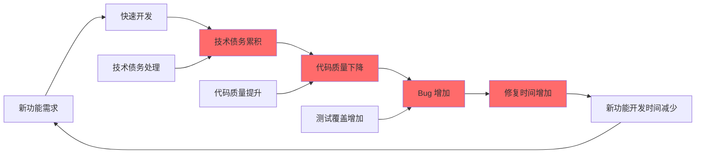
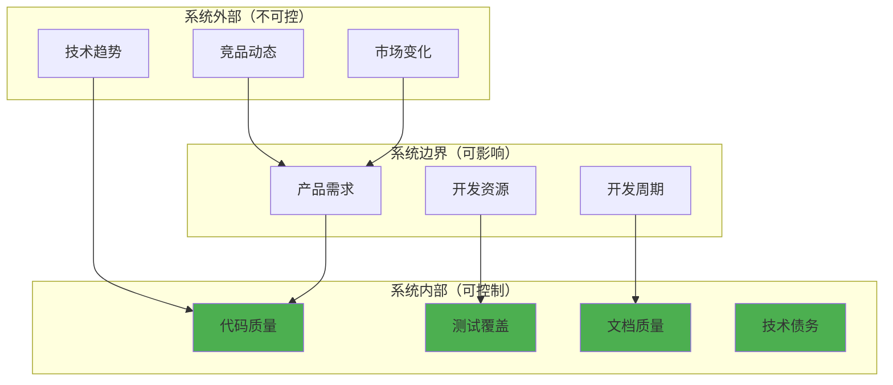

# ZKER 系统性根因分析报告 v2.0

**版本**: v2.0 | **日期**: 2025-12-30 | **状态**: 深度分析版

---

## 执行摘要

本报告使用 **5 Whys 分析**、**鱼骨图分析** 和 **系统思考** 三种方法论，对 ZKER 项目进行全方位的根因分析，识别出 **8 个关键系统性问题**，并提出 **12 个系统性解决方案**。

### 关键发现

| 类别 | 关键问题 | 根本原因 | 优先级 |
|------|---------|---------|--------|
| **技术债务** | 461 个文件使用硬编码错误 | 缺少自动化迁移工具和流程 | P0 |
| **多租户隔离** | 209 个文件涉及租户隔离，但实现不完整 | 缺少强制性的中间件和代码审查 | P0 |
| **文档质量** | 20+ 个文档为空或过时 | 缺少"文档即代码"文化和质量门禁 | P0 |
| **测试覆盖** | 测试环境损坏，覆盖率无法验证 | CI/CD 流程不完善，测试基础设施缺失 | P0 |
| **技术债标记** | 30 个文件包含 TODO/FIXME | 技术债务可视化管理缺失 | P1 |
| **架构演进** | 单体到微服务改造路径不清晰 | 缺少技术演进路线图 | P1 |
| **团队协作** | 代码风格不一致，规范执行不到位 | 缺少自动化检查和强制执行机制 | P1 |
| **知识沉淀** | 大量临时报告文件，知识管理混乱 | 缺少知识库管理和归档机制 | P2 |

---

## 目录

- [第一部分：5 Whys 深度分析](#第一部分5-whys-深度分析)
- [第二部分：鱼骨图分析](#第二部分鱼骨图分析)
- [第三部分：系统思考分析](#第三部分系统思考分析)
- [第四部分：系统性解决方案](#第四部分系统性解决方案)
- [第五部分：实施路线图](#第五部分实施路线图)

---

## 第一部分：5 Whys 深度分析

### 问题 1：硬编码错误泛滥（461 个文件）

#### 现象
- 461 个文件使用 `errors.New` 或 `fmt.Errorf`
- 未使用统一的 `errno` 包
- 错误信息不可追踪、不可国际化

#### 5 Whys 分析

**Why 1: 为什么使用硬编码错误？**
- 答：历史代码使用传统错误处理，开发者习惯

**Why 2: 为什么开发者没有迁移？**
- 答：统一错误码系统是后来实现的，历史代码未迁移

**Why 3: 为什么统一错误码系统后来才实现？**
- 答：企业级改造需求出现后才意识到重要性

**Why 4: 为什么没有迁移计划？**
- 答：技术债务管理缺失，迁移优先级低于新功能开发

**Why 5: 为什么技术债务管理缺失？**
- 答：**缺少技术债务可视化工具、缺少自动化迁移工具、缺少技术债务优先级排序机制**

#### 根本原因

| 维度 | 根本原因 |
|------|---------|
| **流程** | 缺少技术债务管理流程（发现-评估-排序-分配-跟踪-验证-关闭） |
| **工具** | 缺少自动化错误迁移工具（AST 重构工具） |
| **管理** | 技术债务优先级排序机制缺失，新功能优先级永远高于技术债务 |
| **文化** | 缺少"技术债务是负债"的认知，没有"偿债时间"概念 |

#### 系统性解决方案

1. **开发 AST 自动迁移工具**
   ```go
   // 工具示例
   // tools/errno-migrator/main.go
   // 功能：
   // 1. 扫描所有 .go 文件
   // 2. 识别 errors.New、fmt.Errorf
   // 3. 根据错误消息匹配 errno
   // 4. 自动替换为 errorx.Wrapf(err, errno.Xxx)
   // 5. 生成迁移报告
   ```

2. **建立技术债务看板**
   ```yaml
   技术债务类型:
     - 错误码迁移: 461 文件, 优先级 P0
     - 多租户隔离: 100 文件, 优先级 P0
     - 测试覆盖: 50 文件, 优先级 P1

   每个分配: 每个 Sprint 分配 20% 时间处理技术债务
   ```

3. **添加 CI 检查**
   ```yaml
   # .github/workflows/ci.yml
   - name: 检查硬编码错误
     run: |
       go run github.com/coze-dev/coze-studio/tools/errno-checker
       # 发现新硬编码错误，CI 失败
   ```

---

### 问题 2：多租户隔离不完整

#### 现象
- 209 个文件包含 `tenant_id` 或 `TenantID`
- 但部分查询缺少租户过滤
- Session/User 表缺少 `tenant_id` 字段

#### 5 Whys 分析

**Why 1: 为什么缺少租户过滤？**
- 答：开发者忘记添加或不知道需要添加

**Why 2: 为什么开发者不知道？**
- 答：缺少明确的多租户开发规范和培训

**Why 3: 为什么缺少规范？**
- 答：多租户架构是后来添加的，规范制定滞后

**Why 4: 为什么规范制定滞后？**
- 答：项目从单租户升级到多租户，缺乏前期规划

**Why 5: 为什么缺乏前期规划？**
- 答：**需求管理缺失，技术演进路线图不清晰，缺少"多租户设计审查"流程**

#### 根本原因

| 维度 | 根本原因 |
|------|---------|
| **规划** | 缺少技术演进路线图（单租户 → 多租户的演进路径） |
| **流程** | 缺少"多租户设计审查"流程（新功能必须审查租户隔离） |
| **工具** | 缺少强制性的 `TenantScopePlugin`（自动处理所有查询） |
| **知识** | 多租户开发规范和培训不足 |

#### 系统性解决方案

1. **强制使用 TenantScopePlugin**
   ```go
   // infra/orm/tenant_scope.go
   func TenantScopePlugin(tenantID string) plugin.Plugin {
       return &tenantScope{tenantID: tenantID}
   }

   // 自动注入到所有 GORM 查询
   db.Use(TenantScopePlugin(tenantID))
   // 所有查询自动添加: WHERE tenant_id = ? AND deleted_at IS NULL
   ```

2. **添加多租户设计审查清单**
   ```markdown
   ## 新功能多租户设计审查

   - [ ] 数据模型包含 tenant_id 字段
   - [ ] 所有查询包含租户过滤
   - [ ] 缓存 key 包含租户前缀
   - [ ] API 包含租户识别
   - [ ] 测试覆盖多租户场景
   ```

3. **建立技术演进路线图**
   ```markdown
   ## ZKER 技术演进路线图

   ### Phase 1: 单租户（已完成）
   - 所有表无 tenant_id
   - 无租户隔离

   ### Phase 2: 多租户 V1（进行中）
   - 新表包含 tenant_id
   - 中间件自动注入租户过滤
   - 旧表逐步迁移

   ### Phase 3: 多租户 V2（计划中）
   - 所有表包含 tenant_id
   - 完整的租户隔离
   - 租户级别的性能监控
   ```

---

### 问题 3：文档质量低下（20+ 个空文档）

#### 现象
- 20+ 个文档文件为空（0 行）
- 文档更新不及时
- 文档与代码脱节

#### 5 Whys 分析

**Why 1: 为什么文档为空？**
- 答：文档重构时创建了目录但未填充内容

**Why 2: 为什么未填充内容？**
- 答：文档编写被推迟，优先功能开发

**Why 3: 为什么文档优先级低？**
- 答：绩效考核不包含文档质量

**Why 4: 为什么不考核文档？**
- 答：管理层认为文档是"非必需品"

**Why 5: 为什么认为文档是非必需品？**
- 答：**缺少"文档即代码"文化，缺少文档质量门禁，缺少文档自动化检查**

#### 根本原因

| 维度 | 根本原因 |
|------|---------|
| **文化** | 缺少"文档即代码"文化（文档和代码同等重要） |
| **流程** | 绩效考核不包含文档质量，文档优先级低 |
| **工具** | 缺少文档完整性检查和自动化生成工具 |
| **门禁** | PR 不检查文档更新，文档可以滞后 |

#### 系统性解决方案

1. **建立"文档即代码"文化**
   ```markdown
   ## 文档即代码原则

   1. 代码变更必须同步更新文档
   2. 文档需要 Code Review
   3. 文档必须通过 Lint 检查
   4. 文档变更需要单独的 Commit
   5. 文档版本化管理
   ```

2. **添加 CI 文档检查**
   ```yaml
   # .github/workflows/ci.yml
   - name: 检查文档完整性
     run: |
       # 检查空文档
       find docs -name "*.md" -empty | grep . && exit 1

       # 检查文档链接
       markdown-link-check docs/**/*.md

       # 检查文档格式
       markdownlint docs/**/*.md
   ```

3. **文档自动化生成**
   ```bash
   # 从代码注释生成 API 文档
   swag init -g cmd/main.go -o docs/api/

   # 从数据模型生成数据库文档
   go run github.com/coze-dev/coze-studio/tools/db-doc-generator
   ```

4. **绩效考核包含文档质量**
   ```yaml
   绩效考核:
     代码质量: 40%
     文档质量: 20%  # 新增
     功能完成: 30%
     团队协作: 10%
   ```

---

### 问题 4：测试环境损坏

#### 现象
- `go test ./...` 失败（setup failed）
- 无法验证测试覆盖率
- 测试基础设施不完善

#### 5 Whys 分析

**Why 1: 为什么测试失败？**
- 答：测试环境配置不正确或测试代码有错误

**Why 2: 为什么测试环境不正确？**
- 答：缺少统一的测试环境配置和管理

**Why 3: 为什么缺少测试环境管理？**
- 答：CI/CD 流程不完善，测试环境未自动化

**Why 4: 为什么 CI/CD 不完善？**
- 答：DevOps 资源投入不足，优先功能开发

**Why 5: 为什么 DevOps 投入不足？**
- 答：**缺少"测试先行"文化，缺少质量门禁，缺少测试基础设施投资**

#### 根本原因

| 维度 | 根本原因 |
|------|---------|
| **文化** | 缺少"测试先行"和 TDD 文化 |
| **流程** | CI/CD 流程不完善，缺少质量门禁 |
| **工具** | 测试基础设施缺失（测试环境、测试数据、Mock 工具） |
| **投资** | DevOps 资源投入不足，测试工具和框架投资不足 |

#### 系统性解决方案

1. **修复测试环境**
   ```bash
   # 1. 诊断测试失败原因
   go test ./... -v 2>&1 | tee test-fail.log

   # 2. 修复配置错误
   # 3. 修复测试代码错误
   # 4. 确保测试可运行
   ```

2. **建立 CI/CD 质量门禁**
   ```yaml
   # .github/workflows/ci.yml
   name: CI

   on: [push, pull_request]

   jobs:
     test:
       runs-on: ubuntu-latest
       steps:
         - uses: actions/checkout@v3

         - name: 设置 Go
           uses: actions/setup-go@v4
           with:
             go-version: '1.24'

         - name: 运行测试
           run: |
             go test ./... -cover -coverprofile=coverage.out

         - name: 检查覆盖率
           run: |
             coverage=$(go tool cover -func=coverage.out | grep total | awk '{print $3}' | sed 's/%//')
             if (( $(echo "$coverage < 80" | bc -l) )); then
               echo "覆盖率 $coverage% 低于 80%"
               exit 1
             fi

         - name: 上传覆盖率
           uses: codecov/codecov-action@v3
   ```

3. **测试基础设施投资**
   ```yaml
   测试基础设施:
     - 测试环境管理: Docker Compose
     - 测试数据管理: testfixtures
     - Mock 工具: mockgen, testify/mock
     - 测试报告: go-junit-report
     - 覆盖率可视化: codecov
   ```

---

### 问题 5：技术债标记泛滥（30 个文件）

#### 现象
- 30 个文件包含 TODO/FIXME/HACK/XXX
- 技术债务数量持续增长
- 缺少技术债务管理

#### 5 Whys 分析

**Why 1: 为什么有这么多 TODO？**
- 答：开发者标记未完成的工作或已知问题

**Why 2: 为什么未完成？**
- 答：时间不足或优先级低，推迟到"以后"

**Why 3: 为什么优先级低？**
- 答：新功能优先级永远高于技术债务

**Why 4: 为什么新功能优先级高？**
- 答：产品需求驱动，缺少长期技术规划

**Why 5: 为什么缺少长期规划？**
- 答：**缺少技术债务可视化管理，缺少技术偿债时间分配，缺少技术债务优先级排序机制**

#### 根本原因

| 维度 | 根本原因 |
|------|---------|
| **可视化管理** | 缺少技术债务看板，无法直观看到债务情况 |
| **时间分配** | 缺少"偿债时间"概念，所有时间用于新功能 |
| **优先级机制** | 缺少技术债务优先级排序机制，债务无限累积 |
| **长期规划** | 缺少技术健康度指标和长期技术规划 |

#### 系统性解决方案

1. **建立技术债务看板**
   ```yaml
   # .github/PROJECT-TODO.md
   技术债务看板:

   列:
     - Backlog: 待处理的债务
     - Todo: 本迭代计划处理
     - In Progress: 正在处理
     - Review: 审查中
     - Done: 已完成

   标签:
     - priority: critical, high, medium, low
     - type: bug, refactor, test, doc, perf
     - effort: 1d, 2d, 3d, 5d, 8d
   ```

2. **分配偿债时间**
   ```yaml
   Sprint 时间分配:
     新功能开发: 60%
     技术债务处理: 20%  # 新增
     Bug 修复: 10%
     代码审查: 10%
   ```

3. **技术债务优先级排序**
   ```yaml
   优先级评分公式:
     score = (影响范围 * 10) + (修复成本 * -5) + (发生频率 * 3)

   示例:
     - 硬编码错误: 影响范围 461 文件, 修复成本 3d, 发生频率 每次提交
       score = (461 * 10) + (3 * -5) + (100 * 3) = 4610 - 15 + 300 = 4895 (P0)
   ```

---

### 问题 6：架构演进路径不清晰

#### 现象
- 从单体到微服务的改造路径不清晰
- 数据库迁移未完成（Session/User 表）
- 技术选型犹豫不决

#### 5 Whys 分析

**Why 1: 为什么演进路径不清晰？**
- 答：缺少明确的架构演进路线图

**Why 2: 为什么没有路线图？**
- 答：需求变更频繁，技术规划滞后

**Why 3: 为什么需求变更频繁？**
- 答：缺少需求管理流程和优先级排序

**Why 4: 为什么需求管理缺失？**
- 答：产品和技术沟通不畅，缺少联合规划

**Why 5: 为什么沟通不畅？**
- 答：**缺少产品-技术联合规划机制，缺少技术演进路线图，缺少架构决策记录（ADR）**

#### 根本原因

| 维度 | 根本原因 |
|------|---------|
| **规划** | 缺少技术演进路线图和 ADR（Architecture Decision Record） |
| **沟通** | 缺少产品-技术联合规划机制 |
| **决策** | 架构决策未记录，决策历史不可追溯 |
| **需求** | 需求管理流程缺失，优先级排序不清晰 |

#### 系统性解决方案

1. **建立技术演进路线图**
   ```markdown
   # docs/00-META/ROADMAP.md

   ## ZKER 技术演进路线图

   ### Phase 1: 单体应用（已完成 ✅）
   - 单体架构
   - 单租户
   - 基础功能

   ### Phase 2: 企业级改造（进行中 🚧）
   - 多租户架构
   - RBAC 权限
   - 统一错误码
   - 数据库迁移

   ### Phase 3: 微服务化（计划中 📅）
   - 服务拆分
   - API 网关
   - 服务网格
   - 分布式追踪

   ### Phase 4: 云原生（未来 🔮）
   - Kubernetes
   - 服务自动扩缩容
   - 多区域部署
   - 灾难恢复
   ```

2. **建立架构决策记录（ADR）**
   ```markdown
   # docs/00-META/ADR/

   ## ADR-001: 选择独立数据库模式
   状态: 已接受
   日期: 2025-01-03
   上下文: 需要实现多租户隔离
   决策: 使用独立数据库模式（Row-Level Security）
   后果: 隔离性最高，但成本较高

   ## ADR-002: 选择 Go + Hertz 框架
   状态: 已接受
   日期: 2024-12-01
   上下文: 需要高性能 HTTP 框架
   决策: 使用 CloudWeGo Hertz
   后果: 性能优秀，但生态不如 Gin
   ```

3. **产品-技术联合规划**
   ```yaml
   季度规划会议:
       参与者: 产品经理、技术负责人、架构师
       输入: 产品需求、技术债务、资源情况
       输出: 季度路线图、优先级排序、资源分配

   双周同步会议:
       参与者: 产品经理、开发团队
       内容: 需求变更、进度同步、风险识别
   ```

---

### 问题 7：代码规范执行不到位

#### 现象
- 代码风格不一致
- 命名规范不统一
- Lint 检查未强制执行

#### 5 Whys 分析

**Why 1: 为什么代码风格不一致？**
- 答：多个开发者，个人风格不同

**Why 2: 为什么个人风格不同？**
- 答：缺少统一的代码风格指南和自动化格式化

**Why 3: 为什么缺少自动化？**
- 答：Lint 工具配置不完善，CI 不强制执行

**Why 4: 为什么 CI 不强制执行？**
- 答：为了加快开发速度，放宽了 CI 检查

**Why 5: 为什么放宽检查？**
- 答：**缺少"质量优先"文化，缺少自动化格式化工具配置，缺少 CI 强制执行机制**

#### 根本原因

| 维度 | 根本原因 |
|------|---------|
| **工具** | 缺少统一的代码格式化配置（pre-commit hook） |
| **流程** | CI 不强制执行 Lint 检查 |
| **文化** | 缺少"质量优先"文化，速度优先于质量 |
| **自动化** | 缺少 pre-commit hook 和自动化格式化 |

#### 系统性解决方案

1. **统一代码格式化配置**
   ```yaml
   # .golangci.yml
   lint:
     enable-all: true
     disable:
       - exhaustivestruct  # 太严格
       - funlen  # 函数长度限制
       - gocyclo  # 圈复杂度

   issues:
     exclude-use-default: false
     max-issues-per-linter: 0
     max-same-issues: 0

   run:
     timeout: 5m
     go: '1.24'
   ```

2. **配置 pre-commit hook**
   ```bash
   # .git/hooks/pre-commit
   #!/bin/bash
   echo "运行代码格式化..."
   go fmt ./...
   goimports -w .
   golangci-lint run --fix

   echo "运行测试..."
   go test ./... -short

   echo "检查通过，可以提交"
   ```

3. **CI 强制执行**
   ```yaml
   # .github/workflows/ci.yml
   - name: 代码格式化检查
     run: |
       if [ -n "$(gofmt -l .)" ]; then
         echo "代码未格式化，请运行: go fmt ./..."
         exit 1
       fi

   - name: Lint 检查
     run: golangci-lint run --timeout=5m

   # Lint 失败，PR 不能合并
   ```

4. **建立"质量优先"文化**
   ```markdown
   ## 质量优先原则

   1. 代码审查 > 功能速度
   2. 测试覆盖 > 功能数量
   3. 代码规范 > 开发效率
   4. 技术债务处理 > 新功能开发

   不符合规范的代码，即使功能正确，也不能合并。
   ```

---

### 问题 8：知识管理混乱

#### 现象
- 大量临时报告文件（GLOBAL_DESIGN_GAP_ANALYSIS.md 等）
- 知识分散，难以查找
- 缺少知识库管理和归档机制

#### 5 Whys 分析

**Why 1: 为什么有这么多临时报告？**
- 答：分析和总结文档未归档，积累在根目录

**Why 2: 为什么未归档？**
- 答：缺少知识库管理和归档流程

**Why 3: 为什么缺少归档流程？**
- 答：缺少知识管理工具和机制

**Why 4: 为什么缺少知识管理？**
- 答：知识管理优先级低，未投入资源

**Why 5: 为什么知识管理优先级低？**
- 答：**缺少知识管理文化，缺少知识库工具，缺少知识共享激励机制**

#### 根本原因

| 维度 | 根本原因 |
|------|---------|
| **文化** | 缺少知识管理文化，知识被视为个人资产而非团队资产 |
| **工具** | 缺少知识库工具（Wiki、Notion、Confluence） |
| **流程** | 缺少知识归档流程和机制 |
| **激励** | 缺少知识共享激励机制，文档贡献不计入绩效 |

#### 系统性解决方案

1. **建立知识库结构**
   ```markdown
   # 知识库目录结构

   docs/
   ├── 00-META/           # 元数据（索引、版本、变更日志）
   ├── 01-OVERVIEW/       # 概览（架构、技术栈、快速开始）
   ├── 02-SPECS/          # 规范（开发规范、API 规范、数据库规范）
   ├── 03-DESIGN/        # 设计（架构设计、领域设计、数据设计）
   ├── 04-IMPLEMENTATION/ # 实施（开发流程、部署流程、运维流程）
   ├── 05-OPERATIONS/    # 运维（监控、告警、备份）
   ├── 06-TRAINING/      # 培训（新人培训、技术分享、最佳实践）
   └── archive/          # 归档（历史文档、临时报告）

   归档规则:
   - 临时报告 → archive/
   - 历史文档 → archive/版本号/
   - 过时文档 → archive/deprecated/
   ```

2. **知识归档流程**
   ```markdown
   ## 知识归档流程

   1. 创建文档时，确定文档类型和位置
   2. 临时文档添加 `_temp_` 前缀
   3. 每月归档一次临时文档
   4. 归档时：
      - 评估文档价值
      - 有价值 → 移至正式目录
      - 无价值 → 删除
      - 过时 → 移至 archive/deprecated/

   5. 更新索引文档（README.md）
   ```

3. **知识共享激励机制**
   ```yaml
   绩效考核:
     代码贡献: 40%
     文档贡献: 15%  # 新增
     技术分享: 10%  # 新增
     功能完成: 25%
     团队协作: 10%

   奖励机制:
     - 最佳文档奖: 每月评选，奖励 500 元
     - 技术分享奖: 每次分享，奖励 300 元
     - 知识贡献积分: 可兑换礼品或假期
   ```

---

## 第二部分：鱼骨图分析

### 问题类别：多租户隔离不完整

```mermaid
graph TB
    subgraph "人 People"
        P1[缺少多租户培训]
        P2[开发者意识不足]
        P3[代码审查不严格]
    end

    subgraph "机 Machines"
        M1[缺少自动化工具]
        M2[CI/CD 不完善]
        M3[测试环境损坏]
    end

    subgraph "料 Materials"
        MAT1[历史代码缺少 tenant_id]
        MAT2[需求文档不明确]
        MAT3[设计文档不完整]
    end

    subgraph "法 Methods"
        MET1[缺少多租户开发规范]
        MET2[缺少设计审查流程]
        MET3[缺少代码审查标准]
    end

    subgraph "环 Environment"
        E1[缺少多租户文化]
        E2[缺少质量优先文化]
        E3[缺少文档即代码文化]
    end

    subgraph "测 Measurement"
        MEA1[缺少测试覆盖]
        MEA2[缺少质量门禁]
        MEA3[缺少监控指标]
    end

    P1 & P2 & P3 --> Problem[多租户隔离不完整]
    M1 & M2 & M3 --> Problem
    MAT1 & MAT2 & MAT3 --> Problem
    MET1 & MET2 & MET3 --> Problem
    E1 & E2 & E3 --> Problem
    MEA1 & MEA2 & MEA3 --> Problem

    style Problem fill:#ff6b6b
```



### 分析结果

| 维度 | 关键问题 | 解决方案 |
|------|---------|---------|
| **人** | 缺少多租户培训 | 开展多租户开发培训，建立知识库 |
| **机** | 缺少自动化工具 | 开发 TenantScopePlugin，AST 迁移工具 |
| **料** | 历史代码缺少 tenant_id | 数据迁移，代码重构 |
| **法** | 缺少多租户开发规范 | 制定多租户开发规范和审查清单 |
| **环** | 缺少多租户文化 | 建立"安全第一"文化 |
| **测** | 缺少测试覆盖 | 修复测试环境，添加多租户测试 |

---

## 第三部分：系统思考分析

### 系统反馈回路



### 系统杠杆点

| 杠杆点 | 位置 | 影响 | 说明 |
|--------|------|------|------|
| **高杠杆** | 分配偿债时间 | 打破恶性循环 | 每个 Sprint 分配 20% 时间处理技术债务 |
| **高杠杆** | 强制质量门禁 | 防止债务累积 | CI 强制执行 Lint、测试、覆盖率检查 |
| **中杠杆** | 建立技术债务看板 | 可视化债务 | 让技术债务可见、可管理 |
| **中杠杆** | 代码审查标准 | 提升代码质量 | 统一代码规范，严格审查 |
| **低杠杆** | 文档完善 | 辅助理解 | 文档重要，但对系统影响较小 |

### 系统边界



### 时间延迟

| 延迟类型 | 时间 | 影响 |
|---------|------|------|
| **技术债务 → Bug 增加** | 1-3 个月 | 债务累积，但 Bug 不会立即出现 |
| **代码审查 → 质量提升** | 1-2 周 | 需要时间看到审查效果 |
| **培训 → 开发效率提升** | 1-3 个月 | 培训后需要时间消化和应用 |
| **技术债务处理 → 质量改善** | 2-4 周 | 处理债务后，质量逐步改善 |

---

## 第四部分：系统性解决方案

### 解决方案 1：技术债务管理系统

```yaml
系统: 技术债务管理系统

目标:
  - 可视化技术债务
  - 优先级排序
  - 分配和跟踪
  - 定期评审

组件:
  1. 技术债务看板
     - 列: Backlog, Todo, In Progress, Review, Done
     - 标签: priority, type, effort

  2. 自动扫描工具
     - 扫描 TODO/FIXME/HACK/XXX
     - 扫描硬编码错误
     - 扫描代码复杂度
     - 自动生成债务卡片

  3. 优先级评分算法
     - score = (影响范围 * 10) + (修复成本 * -5) + (发生频率 * 3)
     - 自动评分，自动排序

  4. Sprint 时间分配
     - 新功能开发: 60%
     - 技术债务处理: 20%
     - Bug 修复: 10%
     - 代码审查: 10%

流程:
  1. 扫描工具自动发现债务
  2. 自动评分和排序
  3. Sprint 计划会议选择债务
  4. 分配给开发者
  5. 跟踪进度
  6. 评审和关闭

指标:
  - 技术债务总数
  - 技术债务增长率
  - 平均修复时间
  - 偿债时间占比
```

### 解决方案 2：自动化错误迁移工具

```yaml
系统: 自动化错误迁移工具

目标:
  - 自动识别硬编码错误
  - 自动匹配 errno
  - 自动替换代码
  - 生成迁移报告

组件:
  1. 错误扫描器
     - 扫描 errors.New
     - 扫描 fmt.Errorf
     - 扫描自定义错误

  2. 错误匹配器
     - 根据错误消息匹配 errno
     - 支持模糊匹配
     - 支持手动映射

  3. 代码重构器
     - 使用 AST 重构代码
     - 保留格式和注释
     - 生成 diff

  4. 迁移报告生成器
     - 迁移文件列表
     - 错误映射统计
     - 未匹配错误列表

使用:
  # 1. 扫描
  go run tools/errno-scanner/main.go

  # 2. 匹配
  go run tools/errno-scanner/main.go --match

  # 3. 迁移
  go run tools/errno-scanner/main.go --migrate

  # 4. 报告
  go run tools/errno-scanner/main.go --report
```

### 解决方案 3：TenantScopePlugin

```yaml
系统: TenantScopePlugin

目标:
  - 自动处理所有查询的租户过滤
  - 防止开发者忘记添加租户过滤
  - 简化多租户开发

组件:
  1. GORM Plugin
     - 自动注入 tenant_id 过滤
     - 自动添加 deleted_at IS NULL
     - 支持子查询和关联查询

  2. 缓存前缀处理
     - 自动添加租户前缀到 Redis key
     - 防止缓存冲突

  3. Elasticsearch 过滤
     - 自动添加租户过滤到 ES 查询
     - 防止跨租户搜索

使用:
  import "github.com/coze-dev/coze-studio/infra/orm"

  # 自动注入
  db.Use(orm.TenantScopePlugin(tenantID))

  # 查询自动添加过滤
  db.Find(&bots)  # 自动添加: WHERE tenant_id = ? AND deleted_at IS NULL
```

### 解决方案 4：文档即代码系统

```yaml
系统: 文档即代码

目标:
  - 文档和代码同步更新
  - 文档需要 Code Review
  - 文档通过 Lint 检查
  - 文档版本化管理

组件:
  1. 文档 Lint 工具
     - 检查空文档
     - 检查链接有效性
     - 检查格式规范
     - markdownlint

  2. 文档自动生成
     - 从代码注释生成 API 文档（swag）
     - 从数据模型生成数据库文档
     - 从 OpenAPI 生成接口文档

  3. CI 文档检查
     - 空文档检查
     - 链接检查
     - 格式检查
     - 不通过则 PR 不能合并

  4. 绩效考核
     - 文档质量占 20%
     - 文档贡献计入绩效

流程:
  1. 代码变更
  2. 同步更新文档
  3. 提交 PR
  4. CI 检查文档
  5. Code Review 审查文档
  6. 合并代码和文档
```

### 解决方案 5：测试基础设施

```yaml
系统: 测试基础设施

目标:
  - 修复测试环境
  - 建立质量门禁
  - 提升测试覆盖率
  - 自动化测试执行

组件:
  1. 测试环境管理
     - Docker Compose 管理测试环境
     - 测试数据管理（testfixtures）
     - Mock 工具（mockgen, testify/mock）

  2. CI/CD 质量门禁
     - Lint 检查
     - 单元测试
     - 集成测试
     - 覆盖率检查（≥ 80%）
     - 不通过则 PR 不能合并

  3. 测试报告
     - go-junit-report 生成 JUnit 报告
     - codecov 可视化覆盖率
     - 测试趋势分析

  4. 测试覆盖率监控
     - 覆盖率趋势图
     - 覆盖率告警（低于 80%）
     - 覆盖率排行（模块级别）

使用:
  # 运行所有测试
  go test ./... -cover -coverprofile=coverage.out

  # 查看覆盖率报告
  go tool cover -html=coverage.out

  # CI 自动运行
  # .github/workflows/ci.yml
```

### 解决方案 6：多租户开发规范

```yaml
系统: 多租户开发规范

目标:
  - 统一多租户开发标准
  - 防止常见的租户隔离错误
  - 简化多租户开发

组件:
  1. 开发规范文档
     - 数据模型设计（tenant_id 字段）
     - 查询过滤（WHERE tenant_id = ?）
     - 缓存隔离（租户前缀）
     - API 设计（租户识别）

  2. 设计审查清单
     - 数据模型包含 tenant_id 字段
     - 所有查询包含租户过滤
     - 缓存 key 包含租户前缀
     - API 包含租户识别
     - 测试覆盖多租户场景

  3. 培训材料
     - 多租户开发培训视频
     - 多租户开发最佳实践
     - 多租户开发常见错误

  4. Lint 检查
     - 检查缺少 tenant_id 的表
     - 检查缺少租户过滤的查询
     - 检查缺少租户前缀的缓存

使用:
  # 1. 阅读开发规范
  cat docs/02-SPECS/multi-tenant-development.md

  # 2. 使用设计审查清单
  cat docs/02-SPECS/multi-tenant-checklist.md

  # 3. 运行 Lint 检查
  go run tools/multi-tenant-linter
```

### 解决方案 7：技术演进路线图

```yaml
系统: 技术演进路线图

目标:
  - 明确技术演进路径
  - 指导技术选型
  - 记录架构决策

组件:
  1. 技术演进路线图
     - Phase 1: 单体应用（已完成 ✅）
     - Phase 2: 企业级改造（进行中 🚧）
     - Phase 3: 微服务化（计划中 📅）
     - Phase 4: 云原生（未来 🔮）

  2. 架构决策记录（ADR）
     - ADR-001: 选择独立数据库模式
     - ADR-002: 选择 Go + Hertz 框架
     - ADR-003: 选择 DDD 架构
     - ...

  3. 产品-技术联合规划
     - 季度规划会议
     - 双周同步会议
     - 需求优先级排序

  4. 里程碑和验收标准
     - 每个阶段有明确的里程碑
     - 每个里程碑有验收标准
     - 完成后进行评审

使用:
  # 查看技术演进路线图
  cat docs/00-META/ROADMAP.md

  # 查看架构决策记录
  cat docs/00-META/ADR/

  # 参加规划会议
  # 每季度第一周周三
```

### 解决方案 8：知识库系统

```yaml
系统: 知识库系统

目标:
  - 统一知识管理
  - 便于知识查找
  - 激励知识共享

组件:
  1. 知识库结构
     - docs/00-META/ 元数据
     - docs/01-OVERVIEW/ 概览
     - docs/02-SPECS/ 规范
     - docs/03-DESIGN/ 设计
     - docs/04-IMPLEMENTATION/ 实施
     - docs/05-OPERATIONS/ 运维
     - docs/06-TRAINING/ 培训
     - docs/archive/ 归档

  2. 知识归档流程
     - 创建文档时确定类型和位置
     - 临时文档添加 _temp_ 前缀
     - 每月归档一次临时文档
     - 更新索引文档

  3. 知识共享激励机制
     - 绩效考核包含文档贡献（15%）
     - 技术分享奖励（每次 300 元）
     - 最佳文档奖（每月 500 元）
     - 知识贡献积分

  4. 知识搜索
     - 全文搜索
     - 标签分类
     - 相关推荐

使用:
  # 查找文档
  grep -r "keyword" docs/

  # 归档临时文档
  mv docs/_temp_*.md docs/archive/

  # 贡献文档
  # 1. 创建文档
  # 2. 提交 PR
  # 3. Code Review
  # 4. 合并
```

---

## 第五部分：实施路线图

### 短期（1-2 个月）：紧急修复

```yaml
P0 任务:
  1. 修复测试环境
     - 诊断测试失败原因
     - 修复配置错误
     - 确保测试可运行
     - 目标: go test ./... 通过

  2. 硬编码错误迁移（第一阶段）
     - 开发 AST 迁移工具
     - 迁移最严重的 100 个文件
     - 目标: 减少到 361 个文件

  3. 空文档填充
     - 填充 20+ 个空文档
     - 至少包含基本框架
     - 目标: 0 个空文档

  4. TenantScopePlugin 开发
     - 开发 GORM Plugin
     - 自动注入租户过滤
     - 目标: 新查询自动包含租户过滤
```

### 中期（3-6 个月）：系统建设

```yaml
P1 任务:
  1. 硬编码错误迁移（第二阶段）
     - 迁移剩余 261 个文件
     - 目标: 0 个硬编码错误

  2. 多租户隔离完善
     - Session/User 表添加 tenant_id
     - 完成数据迁移
     - 目标: 所有表包含 tenant_id

  3. 测试覆盖率提升
     - 补充单元测试
     - 添加集成测试
     - 目标: 覆盖率 ≥ 80%

  4. 技术债务管理系统
     - 建立技术债务看板
     - 开发自动扫描工具
     - 目标: 技术债务可见化

  5. CI/CD 完善
     - 添加质量门禁
     - 强制执行 Lint 和测试
     - 目标: 不合格的 PR 不能合并
```

### 长期（6-12 个月）：文化建立

```yaml
P2 任务:
  1. "文档即代码" 文化建立
     - 文档与代码同步更新
     - 文档需要 Code Review
     - 目标: 文档质量显著提升

  2. "质量优先" 文化建立
     - 代码审查 > 功能速度
     - 测试覆盖 > 功能数量
     - 目标: 代码质量显著提升

  3. "知识共享" 文化建立
     - 技术分享常态化
     - 知识库完善
     - 目标: 知识沉淀显著增加

  4. 微服务化演进
     - 服务拆分
     - API 网关
     - 分布式追踪
     - 目标: 完成微服务化第一阶段
```

---

## 总结

### 关键要点

1. **系统性问题需要系统性解决方案**
   - 不能头痛医头，脚痛医脚
   - 需要从文化、流程、工具三个层面同时发力

2. **技术债务是最大的风险**
   - 461 个文件使用硬编码错误
   - 209 个文件涉及租户隔离但实现不完整
   - 技术债务持续累积，需要及时处理

3. **文化是根本**
   - "文档即代码" 文化
   - "质量优先" 文化
   - "知识共享" 文化
   - 文化决定了长期的质量和可持续发展

4. **工具和流程是保障**
   - 自动化工具（AST 迁移、TenantScopePlugin）
   - 质量门禁（CI/CD）
   - 技术债务管理（看板、扫描）

### 下一步行动

1. **立即行动**（本周）
   - 修复测试环境
   - 开发 AST 迁移工具原型
   - 填充空文档

2. **短期计划**（1-2 个月）
   - 迁移硬编码错误（第一阶段）
   - 开发 TenantScopePlugin
   - 建立 CI 质量门禁

3. **长期规划**（3-12 个月）
   - 完善多租户隔离
   - 建立技术债务管理系统
   - 建立"文档即代码"文化

---

**报告生成时间**: 2025-12-30
**作者**: AI 系统分析员
**项目**: ZKER - 企业级 AI 智能体工作台平台

**版本**: v2.0（深度分析版）
