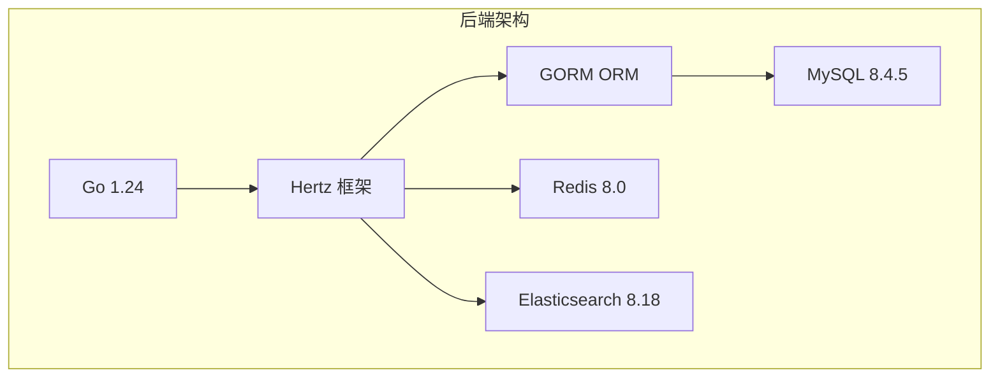
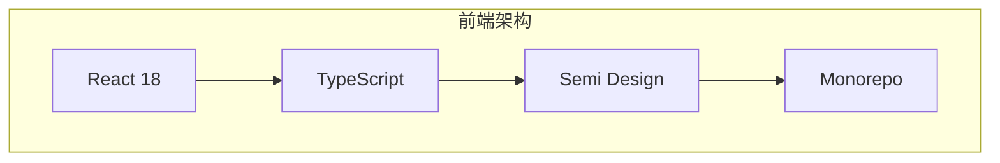
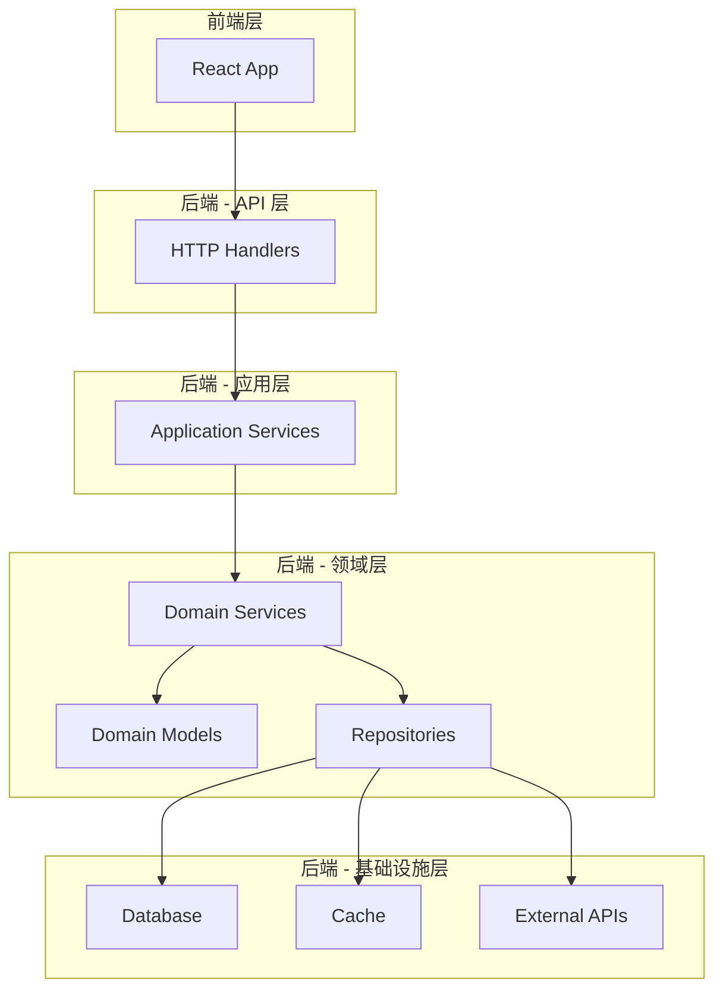

# ZKER 项目概览

**版本**: v3.0.0 | **更新**: 2025-01-03 | **状态**: 企业级功能完善阶段

---

## 项目定位

ZKER (企业级 AI 智能体工作台平台) 是一个基于 Coze Studio 的企业级多租户 SaaS 增强版本，目标是超越鲸智百应，打造 SaaS 行业标杆。

### 核心价值主张

| 价值 | 说明 |
|------|------|
| **企业级架构** | 完整的多租户隔离、RBAC 权限、智能路由 |
| **开发者友好** | CLI、SDK、API 文档齐全，开发体验一流 |
| **生产就绪** | 监控、告警、备份、灰度发布完善 |
| **性能卓越** | 支持 10000+ 并发，P95 延迟 < 200ms |

---

## 技术栈概览

### 后端技术栈



| 技术 | 版本 | 用途 |
|------|------|------|
| **Go** | 1.24 | 后端开发语言 |
| **Hertz** | Latest | HTTP 框架（字节跳动开源） |
| **GORM** | Latest | ORM 框架 |
| **MySQL** | 8.4.5 | 主数据库 |
| **Redis** | 8.0 | 缓存 + 会话 |
| **Elasticsearch** | 8.18 | 全文检索 |

### 前端技术栈



| 技术 | 版本 | 用途 |
|------|------|------|
| **React** | 18 | UI 框架 |
| **TypeScript** | 5.x | 类型安全 |
| **Semi Design** | Latest | 组件库 |
| **Rush** | Latest | Monorepo 管理 |

---

## 系统架构

### DDD 分层架构



### 核心模块

| 模块 | 说明 | 状态 |
|------|------|------|
| **多租户系统** | 完整的数据隔离、配额管理、订阅计费 | ✅ 已实现 |
| **RBAC 权限** | 5 级数据权限 + 3 级字段权限 | ✅ 已实现 |
| **智能路由** | 混合意图匹配 + 评分路由 | ✅ 已实现 |
| **Agent 监控** | 全链路追踪、质量评估、成本分析 | 🚧 开发中 |

---

## 快速开始

### 环境要求

```bash
# 后端
Go 1.24+
MySQL 8.4.5+
Redis 8.0+
Elasticsearch 8.18+

# 前端
Node.js 18+
npm 9+
```

### 一键启动

```bash
# 1. 启动中间件
cd docker && docker compose up -d

# 2. 启动后端
cd .. && make server

# 3. 启动前端
rush build && cd frontend/apps/coze-studio && npm run dev

# 4. 访问
open http://localhost:8888
```

详见: [quick-start.md](quick-start.md)

---

## 项目结构

### 后端目录结构

```
backend/
├── api/              # API层：HTTP 处理器
│   ├── handler/      # 请求处理器
│   ├── middleware/   # 中间件
│   └── router/       # 路由定义
│
├── application/      # 应用层：用例编排
│   ├── app/          # 应用服务
│   ├── conversation/ # 对话服务
│   └── workflow/     # 工作流服务
│
├── domain/          # 领域层：核心业务逻辑 ⭐
│   ├── tenant/      # 多租户（研发A 独占）
│   ├── permission/  # RBAC 权限（研发A 独占）
│   ├── routing/     # 智能路由（研发A 独占）
│   ├── agent/       # Agent 管理
│   ├── conversation/# 对话管理
│   ├── workflow/    # 工作流引擎
│   └── ...          # 其他领域
│
├── crossdomain/     # 跨域层：领域间接口
│   ├── agent/       # Agent 接口
│   ├── message/     # 消息接口
│   └── ...          # 其他接口
│
└── infra/           # 基础设施层
    ├── db/          # 数据库
    ├── cache/       # 缓存
    └── mq/          # 消息队列
```

### 前端目录结构

```
frontend/packages/
├── arch/              # Level-1：基础设施
│   ├── design-token/  # 设计令牌
│   ├── base/          # 基础样式
│   └── i18n/          # 国际化
│
├── common/            # Level-2：共享组件
│   ├── components/    # 通用组件
│   ├── hooks/         # 通用 Hooks
│   └── utils/         # 工具函数
│
├── agent-ide/         # Level-3：Agent IDE
├── workflow/          # Level-3：工作流
├── studio/            # Level-3：Studio
│   └── pages/
│       ├── tenant/    # 租户管理（研发C 独占）
│       └── permission/# 权限管理（研发C 独占）
│
└── apps/coze-studio/  # Level-4：主应用
```

---

## 核心功能

### 1. 多租户系统 (Multi-Tenant)

**功能特性**:
- 完整的数据隔离（Row-Level Security）
- 配额管理（Token、API 调用、存储）
- 订阅计费（按月/按年）
- 租户监控（资源使用、成本分析）

**技术实现**:
- 中间件自动注入 `tenant_id`
- 数据库查询自动过滤
- Redis 租户隔离

详见: [03-DESIGN/multi-tenant/](../03-DESIGN/multi-tenant/)

### 2. RBAC 权限系统

**功能特性**:
- 5 级数据权限（全部、部门、本人、无、自定义）
- 3 级字段权限（可见、可编辑、隐藏）
- 角色模板（管理员、开发者、访客）
- 动态权限引擎

**技术实现**:
- 中间件自动权限检查
- 前端组件级权限控制
- 权限缓存优化

详见: [03-DESIGN/rbac/](../03-DESIGN/rbac/)

### 3. 智能路由引擎

**功能特性**:
- 混合意图匹配（规则 + 相似度）
- 评分路由（多维度评分）
- 规则优先级
- 路由监控

**技术实现**:
- 规则匹配器（Rule Matcher）
- 相似度匹配器（Similarity Matcher）
- 评分引擎（Scoring Engine）

详见: [03-DESIGN/routing/](../03-DESIGN/routing/)

### 4. Agent 监控平台

**功能特性**:
- 全链路追踪（Trace）
- 质量评估（Quality）
- 成本分析（Cost）
- 性能监控（Performance）

**技术实现**:
- OpenTelemetry 集成
- Prometheus + Grafana
- 自定义指标采集

详见: [03-DESIGN/agent-monitoring/](../03-DESIGN/agent-monitoring/)

---

## 对标产品

| 功能 | ZKER | Dify | Langflow | FastGPT | 鲸智百应 |
|------|------|------|----------|---------|---------|
| **多租户隔离** | ✅ | ❌ | ❌ | ✅ | ⚠️ |
| **RBAC 权限** | ✅ 5 级 | ⚠️ 3 级 | ❌ | ⚠️ 2 级 | ⚠️ 3 级 |
| **智能路由** | ✅ 混合 | ⚠️ 规则 | ❌ | ⚠️ 规则 | ⚠️ 相似度 |
| **Agent 监控** | ✅ 全链路 | ⚠️ 基础 | ❌ | ⚠️ 基础 | ⚠️ 中等 |
| **开发者平台** | ✅ CLI+SDK | ✅ API | ⚠️ API | ⚠️ API | ⚠️ API |

**竞争优势**:
- ✅ 最完整的多租户隔离
- ✅ 最细粒度的 RBAC 权限（5 级数据 + 3 级字段）
- ✅ 最智能的路由引擎（混合匹配 + 评分）
- ✅ 最全的 Agent 监控（全链路 + 质量 + 成本）

---

## 开发团队

### 角色分工

| 角色 | 负责模块 | 独占目录 |
|------|---------|---------|
| **研发A（后端架构师）** | 多租户 + RBAC + 智能路由 | backend/domain/{tenant,permission,routing} |
| **研发B（后端工程师）** | 错误码 + 性能测试 + 监控 | backend/{types/errno,tests,infra/monitoring} |
| **研发C（前端工程师）** | 组件库 + 业务页面 | frontend/packages/{arch,business,studio/pages} |
| **研发D（DevOps）** | Docker + K8s + CI/CD | .github/workflows/, docker/, k8s/ |

### 开发规范

详见: [02-SPECS/README.md](../02-SPECS/README.md)

---

## 路线图

### v3.0.0 (当前) - 企业级功能完善

**已完成**:
- ✅ 多租户系统
- ✅ RBAC 权限系统
- ✅ 智能路由引擎
- ✅ 统一错误码系统

**进行中**:
- 🚧 Agent 监控平台
- 🚧 开发者平台 CLI
- 🚧 API 文档自动生成

**计划中**:
- 📋 灰度发布系统
- 📋 数据迁移工具
- 📋 性能优化

### v3.1.0 - Q2 2025

**计划**:
- 📋 工作流可视化增强
- 📋 多模态支持
- 📋 插件市场
- 📋 Bot 模板库

### v4.0.0 - Q3 2025

**计划**:
- 📋 分布式部署支持
- 📋 国际化（i18n）
- 📋 移动端支持
- 📋 AI 模型市场

---

## 相关文档

### 必读文档

| 文档 | 说明 |
|------|------|
| [architecture.md](architecture.md) | 系统架构详解 |
| [tech-stack.md](tech-stack.md) | 技术栈详解 |
| [quick-start.md](quick-start.md) | 快速开始指南 |

### 开发规范

| 文档 | 说明 |
|------|------|
| [02-SPECS/](../02-SPECS/) | 开发规范索引 |
| [backend-dev-guide.md](../02-SPECS/backend-dev-guide.md) | 后端开发指南 |
| [frontend-dev-guide.md](../02-SPECS/frontend-dev-guide.md) | 前端开发指南 |

### 设计文档

| 文档 | 说明 |
|------|------|
| [03-DESIGN/](../03-DESIGN/) | 设计文档索引 |
| [multi-tenant/](../03-DESIGN/multi-tenant/) | 多租户设计 |
| [rbac/](../03-DESIGN/rbac/) | RBAC 设计 |
| [routing/](../03-DESIGN/routing/) | 路由设计 |

---

## 联系方式

- **问题反馈**: [GitHub Issues](https://github.com/coze-dev/coze-studio/issues)
- **功能建议**: [GitHub Discussions](https://github.com/coze-dev/coze-studio/discussions)
- **团队联系**: zker-team@example.com

---

**🎯 目标**: 超越鲸智百应，打造企业级 SaaS AI 智能体工作台行业标杆！
