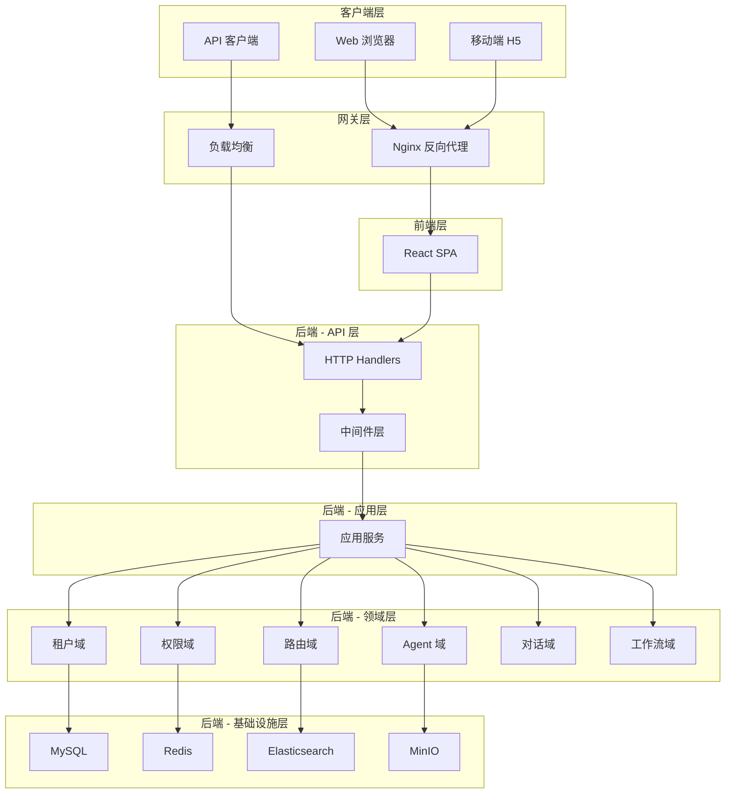
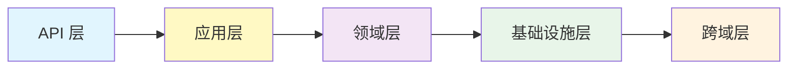
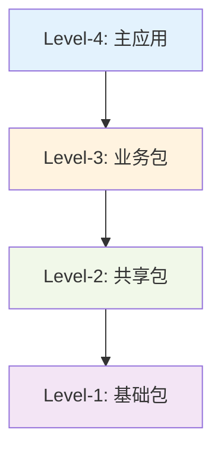
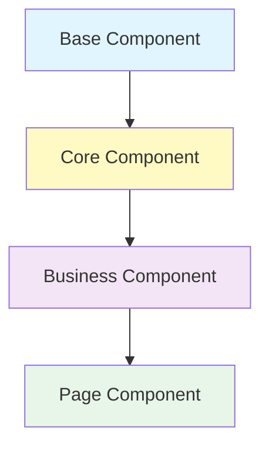
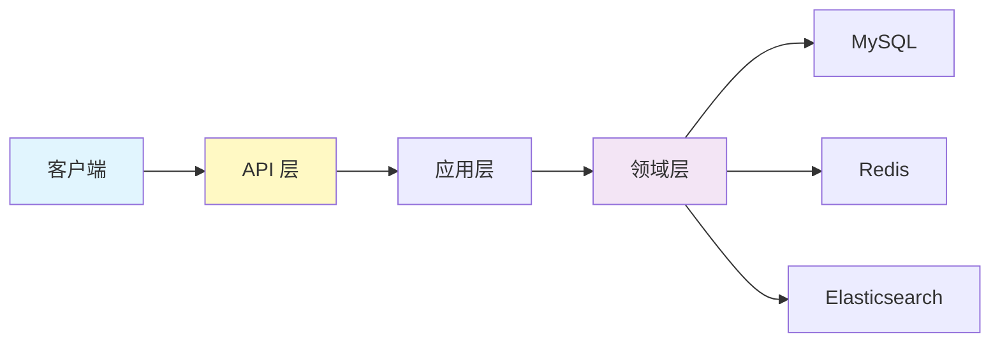
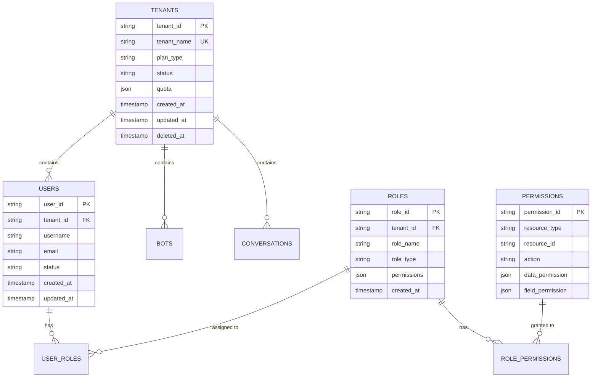
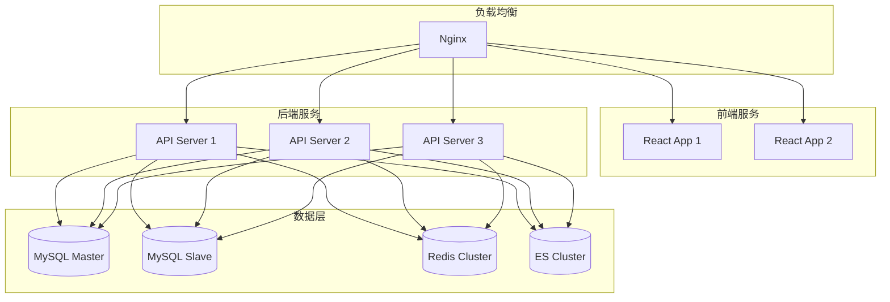
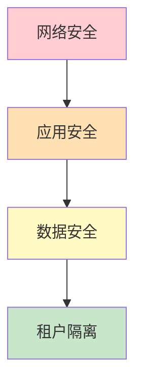

# ZKER 系统架构

**版本**: v3.0.0 | **更新**: 2025-01-03

---

## 目录

- [架构概览](#架构概览)
- [DDD 分层架构](#ddd-分层架构)
- [前端架构](#前端架构)
- [后端架构](#后端架构)
- [数据架构](#数据架构)
- [部署架构](#部署架构)
- [安全架构](#安全架构)

---

## 架构概览

### 整体架构图



### 架构设计原则

| 原则 | 说明 | 应用场景 |
|------|------|---------|
| **SOLID** | 单一职责、开闭原则、里氏替换、接口隔离、依赖倒置 | 领域层设计 |
| **KISS** | Keep It Simple, Stupid | 代码实现 |
| **DRY** | Don't Repeat Yourself | 公共组件抽取 |
| **YAGNI** | You Aren't Gonna Need It | 避免过度设计 |
| **Clean Architecture** | 依赖倒置，核心业务逻辑不依赖外部 | DDD 分层 |

---

## DDD 分层架构

### 后端分层模型



### 1. API 层 (api/)

**职责**: 处理 HTTP 请求，参数验证，响应封装

```
api/
├── handler/           # 请求处理器
│   └── coze/          # Coze API 处理器
│       ├── agent_run_service.go
│       ├── config_service.go
│       └── ...
├── middleware/        # 中间件
│   ├── tenant_isolation.go  # 租户隔离中间件
│   ├── permission_check.go  # 权限检查中间件
│   ├── session.go           # 会话中间件
│   └── ...
└── router/            # 路由定义
    └── coze/
        └── api.go
```

**示例**:

```go
// api/handler/coze/tenant_service.go
package coze

import (
    "context"
    "github.com/cloudwego/hertz/pkg/app"
)

type TenantServiceHandler struct {
    tenantApp *application.TenantApplication
}

// CreateTenant 创建租户
// @router /api/v1/tenants [POST]
func (h *TenantServiceHandler) CreateTenant(ctx context.Context, c *app.RequestContext) {
    var req CreateTenantRequest
    if err := c.BindAndValidate(&req); err != nil {
        c.JSON(400, ErrorResponse(err))
        return
    }

    tenant, err := h.tenantApp.CreateTenant(ctx, &req)
    if err != nil {
        c.JSON(500, ErrorResponse(err))
        return
    }

    c.JSON(201, SuccessResponse(tenant))
}
```

### 2. 应用层 (application/)

**职责**: 编排用例，协调多个领域服务

```
application/
├── app/              # 应用服务
├── conversation/     # 对话应用服务
├── workflow/         # 工作流应用服务
├── tenant/           # 租户应用服务
└── permission/       # 权限应用服务
```

**示例**:

```go
// application/tenant/tenant.go
package tenant

import (
    "context"
    "backend/domain/tenant"
    "backend/domain/permission"
)

type TenantApplication struct {
    tenantRepo    tenant.Repository
    permissionSvc permission.Service
}

// CreateTenant 创建租户用例
func (app *TenantApplication) CreateTenant(ctx context.Context, req *CreateTenantRequest) (*tenant.Tenant, error) {
    // 1. 验证租户名称唯一性
    exists, err := app.tenantRepo.ExistsByName(ctx, req.Name)
    if err != nil {
        return nil, err
    }
    if exists {
        return nil, errno.TenantNameAlreadyExists
    }

    // 2. 创建租户
    t := &tenant.Tenant{
        TenantID:   uuid.New().String(),
        TenantName: req.Name,
        PlanType:   req.PlanType,
        Status:     tenant.StatusActive,
    }

    if err := app.tenantRepo.Create(ctx, t); err != nil {
        return nil, err
    }

    // 3. 初始化默认权限
    if err := app.permissionSvc.InitDefaultRoles(ctx, t.TenantID); err != nil {
        return nil, err
    }

    return t, nil
}
```

### 3. 领域层 (domain/)

**职责**: 核心业务逻辑，领域模型，业务规则

```
domain/
├── tenant/           # 租户域
│   ├── entity/       # 实体
│   ├── repository/   # 仓储接口
│   └── service/      # 领域服务
├── permission/       # 权限域
├── routing/          # 路由域
├── agent/            # Agent 域
├── conversation/     # 对话域
└── workflow/         # 工作流域
```

**示例**:

```go
// domain/tenant/entity/tenant.go
package entity

import "time"

// Tenant 租户实体
type Tenant struct {
    TenantID   string    `json:"tenant_id" gorm:"primaryKey"`
    TenantName string    `json:"tenant_name" gorm:"uniqueIndex;size:100;not null"`
    PlanType   string    `json:"plan_type" gorm:"size:20;not null;default:'free'"`
    Status     string    `json:"status" gorm:"size:20;not null;default:'active'"`
    Quota      *Quota    `json:"quota" gorm:"embedded;embeddedPrefix:quota_"`
    CreatedAt  time.Time `json:"created_at" gorm:"autoCreateTime"`
    UpdatedAt  time.Time `json:"updated_at" gorm:"autoUpdateTime"`
    DeletedAt  *time.Time `json:"deleted_at,omitempty" gorm:"index"`
}

// Quota 配额值对象
type Quota struct {
    MaxTokens     int64 `json:"max_tokens" gorm:"default:1000000"`
    MaxAPICalls   int64 `json:"max_api_calls" gorm:"default:10000"`
    MaxStorageGB  int64 `json:"max_storage_gb" gorm:"default:10"`
    UsedTokens    int64 `json:"used_tokens" gorm:"default:0"`
    UsedAPICalls  int64 `json:"used_api_calls" gorm:"default:0"`
    UsedStorageGB int64 `json:"used_storage_gb" gorm:"default:0"`
}

// IsActive 租户是否激活
func (t *Tenant) IsActive() bool {
    return t.Status == "active" && t.DeletedAt == nil
}

// CanUseToken 检查是否可以使用 Token
func (t *Tenant) CanUseToken(tokens int64) bool {
    return t.Quota.UsedTokens+tokens <= t.Quota.MaxTokens
}

// UseToken 使用 Token
func (t *Tenant) UseToken(tokens int64) error {
    if !t.CanUseToken(tokens) {
        return errno.QuotaExceeded
    }
    t.Quota.UsedTokens += tokens
    return nil
}
```

### 4. 基础设施层 (infra/)

**职责**: 外部系统交互，数据持久化

```
infra/
├── db/               # 数据库
│   ├── mysql/        # MySQL 实现
│   └── redis/        # Redis 实现
├── cache/            # 缓存
├── mq/               # 消息队列
└── logger/           # 日志
```

### 5. 跨域层 (crossdomain/)

**职责**: 定义领域间接口

```
crossdomain/
├── agent/            # Agent 接口
├── message/          # 消息接口
├── conversation/     # 对话接口
└── ...
```

---

## 前端架构

### 前端分层模型



### 包结构

```
frontend/packages/
├── arch/              # Level-1：基础设施
│   ├── design-token/  # 设计令牌（颜色、字体、间距）
│   ├── base/          # 基础样式（重置、通用类）
│   └── i18n/          # 国际化
│
├── common/            # Level-2：共享组件
│   ├── components/    # 通用组件（Button、Input 等）
│   ├── hooks/         # 通用 Hooks（useRequest、useModal 等）
│   └── utils/         # 工具函数（格式化、验证等）
│
├── agent-ide/         # Level-3：Agent IDE
│   ├── components/    # Agent 编辑器组件
│   ├── hooks/         # Agent 相关 Hooks
│   └── pages/         # Agent 页面
│
├── workflow/          # Level-3：工作流
│   ├── components/    # 工作流组件
│   ├── hooks/         # 工作流 Hooks
│   └── pages/         # 工作流页面
│
├── studio/            # Level-3：Studio
│   ├── components/    # Studio 组件
│   ├── hooks/         # Studio Hooks
│   └── pages/
│       ├── tenant/    # 租户管理（研发C 独占）
│       └── permission/# 权限管理（研发C 独占）
│
└── apps/coze-studio/  # Level-4：主应用
    ├── routes/        # 路由配置
    ├── layouts/       # 布局组件
    └── App.tsx        # 应用入口
```

### 组件设计模式



**示例**:

```typescript
// arch/base/components/Button/Button.tsx
// Level-1：基础组件
export const Button: React.FC<ButtonProps> = ({ children, ...props }) => {
  return <semi-ui.Button {...props}>{children}</semi-ui.Button>;
};

// common/components/TenantSelector/TenantSelector.tsx
// Level-2：共享组件
export const TenantSelector: React.FC = () => {
  const [tenants, setTenants] = useState<Tenant[]>([]);

  useEffect(() => {
    fetchTenants().then(setTenants);
  }, []);

  return <Select dataSource={tenants} />;
};

// studio/pages/tenant/TenantList/TenantList.tsx
// Level-3：业务组件
export const TenantList: React.FC = () => {
  const { data, loading } = useTenants();

  return <Table dataSource={data} loading={loading} />;
};
```

---

## 数据架构

### 数据流图



### 数据库设计

#### MySQL 数据库



#### Redis 数据结构

```
# 租户缓存
tenant:{tenant_id} -> Hash
  - name: "租户名称"
  - plan: "plan_type"
  - quota: "{...}"

# 用户会话
session:{session_id} -> Hash
  - user_id: "user_id"
  - tenant_id: "tenant_id"
  - roles: "[...]"
  - expires_at: "timestamp"

# 权限缓存
permission:{tenant_id}:{user_id} -> Set
  - "resource:action"
  - "bot:read"
  - "bot:write"

# 配额缓存
quota:{tenant_id} -> Hash
  - used_tokens: "1000000"
  - max_tokens: "10000000"
  - used_api_calls: "1000"
  - max_api_calls: "10000"
```

#### Elasticsearch 索引

```json
// 索引：bots
{
  "mappings": {
    "properties": {
      "tenant_id": { "type": "keyword" },
      "bot_id": { "type": "keyword" },
      "bot_name": { "type": "text" },
      "description": { "type": "text" },
      "tags": { "type": "keyword" },
      "status": { "type": "keyword" },
      "created_at": { "type": "date" }
    }
  }
}

// 索引：conversations
{
  "mappings": {
    "properties": {
      "tenant_id": { "type": "keyword" },
      "conversation_id": { "type": "keyword" },
      "bot_id": { "type": "keyword" },
      "title": { "type": "text" },
      "messages": { "type": "nested" },
      "created_at": { "type": "date" }
    }
  }
}
```

---

## 部署架构

### 生产环境部署



### Docker Compose 部署

```yaml
# docker-compose.yml
version: '3.8'

services:
  # 前端
  frontend:
    image: zker/frontend:latest
    ports:
      - "8888:80"
    depends_on:
      - backend

  # 后端
  backend:
    image: zker/backend:latest
    ports:
      - "8888:8888"
    environment:
      - MYSQL_HOST=mysql
      - REDIS_HOST=redis
    depends_on:
      - mysql
      - redis

  # MySQL
  mysql:
    image: mysql:8.4.5
    ports:
      - "3306:3306"
    environment:
      - MYSQL_ROOT_PASSWORD=password
      - MYSQL_DATABASE=zker
    volumes:
      - mysql-data:/var/lib/mysql

  # Redis
  redis:
    image: redis:8.0
    ports:
      - "6379:6379"
    volumes:
      - redis-data:/data

  # Elasticsearch
  elasticsearch:
    image: elasticsearch:8.18.0
    ports:
      - "9200:9200"
    environment:
      - discovery.type=single-node
    volumes:
      - es-data:/usr/share/elasticsearch/data

volumes:
  mysql-data:
  redis-data:
  es-data:
```

---

## 安全架构

### 安全层次



### 1. 网络安全

| 措施 | 说明 |
|------|------|
| **HTTPS** | 全站 HTTPS，SSL/TLS 加密 |
| **防火墙** | 只开放必要端口（80、443） |
| **DDoS 防护** | Cloudflare 防护 |
| **WAF** | Web 应用防火墙 |

### 2. 应用安全

| 措施 | 说明 |
|------|------|
| **认证** | JWT Token 认证 |
| **授权** | RBAC 权限控制 |
| **会话管理** | Redis 会话存储，超时自动失效 |
| **CSRF 防护** | CSRF Token 验证 |
| **XSS 防护** | 输入过滤，输出转义 |

### 3. 数据安全

| 措施 | 说明 |
|------|------|
| **加密存储** | 敏感数据 AES-256 加密 |
| **SQL 注入防护** | 参数化查询，ORM 框架 |
| **审计日志** | 关键操作审计 |
| **备份** | 每日备份，异地存储 |

### 4. 租户隔离

| 措施 | 说明 |
|------|------|
| **行级隔离** | 所有查询带 tenant_id 过滤 |
| **中间件注入** | 自动注入 tenant_id |
| **缓存隔离** | Redis key 带租户前缀 |
| **文件隔离** | MinIO bucket 隔离 |

---

## 相关文档

| 文档 | 说明 |
|------|------|
| [tech-stack.md](tech-stack.md) | 技术栈详解 |
| [quick-start.md](quick-start.md) | 快速开始指南 |
| [02-SPECS/backend-dev-guide.md](../02-SPECS/backend-dev-guide.md) | 后端开发指南 |
| [02-SPECS/frontend-dev-guide.md](../02-SPECS/frontend-dev-guide.md) | 前端开发指南 |

---

**🎯 目标**: 清晰、可维护、可扩展的企业级架构！
