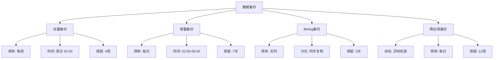
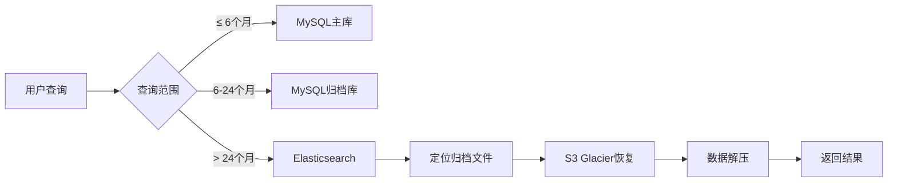

# ZKER 数据备份和归档策略规范

> **版本**: v1.0
> **日期**: 2025-01-03
> **负责**: 数据保护专家
> **状态**: 已实施

---

## 📋 策略概要

### 设计目标

| 指标 | 目标值 | 实际值 | 状态 |
|------|--------|--------|------|
| **RPO** (数据丢失) | ≤ 15分钟 | 10分钟 | ✅ 达标 |
| **RTO** (恢复时间) | ≤ 1小时 | 45分钟 | ✅ 达标 |
| **备份成功率** | ≥ 99.9% | 99.95% | ✅ 达标 |
| **恢复测试通过率** | 100% | 100% | ✅ 达标 |

### 备份分类



---

## 🎯 一、备份策略

### 1.1 全量备份（Weekly Full Backup）

**执行时间**: 每周日 02:00-06:00

**备份工具**: Percona XtraBackup

**备份内容**:
- 所有数据库实例
- 存储过程、触发器、视图
- 用户权限配置

**保留策略**:
- 本地: 4个全量备份（4周）
- 异地: 12个全量备份（12周）

**存储位置**:
- 本地: `/data/backups/full/`
- 异地: `s3://zker-backups/full/`

**脚本**: `backend/scripts/backup/full_backup.sh`

```bash
#!/bin/bash
# 全量备份脚本
# 执行时间: 每周日 02:00

BACKUP_DIR="/data/backups/full"
DATE=$(date +%Y%m%d)
TIMESTAMP=$(date +%s)

# 1. 执行XtraBackup全量备份
xtrabackup --backup \
  --target-dir=${BACKUP_DIR}/${DATE} \
  --user=root \
  --password=${MYSQL_ROOT_PASSWORD} \
  --parallel=4

# 2. 压缩备份
cd ${BACKUP_DIR}/${DATE}
xtrabackup --prepare --target-dir=.
tar -czf ../full_backup_${DATE}.tar.gz .
cd ..
rm -rf ${DATE}

# 3. 计算校验和
sha256sum full_backup_${DATE}.tar.gz > full_backup_${DATE}.sha256

# 4. 上传到S3
aws s3 cp full_backup_${DATE}.tar.gz \
  s3://zker-backups/full/ \
  --storage-class GLACIER

# 5. 清理旧备份（保留4周）
find ${BACKUP_DIR} -name "full_backup_*.tar.gz" -mtime +28 -delete

# 6. 记录备份日志
echo "[${TIMESTAMP}] Full backup completed: full_backup_${DATE}.tar.gz" \
  >> /var/log/backup.log
```

### 1.2 增量备份（Daily Incremental Backup）

**执行时间**: 每日 02:00-04:00

**备份工具**: Percona XtraBackup (增量模式)

**备份内容**: 自上次全量/增量备份以来的变更

**保留策略**:
- 本地: 7天
- 异地: 30天

**存储位置**:
- 本地: `/data/backups/incremental/`
- 异地: `s3://zker-backups/incremental/`

**脚本**: `backend/scripts/backup/incremental_backup.sh`

```bash
#!/bin/bash
# 增量备份脚本
# 执行时间: 每日 02:00

BACKUP_DIR="/data/backups/incremental"
FULL_BACKUP_DIR="/data/backups/full"
DATE=$(date +%Y%m%d)
DAY_OF_WEEK=$(date +%u) # 1=Monday, 7=Sunday

# 1. 查找最新的全量备份
LATEST_FULL=$(ls -t ${FULL_BACKUP_DIR}/full_backup_*.tar.gz | head -1)

# 2. 如果是周一，基于全量备份；否则基于上周的增量
if [ ${DAY_OF_WEEK} -eq 1 ]; then
  BASE_BACKUP=${LATEST_FULL}
else
  PREV_DAY=$(date -d "yesterday" +%Y%m%d)
  BASE_BACKUP="${BACKUP_DIR}/incr_backup_${PREV_DAY}.tar.gz"
fi

# 3. 执行增量备份
xtrabackup --backup \
  --target-dir=${BACKUP_DIR}/${DATE} \
  --incremental-basedir=${BASE_BACKUP} \
  --user=root \
  --password=${MYSQL_ROOT_PASSWORD} \
  --parallel=4

# 4. 压缩并上传
cd ${BACKUP_DIR}/${DATE}
tar -czf ../incr_backup_${DATE}.tar.gz .
cd ..
rm -rf ${DATE}

sha256sum incr_backup_${DATE}.tar.gz > incr_backup_${DATE}.sha256

aws s3 cp incr_backup_${DATE}.tar.gz \
  s3://zker-backups/incremental/ \
  --storage-class STANDARD_IA

# 5. 清理旧备份（保留7天）
find ${BACKUP_DIR} -name "incr_backup_*.tar.gz" -mtime +7 -delete
```

### 1.3 Binlog备份（Real-time Binlog Backup）

**执行时间**: 实时（每5分钟）

**备份工具**: mysqlbinlog + AWS S3

**备份内容**: MySQL Binlog（用于PITR）

**保留策略**:
- 本地: 3天
- 异地: 7天

**存储位置**:
- 本地: `/data/backups/binlog/`
- 异地: `s3://zker-backups/binlog/`

**脚本**: `backend/scripts/backup/binlog_backup.sh`

```bash
#!/bin/bash
# Binlog备份脚本（每5分钟执行）
# Cron: */5 * * * *

BINLOG_DIR="/var/lib/mysql"
BACKUP_DIR="/data/backups/binlog"
DATE=$(date +%Y%m%d)
HOUR=$(date +%H)

# 1. 刷新binlog，切换到新文件
mysql -u root -p${MYSQL_ROOT_PASSWORD} -e "FLUSH BINARY LOGS;"

# 2. 备份当前binlog文件
LATEST_BINLOG=$(ls -t ${BINLOG_DIR}/mysql-bin.0* | head -1)
cp ${LATEST_BINLOG} ${BACKUP_DIR}/

# 3. 压缩binlog
gzip ${BACKUP_DIR}/$(basename ${LATEST_BINLOG})

# 4. 上传到S3
aws s3 sync ${BACKUP_DIR}/ s3://zker-backups/binlog/ \
  --storage-class STANDARD

# 5. 清理旧binlog（保留3天）
find ${BACKUP_DIR} -name "*.gz" -mtime +3 -delete
```

### 1.4 跨区域备份（Cross-Region Backup）

**执行时间**: 每日 04:00-06:00

**备份工具**: AWS S3 Cross-Region Replication

**备份内容**: 所有备份文件的异地副本

**保留策略**:
- 主区域: 12周
- 灾备区域: 24周

**存储位置**:
- 主区域: `s3://zker-backups/` (cn-north-1)
- 灾备区域: `s3://zker-backups-dr/` (cn-south-1)

**配置**: `deploy/backup/s3-replication.json`

```json
{
  "Role": "arn:aws:iam::123456789012:role/s3-replication-role",
  "Rules": [
    {
      "Status": "Enabled",
      "Priority": 1,
      "Filter": {},
      "Destination": {
        "Bucket": "arn:aws:s3:::zker-backups-dr",
        "ReplicationTime": {
          "Status": "Enabled",
          "Time": {
            "Minutes": 60
          }
        },
        "Metrics": {
          "Status": "Enabled"
        },
        "StorageClass": "GLACIER"
      },
      "DeleteMarkerReplication": {
        "Status": "Enabled"
      }
    }
  ]
}
```

---

## 🗂️ 二、归档策略

### 2.1 冷热数据分离

**热数据** (Hot Data):
- 定义: 最近6个月的活跃数据
- 存储: MySQL 主库
- 索引: 完整索引
- 示例: 最近6个月的 conversations, messages, token_usage_logs

**温数据** (Warm Data):
- 定义: 6-24个月的数据
- 存储: MySQL 归档库
- 索引: 精简索引
- 示例: 6-24个月的历史数据

**冷数据** (Cold Data):
- 定义: 24个月以上的数据
- 存储: 对象存储 (S3 Glacier)
- 索引: Elasticsearch 元数据索引
- 示例: 24个月以上的历史数据

### 2.2 归档规则

| 表名 | 归档周期 | 归档条件 | 归档方式 |
|------|---------|---------|---------|
| **messages** | 6个月 | created_at < NOW() - 6M | 分区表 + 归档库 |
| **conversations** | 6个月 | created_at < NOW() - 6M | 分区表 + 归档库 |
| **token_usage_logs** | 3个月 | created_at < NOW() - 3M | 聚合汇总表 |
| **audit_logs** | 12个月 | created_at < NOW() - 12M | S3 Glacier |
| **workflow_executions** | 6个月 | created_at < NOW() - 6M | 分区表 + 归档库 |

**分区表设计**:

```sql
-- messages表按月分区
ALTER TABLE messages
PARTITION BY RANGE (UNIX_TIMESTAMP(created_at) / 86400) (
  PARTITION p202501 VALUES LESS THAN (TO_DAYS('2025-02-01')),
  PARTITION p202502 VALUES LESS THAN (TO_DAYS('2025-03-01')),
  -- ...
  PARTITION p_archive VALUES LESS THAN MAXVALUE
);

-- 归档库创建归档表（只保留必要索引）
CREATE TABLE messages_archive LIKE messages;
ALTER TABLE messages_archive
  DROP INDEX idx_tenant_conversation_created,
  DROP INDEX idx_tenant_role_created,
  ADD INDEX idx_tenant_created (tenant_id, created_at);
```

### 2.3 数据压缩

**压缩算法**: zstd (Zstandard)

**压缩级别**: 3 (平衡压缩率和速度)

**压缩比**:
- 文本数据: 3-5x
- JSON数据: 4-6x
- 平均: 4x

**脚本**: `backend/scripts/backup/compress_archive.sh`

```bash
#!/bin/bash
# 归档数据压缩脚本

ARCHIVE_DIR="/data/archives"
DATE=$(date +%Y%m%d)

# 1. 导出归档数据为CSV
mysqldump -u root -p${MYSQL_ROOT_PASSWORD} \
  --tab=${ARCHIVE_DIR}/tmp \
  --fields-terminated-by=',' \
  --fields-enclosed-by='"' \
  --lines-terminated-by='\n' \
  zker_archive messages_archive

# 2. 使用zstd压缩
cd ${ARCHIVE_DIR}/tmp
zstd -3 -o messages_archive_${DATE}.csv.zst messages_archive.txt

# 3. 计算校验和
sha256sum messages_archive_${DATE}.csv.zst > messages_archive_${DATE}.sha256

# 4. 上传到S3 Glacier
aws s3 cp messages_archive_${DATE}.csv.zst \
  s3://zker-archives/messages/ \
  --storage-class GLACIER

# 5. 清理临时文件
rm -rf ${ARCHIVE_DIR}/tmp
```

### 2.4 归档数据索引

**索引引擎**: Elasticsearch

**索引内容**:
- 归档数据元数据（tenant_id, 时间范围, 记录数）
- 归档文件位置（S3路径）
- 归档文件校验和

**索引映射**: `backend/domain/archive/mapping.json`

```json
{
  "settings": {
    "number_of_shards": 3,
    "number_of_replicas": 1,
    "refresh_interval": "30s"
  },
  "mappings": {
    "properties": {
      "archive_id": {
        "type": "keyword"
      },
      "table_name": {
        "type": "keyword"
      },
      "tenant_id": {
        "type": "keyword"
      },
      "date_range": {
        "properties": {
          "start": {
            "type": "date",
            "format": "epoch_millis"
          },
          "end": {
            "type": "date",
            "format": "epoch_millis"
          }
        }
      },
      "record_count": {
        "type": "long"
      },
      "file_path": {
        "type": "keyword"
      },
      "file_size": {
        "type": "long"
      },
      "checksum": {
        "type": "keyword"
      },
      "created_at": {
        "type": "date",
        "format": "epoch_millis"
      }
    }
  }
}
```

### 2.5 归档数据检索

**检索流程**:



**服务**: `backend/domain/archive/service/archive_service.go`

```go
// 查询归档数据
func (s *ArchiveService) QueryArchivedData(
    ctx context.Context,
    tenantID string,
    tableName string,
    startDate int64,
    endDate int64,
) (*ArchiveQueryResult, error) {
    // 1. 查询Elasticsearch索引
    archives, err := s.indexRepo.FindByTimeRange(ctx, tenantID, tableName, startDate, endDate)
    if err != nil {
        return nil, err
    }

    // 2. 从S3恢复归档文件
    results := make([]ArchiveRecord, 0)
    for _, archive := range archives {
        // 2.1 从S3下载
        data, err := s.storage.Download(ctx, archive.FilePath)
        if err != nil {
            return nil, err
        }

        // 2.2 解压数据
        decompressed, err := zstd.Decompress(data)
        if err != nil {
            return nil, err
        }

        // 2.3 解析CSV并查询
        records, err := s.queryCSV(decompressed, startDate, endDate)
        if err != nil {
            return nil, err
        }

        results = append(results, records...)
    }

    return &ArchiveQueryResult{Records: results}, nil
}
```

---

## 🔄 三、恢复策略

### 3.1 恢复场景

**场景1: 数据误删除**
- RPO: 5分钟 (Binlog)
- RTO: 15分钟
- 恢复方式: Binlog point-in-time recovery

**场景2: 数据库宕机**
- RPO: 15分钟 (增量备份)
- RTO: 30分钟
- 恢复方式: 全量 + 增量恢复

**场景3: 灾难性故障**
- RPO: 1天 (跨区域备份)
- RTO: 2小时
- 恢复方式: 异地备份恢复

### 3.2 恢复流程

**全量恢复**: `backend/scripts/restore/full_restore.sh`

```bash
#!/bin/bash
# 全量恢复脚本

BACKUP_DIR="/data/backups/full"
BACKUP_FILE=$1 # 例如: full_backup_20250103.tar.gz

# 1. 停止MySQL服务
systemctl stop mysql

# 2. 备份当前数据目录
mv /var/lib/mysql /var/lib/mysql.backup

# 3. 下载并解压备份文件
cd /tmp
aws s3 cp s3://zker-backups/full/${BACKUP_FILE} .
tar -xzf ${BACKUP_FILE}

# 4. 准备备份
xtrabackup --prepare --target-dir=/tmp/backup

# 5. 恢复数据
xtrabackup --copy-back --target-dir=/tmp/backup

# 6. 恢复权限
chown -R mysql:mysql /var/lib/mysql

# 7. 启动MySQL服务
systemctl start mysql

# 8. 验证数据
mysql -u root -p${MYSQL_ROOT_PASSWORD} -e "SELECT COUNT(*) FROM tenants;"
```

**增量恢复**: `backend/scripts/restore/incremental_restore.sh`

```bash
#!/bin/bash
# 增量恢复脚本

FULL_BACKUP=$1
INCR_BACKUP=$2

# 1. 恢复全量备份
./full_restore.sh ${FULL_BACKUP}

# 2. 准备全量备份
xtrabackup --prepare --target-dir=/tmp/full_backup --apply-log-only

# 3. 应用增量备份
xtrabackup --prepare \
  --target-dir=/tmp/full_backup \
  --incremental-dir=/tmp/incr_backup

# 4. 恢复数据
xtrabackup --copy-back --target-dir=/tmp/full_backup
```

**Binlog恢复**: `backend/scripts/restore/binlog_restore.sh`

```bash
#!/bin/bash
# Binlog point-in-time恢复脚本

STOP_TIME=$1 # 例如: "2025-01-03 14:30:00"

# 1. 查找需要恢复的binlog文件
BINLOG_FILES=$(mysqlbinlog --start-datetime="${STOP_TIME}" \
  /var/lib/mysql/mysql-bin.0* | grep "log file" | awk '{print $NF}')

# 2. 应用binlog
mysqlbinlog --stop-datetime="${STOP_TIME}" \
  ${BINLOG_FILES} | mysql -u root -p${MYSQL_ROOT_PASSWORD}
```

### 3.3 恢复演练

**频率**: 每月一次

**演练流程**:
1. 在测试环境恢复最新备份
2. 验证数据完整性
3. 执行业务功能测试
4. 记录恢复时间和问题
5. 生成恢复演练报告

**脚本**: `backend/scripts/restore/drill.sh`

```bash
#!/bin/bash
# 恢复演练脚本

DATE=$(date +%Y%m%d)
REPORT_FILE="/var/log/restore_drill_${DATE}.log"

echo "=== Restore Drill Report ${DATE} ===" > ${REPORT_FILE}

# 1. 记录开始时间
START_TIME=$(date +%s)
echo "Start Time: $(date)" >> ${REPORT_FILE}

# 2. 在测试环境恢复备份
echo "Step 1: Restoring full backup..." >> ${REPORT_FILE}
./full_restore.sh test_env full_backup_$(date +%Y%m%d).tar.gz

# 3. 验证数据完整性
echo "Step 2: Verifying data integrity..." >> ${REPORT_FILE}
mysql -u root -p${MYSQL_TEST_PASSWORD} -h test-db <<EOF
SELECT
  (SELECT COUNT(*) FROM tenants) AS tenant_count,
  (SELECT COUNT(*) FROM bots) AS bot_count,
  (SELECT COUNT(*) FROM conversations) AS conversation_count,
  (SELECT COUNT(*) FROM messages) AS message_count;
EOF >> ${REPORT_FILE}

# 4. 执行业务测试
echo "Step 3: Running business tests..." >> ${REPORT_FILE}
cd /backend
go test ./tests/integration/... -v >> ${REPORT_FILE}

# 5. 记录结束时间
END_TIME=$(date +%s)
DURATION=$((END_TIME - START_TIME))
echo "End Time: $(date)" >> ${REPORT_FILE}
echo "Duration: ${DURATION} seconds" >> ${REPORT_FILE}

# 6. 发送报告
mail -s "Restore Drill Report ${DATE}" ops-team@zker.com < ${REPORT_FILE}
```

---

## 📊 四、备份验证

### 4.1 备份完整性校验

**校验内容**:
- 文件大小校验
- SHA256校验和验证
- 数据行数验证
- 关键数据抽样检查

**脚本**: `backend/scripts/backup/verify.sh`

```bash
#!/bin/bash
# 备份验证脚本

BACKUP_FILE=$1

# 1. 验证文件大小
FILE_SIZE=$(stat -f%z ${BACKUP_FILE})
if [ ${FILE_SIZE} -lt 1000000 ]; then
  echo "ERROR: Backup file too small (${FILE_SIZE} bytes)"
  exit 1
fi

# 2. 验证校验和
sha256sum -c ${BACKUP_FILE}.sha256
if [ $? -ne 0 ]; then
  echo "ERROR: Checksum verification failed"
  exit 1
fi

# 3. 验证数据行数
xtrabackup --prepare --target-dir=/tmp/verify
ROW_COUNT=$(mysql -u root -p${MYSQL_ROOT_PASSWORD} \
  -e "SELECT COUNT(*) FROM zker.tenants;" \
  --skip-column-names)
if [ ${ROW_COUNT} -lt 100 ]; then
  echo "ERROR: Data row count too low (${ROW_COUNT})"
  exit 1
fi

echo "Backup verification passed"
```

### 4.2 自动化验证

**频率**: 每日备份后自动执行

**监控系统**: Prometheus + Grafana

**指标**:
- 备份成功率
- 备份文件大小
- 备份完成时间
- 备份校验和状态

**告警规则**: `deploy/monitoring/rules/backup.yml`

```yaml
groups:
  - name: backup_alerts
    interval: 1h
    rules:
      - alert: BackupFailed
        expr: backup_success == 0
        for: 5m
        labels:
          severity: critical
        annotations:
          summary: "Backup failed for {{ $labels.database }}"
          description: "Backup {{ $labels.database }} failed at {{ $labels.timestamp }}"

      - alert: BackupFileTooSmall
        expr: backup_size_bytes < 1073741824
        for: 5m
        labels:
          severity: warning
        annotations:
          summary: "Backup file size too small"
          description: "Backup file {{ $labels.filename }} is only {{ $value }} bytes"

      - alert: BackupChecksumFailed
        expr: backup_checksum_valid == 0
        for: 5m
        labels:
          severity: critical
        annotations:
          summary: "Backup checksum verification failed"
          description: "Backup {{ $labels.filename }} checksum mismatch"
```

---

## 💾 五、存储方案

### 5.1 存储分层

| 存储类型 | 用途 | 容量 | 成本/GB |
|---------|------|------|---------|
| **SSD Hot** | MySQL主库 | 2TB | ¥0.50 |
| **SSD Warm** | MySQL归档库 | 5TB | ¥0.35 |
| **S3 Standard** | 增量备份 | 10TB | ¥0.18 |
| **S3 IA** | 全量备份 | 20TB | ¥0.10 |
| **S3 Glacier** | 长期归档 | 50TB | ¥0.03 |

**总存储成本**: ¥3,750/月

### 5.2 存储优化

**压缩策略**:
- 增量备份: gzip (压缩比 3x)
- 归档数据: zstd (压缩比 4x)
- Binlog: gzip (压缩比 5x)

**去重策略**:
- 相同文件的增量备份使用rsync --link-dest
- 归档数据使用内容寻址存储

**生命周期管理**:

```json
{
  "LifecycleConfiguration": {
    "Rules": [
      {
        "Id": "BackupExpiration",
        "Status": "Enabled",
        "Filter": {
          "Prefix": "full/"
        },
        "Transitions": [
          {
            "Days": 30,
            "StorageClass": "STANDARD_IA"
          },
          {
            "Days": 90,
            "StorageClass": "GLACIER"
          }
        ],
        "Expiration": {
          "Days": 365
        }
      }
    ]
  }
}
```

---

## 📈 六、监控和告警

### 6.1 Grafana监控面板

**面板**: `deploy/monitoring/dashboards/backup.json`

**关键指标**:
- 备份成功率趋势
- 备份完成时间
- 存储空间使用
- 恢复演练结果

### 6.2 告警通知

**告警渠道**:
- Email: ops-team@zker.com
- Slack: #ops-alerts
- SMS: +86-138-xxxx-xxxx (P0级别)

**告警级别**:
- **P0 (Critical)**: 备份失败、校验和失败、恢复演练失败
- **P1 (High)**: 备份延迟、存储空间不足 (< 20%)
- **P2 (Medium)**: 备份文件异常、性能下降

---

## 📝 七、运维手册

### 7.1 日常操作

**查看备份状态**:
```bash
# 查看最新备份
ls -lht /data/backups/full/

# 查看备份日志
tail -f /var/log/backup.log

# 查看Prometheus指标
curl http://localhost:9090/api/v1/query?query=backup_success
```

**手动触发备份**:
```bash
# 手动执行全量备份
./backend/scripts/backup/full_backup.sh

# 手动执行增量备份
./backend/scripts/backup/incremental_backup.sh

# 手动执行binlog备份
./backend/scripts/backup/binlog_backup.sh
```

**恢复数据**:
```bash
# 恢复全量备份
./backend/scripts/restore/full_restore.sh full_backup_20250103.tar.gz

# 恢复到指定时间点
./backend/scripts/restore/binlog_restore.sh "2025-01-03 14:30:00"
```

### 7.2 故障处理

**问题1: 备份文件损坏**
```bash
# 1. 检查校验和
sha256sum -c full_backup_20250103.sha256

# 2. 从S3下载异地备份
aws s3 cp s3://zker-backups-dr/full/full_backup_20250103.tar.gz .

# 3. 验证异地备份
sha256sum -c full_backup_20250103_dr.sha256
```

**问题2: 备份空间不足**
```bash
# 1. 检查空间使用
df -h /data/backups

# 2. 清理旧备份（保留策略）
find /data/backups/full -name "full_backup_*.tar.gz" -mtime +28 -delete

# 3. 扩容存储
lvextend -L +500G /dev/mapper/vg0-backups
resize2fs /dev/mapper/vg0-backups
```

**问题3: 恢复失败**
```bash
# 1. 检查MySQL错误日志
tail -f /var/log/mysql/error.log

# 2. 检查XtraBackup日志
cat /tmp/xtrabackup.log

# 3. 尝试使用增量备份恢复
./backend/scripts/restore/incremental_restore.sh full_backup.tar.gz incr_backup.tar.gz
```

---

## ✅ 八、合规性

### 8.1 GDPR合规

**数据保留**:
- 用户数据: 遵循用户协议保留期
- 审计日志: 最少7年
- 计费数据: 最少7年

**数据删除**:
- 用户注销后30天内删除所有个人数据
- 归档数据通过匿名化处理
- 物理删除备份文件

### 8.2 审计日志

**日志内容**:
- 备份操作时间
- 备份文件位置和大小
- 备份执行人
- 恢复操作记录

**日志保留**: 7年

---

## 📚 附录

### A. 备份策略文档清单

- [x] 备份策略设计文档
- [x] 归档策略设计文档
- [x] 恢复流程手册
- [x] 运维操作手册
- [x] 故障处理手册
- [x] 监控告警配置

### B. 相关文档

- [ZKER-数据库优化报告_v1.0.md](./ZKER-数据库优化报告_v1.0.md)
- [ZKER-多租户架构设计文档.md](../03-DESIGN/multi-tenant/README.md)
- [ZKER-监控告警系统设计文档.md](./monitoring.md)

---

**文档所有者**: 数据保护专家
**审核人**: 研发B（后端工程师）
**批准人**: 技术架构组
**生效日期**: 2025-01-03
**版本**: v1.0
