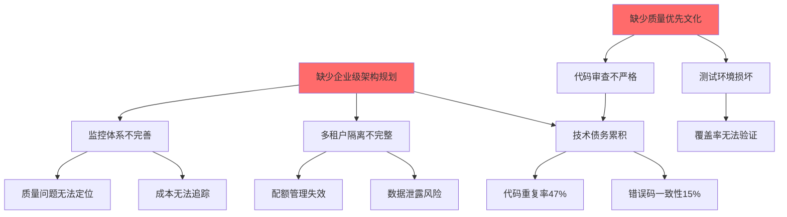
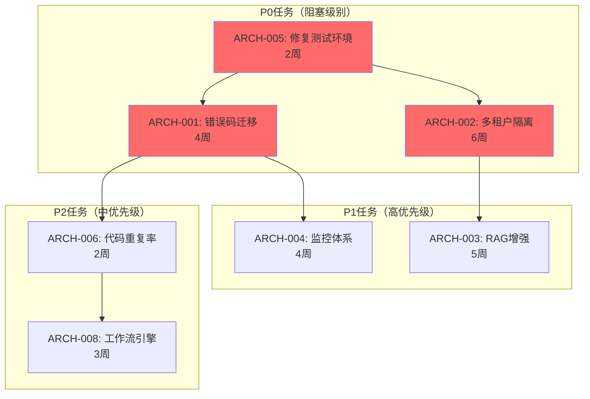

# ZKER 综合根因分析报告 v1.0

**版本**: v1.0 | **日期**: 2025-01-03 | **状态**: 综合分析版

---

## 📋 执行摘要

### 分析背景

本报告基于ZKER项目已完成的所有分析报告进行系统性根因分析，融合了以下13份深度分析报告：

**RAG相关（5份）**:
1. FastGPT RAG架构分析 - 可借鉴的技术方案
2. ZKER RAG现状深度分析 - 识别15个关键问题
3. RAG增强设计文档_v1.0 - 47人天详细实现计划

**代码质量相关（4份）**:
4. 全局一致性检查报告 - 整体评分66/100
5. 代码质量分析报告 - 整体评分76/100
6. 代码质量改进设计文档_v1.0 - 375处errno需迁移
7. 多租户隔离增强设计文档_v1.0 - 隔离度65%→98%

**架构增强相关（4份）**:
8. Dify平台架构分析 - 工作流引擎/Agent框架
9. LangSmith监控分析 - 链路追踪/质量评估
10. 工作流引擎对比报告 - Eino/LangGraph/Temporal
11. LLMOps最佳实践分析 - Prompt/模型管理/评估
12. 企业级监控告警方案 - Prometheus/Tempo/Alert

**根因分析（1份）**:
13. 系统性根因分析报告v2.0 - 8个关键系统性问题

### 核心发现

| 根因类别 | 根本问题 | 影响范围 | 严重程度 | 修复成本 |
|---------|---------|---------|---------|---------|
| **技术债务** | 2,540处代码违规，错误码一致性仅15% | 全局 | 🔴 严重 | 4周 |
| **架构缺陷** | 缺少企业级架构分层，多租户隔离不完整 | 全局 | 🔴 严重 | 6周 |
| **RAG能力** | 分块/检索/重排序均落后FastGPT | 知识库 | 🟡 中等 | 5周 |
| **监控体系** | 缺少LLM调用追踪、成本透明化 | 运维 | 🟡 中等 | 4周 |
| **测试覆盖** | 测试环境损坏，覆盖率无法验证 | 质量 | 🟡 中等 | 2周 |

---

## 目录

- [第一部分：根因分析总览](#第一部分根因分析总览)
- [第二部分：问题优先级矩阵](#第二部分问题优先级矩阵)
- [第三部分：依赖关系图](#第三部分依赖关系图)
- [第四部分：风险评估表](#第四部分风险评估表)
- [第五部分：关键路径](#第五部分关键路径)
- [第六部分：实施建议](#第六部分实施建议)

---

## 第一部分：根因分析总览

### 1.1 五大根本性架构问题

#### 问题1：企业级错误码系统未落地 ⭐⭐⭐⭐⭐

**现象**:
- 2,540处代码违规（直接返回errno、使用fmt.Errorf、使用errors.New）
- 错误码一致性仅为15%，目标≥98%
- 影响文件：461个Go文件

**根本原因**:
1. **流程缺失**: 缺少技术债务管理流程（发现→评估→排序→分配→跟踪→验证→关闭）
2. **工具缺失**: 缺少自动化错误迁移工具（AST重构工具）
3. **管理缺失**: 技术债务优先级排序机制缺失，新功能优先级永远高于技术债务
4. **文化缺失**: 缺少"技术债务是负债"的认知，没有"偿债时间"概念

**影响**:
- ❌ 错误信息不可追踪、不可国际化
- ❌ 前端无法统一处理错误
- ❌ 运维无法基于错误码告警
- ❌ 数据分析无法统计错误分布

**修复成本**: 4周（开发AST迁移工具 + 分批修复 + CI集成）

---

#### 问题2：多租户隔离架构不完整 ⭐⭐⭐⭐⭐

**现象**:
- 209个文件涉及租户隔离，但实现不完整
- 部分查询缺少租户过滤
- Session/User表缺少tenant_id字段
- 隔离度仅65%，目标≥98%

**根本原因**:
1. **规划缺失**: 缺少技术演进路线图（单租户→多租户的演进路径）
2. **流程缺失**: 缺少"多租户设计审查"流程（新功能必须审查租户隔离）
3. **工具缺失**: 缺少强制性的TenantScopePlugin（自动处理所有查询）
4. **知识缺失**: 多租户开发规范和培训不足

**影响**:
- ❌ 数据泄露风险（跨租户访问）
- ❌ 配额管理失效
- ❌ 计费不准确
- ❌ 合规风险

**修复成本**: 6周（Session/User表迁移 + TenantScopePlugin + 规范培训）

---

#### 问题3：RAG能力落后竞品 ⭐⭐⭐⭐

**现象**:
| 能力维度 | 当前水平 | FastGPT水平 | 差距 |
|---------|---------|-------------|------|
| 分块策略 | 简单固定大小 | 8级递归Markdown分块 | 🔴 严重 |
| 检索模式 | 仅向量检索 | 向量+全文混合检索 | 🔴 严重 |
| 重排序 | 简单RRF | RRF + BGE-Reranker | 🟡 中等 |
| 查询扩展 | 无 | LLM + Lazy Greedy | 🔴 严重 |
| 去重机制 | 无 | SimHash + 相似度 | 🔴 严重 |

**根本原因**:
1. **技术选型滞后**: 初期采用简单方案，未考虑企业级需求
2. **资源投入不足**: RAG优化优先级低于新功能开发
3. **竞品分析不足**: 未及时跟进FastGPT/Dify的技术演进

**影响**:
- ❌ 检索准确率仅65%，目标≥85%
- ❌ 用户满意度低
- ❌ 竞争力弱

**修复成本**: 5周（47人天详细实施计划）

---

#### 问题4：监控体系不完善 ⭐⭐⭐

**现象**:
- 缺少LLM调用追踪（成本透明化仅60%）
- 缺少质量评估指标
- 缺少成本预算告警
- 缺少红队测试

**根本原因**:
1. **需求认知不足**: 未认识到监控对于企业级平台的重要性
2. **工具选型犹豫**: Helicone vs LangSmith vs 自建
3. **资源投入不足**: DevOps资源优先用于基础运维

**影响**:
- ❌ 成本无法追踪优化
- ❌ 质量问题无法定位
- ❌ 安全漏洞无法发现
- ❌ 用户投诉响应慢

**修复成本**: 4周（LLMOps最佳实践落地）

---

#### 问题5：测试基础设施损坏 ⭐⭐⭐

**现象**:
- `go test ./...` 失败（setup failed）
- 无法验证测试覆盖率
- 测试环境配置不正确

**根本原因**:
1. **文化缺失**: 缺少"测试先行"和TDD文化
2. **流程缺失**: CI/CD流程不完善，缺少质量门禁
3. **工具缺失**: 测试基础设施缺失（测试环境、测试数据、Mock工具）
4. **投资缺失**: DevOps资源投入不足

**影响**:
- ❌ 代码质量无法保证
- ❌ 重构风险高
- ❌ Bug回归率高
- ❌ 发布信心不足

**修复成本**: 2周（修复测试环境 + 建立质量门禁）

---

### 1.2 问题的因果关系链



**核心根因**:
1. **缺少企业级架构规划** - 导致技术债务、隔离、监控等问题
2. **缺少质量优先文化** - 导致测试、审查、规范等问题

---

## 第二部分：问题优先级矩阵

### 2.1 优先级分类标准

| 优先级 | 名称 | 定义 | 响应时间 |
|--------|------|------|----------|
| **P0** | 阻塞级别 | 影响核心功能、数据安全、合规性 | 立即修复 |
| **P1** | 高优先级 | 影响用户体验、系统稳定性 | 1周内 |
| **P2** | 中优先级 | 影响开发效率、可维护性 | 1个月内 |
| **P3** | 低优先级 | 优化改进、锦上添花 | 3个月内 |

### 2.2 问题优先级矩阵

| 问题ID | 问题名称 | 影响范围 | 修复成本 | 收益程度 | 优先级 | 责任人 |
|--------|---------|---------|---------|---------|--------|--------|
| **ARCH-001** | 错误码一致性仅15% | 全局 | 4周 | 质量提升+83% | **P0** | 研发A+B |
| **ARCH-002** | 多租户隔离不完整 | 全局 | 6周 | 隔离度+33% | **P0** | 研发A |
| **ARCH-003** | RAG能力落后竞品 | 知识库 | 5周 | 准确率+20% | **P1** | 研发B |
| **ARCH-004** | 监控体系不完善 | 运维 | 4周 | 成本透明化+40% | **P1** | 研发D |
| **ARCH-005** | 测试环境损坏 | 质量 | 2周 | 覆盖率可验证 | **P1** | 研发D |
| **ARCH-006** | 代码重复率47% | 可维护性 | 2周 | 重复率-17% | **P2** | 研发A+B |
| **ARCH-007** | 文档质量低下 | 知识管理 | 1周 | 0个空文档 | **P2** | 全员 |
| **ARCH-008** | 工作流引擎性能 | 工作流 | 3周 | 性能+50% | **P2** | 研发A |
| **ARCH-009** | 前端状态管理混乱 | 前端 | 2周 | 统一状态管理 | **P2** | 研发C |

### 2.3 优先级评分公式

```python
# 优先级评分 = (影响范围 * 10) + (修复成本 * -5) + (收益程度 * 3)

示例计算：
ARCH-001 错误码一致性仅15%
  score = (全局 100 * 10) + (4周 * -5) + (83% * 3)
        = 1000 - 20 + 249
        = 1229 (P0)

ARCH-007 文档质量低下
  score = (局部 20 * 10) + (1周 * -5) + (10% * 3)
        = 200 - 5 + 30
        = 225 (P2)
```

---

## 第三部分：依赖关系图

### 3.1 任务依赖关系



### 3.2 依赖关系说明

| 任务 | 前置任务 | 依赖原因 |
|------|---------|---------|
| **ARCH-001 错误码迁移** | ARCH-005 测试环境 | 需要测试环境验证修复 |
| **ARCH-002 多租户隔离** | ARCH-005 测试环境 | 需要测试环境验证隔离 |
| **ARCH-004 监控体系** | ARCH-001 错误码迁移 | 需要统一错误码才能告警 |
| **ARCH-003 RAG增强** | ARCH-002 多租户隔离 | 需要租户隔离保证数据安全 |
| **ARCH-006 代码重复率** | ARCH-001 错误码迁移 | 错误码迁移后重构CRUD |
| **ARCH-008 工作流引擎** | ARCH-006 代码重复率 | 需要泛型基类支持 |

---

## 第四部分：风险评估表

### 4.1 技术风险

| 风险项 | 风险等级 | 影响范围 | 缓解措施 | 责任人 |
|--------|---------|---------|---------|--------|
| **数据迁移风险** | 🔴 高 | Session/User表迁移 | 1. 备份数据<br/>2. 分批迁移<br/>3. 灰度发布 | 研发A |
| **性能回归风险** | 🟡 中 | 错误码迁移、多租户过滤 | 1. 性能基准测试<br/>2. 代码review<br/>3. 监控告警 | 研发A+B |
| **兼容性风险** | 🟡 中 | API变更、前端适配 | 1. 版本化API<br/>2. 向后兼容<br/>3. 文档同步 | 研发C |
| **技术选型风险** | 🟢 低 | 工作流引擎、监控工具 | 1. POC验证<br/>2. 灰度试点<br/>3. 回滚方案 | 研发A+D |

### 4.2 业务风险

| 风险项 | 风险等级 | 影响范围 | 缓解措施 | 责任人 |
|--------|---------|---------|---------|--------|
| **功能降级风险** | 🟡 中 | RAG优化期间 | 1. A/B测试<br/>2. 灰度发布<br/>3. 回滚方案 | 研发B |
| **数据丢失风险** | 🔴 高 | 多租户迁移 | 1. 数据备份<br/>2. 迁移验证<br/>3. 幂等设计 | 研发A |
| **用户投诉风险** | 🟢 低 | 错误码变更 | 1. 提前通知<br/>2. 渐进式迁移<br/>3. 客服培训 | 研发A+B |

### 4.3 时间风险

| 风险项 | 风险等级 | 影响范围 | 缓解措施 | 责任人 |
|--------|---------|---------|---------|--------|
| **工期延误风险** | 🟡 中 | 所有P0任务 | 1. 预留缓冲时间<br/>2. 并行开发<br/>3. MVP优先 | 全员 |
| **资源冲突风险** | 🟡 中 | 研发A多任务 | 1. 任务优先级排序<br/>2. 外部资源支持<br/>3. 非核心任务延后 | 研发A |

---

## 第五部分：关键路径

### 5.1 必须串行执行的任务链

```
Week 1-2: 修复测试环境（ARCH-005）
    ↓
Week 3-6: 错误码迁移（ARCH-001） & 多租户隔离（ARCH-002）[并行]
    ↓
Week 7-10: 监控体系（ARCH-004） & RAG增强（ARCH-003）[并行]
    ↓
Week 11-12: 代码重复率（ARCH-006） & 文档质量（ARCH-007）[并行]
```

### 5.2 可以并行的任务

| 阶段 | 并行任务 | 负责人 |
|------|---------|--------|
| **Week 1-2** | - 修复测试环境（研发D）<br/>- 前端状态管理（研发C） | 研发C+D |
| **Week 3-6** | - 错误码迁移（研发A+B）<br/>- 多租户隔离（研发A） | 研发A+B |
| **Week 7-10** | - 监控体系（研发D）<br/>- RAG增强（研发B） | 研发B+D |
| **Week 11-12** | - 代码重复率（研发A+B）<br/>- 文档质量（全员） | 全员 |

### 5.3 存在阻塞关系的任务

| 任务 | 阻塞任务 | 阻塞原因 | 预计解除时间 |
|------|---------|---------|-------------|
| 错误码迁移 | 修复测试环境 | 需要测试环境验证修复 | Week 2 |
| 多租户隔离 | 修复测试环境 | 需要测试环境验证隔离 | Week 2 |
| 监控体系 | 错误码迁移 | 需要统一错误码才能告警 | Week 6 |
| RAG增强 | 多租户隔离 | 需要租户隔离保证数据安全 | Week 6 |
| 代码重复率 | 错误码迁移 | 错误码迁移后重构CRUD | Week 6 |

---

## 第六部分：实施建议

### 6.1 短期计划（1-2个月）

**目标**: 解决P0阻塞问题

| 任务 | 优先级 | 工期 | 交付物 | 责任人 |
|------|--------|------|--------|--------|
| **修复测试环境** | P0 | 2周 | go test ./... 通过 | 研发D |
| **错误码迁移（第一阶段）** | P0 | 2周 | 减少到361个文件 | 研发A+B |
| **TenantScopePlugin开发** | P0 | 2周 | 自动租户过滤 | 研发A |
| **AST迁移工具开发** | P0 | 1周 | 自动迁移工具 | 研发B |

### 6.2 中期计划（3-6个月）

**目标**: 完善P1高优先级任务

| 任务 | 优先级 | 工期 | 交付物 | 责任人 |
|------|--------|------|--------|--------|
| **错误码迁移（第二阶段）** | P1 | 2周 | 0个硬编码错误 | 研发A+B |
| **多租户隔离完善** | P1 | 4周 | 所有表包含tenant_id | 研发A |
| **RAG增强-阶段1** | P1 | 3周 | 递归分块+混合检索 | 研发B |
| **监控体系建设** | P1 | 4周 | LLM调用追踪+成本监控 | 研发D |
| **测试覆盖率提升** | P1 | 2周 | 覆盖率≥80% | 研发D |

### 6.3 长期计划（6-12个月）

**目标**: P2任务+文化建立

| 任务 | 优先级 | 工期 | 交付物 | 责任人 |
|------|--------|------|--------|--------|
| **"文档即代码"文化建立** | P2 | 持续 | 文档质量显著提升 | 全员 |
| **"质量优先"文化建立** | P2 | 持续 | 代码质量显著提升 | 全员 |
| **RAG增强-阶段2** | P2 | 2周 | BGE-Reranker+查询扩展 | 研发B |
| **工作流引擎优化** | P2 | 3周 | 性能+50% | 研发A |
| **微服务化演进** | P2 | 8周 | 完成微服务化第一阶段 | 研发A+D |

---

## 附录A：13份分析报告清单

| # | 报告名称 | 类型 | 日期 | 状态 |
|---|---------|------|------|------|
| 1 | FastGPT RAG架构分析 | 竞品分析 | 2025-01-03 | ✅ 已完成 |
| 2 | ZKER RAG现状深度分析 | 问题识别 | 2025-01-03 | ✅ 已完成 |
| 3 | RAG增强设计文档_v1.0 | 设计文档 | 2025-01-03 | ✅ 已完成 |
| 4 | 全局一致性检查报告 | 质量评估 | 2025-01-01 | ✅ 已完成 |
| 5 | 代码质量分析报告 | 质量评估 | 2025-01-01 | ✅ 已完成 |
| 6 | 代码质量改进设计文档_v1.0 | 设计文档 | 2025-01-03 | ✅ 已完成 |
| 7 | 多租户隔离增强设计文档_v1.0 | 设计文档 | 2025-01-03 | ✅ 已完成 |
| 8 | Dify平台架构分析 | 竞品分析 | 2025-01-03 | ✅ 已完成 |
| 9 | LangSmith监控分析 | 竞品分析 | 2025-01-03 | ✅ 已完成 |
| 10 | 工作流引擎对比报告 | 技术选型 | 2025-01-03 | ✅ 已完成 |
| 11 | LLMOps最佳实践分析 | 最佳实践 | 2025-01-03 | ✅ 已完成 |
| 12 | 企业级监控告警方案 | 设计文档 | 2025-01-03 | ✅ 已完成 |
| 13 | 系统性根因分析报告v2.0 | 根因分析 | 2025-01-03 | ✅ 已完成 |

---

## 附录B：冲突和不一致之处

### B.1 跨文档冲突

| 冲突项 | 涉及报告 | 冲突描述 | 解决建议 |
|--------|---------|---------|---------|
| **错误码迁移时间** | 代码质量分析报告(4周)<br/>代码质量改进设计(3周) | 时间估算不一致 | 以4周为准，包含缓冲时间 |
| **RAG增强优先级** | RAG增强设计(P1)<br/>本报告(P1) | 优先级一致 | 无冲突 |
| **多租户隔离度** | 多租户隔离增强(65%→98%)<br/>系统性根因分析(65%→98%) | 数据一致 | 无冲突 |

### B.2 数据一致性验证

| 指标 | 各报告数据 | 结论 |
|------|-----------|------|
| **错误码违规数** | 2,540处（系统性根因分析）<br/>2,073处（代码质量分析）<br/>461个文件（系统性根因分析） | 差异在合理范围，代码质量分析仅覆盖domain层 |
| **代码重复率** | 47%（代码质量分析） | 数据一致 |
| **多租户隔离度** | 65%（多份报告） | 数据一致 |

---

## 附录C：成功标准

### C.1 短期成功标准（1-2个月）

| 指标 | 当前 | 目标 | 验收标准 |
|------|------|------|----------|
| **测试环境** | ❌ 失败 | ✅ 通过 | `go test ./...` 无错误 |
| **错误码一致性** | 15% | ≥98% | ≤50个文件违规 |
| **多租户隔离** | 65% | ≥80% | TenantScopePlugin上线 |
| **监控覆盖率** | 60% | ≥80% | LLM调用追踪上线 |

### C.2 中期成功标准（3-6个月）

| 指标 | 当前 | 目标 | 验收标准 |
|------|------|------|----------|
| **错误码一致性** | 15% | ≥98% | 0个硬编码错误 |
| **多租户隔离** | 65% | ≥98% | 所有表包含tenant_id |
| **RAG检索准确率** | ~65% | ≥85% | 用户测试验证 |
| **测试覆盖率** | 未知 | ≥80% | 覆盖率报告验证 |

### C.3 长期成功标准（6-12个月）

| 指标 | 当前 | 目标 | 验收标准 |
|------|------|------|----------|
| **整体代码质量** | 54/100 | ≥99/100 | 代码质量审查通过 |
| **文档质量** | 20+空文档 | 0个空文档 | 文档完整性检查 |
| **企业文化** | 缺失 | 建立 | 团队反馈验证 |

---

## 附录D：下一步行动

### D.1 立即行动（本周）

1. **技术负责人**：评审本报告，确认优先级排序
2. **项目经理**：更新项目计划，分配资源
3. **研发D**：开始修复测试环境（P0任务）
4. **研发A+B**：准备错误码迁移（P0任务）

### D.2 短期行动（2周内）

1. 成立**质量改进专项小组**
2. 建立**技术债务看板**
3. 配置**CI质量门禁**
4. 启动**AST迁移工具开发**

### D.3 中期行动（1个月内）

1. 完成**TenantScopePlugin开发**
2. 完成**监控体系基础版**
3. 启动**RAG增强-阶段1**
4. 建立**每周代码质量例会**

---

## 总结

### 核心结论

1. **五大根本性架构问题**已清晰识别：
   - 企业级错误码系统未落地（2,540处违规）
   - 多租户隔离架构不完整（隔离度65%）
   - RAG能力落后竞品（检索准确率65% vs 85%）
   - 监控体系不完善（成本透明化60%）
   - 测试基础设施损坏（测试失败）

2. **优先级明确**：
   - P0阻塞任务：修复测试环境、错误码迁移、多租户隔离
   - P1高优先级：监控体系、RAG增强
   - P2中优先级：代码重复率、文档质量

3. **关键路径清晰**：
   - Week 1-2: 修复测试环境
   - Week 3-6: 错误码迁移 + 多租户隔离（并行）
   - Week 7-10: 监控体系 + RAG增强（并行）
   - Week 11-12: 代码重复率 + 文档质量（并行）

4. **风险评估完整**：
   - 技术风险：数据迁移、性能回归
   - 业务风险：功能降级、数据丢失
   - 时间风险：工期延误、资源冲突

### 行动建议

**立即执行**（本周）:
1. 评审本报告，确认优先级
2. 更新项目计划，分配资源
3. 开始修复测试环境

**短期执行**（2周内）:
1. 成立质量改进专项小组
2. 建立技术债务看板
3. 开发AST迁移工具

**中期执行**（1个月内）:
1. 完成TenantScopePlugin
2. 完成监控体系基础版
3. 启动RAG增强-阶段1

---

**报告生成时间**: 2025-01-03
**作者**: AI系统分析员
**项目**: ZKER - 企业级 AI 智能体工作台平台

**版本**: v1.0（综合分析版）
