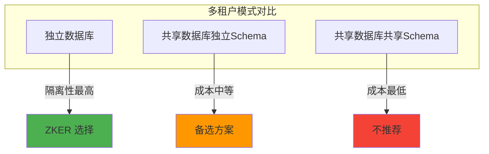
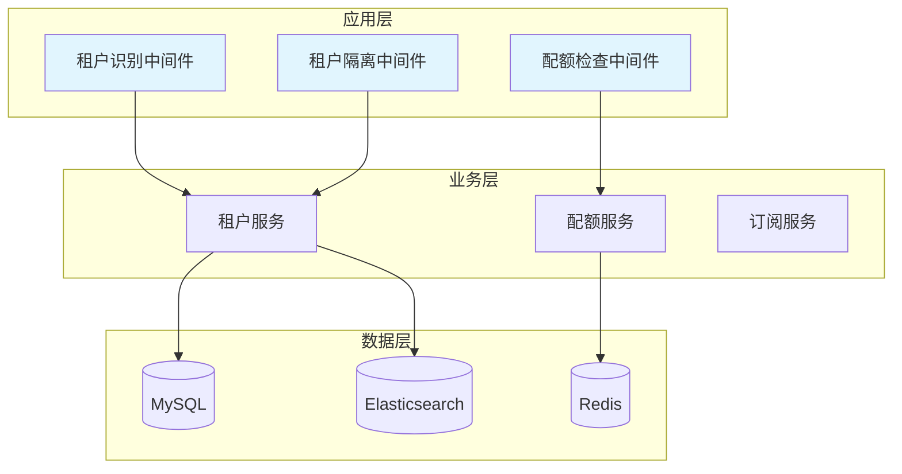
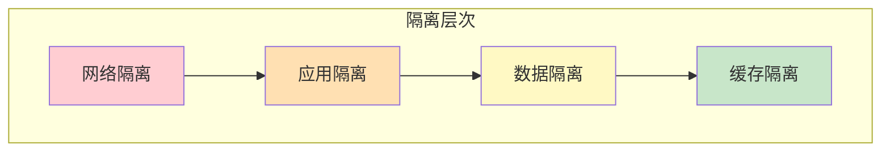
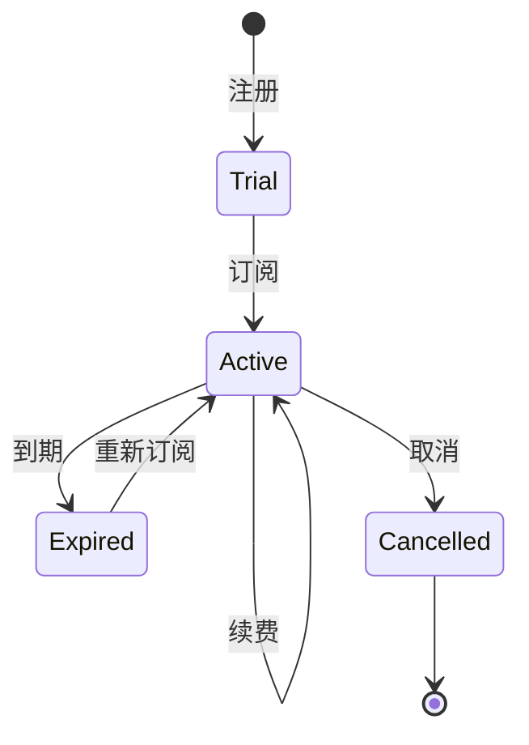

# ZKER 多租户架构设计

**版本**: v3.0.0 | **更新**: 2025-01-03 | **状态**: 已实现

---

## 目录

- [架构概览](#架构概览)
- [租户隔离设计](#租户隔离设计)
- [数据模型设计](#数据模型设计)
- [配额管理设计](#配额管理设计)
- [订阅计费设计](#订阅计费设计)
- [租户监控设计](#租户监控设计)
- [API 设计](#api-设计)
- [实现清单](#实现清单)

---

## 架构概览

### 多租户模式选择



**ZKER 选择**: 独立数据库模式（Row-Level Security）

| 模式 | 隔离性 | 成本 | 复杂度 | 性能 | 扩展性 |
|------|--------|------|--------|------|--------|
| **独立数据库** | ⭐⭐⭐⭐⭐ | ⭐⭐ | ⭐⭐ | ⭐⭐⭐⭐⭐ | ⭐⭐⭐⭐⭐ |
| **共享数据库独立Schema** | ⭐⭐⭐⭐ | ⭐⭐⭐ | ⭐⭐⭐ | ⭐⭐⭐⭐ | ⭐⭐⭐⭐ |
| **共享数据库共享Schema** | ⭐⭐⭐ | ⭐⭐⭐⭐⭐ | ⭐⭐⭐⭐ | ⭐⭐⭐ | ⭐⭐ |

### 架构图



---

## 租户隔离设计

### 隔离层次



### 1. 网络隔离

**实现方式**: 自定义域名 + 请求头识别

```go
// api/middleware/tenant_identification.go
package middleware

import (
    "context"
    "github.com/cloudwego/hertz/pkg/app"
)

// TenantIdentification 租户识别中间件
func TenantIdentification() app.HandlerFunc {
    return func(ctx context.Context, c *app.RequestContext) {
        var tenantID string

        // 方式 1: 从子域名中提取
        host := string(c.Host())
        if parts := strings.Split(host, "."); len(parts) > 1 {
            tenantID = parts[0]
        }

        // 方式 2: 从请求头中提取
        if tenantID == "" {
            tenantID = string(c.GetHeader("X-Tenant-ID"))
        }

        // 方式 3: 从 JWT Token 中提取
        if tenantID == "" {
            token := string(c.GetHeader("Authorization"))
            if claims, err := parseJWT(token); err == nil {
                tenantID = claims.TenantID
            }
        }

        // 验证租户是否存在
        if tenantID == "" {
            c.JSON(400, ErrorResponse(errno.TenantIDRequired))
            c.Abort()
            return
        }

        // 注入到上下文
        context.SetTenantID(ctx, tenantID)

        c.Next(ctx)
    }
}
```

### 2. 应用隔离

**实现方式**: 中间件自动注入 tenant_id

```go
// api/middleware/tenant_isolation.go
package middleware

import (
    "context"
    "github.com/cloudwego/hertz/pkg/app"
    "gorm.io/gorm"
)

// TenantIsolation 租户隔离中间件
func TenantIsolation(db *gorm.DB) app.HandlerFunc {
    return func(ctx context.Context, c *app.RequestContext) {
        tenantID := context.GetTenantID(ctx)

        // 注入租户ID到 GORM
        c.Set("db", db.Scopes(func(db *gorm.DB) *gorm.DB {
            return db.Where("tenant_id = ? AND deleted_at IS NULL", tenantID)
        }))

        c.Next(ctx)
    }
}
```

### 3. 数据隔离

**实现方式**: 所有业务表包含 tenant_id 字段

```sql
-- 所有业务表必须包含 tenant_id
CREATE TABLE bots (
    bot_id VARCHAR(36) PRIMARY KEY,
    tenant_id VARCHAR(36) NOT NULL COMMENT '租户ID',
    bot_name VARCHAR(100) NOT NULL,
    ...
    INDEX idx_tenant_id (tenant_id),
    INDEX idx_tenant_bot (tenant_id, bot_id)
) ENGINE=InnoDB DEFAULT CHARSET=utf8mb4;

-- 查询时自动过滤
SELECT * FROM bots WHERE tenant_id = ? AND bot_id = ?;
SELECT * FROM bots WHERE tenant_id = ? ORDER BY created_at DESC;
```

### 4. 缓存隔离

**实现方式**: Redis key 带租户前缀

```go
// infra/cache/redis.go
package cache

import (
    "context"
    "fmt"
)

type RedisCache struct {
    client *redis.Client
}

// Get 获取缓存（自动添加租户前缀）
func (c *RedisCache) Get(ctx context.Context, key string) (string, error) {
    tenantID := context.GetTenantID(ctx)
    tenantKey := fmt.Sprintf("tenant:%s:%s", tenantID, key)
    return c.client.Get(ctx, tenantKey).Result()
}

// Set 设置缓存（自动添加租户前缀）
func (c *RedisCache) Set(ctx context.Context, key string, value interface{}, expiration time.Duration) error {
    tenantID := context.GetTenantID(ctx)
    tenantKey := fmt.Sprintf("tenant:%s:%s", tenantID, key)
    return c.client.Set(ctx, tenantKey, value, expiration).Err()
}

// 示例
// tenant_123:tenant:tenant_456:user:user_789
```

---

## 数据模型设计

### 核心表结构

```sql
-- 租户表
CREATE TABLE tenants (
    tenant_id VARCHAR(36) PRIMARY KEY COMMENT '租户ID',
    tenant_name VARCHAR(100) NOT NULL COMMENT '租户名称',
    plan_type VARCHAR(20) NOT NULL DEFAULT 'free' COMMENT '套餐类型：free=免费版, pro=专业版, enterprise=企业版',
    status VARCHAR(20) NOT NULL DEFAULT 'active' COMMENT '状态：active=激活, inactive=未激活, suspended=停用',
    quota JSON NOT NULL COMMENT '配额信息',
    subscription JSON COMMENT '订阅信息',
    created_at TIMESTAMP NOT NULL DEFAULT CURRENT_TIMESTAMP COMMENT '创建时间',
    updated_at TIMESTAMP NOT NULL DEFAULT CURRENT_TIMESTAMP ON UPDATE CURRENT_TIMESTAMP COMMENT '更新时间',
    deleted_at TIMESTAMP NULL COMMENT '删除时间',
    UNIQUE KEY uk_tenant_name_deleted (tenant_name, deleted_at),
    INDEX idx_status (status),
    INDEX idx_plan_type (plan_type)
) ENGINE=InnoDB DEFAULT CHARSET=utf8mb4 COMMENT='租户表';

-- 配额表（可选：如果配额复杂，可以单独建表）
CREATE TABLE tenant_quotas (
    id BIGINT PRIMARY KEY AUTO_INCREMENT,
    tenant_id VARCHAR(36) NOT NULL COMMENT '租户ID',
    quota_type VARCHAR(50) NOT NULL COMMENT '配额类型：tokens, api_calls, storage, bots, users',
    max_value BIGINT NOT NULL COMMENT '最大值',
    used_value BIGINT NOT NULL DEFAULT 0 COMMENT '已使用值',
    reset_period VARCHAR(20) COMMENT '重置周期：daily, weekly, monthly, never',
    reset_at TIMESTAMP COMMENT '下次重置时间',
    created_at TIMESTAMP NOT NULL DEFAULT CURRENT_TIMESTAMP,
    updated_at TIMESTAMP NOT NULL DEFAULT CURRENT_TIMESTAMP ON UPDATE CURRENT_TIMESTAMP,
    UNIQUE KEY uk_tenant_quota_type (tenant_id, quota_type),
    INDEX idx_tenant_id (tenant_id),
    FOREIGN KEY fk_tenant_quotas_tenants_tenant_id (tenant_id) REFERENCES tenants(tenant_id)
) ENGINE=InnoDB DEFAULT CHARSET=utf8mb4 COMMENT='租户配额表';

-- 订阅表
CREATE TABLE tenant_subscriptions (
    id BIGINT PRIMARY KEY AUTO_INCREMENT,
    tenant_id VARCHAR(36) NOT NULL COMMENT '租户ID',
    plan_type VARCHAR(20) NOT NULL COMMENT '套餐类型',
    status VARCHAR(20) NOT NULL DEFAULT 'active' COMMENT '状态：active=激活, expired=过期, cancelled=取消',
    start_date DATE NOT NULL COMMENT '开始日期',
    end_date DATE COMMENT '结束日期（null 表示永久）',
    auto_renew BOOLEAN DEFAULT TRUE COMMENT '自动续费',
    created_at TIMESTAMP NOT NULL DEFAULT CURRENT_TIMESTAMP,
    updated_at TIMESTAMP NOT NULL DEFAULT CURRENT_TIMESTAMP ON UPDATE CURRENT_TIMESTAMP,
    UNIQUE KEY uk_tenant_id (tenant_id),
    INDEX idx_status (status),
    INDEX idx_end_date (end_date),
    FOREIGN KEY fk_tenant_subscriptions_tenants_tenant_id (tenant_id) REFERENCES tenants(tenant_id)
) ENGINE=InnoDB DEFAULT CHARSET=utf8mb4 COMMENT='租户订阅表';
```

### 实体定义

```go
// domain/tenant/entity/tenant.go
package entity

import "time"

// Tenant 租户实体
type Tenant struct {
    TenantID    string         `json:"tenant_id" gorm:"primaryKey;size:36"`
    TenantName  string         `json:"tenant_name" gorm:"uniqueIndex:uk_tenant_name_deleted;size:100;not null"`
    PlanType    string         `json:"plan_type" gorm:"size:20;not null;default:'free'"`
    Status      string         `json:"status" gorm:"size:20;not null;default:'active'"`
    Quota       Quota          `json:"quota" gorm:"embedded;embeddedPrefix:quota_"`
    Subscription *Subscription `json:"subscription,omitempty" gorm:"foreignKey:TenantID"`
    CreatedAt   time.Time      `json:"created_at" gorm:"autoCreateTime"`
    UpdatedAt   time.Time      `json:"updated_at" gorm:"autoUpdateTime"`
    DeletedAt   *time.Time     `json:"deleted_at,omitempty" gorm:"index"`
}

// Quota 配额值对象
type Quota struct {
    MaxTokens     int64 `json:"max_tokens" gorm:"default:1000000"`
    MaxAPICalls   int64 `json:"max_api_calls" gorm:"default:10000"`
    MaxStorageGB  int64 `json:"max_storage_gb" gorm:"default:10"`
    MaxBots       int64 `json:"max_bots" gorm:"default:10"`
    MaxUsers      int64 `json:"max_users" gorm:"default:5"`
    UsedTokens    int64 `json:"used_tokens" gorm:"default:0"`
    UsedAPICalls  int64 `json:"used_api_calls" gorm:"default:0"`
    UsedStorageGB int64 `json:"used_storage_gb" gorm:"default:0"`
    UsedBots      int64 `json:"used_bots" gorm:"default:0"`
    UsedUsers     int64 `json:"used_users" gorm:"default:0"`
}

// Subscription 订阅值对象
type Subscription struct {
    TenantID    string    `json:"tenant_id" gorm:"size:36"`
    PlanType    string    `json:"plan_type" gorm:"size:20;not null"`
    Status      string    `json:"status" gorm:"size:20;not null;default:'active'"`
    StartDate   time.Time `json:"start_date" gorm:"not null"`
    EndDate     *time.Time `json:"end_date,omitempty"`
    AutoRenew   bool      `json:"auto_renew" gorm:"default:true"`
}

// IsActive 租户是否激活
func (t *Tenant) IsActive() bool {
    return t.Status == "active" && t.DeletedAt == nil
}

// CanUseToken 检查是否可以使用 Token
func (t *Tenant) CanUseToken(tokens int64) bool {
    return t.Quota.UsedTokens+tokens <= t.Quota.MaxTokens
}

// UseToken 使用 Token
func (t *Tenant) UseToken(tokens int64) error {
    if !t.CanUseToken(tokens) {
        return errno.QuotaExceeded
    }
    t.Quota.UsedTokens += tokens
    return nil
}

// IsSubscriptionExpired 订阅是否过期
func (t *Tenant) IsSubscriptionExpired() bool {
    if t.Subscription == nil {
        return false
    }
    if t.Subscription.EndDate == nil {
        return false
    }
    return time.Now().After(*t.Subscription.EndDate)
}
```

---

## 配额管理设计

### 配额类型

| 配额类型 | 说明 | 免费版 | 专业版 | 企业版 |
|---------|------|--------|--------|--------|
| **Tokens** | 每月 Token 配额 | 100 万 | 1000 万 | 1 亿 |
| **API Calls** | 每月 API 调用次数 | 1 万 | 10 万 | 100 万 |
| **Storage** | 存储空间（GB） | 10 | 100 | 1000 |
| **Bots** | 最大 Bot 数量 | 10 | 100 | 无限 |
| **Users** | 最大用户数量 | 5 | 50 | 无限 |

### 配额检查中间件

```go
// api/middleware/quota_check.go
package middleware

import (
    "context"
    "github.com/cloudwego/hertz/pkg/app"
)

// QuotaCheck 配额检查中间件
func QuotaCheck(quotaType string) app.HandlerFunc {
    return func(ctx context.Context, c *app.RequestContext) {
        tenantID := context.GetTenantID(ctx)

        // 获取租户配额
        tenant, err := tenantApp.GetTenantByID(ctx, tenantID)
        if err != nil {
            c.JSON(500, ErrorResponse(err))
            c.Abort()
            return
        }

        // 检查配额
        switch quotaType {
        case "tokens":
            tokens := getTokensFromRequest(c)
            if !tenant.CanUseToken(tokens) {
                c.JSON(429, ErrorResponse(errno.QuotaExceeded))
                c.Abort()
                return
            }
        case "api_calls":
            if tenant.Quota.UsedAPICalls >= tenant.Quota.MaxAPICalls {
                c.JSON(429, ErrorResponse(errno.QuotaExceeded))
                c.Abort()
                return
            }
        case "bots":
            if tenant.Quota.UsedBots >= tenant.Quota.MaxBots {
                c.JSON(429, ErrorResponse(errno.QuotaExceeded))
                c.Abort()
                return
            }
        }

        c.Next(ctx)
    }
}
```

### 配额使用

```go
// application/quota/quota.go
package quota

import (
    "context"
    "backend/domain/tenant"
)

type QuotaApplication struct {
    tenantRepo tenant.Repository
}

// UseToken 使用 Token
func (app *QuotaApplication) UseToken(ctx context.Context, tenantID string, tokens int64) error {
    // 获取租户
    t, err := app.tenantRepo.FindByID(ctx, tenantID)
    if err != nil {
        return err
    }

    // 检查配额
    if !t.CanUseToken(tokens) {
        return errno.QuotaExceeded
    }

    // 使用 Token
    if err := t.UseToken(tokens); err != nil {
        return err
    }

    // 保存
    return app.tenantRepo.Update(ctx, t)
}

// RecordAPICall 记录 API 调用
func (app *QuotaApplication) RecordAPICall(ctx context.Context, tenantID string) error {
    t, err := app.tenantRepo.FindByID(ctx, tenantID)
    if err != nil {
        return err
    }

    if t.Quota.UsedAPICalls >= t.Quota.MaxAPICalls {
        return errno.QuotaExceeded
    }

    t.Quota.UsedAPICalls++
    return app.tenantRepo.Update(ctx, t)
}
```

---

## 订阅计费设计

### 套餐类型

| 套餐 | 价格（月） | 价格（年） | Token | API Calls | Storage | Bots | Users |
|------|-----------|-----------|-------|-----------|---------|-------|-------|
| **免费版** | ¥0 | ¥0 | 100 万 | 1 万 | 10 GB | 10 | 5 |
| **专业版** | ¥99 | ¥990 | 1000 万 | 10 万 | 100 GB | 100 | 50 |
| **企业版** | ¥999 | ¥9990 | 1 亿 | 100 万 | 1000 GB | 无限 | 无限 |

### 订阅生命周期



### 计费逻辑

```go
// domain/tenant/service/billing.go
package service

import (
    "context"
    "backend/domain/tenant"
)

type BillingService struct {
    tenantRepo  tenant.Repository
    paymentSvc  PaymentService
}

// CalculateBilling 计算费用
func (s *BillingService) CalculateBilling(ctx context.Context, tenantID string, planType string, duration int) (*Billing, error) {
    var price int64

    // 获取套餐价格
    switch planType {
    case "pro":
        if duration == 12 { // 年付
            price = 990 * 100 // 分
        } else { // 月付
            price = 99 * 100 * int64(duration)
        }
    case "enterprise":
        if duration == 12 {
            price = 9990 * 100
        } else {
            price = 999 * 100 * int64(duration)
        }
    default:
        return nil, errno.InvalidPlanType
    }

    // 创建账单
    billing := &Billing{
        TenantID:    tenantID,
        PlanType:    planType,
        Duration:    duration,
        Amount:      price,
        Status:      "pending",
        CreatedAt:   time.Now(),
    }

    return billing, nil
}

// RenewSubscription 续费
func (s *BillingService) RenewSubscription(ctx context.Context, tenantID string, planType string, duration int) error {
    // 计算费用
    billing, err := s.CalculateBilling(ctx, tenantID, planType, duration)
    if err != nil {
        return err
    }

    // 调用支付
    if err := s.paymentSvc.Charge(ctx, billing); err != nil {
        return err
    }

    // 更新订阅
    t, err := s.tenantRepo.FindByID(ctx, tenantID)
    if err != nil {
        return err
    }

    // 计算新的结束日期
    var endDate time.Time
    if t.Subscription.EndDate != nil && t.Subscription.EndDate.After(time.Now()) {
        endDate = t.Subscription.EndDate.AddDate(0, duration, 0)
    } else {
        endDate = time.Now().AddDate(0, duration, 0)
    }

    t.Subscription.PlanType = planType
    t.Subscription.EndDate = &endDate
    t.Subscription.Status = "active"

    return s.tenantRepo.Update(ctx, t)
}
```

---

## 租户监控设计

### 监控指标

| 指标 | 说明 | 采集频率 |
|------|------|---------|
| **资源使用率** | Token、API、存储使用率 | 每小时 |
| **活跃用户数** | 活跃用户数量 | 每天 |
| **Bot 数量** | Bot 数量 | 每天 |
| **API 调用** | API 调用量 | 每小时 |
| **错误率** | API 错误率 | 每小时 |

### 监控实现

```go
// application/monitoring/tenant_monitoring.go
package monitoring

import (
    "context"
    "backend/domain/tenant"
)

type TenantMonitoringService struct {
    tenantRepo tenant.Repository
    metrics    MetricsCollector
}

// CollectMetrics 收集指标
func (s *TenantMonitoringService) CollectMetrics(ctx context.Context) error {
    tenants, err := s.tenantRepo.List(ctx, &tenant.ListRequest{})
    if err != nil {
        return err
    }

    for _, t := range tenants {
        // Token 使用率
        tokenUsage := float64(t.Quota.UsedTokens) / float64(t.Quota.MaxTokens) * 100
        s.metrics.Gauge("tenant.quota.token.usage", tokenUsage, map[string]string{
            "tenant_id": t.TenantID,
            "plan_type": t.PlanType,
        })

        // API 调用使用率
        apiUsage := float64(t.Quota.UsedAPICalls) / float64(t.Quota.MaxAPICalls) * 100
        s.metrics.Gauge("tenant.quota.api.usage", apiUsage, map[string]string{
            "tenant_id": t.TenantID,
            "plan_type": t.PlanType,
        })

        // Bot 数量
        s.metrics.Gauge("tenant.bots.count", float64(t.Quota.UsedBots), map[string]string{
            "tenant_id": t.TenantID,
            "plan_type": t.PlanType,
        })

        // 用户数量
        s.metrics.Gauge("tenant.users.count", float64(t.Quota.UsedUsers), map[string]string{
            "tenant_id": t.TenantID,
            "plan_type": t.PlanType,
        })
    }

    return nil
}
```

---

## API 设计

### 租户管理 API

```
# 创建租户
POST /api/v1/tenants

# 获取租户列表
GET /api/v1/tenants?page=1&page_size=20

# 获取租户详情
GET /api/v1/tenants/:id

# 更新租户
PUT /api/v1/tenants/:id

# 删除租户
DELETE /api/v1/tenants/:id

# 获取租户配额
GET /api/v1/tenants/:id/quota

# 更新租户配额
PUT /api/v1/tenants/:id/quota

# 获取租户订阅
GET /api/v1/tenants/:id/subscription

# 更新租户订阅
PUT /api/v1/tenants/:id/subscription

# 取消订阅
DELETE /api/v1/tenants/:id/subscription
```

### 配额管理 API

```
# 获取配额使用情况
GET /api/v1/quota/usage

# 获取配额历史
GET /api/v1/quota/history?start_date=2025-01-01&end_date=2025-01-31

# 重置配额
POST /api/v1/quota/reset
```

---

## 实现清单

### 后端实现

- [x] `domain/tenant/entity/tenant.go` - 租户实体
- [x] `domain/tenant/repository/tenant_repository.go` - 租户仓储
- [x] `domain/tenant/service/tenant_service.go` - 租户服务
- [x] `application/tenant/tenant_application.go` - 租户应用服务
- [x] `api/middleware/tenant_identification.go` - 租户识别中间件
- [x] `api/middleware/tenant_isolation.go` - 租户隔离中间件
- [x] `api/middleware/quota_check.go` - 配额检查中间件
- [x] `api/handler/coze/tenant_service.go` - 租户 API 处理器

### 前端实现

- [ ] `frontend/packages/studio/pages/tenant/TenantList.tsx` - 租户列表
- [ ] `frontend/packages/studio/pages/tenant/TenantDetail.tsx` - 租户详情
- [ ] `frontend/packages/studio/pages/tenant/TenantForm.tsx` - 租户表单
- [ ] `frontend/packages/studio/pages/tenant/QuotaMonitor.tsx` - 配额监控
- [ ] `frontend/packages/studio/pages/tenant/SubscriptionManage.tsx` - 订阅管理

### 数据库实现

- [x] `tenants` 表 - 租户表
- [x] `tenant_quotas` 表 - 租户配额表
- [x] `tenant_subscriptions` 表 - 租户订阅表
- [x] 所有业务表添加 `tenant_id` 字段

---

## 相关文档

| 文档 | 说明 |
|------|------|
| [data-model.md](data-model.md) | 数据模型设计 |
| [isolation.md](isolation.md) | 租户隔离设计 |
| [../02-SPECS/database-design.md](../02-SPECS/database-design.md) | 数据库设计规范 |

---

**🎯 目标**: 完整的多租户隔离，保证数据安全和资源可控！
