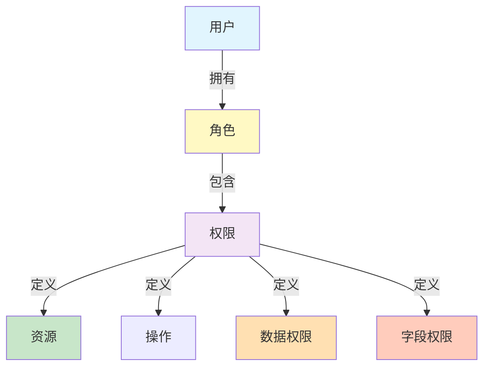
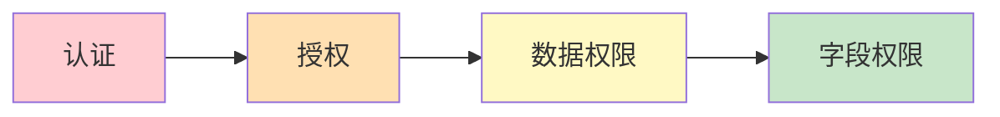
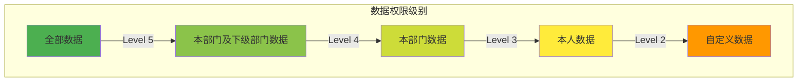
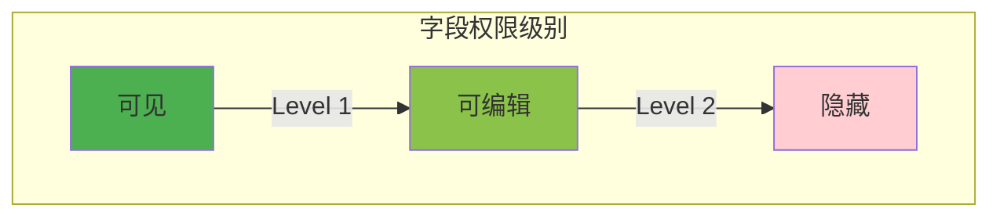
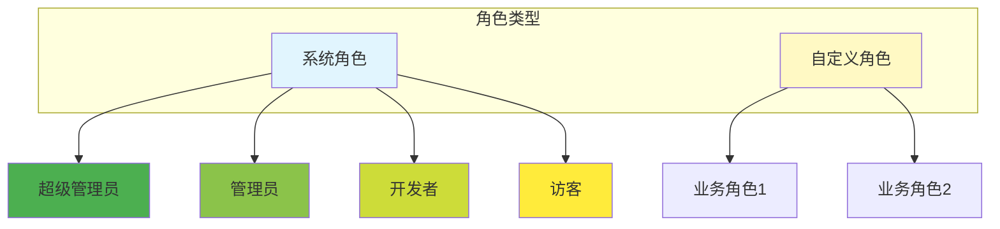

# ZKER RBAC 权限架构设计

**版本**: v3.0.0 | **更新**: 2025-01-03 | **状态**: 已实现

---

## 目录

- [架构概览](#架构概览)
- [数据权限设计](#数据权限设计)
- [字段权限设计](#字段权限设计)
- [角色管理设计](#角色管理设计)
- [权限检查设计](#权限检查设计)
- [API 设计](#api-设计)
- [实现清单](#实现清单)

---

## 架构概览

### RBAC 模型



### 权限层次



| 层次 | 说明 | 示例 |
|------|------|------|
| **认证** | 验证用户身份 | JWT Token |
| **授权** | 验证用户权限 | RBAC |
| **数据权限** | 控制数据访问范围 | 全部、部门、本人 |
| **字段权限** | 控制字段可见性 | 可见、可编辑、隐藏 |

---

## 数据权限设计

### 数据权限级别



| 级别 | 名称 | 说明 | 示例 |
|------|------|------|------|
| **1** | 全部数据 | 可以访问所有数据 | 超级管理员 |
| **2** | 本部门及下级 | 可以访问本部门及下级部门数据 | 部门经理 |
| **3** | 本部门数据 | 只能访问本部门数据 | 部门成员 |
| **4** | 本人数据 | 只能访问自己的数据 | 普通用户 |
| **5** | 自定义数据 | 自定义数据访问范围 | 特殊角色 |

### 数据权限实现

```go
// domain/permission/entity/data_permission.go
package entity

// DataScope 数据权限范围
type DataScope string

const (
    DataScopeAll       DataScope = "all"         // 全部数据
    DataScopeDept      DataScope = "dept"        // 本部门及下级
    DataScopeDeptOnly  DataScope = "dept_only"   // 本部门
    DataScopeSelf      DataScope = "self"        // 本人数据
    DataScopeCustom    DataScope = "custom"      // 自定义
)

// DataPermission 数据权限
type DataPermission struct {
    ResourceID   string    `json:"resource_id"`              // 资源ID
    ResourceType string    `json:"resource_type"`            // 资源类型
    DataScope    DataScope `json:"data_scope"`               // 数据权限范围
    DeptIDs      []string  `json:"dept_ids,omitempty"`       // 部门ID列表（自定义时使用）
    UserIDs      []string  `json:"user_ids,omitempty"`       // 用户ID列表（自定义时使用）
}
```

### 数据权限过滤器

```go
// application/permission/data_filter.go
package permission

import (
    "context"
    "backend/domain/permission"
    "gorm.io/gorm"
)

type DataFilter struct {
    permSvc permission.Service
}

// BuildDataScope 构建数据权限范围
func (f *DataFilter) BuildDataScope(ctx context.Context, db *gorm.DB, resourceType string, resourceID string) *gorm.DB {
    userID := context.GetUserID(ctx)
    tenantID := context.GetTenantID(ctx)

    // 获取用户的数据权限
    dataPerm, err := f.permSvc.GetDataPermission(ctx, userID, tenantID, resourceType, resourceID)
    if err != nil {
        return db
    }

    switch dataPerm.DataScope {
    case permission.DataScopeAll:
        // 全部数据：不添加过滤
        return db

    case permission.DataScopeDept:
        // 本部门及下级：需要获取用户部门及下级部门
        user, err := f.userSvc.GetByID(ctx, userID)
        if err != nil {
            return db.Where("1 = 0") // 无权限
        }
        deptIDs := f.deptSvc.GetChildrenIDs(ctx, user.DeptID)
        return db.Where("dept_id IN ?", deptIDs)

    case permission.DataScopeDeptOnly:
        // 本部门数据
        user, err := f.userSvc.GetByID(ctx, userID)
        if err != nil {
            return db.Where("1 = 0")
        }
        return db.Where("dept_id = ?", user.DeptID)

    case permission.DataScopeSelf:
        // 本人数据
        return db.Where("created_by = ?", userID)

    case permission.DataScopeCustom:
        // 自定义数据
        if len(dataPerm.DeptIDs) > 0 {
            return db.Where("dept_id IN ?", dataPerm.DeptIDs)
        }
        if len(dataPerm.UserIDs) > 0 {
            return db.Where("created_by IN ?", dataPerm.UserIDs)
        }
        return db.Where("1 = 0")

    default:
        return db.Where("1 = 0")
    }
}

// 使用示例
func (r *BotRepository) List(ctx context.Context, req *ListRequest) ([]*Bot, error) {
    var bots []*Bot

    db := r.db.WithContext(ctx)

    // 应用数据权限过滤
    db = dataFilter.BuildDataScope(ctx, db, "bot", "")

    err := db.Find(&bots).Error
    return bots, err
}
```

---

## 字段权限设计

### 字段权限级别



| 级别 | 名称 | 说明 | 示例 |
|------|------|------|------|
| **1** | 可见 | 字段可见，不可编辑 | 只读字段 |
| **2** | 可编辑 | 字段可见，可编辑 | 普通字段 |
| **3** | 隐藏 | 字段不可见 | 敏感字段 |

### 字段权限实现

```go
// domain/permission/entity/field_permission.go
package entity

// FieldScope 字段权限范围
type FieldScope string

const (
    FieldScopeVisible  FieldScope = "visible"  // 可见
    FieldScopeEditable FieldScope = "editable" // 可编辑
    FieldScopeHidden   FieldScope = "hidden"   // 隐藏
)

// FieldPermission 字段权限
type FieldPermission struct {
    ResourceID   string                    `json:"resource_id"`   // 资源ID
    ResourceType string                    `json:"resource_type"` // 资源类型
    Fields       map[string]FieldScope     `json:"fields"`       // 字段权限
}

// 示例
// {
//   "resource_type": "bot",
//   "resource_id": "bot_123",
//   "fields": {
//     "bot_name": "editable",
//     "description": "editable",
//     "api_key": "hidden",
//     "created_at": "visible"
//   }
// }
```

### 字段权限过滤

```typescript
// frontend/utils/fieldFilter.ts
import { FieldScope } from '@/types/permission';

export interface FieldPermission {
  [fieldName: string]: FieldScope;
}

export const filterFields = <T extends Record<string, any>>(
  data: T,
  fieldPermission: FieldPermission
): Partial<T> => {
  const result: Partial<T> = {};

  for (const [fieldName, scope] of Object.entries(fieldPermission)) {
    if (scope === FieldScope.Visible || scope === FieldScope.Editable) {
      result[fieldName] = data[fieldName];
    }
  }

  return result;
};

export const isFieldEditable = (
  fieldName: string,
  fieldPermission: FieldPermission
): boolean => {
  return fieldPermission[fieldName] === FieldScope.Editable;
};

export const isFieldVisible = (
  fieldName: string,
  fieldPermission: FieldPermission
): boolean => {
  const scope = fieldPermission[fieldName];
  return scope === FieldScope.Visible || scope === FieldScope.Editable;
};
```

---

## 角色管理设计

### 角色类型



| 角色 | 类型 | 数据权限 | 说明 |
|------|------|---------|------|
| **超级管理员** | 系统 | 全部数据 | 拥有所有权限 |
| **管理员** | 系统 | 本部门及下级 | 部门管理员 |
| **开发者** | 系统 | 本人数据 | 开发人员 |
| **访客** | 系统 | 本人数据 | 只读权限 |
| **自定义角色** | 自定义 | 自定义 | 用户自定义 |

### 角色实体

```go
// domain/permission/entity/role.go
package entity

import "time"

// Role 角色实体
type Role struct {
    RoleID       string           `json:"role_id" gorm:"primaryKey;size:36"`
    TenantID     string           `json:"tenant_id" gorm:"size:36;not null;index"`
    RoleName     string           `json:"role_name" gorm:"size:100;not null"`
    RoleCode     string           `json:"role_code" gorm:"size:50;not null;uniqueIndex:uk_tenant_code"`
    RoleType     string           `json:"role_type" gorm:"size:20;not null;default:'custom'"` // system, custom
    Description  string           `json:"description" gorm:"size:500"`
    Permissions Permissions      `json:"permissions" gorm:"embedded;embeddedPrefix:perm_"`
    Status       string           `json:"status" gorm:"size:20;not null;default:'active'"`
    CreatedAt    time.Time        `json:"created_at" gorm:"autoCreateTime"`
    UpdatedAt    time.Time        `json:"updated_at" gorm:"autoUpdateTime"`
    DeletedAt    *time.Time       `json:"deleted_at,omitempty" gorm:"index"`
}

// Permissions 权限集合
type Permissions struct {
    Resources []ResourcePermission `json:"resources"`
}

// ResourcePermission 资源权限
type ResourcePermission struct {
    ResourceID   string                 `json:"resource_id"`
    ResourceType string                 `json:"resource_type"`
    Actions      []string               `json:"actions"`      // read, write, delete
    DataScope    string                 `json:"data_scope"`   // all, dept, dept_only, self, custom
    FieldScope   map[string]string      `json:"field_scope"`  // 字段权限
}
```

### 默认角色

```go
// domain/permission/service/role_service.go
package service

import (
    "context"
    "backend/domain/permission"
)

const (
    RoleSuperAdmin = "super_admin" // 超级管理员
    RoleAdmin      = "admin"       // 管理员
    RoleDeveloper  = "developer"   // 开发者
    RoleGuest      = "guest"       // 访客
)

// InitDefaultRoles 初始化默认角色
func (s *RoleService) InitDefaultRoles(ctx context.Context, tenantID string) error {
    roles := []*permission.Role{
        {
            RoleID:   generateRoleID(),
            TenantID: tenantID,
            RoleName: "超级管理员",
            RoleCode: RoleSuperAdmin,
            RoleType: "system",
            Permissions: permission.Permissions{
                Resources: []permission.ResourcePermission{
                    {
                        ResourceID:   "*",
                        ResourceType: "*",
                        Actions:      []string{"*"},
                        DataScope:    string(permission.DataScopeAll),
                    },
                },
            },
            Status: "active",
        },
        {
            RoleID:   generateRoleID(),
            TenantID: tenantID,
            RoleName: "管理员",
            RoleCode: RoleAdmin,
            RoleType: "system",
            Permissions: permission.Permissions{
                Resources: []permission.ResourcePermission{
                    {
                        ResourceID:   "*",
                        ResourceType: "*",
                        Actions:      []string{"read", "write"},
                        DataScope:    string(permission.DataScopeDept),
                    },
                },
            },
            Status: "active",
        },
        {
            RoleID:   generateRoleID(),
            TenantID: tenantID,
            RoleName: "开发者",
            RoleCode: RoleDeveloper,
            RoleType: "system",
            Permissions: permission.Permissions{
                Resources: []permission.ResourcePermission{
                    {
                        ResourceID:   "*",
                        ResourceType: "*",
                        Actions:      []string{"read", "write"},
                        DataScope:    string(permission.DataScopeSelf),
                    },
                },
            },
            Status: "active",
        },
        {
            RoleID:   generateRoleID(),
            TenantID: tenantID,
            RoleName: "访客",
            RoleCode: RoleGuest,
            RoleType: "system",
            Permissions: permission.Permissions{
                Resources: []permission.ResourcePermission{
                    {
                        ResourceID:   "*",
                        ResourceType: "*",
                        Actions:      []string{"read"},
                        DataScope:    string(permission.DataScopeSelf),
                    },
                },
            },
            Status: "active",
        },
    }

    for _, role := range roles {
        if err := s.repo.Create(ctx, role); err != nil {
            return err
        }
    }

    return nil
}
```

---

## 权限检查设计

### 权限检查中间件

```go
// api/middleware/permission_check.go
package middleware

import (
    "context"
    "github.com/cloudwego/hertz/pkg/app"
)

// PermissionCheck 权限检查中间件
func PermissionCheck(resourceType, resourceID, action string) app.HandlerFunc {
    return func(ctx context.Context, c *app.RequestContext) {
        userID := context.GetUserID(ctx)
        tenantID := context.GetTenantID(ctx)

        // 检查权限
        hasPermission, err := permissionSvc.CheckPermission(ctx, userID, tenantID, resourceType, resourceID, action)
        if err != nil {
            c.JSON(500, ErrorResponse(err))
            c.Abort()
            return
        }

        if !hasPermission {
            c.JSON(403, ErrorResponse(errno.PermissionDenied))
            c.Abort()
            return
        }

        c.Next(ctx)
    }
}

// 使用示例
// r.GET("/api/v1/bots/:id", middleware.PermissionCheck("bot", "", "read"), botHandler.Get)
// r.POST("/api/v1/bots", middleware.PermissionCheck("bot", "", "write"), botHandler.Create)
// r.DELETE("/api/v1/bots/:id", middleware.PermissionCheck("bot", "", "delete"), botHandler.Delete)
```

### 权限检查服务

```go
// domain/permission/service/permission_service.go
package service

import (
    "context"
    "backend/domain/permission"
)

type PermissionService struct {
    roleRepo    permission.RoleRepository
    userRoleRepo permission.UserRoleRepository
}

// CheckPermission 检查权限
func (s *PermissionService) CheckPermission(ctx context.Context, userID, tenantID, resourceType, resourceID, action string) (bool, error) {
    // 获取用户的所有角色
    roles, err := s.userRoleRepo.GetRolesByUser(ctx, userID, tenantID)
    if err != nil {
        return false, err
    }

    // 检查是否有权限
    for _, role := range roles {
        // 超级管理员拥有所有权限
        if role.RoleCode == RoleSuperAdmin {
            return true, nil
        }

        // 检查资源权限
        for _, perm := range role.Permissions.Resources {
            // 匹配资源类型
            if perm.ResourceType != "*" && perm.ResourceType != resourceType {
                continue
            }

            // 匹配资源ID
            if perm.ResourceID != "*" && perm.ResourceID != resourceID {
                continue
            }

            // 匹配操作
            hasAction := false
            for _, a := range perm.Actions {
                if a == "*" || a == action {
                    hasAction = true
                    break
                }
            }

            if hasAction {
                return true, nil
            }
        }
    }

    return false, nil
}
```

---

## API 设计

### 角色管理 API

```
# 创建角色
POST /api/v1/roles

# 获取角色列表
GET /api/v1/roles?page=1&page_size=20

# 获取角色详情
GET /api/v1/roles/:id

# 更新角色
PUT /api/v1/roles/:id

# 删除角色
DELETE /api/v1/roles/:id

# 为角色分配权限
POST /api/v1/roles/:id/permissions

# 获取角色权限
GET /api/v1/roles/:id/permissions
```

### 用户角色 API

```
# 为用户分配角色
POST /api/v1/users/:user_id/roles

# 获取用户角色列表
GET /api/v1/users/:user_id/roles

# 移除用户角色
DELETE /api/v1/users/:user_id/roles/:role_id
```

### 权限检查 API

```
# 检查权限
POST /api/v1/permissions/check

# 获取用户权限列表
GET /api/v1/permissions

# 获取字段权限
GET /api/v1/permissions/fields/:resource_type/:resource_id
```

---

## 实现清单

### 后端实现

- [x] `domain/permission/entity/role.go` - 角色实体
- [x] `domain/permission/entity/permission.go` - 权限实体
- [x] `domain/permission/service/permission_service.go` - 权限服务
- [x] `domain/permission/service/role_service.go` - 角色服务
- [x] `api/middleware/permission_check.go` - 权限检查中间件
- [x] `application/permission/data_filter.go` - 数据权限过滤

### 前端实现

- [ ] `frontend/packages/studio/pages/permission/RoleList.tsx` - 角色列表
- [ ] `frontend/packages/studio/pages/permission/RoleDetail.tsx` - 角色详情
- [ ] `frontend/packages/studio/pages/permission/RoleForm.tsx` - 角色表单
- [ ] `frontend/packages/studio/pages/permission/PermissionMatrix.tsx` - 权限矩阵
- [ ] `frontend/packages/studio/components/PermissionGuard.tsx` - 权限守卫组件

### 数据库实现

- [x] `roles` 表 - 角色表
- [x] `user_roles` 表 - 用户角色关联表
- [x] `permissions` 表 - 权限表

---

## 相关文档

| 文档 | 说明 |
|------|------|
| [data-permission.md](data-permission.md) | 数据权限设计 |
| [field-permission.md](field-permission.md) | 字段权限设计 |
| [../02-SPECS/api-design.md](../02-SPECS/api-design.md) | API 设计规范 |

---

**🎯 目标**: 细粒度的权限控制，保证数据安全和操作可控！
