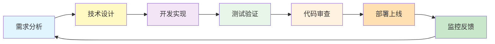
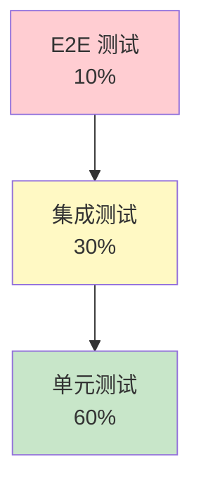
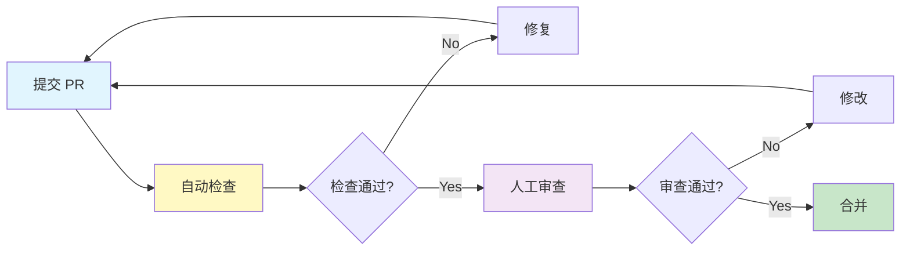
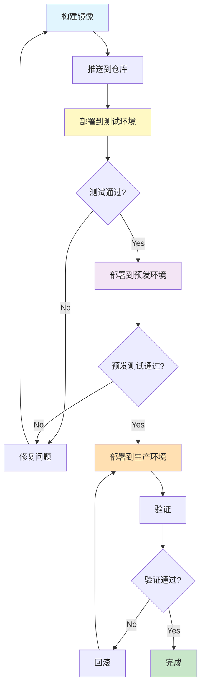
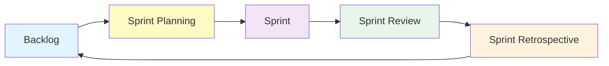

# ZKER 开发流程指南

**版本**: v3.0.0 | **更新**: 2025-01-03

---

## 目录

- [开发流程概览](#开发流程概览)
- [需求分析](#需求分析)
- [技术设计](#技术设计)
- [开发实现](#开发实现)
- [测试验证](#测试验证)
- [代码审查](#代码审查)
- [部署上线](#部署上线)
- [敏捷实践](#敏捷实践)

---

## 开发流程概览

### 开发流程图



### 时间分配

| 阶段 | 时间占比 | 说明 |
|------|---------|------|
| **需求分析** | 10% | 理解需求，明确目标 |
| **技术设计** | 20% | 架构设计，接口设计 |
| **开发实现** | 40% | 编码，单元测试 |
| **测试验证** | 15% | 集成测试，性能测试 |
| **代码审查** | 10% | Review，修改 |
| **部署上线** | 5% | 部署，验证 |

---

## 需求分析

### 需求来源

| 来源 | 说明 | 负责人 |
|------|------|--------|
| **产品需求** | 产品经理提交 | PM |
| **用户反馈** | 用户提交的问题和建议 | Support |
| **技术债务** | 代码重构，性能优化 | Tech Lead |
| **Bug 修复** | 线上问题修复 | Dev |

### 需求文档模板

```markdown
# 需求文档

## 背景
描述需求背景和业务价值

## 目标
明确需求目标（SMART 原则）

## 功能范围
- 功能列表
- 优先级（P0/P1/P2）

## 非功能需求
- 性能要求
- 安全要求
- 兼容性要求

## 验收标准
- 功能验收标准
- 性能验收标准
- 用户体验标准

## 依赖项
- 前置依赖
- 后置依赖

## 风险评估
- 技术风险
- 进度风险
```

### 需求评审

**参与者**: 产品、开发、测试、DevOps

**评审内容**:
- 需求是否清晰
- 技术可行性
- 工作量评估
- 优先级排序

**输出**:
- 评审通过的需求
- 评审问题清单

---

## 技术设计

### 设计文档模板

```markdown
# 技术设计文档

## 需求概述
简述需求背景

## 整体方案
### 架构图
### 技术选型
### 数据模型

## 详细设计
### 接口设计
### 数据库设计
### 缓存设计
### 消息队列设计

## 安全设计
### 认证授权
### 数据加密
### 审计日志

## 性能设计
### 性能目标
### 优化方案

## 测试设计
### 单元测试
### 集成测试
### 性能测试

## 部署设计
### 部署方案
### 回滚方案

## 风险评估
### 技术风险
### 业务风险
```

### 设计评审

**评审内容**:
- 架构合理性
- 接口设计规范
- 数据库设计规范
- 性能方案可行性
- 安全方案完整性

---

## 开发实现

### 分支策略

```mermaid
git
    main[main]
    develop[develop]
    feature[feature/xxx]
    bugfix[bugfix/xxx]

    main --> develop: "发布"
    develop --> feature: "开发"
    feature --> develop: "合并"
    develop --> bugfix: "修复"
    bugfix --> develop: "合并"
```

**分支说明**:

| 分支 | 用途 | 生命周期 |
|------|------|---------|
| **main** | 生产环境 | 长期 |
| **develop** | 开发环境 | 长期 |
| **feature/xxx** | 功能开发 | 临时 |
| **bugfix/xxx** | Bug 修复 | 临时 |
| **hotfix/xxx** | 紧急修复 | 临时 |

### 开发流程

#### 1. 创建功能分支

```bash
git checkout develop
git pull origin develop
git checkout -b feature/tenant-management
```

#### 2. 开发功能

```bash
# 后端开发
cd backend
go mod download
make server

# 前端开发
cd frontend
rush update
rush build
npm run dev
```

#### 3. 提交代码

```bash
git add .
git commit -m "feat(tenant): 实现租户管理功能

- 添加租户 CRUD API
- 添加租户列表页面
- 添加租户详情页面

Closes #123"
```

**提交规范**:

```
<type>(<scope>): <subject>

<body>

<footer>
```

**类型**:
- `feat`: 新功能
- `fix`: Bug 修复
- `docs`: 文档更新
- `style`: 代码格式
- `refactor`: 重构
- `test`: 测试
- `chore`: 构建/工具

#### 4. 推送分支

```bash
git push origin feature/tenant-management
```

#### 5. 创建 Pull Request

在 GitHub 上创建 Pull Request:
- 标题: `feat(tenant): 实现租户管理功能`
- 描述: 详细说明实现内容
- 关联 Issue: `Closes #123`

---

## 测试验证

### 测试金字塔



### 单元测试

**目标覆盖率**: ≥ 80%

```go
// domain/tenant/service/tenant_service_test.go
package service_test

import (
    "context"
    "testing"
    "backend/domain/tenant"
)

func TestTenantService_CreateTenant(t *testing.T) {
    // Arrange
    mockRepo := &MockTenantRepository{}
    svc := tenant.NewTenantService(mockRepo)
    req := &tenant.CreateRequest{
        TenantName: "测试租户",
        PlanType:   "pro",
    }

    // Act
    result, err := svc.CreateTenant(context.Background(), req)

    // Assert
    assert.NoError(t, err)
    assert.NotNil(t, result)
    assert.Equal(t, "测试租户", result.TenantName)
    assert.Equal(t, "pro", result.PlanType)
}
```

### 集成测试

```go
// tests/integration/tenant_test.go
package integration_test

import (
    "context"
    "testing"
    "backend/tests"
)

func TestTenantAPI_CreateTenant(t *testing.T) {
    // Setup
    db := tests.SetupTestDB()
    defer db.Close()

    app := tests.SetupTestApp(db)

    // Test
    req := `{"tenant_name": "测试租户", "plan_type": "pro"}`
    resp := tests.Request(app, "POST", "/api/v1/tenants", req)

    // Assert
    assert.Equal(t, 201, resp.Code)
    assert.Contains(t, resp.Body, "tenant_id")
}
```

### 性能测试

```go
// tests/performance/tenant_benchmark_test.go
package performance_test

import (
    "context"
    "testing"
    "backend/domain/tenant"
)

func BenchmarkTenantService_CreateTenant(b *testing.B) {
    svc := setupService()

    b.ResetTimer()
    for i := 0; i < b.N; i++ {
        _, err := svc.CreateTenant(context.Background(), &tenant.CreateRequest{
            TenantName: "测试租户",
            PlanType:   "pro",
        })
        if err != nil {
            b.Fatal(err)
        }
    }
}
```

---

## 代码审查

### 审查清单

#### 功能性
- [ ] 功能是否正确实现
- [ ] 边界条件是否处理
- [ ] 错误处理是否完善

#### 代码质量
- [ ] 命名是否规范
- [ ] 代码是否简洁
- [ ] 注释是否清晰
- [ ] 是否有重复代码

#### 架构设计
- [ ] DDD 分层是否清晰
- [ ] 依赖方向是否正确
- [ ] 接口设计是否合理

#### 性能
- [ ] 是否有性能问题
- [ ] SQL 查询是否优化
- [ ] 缓存是否合理

#### 安全
- [ ] SQL 注入防护
- [ ] XSS 防护
- [ ] CSRF 防护
- [ ] 权限检查

#### 测试
- [ ] 单元测试是否完整
- [ ] 测试覆盖率是否达标
- [ ] 测试用例是否有效

### 审查流程



---

## 部署上线

### 部署流程



### 部署检查清单

#### 部署前
- [ ] 代码审查通过
- [ ] 测试全部通过
- [ ] 性能测试通过
- [ ] 安全扫描通过
- [ ] 文档更新完成
- [ ] 数据库迁移脚本准备

#### 部署中
- [ ] 备份数据库
- [ ] 备份旧版本
- [ ] 执行数据库迁移
- [ ] 部署新版本
- [ ] 健康检查

#### 部署后
- [ ] 功能验证
- [ ] 性能验证
- [ ] 日志检查
- [ ] 监控检查
- [ ] 用户反馈收集

---

## 敏捷实践

### Scrum 流程



### Sprint 规划

**时长**: 2 周

**参与者**: 全员

**输入**: 需求 Backlog

**输出**:
- Sprint 目标
- Sprint Backlog
- 任务分配

### 每日站会

**时间**: 每天 10:00，15 分钟

**参与者**: 开发团队

**内容**:
- 昨天完成了什么
- 今天计划做什么
- 遇到什么阻碍

### Sprint 评审

**时间**: Sprint 结束

**参与者**: 全员 + 利益相关者

**内容**:
- 演示完成的增量
- 收集反馈

### Sprint 回顾

**时间**: Sprint 评审后

**参与者**: 开发团队

**内容**:
- 哪些做得好
- 哪些需要改进
- 改进计划

---

## 工具链

### 项目管理

| 工具 | 用途 |
|------|------|
| **GitHub Projects** | 项目管理 |
| **GitHub Issues** | 问题追踪 |
| **GitHub Actions** | CI/CD |

### 开发工具

| 工具 | 用途 |
|------|------|
| **GoLand** | Go 开发 |
| **VS Code** | 前端开发 |
| **Postman** | API 测试 |
| **Docker Desktop** | 本地开发环境 |

### 协作工具

| 工具 | 用途 |
|------|------|
| **GitHub** | 代码托管 |
| **Slack** | 团队沟通 |
| **Notion** | 文档管理 |

---

## 相关文档

| 文档 | 说明 |
|------|------|
| [code-review.md](code-review.md) | 代码审查指南 |
| [testing-strategy.md](testing-strategy.md) | 测试策略 |
| [deployment-checklist.md](deployment-checklist.md) | 部署检查清单 |
| [../02-SPECS/](../02-SPECS/) | 开发规范 |

---

**🎯 目标**: 高效、高质量地交付价值！
