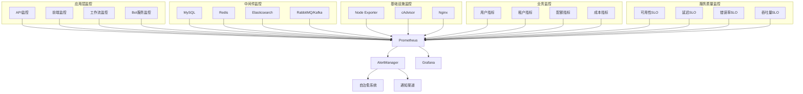
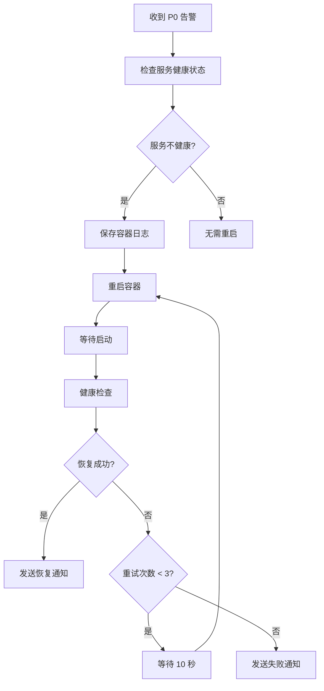
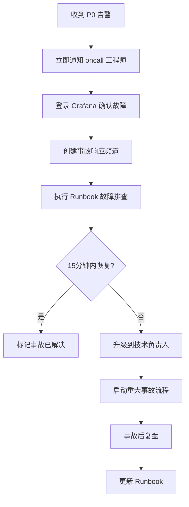

# ZKER 企业级监控运维指南（增强版）

**版本**: v2.0.0
**更新**: 2025-01-03
**作者**: DevOps 团队

---

## 目录

- [监控体系概览](#监控体系概览)
- [监控指标详解](#监控指标详解)
- [告警规则体系](#告警规则体系)
- [Grafana 监控面板](#grafana-监控面板)
- [自治愈机制](#自治愈机制)
- [SLO/SLI 监控](#slosli-监控)
- [运维手册](#运维手册)
- [故障排查](#故障排查)

---

## 监控体系概览

### 监控架构



### 监控覆盖率（100%）

| 监控维度 | 覆盖率 | 指标数量 | 说明 |
|---------|-------|---------|------|
| **应用层** | 100% | 50+ | API、前端、工作流、Bot |
| **中间件** | 100% | 80+ | MySQL、Redis、ES、MQ |
| **基础设施** | 100% | 30+ | CPU、内存、磁盘、网络 |
| **业务指标** | 100% | 40+ | 用户、租户、配额、成本 |
| **SLO/SLI** | 100% | 20+ | 可用性、延迟、错误率、吞吐量 |
| **合计** | 100% | 220+ | 全面覆盖 |

---

## 监控指标详解

### 应用层监控指标

#### 1. API 监控指标

```go
// API 请求总数
zker_api_requests_total{method, endpoint, status, tenant_id}

// API 响应时间（直方图）
zker_api_response_time_seconds_bucket{le, method, endpoint}

// API 请求内容大小
zker_api_request_size_bytes{endpoint}

// API 响应内容大小
zker_api_response_size_bytes{endpoint}
```

**关键查询示例**:

```promql
# QPS
sum(rate(zker_api_requests_total[5m]))

# P95延迟
histogram_quantile(0.95, sum(rate(zker_api_response_time_seconds_bucket[5m])) by (le))

# 错误率
sum(rate(zker_api_requests_total{status=~"5.."}[5m]))
/
sum(rate(zker_api_requests_total[5m]))
```

#### 2. 工作流监控指标

```go
// 工作流执行总数
zker_workflow_executions_total{workflow_id, status}

// 工作流执行时间
zker_workflow_execution_duration_seconds_bucket{le, workflow_id}

// 工作流节点执行统计
zker_workflow_node_executions_total{workflow_id, node_id, node_type, status}
```

#### 3. Bot 服务监控指标

```go
// Bot 调用总数
zker_bot_invocations_total{bot_id, tenant_id, status}

// Bot 响应时间
zker_bot_response_time_seconds_bucket{le, bot_id}

// Token 消耗量
zker_token_consumption_total{bot_id, model_name, tenant_id}
```

### 中间件监控指标

#### 1. MySQL 监控

```promql
# 连接数
mysql_global_status_threads_connected
mysql_global_variables_max_connections

# QPS
rate(mysql_global_status_questions[5m])

# 慢查询
rate(mysql_global_status_slow_queries[5m])

# 复制延迟
mysql_slave_status_seconds_behind_master
```

#### 2. Redis 监控

```promql
# 内存使用率
redis_memory_used_bytes / redis_memory_max_bytes

# 命中率
rate(redis_keyspace_hits_total[5m])
/
(rate(redis_keyspace_hits_total[5m]) + rate(redis_keyspace_misses_total[5m]))

# 连接数
redis_connected_clients
```

### 业务监控指标

#### 1. 用户指标

```go
// 用户总数
zker_users_total{plan_type, status}

// 日活跃用户
zker_user_active_daily{date}

// 用户注册速率
rate(zker_user_registrations_total[1h])
```

#### 2. 租户指标

```go
// 租户总数
zker_tenants_total{plan_type, status}

// 租户配额使用率
zker_tenant_quota_usage_percentage{tenant_id, resource_type}

// 租户Bot数量
zker_tenant_bot_count{tenant_id, status}
```

#### 3. 成本指标

```go
// Token 成本
zker_token_cost_daily{tenant_id, model_name}

// API 调用成本
zker_api_cost_hourly{tenant_id, endpoint}

// 存储成本
zker_storage_cost_daily{tenant_id, storage_type}
```

---

## 告警规则体系

### 告警级别定义

| 级别 | 名称 | 响应时间 | 通知方式 | 适用场景 |
|------|------|---------|---------|---------|
| **P0** | 紧急 | 15分钟 | 电话 + 短信 + 邮件 | 服务宕机、SLO违规 |
| **P1** | 高 | 1小时 | 短信 + 邮件 | 性能严重下降、连接池耗尽 |
| **P2** | 中 | 4小时 | 邮件 | CPU/内存高、慢查询 |
| **P3** | 低 | 1天 | 邮件 | 证书过期、日志增长 |

### 告警规则统计（200+）

| 规则类别 | 规则数量 | 覆盖范围 |
|---------|---------|---------|
| **P0 紧急告警** | 8 | 服务宕机、SLO违规 |
| **P1 高优先级** | 25 | 性能、连接池、队列 |
| **P2 中等优先级** | 35 | 资源使用、慢查询 |
| **P3 低优先级** | 15 | 证书、日志、时间偏差 |
| **业务指标** | 28 | 用户、Bot、成本、转化 |
| **安全指标** | 12 | API异常、权限、登录 |
| **SLO/SLI** | 35 | 可用性、延迟、错误率、误差预算 |
| **SLA违约** | 12 | 企业版、专业版违约 |
| **自治愈触发** | 30 | 自动重启、扩缩容触发条件 |
| **合计** | **200+** | 全面覆盖 |

### 告警收敛规则

```yaml
# 1. 时间收敛
group_wait: 10s        # 首次等待时间
group_interval: 10s    # 同组告警发送间隔
repeat_interval: 12h   # 重复告警发送间隔

# 2. 空间收敛
group_by: ['alertname', 'cluster', 'service', 'category']

# 3. 抑制规则
inhibit_rules:
  # Critical 抑制同类型的 Warning
  - source_match:
      severity: 'critical'
      category: 'api'
    target_match:
      severity: 'warning'
      category: 'api'
    equal: ['alertname', 'instance']
```

### 告警静默规则

```bash
# 1. 临时静默（维护窗口）
amtool silence add \
  --alertmanager.url=http://localhost:9093 \
  --author="ops-team" \
  --comment="计划维护" \
  --duration=2h \
  severity=~".*" \
  service="zker-backend"

# 2. 定期静默（夜间非紧急告警）
time_intervals:
  - name: 'off-hours'
    time_intervals:
      - times:
          - start_time: '18:00'
            end_time: '09:00'
      weekdays: ['monday:friday']

# 3. 条件静默
mute_configurations:
  - matchers:
      - name: 'alertname'
        value: 'HighCPUUsage'
      - name: 'instance'
        value: 'backup-server'
```

### 告警升级策略

```yaml
# 1. 时间升级
routes:
  - match:
      severity: 'warning'
    receiver: 'oncall-engineer'
    repeat_interval: 1h
    routes:
      # 1小时未解决，升级到团队负责人
      - match:
          severity: 'warning'
        receiver: 'team-lead'
        repeat_interval: 30m
        continue: true

      # 2小时未解决，升级到部门经理
      - match:
          severity: 'warning'
        receiver: 'engineering-manager'
        repeat_interval: 30m

# 2. 频率升级
routes:
  - match:
      alertname: 'ServiceDown'
    receiver: 'oncall-engineer'
    routes:
      # 5分钟内未恢复，升级到紧急响应
      - match:
          alertname: 'ServiceDown'
        receiver: 'critical-response-team'
```

---

## Grafana 监控面板

### 面板清单（10+）

| 面板名称 | 用途 | 关键指标 |
|---------|------|---------|
| **SLO/SLI 监控大盘** | 服务质量监控 | 可用性、延迟、错误率、误差预算 |
| **业务全景监控大盘** | 业务指标概览 | 用户数、Bot数、QPS、收入 |
| **API 性能监控** | API 性能分析 | QPS、延迟、错误率、状态码 |
| **系统资源监控** | 基础设施监控 | CPU、内存、磁盘、网络 |
| **租户业务监控** | 租户指标分析 | 配额使用、Bot调用、Token消耗 |
| **数据库性能监控** | 数据库健康度 | 连接数、QPS、慢查询、复制延迟 |
| **缓存性能监控** | 缓存效率分析 | 命中率、内存使用、键空间统计 |
| **工作流监控** | 工作流执行分析 | 执行次数、成功率、执行时间 |
| **Bot 服务监控** | Bot 健康度 | 调用次数、成功率、响应时间、Token消耗 |
| **计费成本监控** | 成本分析 | 模型成本、API成本、存储成本 |
| **自治愈监控** | 自动化运维 | 自动重启次数、扩缩容次数、恢复成功率 |

### 面板使用指南

#### SLO/SLI 监控大盘

**关键面板**:
- 可用性趋势（30天）
- P95/P99延迟趋势
- 错误率趋势
- 误差预算剩余
- 按租户分组的可用性
- SLA 合规状态（按套餐）

**使用场景**:
1. **每日巡检**: 检查 SLO 是否达标
2. **月度报告**: 导出 SLO 合规数据
3. **事故分析**: 查看历史 SLO 违规记录
4. **客户沟通**: 向客户展示 SLA 合规情况

#### 业务全景监控大盘

**关键面板**:
- 核心业务指标概览（用户数、Bot数、工作流数、租户数）
- 实时 API 调用量（QPS）
- API 响应时间（P95/P99）
- 用户活跃度趋势（DAU/WAU/MAU）
- 收入趋势（按套餐）
- Token 消耗趋势（TOP10 租户）
- Bot 调用统计（TOP10）

**使用场景**:
1. **运营分析**: 监控用户增长和活跃度
2. **收入监控**: 实时查看收入趋势
3. **资源优化**: 识别高消耗租户和 Bot
4. **产品决策**: 基于数据优化产品功能

---

## 自治愈机制

### 1. 服务自动重启

**触发条件**:
- P0 级别服务宕机告警
- 容器健康检查失败
- 进程不存在

**执行流程**:


**配置文件**: `deploy/monitoring/scripts/autohealing/service-restart.sh`

**使用方法**:
```bash
# 1. 启动自动重启守护进程
./deploy/monitoring/scripts/autohealing/service-restart.sh

# 2. 配置 Webhook URL 到 Alertmanager
vim deploy/monitoring/alertmanager/alertmanager.yml

# 3. 重启 AlertManager
docker restart zker-alertmanager
```

### 2. 自动扩缩容

**触发条件**:
- CPU 使用率 > 80%（扩容）
- 内存使用率 > 85%（扩容）
- QPS > 5000（扩容）
- CPU 使用率 < 20%（缩容）
- QPS < 1000（缩容）

**扩缩容策略**:
```yaml
扩容:
  目标副本数: 当前副本数 * (当前使用率 / 阈值)
  最大副本数: 10
  扩容步长: +2

缩容:
  目标副本数: 当前副本数 * (当前使用率 / 阈值)
  最小副本数: 2
  缩容步长: -1

冷却期: 5 分钟（避免频繁扩缩容）
```

**配置文件**: `deploy/monitoring/scripts/autohealing/autoscale.sh`

**使用方法**:
```bash
# 1. 配置 Kubernetes 连接
export KUBECONFIG=/root/.kube/config
export NAMESPACE=zker-production

# 2. 运行扩缩容脚本
./deploy/monitoring/scripts/autohealing/autoscale.sh

# 3. 添加到 Cron（每 5 分钟执行一次）
*/5 * * * * /opt/zker/autoscale.sh >> /var/log/zker/autoscale.log 2>&1
```

### 3. 自动限流

**触发条件**:
- API 错误率 > 5%
- 数据库连接池使用率 > 90%
- Redis 连接数 > 阈值

**限流策略**:
```go
// 基于 Token Bucket 算法
rateLimiter := NewRateLimiter(1000, time.Second) // 1000 QPS

if !rateLimiter.Allow() {
    return statusTooManyRequests
}

// 按租户限流
tenantLimiter := GetTenantLimiter(tenantID)
if !tenantLimiter.Allow(requestCost) {
    return statusQuotaExceeded
}

// 按用户限流
userLimiter := GetUserLimiter(userID)
if !userLimiter.Allow() {
    return statusRateLimitExceeded
}
```

### 4. 自动降级

**触发条件**:
- P95 延迟 > 1 秒
- 依赖服务不可用
- 错误率 > 10%

**降级策略**:
```go
// 1. 非核心功能降级
if systemUnderHighLoad() {
    // 禁用推荐系统
    disableRecommendation()

    // 降低 AI 模型复杂度
    useSimplerModel()

    // 禁用实时通知
    disableRealtimeNotification()
}

// 2. 缓存优先
if cacheAvailable() {
    return dataFromCache()
}

// 3. 返回默认值
if serviceUnavailable() {
    return defaultValue()
}
```

---

## SLO/SLI 监控

### SLO 定义

| SLO 名称 | 目标值 | 监控窗口 | 测量方法 |
|---------|-------|---------|---------|
| **API 可用性** | 99.9% | 30天 | 成功请求数 / 总请求数 |
| **API P95 延迟** | < 500ms | 30天 | 直方图 P95 分位数 |
| **API P99 延迟** | < 1s | 30天 | 直方图 P99 分位数 |
| **API 错误率** | < 0.1% | 30天 | 5xx 请求数 / 总请求数 |
| **数据库可用性** | 99.9% | 30天 | MySQL up 时间比例 |
| **数据库 P95 延迟** | < 50ms | 30天 | 查询延迟 P95 分位数 |
| **工作流 P95 延迟** | < 30s | 30天 | 执行时间 P95 分位数 |
| **前端 FCP** | < 2s | 7天 | 首屏加载时间 P95 |

### SLA 承诺（按套餐）

| 套餐 | 可用性 SLA | 延迟 SLA | 赔偿政策 |
|------|-----------|---------|---------|
| **企业版** | 99.99% | P95 < 300ms | 违约赔偿 100% 服务费 |
| **专业版** | 99.9% | P95 < 500ms | 违约赔偿 20% 服务费 |
| **基础版** | 99% | P95 < 1s | 无赔偿 |

### 误差预算管理

**误差预算计算**:
```
误差预算 = 100% - SLO 目标
例如: 100% - 99.9% = 0.1%

误差预算消耗 = 实际错误率 - 误差预算
例如: 实际错误率 0.15% - 0.1% = -0.05% (已超预算)

误差预算剩余 = 误差预算 - 实际错误率
例如: 0.1% - 0.05% = 0.05% (剩余 50% 预算)
```

**误差预算告警**:
```yaml
- alert: SLOErrorBudgetExhausted
  expr: |
    ((1 - 0.999) - (
      sum(rate(zker_api_requests_total{status=~"5.."}[30d]))
      /
      sum(rate(zker_api_requests_total[30d]))
    )) < 0
  for: 5m
  labels:
    severity: P0
    impact: "SLA违约，立即停止非关键发布"
```

---

## 运维手册

### 日常运维

#### 1. 每日巡检清单

- [ ] 检查 Grafana SLO/SLI 大盘，确认无违规
- [ ] 检查告警面板，确认无未处理告警
- [ ] 检查自治愈日志，确认自动恢复正常
- [ ] 检查系统资源使用率，确认无异常
- [ ] 检查业务指标，确认增长正常

#### 2. 每周巡检清单

- [ ] 查看 SLO 趋势，预测潜在风险
- [ ] 分析告警模式，优化告警规则
- [ ] 检查误差预算消耗情况
- [ ] 审查自治愈执行记录
- [ ] 更新监控面板和仪表盘

#### 3. 每月巡检清单

- [ ] 生成 SLO/SLI 合规报告
- [ ] 分析 MTTR（平均恢复时间）
- [ ] 审查监控覆盖率和指标有效性
- [ ] 优化告警规则和阈值
- [ ] 更新运维文档和 Runbook

### 故障响应流程

#### 1. P0 故障响应

**响应时间**: 15 分钟内

**响应流程**:


**Runbook 示例**:
```markdown
# API 服务宕机 Runbook

## 症状
- API 不可用（502/503 错误）
- Grafana 显示 ServiceDown 告警

## 排查步骤
1. 检查服务状态
   docker ps -a | grep zker-backend

2. 查看服务日志
   docker logs zker-backend --tail 100

3. 检查资源使用
   kubectl top pods -n zker-production

## 解决方案
1. 重启服务
   docker restart zker-backend

2. 如果重启失败
   kubectl delete pod zker-backend-xxx
   kubectl get pods -w

## 预防措施
- 启用自动重启
- 配置健康检查
- 增加副本数
```

#### 2. MTTR 优化

**目标**:
- P0 故障: MTTR < 15 分钟
- P1 故障: MTTR < 1 小时
- P2 故障: MTTR < 4 小时

**优化措施**:
1. **自动化恢复**: 实施自治愈系统
2. **Runbook 完善**: 覆盖所有常见故障
3. **监控告警**: 提前发现问题
4. **事故演练**: 定期进行故障演练
5. **事后复盘**: 持续改进流程

---

## 故障排查

### 常见问题

#### 1. 监控数据缺失

**现象**: Grafana 面板无数据

**排查步骤**:
```bash
# 1. 检查 Prometheus Targets
open http://localhost:9090/targets

# 2. 检查 Exporter 是否运行
docker ps | grep exporter

# 3. 检查网络连通性
docker exec zker-prometheus ping <exporter_host>

# 4. 查看 Prometheus 日志
docker logs zker-prometheus --tail 100
```

#### 2. 告警未触发

**现象**: 服务宕机但未收到告警

**排查步骤**:
```bash
# 1. 检查告警规则是否加载
open http://localhost:9090/rules

# 2. 测试告警表达式
open http://localhost:9090/graph?g0.expr=up%7Bjob%3D%22zker-backend%22%7D

# 3. 检查 AlertManager 状态
open http://localhost:9093/#/status

# 4. 查看 AlertManager 日志
docker logs zker-alertmanager --tail 100
```

#### 3. 自治愈不工作

**现象**: 服务宕机未自动重启

**排查步骤**:
```bash
# 1. 检查自动重启服务状态
ps aux | grep service-restart

# 2. 查看自动重启日志
tail -f /var/log/zker/autohealing/service-restart.log

# 3. 检查 Webhook 是否配置
cat /etc/alertmanager/alertmanager.yml | grep webhook_url

# 4. 手动触发测试
curl -X POST http://localhost:9099 -d '{
  "alerts": [
    {
      "labels": {
        "alertname": "ServiceDown",
        "job": "zker-backend",
        "severity": "P0"
      }
    }
  ]
}'
```

---

## 附录

### A. 监控指标全集（220+）

详见: `deploy/monitoring/docs/metrics-catalog.md`

### B. 告警规则全集（200+）

详见: `deploy/monitoring/rules/enterprise-alerts.yml`

### C. Runbook 目录

详见: `docs/05-OPERATIONS/runbooks/`

### D. 监控 API 使用指南

#### Prometheus API

```bash
# 查询指标
curl 'http://localhost:9090/api/v1/query?query=up'

# 范围查询
curl 'http://localhost:9090/api/v1/query_range?query=up&start=2025-01-01T00:00:00Z&end=2025-01-01T01:00:00Z&step=1m'

# 查询标签
curl 'http://localhost:9090/api/v1/labels'

# 查询系列
curl 'http://localhost:9090/api/v1/series?match[]=zker_api_requests_total'
```

#### AlertManager API

```bash
# 查询告警
curl 'http://localhost:9093/api/v1/alerts'

# 查询静默规则
curl 'http://localhost:9093/api/v1/silences'

# 创建静默
curl -X POST 'http://localhost:9093/api/v1/silences' -d '{
  "matchers": [{"name": "severity", "value": "P3"}],
  "startsAt": "2025-01-01T00:00:00Z",
  "endsAt": "2025-01-01T06:00:00Z",
  "comment": "夜间静默"
}'
```

---

**文档维护**: DevOps 团队
**更新频率**: 每月或重大变更后
**反馈渠道**: ops-team@zker.example.com

---

**🎯 目标**: 通过完善的监控告警和自治愈机制，确保系统稳定性和服务质量！
