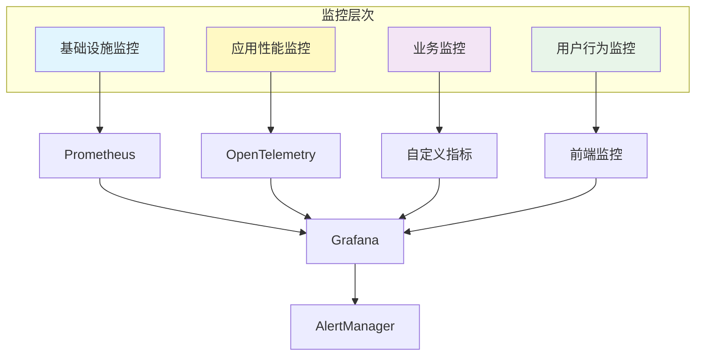
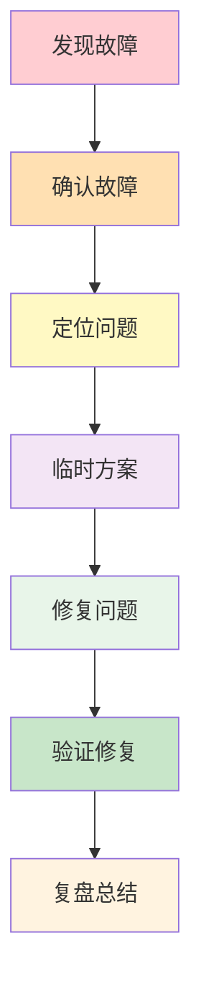

# ZKER 监控运维指南

**版本**: v3.0.0 | **更新**: 2025-01-03

---

## 目录

- [监控架构](#监控架构)
- [监控指标](#监控指标)
- [告警规则](#告警规则)
- [日志管理](#日志管理)
- [性能优化](#性能优化)
- [故障排查](#故障排查)

---

## 监控架构

### 监控体系



### 监控组件

| 组件 | 用途 | 端口 |
|------|------|------|
| **Prometheus** | 指标采集 | 9090 |
| **Grafana** | 可视化 | 3000 |
| **AlertManager** | 告警管理 | 9093 |
| **Loki** | 日志聚合 | 3100 |
| **Jaeger** | 链路追踪 | 16686 |

---

## 监控指标

### 基础设施监控

| 指标 | 说明 | 告警阈值 |
|------|------|---------|
| **CPU 使用率** | CPU 使用百分比 | > 80% |
| **内存使用率** | 内存使用百分比 | > 85% |
| **磁盘使用率** | 磁盘使用百分比 | > 80% |
| **网络流量** | 网络 I/O | 异常峰值 |
| **磁盘 I/O** | 磁盘读写 | 异常峰值 |

### 应用监控

| 指标 | 说明 | 告警阈值 |
|------|------|---------|
| **QPS** | 每秒请求数 | < 预期 50% |
| **响应时间** | P95 响应时间 | > 500ms |
| **错误率** | 错误请求百分比 | > 1% |
| **并发连接数** | 当前连接数 | > 1000 |
| **队列长度** | 请求队列长度 | > 100 |

### 业务监控

| 指标 | 说明 | 告警阈值 |
|------|------|---------|
| **租户数量** | 活跃租户数 | 异常下降 |
| **API 调用量** | API 调用次数 | 异常下降 |
| **Token 消耗** | Token 使用量 | 异常增长 |
| **Bot 创建数** | 每日 Bot 创建数 | 异常下降 |

### 自定义指标示例

```go
// application/monitoring/metrics.go
package monitoring

import (
    "github.com/prometheus/client_golang/prometheus"
    "github.com/prometheus/client_golang/prometheus/promauto"
)

var (
    // API 请求总数
    apiRequestsTotal = promauto.NewCounterVec(
        prometheus.CounterOpts{
            Name: "zker_api_requests_total",
            Help: "Total number of API requests",
        },
        []string{"method", "endpoint", "status"},
    )

    // API 响应时间
    apiResponseTime = promauto.NewHistogramVec(
        prometheus.HistogramOpts{
            Name:    "zker_api_response_time_seconds",
            Help:    "API response time in seconds",
            Buckets: prometheus.DefBuckets,
        },
        []string{"method", "endpoint"},
    )

    // 租户数量
    tenantCount = promauto.NewGaugeVec(
        prometheus.GaugeOpts{
            Name: "zker_tenant_count",
            Help: "Number of tenants",
        },
        []string{"plan_type", "status"},
    )

    // Token 使用量
    tokenUsage = promauto.NewGaugeVec(
        prometheus.GaugeOpts{
            Name: "zker_token_usage",
            Help: "Token usage",
        },
        []string{"tenant_id"},
    )
)

// RecordAPIRequest 记录 API 请求
func RecordAPIRequest(method, endpoint, status string, duration float64) {
    apiRequestsTotal.WithLabelValues(method, endpoint, status).Inc()
    apiResponseTime.WithLabelValues(method, endpoint).Observe(duration)
}

// UpdateTenantCount 更新租户数量
func UpdateTenantCount(planType, status string, count float64) {
    tenantCount.WithLabelValues(planType, status).Set(count)
}
```

---

## 告警规则

### 告警级别

| 级别 | 名称 | 响应时间 | 通知方式 |
|------|------|---------|---------|
| **P0** | 紧急 | 15 分钟 | 电话 + 短信 + 邮件 |
| **P1** | 高 | 1 小时 | 短信 + 邮件 |
| **P2** | 中 | 4 小时 | 邮件 |
| **P3** | 低 | 1 天 | 邮件 |

### 告警规则示例

```yaml
# prometheus/alerts.yml
groups:
  - name: zker_alerts
    interval: 30s
    rules:
      # P0: 服务宕机
      - alert: ServiceDown
        expr: up{job="zker-backend"} == 0
        for: 1m
        labels:
          severity: P0
        annotations:
          summary: "服务宕机"
          description: "实例 {{ $labels.instance }} 已宕机"

      # P0: 错误率过高
      - alert: HighErrorRate
        expr: |
          (
            sum(rate(zker_api_requests_total{status=~"5.."}[5m]))
            /
            sum(rate(zker_api_requests_total[5m]))
          ) > 0.01
        for: 5m
        labels:
          severity: P0
        annotations:
          summary: "错误率过高"
          description: "错误率: {{ $value | humanizePercentage }}"

      # P1: 响应时间过长
      - alert: HighResponseTime
        expr: |
          histogram_quantile(0.95,
            sum(rate(zker_api_response_time_seconds_bucket[5m])) by (le)
          ) > 0.5
        for: 5m
        labels:
          severity: P1
        annotations:
          summary: "响应时间过长"
          description: "P95 响应时间: {{ $value }}s"

      # P2: CPU 使用率过高
      - alert: HighCPUUsage
        expr: |
          100 - (avg by(instance) (rate(node_cpu_seconds_total{mode="idle"}[5m])) * 100) > 80
        for: 10m
        labels:
          severity: P2
        annotations:
          summary: "CPU 使用率过高"
          description: "CPU 使用率: {{ $value }}%"

      # P2: 内存使用率过高
      - alert: HighMemoryUsage
        expr: |
          (1 - (node_memory_MemAvailable_bytes / node_memory_MemTotal_bytes)) * 100 > 85
        for: 10m
        labels:
          severity: P2
        annotations:
          summary: "内存使用率过高"
          description: "内存使用率: {{ $value }}%"

      # P3: 磁盘使用率过高
      - alert: HighDiskUsage
        expr: |
          (1 - (node_filesystem_avail_bytes{fstype!~"tmpfs|fuse.*"} / node_filesystem_size_bytes)) * 100 > 80
        for: 15m
        labels:
          severity: P3
        annotations:
          summary: "磁盘使用率过高"
          description: "磁盘使用率: {{ $value }}%"
```

---

## 日志管理

### 日志规范

#### 日志级别

| 级别 | 说明 | 示例 |
|------|------|------|
| **DEBUG** | 调试信息 | `{"level": "debug", "msg": "查询数据库", "sql": "SELECT * FROM tenants"}` |
| **INFO** | 一般信息 | `{"level": "info", "msg": "创建租户成功", "tenant_id": "tenant_123"}` |
| **WARN** | 警告信息 | `{"level": "warn", "msg": "配额即将耗尽", "tenant_id": "tenant_123", "usage": "95%"}` |
| **ERROR** | 错误信息 | `{"level": "error", "msg": "数据库连接失败", "error": "connection refused"}` |
| **FATAL** | 致命错误 | `{"level": "fatal", "msg": "服务启动失败", "error": "port already in use"}` |

#### 日志格式

```json
{
  "timestamp": "2025-01-03T10:00:00Z",
  "level": "info",
  "msg": "创建租户成功",
  "context": {
    "tenant_id": "tenant_123",
    "tenant_name": "示例公司",
    "plan_type": "pro",
    "user_id": "user_123",
    "request_id": "req_abc123"
  }
}
```

### 日志采集

#### Loki 配置

```yaml
# loki-config.yml
server:
  http_listen_port: 3100

positions:
  filename: /tmp/positions.yaml

clients:
  - url: http://localhost:3100/loki/api/v1/push

scrape_configs:
  - job_name: zker-backend
    static_configs:
      - targets:
          - localhost
        labels:
          job: zker-backend
          env: production

  - job_name: zker-frontend
    static_configs:
      - targets:
          - localhost
        labels:
          job: zker-frontend
          env: production
```

### 日志查询

#### LogQL 示例

```logql
# 查询所有错误日志
{job="zker-backend", level="error"}

# 查询特定租户的日志
{job="zker-backend"} |= "tenant_123"

# 查询响应时间 > 500ms 的请求
{job="zker-backend"} | json | duration > 0.5

# 统计错误率
count_over_time({level="error"}[5m])
```

---

## 性能优化

### 数据库优化

#### 慢查询优化

```sql
-- 查看慢查询
SHOW VARIABLES LIKE 'slow_query%';
SHOW VARIABLES LIKE 'long_query_time';

-- 分析慢查询日志
mysqldumpslow -s t -t 10 /var/log/mysql/slow-query.log

-- 优化示例
-- ❌ Bad: 全表扫描
SELECT * FROM tenants WHERE tenant_name LIKE '%公司%';

-- ✅ Good: 使用全文索引
ALTER TABLE tenants ADD FULLTEXT INDEX ft_tenant_name (tenant_name);
SELECT * FROM tenants WHERE MATCH(tenant_name) AGAINST('公司' IN NATURAL LANGUAGE MODE);
```

#### 索引优化

```sql
-- 查看索引使用情况
SHOW INDEX FROM tenants;

-- 分析查询执行计划
EXPLAIN SELECT * FROM bots WHERE tenant_id = 'tenant_123' AND status = 'active';

-- 优化示例
-- ❌ Bad: 缺少索引
SELECT * FROM conversation_messages WHERE conversation_id = 'conv_123' ORDER BY created_at DESC LIMIT 20;

-- ✅ Good: 添加复合索引
CREATE INDEX idx_conv_created ON conversation_messages(conversation_id, created_at DESC);
```

### 缓存优化

#### Redis 缓存策略

```go
// application/cache/tenant_cache.go
package cache

import (
    "context"
    "encoding/json"
    "time"
)

type TenantCache struct {
    redis *redis.Client
}

// Get 获取租户缓存
func (c *TenantCache) Get(ctx context.Context, tenantID string) (*Tenant, error) {
    key := fmt.Sprintf("tenant:%s", tenantID)

    data, err := c.redis.Get(ctx, key).Result()
    if err == redis.Nil {
        return nil, nil // 缓存未命中
    }
    if err != nil {
        return nil, err
    }

    var tenant Tenant
    if err := json.Unmarshal([]byte(data), &tenant); err != nil {
        return nil, err
    }

    return &tenant, nil
}

// Set 设置租户缓存
func (c *TenantCache) Set(ctx context.Context, tenant *Tenant) error {
    key := fmt.Sprintf("tenant:%s", tenant.TenantID)
    data, err := json.Marshal(tenant)
    if err != nil {
        return err
    }

    return c.redis.Set(ctx, key, data, 10*time.Minute).Err()
}

// Delete 删除租户缓存
func (c *TenantCache) Delete(ctx context.Context, tenantID string) error {
    key := fmt.Sprintf("tenant:%s", tenantID)
    return c.redis.Del(ctx, key).Err()
}
```

#### 缓存更新策略

| 策略 | 说明 | 适用场景 |
|------|------|---------|
| **Cache Aside** | 先查缓存，未命中查库，然后写入缓存 | 读多写少 |
| **Write Through** | 写入时同时更新缓存和数据库 | 数据一致性要求高 |
| **Write Behind** | 先更新缓存，异步更新数据库 | 写入性能要求高 |

### API 优化

#### 批量查询

```go
// ❌ Bad: N+1 查询
func (s *BotService) ListBotsWithTenant(ctx context.Context, botIDs []string) ([]*BotWithTenant, error) {
    bots, err := s.botRepo.FindByIDs(ctx, botIDs)
    if err != nil {
        return nil, err
    }

    var results []*BotWithTenant
    for _, bot := range bots {
        tenant, err := s.tenantRepo.FindByID(ctx, bot.TenantID) // N+1 查询
        if err != nil {
            return nil, err
        }

        results = append(results, &BotWithTenant{
            Bot:    bot,
            Tenant: tenant,
        })
    }

    return results, nil
}

// ✅ Good: 批量查询
func (s *BotService) ListBotsWithTenant(ctx context.Context, botIDs []string) ([]*BotWithTenant, error) {
    bots, err := s.botRepo.FindByIDs(ctx, botIDs)
    if err != nil {
        return nil, err
    }

    tenantIDs := extractTenantIDs(bots)
    tenants, err := s.tenantRepo.FindByIDs(ctx, tenantIDs) // 批量查询
    if err != nil {
        return nil, err
    }

    tenantMap := toTenantMap(tenants)
    var results []*BotWithTenant
    for _, bot := range bots {
        results = append(results, &BotWithTenant{
            Bot:    bot,
            Tenant: tenantMap[bot.TenantID],
        })
    }

    return results, nil
}
```

---

## 故障排查

### 常见问题

#### 1. 服务无法启动

**现象**: 服务启动失败，端口绑定失败

**排查步骤**:

```bash
# 1. 检查端口占用
lsof -i :8888
netstat -tunlp | grep 8888

# 2. 检查配置文件
cat configs/config.yaml

# 3. 检查日志
tail -f /var/log/zker/backend.log

# 4. 检查依赖服务
systemctl status mysql
systemctl status redis
systemctl status elasticsearch
```

**解决方案**:

```bash
# 停止占用端口的进程
kill -9 <pid>

# 修改配置文件端口
vim configs/config.yaml

# 启动服务
./main
```

#### 2. 数据库连接失败

**现象**: 数据库连接超时或拒绝

**排查步骤**:

```bash
# 1. 检查数据库状态
systemctl status mysql

# 2. 检查数据库连接
mysql -u root -p -h localhost -P 3306

# 3. 检查连接数
SHOW PROCESSLIST;
SHOW VARIABLES LIKE 'max_connections';

# 4. 检查慢查询
SHOW FULL PROCESSLIST;
```

**解决方案**:

```sql
-- 增加最大连接数
SET GLOBAL max_connections = 1000;

-- 杀掉长时间运行的查询
KILL <pid>;
```

#### 3. Redis 连接失败

**现象**: Redis 连接超时

**排查步骤**:

```bash
# 1. 检查 Redis 状态
systemctl status redis

# 2. 检查 Redis 连接
redis-cli ping

# 3. 检查 Redis 内存
redis-cli INFO memory

# 4. 检查 Redis 慢查询
redis-cli SLOWLOG GET 10
```

**解决方案**:

```bash
# 清理过期键
redis-cli --scan --pattern "tenant:*" | xargs redis-cli DEL

# 设置最大内存
redis-cli CONFIG SET maxmemory 2gb
redis-cli CONFIG SET maxmemory-policy allkeys-lru
```

#### 4. API 响应慢

**现象**: API 响应时间 > 1s

**排查步骤**:

```bash
# 1. 查看应用日志
tail -f /var/log/zker/backend.log | grep "duration"

# 2. 查看数据库慢查询
mysqldumpslow -s t -t 10 /var/log/mysql/slow-query.log

# 3. 查看 Redis 慢查询
redis-cli SLOWLOG GET 10

# 4. 查看系统资源
top
htop
iostat -x 1
```

**解决方案**:

1. 添加索引
2. 优化 SQL 查询
3. 添加缓存
4. 异步处理
5. 水平扩展

### 故障处理流程



---

## 相关文档

| 文档 | 说明 |
|------|------|
| [incident-response.md](incident-response.md) | 事件响应 |
| [backup-recovery.md](backup-recovery.md) | 备份恢复 |
| [security.md](security.md) | 安全操作 |
| [../deployment/PRODUCTION_DEPLOYMENT_GUIDE.md](../deployment/PRODUCTION_DEPLOYMENT_GUIDE.md) | 生产部署 |

---

**🎯 目标**: 及时发现问题，快速定位故障，确保服务稳定！
