# zker Enterprise SaaS 系统 - 详细设计说明书

> **文档编号**: DD-2025-001
> **项目名称**: zker Enterprise Edition - 企业级 Multi-Tenant SaaS 系统
> **文档版本**: v1.0
> **编写日期**: 2025-12-29
> **密级**: 内部公开

---

## 文档修订历史

| 版本 | 日期 | 作者 | 修订说明 |
|------|------|------|----------|
| v1.0 | 2025-12-29 | AI助手 | 初始版本,包含完整的接口设计、类设计、时序图 |

---

## 目录

1. [文档概述](#1-文档概述)
2. [租户管理服务详细设计](#2-租户管理服务详细设计)
3. [用户管理服务详细设计](#3-用户管理服务详细设计)
4. [Bot管理服务详细设计](#4-bot管理服务详细设计)
5. [对话管理服务详细设计](#5-对话管理服务详细设计)
6. [知识库服务详细设计](#6-知识库服务详细设计)
7. [Multi-Tenant中间件详细设计](#7-multi-tenant中间件详细设计)
8. [工作流引擎详细设计](#8-工作流引擎详细设计)
9. [AI引擎集成详细设计](#9-ai引擎集成详细设计)
10. [附录](#10-附录)

---

## 1. 文档概述

### 1.1 文档目的

本文档是《概要设计说明书》的进一步细化,详细描述了zker Enterprise SaaS系统各个服务模块的接口设计、类设计、时序图和算法流程,为开发人员提供直接的实施指导。

### 1.2 适用范围

本文档适用于:
- 后端开发工程师(Go)
- 前端开发工程师(React/TypeScript)
- 测试工程师
- 系统架构师

### 1.3 参考文档

- 《概要设计说明书》
- 《数据库设计文档》
- 《API接口规范》
- Hertz框架官方文档
- GORM官方文档

### 1.4 设计原则

遵循以下设计原则:
- **SOLID原则**: 单一职责、开闭原则、里氏替换、接口隔离、依赖倒置
- **DDD领域驱动设计**: 清晰的领域边界和领域模型
- **RESTful API设计**: 统一的接口规范
- **防御性编程**: 参数校验、错误处理、幂等性

---

## 2. 租户管理服务详细设计

### 2.1 服务概述

**服务名称**: TenantService
**服务职责**: 租户注册、查询、更新、配额管理、租户状态管理
**依赖服务**: UserService, RoleService, BillingService

### 2.2 接口设计

#### 2.2.1 租户注册接口

**接口路径**: `POST /api/v1/tenants`

**请求参数**:
```json
{
  "name": "测试科技有限公司",
  "subdomain": "testtech",
  "industry": "technology",
  "scale": "50-200",
  "contact_person": "张三",
  "contact_email": "zhangsan@example.com",
  "contact_phone": "13800138000",
  "plan_id": "professional",  // professional/enterprise/flagship
  "tenant_type": "trial"       // trial/paid
}
```

**响应示例**:
```json
{
  "code": 0,
  "message": "success",
  "data": {
    "tenant_id": "tenant_1234567890",
    "name": "测试科技有限公司",
    "subdomain": "testtech",
    "status": "active",
    "plan": {
      "plan_id": "professional",
      "plan_name": "专业版",
      "max_users": 50,
      "max_bots": 10,
      "storage_quota_gb": 50
    },
    "quota": {
      "users_used": 1,
      "bots_used": 0,
      "storage_used_mb": 0
    },
    "created_at": "2025-12-29T10:00:00Z",
    "trial_expires_at": "2026-01-12T10:00:00Z"
  }
}
```

**错误码**:
- `40001`: 参数校验失败
- `40002`: 子域名已存在
- `40003`: 企业名称已存在
- `50001`: 数据库错误
- `50002`: 创建租户失败

#### 2.2.2 租户查询接口

**接口路径**: `GET /api/v1/tenants/{tenant_id}`

**请求参数**:
- `tenant_id` (path): 租户ID

**响应示例**:
```json
{
  "code": 0,
  "message": "success",
  "data": {
    "tenant_id": "tenant_1234567890",
    "name": "测试科技有限公司",
    "subdomain": "testtech",
    "status": "active",
    "industry": "technology",
    "scale": "50-200",
    "plan": { /* 同上 */ },
    "quota": { /* 同上 */ },
    "created_at": "2025-12-29T10:00:00Z",
    "updated_at": "2025-12-29T10:00:00Z"
  }
}
```

#### 2.2.3 租户更新接口

**接口路径**: `PUT /api/v1/tenants/{tenant_id}`

**请求参数**:
```json
{
  "name": "新公司名称",
  "contact_person": "李四",
  "contact_email": "lisi@example.com",
  "contact_phone": "13900139000"
}
```

**响应**: 同租户查询接口

#### 2.2.4 租户配额查询接口

**接口路径**: `GET /api/v1/tenants/{tenant_id}/quota`

**响应示例**:
```json
{
  "code": 0,
  "message": "success",
  "data": {
    "users": {
      "limit": 50,
      "used": 15,
      "available": 35,
      "usage_percentage": 30.0
    },
    "bots": {
      "limit": 10,
      "used": 3,
      "available": 7,
      "usage_percentage": 30.0
    },
    "storage": {
      "limit_mb": 51200,
      "used_mb": 10240,
      "available_mb": 40960,
      "usage_percentage": 20.0
    },
    "api_calls": {
      "limit_monthly": 100000,
      "used_this_month": 25000,
      "available": 75000,
      "usage_percentage": 25.0,
      "reset_at": "2026-01-01T00:00:00Z"
    }
  }
}
```

#### 2.2.5 租户状态管理接口

**接口路径**: `PATCH /api/v1/tenants/{tenant_id}/status`

**请求参数**:
```json
{
  "status": "suspended",  // active/suspended/deleted
  "reason": "违反服务条款"
}
```

**响应示例**:
```json
{
  "code": 0,
  "message": "租户状态已更新",
  "data": {
    "tenant_id": "tenant_1234567890",
    "old_status": "active",
    "new_status": "suspended",
    "updated_at": "2025-12-29T12:00:00Z"
  }
}
```

### 2.3 类设计

#### 2.3.1 TenantService

**职责**: 租户注册、查询、更新、配额管理

**类图**:
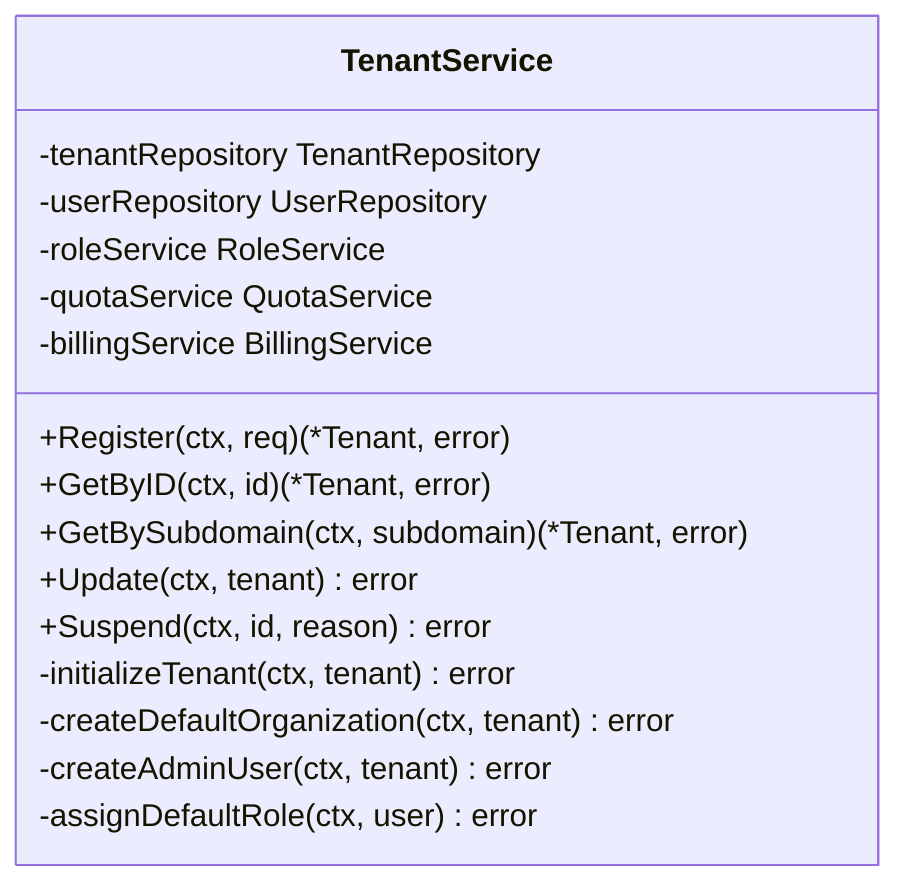
```mermaid
classDiagram
    class TenantService {
        -tenantRepository TenantRepository
        -userRepository UserRepository
        -roleService RoleService
        -quotaService QuotaService
        -billingService BillingService
        +Register(ctx, req) (*Tenant, error)
        +GetByID(ctx, id) (*Tenant, error)
        +GetBySubdomain(ctx, subdomain) (*Tenant, error)
        +Update(ctx, tenant) error
        +Suspend(ctx, id, reason) error
        -initializeTenant(ctx, tenant) error
        -createDefaultOrganization(ctx, tenant) error
        -createAdminUser(ctx, tenant) error
        -assignDefaultRole(ctx, user) error
    }
```

**方法详细说明**:

```go
// Register 注册新租户
func (s *TenantService) Register(ctx context.Context, req *RegisterTenantRequest) (*Tenant, error) {
    // 1. 参数校验
    if err := s.validateRegisterRequest(req); err != nil {
        return nil, err
    }

    // 2. 检查子域名唯一性
    exists, err := s.tenantRepository.ExistsBySubdomain(ctx, req.Subdomain)
    if err != nil {
        return nil, err
    }
    if exists {
        return nil, ErrSubdomainAlreadyExists
    }

    // 3. 检查企业名称唯一性
    exists, err = s.tenantRepository.ExistsByName(ctx, req.Name)
    if err != nil {
        return nil, err
    }
    if exists {
        return nil, ErrTenantNameAlreadyExists
    }

    // 4. 获取套餐信息
    plan, err := s.billingService.GetPlanByID(ctx, req.PlanID)
    if err != nil {
        return nil, err
    }

    // 5. 创建租户实体
    tenant := &Tenant{
        TenantID:    generateTenantID(),
        Name:        req.Name,
        Subdomain:   req.Subdomain,
        Industry:    req.Industry,
        Scale:       req.Scale,
        ContactPerson: req.ContactPerson,
        ContactEmail: req.ContactEmail,
        ContactPhone: req.ContactPhone,
        Status:      "active",
        PlanID:      req.PlanID,
        TenantType:  req.TenantType,
        CreatedAt:   time.Now(),
        UpdatedAt:   time.Now(),
    }

    // 6. 保存到数据库
    if err := s.tenantRepository.Create(ctx, tenant); err != nil {
        return nil, err
    }

    // 7. 初始化租户数据
    if err := s.initializeTenant(ctx, tenant); err != nil {
        // 回滚租户创建
        s.tenantRepository.Delete(ctx, tenant.TenantID)
        return nil, err
    }

    // 8. 加载配额信息
    quota, _ := s.quotaService.GetTenantQuota(ctx, tenant.TenantID)
    tenant.Quota = quota

    return tenant, nil
}

// initializeTenant 初始化租户数据
func (s *TenantService) initializeTenant(ctx context.Context, tenant *Tenant) error {
    // 1. 创建默认组织架构
    if err := s.createDefaultOrganization(ctx, tenant); err != nil {
        return err
    }

    // 2. 创建管理员用户
    adminUser, err := s.createAdminUser(ctx, tenant)
    if err != nil {
        return err
    }

    // 3. 分配默认角色
    if err := s.assignDefaultRole(ctx, adminUser); err != nil {
        return err
    }

    // 4. 初始化配额
    if err := s.quotaService.InitializeTenantQuota(ctx, tenant.TenantID, tenant.PlanID); err != nil {
        return err
    }

    return nil
}

// createDefaultOrganization 创建默认组织架构
func (s *TenantService) createDefaultOrganization(ctx context.Context, tenant *Tenant) error {
    org := &Organization{
        OrgID:      generateOrgID(),
        TenantID:   tenant.TenantID,
        Name:       tenant.Name,
        ParentID:   "",
        Level:      1,
        Path:       "/" + tenant.Name,
        CreatedAt:  time.Now(),
    }

    return s.organizationRepository.Create(ctx, org)
}

// createAdminUser 创建管理员用户
func (s *TenantService) createAdminUser(ctx context.Context, tenant *Tenant) (*User, error) {
    password := generateRandomPassword(16)

    user := &User{
        UserID:     generateUserID(),
        TenantID:   tenant.TenantID,
        Username:   "admin",
        Email:      tenant.ContactEmail,
        Phone:      tenant.ContactPhone,
        Password:   hashPassword(password),
        Nickname:   tenant.ContactPerson,
        RoleID:     "", // 将在assignDefaultRole中设置
        Status:     "active",
        CreatedAt:  time.Now(),
    }

    if err := s.userRepository.Create(ctx, user); err != nil {
        return nil, err
    }

    // 发送欢迎邮件(包含临时密码)
    s.sendWelcomeEmail(tenant.ContactEmail, password)

    return user, nil
}

// assignDefaultRole 分配默认角色
func (s *TenantService) assignDefaultRole(ctx context.Context, user *User) error {
    // 获取租户的超级管理员角色
    role, err := s.roleService.GetSuperAdminRole(ctx, user.TenantID)
    if err != nil {
        return err
    }

    user.RoleID = role.RoleID
    return s.userRepository.Update(ctx, user)
}
```

#### 2.3.2 TenantRepository

**职责**: 租户数据持久化

**类图**:
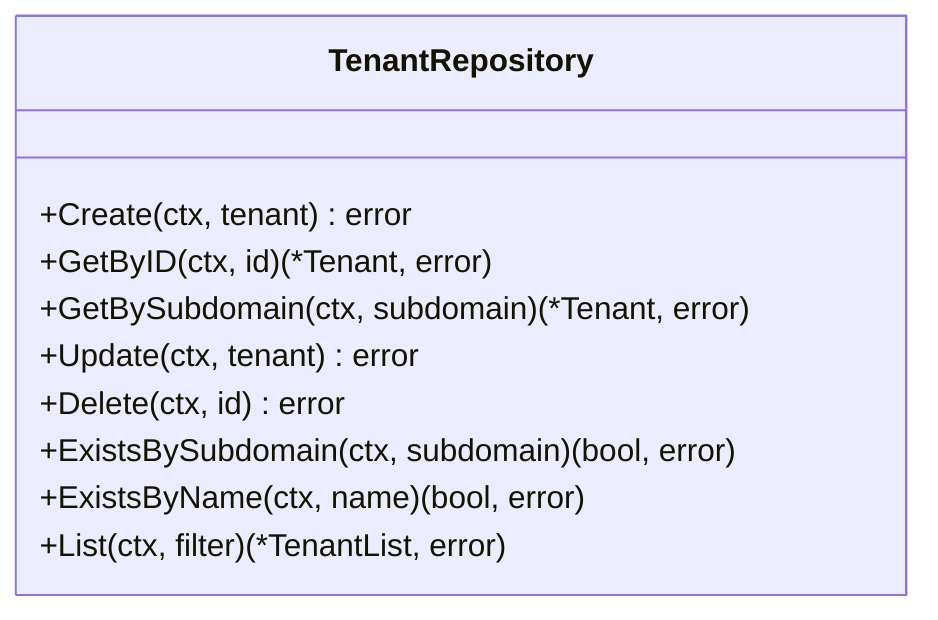
```mermaid
classDiagram
    class TenantRepository {
        +Create(ctx, tenant) error
        +GetByID(ctx, id) (*Tenant, error)
        +GetBySubdomain(ctx, subdomain) (*Tenant, error)
        +Update(ctx, tenant) error
        +Delete(ctx, id) error
        +ExistsBySubdomain(ctx, subdomain) (bool, error)
        +ExistsByName(ctx, name) (bool, error)
        +List(ctx, filter) (*TenantList, error)
    }
```

**实现示例**:

```go
type tenantRepositoryImpl struct {
    db *gorm.DB
}

func (r *tenantRepositoryImpl) Create(ctx context.Context, tenant *Tenant) error {
    return r.db.WithContext(ctx).Create(tenant).Error
}

func (r *tenantRepositoryImpl) GetByID(ctx context.Context, id string) (*Tenant, error) {
    var tenant Tenant
    err := r.db.WithContext(ctx).
        Where("tenant_id = ?", id).
        First(&tenant).Error
    if err != nil {
        return nil, err
    }
    return &tenant, nil
}

func (r *tenantRepositoryImpl) GetBySubdomain(ctx context.Context, subdomain string) (*Tenant, error) {
    var tenant Tenant
    err := r.db.WithContext(ctx).
        Where("subdomain = ?", subdomain).
        First(&tenant).Error
    if err != nil {
        return nil, err
    }
    return &tenant, nil
}

func (r *tenantRepositoryImpl) ExistsBySubdomain(ctx context.Context, subdomain string) (bool, error) {
    var count int64
    err := r.db.WithContext(ctx).
        Model(&Tenant{}).
        Where("subdomain = ?", subdomain).
        Count(&count).Error
    return count > 0, err
}
```

#### 2.3.3 QuotaService

**职责**: 配额管理、配额检查、配额使用统计

**类图**:
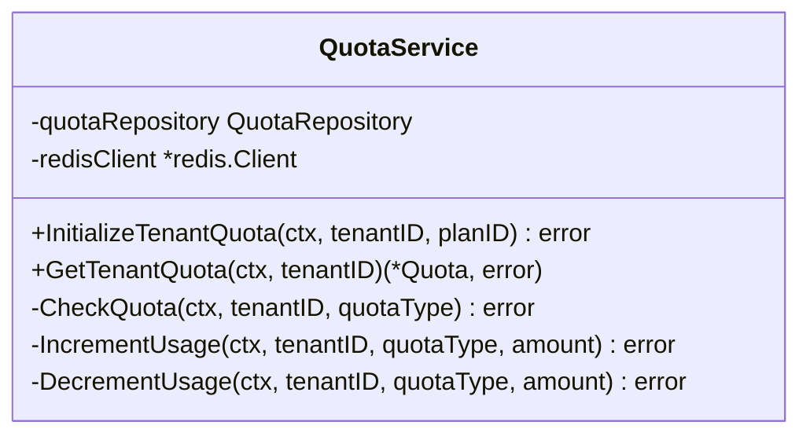
```mermaid
classDiagram
    class QuotaService {
        -quotaRepository QuotaRepository
        -redisClient *redis.Client
        +InitializeTenantQuota(ctx, tenantID, planID) error
        +GetTenantQuota(ctx, tenantID) (*Quota, error)
        -CheckQuota(ctx, tenantID, quotaType) error
        -IncrementUsage(ctx, tenantID, quotaType, amount) error
        -DecrementUsage(ctx, tenantID, quotaType, amount) error
    }
```

**方法详细说明**:

```go
// CheckUserQuota 检查用户配额
func (s *QuotaService) CheckUserQuota(ctx context.Context, tenantID string) error {
    quota, err := s.GetTenantQuota(ctx, tenantID)
    if err != nil {
        return err
    }

    if quota.Users.Used >= quota.Users.Limit {
        return ErrQuotaExceeded{QuotaType: "user", Limit: quota.Users.Limit}
    }

    return nil
}

// IncrementUserUsage 增加用户使用量
func (s *QuotaService) IncrementUserUsage(ctx context.Context, tenantID string) error {
    // 使用Redis原子操作确保并发安全
    key := fmt.Sprintf("quota:%s:users", tenantID)

    pipe := s.redisClient.Pipeline()
    pipe.Incr(ctx, key)
    pipe.Expire(ctx, key, 24*time.Hour)

    results, err := pipe.Exec(ctx)
    if err != nil {
        return err
    }

    newUsed := results[0].(*redis.IntCmd).Val()

    // 异步同步到数据库
    go func() {
        s.quotaRepository.UpdateUsersUsed(context.Background(), tenantID, int(newUsed))
    }()

    return nil
}
```

### 2.4 时序图

#### 2.4.1 租户注册时序图

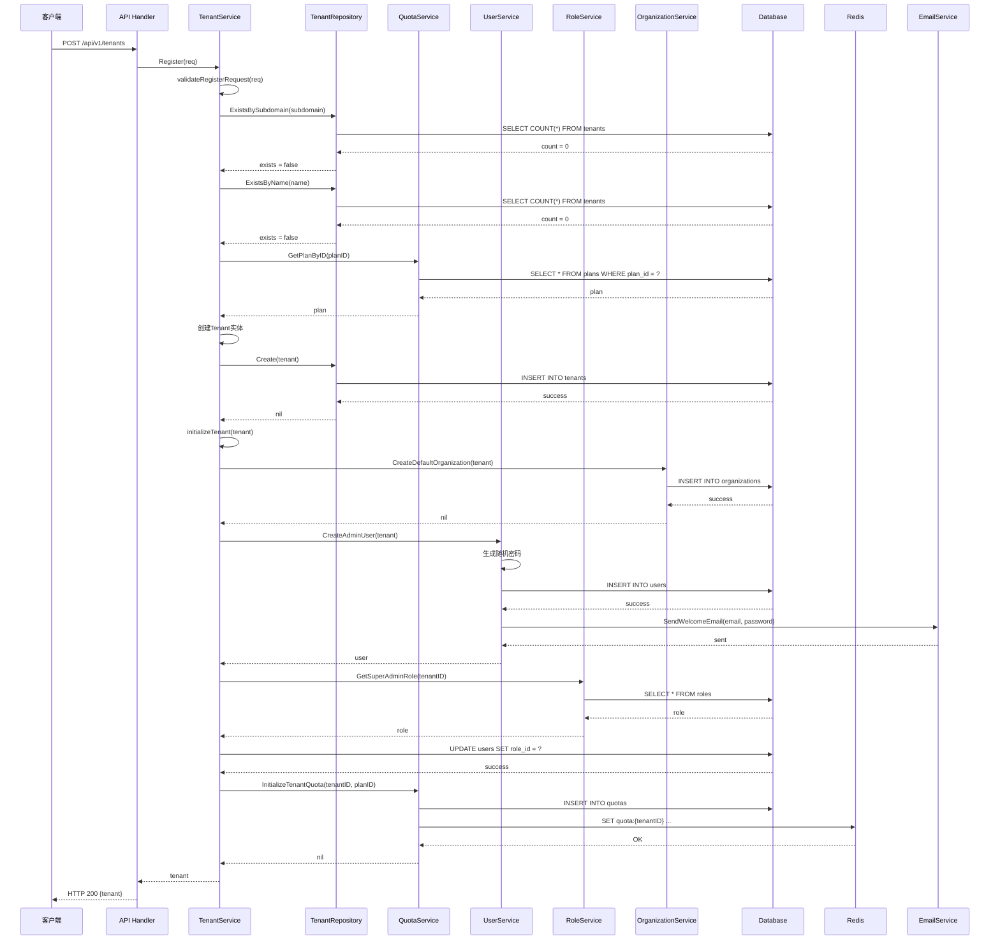
```mermaid
sequenceDiagram
    participant Client as 客户端
    participant API as API Handler
    participant TenantSvc as TenantService
    participant TenantRepo as TenantRepository
    participant QuotaSvc as QuotaService
    participant UserSvc as UserService
    participant RoleSvc as RoleService
    participant OrgSvc as OrganizationService
    participant DB as Database
    participant Redis as Redis
    participant EmailSvc as EmailService

    Client->>API: POST /api/v1/tenants
    API->>TenantSvc: Register(req)

    TenantSvc->>TenantSvc: validateRegisterRequest(req)
    TenantSvc->>TenantRepo: ExistsBySubdomain(subdomain)
    TenantRepo->>DB: SELECT COUNT(*) FROM tenants
    DB-->>TenantRepo: count = 0
    TenantRepo-->>TenantSvc: exists = false

    TenantSvc->>TenantRepo: ExistsByName(name)
    TenantRepo->>DB: SELECT COUNT(*) FROM tenants
    DB-->>TenantRepo: count = 0
    TenantRepo-->>TenantSvc: exists = false

    TenantSvc->>QuotaSvc: GetPlanByID(planID)
    QuotaSvc->>DB: SELECT * FROM plans WHERE plan_id = ?
    DB-->>QuotaSvc: plan
    QuotaSvc-->>TenantSvc: plan

    TenantSvc->>TenantSvc: 创建Tenant实体
    TenantSvc->>TenantRepo: Create(tenant)
    TenantRepo->>DB: INSERT INTO tenants
    DB-->>TenantRepo: success
    TenantRepo-->>TenantSvc: nil

    TenantSvc->>TenantSvc: initializeTenant(tenant)

    TenantSvc->>OrgSvc: CreateDefaultOrganization(tenant)
    OrgSvc->>DB: INSERT INTO organizations
    DB-->>OrgSvc: success
    OrgSvc-->>TenantSvc: nil

    TenantSvc->>UserSvc: CreateAdminUser(tenant)
    UserSvc->>UserSvc: 生成随机密码
    UserSvc->>DB: INSERT INTO users
    DB-->>UserSvc: success
    UserSvc->>EmailSvc: SendWelcomeEmail(email, password)
    EmailSvc-->>UserSvc: sent
    UserSvc-->>TenantSvc: user

    TenantSvc->>RoleSvc: GetSuperAdminRole(tenantID)
    RoleSvc->>DB: SELECT * FROM roles
    DB-->>RoleSvc: role
    RoleSvc-->>TenantSvc: role

    TenantSvc->>DB: UPDATE users SET role_id = ?
    DB-->>TenantSvc: success

    TenantSvc->>QuotaSvc: InitializeTenantQuota(tenantID, planID)
    QuotaSvc->>DB: INSERT INTO quotas
    QuotaSvc->>Redis: SET quota:{tenantID} ...
    Redis-->>QuotaSvc: OK
    QuotaSvc-->>TenantSvc: nil

    TenantSvc-->>API: tenant
    API-->>Client: HTTP 200 {tenant}
```

#### 2.4.2 租户配额查询时序图

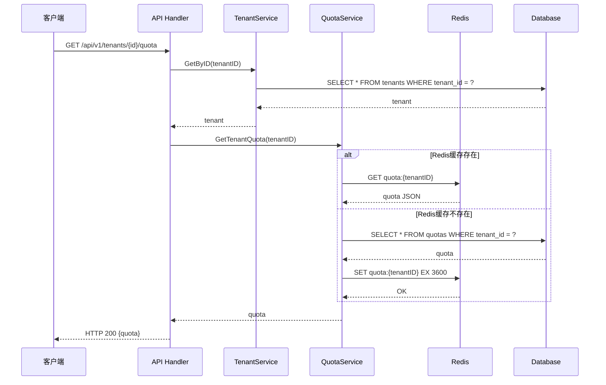
```mermaid
sequenceDiagram
    participant Client as 客户端
    participant API as API Handler
    participant TenantSvc as TenantService
    participant QuotaSvc as QuotaService
    participant Redis as Redis
    participant DB as Database

    Client->>API: GET /api/v1/tenants/{id}/quota
    API->>TenantSvc: GetByID(tenantID)
    TenantSvc->>DB: SELECT * FROM tenants WHERE tenant_id = ?
    DB-->>TenantSvc: tenant
    TenantSvc-->>API: tenant

    API->>QuotaSvc: GetTenantQuota(tenantID)

    alt Redis缓存存在
        QuotaSvc->>Redis: GET quota:{tenantID}
        Redis-->>QuotaSvc: quota JSON
    else Redis缓存不存在
        QuotaSvc->>DB: SELECT * FROM quotas WHERE tenant_id = ?
        DB-->>QuotaSvc: quota
        QuotaSvc->>Redis: SET quota:{tenantID} EX 3600
        Redis-->>QuotaSvc: OK
    end

    QuotaSvc-->>API: quota
    API-->>Client: HTTP 200 {quota}
```

### 2.5 算法流程图

#### 2.5.1 租户注册流程

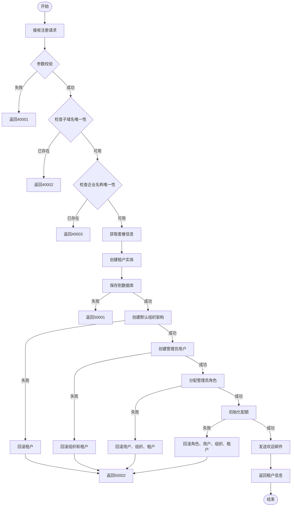
```mermaid
flowchart TD
    Start([开始]) --> Input[接收注册请求]
    Input --> Validate{参数校验}
    Validate -->|失败| Error1[返回40001]
    Validate -->|成功| CheckSubdomain{检查子域名唯一性}
    CheckSubdomain -->|已存在| Error2[返回40002]
    CheckSubdomain -->|可用| CheckName{检查企业名称唯一性}
    CheckName -->|已存在| Error3[返回40003]
    CheckName -->|可用| GetPlan[获取套餐信息]
    GetPlan --> CreateTenant[创建租户实体]
    CreateTenant --> SaveDB[保存到数据库]
    SaveDB -->|失败| Error4[返回50001]
    SaveDB -->|成功| InitOrg[创建默认组织架构]
    InitOrg -->|失败| Rollback1[回滚租户]
    InitOrg -->|成功| CreateAdmin[创建管理员用户]
    CreateAdmin -->|失败| Rollback2[回滚组织和租户]
    CreateAdmin -->|成功| AssignRole[分配管理员角色]
    AssignRole -->|失败| Rollback3[回滚用户、组织、租户]
    AssignRole -->|成功| InitQuota[初始化配额]
    InitQuota -->|失败| Rollback4[回滚角色、用户、组织、租户]
    InitQuota -->|成功| SendEmail[发送欢迎邮件]
    SendEmail --> Success[返回租户信息]
    Success --> End([结束])
    Rollback1 --> Error5[返回50002]
    Rollback2 --> Error5
    Rollback3 --> Error5
    Rollback4 --> Error5
```

#### 2.5.2 配额检查流程

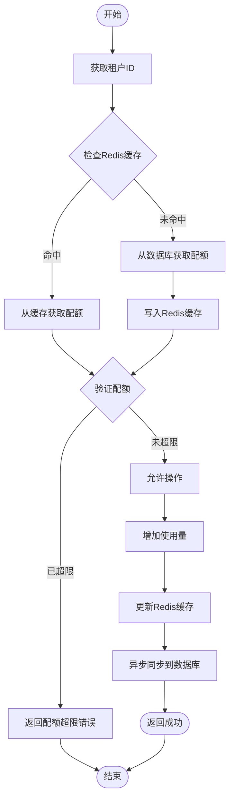
```mermaid
flowchart TD
    Start([开始]) --> GetTenantID[获取租户ID]
    GetTenantID --> CheckCache{检查Redis缓存}
    CheckCache -->|命中| GetCache[从缓存获取配额]
    CheckCache -->|未命中| GetDB[从数据库获取配额]
    GetCache --> ValidateQuota
    GetDB --> SetCache[写入Redis缓存]
    SetCache --> ValidateQuota{验证配额}
    ValidateQuota -->|已超限| ReturnError[返回配额超限错误]
    ValidateQuota -->|未超限| Allow[允许操作]
    Allow --> Increment[增加使用量]
    Increment --> UpdateCache[更新Redis缓存]
    UpdateCache --> AsyncDB[异步同步到数据库]
    AsyncDB --> Success([返回成功])
    ReturnError --> End([结束])
    Success --> End
```

### 2.6 数据结构

#### 2.6.1 Tenant

```go
// Tenant 租户实体
type Tenant struct {
    TenantID      string    `gorm:"primaryKey;column:tenant_id;type:varchar(64)" json:"tenant_id"`
    Name          string    `gorm:"column:name;type:varchar(255);not null" json:"name"`
    Subdomain     string    `gorm:"column:subdomain;type:varchar(64);uniqueIndex;not null" json:"subdomain"`
    Industry      string    `gorm:"column:industry;type:varchar(64)" json:"industry"`
    Scale         string    `gorm:"column:scale;type:varchar(64)" json:"scale"`
    ContactPerson string    `gorm:"column:contact_person;type:varchar(128)" json:"contact_person"`
    ContactEmail  string    `gorm:"column:contact_email;type:varchar(255)" json:"contact_email"`
    ContactPhone  string    `gorm:"column:contact_phone;type:varchar(32)" json:"contact_phone"`
    Status        string    `gorm:"column:status;type:varchar(32);default:active;index" json:"status"`
    PlanID        string    `gorm:"column:plan_id;type:varchar(64)" json:"plan_id"`
    TenantType    string    `gorm:"column:tenant_type;type:varchar(32)" json:"tenant_type"` // trial/paid
    TrialExpiresAt *time.Time `gorm:"column:trial_expires_at" json:"trial_expires_at,omitempty"`
    CreatedAt     time.Time `gorm:"column:created_at;autoCreateTime" json:"created_at"`
    UpdatedAt     time.Time `gorm:"column:updated_at;autoUpdateTime" json:"updated_at"`
    DeletedAt     gorm.DeletedAt `gorm:"column:deleted_at;index" json:"-"`

    // 关联对象
    Quota         *Quota    `gorm:"foreignKey:TenantID" json:"quota,omitempty"`
}
```

#### 2.6.2 Quota

```go
// Quota 配额实体
type Quota struct {
    ID           uint      `gorm:"primaryKey;column:id" json:"-"`
    TenantID     string    `gorm:"column:tenant_id;type:varchar(64);uniqueIndex;not null" json:"-"`
    UsersLimit   int       `gorm:"column:users_limit;default:50" json:"-"` // 不直接暴露,通过Users字段
    UsersUsed    int       `gorm:"column:users_used;default:0" json:"-"`
    BotsLimit    int       `gorm:"column:bots_limit;default:10" json:"-"`
    BotsUsed     int       `gorm:"column:bots_used;default:0" json:"-"`
    StorageLimitMB int     `gorm:"column:storage_limit_mb;default:51200" json:"-"`
    StorageUsedMB  int     `gorm:"column:storage_used_mb;default:0" json:"-"`
    APICallsLimitMonthly int `gorm:"column:api_calls_limit_monthly;default:100000" json:"-"`
    APICallsUsedThisMonth int `gorm:"column:api_calls_used_this_month;default:0" json:"-"`
    ResetAt      time.Time `gorm:"column:reset_at" json:"-"`

    // 响应时使用的嵌套结构
    Users        *QuotaItem `json:"users"`
    Bots         *QuotaItem `json:"bots"`
    Storage      *QuotaItem `json:"storage"`
    APICalls     *APICallQuota `json:"api_calls"`
}

type QuotaItem struct {
    Limit            int     `json:"limit"`
    Used             int     `json:"used"`
    Available        int     `json:"available"`
    UsagePercentage  float64 `json:"usage_percentage"`
}

type APICallQuota struct {
    LimitMonthly    int       `json:"limit_monthly"`
    UsedThisMonth   int       `json:"used_this_month"`
    Available       int       `json:"available"`
    UsagePercentage float64   `json:"usage_percentage"`
    ResetAt         string    `json:"reset_at"`
}
```

---

## 3. 用户管理服务详细设计

### 3.1 服务概述

**服务名称**: UserService
**服务职责**: 用户注册、登录、权限管理、用户信息管理
**依赖服务**: TenantService, RoleService, AuthService

### 3.2 接口设计

#### 3.2.1 用户登录接口

**接口路径**: `POST /api/v1/auth/login`

**请求参数**:
```json
{
  "username": "admin",
  "password": "password123",
  "tenant_id": "tenant_1234567890"
}
```

**响应示例**:
```json
{
  "code": 0,
  "message": "success",
  "data": {
    "access_token": "eyJhbGciOiJIUzI1NiIs...",
    "refresh_token": "eyJhbGciOiJIUzI1NiIs...",
    "token_type": "Bearer",
    "expires_in": 3600,
    "user": {
      "user_id": "user_1234567890",
      "username": "admin",
      "email": "admin@example.com",
      "nickname": "管理员",
      "role": {
        "role_id": "role_admin",
        "role_name": "超级管理员",
        "permissions": ["*"]
      }
    }
  }
}
```

#### 3.2.2 用户创建接口

**接口路径**: `POST /api/v1/users`

**请求参数**:
```json
{
  "username": "zhangsan",
  "email": "zhangsan@example.com",
  "phone": "13800138000",
  "nickname": "张三",
  "password": "password123",
  "role_id": "role_user",
  "org_id": "org_tech"
}
```

#### 3.2.3 用户列表查询接口

**接口路径**: `GET /api/v1/users`

**查询参数**:
- `page`: 页码(默认1)
- `page_size`: 每页数量(默认20)
- `keyword`: 搜索关键词(用户名/邮箱/昵称)
- `role_id`: 角色筛选
- `org_id`: 组织筛选
- `status`: 状态筛选(active/inactive)

**响应示例**:
```json
{
  "code": 0,
  "message": "success",
  "data": {
    "total": 150,
    "page": 1,
    "page_size": 20,
    "items": [
      {
        "user_id": "user_123",
        "username": "zhangsan",
        "email": "zhangsan@example.com",
        "nickname": "张三",
        "role": {"role_id": "role_user", "role_name": "普通用户"},
        "org": {"org_id": "org_tech", "org_name": "技术部"},
        "status": "active",
        "created_at": "2025-12-01T10:00:00Z"
      }
    ]
  }
}
```

### 3.3 类设计

#### 3.3.1 UserService

**类图**:
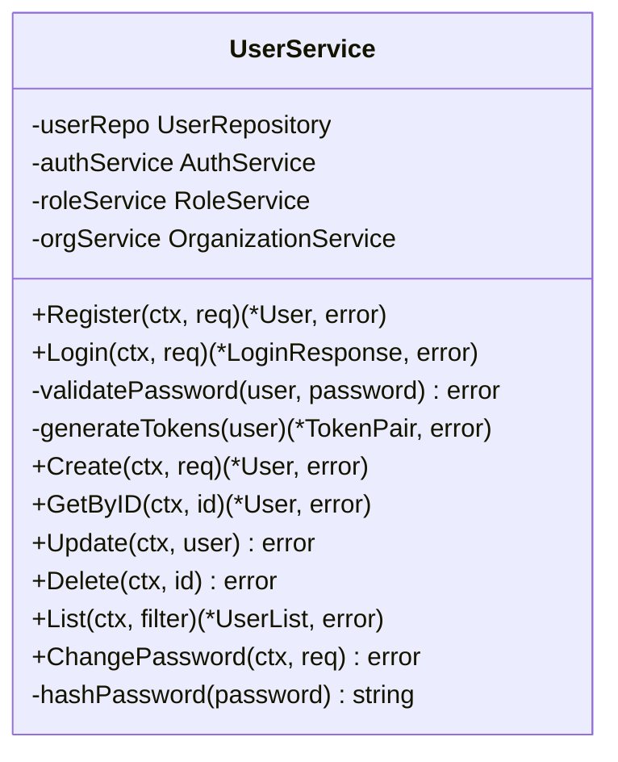
```mermaid
classDiagram
    class UserService {
        -userRepo UserRepository
        -authService AuthService
        -roleService RoleService
        -orgService OrganizationService
        +Register(ctx, req) (*User, error)
        +Login(ctx, req) (*LoginResponse, error)
        -validatePassword(user, password) error
        -generateTokens(user) (*TokenPair, error)
        +Create(ctx, req) (*User, error)
        +GetByID(ctx, id) (*User, error)
        +Update(ctx, user) error
        +Delete(ctx, id) error
        +List(ctx, filter) (*UserList, error)
        +ChangePassword(ctx, req) error
        -hashPassword(password) string
    }
```

**关键方法实现**:

```go
// Login 用户登录
func (s *UserService) Login(ctx context.Context, req *LoginRequest) (*LoginResponse, error) {
    // 1. 参数校验
    if req.Username == "" || req.Password == "" {
        return nil, ErrInvalidCredentials
    }

    // 2. 查询用户
    user, err := s.userRepo.GetByUsername(ctx, req.Username)
    if err != nil {
        if errors.Is(err, gorm.ErrRecordNotFound) {
            return nil, ErrInvalidCredentials
        }
        return nil, err
    }

    // 3. 检查用户状态
    if user.Status != "active" {
        return nil, ErrUserInactive
    }

    // 4. 验证密码
    if err := s.validatePassword(user, req.Password); err != nil {
        return nil, ErrInvalidCredentials
    }

    // 5. 加载用户角色和权限
    role, err := s.roleService.GetByID(ctx, user.RoleID)
    if err != nil {
        return nil, err
    }
    user.Role = role

    // 6. 生成JWT Token
    tokens, err := s.generateTokens(ctx, user)
    if err != nil {
        return nil, err
    }

    // 7. 记录登录日志
    s.loginLogRepository.Create(ctx, &LoginLog{
        UserID:    user.UserID,
        TenantID:  user.TenantID,
        IP:        req.ClientIP,
        UserAgent: req.UserAgent,
        LoginAt:   time.Now(),
    })

    return &LoginResponse{
        AccessToken:  tokens.AccessToken,
        RefreshToken: tokens.RefreshToken,
        TokenType:    "Bearer",
        ExpiresIn:    3600,
        User:         user,
    }, nil
}

// validatePassword 验证密码
func (s *UserService) validatePassword(user *User, password string) error {
    // 使用bcrypt验证密码
    err := bcrypt.CompareHashAndPassword([]byte(user.Password), []byte(password))
    if err != nil {
        return err
    }
    return nil
}

// generateTokens 生成JWT Token
func (s *UserService) generateTokens(ctx context.Context, user *User) (*TokenPair, error) {
    // 生成Access Token (1小时有效期)
    accessClaims := jwt.MapClaims{
        "user_id":   user.UserID,
        "tenant_id": user.TenantID,
        "role_id":   user.RoleID,
        "exp":       time.Now().Add(time.Hour * 1).Unix(),
        "type":      "access",
    }
    accessToken, err := jwt.NewWithClaims(jwt.SigningMethodHS256, accessClaims).
        SignedString([]byte(s.jwtSecret))
    if err != nil {
        return nil, err
    }

    // 生成Refresh Token (30天有效期)
    refreshClaims := jwt.MapClaims{
        "user_id":   user.UserID,
        "tenant_id": user.TenantID,
        "exp":       time.Now().Add(time.Hour * 24 * 30).Unix(),
        "type":      "refresh",
    }
    refreshToken, err := jwt.NewWithClaims(jwt.SigningMethodHS256, refreshClaims).
        SignedString([]byte(s.jwtSecret))
    if err != nil {
        return nil, err
    }

    // 存储Refresh Token到Redis
    key := fmt.Sprintf("refresh_token:%s", user.UserID)
    s.redisClient.Set(ctx, key, refreshToken, 30*24*time.Hour)

    return &TokenPair{
        AccessToken:  accessToken,
        RefreshToken: refreshToken,
    }, nil
}
```

### 3.4 时序图

#### 3.4.1 用户登录时序图

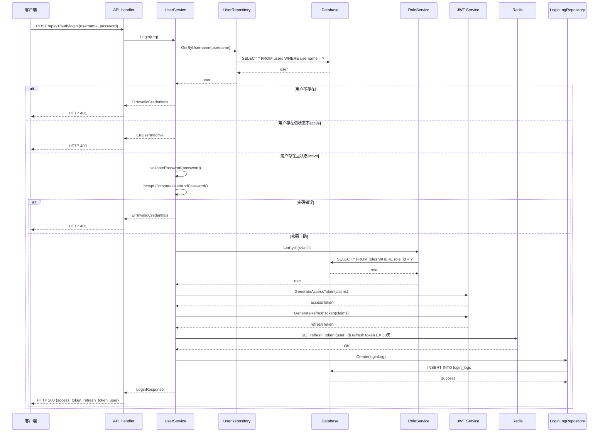
```mermaid
sequenceDiagram
    participant Client as 客户端
    participant API as API Handler
    participant UserSvc as UserService
    participant UserRepo as UserRepository
    participant DB as Database
    participant RoleSvc as RoleService
    participant JWT as JWT Service
    participant Redis as Redis
    participant LogRepo as LoginLogRepository

    Client->>API: POST /api/v1/auth/login {username, password}
    API->>UserSvc: Login(req)

    UserSvc->>UserRepo: GetByUsername(username)
    UserRepo->>DB: SELECT * FROM users WHERE username = ?
    DB-->>UserRepo: user
    UserRepo-->>UserSvc: user

    alt 用户不存在
        UserSvc-->>API: ErrInvalidCredentials
        API-->>Client: HTTP 401
    else 用户存在但状态不active
        UserSvc-->>API: ErrUserInactive
        API-->>Client: HTTP 403
    else 用户存在且状态active
        UserSvc->>UserSvc: validatePassword(password)
        UserSvc->>UserSvc: bcrypt.CompareHashAndPassword()

        alt 密码错误
            UserSvc-->>API: ErrInvalidCredentials
            API-->>Client: HTTP 401
        else 密码正确
            UserSvc->>RoleSvc: GetByID(roleID)
            RoleSvc->>DB: SELECT * FROM roles WHERE role_id = ?
            DB-->>RoleSvc: role
            RoleSvc-->>UserSvc: role

            UserSvc->>JWT: GenerateAccessToken(claims)
            JWT-->>UserSvc: accessToken

            UserSvc->>JWT: GenerateRefreshToken(claims)
            JWT-->>UserSvc: refreshToken

            UserSvc->>Redis: SET refresh_token:{user_id} refreshToken EX 30天
            Redis-->>UserSvc: OK

            UserSvc->>LogRepo: Create(loginLog)
            LogRepo->>DB: INSERT INTO login_logs
            DB-->>LogRepo: success

            UserSvc-->>API: LoginResponse
            API-->>Client: HTTP 200 {access_token, refresh_token, user}
        end
    end
```

### 3.5 数据结构

#### 3.5.1 User

```go
// User 用户实体
type User struct {
    UserID      string         `gorm:"primaryKey;column:user_id;type:varchar(64)" json:"user_id"`
    TenantID    string         `gorm:"column:tenant_id;type:varchar(64);index;not null" json:"tenant_id"`
    Username    string         `gorm:"column:username;type:varchar(64);uniqueIndex:idx_tenant_username;not null" json:"username"`
    Email       string         `gorm:"column:email;type:varchar(255)" json:"email"`
    Phone       string         `gorm:"column:phone;type:varchar(32)" json:"phone"`
    Password    string         `gorm:"column:password;type:varchar(255);not null" json:"-"`
    Nickname    string         `gorm:"column:nickname;type:varchar(128)" json:"nickname"`
    Avatar      string         `gorm:"column:avatar;type:varchar(512)" json:"avatar"`
    RoleID      string         `gorm:"column:role_id;type:varchar(64);index" json:"role_id"`
    OrgID       string         `gorm:"column:org_id;type:varchar(64);index" json:"org_id"`
    Status      string         `gorm:"column:status;type:varchar(32);default:active;index" json:"status"`
    LastLoginAt *time.Time     `gorm:"column:last_login_at" json:"last_login_at,omitempty"`
    CreatedAt   time.Time      `gorm:"column:created_at;autoCreateTime" json:"created_at"`
    UpdatedAt   time.Time      `gorm:"column:updated_at;autoUpdateTime" json:"updated_at"`
    DeletedAt   gorm.DeletedAt `gorm:"column:deleted_at;index" json:"-"`

    // 关联对象
    Role        *Role          `gorm:"foreignKey:RoleID" json:"role,omitempty"`
    Org         *Organization  `gorm:"foreignKey:OrgID" json:"org,omitempty"`
}
```

---

## 4. Bot管理服务详细设计

### 4.1 服务概述

**服务名称**: BotService
**服务职责**: Bot创建、配置、发布、删除、版本管理
**依赖服务**: KnowledgeBaseService, WorkflowService, AIService

### 4.2 接口设计

#### 4.2.1 Bot创建接口

**接口路径**: `POST /api/v1/bots`

**请求参数**:
```json
{
  "name": "客服助手",
  "description": "智能客服助手,解答常见问题",
  "avatar": "https://example.com/avatar.png",
  "greeting": "您好!我是智能客服助手,有什么可以帮您?",
  "bot_type": "chatbot",  // chatbot/workflow/agent
  "llm_config": {
    "model_id": "qwen-plus",
    "temperature": 0.7,
    "max_tokens": 2000,
    "system_prompt": "你是一个专业的客服助手..."
  },
  "knowledge_base_ids": ["kb_001", "kb_002"],
  "workflow_id": "wf_001"
}
```

**响应示例**:
```json
{
  "code": 0,
  "message": "success",
  "data": {
    "bot_id": "bot_1234567890",
    "name": "客服助手",
    "status": "draft",
    "version": 1,
    "created_at": "2025-12-29T10:00:00Z"
  }
}
```

#### 4.2.2 Bot发布接口

**接口路径**: `POST /api/v1/bots/{bot_id}/publish`

**请求参数**:
```json
{
  "version_note": "优化了回复质量"
}
```

**响应示例**:
```json
{
  "code": 0,
  "message": "Bot发布成功",
  "data": {
    "bot_id": "bot_1234567890",
    "version": 2,
    "status": "published",
    "published_at": "2025-12-29T12:00:00Z",
    "publish_url": "https://testtech.saas.coze.com/bot/bot_1234567890"
  }
}
```

### 4.3 类设计

#### 4.3.1 BotService

**类图**:
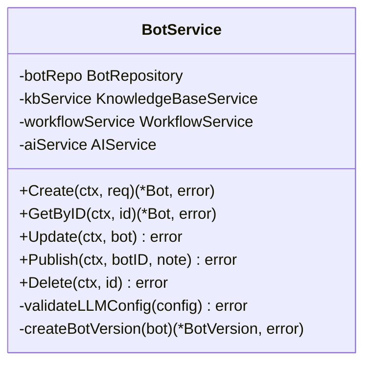
```mermaid
classDiagram
    class BotService {
        -botRepo BotRepository
        -kbService KnowledgeBaseService
        -workflowService WorkflowService
        -aiService AIService
        +Create(ctx, req) (*Bot, error)
        +GetByID(ctx, id) (*Bot, error)
        +Update(ctx, bot) error
        +Publish(ctx, botID, note) error
        +Delete(ctx, id) error
        -validateLLMConfig(config) error
        -createBotVersion(bot) (*BotVersion, error)
    }
```

**关键方法实现**:

```go
// Publish 发布Bot
func (s *BotService) Publish(ctx context.Context, botID string, note string) error {
    // 1. 获取Bot
    bot, err := s.botRepo.GetByID(ctx, botID)
    if err != nil {
        return err
    }

    // 2. 检查Bot状态
    if bot.Status == "published" {
        return ErrBotAlreadyPublished
    }

    // 3. 验证LLM配置
    if err := s.validateLLMConfig(ctx, bot.LLMConfig); err != nil {
        return err
    }

    // 4. 验证知识库
    for _, kbID := range bot.KnowledgeBaseIDs {
        kb, err := s.kbService.GetByID(ctx, kbID)
        if err != nil {
            return fmt.Errorf("知识库%s不存在", kbID)
        }
        if kb.Status != "ready" {
            return fmt.Errorf("知识库%s未就绪", kbID)
        }
    }

    // 5. 验证工作流(如果有)
    if bot.WorkflowID != "" {
        workflow, err := s.workflowService.GetByID(ctx, bot.WorkflowID)
        if err != nil {
            return err
        }
        if workflow.Status != "published" {
            return ErrWorkflowNotPublished
        }
    }

    // 6. 创建Bot版本
    version, err := s.createBotVersion(ctx, bot)
    if err != nil {
        return err
    }

    // 7. 更新Bot状态
    bot.Status = "published"
    bot.Version = version.Version
    bot.PublishedAt = &time.Time{}
    *bot.PublishedAt = time.Now()

    if err := s.botRepo.Update(ctx, bot); err != nil {
        return err
    }

    // 8. 清除缓存
    s.clearBotCache(ctx, botID)

    return nil
}
```

### 4.4 时序图

#### 4.4.1 Bot发布时序图

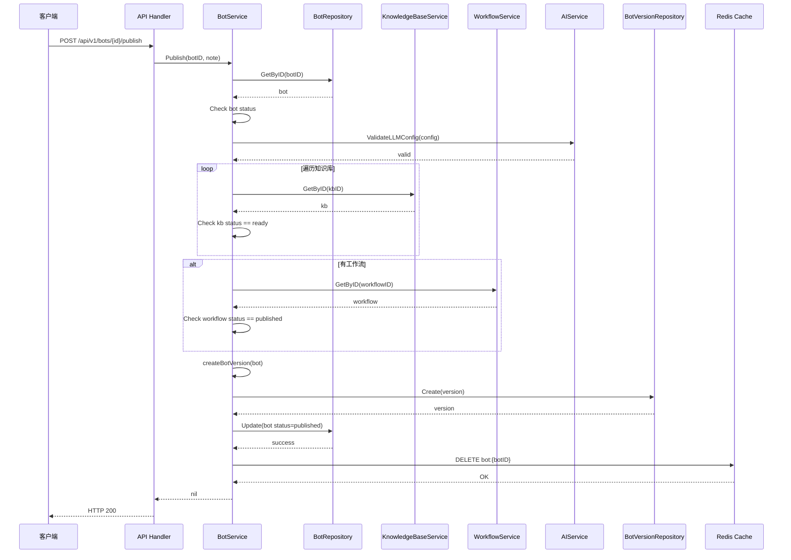
```mermaid
sequenceDiagram
    participant Client as 客户端
    participant API as API Handler
    participant BotSvc as BotService
    participant BotRepo as BotRepository
    participant KBSvc as KnowledgeBaseService
    participant WFSvc as WorkflowService
    participant AISvc as AIService
    participant VersionRepo as BotVersionRepository
    participant Cache as Redis Cache

    Client->>API: POST /api/v1/bots/{id}/publish
    API->>BotSvc: Publish(botID, note)

    BotSvc->>BotRepo: GetByID(botID)
    BotRepo-->>BotSvc: bot

    BotSvc->>BotSvc: Check bot status

    BotSvc->>AISvc: ValidateLLMConfig(config)
    AISvc-->>BotSvc: valid

    loop 遍历知识库
        BotSvc->>KBSvc: GetByID(kbID)
        KBSvc-->>BotSvc: kb
        BotSvc->>BotSvc: Check kb status == ready
    end

    alt 有工作流
        BotSvc->>WFSvc: GetByID(workflowID)
        WFSvc-->>BotSvc: workflow
        BotSvc->>BotSvc: Check workflow status == published
    end

    BotSvc->>BotSvc: createBotVersion(bot)
    BotSvc->>VersionRepo: Create(version)
    VersionRepo-->>BotSvc: version

    BotSvc->>BotRepo: Update(bot status=published)
    BotRepo-->>BotSvc: success

    BotSvc->>Cache: DELETE bot:{botID}
    Cache-->>BotSvc: OK

    BotSvc-->>API: nil
    API-->>Client: HTTP 200
```

---

## 5. 对话管理服务详细设计

### 5.1 服务概述

**服务名称**: ConversationService
**服务职责**: 对话创建、消息发送、消息接收、流式响应、对话历史管理
**依赖服务**: BotService, AIService, MessageService

### 5.2 接口设计

#### 5.2.1 创建对话接口

**接口路径**: `POST /api/v1/conversations`

**请求参数**:
```json
{
  "bot_id": "bot_1234567890",
  "user_id": "user_1234567890"
}
```

#### 5.2.2 发送消息接口(SSE流式)

**接口路径**: `POST /api/v1/conversations/{conversation_id}/messages`

**请求参数**:
```json
{
  "content": "你好,请介绍一下你们公司",
  "message_type": "text"
}
```

**响应**: Server-Sent Events流式响应

```
data: {"type":"message_start","message_id":"msg_001"}

data: {"type":"content_delta","content":"您好!"}

data: {"type":"content_delta","content":"我们公司是..."}

data: {"type":"content_delta","content":"专注于AI技术..."}

data: {"type":"message_end","message_id":"msg_001","finish_reason":"stop"}
```

### 5.3 类设计

#### 5.3.1 ConversationService

**类图**:
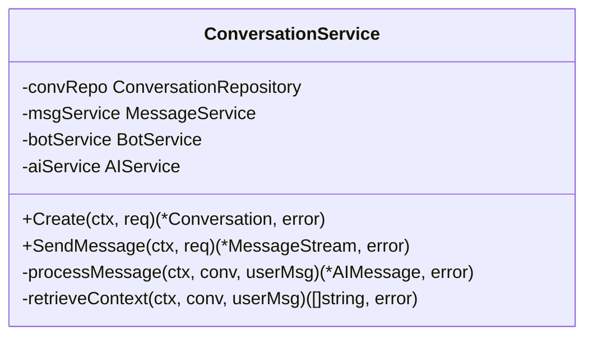
```mermaid
classDiagram
    class ConversationService {
        -convRepo ConversationRepository
        -msgService MessageService
        -botService BotService
        -aiService AIService
        +Create(ctx, req) (*Conversation, error)
        +SendMessage(ctx, req) (*MessageStream, error)
        -processMessage(ctx, conv, userMsg) (*AIMessage, error)
        -retrieveContext(ctx, conv, userMsg) ([]string, error)
    }
```

### 5.4 时序图

#### 5.4.1 发送消息流程

```mermaid
sequenceDiagram
    participant User as 用户
    participant Client as 客户端
    participant API as API Handler
    participant ConvSvc as ConversationService
    participant MsgSvc as MessageService
    participant BotSvc as BotService
    participant KBSvc as KnowledgeBaseService
    participant AISvc as AIService
    participant Stream as SSE Stream

    User->>Client: 输入消息
    Client->>API: POST /conversations/{id}/messages
    API->>ConvSvc: SendMessage(req)

    ConvSvc->>MsgSvc: Create(userMessage)
    MsgSvc->>DB: INSERT INTO messages
    DB-->>MsgSvc: success

    ConvSvc->>BotSvc: GetByID(botID)
    BotSvc-->>ConvSvc: bot

    Bot有知识库?
    alt 是
        ConvSvc->>KBSvc: Search(query, kbIDs)
        KBSvc-->>ConvSvc: docs
    end

    ConvSvc->>AISvc: ChatStream(messages, context, llmConfig)
    AISvc-->>ConvSvc: stream

    loop 流式响应
        AISvc->>Stream: SSE data chunk
        Stream->>Client: data: {...}
        Client->>User: 显示消息片段
    end

    AISvc->>MsgSvc: Create(aiMessage)
    MsgSvc->>DB: INSERT INTO messages
```

---

## 6. 知识库服务详细设计

### 6.1 服务概述

**服务名称**: KnowledgeBaseService
**服务职责**: 知识库创建、文档上传、向量化、语义检索
**依赖服务**: MilvusService, EmbeddingService, FileStorageService

### 6.2 接口设计

#### 6.2.1 创建知识库接口

**接口路径**: `POST /api/v1/knowledge-bases`

**请求参数**:
```json
{
  "name": "产品手册",
  "description": "公司产品使用手册",
  "embedding_model": "text-embedding-ada-002",
  "chunk_size": 500,
  "chunk_overlap": 50
}
```

**响应示例**:
```json
{
  "code": 0,
  "message": "success",
  "data": {
    "kb_id": "kb_1234567890",
    "name": "产品手册",
    "status": "initializing",
    "created_at": "2025-12-29T10:00:00Z"
  }
}
```

#### 6.2.2 上传文档接口

**接口路径**: `POST /api/v1/knowledge-bases/{kb_id}/documents`

**请求参数**: `multipart/form-data`
- `file`: 文档文件(PDF, DOCX, TXT, MD)
- `metadata`: JSON字符串,包含文档元数据

**响应示例**:
```json
{
  "code": 0,
  "message": "文档上传成功,正在处理",
  "data": {
    "document_id": "doc_1234567890",
    "filename": "产品手册.pdf",
    "status": "processing",
    "chunks_count": 0
  }
}
```

#### 6.2.3 语义检索接口

**接口路径**: `POST /api/v1/knowledge-bases/{kb_id}/search`

**请求参数**:
```json
{
  "query": "如何重置密码?",
  "top_k": 5,
  "score_threshold": 0.7
}
```

**响应示例**:
```json
{
  "code": 0,
  "message": "success",
  "data": {
    "query": "如何重置密码?",
    "results": [
      {
        "chunk_id": "chunk_001",
        "document_id": "doc_001",
        "document_name": "用户手册.pdf",
        "content": "用户可以通过以下步骤重置密码:1. 点击登录页面的"忘记密码"链接...",
        "score": 0.92,
        "metadata": {
          "page": 15,
          "chapter": "账号管理"
        }
      }
    ]
  }
}
```

### 6.3 类设计

#### 6.3.1 KnowledgeBaseService

**类图**:
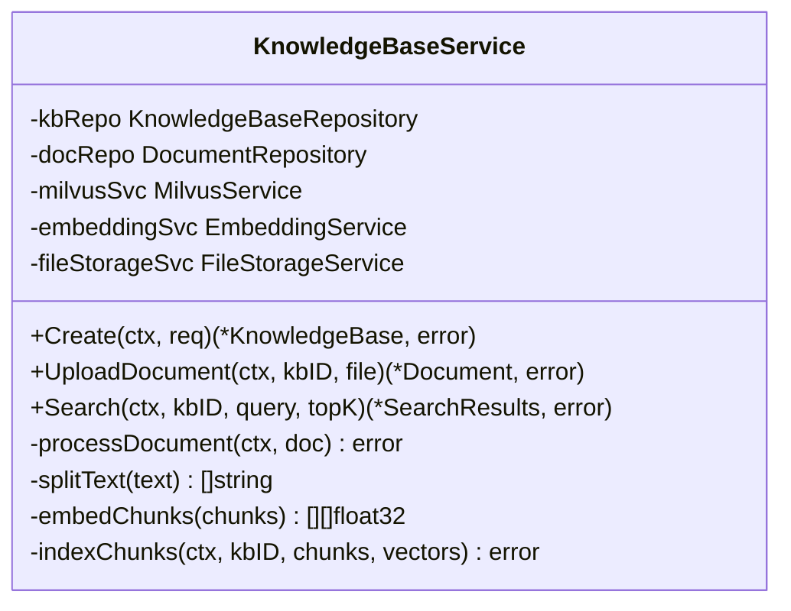
```mermaid
classDiagram
    class KnowledgeBaseService {
        -kbRepo KnowledgeBaseRepository
        -docRepo DocumentRepository
        -milvusSvc MilvusService
        -embeddingSvc EmbeddingService
        -fileStorageSvc FileStorageService
        +Create(ctx, req) (*KnowledgeBase, error)
        +UploadDocument(ctx, kbID, file) (*Document, error)
        +Search(ctx, kbID, query, topK) (*SearchResults, error)
        -processDocument(ctx, doc) error
        -splitText(text) []string
        -embedChunks(chunks) [][]float32
        -indexChunks(ctx, kbID, chunks, vectors) error
    }
```

**关键方法实现**:

```go
// UploadDocument 上传文档
func (s *KnowledgeBaseService) UploadDocument(ctx context.Context, kbID string, file *multipart.FileHeader, metadata map[string]string) (*Document, error) {
    // 1. 检查知识库是否存在
    kb, err := s.kbRepo.GetByID(ctx, kbID)
    if err != nil {
        return nil, err
    }

    // 2. 存储文件到MinIO
    fileKey := fmt.Sprintf("kb/%s/%s", kbID, file.Filename)
    reader, err := file.Open()
    if err != nil {
        return nil, err
    }
    defer reader.Close()

    fileURL, err := s.fileStorageSvc.Upload(ctx, fileKey, reader, file.Header.Get("Content-Type"))
    if err != nil {
        return nil, err
    }

    // 3. 创建文档记录
    doc := &Document{
        DocumentID: generateDocumentID(),
        KBID:       kbID,
        FileName:   file.Filename,
        FileURL:    fileURL,
        FileSize:   file.Size,
        Status:     "processing",
        Metadata:   metadata,
        CreatedAt:  time.Now(),
    }

    if err := s.docRepo.Create(ctx, doc); err != nil {
        return nil, err
    }

    // 4. 异步处理文档(分块、向量化、索引)
    go s.processDocument(context.Background(), doc)

    return doc, nil
}

// processDocument 处理文档
func (s *KnowledgeBaseService) processDocument(ctx context.Context, doc *Document) error {
    // 1. 下载文件
    reader, err := s.fileStorageSvc.Download(ctx, doc.FileURL)
    if err != nil {
        return err
    }
    defer reader.Close()

    // 2. 提取文本(根据文件类型)
    text, err := s.extractText(reader, doc.FileName)
    if err != nil {
        return err
    }

    // 3. 文本分块
    chunks := s.splitText(text)

    // 4. 向量化
    vectors, err := s.embeddingSvc.EmbedChunks(ctx, chunks)
    if err != nil {
        return err
    }

    // 5. 索引到Milvus
    chunkIDs := make([]string, len(chunks))
    for i := range chunks {
        chunkIDs[i] = generateChunkID()
    }

    if err := s.milvusSvc.InsertChunks(ctx, doc.KBID, chunkIDs, chunks, vectors); err != nil {
        return err
    }

    // 6. 更新文档状态
    doc.Status = "ready"
    doc.ChunksCount = len(chunks)
    s.docRepo.Update(ctx, doc)

    return nil
}

// splitText 文本分块
func (s *KnowledgeBaseService) splitText(text string) []string {
    // 按段落分块
    paragraphs := strings.Split(text, "\n\n")

    var chunks []string
    currentChunk := ""

    for _, paragraph := range paragraphs {
        if len(currentChunk) + len(paragraph) > s.chunkSize {
            if currentChunk != "" {
                chunks = append(chunks, currentChunk)
            }
            currentChunk = paragraph
        } else {
            currentChunk += paragraph + "\n\n"
        }
    }

    if currentChunk != "" {
        chunks = append(chunks, currentChunk)
    }

    return chunks
}

// Search 语义检索
func (s *KnowledgeBaseService) Search(ctx context.Context, kbID string, query string, topK int, threshold float64) (*SearchResults, error) {
    // 1. 查询向量化
    queryVector, err := s.embeddingSvc.EmbedQuery(ctx, query)
    if err != nil {
        return nil, err
    }

    // 2. Milvus向量检索
    searchResults, err := s.milvusSvc.Search(ctx, kbID, queryVector, topK)
    if err != nil {
        return nil, err
    }

    // 3. 过滤低分结果
    var filteredResults []SearchResult
    for _, result := range searchResults {
        if result.Score >= threshold {
            filteredResults = append(filteredResults, result)
        }
    }

    // 4. 加载文档元数据
    for i := range filteredResults {
        doc, _ := s.docRepo.GetByID(ctx, filteredResults[i].DocumentID)
        if doc != nil {
            filteredResults[i].DocumentName = doc.FileName
            filteredResults[i].Metadata = doc.Metadata
        }
    }

    return &SearchResults{
        Query:   query,
        Results: filteredResults,
    }, nil
}
```

### 6.4 时序图

#### 6.4.1 文档上传与处理时序图

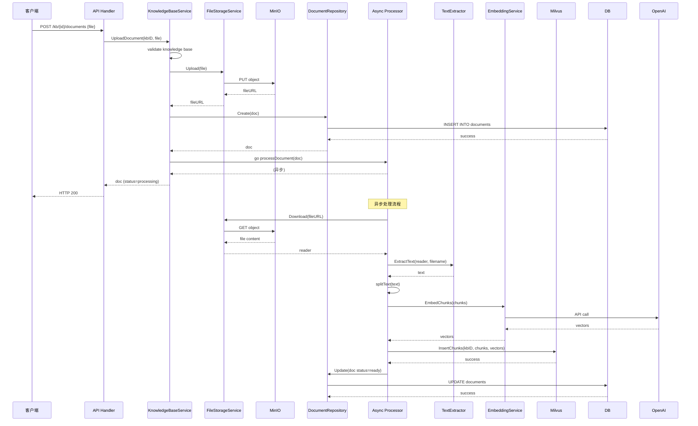
```mermaid
sequenceDiagram
    participant Client as 客户端
    participant API as API Handler
    participant KBSvc as KnowledgeBaseService
    participant FileSvc as FileStorageService
    participant MinIO as MinIO
    participant DocRepo as DocumentRepository
    participant AsyncProc as Async Processor
    participant Extractor as TextExtractor
    participant EmbedSvc as EmbeddingService
    participant Milvus as Milvus

    Client->>API: POST /kb/{id}/documents {file}
    API->>KBSvc: UploadDocument(kbID, file)

    KBSvc->>KBSvc: validate knowledge base

    KBSvc->>FileSvc: Upload(file)
    FileSvc->>MinIO: PUT object
    MinIO-->>FileSvc: fileURL
    FileSvc-->>KBSvc: fileURL

    KBSvc->>DocRepo: Create(doc)
    DocRepo->>DB: INSERT INTO documents
    DB-->>DocRepo: success
    DocRepo-->>KBSvc: doc

    KBSvc->>AsyncProc: go processDocument(doc)
    AsyncProc-->>KBSvc: (异步)

    KBSvc-->>API: doc (status=processing)
    API-->>Client: HTTP 200

    Note over AsyncProc: 异步处理流程
    AsyncProc->>FileSvc: Download(fileURL)
    FileSvc->>MinIO: GET object
    MinIO-->>FileSvc: file content
    FileSvc-->>AsyncProc: reader

    AsyncProc->>Extractor: ExtractText(reader, filename)
    Extractor-->>AsyncProc: text

    AsyncProc->>AsyncProc: splitText(text)
    AsyncProc->>EmbedSvc: EmbedChunks(chunks)
    EmbedSvc->>OpenAI: API call
    OpenAI-->>EmbedSvc: vectors
    EmbedSvc-->>AsyncProc: vectors

    AsyncProc->>Milvus: InsertChunks(kbID, chunks, vectors)
    Milvus-->>AsyncProc: success

    AsyncProc->>DocRepo: Update(doc status=ready)
    DocRepo->>DB: UPDATE documents
    DB-->>DocRepo: success
```

### 6.5 数据结构

#### 6.5.1 KnowledgeBase

```go
// KnowledgeBase 知识库实体
type KnowledgeBase struct {
    KBID           string         `gorm:"primaryKey;column:kb_id;type:varchar(64)" json:"kb_id"`
    TenantID       string         `gorm:"column:tenant_id;type:varchar(64);index;not null" json:"tenant_id"`
    Name           string         `gorm:"column:name;type:varchar(255);not null" json:"name"`
    Description    string         `gorm:"column:description;type:text" json:"description"`
    EmbeddingModel string         `gorm:"column:embedding_model;type:varchar(64)" json:"embedding_model"`
    ChunkSize      int            `gorm:"column:chunk_size;default:500" json:"chunk_size"`
    ChunkOverlap   int            `gorm:"column:chunk_overlap;default:50" json:"chunk_overlap"`
    Status         string         `gorm:"column:status;type:varchar(32);default:initializing" json:"status"`
    DocumentsCount int            `gorm:"column:documents_count;default:0" json:"documents_count"`
    ChunksCount    int            `gorm:"column:chunks_count;default:0" json:"chunks_count"`
    CreatedAt      time.Time      `gorm:"column:created_at;autoCreateTime" json:"created_at"`
    UpdatedAt      time.Time      `gorm:"column:updated_at;autoUpdateTime" json:"updated_at"`
    DeletedAt      gorm.DeletedAt `gorm:"column:deleted_at;index" json:"-"`
}
```

---

## 7. Multi-Tenant中间件详细设计

### 7.1 中间件概述

**中间件名称**: TenantMiddleware
**职责**: 租户识别、租户隔离、租户上下文注入
**技术栈**: Go Hertz Middleware

### 7.2 租户识别策略

#### 7.2.1 识别方式

支持三种租户识别方式:

1. **子域名方式** (推荐)
   - URL: `https://{tenant_subdomain}.saas.coze.com/...`
   - 优先级: 最高

2. **路径方式**
   - URL: `https://saas.coze.com/t/{tenant_id}/...`
   - 优先级: 中等

3. **Header方式** (用于API调用)
   - Header: `X-Tenant-ID: {tenant_id}`
   - 优先级: 最低

#### 7.2.2 TenantMiddleware实现

```go
// TenantMiddleware 租户中间件
func TenantMiddleware() app.HandlerFunc {
    return func(ctx context.Context, c *app.RequestContext) {
        tenantID, err := extractTenantID(c)
        if err != nil {
            c.JSON(400, H{"code": 40001, "message": "无法识别租户"})
            c.Abort()
            return
        }

        // 验证租户是否存在
        tenant, err := tenantService.GetByID(ctx, tenantID)
        if err != nil {
            c.JSON(404, H{"code": 40401, "message": "租户不存在"})
            c.Abort()
            return
        }

        // 检查租户状态
        if tenant.Status != "active" {
            c.JSON(403, H{"code": 40301, "message": "租户已被停用"})
            c.Abort()
            return
        }

        // 注入租户上下文
        ctx = context.WithValue(ctx, "tenant_id", tenantID)
        ctx = context.WithValue(ctx, "tenant", tenant)

        c.Next(ctx)
    }
}

// extractTenantID 提取租户ID
func extractTenantID(c *app.RequestContext) (string, error) {
    // 1. 优先从子域名提取
    host := string(c.Host())
    parts := strings.Split(host, ".")
    if len(parts) > 1 && parts[1] == "saas" && parts[2] == "coze" && parts[3] == "com" {
        subdomain := parts[0]
        // 通过子域名查询租户ID
        tenant, err := tenantService.GetBySubdomain(context.Background(), subdomain)
        if err == nil {
            return tenant.TenantID, nil
        }
    }

    // 2. 从路径提取
    path := string(c.Path())
    if matches := regexp.MustCompile(`^/t/([^/]+)/`).FindStringSubmatch(path); len(matches) > 1 {
        return matches[1], nil
    }

    // 3. 从Header提取
    tenantID := c.GetHeader("X-Tenant-ID")
    if tenantID != "" {
        return tenantID, nil
    }

    return "", ErrTenantNotIdentified
}
```

### 7.3 租户隔离策略

#### 7.3.1 数据库隔离

**Row-Level隔离** (默认方案):

```go
// TenantScope 租户作用域
func TenantScope(tenantID string) func(db *gorm.DB) *gorm.DB {
    return func(db *gorm.DB) *gorm.DB {
        return db.Where("tenant_id = ?", tenantID)
    }
}

// 使用示例
func (r *userRepositoryImpl) GetByID(ctx context.Context, id string) (*User, error) {
    tenantID := ctx.Value("tenant_id").(string)

    var user User
    err := r.db.WithContext(ctx).
        Scopes(TenantScope(tenantID)).
        Where("user_id = ?", id).
        First(&user).Error

    return &user, err
}
```

**Schema隔离** (企业版可选):

```go
// 动态切换Schema
func SetSchema(db *gorm.DB, tenantID string) error {
    return db.Exec(fmt.Sprintf("SET search_path TO %s", tenantID)).Error
}
```

**Database隔离** (旗舰版专用):

```go
// 动态切换数据库
func SetDatabase(db *gorm.DB, tenantID string) error {
    return db.Exec(fmt.Sprintf("USE %s", tenantID)).Error
}
```

#### 7.3.2 缓存隔离

```go
// Redis租户隔离
type TenantCache struct {
    client *redis.Client
}

func (c *TenantCache) Get(ctx context.Context, tenantID string, key string) (string, error) {
    tenantKey := fmt.Sprintf("tenant:%s:%s", tenantID, key)
    return c.client.Get(ctx, tenantKey).Result()
}

func (c *TenantCache) Set(ctx context.Context, tenantID string, key string, value interface{}, expiration time.Duration) error {
    tenantKey := fmt.Sprintf("tenant:%s:%s", tenantID, key)
    return c.client.Set(ctx, tenantKey, value, expiration).Err()
}
```

#### 7.3.3 存储隔离

```go
// MinIO租户隔离
type TenantStorage struct {
    client *minio.Client
}

func (s *TenantStorage) Upload(ctx context.Context, tenantID string, objectName string, reader io.Reader) error {
    bucketName := fmt.Sprintf("tenant-%s", tenantID)

    // 确保bucket存在
    if err := s.ensureBucket(ctx, bucketName); err != nil {
        return err
    }

    _, err := s.client.PutObject(ctx, bucketName, objectName, reader, -1, minio.PutObjectOptions{})
    return err
}

func (s *TenantStorage) ensureBucket(ctx context.Context, bucketName string) error {
    exists, err := s.client.BucketExists(ctx, bucketName)
    if err != nil {
        return err
    }
    if !exists {
        return s.client.MakeBucket(ctx, bucketName, minio.MakeBucketOptions{})
    }
    return nil
}
```

### 7.4 租户限流中间件

```go
// RateLimitMiddleware 租户限流中间件
func RateLimitMiddleware() app.HandlerFunc {
    return func(ctx context.Context, c *app.RequestContext) {
        tenantID := ctx.Value("tenant_id").(string)

        // 获取租户配额
        quota, _ := quotaService.GetTenantQuota(ctx, tenantID)

        // 检查API调用量
        key := fmt.Sprintf("ratelimit:%s:%s", tenantID, time.Now().Format("2006-01"))
        count, _ := redisClient.Incr(ctx, key).Result()
        if count == 1 {
            redisClient.Expire(ctx, key, 30*24*time.Hour)
        }

        if count > quota.APICalls.LimitMonthly {
            c.JSON(429, H{"code": 42901, "message": "API调用量已超限"})
            c.Abort()
            return
        }

        c.Next(ctx)
    }
}
```

### 7.5 时序图

#### 7.5.1 租户识别与隔离流程

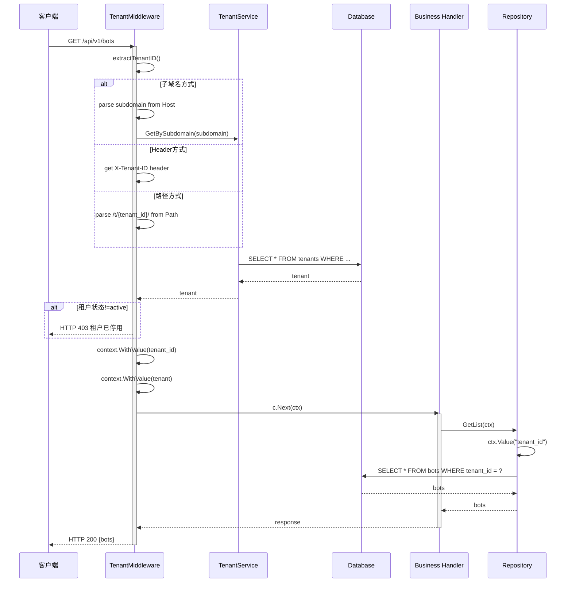
```mermaid
sequenceDiagram
    participant Client as 客户端
    participant Middleware as TenantMiddleware
    participant TenantSvc as TenantService
    participant DB as Database
    participant Handler as Business Handler
    participant Repo as Repository

    Client->>Middleware: GET /api/v1/bots
    activate Middleware

    Middleware->>Middleware: extractTenantID()

    alt 子域名方式
        Middleware->>Middleware: parse subdomain from Host
        Middleware->>TenantSvc: GetBySubdomain(subdomain)
    else Header方式
        Middleware->>Middleware: get X-Tenant-ID header
    else 路径方式
        Middleware->>Middleware: parse /t/{tenant_id}/ from Path
    end

    TenantSvc->>DB: SELECT * FROM tenants WHERE ...
    DB-->>TenantSvc: tenant
    TenantSvc-->>Middleware: tenant

    alt 租户状态!=active
        Middleware-->>Client: HTTP 403 租户已停用
    end

    Middleware->>Middleware: context.WithValue(tenant_id)
    Middleware->>Middleware: context.WithValue(tenant)

    Middleware->>Handler: c.Next(ctx)
    activate Handler
    Handler->>Repo: GetList(ctx)
    Repo->>Repo: ctx.Value("tenant_id")
    Repo->>DB: SELECT * FROM bots WHERE tenant_id = ?
    DB-->>Repo: bots
    Repo-->>Handler: bots
    Handler-->>Middleware: response
    deactivate Handler

    Middleware-->>Client: HTTP 200 {bots}
    deactivate Middleware
```

---

## 8. 工作流引擎详细设计

### 8.1 引擎概述

**引擎名称**: WorkflowEngine
**职责**: 工作流定义、执行、调试、版本管理
**核心能力**: 可视化编排、节点类型扩展、变量传递、错误处理

### 8.2 工作流数据结构

#### 8.2.1 工作流定义

```go
// Workflow 工作流实体
type Workflow struct {
    WorkflowID    string         `gorm:"primaryKey;column:workflow_id;type:varchar(64)" json:"workflow_id"`
    TenantID      string         `gorm:"column:tenant_id;type:varchar(64);index;not null" json:"tenant_id"`
    BotID         string         `gorm:"column:bot_id;type:varchar(64);index" json:"bot_id"`
    Name          string         `gorm:"column:name;type:varchar(255);not null" json:"name"`
    Description   string         `gorm:"column:description;type:text" json:"description"`
    Definition    WorkflowDef    `gorm:"column:definition;type:json;not null" json:"definition"`
    Status        string         `gorm:"column:status;type:varchar(32);default:draft" json:"status"`
    Version       int            `gorm:"column:version;default:1" json:"version"`
    CreatedAt     time.Time      `gorm:"column:created_at;autoCreateTime" json:"created_at"`
    UpdatedAt     time.Time      `gorm:"column:updated_at;autoUpdateTime" json:"updated_at"`
    DeletedAt     gorm.DeletedAt `gorm:"column:deleted_at;index" json:"-"`
}

// WorkflowDef 工作流定义
type WorkflowDef struct {
    Nodes     []Node     `json:"nodes"`
    Edges     []Edge     `json:"edges"`
    Variables []Variable `json:"variables"`
}

// Node 节点
type Node struct {
    ID          string                 `json:"id"`
    Type        string                 `json:"type"` // start, end, llm, http, condition, etc.
    Name        string                 `json:"name"`
    Config      map[string]interface{} `json:"config"`
    Position    Position               `json:"position"`
}

// Edge 边(连接)
type Edge struct {
    ID     string `json:"id"`
    Source string `json:"source"` // source node id
    Target string `json:"target"` // target node id
    Condition *Condition `json:"condition,omitempty"` // 条件(可选)
}

// Variable 变量
type Variable struct {
    Name  string `json:"name"`
    Type  string `json:"type"` // string, number, object, array
    Value interface{} `json:"value"`
}

// Position 位置
type Position struct {
    X int `json:"x"`
    Y int `json:"y"`
}
```

### 8.3 节点类型设计

#### 8.3.1 开始节点 (Start Node)

```go
// StartNodeConfig 开始节点配置
type StartNodeConfig struct {
    Variables []Variable `json:"variables"` // 输入变量
}

func (n *StartNode) Execute(ctx *ExecutionContext) (*NodeResult, error) {
    // 初始化变量
    for _, v := range n.Config.Variables {
        ctx.SetVariable(v.Name, v.Value)
    }
    return &NodeResult{
        Status: "success",
        Output: ctx.GetAllVariables(),
    }, nil
}
```

#### 8.3.2 LLM节点 (LLM Node)

```go
// LLMNodeConfig LLM节点配置
type LLMNodeConfig struct {
    Model       string            `json:"model"`
    Prompt      string            `json:"prompt"`        // 支持变量插值
    Temperature float64           `json:"temperature"`
    MaxTokens   int               `json:"max_tokens"`
    Variables   map[string]string `json:"variables"`     // 输入变量映射
}

func (n *LLMNode) Execute(ctx *ExecutionContext) (*NodeResult, error) {
    // 1. 解析Prompt中的变量
    prompt := ctx.RenderTemplate(n.Config.Prompt)

    // 2. 调用AI服务
    response, err := aiService.Chat(ctx, &ChatRequest{
        Model:       n.Config.Model,
        Messages:    []Message{{Role: "user", Content: prompt}},
        Temperature: n.Config.Temperature,
        MaxTokens:   n.Config.MaxTokens,
    })
    if err != nil {
        return nil, err
    }

    // 3. 提取输出变量
    output := make(map[string]interface{})
    output["response"] = response.Content

    return &NodeResult{
        Status: "success",
        Output: output,
    }, nil
}
```

#### 8.3.3 HTTP请求节点 (HTTP Node)

```go
// HTTPNodeConfig HTTP节点配置
type HTTPNodeConfig struct {
    URL     string            `json:"url"`
    Method  string            `json:"method"` // GET, POST, PUT, DELETE
    Headers map[string]string `json:"headers"`
    Body    interface{}       `json:"body"`
}

func (n *HTTPNode) Execute(ctx *ExecutionContext) (*NodeResult, error) {
    // 1. 渲染URL中的变量
    url := ctx.RenderTemplate(n.Config.URL)

    // 2. 构造请求
    req, err := http.NewRequest(n.Config.Method, url, nil)
    if err != nil {
        return nil, err
    }

    // 3. 设置Headers
    for k, v := range n.Config.Headers {
        req.Header.Set(k, v)
    }

    // 4. 发送请求
    client := &http.Client{Timeout: 30 * time.Second}
    resp, err := client.Do(req)
    if err != nil {
        return nil, err
    }
    defer resp.Body.Close()

    // 5. 读取响应
    body, _ := ioutil.ReadAll(resp.Body)

    return &NodeResult{
        Status: "success",
        Output: map[string]interface{}{
            "status_code": resp.StatusCode,
            "body":        string(body),
        },
    }, nil
}
```

#### 8.3.4 条件分支节点 (Condition Node)

```go
// ConditionNodeConfig 条件节点配置
type ConditionNodeConfig struct {
    Variable string         `json:"variable"` // 判断的变量名
    Operator string         `json:"operator"` // ==, !=, >, <, contains, etc.
    Value    interface{}    `json:"value"`    // 比较值
    Cases    []ConditionCase `json:"cases"`    // 分支case
}

type ConditionCase struct {
    Condition string `json:"condition"` // 条件表达式
    TargetNode string `json:"target_node"` // 满足条件时跳转到的节点ID
}

func (n *ConditionNode) Execute(ctx *ExecutionContext) (*NodeResult, error) {
    // 1. 获取变量值
    value := ctx.GetVariable(n.Config.Variable)

    // 2. 执行条件判断
    matched := false
    var targetNode string

    for _, case_ := range n.Config.Cases {
        if ctx.EvaluateCondition(case_.Condition) {
            matched = true
            targetNode = case_.TargetNode
            break
        }
    }

    // 3. 返回结果(包含下一个节点)
    return &NodeResult{
        Status:     "success",
        Output:     map[string]interface{}{"matched": matched},
        NextNodeID: targetNode,
    }, nil
}
```

### 8.4 工作流执行引擎

#### 8.4.1 执行引擎实现

```go
// WorkflowEngine 工作流引擎
type WorkflowEngine struct {
    nodeRegistry map[string]NodeFactory
}

// Execute 执行工作流
func (e *WorkflowEngine) Execute(ctx context.Context, workflow *Workflow, input map[string]interface{}) (*ExecutionResult, error) {
    // 1. 初始化执行上下文
    execCtx := NewExecutionContext(ctx, input)

    // 2. 查找开始节点
    startNode := e.findNode(workflow, "start")
    if startNode == nil {
        return nil, ErrNoStartNode
    }

    // 3. 执行节点链
    currentNode := startNode
    executionHistory := []NodeExecution{}

    for currentNode != nil {
        // 3.1 创建节点实例
        node, err := e.createNode(currentNode)
        if err != nil {
            return nil, err
        }

        // 3.2 执行节点
        startTime := time.Now()
        result, err := node.Execute(execCtx)
        duration := time.Since(startTime)

        // 3.3 记录执行历史
        executionHistory = append(executionHistory, NodeExecution{
            NodeID:   currentNode.ID,
            NodeName: currentNode.Name,
            Status:   result.Status,
            Duration: duration,
            Error:    err,
        })

        if err != nil {
            return &ExecutionResult{
                Status:          "failed",
                ExecutionHistory: executionHistory,
                Error:           err,
            }, err
        }

        // 3.4 设置输出变量到上下文
        for k, v := range result.Output {
            execCtx.SetVariable(k, v)
        }

        // 3.5 确定下一个节点
        if result.NextNodeID != "" {
            // 节点内部指定了下一个节点(如条件节点)
            currentNode = e.findNodeByID(workflow, result.NextNodeID)
        } else {
            // 根据边查找下一个节点
            currentNode = e.findNextNode(workflow, currentNode.ID, execCtx)
        }

        // 3.6 检查是否到达结束节点
        if currentNode != nil && currentNode.Type == "end" {
            break
        }
    }

    return &ExecutionResult{
        Status:          "success",
        Output:          execCtx.GetAllVariables(),
        ExecutionHistory: executionHistory,
    }, nil
}

// findNextNode 查找下一个节点
func (e *WorkflowEngine) findNextNode(workflow *Workflow, currentNodeID string, execCtx *ExecutionContext) *Node {
    // 查找从当前节点出发的边
    for _, edge := range workflow.Definition.Edges {
        if edge.Source == currentNodeID {
            // 如果有条件,评估条件
            if edge.Condition != nil {
                if !execCtx.EvaluateCondition(edge.Condition.Expression) {
                    continue // 条件不满足,跳过这条边
                }
            }

            // 返回目标节点
            return e.findNodeByID(workflow, edge.Target)
        }
    }
    return nil
}
```

### 8.5 时序图

#### 8.5.1 工作流执行流程

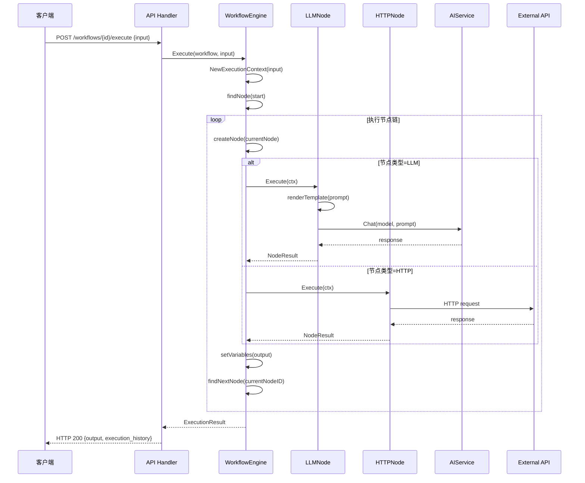
```mermaid
sequenceDiagram
    participant Client as 客户端
    participant API as API Handler
    participant Engine as WorkflowEngine
    participant LLMNode as LLMNode
    participant HTTPNode as HTTPNode
    participant AISvc as AIService
    participant TargetAPI as External API

    Client->>API: POST /workflows/{id}/execute {input}
    API->>Engine: Execute(workflow, input)

    Engine->>Engine: NewExecutionContext(input)
    Engine->>Engine: findNode(start)

    loop 执行节点链
        Engine->>Engine: createNode(currentNode)

        alt 节点类型=LLM
            Engine->>LLMNode: Execute(ctx)
            LLMNode->>LLMNode: renderTemplate(prompt)
            LLMNode->>AISvc: Chat(model, prompt)
            AISvc-->>LLMNode: response
            LLMNode-->>Engine: NodeResult
        else 节点类型=HTTP
            Engine->>HTTPNode: Execute(ctx)
            HTTPNode->>TargetAPI: HTTP request
            TargetAPI-->>HTTPNode: response
            HTTPNode-->>Engine: NodeResult
        end

        Engine->>Engine: setVariables(output)
        Engine->>Engine: findNextNode(currentNodeID)
    end

    Engine-->>API: ExecutionResult
    API-->>Client: HTTP 200 {output, execution_history}
```

---

## 9. AI引擎集成详细设计

### 9.1 AI引擎概述

**服务名称**: AIService
**职责**: 统一AI模型调用、多模型支持、流式响应、错误处理
**支持的模型**:
- 通义千问 (Qwen)
- GPT-4 / GPT-3.5
- Claude-3
- 文心一言 (ERNIE)
- DeepSeek

### 9.2 接口设计

#### 9.2.1 统一Chat接口

**接口路径**: `POST /api/v1/ai/chat`

**请求参数**:
```json
{
  "model": "qwen-plus",
  "messages": [
    {"role": "system", "content": "你是一个智能助手"},
    {"role": "user", "content": "你好"}
  ],
  "temperature": 0.7,
  "max_tokens": 2000,
  "stream": true
}
```

**响应**: SSE流式响应 (stream=true) 或普通JSON响应 (stream=false)

### 9.3 类设计

#### 9.3.1 AIService

**类图**:
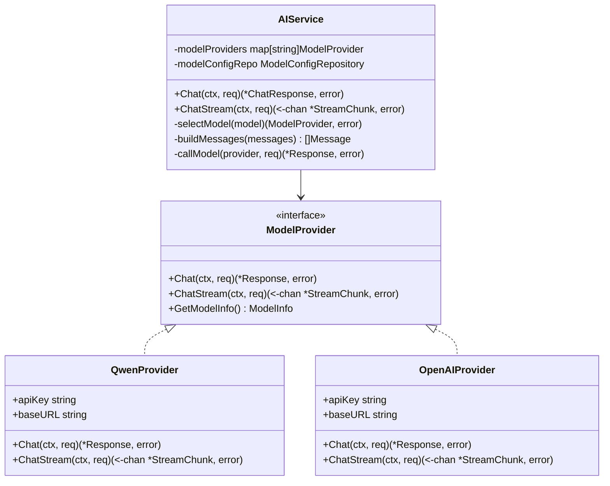
```mermaid
classDiagram
    class AIService {
        -modelProviders map[string]ModelProvider
        -modelConfigRepo ModelConfigRepository
        +Chat(ctx, req) (*ChatResponse, error)
        +ChatStream(ctx, req) (<-chan *StreamChunk, error)
        -selectModel(model) (ModelProvider, error)
        -buildMessages(messages) []Message
        -callModel(provider, req) (*Response, error)
    }

    class ModelProvider {
        <<interface>>
        +Chat(ctx, req) (*Response, error)
        +ChatStream(ctx, req) (<-chan *StreamChunk, error)
        +GetModelInfo() ModelInfo
    }

    class QwenProvider {
        +apiKey string
        +baseURL string
        +Chat(ctx, req) (*Response, error)
        +ChatStream(ctx, req) (<-chan *StreamChunk, error)
    }

    class OpenAIProvider {
        +apiKey string
        +baseURL string
        +Chat(ctx, req) (*Response, error)
        +ChatStream(ctx, req) (<-chan *StreamChunk, error)
    }

    AIService --> ModelProvider
    ModelProvider <|.. QwenProvider
    ModelProvider <|.. OpenAIProvider
```

#### 9.3.2 ModelProvider接口实现

```go
// ModelProvider AI模型提供者接口
type ModelProvider interface {
    // Chat 单次对话
    Chat(ctx context.Context, req *ChatRequest) (*ChatResponse, error)

    // ChatStream 流式对话
    ChatStream(ctx context.Context, req *ChatRequest) (<-chan *StreamChunk, error)

    // GetModelInfo 获取模型信息
    GetModelInfo() ModelInfo
}

// QwenProvider 通义千问提供者
type QwenProvider struct {
    apiKey    string
    baseURL   string
    client    *http.Client
}

func (p *QwenProvider) Chat(ctx context.Context, req *ChatRequest) (*ChatResponse, error) {
    // 构造请求
    payload := map[string]interface{}{
        "model":       req.Model,
        "messages":    req.Messages,
        "temperature": req.Temperature,
        "max_tokens":  req.MaxTokens,
    }

    body, _ := json.Marshal(payload)
    httpReq, _ := http.NewRequestWithContext(ctx, "POST", p.baseURL+"/chat/completions", bytes.NewReader(body))
    httpReq.Header.Set("Authorization", "Bearer "+p.apiKey)
    httpReq.Header.Set("Content-Type", "application/json")

    // 发送请求
    resp, err := p.client.Do(httpReq)
    if err != nil {
        return nil, err
    }
    defer resp.Body.Close()

    // 解析响应
    var result struct {
        Choices []struct {
            Message Message `json:"message"`
        } `json:"choices"`
        Usage struct {
            TotalTokens int `json:"total_tokens"`
        } `json:"usage"`
    }
    json.NewDecoder(resp.Body).Decode(&result)

    return &ChatResponse{
        Content: result.Choices[0].Message.Content,
        Usage: Usage{
            TotalTokens: result.Usage.TotalTokens,
        },
    }, nil
}

func (p *QwenProvider) ChatStream(ctx context.Context, req *ChatRequest) (<-chan *StreamChunk, error) {
    chunkChan := make(chan *StreamChunk)

    go func() {
        defer close(chunkChan)

        payload := map[string]interface{}{
            "model":       req.Model,
            "messages":    req.Messages,
            "temperature": req.Temperature,
            "max_tokens":  req.MaxTokens,
            "stream":      true,
        }

        body, _ := json.Marshal(payload)
        httpReq, _ := http.NewRequestWithContext(ctx, "POST", p.baseURL+"/chat/completions", bytes.NewReader(body))
        httpReq.Header.Set("Authorization", "Bearer "+p.apiKey)
        httpReq.Header.Set("Content-Type", "application/json")

        resp, err := p.client.Do(httpReq)
        if err != nil {
            chunkChan <- &StreamChunk{Error: err}
            return
        }
        defer resp.Body.Close()

        // 读取SSE流
        scanner := bufio.NewScanner(resp.Body)
        for scanner.Scan() {
            line := scanner.Text()
            if strings.HasPrefix(line, "data: ") {
                data := strings.TrimPrefix(line, "data: ")
                if data == "[DONE]" {
                    break
                }

                var chunk StreamChunk
                if err := json.Unmarshal([]byte(data), &chunk); err == nil {
                    chunkChan <- &chunk
                }
            }
        }
    }()

    return chunkChan, nil
}
```

#### 9.3.3 AIService实现

```go
type aiServiceImpl struct {
    modelProviders map[string]ModelProvider
    modelConfigRepo ModelConfigRepository
}

func (s *aiServiceImpl) ChatStream(ctx context.Context, req *ChatRequest) (<-chan *StreamChunk, error) {
    // 1. 选择模型提供者
    provider, err := s.selectModelProvider(req.Model)
    if err != nil {
        return nil, err
    }

    // 2. 调用提供者
    chunkChan, err := provider.ChatStream(ctx, req)
    if err != nil {
        return nil, err
    }

    // 3. 包装错误处理和超时控制
    wrappedChan := make(chan *StreamChunk)
    go func() {
        defer close(wrappedChan)

        timeout := time.NewTimer(5 * time.Minute)
        defer timeout.Stop()

        for {
            select {
            case chunk, ok := <-chunkChan:
                if !ok {
                    return
                }
                if chunk.Error != nil {
                    wrappedChan <- &StreamChunk{Error: chunk.Error}
                    return
                }
                wrappedChan <- chunk
            case <-timeout.C:
                wrappedChan <- &StreamChunk{Error: ErrTimeout}
                return
            case <-ctx.Done():
                return
            }
        }
    }()

    return wrappedChan, nil
}

func (s *aiServiceImpl) selectModelProvider(model string) (ModelProvider, error) {
    // 根据模型名称选择提供者
    if strings.HasPrefix(model, "qwen") {
        return s.modelProviders["qwen"], nil
    } else if strings.HasPrefix(model, "gpt") {
        return s.modelProviders["openai"], nil
    } else if strings.HasPrefix(model, "claude") {
        return s.modelProviders["anthropic"], nil
    }
    return nil, ErrModelNotSupported
}
```

### 9.4 时序图

#### 9.4.1 流式对话流程

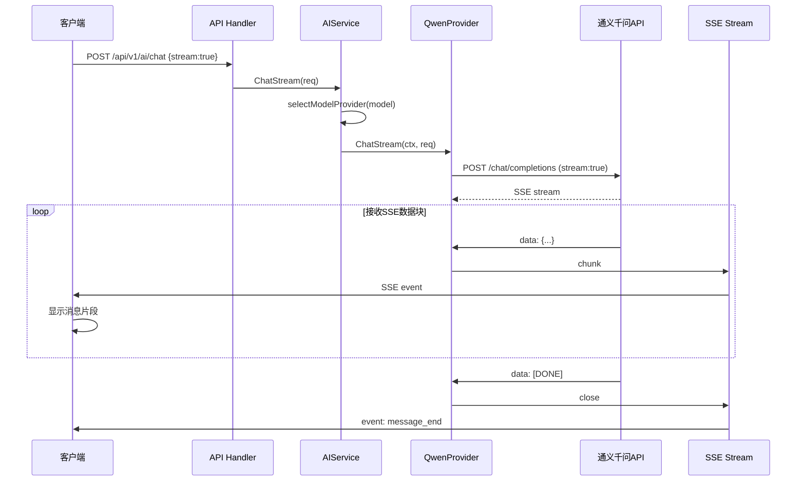
```mermaid
sequenceDiagram
    participant Client as 客户端
    participant API as API Handler
    participant AISvc as AIService
    participant Provider as QwenProvider
    participant QwenAPI as 通义千问API
    participant Stream as SSE Stream

    Client->>API: POST /api/v1/ai/chat {stream:true}
    API->>AISvc: ChatStream(req)

    AISvc->>AISvc: selectModelProvider(model)
    AISvc->>Provider: ChatStream(ctx, req)

    Provider->>QwenAPI: POST /chat/completions (stream:true)
    QwenAPI-->>Provider: SSE stream

    loop 接收SSE数据块
        QwenAPI->>Provider: data: {...}
        Provider->>Stream: chunk
        Stream->>Client: SSE event
        Client->>Client: 显示消息片段
    end

    QwenAPI->>Provider: data: [DONE]
    Provider->>Stream: close
    Stream->>Client: event: message_end
```

---

## 10. 附录

### 附录A: 术语表

| 术语 | 英文 | 解释 |
|------|------|------|
| 租户 | Tenant | SaaS系统中的企业客户实例 |
| 配额 | Quota | 租户可使用的资源上限 |
| 子域名 | Subdomain | 租户的访问域名,如 tenant.saas.com |
| Bot | Bot | AI智能体,对话机器人 |
| 知识库 | Knowledge Base | 企业知识文档库,用于RAG |
| 工作流 | Workflow | Bot的处理流程编排 |
| SSE | Server-Sent Events | 服务端推送技术,用于流式响应 |

### 附录B: 错误码表

| 错误码 | 说明 | HTTP状态码 |
|--------|------|-----------|
| 40001 | 参数校验失败 | 400 |
| 40002 | 子域名已存在 | 400 |
| 40003 | 企业名称已存在 | 400 |
| 40101 | 用户名或密码错误 | 401 |
| 40102 | Token无效或过期 | 401 |
| 40301 | 用户已被禁用 | 403 |
| 40302 | 权限不足 | 403 |
| 40401 | 资源不存在 | 404 |
| 40901 | Bot已发布 | 409 |
| 42901 | 配额已超限 | 429 |
| 50001 | 数据库错误 | 500 |
| 50002 | 内部服务错误 | 500 |

### 附录C: 数据库表命名规范

- 表名: 小写,下划线分隔,复数形式 (如 `tenants`, `bot_messages`)
- 主键: `{entity}_id` (如 `tenant_id`, `user_id`)
- 外键: `{referenced_entity}_id` (如 `tenant_id`, `role_id`)
- 时间戳: `created_at`, `updated_at`, `deleted_at` (软删除)
- 布尔值: `is_{feature}` (如 `is_active`)

---

**文档结束**

> 本详细设计说明书提供了租户管理、用户管理、Bot管理、对话管理等核心服务的完整接口设计、类设计和时序图,为开发团队提供直接的实施指导。后续服务的设计将按相同标准展开。
