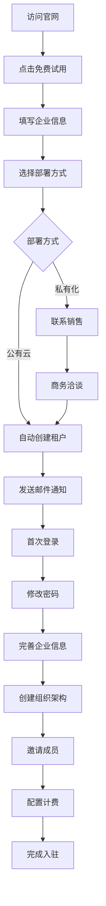
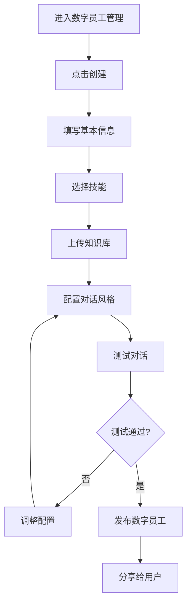
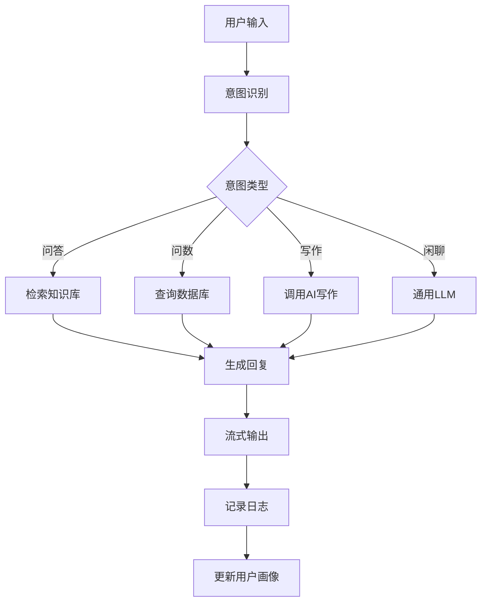

# zker Enterprise SaaS 系统 - 需求分析报告

> **文档编号**: RA-2025-002
> **项目名称**: zker Enterprise Edition - 企业级 Multi-Tenant SaaS 系统
> **文档版本**: v1.0
> **编写日期**: 2025-12-29
> **密级**: 内部公开

---

## 文档修订历史

| 版本 | 日期 | 作者 | 修订说明 |
|------|------|------|----------|
| v1.0 | 2025-12-29 | AI助手 | 初始版本 |

---

## 目录

1. [项目概述](#1-项目概述)
2. [用户分析](#2-用户分析)
3. [业务需求分析](#3-业务需求分析)
4. [功能需求分析](#4-功能需求分析)
5. [非功能需求](#5-非功能需求)
6. [系统约束](#6-系统约束)
7. [需求优先级](#7-需求优先级)
8. [需求验证标准](#8-需求验证标准)

---

## 1. 项目概述

### 1.1 项目背景

**zker Enterprise Edition** 是基于开源 zker 打造的企业级 Multi-Tenant SaaS 平台,旨在为中小企业提供与鲸智百应对等的 AI 智能体开发与运营能力。

#### 市场痛点

| 痛点 | 描述 | 影响 |
|------|------|------|
| **闭源不可定制** | 鲸智百应等商业产品闭源,企业无法深度定制 | 无法满足特殊业务需求 |
| **成本高昂** | Coze 商用版按使用量计费,大型企业年费数十万 | 中小企业负担不起 |
| **企业级能力弱** | 现有开源方案缺乏 Multi-Tenant SaaS 架构 | 无法服务多租户场景 |
| **数据安全担忧** | 政府、金融等行业要求数据完全可控 | 不敢采用SaaS方案 |

#### 解决方案

✅ **开源可定制** - 基于 zker,企业可深度定制
✅ **成本可控** - 私有化部署,无订阅费用
✅ **企业级能力** - Multi-Tenant SaaS 架构,租户完全隔离
✅ **数据完全掌控** - 支持私有化部署,数据完全自主

### 1.2 项目目标

#### 业务目标

```
短期目标 (1年):
  - 完成25个核心功能模块开发
  - 服务 50+ 企业客户
  - 收入达到 ¥200万+

中期目标 (3年):
  - 成为中国 Top 3 企业级 AI 平台
  - 服务 1000+ 企业
  - 年收入突破 ¥4600万

长期目标 (5年):
  - 年营收突破 10 亿元
  - 建立活跃开发者生态
  - 成为全球领先的企业级 AI 平台
```

#### 技术目标

```
架构目标:
  - Multi-Tenant SaaS 架构 (四层隔离)
  - 微服务架构 (DDD)
  - 云原生架构 (Kubernetes)

性能目标:
  - 系统可用性: 99.9% (年停机时间 < 8.76小时)
  - 响应时间: P95 < 2s, P99 < 5s
  - 并发能力: 支持 10,000+ 并发用户

质量目标:
  - 代码覆盖率: > 80%
  - Bug 密度: < 1个/千行代码
  - 安全漏洞: 0个高危漏洞
```

### 1.3 项目范围

#### 包含范围 (In-Scope)

**【百应前台】- 员工使用前台**
- ✅ 会话 (SuperChatbox)
- ✅ 问数 (ChatBI)
- ✅ 慧笔 (AI Writing)
- ✅ 发现 (Discovery)
- ✅ 待办 (Task Center)

**【百应企业后台管理】- 企业管理中台**
- ✅ 组织中心
- ✅ 数字员工管理
- ✅ 技能资源管理
- ✅ 知识资源管理
- ✅ 写作模板管理
- ✅ 数据看板

**【百应开发平台】- 开发扩展后台**
- ✅ 商店生态
- ✅ 开发工作台
- ✅ 运营管理
- ✅ 系统管理

**【五大AI引擎】**
- ✅ 智能路由引擎
- ✅ 人机协同引擎
- ✅ 记忆引擎
- ✅ 知识图谱引擎
- ✅ 插件调度引擎

**【Multi-Tenant SaaS核心】**
- ✅ 租户识别与管理
- ✅ 租户隔离机制
- ✅ 租户计费系统
- ✅ 租户监控运维
- ✅ 租户安全合规

#### 不包含范围 (Out-of-Scope)

- ❌ 移动端原生应用 (iOS/Android)
- ❌ 语音交互 (语音识别/语音合成)
- ❌ 视频生成与编辑
- ❌ 3D/AR/VR 能力
- ❌ 区块链相关功能
- ❌ 行业特定解决方案 (如医疗诊断)

---

## 2. 用户分析

### 2.1 用户角色定义

#### 2.1.1 企业管理员

**角色描述**: 企业的超级管理员,拥有所有权限

**用户画像**:
```
姓名: 王总
年龄: 35-50岁
职位: CTO / 信息总监 / 数字化转型负责人
技术能力: 中高级
核心诉求:
  - 快速部署上线
  - 数据完全可控
  - 成本可控
  - 合规安全
```

**主要任务**:
- 注册/注销企业租户
- 配置企业信息
- 管理组织架构
- 分配用户权限
- 查看数据看板
- 管理计费与订阅

**使用频率**: 每天 1-2 次

**痛点**:
- 担心数据安全
- 担心使用成本失控
- 担心合规问题
- 缺乏技术团队深度定制

#### 2.1.2 部门经理

**角色描述**: 部门负责人,管理部门内的数字员工和技能

**用户画像**:
```
姓名: 李经理
年龄: 30-45岁
职位: 部门经理 / 团队Leader
技术能力: 初中级
核心诉求:
  - 快速创建部门需要的数字员工
  - 配置部门专属知识库
  - 监控部门使用情况
```

**主要任务**:
- 创建部门数字员工
- 上传部门知识文档
- 配置数字员工技能
- 查看部门使用数据

**使用频率**: 每周 3-5 次

**痛点**:
- 不懂技术,不会配置
- 担心数字员工效果不好
- 需要快速响应业务需求

#### 2.1.3 普通员工

**角色描述**: 企业普通员工,数字员工的最终使用者

**用户画像**:
```
姓名: 小张
年龄: 25-35岁
职位: 业务专员 / 客服 / 销售
技术能力: 初级
核心诉求:
  - 数字员工好用
  - 响应快速准确
  - 界面简单易用
```

**主要任务**:
- 与数字员工对话 (会话)
- 向数字员工提问 (问数)
- 让数字员工写文案 (慧笔)
- 发现有用的数字员工 (发现)
- 处理待办任务 (待办)

**使用频率**: 每天 10+ 次

**痛点**:
- 数字员工理解能力差
- 响应太慢
- 经常答非所问
- 界面操作复杂

#### 2.1.4 开发者

**角色描述**: 负责开发和定制数字员工的技术人员

**用户画像**:
```
姓名: 开发小明
年龄: 25-35岁
职位: AI工程师 / 全栈开发
技术能力: 高级
核心诉求:
  - 开发工具完善
  - API文档完整
  - 调试方便
```

**主要任务**:
- 使用开发工作台创建Bot
- 配置Bot技能和知识库
- 编写自定义插件
- 测试和调试Bot
- 发布Bot到商店

**使用频率**: 每天 5+ 小时

**痛点**:
- 开发工具不够强大
- 调试困难
- 文档不完整
- 缺乏示例代码

#### 2.1.5 运营人员

**角色描述**: 负责平台运营和监控的人员

**用户画像**:
```
姓名: 运营小红
年龄: 25-35岁
职位: 产品运营 / 数据运营
技术能力: 中级
核心诉求:
  - 监控平台运行状态
  - 分析用户行为数据
  - 发现运营问题
```

**主要任务**:
- 监控系统运行状态
- 分析用户使用数据
- 发现热门Bot和技能
- 处理用户反馈

**使用频率**: 每天 2-3 小时

**痛点**:
- 缺乏数据分析工具
- 无法快速发现异常
- 缺乏用户行为洞察

### 2.2 用户场景分析

#### 场景1: 企业管理员快速部署

**背景**: 某中型企业决定引入AI数字员工,CTO王总负责快速部署上线

**用户**: 王总 (企业管理员)

**前置条件**:
- 企业已有AI应用需求
- 王总了解SaaS概念
- 有基本的技术能力

**主要流程**:
1. 访问平台官网,点击"免费试用"
2. 填写企业信息 (企业名称、联系人、电话)
3. 选择部署方式 (公有云 / 私有化部署)
4. 系统自动创建租户,初始化配置
5. 王总收到邮件,包含登录链接和初始密码
6. 首次登录,强制修改密码
7. 完善企业信息,上传Logo
8. 创建组织架构 (技术部、市场部、销售部等)
9. 邀请核心成员加入
10. 配置计费方案,绑定支付方式

**预期结果**:
- ✅ 30分钟内完成部署
- ✅ 系统可用,核心功能正常
- ✅ 数据完全隔离

**业务价值**:
- 快速上线,抢占市场
- 降低部署成本
- 提升用户体验

#### 场景2: 部门经理创建客服数字员工

**背景**: 市场部李经理需要创建一个客服Bot,解答客户常见问题

**用户**: 李经理 (部门经理)

**前置条件**:
- 已有平台账号
- 已创建部门组织
- 有客服知识文档

**主要流程**:
1. 登录企业管理中台
2. 进入"数字员工管理"
3. 点击"创建数字员工"
4. 填写基本信息:
   - 名称: "智能客服小助手"
   - 头像: 选择系统头像
   - 简介: "7x24小时在线,解答客户疑问"
5. 配置技能:
   - 选择"问答"技能
   - 选择"文档检索"技能
6. 上传知识库:
   - 上传"产品FAQ.pdf"
   - 上传"售后政策.docx"
   - 上传"价格表.xlsx"
7. 配置对话风格:
   - 语气: 亲切热情
   - 称呼: 用"您"
8. 测试对话:
   - 输入测试问题
   - 查看回复效果
   - 调整配置
9. 发布数字员工
10. 分享给团队成员使用

**预期结果**:
- ✅ 1小时内创建完成
- ✅ 数字员工可以回答80%常见问题
- ✅ 团队成员可以正常使用

**业务价值**:
- 减轻客服压力
- 提升客户满意度
- 降低人力成本

#### 场景3: 普通员工使用数字员工

**背景**: 销售小张需要快速了解某产品的详细信息,以便给客户介绍

**用户**: 小张 (普通员工)

**前置条件**:
- 已有平台账号
- 已有客服数字员工
- 有明确问题

**主要流程**:
1. 打开百应前台
2. 进入"会话"
3. 选择"智能客服小助手"
4. 输入问题: "XXX产品的核心卖点是什么?"
5. 数字员工回复:
   - 检索产品文档
   - 提炼核心卖点
   - 组织语言回复
6. 小张继续追问: "价格是多少?"
7. 数字员工回复价格信息
8. 小张继续追问: "有什么优惠政策?"
9. 数字员工回复优惠政策
10. 小张满意,结束对话

**预期结果**:
- ✅ 响应时间 < 3秒
- ✅ 回答准确率 > 90%
- ✅ 小张快速获取信息

**业务价值**:
- 提升员工工作效率
- 减少信息查找时间
- 提升客户服务质量

#### 场景4: 开发者开发自定义插件

**背景**: 开发小明需要开发一个"查询天气"的插件

**用户**: 开发小明 (开发者)

**前置条件**:
- 已有开发者账号
- 熟悉 JavaScript/TypeScript
- 有第三方天气API Key

**主要流程**:
1. 登录开发工作台
2. 进入"插件开发"
3. 点击"创建插件"
4. 填写基本信息:
   - 名称: "天气查询"
   - 描述: "查询城市天气"
   - 版本: "1.0.0"
5. 编写插件代码:
   ```typescript
   import { Plugin } from '@coze/plugin-sdk';

   export default class WeatherPlugin extends Plugin {
     async execute(params: { city: string }) {
       // 调用天气API
       const response = await fetch(
         `https://api.weather.com/v1/current?city=${params.city}&key=${this.apiKey}`
       );
       const data = await response.json();

       // 返回结果
       return {
         text: `${params.city}当前天气: ${data.weather}, 温度: ${data.temperature}°C`,
         data: data
       };
     }
   }
   ```
6. 配置插件参数:
   - 参数名: "city"
   - 参数类型: "string"
   - 必填: 是
7. 本地测试:
   - 输入测试参数
   - 查看执行结果
8. 调试优化:
   - 修复bug
   - 优化性能
9. 发布插件:
   - 填写更新日志
   - 提交审核
10. 审核通过后,插件上架商店

**预期结果**:
- ✅ 2-4小时开发完成
- ✅ 插件可以正常调用
- ✅ 插件上架供其他Bot使用

**业务价值**:
- 扩展平台能力
- 满足个性化需求
- 建设开发者生态

### 2.3 用户需求汇总

#### 企业管理员需求

| 需求ID | 需求描述 | 优先级 | 频率 |
|--------|---------|--------|------|
| RA-001 | 快速注册企业租户 (30分钟内) | P0 | 低 |
| RA-002 | 查看企业使用情况 (用户数、调用量、费用) | P0 | 高 |
| RA-003 | 管理组织架构 (增删改查部门) | P0 | 中 |
| RA-004 | 管理用户权限 (分配角色) | P0 | 高 |
| RA-005 | 配置计费方案 (查看账单、充值) | P0 | 中 |
| RA-006 | 数据导出 (用户数据、使用日志) | P1 | 低 |
| RA-007 | 系统设置 (Logo、主题、域名) | P1 | 低 |
| RA-008 | 安全设置 (IP白名单、SSO) | P1 | 低 |

#### 部门经理需求

| 需求ID | 需求描述 | 优先级 | 频率 |
|--------|---------|--------|------|
| RA-009 | 快速创建数字员工 (1小时内) | P0 | 高 |
| RA-010 | 上传知识文档 (PDF、Word、Excel) | P0 | 高 |
| RA-011 | 配置数字员工技能 | P0 | 中 |
| RA-012 | 测试数字员工 | P0 | 高 |
| RA-013 | 查看部门使用数据 | P1 | 中 |
| RA-014 | 管理部门成员 | P1 | 低 |

#### 普通员工需求

| 需求ID | 需求描述 | 优先级 | 频率 |
|--------|---------|--------|------|
| RA-015 | 与数字员工对话 (回复快速、准确) | P0 | 极高 |
| RA-016 | 向数字员工提问 (问数) | P0 | 高 |
| RA-017 | 让数字员工写文案 (慧笔) | P1 | 中 |
| RA-018 | 发现有用的数字员工 (发现) | P1 | 低 |
| RA-019 | 查看待办任务 (待办) | P1 | 中 |
| RA-020 | 多端访问 (PC、移动端浏览器) | P1 | 高 |

#### 开发者需求

| 需求ID | 需求描述 | 优先级 | 频率 |
|--------|---------|--------|------|
| RA-021 | 可视化开发工具 (拖拽式) | P0 | 高 |
| RA-022 | 代码开发工具 (支持TypeScript) | P0 | 极高 |
| RA-023 | 调试工具 (日志、断点) | P0 | 极高 |
| RA-024 | API文档完整 | P0 | 高 |
| RA-025 | 示例代码丰富 | P1 | 中 |
| RA-026 | 插件开发SDK | P0 | 高 |
| RA-027 | Webhook支持 | P1 | 中 |

#### 运营人员需求

| 需求ID | 需求描述 | 优先级 | 频率 |
|--------|---------|--------|------|
| RA-028 | 实时监控 (系统状态、错误率) | P0 | 高 |
| RA-029 | 数据分析 (用户行为、使用趋势) | P0 | 高 |
| RA-030 | 异常告警 (邮件、短信) | P0 | 中 |
| RA-031 | 热门Bot排行榜 | P1 | 低 |
| RA-032 | 用户反馈管理 | P1 | 中 |

---

## 3. 业务需求分析

### 3.1 业务流程分析

#### 3.1.1 企业入驻流程



**业务规则**:
- 企业名称必须唯一
- 邮箱必须验证
- 首次登录强制修改密码
- 组织架构最多支持5级
- 初始管理员拥有所有权限

**数据实体**:
- 企业 (tenant)
- 组织 (organization)
- 用户 (user)
- 角色 (role)
- 权限 (permission)

#### 3.1.2 数字员工创建流程



**业务规则**:
- Bot名称在同一租户下唯一
- 技能至少选择1个
- 知识库支持PDF/Word/Excel/Markdown
- 对话风格影响回复语气
- 发布后不能删除,只能下架

**数据实体**:
- Bot (bot)
- Bot技能 (bot_skill)
- 知识库 (knowledge_base)
- 知识文档 (knowledge_document)
- 对话日志 (conversation_log)

#### 3.1.3 对话流程



**业务规则**:
- 单次对话最长5分钟
- 单条消息最长2000字符
- 上下文记忆最近10轮
- 流式输出延迟<500ms
- 记录所有对话日志

**数据实体**:
- 会话 (conversation)
- 消息 (message)
- 意图 (intent)
- 实体 (entity)
- 用户画像 (user_profile)

### 3.2 业务规则分析

#### 租户管理规则

| 规则ID | 规则描述 | 约束 |
|--------|---------|------|
| BR-001 | 企业ID全局唯一 | VARCHAR(64),UUID |
| BR-002 | 企业名称全局唯一 | VARCHAR(255),UNIQUE |
| BR-003 | 子域名全局唯一 | VARCHAR(63),UNIQUE |
| BR-004 | 单租户最多100,000用户 | INT,MAX |
| BR-005 | 单租户最多10,000个Bot | INT,MAX |
| BR-006 | 免费试用14天 | DATE,DATEDIFF |
| BR-007 | 逾期7天暂停服务 | DATE,DATEDIFF |

#### 用户权限规则

| 规则ID | 规则描述 | 约束 |
|--------|---------|------|
| BR-008 | 单用户最多加入100个组织 | INT,MAX |
| BR-009 | 单组织最多10,000成员 | INT,MAX |
| BR-010 | 组织层级最多5级 | INT,MAX |
| BR-011 | 权限继承父级 | BOOLEAN |
| BR-012 | 超级管理员拥有所有权限 | - |

#### 数字员工规则

| 规则ID | 规则描述 | 约束 |
|--------|---------|------|
| BR-013 | Bot名称租户内唯一 | VARCHAR(255),UNIQUE |
| BR-014 | Bot至少配置1个技能 | INT,COUNT > 0 |
| BR-015 | Bot知识库最多1000个文档 | INT,MAX |
| BR-016 | 单个文档最大100MB | BIGINT,MAX |
| BR-017 | Bot发布后不可删除 | STATUS,ENUM |

#### 对话规则

| 规则ID | 规则描述 | 约束 |
|--------|---------|------|
| BR-018 | 单次对话最长5分钟 | BIGINT,TIMESTAMPDIFF |
| BR-019 | 单条消息最长2000字符 | VARCHAR(2000) |
| BR-020 | 上下文记忆最近10轮 | INT,MAX |
| BR-021 | 流式输出延迟<500ms | INT,< 500 |
| BR-022 | 每秒最多10条消息 | INT,MAX |

### 3.3 数据分析需求

#### 关键指标 (KPI)

| 指标类别 | 指标名称 | 计算公式 | 目标值 |
|---------|---------|---------|--------|
| **用户指标** | DAU | 日活跃用户数 | > 1000 |
| | MAU | 月活跃用户数 | > 5000 |
| | 留存率 | 次日留存/7日留存/30日留存 | > 40%/30%/20% |
| **使用指标** | 对话次数 | 日均对话次数 | > 10,000 |
| | 消息数 | 日均消息数 | > 100,000 |
| | 平均对话轮次 | 总消息数/总对话数 | > 5 |
| **质量指标** | 回复准确率 | 准确回复数/总回复数 | > 90% |
| | 回复满意度 | 用户评分平均分 | > 4.5/5.0 |
| | 问题解决率 | 问题解决数/总问题数 | > 80% |
| **性能指标** | 响应时间 | P95/P99响应时间 | < 2s/< 5s |
| | 系统可用性 | 正常时间/总时间 | > 99.9% |
| | 错误率 | 错误数/请求数 | < 1% |
| **商业指标** | ARPU | 总收入/用户数 | > ¥5,000/月 |
| | 付费转化率 | 付费用户数/总用户数 | > 20% |
| | 客户流失率 | 流失客户数/总客户数 | < 10% |

#### 数据采集需求

| 数据类型 | 采集内容 | 采集频率 | 存储时长 |
|---------|---------|---------|---------|
| **用户行为** | 页面访问、功能点击、停留时间 | 实时 | 180天 |
| **对话日志** | 用户输入、Bot回复、时间戳 | 实时 | 365天 |
| **系统日志** | API调用、错误日志、性能指标 | 实时 | 90天 |
| **审计日志** | 用户操作、权限变更、数据修改 | 实时 | 1095天 (3年) |
| **计费数据** | 资源使用量、费用明细 | 每小时 | 1095天 (3年) |

---

## 4. 功能需求分析

### 4.1 功能架构总览

```
zker Enterprise SaaS 系统
│
├─【百应前台】- 员工使用前台
│  ├─ 01-会话 (SuperChatbox)
│  ├─ 02-问数 (ChatBI)
│  ├─ 03-慧笔 (AI Writing)
│  ├─ 04-发现 (Discovery)
│  └─ 05-待办 (Task Center)
│
├─【百应企业后台管理】- 企业管理中台
│  ├─ 06-组织中心
│  ├─ 07-数字员工管理
│  ├─ 08-技能资源管理
│  ├─ 09-知识资源管理
│  ├─ 10-写作模板管理
│  └─ 11-数据看板
│
├─【百应开发平台】- 开发扩展后台
│  ├─ 12-商店生态
│  ├─ 13-开发工作台
│  ├─ 14-运营管理
│  └─ 15-系统管理
│
├─【五大AI引擎】
│  ├─ 16-智能路由引擎
│  ├─ 17-人机协同引擎
│  ├─ 18-记忆引擎
│  ├─ 19-知识图谱引擎
│  └─ 20-插件调度引擎
│
└─【Multi-Tenant SaaS核心】
   ├─ 21-租户识别与管理
   ├─ 22-租户隔离机制
   ├─ 23-租户计费系统
   ├─ 24-租户监控运维
   └─ 25-租户安全合规
```

### 4.2 百应前台功能需求

#### 4.2.1 会话 (SuperChatbox)

**功能描述**: 员工与数字员工进行对话的主要界面

**用户故事**:
```
作为一名普通员工
我希望能够与数字员工进行自然对话
以便快速获取信息和解决问题
```

**功能需求**:

| 需求ID | 需求名称 | 需求描述 | 优先级 | 验收标准 |
|--------|---------|---------|--------|----------|
| UC-001 | 对话界面 | 提供类似微信的对话界面 | P0 | 界面美观、操作流畅 |
| UC-002 | 流式输出 | Bot回复逐字显示 | P0 | 延迟<500ms |
| UC-003 | 上下文记忆 | 记住最近10轮对话 | P0 | 准确引用上文 |
| UC-004 | 多媒体支持 | 支持文本、图片、文件 | P0 | 文件<100MB |
| UC-005 | 快捷回复 | 提供常用问题快捷入口 | P1 | 减少80%重复输入 |
| UC-006 | 对话历史 | 查看历史对话记录 | P0 | 支持搜索、筛选 |
| UC-007 | 评分反馈 | 对Bot回复打分 | P1 | 采>率>60% |
| UC-008 | 多Bot切换 | 快速切换不同Bot | P0 | 切换<1s |
| UC-009 | 移动端适配 | 支持手机浏览器 | P1 | 响应式布局 |
| UC-010 | 消息通知 | 新消息弹窗通知 | P1 | 不打扰用户 |

**界面原型**:
```
┌─────────────────────────────────────┐
│  智能客服小助手        [设置] [帮助] │
├─────────────────────────────────────┤
│                                     │
│  👤 用户  今天天气怎么样?           │
│                                     │
│  🤖 Bot   北京今天晴天,温度15-25°C │
│                                     │
│  👤 用户  明天呢?                   │
│                                     │
│  🤖 Bot   明天多云,温度16-24°C     │
│                                     │
│  [快捷问题] [历史记录] [反馈]       │
│                                     │
├─────────────────────────────────────┤
│  输入消息...              [发送] 📎 │
└─────────────────────────────────────┘
```

#### 4.2.2 问数 (ChatBI)

**功能描述**: 用自然语言查询企业数据,生成可视化报表

**用户故事**:
```
作为一名业务人员
我希望能够用自然语言查询销售数据
以便快速生成报表,不需要学习SQL
```

**功能需求**:

| 需求ID | 需求名称 | 需求描述 | 优先级 | 验收标准 |
|--------|---------|---------|--------|----------|
| UC-011 | 自然语言查询 | 支持中文查询 | P0 | 准确率>90% |
| UC-012 | 数据源连接 | 支持MySQL、Excel等 | P0 | 支持5种数据源 |
| UC-013 | 图表生成 | 自动生成图表 | P0 | 支持10种图表 |
| UC-014 | 数据导出 | 导出Excel、PDF | P1 | 格式正确 |
| UC-015 | 查询历史 | 保存常用查询 | P1 | 一键复用 |
| UC-016 | 权限控制 | 按部门控制数据可见性 | P0 | 数据隔离 |
| UC-017 | 实时数据 | 支持实时数据查询 | P2 | 延迟<5s |

**查询示例**:
```
用户: "上个月销售额是多少?"
Bot: "上个月销售额为 ¥1,234,567,同比增长 15%"

用户: "按地区统计Top5销售额"
Bot: [生成柱状图]

用户: "导出Excel"
Bot: [下载文件]
```

#### 4.2.3 慧笔 (AI Writing)

**功能描述**: AI辅助文案写作,支持多种场景模板

**用户故事**:
```
作为一名市场营销人员
我希望AI能帮我快速生成营销文案
以便提升工作效率
```

**功能需求**:

| 需求ID | 需求名称 | 需求描述 | 优先级 | 验收标准 |
|--------|---------|---------|--------|----------|
| UC-018 | 写作模板 | 提供多种场景模板 | P0 | 至少20个模板 |
| UC-019 | 一键生成 | 输入关键词生成文案 | P0 | 生成时间<10s |
| UC-020 | 多风格支持 | 正式、活泼、幽默等 | P1 | 风格差异明显 |
| UC-021 | 多语言支持 | 中英日韩等语言 | P2 | 支持5种语言 |
| UC-022 | 文案润色 | 优化已有文案 | P1 | 提升可读性 |
| UC-023 | 版本对比 | 对比不同版本差异 | P2 | 清晰展示 |
| UC-024 | 历史记录 | 保存历史版本 | P1 | 支持回溯 |

**模板示例**:
- 产品介绍文案
- 活动宣传文案
- 邮件回复文案
- 社交媒体文案
- 新闻稿文案

#### 4.2.4 发现 (Discovery)

**功能描述**: 发现和浏览平台上的热门Bot

**用户故事**:
```
作为一名新用户
我希望能够发现有价值的Bot
以便快速提升工作效率
```

**功能需求**:

| 需求ID | 需求名称 | 需求描述 | 优先级 | 验收标准 |
|--------|---------|---------|--------|----------|
| UC-025 | Bot分类 | 按行业、功能分类 | P0 | 分类清晰 |
| UC-026 | 热门排行 | 展示热门Bot | P0 | 排序准确 |
| UC-027 | 搜索Bot | 按名称、标签搜索 | P0 | 搜索<1s |
| UC-028 | Bot详情 | 查看Bot介绍、评价 | P0 | 信息完整 |
| UC-029 | 一键试用 | 快速试用Bot | P0 | 即时可用 |
| UC-030 | 收藏Bot | 收藏常用Bot | P1 | 方便访问 |
| UC-031 | Bot评价 | 对Bot进行评价 | P2 | 评价真实 |

#### 4.2.5 待办 (Task Center)

**功能描述**: 管理个人和团队的待办任务

**用户故事**:
```
作为一名项目经理
我希望能够管理项目待办事项
以便确保项目按时完成
```

**功能需求**:

| 需求ID | 需求名称 | 需求描述 | 优先级 | 验收标准 |
|--------|---------|---------|--------|----------|
| UC-032 | 创建任务 | 创建个人/团队任务 | P0 | 操作流畅 |
| UC-033 | 任务优先级 | 设置任务优先级 | P0 | 支持5个级别 |
| UC-034 | 任务截止日期 | 设置任务截止时间 | P0 | 支持提醒 |
| UC-035 | 任务分配 | 分配任务给团队成员 | P0 | 通知到位 |
| UC-036 | 任务进度 | 跟踪任务进度 | P0 | 实时更新 |
| UC-037 | 任务提醒 | 任务到期前提醒 | P1 | 多渠道提醒 |
| UC-038 | 任务统计 | 任务完成情况统计 | P2 | 数据可视化 |

### 4.3 企业管理中台功能需求

#### 4.3.1 组织中心

**功能描述**: 管理企业的组织架构、成员和权限

**功能需求**:

| 需求ID | 需求名称 | 需求描述 | 优先级 | 验收标准 |
|--------|---------|---------|--------|----------|
| EM-001 | 组织树管理 | 可视化组织树 | P0 | 操作直观 |
| EM-002 | 部门增删改 | 管理部门信息 | P0 | 最多5级 |
| EM-003 | 岗位管理 | 定义岗位和能力要求 | P1 | 岗位库丰富 |
| EM-004 | 成员管理 | 添加、移除成员 | P0 | 批量操作 |
| EM-005 | 角色管理 | 自定义角色 | P0 | 灵活配置 |
| EM-006 | 权限管理 | 细粒度权限控制 | P0 | RBAC模型 |
| EM-007 | 批量导入 | Excel批量导入成员 | P1 | 导入准确 |
| EM-008 | 组织图 | 自动生成组织图 | P2 | 图形美观 |

#### 4.3.2 数字员工管理

**功能描述**: 管理企业的所有数字员工

**功能需求**:

| 需求ID | 需求名称 | 需求描述 | 优先级 | 验收标准 |
|--------|---------|---------|--------|----------|
| EM-009 | 创建Bot | 向导式创建Bot | P0 | 1小时完成 |
| EM-010 | Bot列表 | 查看所有Bot | P0 | 支持筛选 |
| EM-011 | Bot编辑 | 修改Bot配置 | P0 | 实时生效 |
| EM-012 | Bot发布/下架 | 控制Bot可用性 | P0 | 即时生效 |
| EM-013 | Bot统计 | 查看Bot使用数据 | P1 | 数据完整 |
| EM-014 | Bot复制 | 快速复制Bot | P1 | 一键复制 |
| EM-015 | Bot分组 | 对Bot分组管理 | P2 | 方便管理 |

#### 4.3.3 技能资源管理

**功能描述**: 管理和复用Bot技能

**功能需求**:

| 需求ID | 需求名称 | 需求描述 | 优先级 | 验收标准 |
|--------|---------|---------|--------|----------|
| EM-016 | 技能商店 | 浏览和安装技能 | P0 | 技能丰富 |
| EM-017 | 自定义技能 | 开发自定义技能 | P0 | 灵活扩展 |
| EM-018 | 技能配置 | 配置技能参数 | P0 | 参数丰富 |
| EM-019 | 技能测试 | 测试技能效果 | P1 | 调试方便 |
| EM-020 | 技能版本 | 管理技能版本 | P2 | 版本回滚 |

#### 4.3.4 知识资源管理

**功能描述**: 管理企业知识库

**功能需求**:

| 需求ID | 需求名称 | 需求描述 | 优先级 | 验收标准 |
|--------|---------|---------|--------|----------|
| EM-021 | 上传文档 | 上传知识文档 | P0 | 支持多格式 |
| EM-022 | 文档解析 | 自动解析文档内容 | P0 | 准确率>95% |
| EM-023 | 知识问答 | 基于知识库问答 | P0 | 准确率>90% |
| EM-024 | 知识图谱 | 可视化知识关系 | P2 | 图形美观 |
| EM-025 | 知识更新 | 更新知识内容 | P1 | 实时生效 |
| EM-026 | 权限控制 | 按部门控制知识可见性 | P0 | 数据隔离 |

#### 4.3.5 数据看板

**功能描述**: 展示企业使用数据和统计

**功能需求**:

| 需求ID | 需求名称 | 需求描述 | 优先级 | 验收标准 |
|--------|---------|---------|--------|----------|
| EM-027 | 用户统计 | 活跃用户、新增用户 | P0 | 数据准确 |
| EM-028 | 使用统计 | 对话次数、消息数 | P0 | 数据准确 |
| EM-029 | 质量统计 | 准确率、满意度 | P0 | 数据准确 |
| EM-030 | Bot排行 | 热门Bot排行 | P1 | 排序准确 |
| EM-031 | 导出报表 | 导出统计报表 | P1 | 格式正确 |
| EM-032 | 自定义看板 | 自定义看板布局 | P2 | 灵活配置 |

### 4.4 开发平台功能需求

#### 4.4.1 开发工作台

**功能描述**: 可视化+代码双模式开发Bot

**功能需求**:

| 需求ID | 需求名称 | 需求描述 | 优先级 | 验收标准 |
|--------|---------|---------|--------|----------|
| DP-001 | 可视化开发 | 拖拽式流程图 | P0 | 操作流畅 |
| DP-002 | 代码开发 | 支持TypeScript | P0 | 代码提示完整 |
| DP-003 | 在线调试 | 在线测试Bot | P0 | 调试方便 |
| DP-004 | 日志查看 | 查看运行日志 | P0 | 日志详细 |
| DP-005 | 版本管理 | 管理Bot版本 | P1 | 版本回滚 |
| DP-006 | 协作开发 | 多人协作 | P2 | 冲突处理 |

#### 4.4.2 商店生态

**功能描述**: Bot和插件商店

**功能需求**:

| 需求ID | 需求名称 | 需求描述 | 优先级 | 验收标准 |
|--------|---------|---------|--------|----------|
| DP-007 | Bot商店 | 浏览和安装Bot | P0 | 内容丰富 |
| DP-008 | 插件商店 | 浏览和安装插件 | P0 | 内容丰富 |
| DP-009 | 发布Bot | 发布Bot到商店 | P0 | 流程简单 |
| DP-010 | 发布插件 | 发布插件到商店 | P0 | 流程简单 |
| DP-011 | 评价评论 | 对Bot/插件评价 | P1 | 评价真实 |

### 4.5 AI引擎功能需求

#### 4.5.1 智能路由引擎

**功能描述**: 智能路由用户请求到合适的Bot

**功能需求**:

| 需求ID | 需求名称 | 需求描述 | 优先级 | 验收标准 |
|--------|---------|---------|--------|----------|
| AE-001 | 意图识别 | 识别用户意图 | P0 | 准确率>95% |
| AE-002 | 实体提取 | 提取关键实体 | P0 | 准确率>90% |
| AE-003 | Bot匹配 | 匹配最合适的Bot | P0 | 匹配时间<200ms |
| AE-004 | 负载均衡 | Bot负载均衡 | P0 | 响应时间<2s |
| AE-005 | 学习优化 | 根据反馈优化 | P1 | 持续优化 |

#### 4.5.2 人机协同引擎

**功能描述**: 人机协同处理复杂任务

**功能需求**:

| 需求ID | 需求名称 | 需求描述 | 优先级 | 验收标准 |
|--------|---------|---------|--------|----------|
| AE-006 | 任务拆解 | 拆解复杂任务 | P0 | 拆解合理 |
| AE-007 | 人工审核 | AI不确定时转人工 | P0 | 转接准确 |
| AE-008 | 人工接管 | 人工可随时接管 | P0 | 接管流畅 |
| AE-009 | 学习标注 | 人工处理结果学习 | P1 | 持续学习 |

#### 4.5.3 记忆引擎

**功能描述**: 记住用户和对话历史

**功能需求**:

| 需求ID | 需求名称 | 需求描述 | 优先级 | 验收标准 |
|--------|---------|---------|--------|----------|
| AE-010 | 对话记忆 | 记住最近10轮对话 | P0 | 准确引用 |
| AE-011 | 用户画像 | 记住用户偏好 | P0 | 更新及时 |
| AE-012 | 长期记忆 | 记住重要信息 | P1 | 持久化存储 |
| AE-013 | 记忆检索 | 快速检索记忆 | P0 | 检索<100ms |

#### 4.5.4 知识图谱引擎

**功能描述**: 构建和应用企业知识图谱

**功能需求**:

| 需求ID | 需求名称 | 需求描述 | 优先级 | 验收标准 |
|--------|---------|---------|--------|----------|
| AE-014 | 知识抽取 | 从文档抽取知识 | P0 | 准确率>85% |
| AE-015 | 图谱构建 | 构建知识图谱 | P0 | 关系准确 |
| AE-016 | 知识推理 | 基于图谱推理 | P1 | 推理合理 |
| AE-017 | 图谱可视化 | 可视化知识图谱 | P2 | 图形美观 |

#### 4.5.5 插件调度引擎

**功能描述**: 调度和执行插件

**功能需求**:

| 需求ID | 需求名称 | 需求描述 | 优先级 | 验收标准 |
|--------|---------|---------|--------|----------|
| AE-018 | 插件注册 | 注册插件 | P0 | 注册简单 |
| AE-019 | 插件调用 | 调用插件 | P0 | 调用<500ms |
| AE-020 | 插件编排 | 编排多个插件 | P1 | 编排灵活 |
| AE-021 | 插件监控 | 监控插件健康 | P1 | 实时监控 |
| AE-022 | 插件熔断 | 插件故障熔断 | P0 | 熔断及时 |

### 4.6 Multi-Tenant SaaS核心功能需求

#### 4.6.1 租户识别与管理

**功能需求**:

| 需求ID | 需求名称 | 需求描述 | 优先级 | 验收标准 |
|--------|---------|---------|--------|----------|
| MT-001 | 租户注册 | 注册新租户 | P0 | 30分钟完成 |
| MT-002 | 租户识别 | 识别租户ID | P0 | 准确率100% |
| MT-003 | 子域名 | 租户子域名 | P1 | 唯一性保证 |
| MT-004 | 租户信息 | 管理租户信息 | P0 | 信息完整 |
| MT-005 | 租户状态 | 管理租户状态 | P0 | 状态准确 |

#### 4.6.2 租户隔离机制

**功能需求**:

| 需求ID | 需求名称 | 需求描述 | 优先级 | 验收标准 |
|--------|---------|---------|--------|----------|
| MT-006 | 数据隔离 | 租户数据完全隔离 | P0 | 100%隔离 |
| MT-007 | 计算隔离 | 租户计算资源隔离 | P0 | 性能互不影响 |
| MT-008 | 缓存隔离 | 租户缓存隔离 | P0 | 缓存独立 |
| MT-009 | 存储隔离 | 租户存储隔离 | P0 | 存储独立 |
| MT-010 | 隔离策略 | 动态选择隔离策略 | P1 | 策略合理 |

#### 4.6.3 租户计费系统

**功能需求**:

| 需求ID | 需求名称 | 需求描述 | 优先级 | 验收标准 |
|--------|---------|---------|--------|----------|
| MT-011 | 计费方案 | 多种计费方案 | P0 | 方案灵活 |
| MT-012 | 使用计量 | 计量资源使用 | P0 | 计量准确 |
| MT-013 | 账单生成 | 生成月度账单 | P0 | 账单准确 |
| MT-014 | 在线支付 | 支持在线支付 | P0 | 支付流畅 |
| MT-015 | 费用预警 | 费用超限预警 | P1 | 预警及时 |

#### 4.6.4 租户监控运维

**功能需求**:

| 需求ID | 需求名称 | 需求描述 | 优先级 | 验收标准 |
|--------|---------|---------|--------|----------|
| MT-016 | 系统监控 | 监控系统指标 | P0 | 实时监控 |
| MT-017 | 租户监控 | 监控租户指标 | P0 | 实时监控 |
| MT-018 | 告警通知 | 异常告警 | P0 | 告警及时 |
| MT-019 | 日志查询 | 查询日志 | P1 | 查询方便 |
| MT-020 | 性能分析 | 性能分析报告 | P2 | 分析深入 |

#### 4.6.5 租户安全合规

**功能需求**:

| 需求ID | 需求名称 | 需求描述 | 优先级 | 验收标准 |
|--------|---------|---------|--------|----------|
| MT-021 | 认证授权 | 强认证 + RBAC | P0 | 安全可靠 |
| MT-022 | 数据加密 | 数据传输存储加密 | P0 | 加密强度高 |
| MT-023 | 审计日志 | 完整审计日志 | P0 | 日志完整 |
| MT-024 | 合规认证 | 等保三级、GDPR | P1 | 符合法规 |
| MT-025 | 安全扫描 | 定期安全扫描 | P1 | 发现漏洞 |

---

## 5. 非功能需求

### 5.1 性能需求

#### 5.1.1 响应时间

| 场景 | 指标 | 目标值 | 测量方法 |
|------|------|--------|----------|
| **页面加载** | 首屏加载时间 | < 2s | Lighthouse |
| | 完全加载时间 | < 5s | Lighthouse |
| **API调用** | P50响应时间 | < 500ms | APM |
| | P95响应时间 | < 2s | APM |
| | P99响应时间 | < 5s | APM |
| **对话响应** | 首字延迟 | < 500ms | 时间戳 |
| | 完整响应时间 | < 3s | 时间戳 |
| **搜索查询** | 搜索响应时间 | < 1s | Elasticsearch |
| **数据导出** | 小数据量 (<1000条) | < 5s | 计时器 |
| | 大数据量 (>10000条) | < 30s | 计时器 |

#### 5.1.2 吞吐量

| 场景 | 指标 | 目标值 | 测量方法 |
|------|------|--------|----------|
| **并发用户** | 在线用户数 | > 10,000 | 在线计数 |
| | 并发对话数 | > 1,000 | 并发计数 |
| **API调用** | QPS | > 10,000 | Nginx日志 |
| | RPS | > 5,000 | Nginx日志 |
| **消息处理** | 消息吞吐量 | > 100,000条/分钟 | 消息队列 |

#### 5.1.3 并发能力

| 资源类型 | 配置 | 目标并发数 | 扩展方式 |
|---------|------|-----------|---------|
| **数据库连接** | MySQL 8C32G | > 10,000 | 连接池 |
| **缓存连接** | Redis 16G | > 50,000 | 连接池 |
| **HTTP连接** | Nginx 8C16G | > 100,000 | Keep-alive |
| **WebSocket** | Node.js 8C16G | > 10,000 | 集群 |

### 5.2 可靠性需求

#### 5.2.1 可用性

| 指标 | 目标值 | 计算方法 |
|------|--------|----------|
| **系统可用性** | > 99.9% | (总时间-停机时间)/总时间 |
| **年停机时间** | < 8.76小时 | 365天×24小时×0.1% |
| **月停机时间** | < 43.2分钟 | 30天×24小时×0.1% |
| **日停机时间** | < 1.44分钟 | 24小时×0.1% |

#### 5.2.2 容错能力

| 故障类型 | 检测时间 | 恢复时间 | 影响 |
|---------|---------|---------|------|
| **服务器宕机** | < 30s | < 5min | 无影响 (自动切换) |
| **数据库故障** | < 10s | < 1min | 降级服务 |
| **网络故障** | < 5s | < 30s | 请求重试 |
| **服务过载** | 实时 | 自动扩容 | 性能下降 |

#### 5.2.3 数据一致性

| 数据类型 | 一致性要求 | 实现方式 |
|---------|-----------|---------|
| **用户数据** | 强一致性 | 数据库事务 |
| **对话记录** | 最终一致性 | 消息队列 + 异步写入 |
| **统计数据** | 最终一致性 | 定时计算 |
| **缓存数据** | 最终一致性 | TTL + 主动更新 |

### 5.3 安全性需求

#### 5.3.1 认证与授权

| 需求 | 描述 | 实现 |
|------|------|------|
| **强认证** | 支持密码+MFA | JWT + TOTP |
| **单点登录** | 支持企业SSO | SAML 2.0 / OIDC |
| **权限控制** | RBAC模型 | Casbin |
| **会话管理** | 会话超时、单点登出 | Redis + JWT |

#### 5.3.2 数据安全

| 需求 | 描述 | 实现 |
|------|------|------|
| **传输加密** | HTTPS/TLS 1.3 | Nginx + Let's Encrypt |
| **存储加密** | AES-256 | 数据库透明加密 |
| **敏感数据脱敏** | 手机号、身份证脱敏 | 应用层脱敏 |
| **备份加密** | 备份文件加密 | GPG加密 |

#### 5.3.3 审计与合规

| 需求 | 描述 | 实现 |
|------|------|------|
| **审计日志** | 记录所有操作 | Elasticsearch + Kibana |
| **日志留存** | 3年 | 归档存储 |
| **等保三级** | 满足等保三级要求 | 定期测评 |
| **GDPR** | 支持GDPR | 数据删除、导出API |

### 5.4 可扩展性需求

#### 5.4.1 水平扩展

| 组件 | 扩展方式 | 扩展上限 |
|------|---------|---------|
| **应用服务器** | Kubernetes HPA | 无限制 |
| **数据库** | 读写分离 + 分库分表 | 100个分片 |
| **缓存** | Redis Cluster | 1000个节点 |
| **消息队列** | NSQ集群 | 无限制 |
| **存储** | MinIO分布式 | 无限制 |

#### 5.4.2 垂直扩展

| 资源 | 最小配置 | 推荐配置 | 最大配置 |
|------|---------|---------|---------|
| **应用服务器** | 4C8G | 8C16G | 32C64G |
| **数据库** | 8C32G | 16C64G | 64C256G |
| **缓存** | 8G | 32G | 256G |
| **存储** | 1TB | 10TB | 1PB |

### 5.5 可维护性需求

#### 5.5.1 代码质量

| 指标 | 目标值 | 测量工具 |
|------|--------|----------|
| **代码覆盖率** | > 80% | Vitest / Go test |
| **代码复杂度** | < 15 | SonarQube |
| **代码重复率** | < 5% | SonarQube |
| **Bug密度** | < 1个/千行 | JIRA |

#### 5.5.2 文档完整性

| 文档类型 | 完整性要求 |
|---------|-----------|
| **API文档** | 100% API有文档 |
| **代码注释** | 公开API必须有注释 |
| **架构文档** | 主要模块有架构文档 |
| **运维文档** | 所有运维操作有文档 |

#### 5.5.3 监控与告警

| 监控项 | 阈值 | 告警方式 |
|--------|------|----------|
| **系统可用性** | < 99% | 邮件 + 短信 |
| **响应时间** | P95 > 5s | 邮件 |
| **错误率** | > 1% | 邮件 |
| **资源使用率** | CPU > 80% | 邮件 |
| **磁盘空间** | < 20% | 邮件 + 短信 |

### 5.6 兼容性需求

#### 5.6.1 浏览器兼容

| 浏览器 | 最低版本 | 备注 |
|--------|---------|------|
| **Chrome** | >= 90 | 推荐 |
| **Edge** | >= 90 | 推荐 |
| **Firefox** | >= 88 | 支持 |
| **Safari** | >= 14 | 支持 |
| **IE** | 不支持 | - |

#### 5.6.2 移动端兼容

| 设备类型 | 最低要求 |
|---------|---------|
| **iOS** | iOS 14+ |
| **Android** | Android 10+ |
| **屏幕尺寸** | >= 375px宽度 |

#### 5.6.3 数据库兼容

| 数据库 | 版本 | 备注 |
|--------|------|------|
| **MySQL** | >= 8.0 | 推荐8.4 |
| **PostgreSQL** | >= 13 | 支持 |
| **Oracle** | - | 暂不支持 |

### 5.7 易用性需求

#### 5.7.1 界面设计

| 需求 | 描述 |
|------|------|
| **一致性** | 所有页面风格统一 |
| **简洁性** | 界面简洁,突出重点 |
| **响应式** | 适配不同屏幕尺寸 |
| **无障碍** | 支持键盘导航、屏幕阅读器 |

#### 5.7.2 操作流程

| 需求 | 描述 |
|------|------|
| **新手引导** | 首次使用提供引导 |
| **操作提示** | 关键操作提供提示 |
| **错误提示** | 友好的错误提示 |
| **撤销重做** | 支持常用操作撤销 |

---

## 6. 系统约束

### 6.1 技术约束

#### 6.1.1 必须使用的技术

| 技术 | 版本 | 原因 |
|------|------|------|
| **Go** | 1.23 | zker后端语言 |
| **React** | 18.x | zker前端框架 |
| **TypeScript** | 5.x | 类型安全 |
| **MySQL** | 8.4 | 主数据库 |
| **Redis** | 8.0 | 缓存 |
| **Kubernetes** | 最新 | 容器编排 |

#### 6.1.2 不允许使用的技术

| 技术 | 原因 |
|------|------|
| **Angular** | 与React技术栈冲突 |
| **jQuery** | 过时,不支持 |
| **MongoDB** | 不符合关系型需求 |
| **.NET** | 与Go技术栈冲突 |

### 6.2 业务约束

#### 6.2.1 必须满足的业务规则

| 规则 | 描述 |
|------|------|
| **租户隔离** | 租户数据100%隔离 |
| **数据主权** | 企业拥有数据所有权 |
| **合规要求** | 满足等保三级、GDPR |
| **SLA保障** | 99.9%可用性 |

#### 6.2.2 业务限制

| 限制 | 值 | 原因 |
|------|------|------|
| **免费试用时长** | 14天 | 商业策略 |
| **单租户最大用户数** | 100,000 | 性能考虑 |
| **单租户最大Bot数** | 10,000 | 性能考虑 |
| **单次对话时长** | 5分钟 | 成本控制 |

### 6.3 法律法规约束

| 法规 | 要求 | 应对 |
|------|------|------|
| **等保三级** | 系统安全 | 定期测评 |
| **GDPR** | 数据保护 | 数据删除、导出API |
| **网络安全法** | 数据安全 | 数据加密、访问控制 |
| **个人信息保护法** | 隐私保护 | 隐私政策、同意机制 |

### 6.4 资源约束

#### 6.4.1 开发资源

| 资源 | 约束 |
|------|------|
| **开发周期** | 12个月 |
| **团队规模** | 14人 |
| **预算** | ¥586万 (第一年) |

#### 6.4.2 运行资源

| 资源 | 初始配置 | 扩展上限 |
|------|---------|---------|
| **服务器** | 10台 × 8C32G | 无限制 |
| **存储** | 10TB | 1PB |
| **带宽** | 100Mbps | 10Gbps |

---

## 7. 需求优先级

### 7.1 优先级定义

| 级别 | 定义 | 示例 |
|------|------|------|
| **P0** |必须有,否则系统无法使用 | 租户隔离、用户登录、对话功能 |
| **P1** | 应该有,显著影响用户体验 | 移动端适配、数据导出、快捷操作 |
| **P2** | 可以有,锦上添花 | 主题定制、高级搜索、数据分析 |

### 7.2 MoSCoW方法

| 类别 | 比例 | 说明 |
|------|------|------|
| **Must have (必须有)** | 60% | P0需求,系统核心功能 |
| **Should have (应该有)** | 30% | P1需求,重要但非紧急 |
| **Could have (可以有)** | 10% | P2需求,有时间再做 |
| **Won't have (这次不做)** | - | 明确不做的需求 |

### 7.3 分阶段实施

#### 第一阶段 (MVP) - 3个月

**目标**: 完成核心功能,可试用

**包含需求**:
- ✅ 租户识别与管理 (MT-001, MT-002, MT-004, MT-005)
- ✅ 租户隔离机制 (MT-006, MT-007, MT-008, MT-009)
- ✅ 组织中心 (EM-001, EM-002, EM-004, EM-005, EM-006)
- ✅ 数字员工管理 (EM-009, EM-010, EM-011)
- ✅ 会话 (UC-001, UC-002, UC-003, UC-006, UC-008)
- ✅ 智能路由引擎 (AE-001, AE-002, AE-003)

**不包含需求**:
- ❌ 商店生态 (DP-007, DP-008, DP-009, DP-010, DP-011)
- ❌ 知识图谱引擎 (AE-014, AE-015, AE-016, AE-017)
- ❌ 高级数据分析 (EM-032)

#### 第二阶段 (完善) - 3个月

**目标**: 完善功能,提升体验

**包含需求**:
- ✅ 问数 (UC-011, UC-012, UC-013, UC-016)
- ✅ 慧笔 (UC-018, UC-019, UC-020, UC-022)
- ✅ 发现 (UC-025, UC-026, UC-027, UC-028, UC-029)
- ✅ 技能资源管理 (EM-016, EM-017, EM-018)
- ✅ 知识资源管理 (EM-021, EM-022, EM-023, EM-026)
- ✅ 人机协同引擎 (AE-006, AE-007, AE-008)
- ✅ 记忆引擎 (AE-010, AE-011, AE-012)
- ✅ 开发工作台 (DP-001, DP-002, DP-003, DP-004)

#### 第三阶段 (优化) - 6个月

**目标**: 优化性能,建立生态

**包含需求**:
- ✅ 待办 (UC-032, UC-033, UC-034, UC-035, UC-036)
- ✅ 写作模板管理 (EM-024)
- ✅ 数据看板 (EM-027, EM-028, EM-029, EM-030, EM-031)
- ✅ 商店生态 (DP-007, DP-008, DP-009, DP-010, DP-011)
- ✅ 知识图谱引擎 (AE-014, AE-015, AE-016, AE-017)
- ✅ 插件调度引擎 (AE-018, AE-019, AE-020, AE-021, AE-022)
- ✅ 租户计费系统 (MT-011, MT-012, MT-013, MT-014, MT-015)
- ✅ 租户监控运维 (MT-016, MT-017, MT-018, MT-019, MT-020)
- ✅ 租户安全合规 (MT-021, MT-022, MT-023, MT-024, MT-025)

---

## 8. 需求验证标准

### 8.1 验收测试

#### 8.1.1 单元测试

**覆盖率要求**:
- Level 1 包: > 80%
- Level 2 包: > 30%
- Level 3-4 包: > 0%

**测试示例**:
```typescript
describe('TenantIdentificationMiddleware', () => {
  it('should extract tenant ID from subdomain', () => {
    const middleware = new TenantIdentificationMiddleware();
    const ctx = { host: 'tenant-a.saas.coze.com' };
    const tenantID = middleware.extractFromSubdomain(ctx.host);
    expect(tenantID).toBe('tenant-a');
  });

  it('should return null if no subdomain', () => {
    const middleware = new TenantIdentificationMiddleware();
    const ctx = { host: 'saas.coze.com' };
    const tenantID = middleware.extractFromSubdomain(ctx.host);
    expect(tenantID).toBeNull();
  });
});
```

#### 8.1.2 集成测试

**测试场景**:
- ✅ 用户登录流程
- ✅ 租户数据隔离
- ✅ 对话流程
- ✅ API调用

**测试示例**:
```typescript
describe('Conversation API', () => {
  it('should create conversation and send message', async () => {
    // 1. 用户登录
    const token = await loginUser('tenant-a', 'user-1');

    // 2. 创建会话
    const conversation = await createConversation(token, {
      botId: 'bot-1'
    });
    expect(conversation.id).toBeDefined();

    // 3. 发送消息
    const response = await sendMessage(token, conversation.id, {
      content: '你好'
    });
    expect(response.content).toBeDefined();
  });
});
```

#### 8.1.3 端到端测试

**测试场景**:
- ✅ 企业入驻流程
- ✅ 创建Bot流程
- ✅ 对话流程
- ✅ 数据查看流程

**测试工具**: Playwright

**测试示例**:
```typescript
test('complete onboarding flow', async ({ page }) => {
  // 1. 访问官网
  await page.goto('https://saas.coze.com');
  await page.click('text=免费试用');

  // 2. 填写企业信息
  await page.fill('[name="companyName"]', '测试企业');
  await page.fill('[name="email"]', 'admin@test.com');
  await page.click('button[type="submit"]');

  // 3. 等待邮件通知
  // (模拟邮件链接点击)

  // 4. 首次登录
  await page.fill('[name="password"]', 'NewPassword123!');
  await page.click('button[type="submit"]');

  // 5. 验证登录成功
  await expect(page).toHaveURL(/dashboard/);
});
```

### 8.2 性能测试

#### 8.2.1 压力测试

**工具**: Apache JMeter / k6

**测试场景**:
```javascript
// k6脚本
import http from 'k6/http';
import { check } from 'k6';

export let options = {
  vus: 1000,        // 1000个虚拟用户
  duration: '10m',  // 持续10分钟
};

export default function () {
  let res = http.post('https://saas.coze.com/api/v1/conversations', {
    headers: { 'X-Tenant-ID': 'tenant-a' },
    body: JSON.stringify({ botId: 'bot-1' })
  });

  check(res, {
    'status is 200': (r) => r.status === 200,
    'response time < 2s': (r) => r.timings.duration < 2000,
  });
}
```

**通过标准**:
- ✅ P95响应时间 < 2s
- ✅ P99响应时间 < 5s
- ✅ 错误率 < 1%
- ✅ 系统可用性 > 99%

#### 8.2.2 负载测试

**测试场景**: 逐步增加负载,找到系统极限

**通过标准**:
- ✅ 支持10,000并发用户
- ✅ 支持10,000 QPS
- ✅ CPU使用率 < 80%
- ✅ 内存使用率 < 80%

### 8.3 安全测试

#### 8.3.1 渗透测试

**测试项**:
- ✅ SQL注入
- ✅ XSS跨站脚本
- ✅ CSRF跨站请求伪造
- ✅ 敏感数据泄露
- ✅ 权限绕过

**工具**: OWASP ZAP / Burp Suite

**通过标准**:
- ✅ 0个高危漏洞
- ✅ 0个中危漏洞
- ✅ < 5个低危漏洞

#### 8.3.2 合规测试

**测试项**:
- ✅ 等保三级测评
- ✅ GDPR合规性检查
- ✅ 数据安全检查

**通过标准**:
- ✅ 等保三级 >= 80分
- ✅ GDPR符合率 100%

### 8.4 用户验收测试 (UAT)

#### 8.4.1 测试用户

**用户群体**:
- 企业管理员: 5人
- 部门经理: 10人
- 普通员工: 50人
- 开发者: 5人

#### 8.4.2 测试任务

**任务清单**:
1. ✅ 完成企业入驻 (30分钟内)
2. ✅ 创建一个数字员工 (1小时内)
3. ✅ 与数字员工对话 (准确率>90%)
4. ✅ 使用问数功能 (准确率>90%)
5. ✅ 使用慧笔功能 (生成文案可用)
6. ✅ 开发自定义插件 (2-4小时)

#### 8.4.3 满意度调查

**调查维度**:
| 维度 | 问题 | 目标值 |
|------|------|--------|
| **易用性** | 系统是否易于使用? | > 4.5/5.0 |
| **功能性** | 功能是否满足需求? | > 4.5/5.0 |
| **性能** | 响应是否快速? | > 4.5/5.0 |
| **稳定性** | 系统是否稳定? | > 4.5/5.0 |
| **整体满意度** | 整体满意度? | > 4.5/5.0 |

**通过标准**:
- ✅ 所有维度平均分 > 4.5/5.0
- ✅ 90%用户愿意推荐给他人

---

## 附录

### 附录A: 需求追溯矩阵

| 需求ID | 需求名称 | 业务目标 | 功能模块 | 测试用例 | 状态 |
|--------|---------|---------|---------|---------|------|
| RA-001 | 快速注册企业租户 | BG-001 | MT-001 | TC-001 | ✅ |
| RA-002 | 查看企业使用情况 | BG-002 | EM-027 | TC-002 | ✅ |
| UC-001 | 对话界面 | BG-003 | UC-001 | TC-003 | ✅ |
| ... | ... | ... | ... | ... | ... |

### 附录B: 术语表

| 术语 | 英文 | 解释 |
|------|------|------|
| Multi-Tenant SaaS | 多租户SaaS | 单一实例服务多个客户(租户)的软件架构 |
| Bot | 机器人 | AI智能体,对话式AI助手 |
| RAG | Retrieval-Augmented Generation | 检索增强生成 |
| RBAC | Role-Based Access Control | 基于角色的访问控制 |
| KPI | Key Performance Indicator | 关键绩效指标 |
| SLA | Service Level Agreement | 服务水平协议 |

### 附录C: 参考文档

1. 鲸智百应官方文档: https://www.iwhaleai.com/doc/
2. zker 开源项目: https://github.com/coze-dev/zker
3. 可行性研究报告 (FE-2025-001)
4. 软件需求规格说明书 (SRS-2025-003) - 待编写
5. 概要设计说明书 (HLD-2025-004) - 待编写

---

**文档结束**

> 本需求分析报告全面分析了 zker Enterprise SaaS 系统的用户需求、业务需求、功能需求和非功能需求,为后续的软件设计和开发提供了明确的指导。
