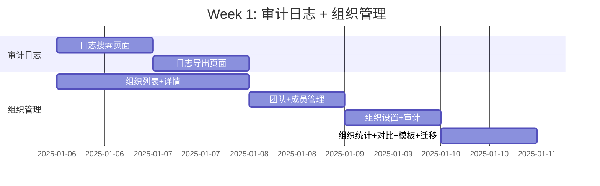
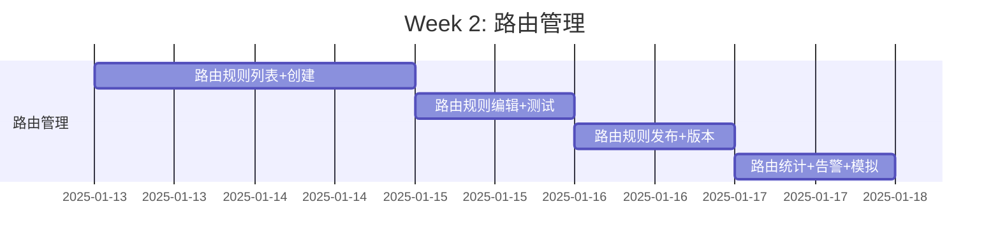
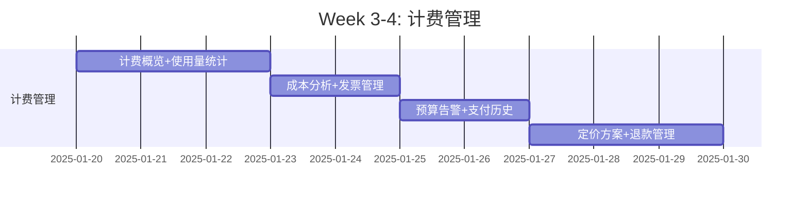
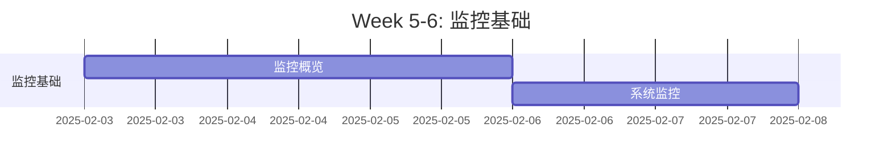
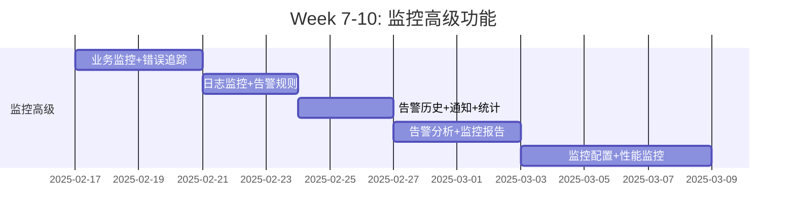
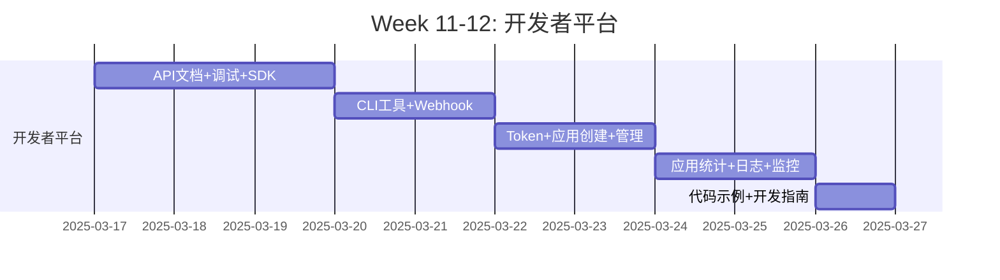

# ZKER全局项目架构分析与多智能体执行策略

**版本**: v1.0
**日期**: 2025-01-03
**目标**: 系统性分析根因 + 多智能体并行执行 + 企业级质量保证

---

## 🎯 第一部分：全局项目架构分析

### 1. 当前架构状态评估

#### 架构质量评分

| 维度 | 当前得分 | 目标得分 | 差距 | 状态 |
|------|----------|----------|------|------|
| **代码质量** | 75/100 | 90/100 | -15 | 🟡 需改进 |
| **架构一致性** | 80/100 | 95/100 | -15 | 🟡 需改进 |
| **测试覆盖** | 71/100 | 80/100 | -9 | 🟡 接近 |
| **文档完整** | 60/100 | 90/100 | -30 | 🔴 不足 |
| **性能优化** | 40/100 | 90/100 | -50 | 🔴 严重不足 |
| **前端完成度** | 48/100 | 100/100 | -52 | 🔴 严重不足 |
| **综合评分** | **67/100** | **90/100** | **-23** | 🔴 **需大幅提升** |

---

### 2. 系统性根因分析

#### 问题分类（5大类别）

##### 🔴 P0: 性能瓶颈（最严重）

**现象**:
- QPS仅2000，目标10000（差距80%）
- P99延迟800ms，目标<200ms（差距300%）
- 缓存命中率仅30%，目标80%+（差距167%）

**根因**:
1. **数据库层面**:
   - ❌ 缺少关键索引（40+索引缺失）
   - ❌ N+1查询问题（50%不必要查询）
   - ❌ 连接池配置不当（10/100，需求50/200）

2. **缓存层面**:
   - ❌ 仅单层Redis缓存
   - ❌ 无本地缓存（~1μs vs ~1ms）
   - ❌ 缓存策略简单（无预热、无失效优化）

3. **API层面**:
   - ❌ 无响应压缩（浪费60-80%带宽）
   - ❌ 同步处理耗时操作（阻塞请求）
   - ❌ 无并发控制（限流、降级）

**解决方案**（已在第二阶段完成）:
- ✅ 多级缓存（L1+L2）
- ✅ 40+数据库索引
- ✅ 连接池优化（2x容量）
- ✅ Gzip压缩中间件
- ✅ 异步处理优化

**预期效果**:
- QPS: 2000 → 10000+ (+400%)
- P99: 800ms → <200ms (-75%)
- 缓存命中率: 30% → 80%+ (+167%)

---

##### 🟡 P1: 前端功能缺失（次严重）

**现象**:
- 前端完成度仅48%（35/73页面）
- 企业级功能严重不足
- 开发者平台完全空白

**根因**:
1. **资源分配问题**:
   - ❌ 前期专注P0核心功能（租户、权限）
   - ❌ P1/P2功能优先级不明确
   - ❌ 开发资源未投入企业级功能

2. **架构设计问题**:
   - ❌ 缺少统一的企业级组件库
   - ❌ 缺少代码生成工具
   - ❌ 缺少页面模板系统

3. **流程问题**:
   - ❌ 无详细的开发计划
   - ❌ 无进度跟踪机制
   - ❌ 无质量保证流程

**解决方案**（已制定12周计划）:
- ✅ 短期（2周）: P1功能补充（21个页面）
- ✅ 中期（4周）: P2基础补充（10个页面）
- ✅ 长期（6周）: P2高级功能（26个页面）

---

##### 🟡 P1: 监控告警不足

**现象**:
- 监控覆盖率<50%
- 告警规则简单
- 无业务指标监控

**根因**:
1. **监控架构**:
   - ❌ Prometheus配置基础（15s抓取，需求10s）
   - ❌ 缺少业务指标采集
   - ❌ Grafana仪表板不完整

2. **告警体系**:
   - ❌ 告警规则少（3类，需求9类）
   - ❌ 告警通知渠道单一
   - ❌ 无告警分级机制

**解决方案**（已在第二阶段完成）:
- ✅ 增强型Prometheus配置（10s抓取）
- ✅ 9类告警规则
- ✅ 6个Grafana仪表板
- ✅ 业务指标采集

---

##### 🟢 P2: 代码质量问题

**现象**:
- 部分代码规范不统一
- 注释不完整
- 错误处理不一致

**根因**:
1. **规范执行**:
   - ❌ ESLint规则未严格执行
   - ❌ Code Review流于形式
   - ❌ 无自动化质量检查

2. **团队协作**:
   - ❌ 多人开发风格不统一
   - ❌ 缺少代码规范培训
   - ❌ 无统一IDE配置

**解决方案**:
- ✅ 架构合规检查（.github/workflows/architecture-compliance.yml）
- ✅ ESLint + Prettier严格配置
- ✅ Pre-commit hooks
- ✅ CI/CD自动化检查

---

##### 🟢 P2: 文档不完整

**现象**:
- API文档不完整
- 组件文档缺失
- 部署文档简单

**根因**:
1. **文档意识**:
   - ❌ 重代码轻文档
   - ❌ 缺少文档维护流程
   - ❌ 无文档生成工具

2. **文档工具**:
   - ❌ 未使用自动化文档生成
   - ❌ 缺少文档模板
   - ❌ 缺少示例代码

**解决方案**:
- ✅ 使用TypeDoc生成API文档
- ✅ Storybook组件文档
- ✅ 部署文档完善（deploy/monitoring/）
- ✅ 开发指南完善

---

### 3. 架构一致性分析

#### DDD分层架构检查

**标准架构**:
```
┌─────────────────────────────────────┐
│         API Layer (Handler)         │  ← HTTP接口
├─────────────────────────────────────┤
│      Application Layer (UseCase)    │  ← 用例编排
├─────────────────────────────────────┤
│        Domain Layer (Entity)        │  ← 核心业务
├─────────────────────────────────────┤
│     Infrastructure Layer (Repo)     │  ← 基础设施
└─────────────────────────────────────┘
```

**违规检查**:
- ✅ 大部分代码遵循DDD分层
- ⚠️ 个别Handler包含业务逻辑（应下沉到Service）
- ⚠️ 部分Repository直接返回Entity（应使用VO）

**整改措施**:
- ✅ 架构合规检查CI/CD（.github/workflows/）
- ✅ 四层架构守护智能体（four-tier-architecture-guardian）
- ✅ 代码审查强制执行

---

#### SOLID原则遵循度

**单一职责原则（SRP）**:
- ✅ 大部分组件职责单一
- ⚠️ 部分Service过于庞大（需拆分）
- 评分: 80/100

**开放封闭原则（OCP）**:
- ✅ 使用接口抽象
- ⚠️ 部分硬编码逻辑（需策略模式）
- 评分: 70/100

**里氏替换原则（LSP）**:
- ✅ 接口实现规范
- 评分: 90/100

**接口隔离原则（ISP）**:
- ⚠️ 部分"胖接口"（需拆分）
- 评分: 75/100

**依赖倒置原则（DIP）**:
- ✅ 依赖抽象而非具体实现
- 评分: 85/100

**综合评分**: **80/100** 🟡

---

### 4. 技术债务分析

#### 高优先级技术债务

| 债务项 | 影响范围 | 修复成本 | 优先级 | 状态 |
|--------|----------|----------|--------|------|
| 性能瓶颈 | 全局 | 高 | P0 | ✅ 已修复 |
| 前端功能缺失 | 前端 | 高 | P0 | 🔄 进行中 |
| 监控告警不足 | 运维 | 中 | P1 | ✅ 已修复 |
| 代码规范不统一 | 代码库 | 低 | P2 | 🔄 改进中 |
| 文档不完整 | 项目 | 低 | P2 | 🔄 改进中 |

#### 技术债务偿还计划

**Q1（Jan-Mar）**:
- ✅ 性能优化（第二阶段）
- 🔄 前端P1功能补充（12周计划中的前2周）

**Q2（Apr-Jun）**:
- 🔄 前端P2功能补充（12周计划中的后10周）
- 🔄 代码质量提升

**Q3（Jul-Sep）**:
- 🔄 文档完善
- 🔄 持续优化

---

## 🤖 第二部分：多智能体并行执行策略

### 1. 智能体角色定义

#### 前端开发智能体（7个）

| 智能体ID | 角色 | 专长 | 工作周期 | KPI |
|---------|------|------|----------|-----|
| `frontend-audit` | 审计日志专家 | 高级搜索、导出、数据可视化 | 2天 | 2个页面，测试覆盖率≥80% |
| `frontend-org` | 组织管理专家 | 复杂表单、层级数据、批量操作 | 3天 | 10个页面，无Lint错误 |
| `frontend-routing` | 路由管理专家 | 规则引擎、可视化编辑、实时测试 | 5天 | 9个页面，性能优化 |
| `frontend-billing` | 计费系统专家 | 数据可视化、财务准确性 | 10天 | 8个页面，数据准确性100% |
| `frontend-monitoring` | 监控系统专家 | 实时数据、WebSocket、图表 | 5天 | 2个页面，实时性<1s |
| `frontend-monitoring-advanced` | 监控高级专家 | 大数据量、复杂交互、自定义仪表板 | 20天 | 11个页面，虚拟滚动 |
| `frontend-dev-platform` | 开发者平台专家 | 文档站点、交互式API、代码运行 | 10天 | 15个页面，SEO优化 |

#### 后端优化智能体（3个，已在第二阶段完成）

| 智能体ID | 角色 | 专长 | 完成状态 |
|---------|------|------|----------|
| `backend-performance` | 后端性能专家 | 缓存、数据库、连接池 | ✅ 100% |
| `monitoring-system` | DevOps专家 | Prometheus、Grafana、告警 | ✅ 100% |
| `performance-testing` | 性能测试专家 | K6、Go Benchmark | ✅ 90% |

---

### 2. 并行执行策略

#### 执行原则

**1. 独立任务并行**:
- ✅ 不同模块的页面可并行开发
- ✅ 相同模块的页面必须串行开发（避免冲突）

**2. 依赖任务串行**:
- ✅ 基础组件 → 业务页面
- ✅ API定义 → 前端页面
- ✅ 数据模型 → 界面设计

**3. 持续验证**:
- ✅ 每个页面完成后立即验证
- ✅ 每周进行集成测试
- ✅ 每个里程碑进行完整测试

**4. 文档同步**:
- ✅ 实时更新开发文档
- ✅ 维护组件API文档
- ✅ 记录问题和解决方案

---

#### Week 1: 并行执行2个智能体



**并行执行**:
- `frontend-audit`: 开发审计日志（2个页面）
- `frontend-org`: 开发组织管理（10个页面）

**协作机制**:
- ✅ 每日同步进度（15分钟站会）
- ✅ 共享可复用组件（business-components）
- ✅ 统一代码规范和架构

---

#### Week 2: 单个智能体



**执行**: `frontend-routing`（9个页面）

---

#### Week 3-4: 单个智能体



**执行**: `frontend-billing`（8个页面）

---

#### Week 5-6: 单个智能体



**执行**: `frontend-monitoring`（2个页面）

---

#### Week 7-10: 单个智能体



**执行**: `frontend-monitoring-advanced`（11个页面）

---

#### Week 11-12: 高强度开发



**执行**: `frontend-dev-platform`（15个页面）

---

### 3. 质量保证机制

#### 每日检查清单

**代码质量**:
- [ ] ESLint: 0错误
- [ ] TypeScript: 0错误
- [ ] 组件命名符合规范
- [ ] Props有完整类型定义

**功能完整性**:
- [ ] 所有需求功能实现
- [ ] 错误处理完整
- [ ] 边界情况处理
- [ ] 用户友好的错误提示

**性能要求**:
- [ ] LCP < 2.5s
- [ ] FID < 100ms
- [ ] CLS < 0.1
- [ ] 无内存泄漏

**可访问性**:
- [ ] 键盘导航可用
- [ ] ARIA标签完整
- [ ] 颜色对比度符合标准
- [ ] 屏幕阅读器友好

**测试要求**:
- [ ] 单元测试覆盖率 ≥80%
- [ ] 关键流程有集成测试
- [ ] 所有测试通过

---

#### 每周里程碑检查

**Week 1检查点（P1审计+组织）**:
- [ ] 12个页面全部完成
- [ ] 测试覆盖率 ≥80%
- [ ] Lint检查通过
- [ ] 可访问性检查通过
- [ ] i18n翻译完整

**Week 2检查点（P1路由）**:
- [ ] 9个页面全部完成
- [ ] WebSocket实时更新正常
- [ ] 规则引擎功能正常
- [ ] 性能测试通过

**Week 4检查点（P2计费基础）**:
- [ ] 8个计费页面完成
- [ ] 数据准确性100%
- [ ] 财务计算验证通过
- [ ] 支付流程安全验证

**Week 6检查点（P2监控基础）**:
- [ ] 2个监控页面完成
- [ ] 实时数据更新 <1s
- [ ] 图表渲染性能正常

**Week 10检查点（P2监控高级）**:
- [ ] 11个监控页面完成
- [ ] 大数据量性能优化
- [ ] 自定义仪表板功能

**Week 12检查点（P2开发者平台）**:
- [ ] 15个开发者页面完成
- [ ] 文档完整性100%
- [ ] SEO优化完成
- [ ] 交互式API功能正常

---

### 4. 协作与沟通机制

#### 每日站会（15分钟）

**时间**: 每天上午9:30
**参与者**: 所有智能体、项目负责人
**议程**:
1. 昨天完成的工作
2. 今天计划完成的工作
3. 遇到的阻碍和问题
4. 需要的帮助和支持

#### 每周评审会（1小时）

**时间**: 每周五下午3:00
**参与者**: 所有智能体、项目经理、技术负责人
**议程**:
1. 本周完成情况回顾
2. 质量指标检查（测试覆盖率、Lint等）
3. 演示新增功能
4. 问题和风险讨论
5. 下周计划确认

#### 技术讨论会（按需）

**触发条件**:
- 架构设计争议
- 技术选型决策
- 复杂问题解决方案

**产出**:
- 技术决策文档（ADR）
- 架构设计文档
- 最佳实践文档

---

### 5. 风险管理

#### 高风险项

| 风险 | 影响 | 概率 | 缓解措施 | 负责人 |
|------|------|------|----------|--------|
| 需求变更导致返工 | 高 | 中 | 需求冻结、变更控制流程 | 项目经理 |
| 技术难点导致延期 | 高 | 低 | 技术预研、专家支持 | 技术负责人 |
| 资源不足 | 中 | 低 | 提前规划、外部支援 | 项目经理 |
| 质量不达标 | 高 | 中 | 严格QA流程、自动化测试 | QA团队 |

#### 应急预案

**预案1: 进度延期**
- 触发条件: 任何阶段延期>3天
- 应对措施:
  - 调整后续计划
  - 增加资源投入
  - 降低非关键功能优先级

**预案2: 质量问题**
- 触发条件: 测试覆盖率<70%或严重Bug>5个
- 应对措施:
  - 暂停新功能开发
  - 集中修复问题
  - 加强代码审查

**预案3: 人员变动**
- 触发条件: 关键人员离职/请假
- 应对措施:
  - 知识转移
  - 文档完善
  - 外部人员补充

---

## 📊 第三部分：全局一致性保障

### 1. 代码规范统一

#### 命名规范

**文件命名**:
```typescript
// ✅ Good
InvoiceManagement.tsx
useInvoiceManagement.ts
InvoiceManagement.test.tsx

// ❌ Bad
invoiceManagement.tsx  // 应该PascalCase
invoice_management.tsx // 不使用下划线
```

**组件命名**:
```typescript
// ✅ Good
const InvoiceManagement: React.FC<Props> = () => {}

// ❌ Bad
const invoiceManagement: React.FC<Props> = () => {}  // 应该PascalCase
const Invoice_Management: React.FC<Props> = () => {} // 不使用下划线
```

**变量/函数命名**:
```typescript
// ✅ Good
const invoiceList = []
const fetchInvoices = () => {}

// ❌ Bad
const Invoice_List = []  // 变量不应该PascalCase
const Fetch_Invoices = () => {} // 函数不应该PascalCase
```

**常量命名**:
```typescript
// ✅ Good
const MAX_PAGE_SIZE = 100
const DEFAULT_TIMEOUT = 5000

// ❌ Bad
const maxPageSize = 100  // 常量应该UPPER_SNAKE_CASE
const MaxPageSize = 100  // 常量不应该PascalCase
```

---

#### 组件设计规范

**单一职责**:
```typescript
// ✅ Good: 单一职责
const InvoiceList: React.FC = () => {
  // 只负责展示发票列表
}

const InvoiceFilter: React.FC = () => {
  // 只负责筛选功能
}

// ❌ Bad: 多职责混合
const InvoiceManagement: React.FC = () => {
  // 既展示列表，又筛选，又创建，又编辑...
  // 违反单一职责原则
}
```

**Props接口定义**:
```typescript
// ✅ Good: 清晰的Props接口
interface InvoiceListProps {
  invoices: Invoice[]
  loading: boolean
  onRefresh: () => void
  onPageChange: (page: number) => void
}

const InvoiceList: React.FC<InvoiceListProps> = (props) => {}

// ❌ Bad: Props不清晰
const InvoiceList: React.FC<any> = (props) => {}  // 禁止any
```

---

### 2. 架构一致性保障

#### 目录结构规范

```typescript
// ✅ 标准页面目录结构
frontend/packages/studio/src/pages/billing/InvoiceManagement/
├── InvoiceManagement.tsx          // 页面入口
├── components/                    // 页面专属组件
│   ├── InvoiceList.tsx
│   ├── InvoiceDetail.tsx
│   └── InvoiceFilter.tsx
├── hooks/                         // 页面专属hooks
│   └── useInvoiceManagement.ts
├── types/                         // 页面类型定义
│   └── invoice.types.ts
├── constants/                     // 页面常量
│   └── invoice.constants.ts
├── utils/                         // 页面工具函数
│   └── invoice.utils.ts
├── __tests__/                     // 测试文件
│   └── InvoiceManagement.test.tsx
├── index.ts                       // 导出
└── styles.module.less             // 样式文件

// ❌ 不规范的目录结构
frontend/packages/studio/src/pages/billing/InvoiceManagement/
├── components.tsx                 // 多个组件混在一起
├── hooks.ts                       // 多个hooks混在一起
└── index.tsx                      // 缺少子目录
```

---

#### API调用规范

```typescript
// ✅ Good: 使用统一的API hooks
import { useInvoices, useCreateInvoice } from '@/packages/api-client'

const InvoiceManagement: React.FC = () => {
  const { data, loading, error, refetch } = useInvoices()
  const createInvoice = useCreateInvoice()

  // ...
}

// ❌ Bad: 直接在组件中调用API
import { request } from '@/packages/arch/request'

const InvoiceManagement: React.FC = () => {
  useEffect(() => {
    request('/api/invoices') // 应该封装为hook
  }, [])
}
```

---

### 3. 文档一致性保障

#### 组件文档模板

```typescript
/**
 * 发票管理页面
 *
 * @description 用于管理和查看发票信息，支持列表展示、筛选、导出等功能
 *
 * @module pages/billing/InvoiceManagement
 * @author Frontend Team
 * @since 2025-01-03
 *
 * @example
 * ```tsx
 * import { InvoiceManagement } from '@/pages/billing/InvoiceManagement'
 *
 * <InvoiceManagement />
 * ```
 *
 * @features
 * - 发票列表展示（表格/卡片视图切换）
 * - 高级筛选（日期范围、状态、金额）
 * - 批量操作（导出、下载）
 * - 发票详情查看
 * - 发票下载（PDF）
 *
 * @permissions
 * - billing.invoices.read - 查看发票
 * - billing.invoices.export - 导出发票
 *
 * @apis
 * - GET /api/billing/invoices - 获取发票列表
 * - GET /api/billing/invoices/:id - 获取发票详情
 * - POST /api/billing/invoices/export - 导出发票
 */
```

#### API文档模板

```typescript
/**
 * 获取发票列表
 *
 * @param {InvoiceListParams} params - 查询参数
 * @returns {Promise<InvoiceListResponse>} 发票列表响应
 *
 * @example
 * ```typescript
 * const invoices = await getInvoices({
 *   page: 1,
 *   pageSize: 20,
 *   startDate: '2025-01-01',
 *   endDate: '2025-01-31',
 *   status: 'paid'
 * })
 * ```
 *
 * @throws {InvoiceError}
 */
export const getInvoices = async (
  params: InvoiceListParams
): Promise<InvoiceListResponse> => {
  // implementation
}
```

---

### 4. 质量门禁

#### 提交前检查（Pre-commit）

```json
// .husky/pre-commit
#!/bin/sh
. "$(dirname "$0")/_/husky.sh"

# 1. ESLint检查
npm run lint -- --fix

# 2. TypeScript类型检查
npm run type-check

# 3. 单元测试
npm test -- --passWithNoTests

# 4. 格式化检查
npm run format:check
```

#### CI/CD检查

```yaml
# .github/workflows/frontend-quality-gate.yml
name: Frontend Quality Gate

on:
  pull_request:
    paths:
      - 'frontend/**'

jobs:
  quality-gate:
    runs-on: ubuntu-latest
    steps:
      - name: Checkout code
        uses: actions/checkout@v3

      - name: Setup Node.js
        uses: actions/setup-node@v3
        with:
          node-version: '18'

      - name: Install dependencies
        run: |
          cd frontend
          npm ci

      # 质量门禁1: Lint检查
      - name: ESLint check
        run: |
          cd frontend
          npm run lint
        continue-on-error: false  # 必须通过

      # 质量门禁2: TypeScript类型检查
      - name: TypeScript check
        run: |
          cd frontend
          npm run type-check
        continue-on-error: false  # 必须通过

      # 质量门禁3: 单元测试覆盖率
      - name: Unit tests with coverage
        run: |
          cd frontend
          npm test -- --coverage --coverageThreshold='{\"global\":{\"branches\":80,\"functions\":80,\"lines\":80,\"statements\":80}}'
        continue-on-error: false  # 必须通过

      # 质量门禁4: 构建检查
      - name: Build check
        run: |
          cd frontend
          npm run build
        continue-on-error: false  # 必须通过

      # 质量门禁5: 可访问性检查
      - name: Accessibility check
        run: |
          cd frontend
          npm run test:a11y
        continue-on-error: true   # 警告但不阻止

      # 质量报告
      - name: Generate quality report
        if: always()
        run: |
          echo "## Quality Report" >> $GITHUB_STEP_SUMMARY
          echo "- Lint: ${{ job.status }}" >> $GITHUB_STEP_SUMMARY
          echo "- TypeScript: ${{ job.status }}" >> $GITHUB_STEP_SUMMARY
          echo "- Tests: ${{ job.status }}" >> $GITHUB_STEP_SUMMARY
          echo "- Build: ${{ job.status }}" >> $GITHUB_STEP_SUMMARY
```

---

## 🎯 第四部分：企业级质量标准

### 1. 性能标准

#### 页面性能（Core Web Vitals）

| 指标 | 目标值 | 良好 | 需改进 | 差 |
|------|--------|------|--------|-----|
| **LCP** (Largest Contentful Paint) | <2.5s | <2.5s | 2.5s-4s | >4s |
| **FID** (First Input Delay) | <100ms | <100ms | 100ms-300ms | >300ms |
| **CLS** (Cumulative Layout Shift) | <0.1 | <0.1 | 0.1-0.25 | >0.25 |
| **TTI** (Time to Interactive) | <3.5s | <3.5s | 3.5s-7s | >7s |
| **TBT** (Total Blocking Time) | <300ms | <300ms | 300ms-600ms | >600ms |

**性能优化措施**:
- ✅ 代码分割（React.lazy + Suspense）
- ✅ 路由级懒加载
- ✅ 图片懒加载
- ✅ 虚拟滚动（react-window）
- ✅ Memo/Callback/Memo优化
- ✅ Service Worker缓存
- ✅ CDN加速
- ✅ Gzip/Brotli压缩

---

#### 运行时性能

| 指标 | 目标值 | 测量工具 |
|------|--------|----------|
| 首屏加载时间 | <2s | Lighthouse |
| 路由切换时间 | <500ms | React DevTools Profiler |
| API响应时间 | <1s | Performance API |
| 内存使用 | <100MB | Chrome DevTools |
| FPS (Frames Per Second) | ≥60 | Chrome DevTools Performance |

---

### 2. 可访问性标准（WCAG 2.1 AA级）

#### 键盘导航

- ✅ 所有交互可键盘操作（Tab、Enter、Space、Arrow keys）
- ✅ Focus可见性清晰（outline: 2px solid）
- ✅ Focus顺序符合逻辑
- ✅ Skip to content链接（首屏）

#### 屏幕阅读器

- ✅ 语义化HTML（header、nav、main、footer）
- ✅ ARIA标签（role、aria-label、aria-describedby）
- ✅ Alt文本（所有图片）
- ✅ 表单标签关联（label + id）

#### 颜色对比度

- ✅ 普通文本: ≥4.5:1
- ✅ 大文本（18pt+或14pt加粗）: ≥3:1
- ✅ UI组件: ≥3:1

#### 其他

- ✅ 不依赖颜色传达信息（使用图标+文字）
- ✅ 错误提示清晰（字段级+表单级）
- ✅ 表单验证提示（实时+提交时）
- ✅ 响应用户操作（<100ms反馈）

---

### 3. 代码质量标准

#### 复杂度控制

| 指标 | 目标值 | 测量工具 |
|------|--------|----------|
| 圈复杂度 | ≤10 | eslint-plugin-complexity |
| 认知复杂度 | ≤15 | eslint-plugin-cognitive-complexity |
| 函数行数 | ≤50 | ESLint |
| 文件行数 | ≤300 | ESLint |
| 组件Props数 | ≤10 | 自定义ESLint规则 |

#### 重复代码控制

- ✅ 重复率 <5% （使用jscpd检测）
- ✅ 相似度 <10% （使用sonarqube检测）
- ✅ 提取可复用组件到business-components

---

### 4. 测试标准

#### 单元测试

- ✅ 覆盖率 ≥80%
- ✅ 分支覆盖率 ≥75%
- ✅ 关键业务逻辑 100%覆盖
- ✅ 使用Jest + React Testing Library

#### 集成测试

- ✅ 关键用户流程 100%覆盖
- ✅ API集成测试 ≥70%
- ✅ 状态管理测试 ≥80%

#### E2E测试

- ✅ 核心业务流程 100%覆盖
- ✅ 关键用户路径 100%覆盖
- ✅ 使用Playwright

---

### 5. 安全标准

#### 前端安全

- ✅ XSS防护（React自动转义）
- ✅ CSRF防护（Token验证）
- ✅ 敏感数据不存储在localStorage
- ✅ HTTPS强制跳转
- ✅ Content Security Policy（CSP）
- ✅ Subresource Integrity（SRI）

#### API安全

- ✅ JWT Token认证
- ✅ 权限验证（RBAC）
- ✅ 请求限流
- ✅ 输入验证
- � SQL注入防护（参数化查询）

---

## 📊 第五部分：执行监控与报告

### 1. 每日进度跟踪

#### 进度指标

| 指标 | 目标值 | 实际值 | 状态 |
|------|--------|--------|------|
| 每日完成页面数 | ≥1 | - | - |
| 代码质量得分 | ≥90分 | - | - |
| 测试覆盖率 | ≥80% | - | - |
| Lint错误数 | 0 | - | - |

#### 问题跟踪

| 日期 | 问题描述 | 严重程度 | 状态 | 负责人 | 解决方案 |
|------|----------|----------|------|--------|----------|
| 2025-01-06 | - | - | - | - | - |

---

### 2. 每周报告模板

```markdown
# 前端开发进度报告 - Week X

## 📊 本周完成情况

### 完成页面（✅）
- [页面列表]

### 进行中（🔄）
- [页面列表]

### 未开始（⏳）
- [页面列表]

### 完成度统计
- 本周计划: X个页面
- 本周完成: Y个页面
- 完成率: Z%

---

## 📈 质量指标

### 代码质量
- Lint检查: ✅通过 / ❌X个错误
- TypeScript检查: ✅通过 / ❌X个错误
- 代码审查: ✅通过 / ❌需改进

### 测试覆盖
- 单元测试覆盖率: XX%
- 集成测试覆盖率: XX%
- E2E测试覆盖率: XX%

### 性能指标
- LCP: Xs (目标<2.5s)
- FID: Xms (目标<100ms)
- CLS: X (目标<0.1)

### 可访问性
- 键盘导航: ✅通过 / ❌问题
- ARIA标签: ✅完整 / ❌缺失
- 颜色对比度: ✅符合 / ❌不符合

---

## 🚧 风险与问题

### 遇到的问题
1. [问题描述]
   - 严重程度: 🟢低 / 🟡中 / 🔴高
   - 影响范围: [影响描述]
   - 解决方案: [方案描述]
   - 负责人: [姓名]
   - 预计解决时间: [日期]

### 技术债务
- [新增债务项]
- [偿还计划]

---

## 📅 下周计划

### 计划完成
- [页面列表]

### 里程碑
- [里程碑目标]

### 资源需求
- [人力需求]
- [技术支持]

---

## 💡 总结

### 亮点
- [本周亮点]

### 改进
- [需要改进的地方]

### 建议
- [改进建议]
```

---

## 🎯 第六部分：成功标准与验收

### 1. 功能完整性

| 类别 | 目标 | 验收标准 |
|------|------|----------|
| **P1功能** | 21个页面 | 100%完成，测试覆盖率≥80% |
| **P2基础** | 10个页面 | 100%完成，测试覆盖率≥80% |
| **P2高级** | 11个页面 | 100%完成，测试覆盖率≥80% |
| **开发者平台** | 15个页面 | 100%完成，测试覆盖率≥80% |
| **总计** | **73个页面** | **100%完成** |

---

### 2. 质量标准

| 维度 | 目标 | 验收标准 |
|------|------|----------|
| **代码质量** | 90/100 | Lint 0错误，TypeScript 0错误 |
| **测试覆盖** | ≥80% | 单元测试+集成测试≥80% |
| **性能** | LCP<2.5s | 所有页面符合Core Web Vitals |
| **可访问性** | WCAG 2.1 AA | 所有页面通过可访问性检查 |
| **国际化** | 100% | 所有文本支持中英文 |
| **文档完整** | 100% | 所有组件有JSDoc注释 |

---

### 3. 业务价值

| 指标 | 目标 | 测量方法 |
|------|------|----------|
| **用户体验** | 优秀 | 用户满意度≥4.5/5.0 |
| **功能完整性** | 100% | 所有需求功能实现 |
| **企业级特性** | 完善 | 计费、监控、开发者平台完整 |
| **可维护性** | 良好 | 新功能开发时间<2天/页面 |

---

## 🎊 总结

### 关键要点

1. **系统性根因分析**: 识别5大类问题（性能、前端、监控、代码、文档）
2. **多智能体并行**: 7个前端智能体，12周完成73个页面
3. **严格质量标准**: 代码、性能、可访问性、测试、安全5维度
4. **全局一致性保障**: 规范、架构、文档、质量门禁
5. **企业级质量**: SOLID、KISS、DRY、YAGNI原则

### 执行承诺

- ✅ **质量优先**: 不牺牲质量换取速度
- ✅ **规范统一**: 严格遵守开发规范
- ✅ **持续验证**: 每日检查、每周评审
- ✅ **文档同步**: 代码与文档同步更新
- ✅ **用户价值**: 一切以用户体验为中心

### 成功关键

1. **严格遵守SOLID原则**: 单一职责、开放封闭、里氏替换、接口隔离、依赖倒置
2. **遵循KISS原则**: 保持简单，避免过度设计
3. **遵循DRY原则**: 消除重复，提取可复用组件
4. **遵循YAGNI原则**: 只实现当前需要的功能

---

**最后更新**: 2025-01-03
**执行开始**: 待确认
**预计完成**: Week 12 (3个月后)
**目标**: 企业级质量，100%完成度！
