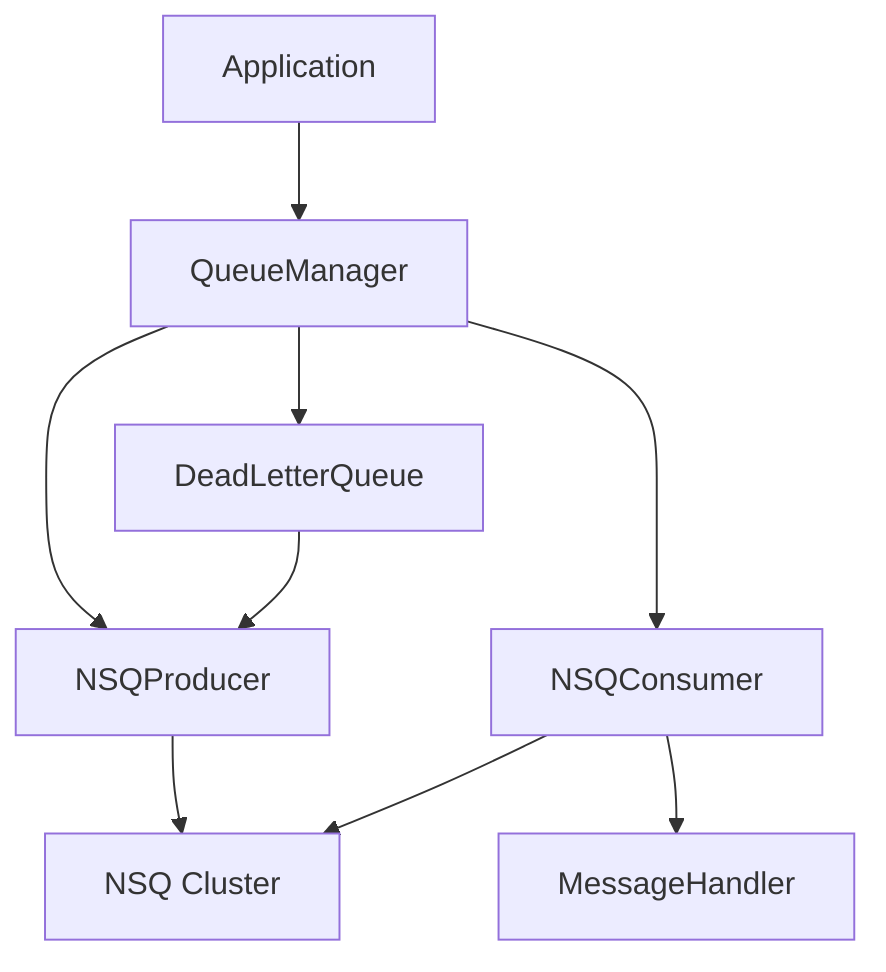

# ZKER NSQ任务队列架构设计文档

**文档版本**: v1.0
**创建日期**: 2025-01-01
**最后更新**: 2025-01-01
**作者**: 基础设施团队

---

## 📋 目录

- [1. 概述](#1-概述)
- [2. 架构设计](#2-架构设计)
- [3. 核心组件](#3-核心组件)
- [4. 数据流设计](#4-数据流设计)
- [5. 可靠性保障](#5-可靠性保障)
- [6. 性能优化](#6-性能优化)
- [7. 监控与运维](#7-监控与运维)
- [8. 安全设计](#8-安全设计)

---

## 1. 概述

### 1.1 设计目标

NSQ任务队列系统旨在为ZKER平台提供企业级异步任务处理能力，核心目标包括：

- **高可用性**: 支持集群部署，故障自动转移
- **高可靠性**: 消息持久化，失败重试，死信队列
- **高性能**: 支持高并发，低延迟处理
- **可扩展性**: 支持水平扩展，动态增减节点
- **可观测性**: 完善的监控和日志体系

### 1.2 技术选型

| 组件 | 技术 | 版本 | 理由 |
|-----|------|------|------|
| 消息队列 | NSQ | v1.2.1 | 轻量级、高性能、Go原生 |
| 客户端库 | go-nsq | latest | 官方客户端，功能完整 |
| 监控 | Prometheus | v2.45.0 | 业界标准，强大查询能力 |
| 日志 | Zap | latest | 结构化日志，高性能 |

### 1.3 系统边界

```
┌──────────────────────────────────────────────────────────────┐
│                         ZKER 应用层                          │
├──────────────────────────────────────────────────────────────┤
│  API服务  │  工作流引擎  │  知识库  │  Bot管理  │  报告生成  │
└───────────────────┬──────────────────────────────────────────┘
                    │
                    ▼
┌──────────────────────────────────────────────────────────────┐
│                     QueueManager                             │
│  ┌────────────┐  ┌────────────┐  ┌────────────┐           │
│  │ Producer   │  │ Consumer   │  │ DLQ        │           │
│  └────────────┘  └────────────┘  └────────────┘           │
└───────────────────┬──────────────────────────────────────────┘
                    │
                    ▼
┌──────────────────────────────────────────────────────────────┐
│                      NSQ 集群                                │
│  ┌─────────┐  ┌─────────┐  ┌────────────┐                  │
│  │ NSQD    │  │ NSQD    │  │ NSQLookupd │                  │
│  │ Node 1  │  │ Node 2  │  │  Nodes     │                  │
│  └─────────┘  └─────────┘  └────────────┘                  │
└──────────────────────────────────────────────────────────────┘
```

---

## 2. 架构设计

### 2.1 整体架构

系统采用三层架构：

1. **接口层**: QueueManager 提供统一的任务入队/出队接口
2. **处理层**: Producer/Consumer 处理消息发布和消费
3. **存储层**: NSQ 集群提供消息持久化和分发

### 2.2 模块划分

```
backend/infra/queue/
├── nsq_config.go           # 配置模块
├── nsq_producer.go         # 生产者模块
├── nsq_consumer.go         # 消费者模块
├── dead_letter_queue.go    # 死信队列模块
├── manager.go              # 队列管理器
└── nsq_test.go             # 测试文件

backend/application/queue/
└── tasks.go                # 业务任务封装
```

### 2.3 组件关系



---

## 3. 核心组件

### 3.1 NSQProducer (生产者)

**职责**:
- 发布消息到指定Topic
- 支持延迟消息
- 支持批量发布
- 连接管理和自动重连

**关键方法**:
```go
Publish(ctx, topic, message) error
PublishDelayed(ctx, topic, delay, message) error
PublishBatch(ctx, topic, messages) error
```

**设计亮点**:
- 连接池复用，减少连接开销
- 自动重试机制，提高成功率
- 支持自定义重试策略（指数退避、固定延迟）

### 3.2 NSQConsumer (消费者)

**职责**:
- 从NSQ消费消息
- 调用业务处理器处理消息
- 失败自动重试
- 超过重试次数转入死信队列

**关键方法**:
```go
Consume() error                 // 连接到NSQLookupd
ConsumeFromNSQD(addr) error     // 直接连接NSQD（测试用）
Stop()                          // 优雅关闭
```

**设计亮点**:
- 支持并发消费（MaxInFlight配置）
- 指数退避重试策略
- 重试追踪和监控
- 优雅关闭机制

### 3.3 DeadLetterQueue (死信队列)

**职责**:
- 保存失败消息
- 支持消息重放
- 可选的持久化存储
- 过期消息清理

**关键方法**:
```go
MoveToDLQ(ctx, topic, body, err) error
ReplayDLQ(ctx, topic) error
ReplayMessage(ctx, messageID) error
```

**设计亮点**:
- 保存完整失败上下文（失败原因、尝试次数）
- 支持单条或批量重放
- 可插拔的存储接口（内存/Redis/MySQL）

### 3.4 QueueManager (队列管理器)

**职责**:
- 统一的任务入队/出队接口
- 任务类型注册和管理
- 消费者生命周期管理
- 统计信息收集

**关键方法**:
```go
RegisterTask(taskType, handler) error
EnqueueTask(ctx, taskType, task) error
Start() error
Stop() error
```

**设计亮点**:
- 支持动态添加/移除消费者
- 统一的错误处理和重试
- 完整的监控指标

---

## 4. 数据流设计

### 4.1 消息发布流程

```
1. Application调用QueueManager.EnqueueTask()
   ↓
2. QueueManager调用Producer.Publish()
   ↓
3. Producer序列化消息为JSON
   ↓
4. 发送到NSQD (带重试)
   ↓
5. NSQD持久化消息到磁盘
   ↓
6. 返回成功
```

### 4.2 消息消费流程

```
1. NSQD推送消息到Consumer
   ↓
2. Consumer接收消息
   ↓
3. 更新重试计数
   ↓
4. 调用MessageHandler处理
   ↓
5a. 处理成功 → 确认消息(FIN)
   ↓
5b. 处理失败 → 检查重试次数
       ↓
       5b1. 未超限 → 重新入队(REQ)
       ↓
       5b2. 超限 → 转入死信队列(DLQ)
```

### 4.3 死信队列重放流程

```
1. 运维/监控发现问题
   ↓
2. 调用DLQ.ReplayDLQ()
   ↓
3. 从存储读取失败消息
   ↓
4. 检查重放次数限制
   ↓
5. 重新发布到原始Topic
   ↓
6. 更新重放计数
   ↓
7. 记录重放日志
```

---

## 5. 可靠性保障

### 5.1 消息持久化

- NSQD默认将消息持久化到磁盘
- 配置`--mem-queue-size=0`禁用内存队列，全持久化
- 数据目录挂载到高性能磁盘

### 5.2 失败重试机制

**重试策略**:
1. **Consumer层**: NSQ自动重试（MaxAttempts配置）
2. **应用层**: 指数退避，避免雪崩
3. **死信队列**: 最终兜底，避免消息丢失

**重试配置**:
```yaml
consumer:
  max_retries: 3          # 最大重试次数
  retry_delay: 1s         # 初始延迟
  max_in_flight: 10       # 并发度
```

### 5.3 死信队列

**触发条件**:
- 重试次数超过`consumer_max_retries`
- 消息处理超时
- 消息格式错误

**死信消息结构**:
```json
{
  "original_topic": "knowledge_document",
  "original_body": {...},
  "failed_at": "2025-01-01T12:00:00Z",
  "last_error": "connection timeout",
  "attempt_count": 4,
  "message_id": "dlq_1234567890",
  "replay_count": 0
}
```

### 5.4 消息去重

**去重策略**:
- 幂等性设计：消息处理接口实现幂等
- 业务层去重：使用message_id去重
- 消费者ACK：NSQ的at-least-once语义

---

## 6. 性能优化

### 6.1 批量操作

**批量发布**:
```go
EnqueueTaskBatch(ctx, taskType, tasks) error
```

**优势**:
- 减少网络往返次数
- 提高吞吐量
- 降低CPU开销

**最佳实践**:
- 批次大小: 100-1000条
- 总消息大小: < 5MB
- 超时时间: 10s

### 6.2 并发控制

**消费者并发**:
```yaml
consumer:
  max_in_flight: 10  # 每个消费者最多处理10条消息
```

**生产者并发**:
```yaml
producer:
  max_idle_conns: 10  # 连接池大小
```

**Goroutine池**:
- 批量发布时限制并发数（10个goroutine）
- 避免goroutine爆炸

### 6.3 内存优化

**消息体大小**:
- 单条消息: < 1MB
- 批量消息: < 5MB
- 大文件使用对象存储

**指标收集**:
- 只保留最近1000条延迟记录
- 定期清理过期重试信息

### 6.4 网络优化

**连接复用**:
- Producer连接池
- Consumer长连接
- 心跳保活

**压缩**:
- JSON序列化前压缩
- 大文本使用Gzip

---

## 7. 监控与运维

### 7.1 核心指标

**生产者指标**:
```go
type ProducerMetrics struct {
    PublishCount      int64   // 发布总数
    PublishSuccess    int64   // 成功数
    PublishFailed     int64   // 失败数
    PublishRetryCount int64   // 重试数
    PublishLatency    []time.Duration  // 延迟分布
}
```

**消费者指标**:
```go
type ConsumerMetrics struct {
    MessagesReceived  int64   // 接收总数
    MessagesSuccess   int64   // 成功处理数
    MessagesFailed    int64   // 失败数
    MessagesRetried   int64   // 重试数
    MessagesToDLQ     int64   // 死信数
    ProcessingTime    []time.Duration  // 处理时间分布
}
```

**死信队列指标**:
```go
type DLQMetrics struct {
    MessagesStored   int64   // 存储总数
    MessagesReplayed int64   // 重放数
    MessagesDeleted  int64   // 删除数
    MessagesExpired  int64   // 过期数
}
```

### 7.2 Prometheus指标

**暴露端点**: `:2112/metrics`

**指标列表**:
```
# 生产者
nsq_producer_publish_total{topic="knowledge_document"} 12345
nsq_producer_publish_success_total{topic="knowledge_document"} 12300
nsq_producer_publish_failed_total{topic="knowledge_document"} 45
nsq_producer_publish_latency_seconds{topic="knowledge_document",quantile="0.99"} 0.15

# 消费者
nsq_consumer_messages_received_total{topic="knowledge_document",channel="default"} 12000
nsq_consumer_messages_success_total{topic="knowledge_document",channel="default"} 11950
nsq_consumer_messages_failed_total{topic="knowledge_document",channel="default"} 50
nsq_consumer_messages_to_dlq_total{topic="knowledge_document",channel="default"} 5
nsq_consumer_processing_time_seconds{topic="knowledge_document",channel="default",quantile="0.99"} 2.5

# 死信队列
nsq_dlq_messages_stored_total{topic="knowledge_document"} 100
nsq_dlq_messages_replayed_total{topic="knowledge_document"} 80
nsq_dlq_messages_deleted_total{topic="knowledge_document"} 20
```

### 7.3 告警规则

**Grafana告警规则**:
```yaml
groups:
  - name: nsq_alerts
    rules:
      # 生产者失败率过高
      - alert: NSQProducerHighFailureRate
        expr: rate(nsq_producer_publish_failed_total[5m]) > 0.1
        for: 5m
        labels:
          severity: warning
        annotations:
          summary: "NSQ生产者失败率过高"
          description: "Topic {{ $labels.topic }} 失败率 > 10%"

      # 消费者堆积
      - alert: NSQConsumerBacklog
        expr: nsq_queue_depth{queue=~".*"} > 10000
        for: 10m
        labels:
          severity: critical
        annotations:
          summary: "NSQ消费者消息堆积"
          description: "Queue {{ $labels.queue }} 深度 > 10000"

      # 死信队列过多
      - alert: NSQDLQHighRate
        expr: rate(nsq_dlq_messages_stored_total[5m]) > 10
        for: 5m
        labels:
          severity: warning
        annotations:
          summary: "死信队列增长过快"
          description: "Topic {{ $labels.topic }} DLQ增长速率 > 10/s"

      # 消费处理延迟过高
      - alert: NSQConsumerHighLatency
        expr: histogram_quantile(0.99, nsq_consumer_processing_time_seconds) > 60
        for: 5m
        labels:
          severity: warning
        annotations:
          summary: "消费者处理延迟过高"
          description: "P99延迟 > 60s"
```

### 7.4 日志规范

**结构化日志**:
```json
{
  "level": "info",
  "ts": "2025-01-01T12:00:00Z",
  "caller": "queue/nsq_producer.go:123",
  "msg": "message published successfully",
  "topic": "knowledge_document",
  "latency": "150ms",
  "attempt": 1
}
```

**日志级别**:
- **Debug**: 详细调试信息
- **Info**: 关键操作（发布、消费成功）
- **Warn**: 重试、降级
- **Error**: 失败、异常

---

## 8. 安全设计

### 8.1 访问控制

**NSQD认证**:
```bash
nsqd --auth-http-address=http://localhost:4180
```

**TLS加密**:
```bash
nsqd --tls-cert=/path/to/cert.pem --tls-key=/path/to/key.pem
```

### 8.2 数据加密

**传输加密**:
- 生产环境使用TLS
- 证书定期轮换（90天）

**存储加密**:
- 敏感数据加密后再入队
- 使用AES-256-GCM

### 8.3 租户隔离

**Topic命名规范**:
```
{tenant_id}_{task_type}

例如:
tenant_123_knowledge_document
tenant_456_workflow_execution
```

**Consumer隔离**:
```
{tenant_id}_{task_type}_{channel}

例如:
tenant_123_knowledge_document_worker1
```

### 8.4 安全审计

**审计日志**:
- 记录所有敏感操作
- 包含用户ID、租户ID、时间戳
- 不可篡改（写入只读存储）

---

## 附录

### A. 配置参考

完整配置参考: [backend/conf/queue/nsq.yaml](../../backend/conf/queue/nsq.yaml)

### B. API参考

详细API文档: [ZKER-NSQ任务队列使用指南.md](./ZKER-NSQ任务队列使用指南_v1.0.md)

### C. 运维手册

运维操作手册: [ZKER-NSQ任务队列运维手册_v1.0.md](./ZKER-NSQ任务队列运维手册_v1.0.md)

---

**© 2025 ZKER Project. All rights reserved.**
