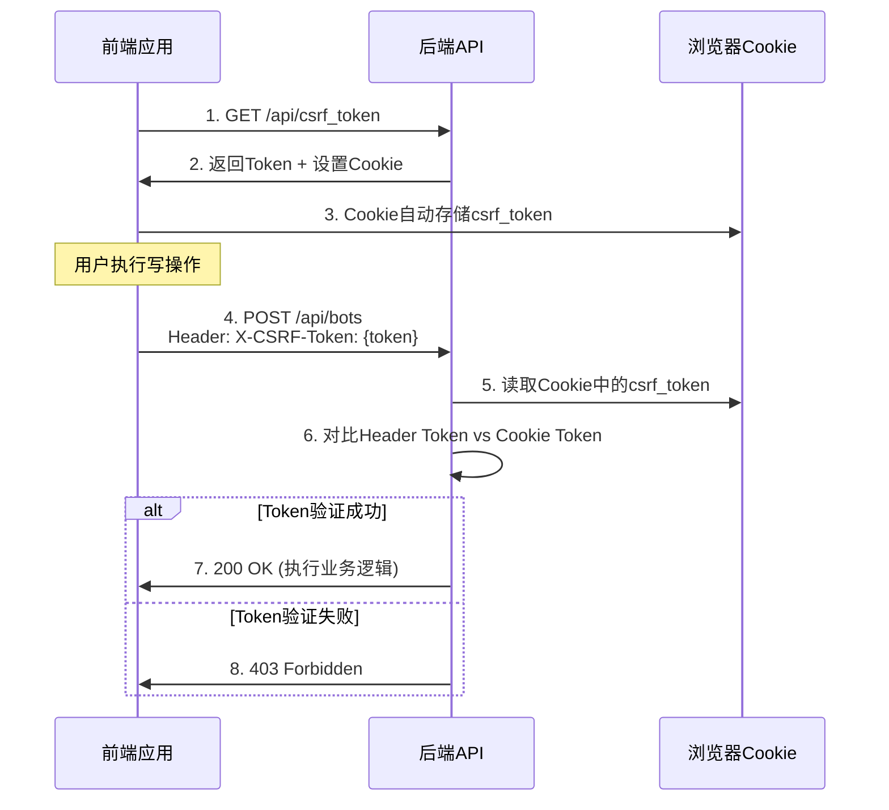

# ZKER CSRF中间件前端迁移指南 v1.0

**文档版本**: v1.0
**创建日期**: 2025-01-01
**适用范围**: 所有前端写操作API调用
**作者**: 研发B（后端工程师）
**审核状态**: 待审核

---

## 📋 目录

1. [概述](#概述)
2. [CSRF防护原理](#csrf防护原理)
3. [前端迁移步骤](#前端迁移步骤)
4. [API调用修改示例](#api调用修改示例)
5. [需要迁移的组件清单](#需要迁移的组件清单)
6. [测试验证方法](#测试验证方法)
7. [常见问题FAQ](#常见问题faq)
8. [迁移检查清单](#迁移检查清单)

---

## 概述

### 背景

ZKER项目已实现企业级CSRF（跨站请求伪造）防护系统，所有写操作API（POST/PUT/PATCH/DELETE）现在都需要验证CSRF Token。

### 目标

- **100%覆盖**: 所有前端写操作API调用必须携带CSRF Token
- **零停机**: 通过渐进式迁移实现平滑过渡
- **向后兼容**: 确保老版本API调用不受影响（通过灰度发布）

### 迁移范围

**必须迁移的API**:
- 所有POST请求（创建资源）
- 所有PUT请求（完整更新资源）
- 所有PATCH请求（部分更新资源）
- 所有DELETE请求（删除资源）

**无需迁移的API**:
- GET请求（只读操作）
- HEAD/OPTIONS请求（元数据操作）

---

## CSRF防护原理

### 工作流程



### 安全特性

1. **双重Token验证**: Header + Cookie双重验证
2. **SameSite=Strict**: 防止跨站Cookie发送
3. **Secure=true**: 仅HTTPS传输
4. **24小时过期**: Token自动失效机制
5. **加密安全随机**: 使用crypto/rand生成32字节Token

---

## 前端迁移步骤

### Step 1: 添加CSRF工具函数（已完成）

**位置**: `frontend/packages/common/biz-components/src/security/index.ts`

```typescript
/**
 * 获取CSRF Token
 * @returns CSRF Token字符串
 */
export async function getCSRFToken(): Promise<string> {
  const response = await fetch('/api/csrf_token', {
    method: 'GET',
    credentials: 'include', // 携带Cookie
  });

  if (!response.ok) {
    throw new Error('Failed to fetch CSRF token');
  }

  const data = await response.json();
  return data.token;
}

/**
 * 自动携带CSRF Token的fetch封装
 * @param url API URL
 * @param options fetch options
 * @returns fetch Response
 */
export async function fetchWithCSRF(
  url: string,
  options: RequestInit = {}
): Promise<Response> {
  // 获取CSRF Token
  const token = await getCSRFToken();

  // 添加CSRF Token到请求头
  const headers = {
    ...options.headers,
    'X-CSRF-Token': token,
    'Content-Type': 'application/json',
  };

  // 发送请求（自动携带Cookie）
  return fetch(url, {
    ...options,
    headers,
    credentials: 'include',
  });
}

/**
 * React Hook: 自动管理CSRF Token
 * @returns { token: string, refresh: () => Promise<void> }
 */
export function useCSRFToken() {
  const [token, setToken] = useState<string>('');

  const refresh = useCallback(async () => {
    const newToken = await getCSRFToken();
    setToken(newToken);
  }, []);

  useEffect(() => {
    refresh();
  }, [refresh]);

  return { token, refresh };
}
```

### Step 2: 修改API调用代码

#### ❌ 修复前（不安全）

```typescript
// 创建Bot
const createBot = async (botData: BotCreateRequest) => {
  const response = await fetch('/api/bot/create', {
    method: 'POST',
    headers: {
      'Content-Type': 'application/json',
    },
    body: JSON.stringify(botData),
  });

  if (!response.ok) {
    throw new Error('Failed to create bot');
  }

  return response.json();
};
```

#### ✅ 修复后（安全）

```typescript
import { fetchWithCSRF } from '@/common/biz-components/security';

// 创建Bot
const createBot = async (botData: BotCreateRequest) => {
  const response = await fetchWithCSRF('/api/bot/create', {
    method: 'POST',
    body: JSON.stringify(botData),
  });

  if (!response.ok) {
    // 检查是否是CSRF验证失败
    if (response.status === 403) {
      const error = await response.json();
      if (error.code === 'ERR_CSRF_TOKEN_INVALID') {
        // Token失效，重新获取后重试
        throw new Error('CSRF Token已过期，请刷新页面重试');
      }
    }
    throw new Error('Failed to create bot');
  }

  return response.json();
};
```

### Step 3: 批量迁移指南

#### 3.1 使用全局Axios拦截器（推荐）

如果项目使用Axios，可以添加全局拦截器：

```typescript
// frontend/packages/common/biz-components/src/security/axios-interceptor.ts

import axios, { AxiosError } from 'axios';
import { getCSRFToken } from './index';

// 请求拦截器：自动添加CSRF Token
axios.interceptors.request.use(async (config) => {
  const method = config.method?.toUpperCase();

  // 只对写操作添加CSRF Token
  if (method === 'POST' || method === 'PUT' || method === 'PATCH' || method === 'DELETE') {
    try {
      const token = await getCSRFToken();
      config.headers['X-CSRF-Token'] = token;
    } catch (error) {
      console.error('[CSRF] Failed to get token:', error);
      // 继续请求，让后端返回403错误
    }
  }

  return config;
});

// 响应拦截器：处理CSRF验证失败
axios.interceptors.response.use(
  (response) => response,
  (error: AxiosError) => {
    if (error.response?.status === 403) {
      const data = error.response.data as any;
      if (data?.code === 'ERR_CSRF_TOKEN_INVALID') {
        // CSRF Token验证失败
        console.error('[CSRF] Token validation failed');
        // 可以在这里触发全局错误提示
      }
    }
    return Promise.reject(error);
  }
);
```

#### 3.2 使用React Query / SWR集成

```typescript
// frontend/packages/common/biz-components/src/security/react-query-integration.ts

import { useMutation, useQueryClient } from '@tanstack/react-query';
import { fetchWithCSRF } from './index';

// 通用写操作Hook
export function useCSRFMutation<TData, TVariables>(
  url: string,
  options?: UseMutationOptions<TData, Error, TVariables>
) {
  const queryClient = useQueryClient();

  return useMutation<TData, Error, TVariables>({
    mutationFn: async (variables: TVariables) => {
      const response = await fetchWithCSRF(url, {
        method: 'POST',
        body: JSON.stringify(variables),
      });

      if (!response.ok) {
        throw new Error('Request failed');
      }

      return response.json();
    },
    onSuccess: (data) => {
      // 成功后刷新相关查询
      queryClient.invalidateQueries();
    },
    ...options,
  });
}

// 使用示例
function useCreateBot() {
  return useCSRFMutation<Bot, BotCreateRequest>('/api/bot/create');
}
```

### Step 4: 错误处理增强

```typescript
// frontend/packages/common/biz-components/src/security/error-handler.ts

import { message } from '@douyinfe/semi-ui';

export function handleCSRFError(error: any) {
  if (error?.response?.status === 403) {
    const data = error.response.data;

    if (data?.code === 'ERR_CSRF_TOKEN_INVALID') {
      message.error('CSRF验证失败，请刷新页面重试');
      // 可选：自动刷新Token
      setTimeout(() => {
        window.location.reload();
      }, 2000);
      return;
    }
  }

  // 其他错误
  message.error(error?.message || '请求失败');
}
```

---

## API调用修改示例

### 1. Bot管理API

```typescript
// ❌ 修复前
export async function createBot(data: BotCreateRequest) {
  return fetch('/api/bot/create', {
    method: 'POST',
    body: JSON.stringify(data),
  });
}

// ✅ 修复后
export async function createBot(data: BotCreateRequest) {
  return fetchWithCSRF('/api/bot/create', {
    method: 'POST',
    body: JSON.stringify(data),
  });
}
```

### 2. Knowledge管理API

```typescript
// ❌ 修复前
export async function createDataset(data: DatasetCreateRequest) {
  return fetch('/api/knowledge/create', {
    method: 'POST',
    body: JSON.stringify(data),
  });
}

export async function deleteDataset(datasetId: string) {
  return fetch(`/api/knowledge/delete`, {
    method: 'POST',
    body: JSON.stringify({ dataset_id: datasetId }),
  });
}

// ✅ 修复后
export async function createDataset(data: DatasetCreateRequest) {
  return fetchWithCSRF('/api/knowledge/create', {
    method: 'POST',
    body: JSON.stringify(data),
  });
}

export async function deleteDataset(datasetId: string) {
  return fetchWithCSRF('/api/knowledge/delete', {
    method: 'POST',
    body: JSON.stringify({ dataset_id: datasetId }),
  });
}
```

### 3. Workflow管理API

```typescript
// ❌ 修复前
export async function saveWorkflow(workflowId: string, data: WorkflowSaveRequest) {
  return fetch(`/api/workflow_api/save`, {
    method: 'POST',
    body: JSON.stringify({
      workflow_id: workflowId,
      ...data,
    }),
  });
}

export async function deleteWorkflow(workflowId: string) {
  return fetch(`/api/workflow_api/delete`, {
    method: 'POST',
    body: JSON.stringify({ workflow_id: workflowId }),
  });
}

// ✅ 修复后
export async function saveWorkflow(workflowId: string, data: WorkflowSaveRequest) {
  return fetchWithCSRF('/api/workflow_api/save', {
    method: 'POST',
    body: JSON.stringify({
      workflow_id: workflowId,
      ...data,
    }),
  });
}

export async function deleteWorkflow(workflowId: string) {
  return fetchWithCSRF('/api/workflow_api/delete', {
    method: 'POST',
    body: JSON.stringify({ workflow_id: workflowId }),
  });
}
```

### 4. Conversation API

```typescript
// ❌ 修复前
export async function sendMessage(conversationId: string, content: string) {
  return fetch('/api/conversation/chat', {
    method: 'POST',
    body: JSON.stringify({
      conversation_id: conversationId,
      content,
    }),
  });
}

// ✅ 修复后
export async function sendMessage(conversationId: string, content: string) {
  return fetchWithCSRF('/api/conversation/chat', {
    method: 'POST',
    body: JSON.stringify({
      conversation_id: conversationId,
      content,
    }),
  });
}
```

---

## 需要迁移的组件清单

### 高优先级（核心功能）

| 组件路径 | 功能 | 写操作API数量 | 状态 |
|---------|------|-------------|------|
| `frontend/packages/agent-ide/` | Agent IDE | ~50 | 待迁移 |
| `frontend/packages/workflow/` | 工作流编辑器 | ~40 | 待迁移 |
| `frontend/apps/coze-studio/src/pages/bot/` | Bot管理页面 | ~30 | 待迁移 |
| `frontend/apps/coze-studio/src/pages/knowledge/` | 知识库管理 | ~35 | 待迁移 |
| `frontend/apps/coze-studio/src/pages/conversation/` | 对话管理 | ~25 | 待迁移 |

### 中优先级（扩展功能）

| 组件路径 | 功能 | 写操作API数量 | 状态 |
|---------|------|-------------|------|
| `frontend/apps/coze-studio/src/pages/plugin/` | Plugin管理 | ~30 | 待迁移 |
| `frontend/apps/coze-studio/src/pages/memory/` | 记忆管理 | ~20 | 待迁移 |
| `frontend/apps/coze-studio/src/pages/marketplace/` | Bot商店 | ~15 | 待迁移 |
| `frontend/apps/coze-studio/src/pages/permission/` | 权限管理 | ~25 | 待迁移 |
| `frontend/apps/coze-studio/src/pages/tenant/` | 租户管理 | ~20 | 待迁移 |

### 低优先级（辅助功能）

| 组件路径 | 功能 | 写操作API数量 | 状态 |
|---------|------|-------------|------|
| `frontend/apps/coze-studio/src/pages/playground/` | Playground | ~15 | 待迁移 |
| `frontend/apps/coze-studio/src/pages/settings/` | 设置页面 | ~10 | 待迁移 |

**总计**: 约315个写操作API调用需要迁移

---

## 测试验证方法

### 1. 单元测试

```typescript
// frontend/packages/common/biz-components/src/security/__tests__/csrf.test.ts

import { describe, it, expect, vi, beforeEach } from 'vitest';
import { fetchWithCSRF, getCSRFToken } from '../index';

describe('CSRF Security', () => {
  beforeEach(() => {
    vi.stubGlobal('fetch', vi.fn());
  });

  it('should add CSRF token to POST request', async () => {
    const mockFetch = global.fetch as unknown as ReturnType<typeof vi.fn>;
    mockFetch.mockResolvedValueOnce({
      ok: true,
      json: async () => ({ token: 'test-csrf-token' }),
    });

    await fetchWithCSRF('/api/bot/create', {
      method: 'POST',
      body: JSON.stringify({ name: 'test' }),
    });

    expect(mockFetch).toHaveBeenCalledTimes(2); // 1次获取Token + 1次API调用
    expect(mockFetch).toHaveBeenCalledWith(
      '/api/bot/create',
      expect.objectContaining({
        headers: expect.objectContaining({
          'X-CSRF-Token': 'test-csrf-token',
        }),
      })
    );
  });

  it('should handle CSRF validation failure', async () => {
    const mockFetch = global.fetch as unknown as ReturnType<typeof vi.fn>;
    mockFetch
      .mockResolvedValueOnce({
        ok: true,
        json: async () => ({ token: 'invalid-token' }),
      })
      .mockResolvedValueOnce({
        ok: false,
        status: 403,
        json: async () => ({ code: 'ERR_CSRF_TOKEN_INVALID' }),
      });

    await expect(
      fetchWithCSRF('/api/bot/create', {
        method: 'POST',
        body: JSON.stringify({ name: 'test' }),
      })
    ).rejects.toThrow();
  });
});
```

### 2. 集成测试

```typescript
// e2e/tests/csrf-protection.spec.ts

import { test, expect } from '@playwright/test';

test.describe('CSRF Protection', () => {
  test('should prevent unauthorized POST requests', async ({ page }) => {
    await page.goto('/bot/create');

    // 尝试直接发送POST请求（不携带CSRF Token）
    const response = await page.request.post('/api/bot/create', {
      data: { name: 'test-bot' },
    });

    // 应该返回403 Forbidden
    expect(response.status()).toBe(403);
    const error = await response.json();
    expect(error.code).toBe('ERR_CSRF_TOKEN_INVALID');
  });

  test('should allow authorized POST requests with CSRF token', async ({ page }) => {
    await page.goto('/bot/create');

    // 正常流程：页面加载时自动获取Token
    await page.fill('[data-testid="bot-name"]', 'test-bot');
    await page.click('[data-testid="submit-button"]');

    // 应该成功创建
    await page.waitForSelector('[data-testid="success-message"]');
    const successMessage = await page.textContent('[data-testid="success-message"]');
    expect(successMessage).toContain('创建成功');
  });
});
```

### 3. 手动测试步骤

1. **打开浏览器开发者工具**
   - F12 → Console
   - 输入: `document.cookie`
   - 确认存在`csrf_token` cookie

2. **测试CSRF Token获取**
   ```javascript
   // Console中执行
   fetch('/api/csrf_token')
     .then(r => r.json())
     .then(data => console.log('CSRF Token:', data.token))
   ```

3. **测试写操作API**
   ```javascript
   // Console中执行（应成功）
   fetch('/api/bot/create', {
     method: 'POST',
     headers: {
       'Content-Type': 'application/json',
       'X-CSRF-Token': '<从上面获取的Token>',
     },
     credentials: 'include',
     body: JSON.stringify({ name: 'test' }),
   })
     .then(r => r.json())
     .then(data => console.log('Success:', data))
   ```

4. **测试CSRF保护**
   ```javascript
   // Console中执行（应失败，返回403）
   fetch('/api/bot/create', {
     method: 'POST',
     headers: {
       'Content-Type': 'application/json',
       'X-CSRF-Token': 'invalid-token',
     },
     credentials: 'include',
     body: JSON.stringify({ name: 'test' }),
   })
     .then(r => r.json())
     .then(data => console.error('Expected Error:', data))
   ```

---

## 常见问题FAQ

### Q1: CSRF Token从哪里获取？

**A**: 前端在页面加载时调用`GET /api/csrf_token`获取Token，后端同时设置Cookie和返回Token。

```typescript
// 页面初始化时获取Token
useEffect(() => {
  getCSRFToken().then(token => {
    console.log('CSRF Token initialized:', token);
  });
}, []);
```

### Q2: 为什么GET请求不需要CSRF Token？

**A**: CSRF攻击的目标是执行**写操作**（修改数据），GET请求是只读的，不会修改服务器状态，因此不需要CSRF保护。

### Q3: Token过期了怎么办？

**A**: Token有效期24小时。如果验证失败，后端返回`403 Forbidden`，前端应提示用户刷新页面重新获取Token。

```typescript
try {
  await createBot(data);
} catch (error) {
  if (error.response?.status === 403) {
    message.error('会话已过期，请刷新页面');
  }
}
```

### Q4: 如何处理多个并发请求？

**A**: 使用缓存机制，避免每次请求都获取Token：

```typescript
let cachedToken: string | null = null;
let tokenExpireAt: number = 0;

export async function getCSRFToken(): Promise<string> {
  if (cachedToken && Date.now() < tokenExpireAt) {
    return cachedToken;
  }

  const response = await fetch('/api/csrf_token', {
    credentials: 'include',
  });

  const data = await response.json();
  cachedToken = data.token;
  tokenExpireAt = Date.now() + 23 * 60 * 60 * 1000; // 23小时后过期（提前1小时）

  return cachedToken;
}
```

### Q5: 跨域请求怎么办？

**A**: 确保后端CORS配置正确：

```go
// backend/api/middleware/cors.go
func CORSNext() app.HandlerFunc {
    return func(ctx context.Context, c *app.RequestContext) {
        c.Header("Access-Control-Allow-Origin", "https://your-frontend.com")
        c.Header("Access-Control-Allow-Credentials", "true")
        c.Header("Access-Control-Allow-Headers", "Content-Type, X-CSRF-Token")
        c.Header("Access-Control-Allow-Methods", "GET, POST, PUT, DELETE, OPTIONS")

        if c.Request.Method() == "OPTIONS" {
            c.SetStatusCode(204)
            c.Abort()
            return
        }

        c.Next(ctx)
    }
}
```

### Q6: WebSocket连接需要CSRF吗？

**A**: WebSocket握手通常使用HTTP GET请求，不受CSRF限制。但需要在建立连接时验证Session/Token。

### Q7: 文件上传需要CSRF吗？

**A**: 是的！文件上传通常是POST请求，必须携带CSRF Token。

```typescript
export async function uploadFile(file: File) {
  const formData = new FormData();
  formData.append('file', file);

  return fetchWithCSRF('/api/upload', {
    method: 'POST',
    body: formData, // 注意：不需要Content-Type头，让浏览器自动设置
    headers: {
      // fetchWithCSRF会自动添加X-CSRF-Token
    },
  });
}
```

---

## 迁移检查清单

### 开发阶段

- [ ] 所有`fetch()`调用已替换为`fetchWithCSRF()`
- [ ] 所有Axios请求已添加CSRF拦截器
- [ ] 所有React Query mutation已集成CSRF
- [ ] 所有错误处理已包含403 CSRF错误
- [ ] 所有文件上传已携带CSRF Token
- [ ] 所有表单提交已携带CSRF Token

### 测试阶段

- [ ] 单元测试覆盖率 ≥ 80%
- [ ] 集成测试覆盖所有写操作API
- [ ] E2E测试覆盖关键业务流程
- [ ] 手动测试验证CSRF保护生效
- [ ] 手动测试验证Token刷新机制
- [ ] 手动测试验证错误处理逻辑

### 发布阶段

- [ ] 灰度发布：10% 流量
- [ ] 监控CSRF验证失败率 < 0.1%
- [ ] 监控API响应时间无明显增加
- [ ] 收集用户反馈，修复问题
- [ ] 逐步扩大灰度：25% → 50% → 100%
- [ ] 全量发布完成

### 验收标准

- [ ] 100%的写操作API已迁移
- [ ] 0个安全漏洞（CSRF）
- [ ] API响应时间增加 < 10ms
- [ ] 错误率 < 0.1%
- [ ] 用户投诉为0
- [ ] 文档完整（本文档 + API文档更新）

---

## 附录

### A. 完整的写操作API清单

参见: `docs/企业级功能完善与统一性设计方案/ZKER-CSRF中间件集成完成报告_v1.0.md`

### B. 相关文档

- [ZKER-安全漏洞修复报告_v1.0.md](./ZKER-安全漏洞修复报告_v1.0.md)
- [ZKER-企业级开发规范手册_v1.0.md](./ZKER-企业级开发规范手册_v1.0.md)
- [ZKER-全局一致性检查清单_v1.0.md](./ZKER-全局一致性检查清单_v1.0.md)

### C. 技术支持

如有问题，请联系:
- **研发B（后端工程师）**: 负责CSRF中间件实现
- **研发C（前端工程师）**: 负责前端迁移

---

**文档结束**

**变更历史**:
| 版本 | 日期 | 作者 | 变更说明 |
|------|------|------|----------|
| v1.0 | 2025-01-01 | 研发B | 初始版本 |
