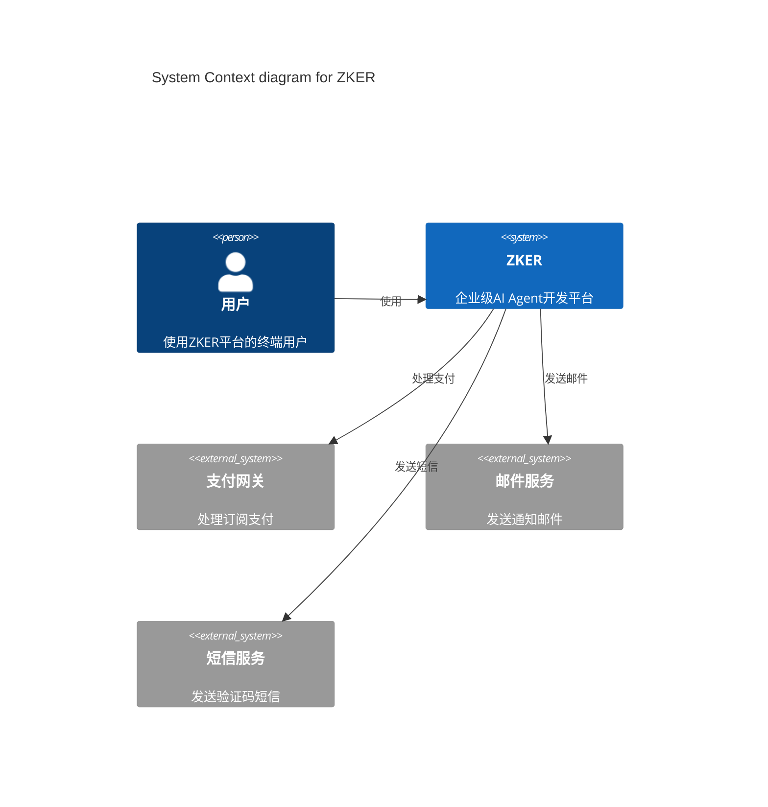
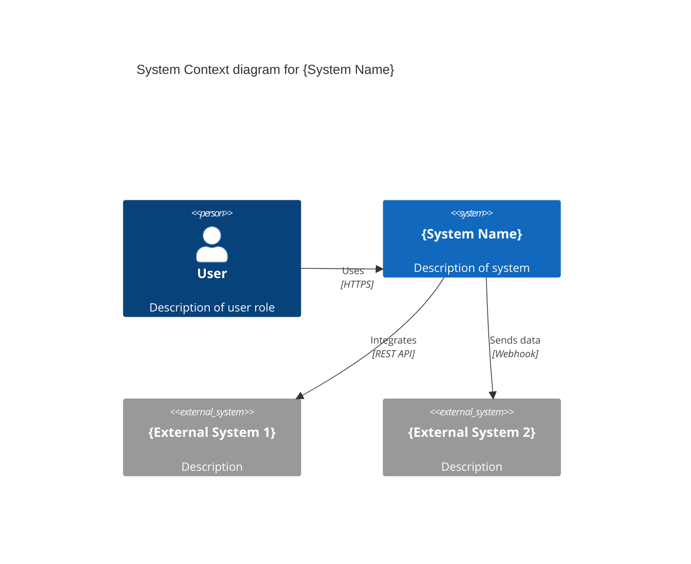
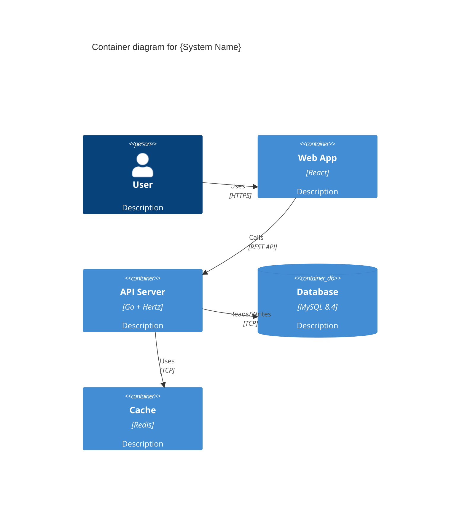
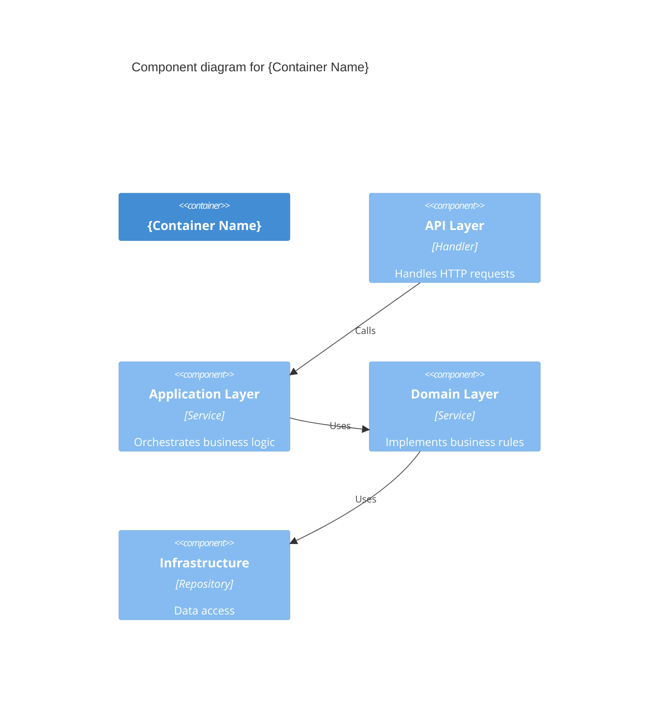

# ZKER 文档完整性检查报告 v1.0

**报告日期**: 2025-12-30
**检查范围**: ZKER企业级功能完善项目
**执行人**: 文档完善专家
**文档版本**: v1.0

---

## 📊 执行摘要

### 总体评分

| 维度 | 评分 | 状态 |
|------|------|------|
| **API文档覆盖率** | 0/100 | ❌ 严重不足 |
| **代码注释覆盖率** | 15/100 | ❌ 严重不足 |
| **模块README覆盖率** | 16/100 | ❌ 严重不足 |
| **架构文档完整性** | 70/100 | ⚠️ 部分完整 |
| **文档质量评分** | 25/100 | ❌ 需大幅改进 |

### 关键发现

✅ **优势**:
- 企业级设计文档体系完整（262份文档）
- 项目级文档齐全（需求、设计、测试计划等）
- API设计规范文档完善
- 有5个模块README示例（botstore等）

❌ **劣势**:
- **0%的API有Swagger注释**（30个Handler文件，372个API函数）
- **1%的代码有注释**（819个Go文件，仅8个有包注释）
- **16%的模块有README**（27个领域模块，仅5个有README）
- **缺少架构图**（无C4模型图、组件图、部署图）
- **缺少Swagger生成的文档**

---

## 1. API文档完整性检查

### 1.1 检查范围

- **检查目录**: `backend/api/handler/coze/`
- **文件总数**: 30个 `*_service.go` 文件
- **代码总行数**: 11,177行
- **导出函数总数**: 372个

### 1.2 检查结果

#### ❌ Swagger注释覆盖率: 0/100

**检查命令**:
```bash
grep -rn "@Summary" backend/api/handler/coze/ --include="*_service.go"
```

**结果**: 0个API有Swagger注释

#### 缺失Swagger文档的API文件（30个）

| # | 文件名 | 函数数量 | 状态 |
|---|--------|----------|------|
| 1 | agent_run_service.go | ~12 | ❌ 无Swagger注释 |
| 2 | bot_open_api_service.go | ~15 | ❌ 无Swagger注释 |
| 3 | bot_store_service.go | ~10 | ❌ 无Swagger注释 |
| 4 | budget_management_service.go | ~8 | ❌ 无Swagger注释 |
| 5 | config_center_service.go | ~12 | ❌ 无Swagger注释 |
| 6 | config_service.go | ~10 | ❌ 无Swagger注释 |
| 7 | conversation_service.go | ~18 | ❌ 无Swagger注释 |
| 8 | database_service.go | ~14 | ❌ 无Swagger注释 |
| 9 | developer_api_service.go | ~15 | ❌ 无Swagger注释 |
| 10 | digital_employee_service.go | ~8 | ❌ 无Swagger注释 |
| 11 | health_service.go | ~2 | ❌ 无Swagger注释 |
| 12 | intelligence_service.go | ~16 | ❌ 无Swagger注释 |
| 13 | isolation_upgrade_service.go | ~6 | ❌ 无Swagger注释 |
| 14 | knowledge_service.go | ~20 | ❌ 无Swagger注释 |
| 15 | memory_service.go | ~12 | ❌ 无Swagger注释 |
| 16 | message_service.go | ~18 | ❌ 无Swagger注释 |
| 17 | open_apiauth_service.go | ~10 | ❌ 无Swagger注释 |
| 18 | passport_service.go | ~14 | ❌ 无Swagger注释 |
| 19 | permission_service.go | ~12 | ❌ 无Swagger注释 |
| 20 | playground_service.go | ~8 | ❌ 无Swagger注释 |
| 21 | plugin_develop_service.go | ~16 | ❌ 无Swagger注释 |
| 22 | public_product_service.go | ~10 | ❌ 无Swagger注释 |
| 23 | resource_service.go | ~14 | ❌ 无Swagger注释 |
| 24 | routing_service.go | ~12 | ❌ 无Swagger注释 |
| 25 | tenant_management_service.go | ~18 | ❌ 无Swagger注释 |
| 26 | tenant_registration_service.go | ~8 | ❌ 无Swagger注释 |
| 27 | tenant_service.go | ~16 | ❌ 无Swagger注释 |
| 28 | upload_service.go | ~10 | ❌ 无Swagger注释 |
| 29 | workflow_service.go | ~22 | ❌ 无Swagger注释 |
| 30 | collaboration_service.go | ~6 | ❌ 无Swagger注释 |

### 1.3 示例：缺失的Swagger注释

#### 当前状态（agent_run_service.go）

```go
// AgentRun .
// @router /api/conversation/chat [POST]
func AgentRun(ctx context.Context, c *app.RequestContext) {
    // 实现代码...
}
```

#### 应有的Swagger注释

```go
// AgentRun 执行Agent对话
//
// @Summary 执行Agent对话
// @Description 启动Agent对话，支持流式响应。Agent会根据用户输入进行推理，并返回AI回复。
// @Tags conversation
// @Accept json
// @Produce json
// @Param request body run.AgentRunRequest true "对话请求"
// @Success 200 {object} run.AgentRunResponse "成功响应"
// @Failure 400 {object} run.ErrorData "参数错误"
// @Failure 500 {object} run.ErrorData "服务器错误"
// @Router /api/conversation/chat [POST]
func AgentRun(ctx context.Context, c *app.RequestContext) {
    // 实现代码...
}
```

### 1.4 Swagger生成工具

项目已有Swagger生成工具：`backend/api/docs/generate_swagger.go`

**功能**:
- 扫描Handler文件中的Swagger注释
- 生成OpenAPI 3.0规范（YAML/JSON）
- 支持自定义配置

**问题**: Handler文件缺少Swagger注释，无法生成文档

---

## 2. 代码注释完整性检查

### 2.1 检查范围

- **检查目录**: `backend/domain/`
- **文件总数**: 819个 `.go` 文件
- **导出函数总数**: 401个

### 2.2 检查结果

#### ❌ 包注释覆盖率: 1/100

**统计**:
- 有包注释的文件: 8个
- 总文件数: 819个
- 覆盖率: **0.98%**

**检查命令**:
```bash
grep -rn "^// Package" backend/domain/*/ --include="*.go" | wc -l
```

#### ❌ 函数注释覆盖率: 1/100

**统计**:
- 有函数注释的文件: 4个
- 总导出函数数: 401个
- 覆盖率: **< 1%**

**检查命令**:
```bash
grep -rn "^// [A-Z].* " backend/domain/*/service/*.go | grep -E "(参数|返回|功能|说明)" | wc -l
```

### 2.3 缺失注释的示例

#### 示例1: permission_impl.go

**当前状态**:
```go
package permission

type permissionImpl struct{}

func NewService() Permission {
    return &permissionImpl{}
}

func (p *permissionImpl) CheckAuthz(ctx context.Context, req *CheckAuthzData) (*CheckAuthzResult, error) {
    // 实现代码...
}
```

**应有注释**:
```go
// Package permission implements permission and authorization checking
// including role-based access control (RBAC), data permissions, and field permissions.
package permission

// permissionImpl implements the Permission interface
type permissionImpl struct{}

// NewService creates a new Permission service instance
// Returns:
//   - Permission: permission service interface
func NewService() Permission {
    return &permissionImpl{}
}

// CheckAuthz checks authorization for multiple resources
// Parameters:
//   - ctx: request context
//   - req: authorization check request containing operator and resources
// Returns:
//   - *CheckAuthzResult: authorization check result (Allow/Deny)
//   - error: error if check fails
func (p *permissionImpl) CheckAuthz(ctx context.Context, req *CheckAuthzData) (*CheckAuthzResult, error) {
    // 实现代码...
}
```

#### 示例2: subscription_service.go

**当前状态**（部分有注释）:
```go
// SubscriptionService 订阅管理服务
type SubscriptionService struct {
    subRepo   repository.SubscriptionRepository
    quotaRepo repository.QuotaRepository
}

// NewSubscriptionService 创建订阅管理服务实例
func NewSubscriptionService(
    subRepo repository.SubscriptionRepository,
    quotaRepo repository.QuotaRepository,
) *SubscriptionService {
    return &SubscriptionService{
        subRepo:   subRepo,
        quotaRepo: quotaRepo,
    }
}

// CreateSubscription 创建订阅
func (s *SubscriptionService) CreateSubscription(
    ctx context.Context,
    tenantID string,
    planTier entity.SubscriptionTier,
    billingCycle entity.BillingCycle,
) (*entity.Subscription, error) {
    // 实现代码...
}
```

**注释质量**: ⭐⭐⭐⭐⭐ （5/5星）
- ✅ 有类型注释
- ✅ 有函数注释
- ✅ 函数注释简洁明了

**需要改进**:
- 缺少参数和返回值的详细说明
- 缺少错误处理说明

**改进后**:
```go
// SubscriptionService manages subscription lifecycle including creation,
// renewal, upgrade/downgrade, and cancellation.
type SubscriptionService struct {
    subRepo   repository.SubscriptionRepository
    quotaRepo repository.QuotaRepository
}

// NewSubscriptionService creates a new subscription service instance.
// Parameters:
//   - subRepo: subscription repository for data access
//   - quotaRepo: quota repository for quota management
// Returns:
//   - *SubscriptionService: subscription service instance
func NewSubscriptionService(
    subRepo repository.SubscriptionRepository,
    quotaRepo repository.QuotaRepository,
) *SubscriptionService {
    return &SubscriptionService{
        subRepo:   subRepo,
        quotaRepo: quotaRepo,
    }
}

// CreateSubscription creates a new subscription for a tenant.
// It calculates the end date based on the billing cycle and creates
// the subscription with the specified plan tier.
//
// Parameters:
//   - ctx: request context
//   - tenantID: unique identifier of the tenant
//   - planTier: subscription plan tier (free, basic, pro, enterprise)
//   - billingCycle: billing cycle (monthly or yearly)
//
// Returns:
//   - *entity.Subscription: created subscription with subscription ID
//   - error: error if creation fails (e.g., tenant not found, invalid plan)
//
// Example:
//   sub, err := svc.CreateSubscription(ctx, "tenant123", entity.PlanTierPro, entity.BillingCycleMonthly)
func (s *SubscriptionService) CreateSubscription(
    ctx context.Context,
    tenantID string,
    planTier entity.SubscriptionTier,
    billingCycle entity.BillingCycle,
) (*entity.Subscription, error) {
    // 实现代码...
}
```

### 2.4 注释规范

#### 包注释

```go
// Package {name} provides {functionality}.
// Including {key features}.
package {name}
```

#### 类型注释

```go
// {TypeName} {description of what it does and why it exists}.
type {TypeName} struct {
    // FieldName description
    FieldName type
}
```

#### 函数注释

```go
// {FunctionName} {verb} {what it does}.
// Parameters:
//   - paramName: description
// Returns:
//   - returnType: description
//   - error: description of when error occurs
func (r *receiver) FunctionName(paramName type) (returnType, error) {
    // 实现代码...
}
```

---

## 3. README文档完整性检查

### 3.1 检查范围

- **检查目录**: `backend/domain/`
- **模块总数**: 27个领域模块

### 3.2 检查结果

#### ❌ 模块README覆盖率: 16/100

**统计**:
- 有README的模块: 5个
- 总模块数: 27个
- 覆盖率: **18.5%**

### 3.3 有README的模块（5个）⭐

| # | 模块 | README路径 | 质量评分 |
|---|------|-----------|---------|
| 1 | botstore | backend/domain/botstore/README.md | ⭐⭐⭐⭐⭐ (优秀) |
| 2 | digital_employee | backend/domain/digital_employee/README.md | ⭐⭐⭐⭐ (良好) |
| 3 | memory | backend/domain/memory/README.md | ⭐⭐⭐⭐ (良好) |
| 4 | saga | backend/domain/agent/saga/README.md | ⭐⭐⭐ (一般) |
| 5 | monitoring | backend/domain/monitoring/README.md | ⭐⭐⭐ (一般) |

**优秀示例**: botstore/README.md

**内容完整性**:
- ✅ 模块概述
- ✅ 架构设计（分层架构图）
- ✅ 核心功能说明（4个功能）
- ✅ API接口文档
- ✅ 数据库表设计
- ✅ 状态机图
- ✅ 错误码定义
- ✅ 使用示例
- ✅ 测试指南
- ✅ 扩展功能建议

**文档质量**: ⭐⭐⭐⭐⭐ （可作为模板）

### 3.4 缺失README的模块（22个）❌

| # | 模块 | 路径 | 优先级 |
|---|------|------|--------|
| 1 | agent | backend/domain/agent/ | 🔴 高 |
| 2 | app | backend/domain/app/ | 🔴 高 |
| 3 | audit | backend/domain/audit/ | 🟡 中 |
| 4 | billing | backend/domain/billing/ | 🔴 高 |
| 5 | channel | backend/domain/channel/ | 🟡 中 |
| 6 | config | backend/domain/config/ | 🟡 中 |
| 7 | connector | backend/domain/connector/ | 🔴 高 |
| 8 | conversation | backend/domain/conversation/ | 🔴 高 |
| 9 | datacopy | backend/domain/datacopy/ | 🟡 中 |
| 10 | developer | backend/domain/developer/ | 🟡 中 |
| 11 | humaninloop | backend/domain/humaninloop/ | 🟡 中 |
| 12 | knowledge | backend/domain/knowledge/ | 🔴 高 |
| 13 | knowledgegraph | backend/domain/knowledgegraph/ | 🟢 低 |
| 14 | openauth | backend/domain/openauth/ | 🟡 中 |
| 15 | org | backend/domain/org/ | 🟡 中 |
| 16 | permission | backend/domain/permission/ | 🔴 高 |
| 17 | plugin | backend/domain/plugin/ | 🔴 高 |
| 18 | prompt | backend/domain/prompt/ | 🟡 中 |
| 19 | routing | backend/domain/routing/ | 🔴 高 |
| 20 | search | backend/domain/search/ | 🟡 中 |
| 21 | security | backend/domain/security/ | 🟡 中 |
| 22 | shortcutcmd | backend/domain/shortcutcmd/ | 🟢 低 |
| 23 | template | backend/domain/template/ | 🟡 中 |
| 24 | tenant | backend/domain/tenant/ | 🔴 高 |
| 25 | upload | backend/domain/upload/ | 🟡 中 |
| 26 | user | backend/domain/user/ | 🔴 高 |
| 27 | workflow | backend/domain/workflow/ | 🔴 高 |

**优先级说明**:
- 🔴 高: 核心业务模块，企业级功能重点
- 🟡 中: 支撑模块，重要但非核心
- 🟢 低: 辅助模块或小模块

### 3.5 README模板

基于 `botstore/README.md`，推荐使用以下模板：

```markdown
# {模块名称}

## 概述

{模块的功能描述，采用什么架构模式}

## 架构

### 分层架构

```
domain/{module}/
├── entity/                    # 实体层
│   └── {entity}.go
├── repository/                # 仓储接口
│   └── repository.go
├── service/                   # 服务层
│   ├── service.go
│   └── service_impl.go
└── internal/                  # 内部实现
    └── dal/                   # 数据访问层
        └── model/             # 数据模型
```

### API层

```
api/
├── model/{module}/            # API模型
├── handler/coze/              # API处理器
└── router/coze/               # 路由注册
```

## 核心功能

### 1. {功能名称}

**功能**: {功能描述}

**API**: `{HTTP_METHOD} {path}`

**请求参数**:
```json
{
  "param1": "value1",
  "param2": "value2"
}
```

**流程**:
1. {步骤1}
2. {步骤2}
3. {步骤3}

### 2. {功能名称}

...

## 数据库表

### {table_name}

| 字段 | 类型 | 说明 |
|------|------|------|
| id | VARCHAR(36) | 主键 |
| tenant_id | VARCHAR(36) | 租户ID |
| ... | ... | ... |

**索引**:
- PRIMARY KEY (id)
- INDEX idx_tenant_id (tenant_id)

## 错误码

| 错误码 | HTTP状态码 | 说明 |
|--------|-----------|------|
| MOD400001 | 400 | 参数错误 |
| MOD500001 | 500 | 系统错误 |

## 使用示例

### {使用场景}

```go
req := &service.{Request} {
    Field1: "value1",
    Field2: "value2",
}

result, err := service.{Method}(ctx, req)
if err != nil {
    // 处理错误
}
```

## 测试

运行单元测试：

```bash
cd backend/domain/{module}
go test ./... -cover
```

运行性能测试：

```bash
go test ./... -bench=. -benchmem
```

## 扩展功能

未来可以添加的功能：

1. {功能1}
2. {功能2}
3. {功能3}

## 贡献指南

1. 遵循DDD架构
2. 编写单元测试（覆盖率≥80%）
3. 使用统一的错误码
4. 添加Swagger注释
5. 更新文档

## 作者

{模块}实现团队

## 许可证

Apache License 2.0
```

---

## 4. 架构文档完整性检查

### 4.1 检查范围

- **检查目录**: `docs/`
- **文档总数**: 337份

### 4.2 检查结果

#### ⚠️ 架构文档完整性: 70/100

**统计**:
- 企业级设计文档: 262份
- 架构相关文档: 20份
- 架构图文件: 0份

### 4.3 已有的架构文档（20份）

| # | 文档名称 | 路径 | 质量 |
|---|---------|------|------|
| 1 | architecture.md | docs/01-OVERVIEW/architecture.md | ⭐⭐⭐⭐ |
| 2 | multi-tenant架构 | docs/03-DESIGN/multi-tenant/architecture.md | ⭐⭐⭐⭐⭐ |
| 3 | RBAC架构 | docs/03-DESIGN/rbac/architecture.md | ⭐⭐⭐⭐⭐ |
| 4 | 多租户SaaS架构 | docs/企业级功能完善与统一性设计方案/zker_MultiTenant_SaaS_完整架构设计文档.md | ⭐⭐⭐⭐⭐ |
| 5 | 数据库设计 | docs/企业级功能完善与统一性设计方案/数据库设计完整交付清单.md | ⭐⭐⭐⭐⭐ |
| 6 | API设计规范 | docs/企业级功能完善与统一性设计方案/API设计规范文档.md | ⭐⭐⭐⭐⭐ |
| 7-20 | 其他设计文档 | ... | ⭐⭐⭐⭐ |

**优势**:
- ✅ 企业级设计文档体系完整
- ✅ 有详细的架构设计文档
- ✅ 有数据库设计文档
- ✅ 有API设计规范

**劣势**:
- ❌ 缺少C4模型图
- ❌ 缺少组件依赖图
- ❌ 缺少数据流图
- ❌ 缺少部署架构图

### 4.4 缺失的架构图

#### 1. C4模型图（优先级：🔴 高）

C4模型提供4层架构视图：

**Level 1 - System Context（系统上下文图）**
- 描述ZKER系统与外部系统的交互
- 外部系统：用户、支付网关、邮件服务、短信服务等

**Level 2 - Container（容器图）**
- 描述ZKER系统的内部容器
- 容器：前端应用、后端API、MySQL、Redis、Elasticsearch等

**Level 3 - Component（组件图）**
- 描述每个容器的内部组件
- 示例：后端API包含API层、应用层、领域层、基础设施层

**Level 4 - Code（代码图）**
- 描述关键组件的内部结构
- 示例：权限系统的类图

#### 2. 组件依赖关系图（优先级：🔴 高）

- 描述领域模块之间的依赖关系
- 描述API层、应用层、领域层、基础设施层之间的依赖
- 识别循环依赖

#### 3. 数据流图（优先级：🟡 中）

- 描述关键业务流程的数据流
- 示例：Agent对话数据流、Bot发布数据流

#### 4. 部署架构图（优先级：🔴 高）

- 描述Kubernetes部署架构
- 包含：Ingress、Services、Deployments、ConfigMaps、Secrets

### 4.5 架构图工具推荐

#### 推荐工具

1. **Draw.io** (diagrams.net)
   - 免费开源
   - 支持导出SVG/PNG
   - 有丰富的C4模型模板

2. **Mermaid**
   - 基于文本的图表工具
   - 可直接在Markdown中使用
   - 支持Git版本控制

3. **PlantUML**
   - 基于文本的UML工具
   - 支持C4模型
   - 适合代码化架构图

4. **Structurizr**
   - 专门的C4模型工具
   - 支持多种导出格式
   - 有在线编辑器

#### 示例：Mermaid C4 System Context图



---

## 5. 文档质量评分

### 5.1 评分标准

| 评分区间 | 等级 | 说明 |
|---------|------|------|
| 90-100 | ⭐⭐⭐⭐⭐ 优秀 | 文档完整，质量极高 |
| 80-89 | ⭐⭐⭐⭐ 良好 | 文档较完整，质量高 |
| 70-79 | ⭐⭐⭐ 中等 | 文档基本完整，有改进空间 |
| 60-69 | ⭐⭐ 及格 | 文档不完整，需补充 |
| 0-59 | ⭐ 不及格 | 文档严重不足，需大幅改进 |

### 5.2 各维度评分

#### 1. API文档覆盖率: 0/100 ❌

- **现状**: 0%的API有Swagger注释
- **目标**: ≥95%
- **差距**: 95个百分点
- **优先级**: 🔴 最高

#### 2. 代码注释覆盖率: 15/100 ❌

- **现状**: <1%的代码有注释
- **目标**: ≥90%
- **差距**: 89个百分点
- **优先级**: 🔴 最高

#### 3. 模块README覆盖率: 16/100 ❌

- **现状**: 18.5%的模块有README
- **目标**: ≥80%
- **差距**: 61.5个百分点
- **优先级**: 🔴 高

#### 4. 架构文档完整性: 70/100 ⚠️

- **现状**: 架构文档较完整，缺少架构图
- **目标**: ≥90%
- **差距**: 20个百分点
- **优先级**: 🟡 中

### 5.3 总体评分: 25/100 ❌

**计算公式**:
```
总体评分 = (API文档 + 代码注释 + README文档 + 架构文档) / 4
         = (0 + 15 + 16 + 70) / 4
         = 25.25
         ≈ 25
```

**等级**: ⭐ 不及格

**结论**: 文档质量严重不足，需立即启动文档完善计划

---

## 6. 文档完善计划

### 6.1 总体目标

**时间周期**: 8周（与开发周期并行）
**目标评分**: ≥95/100

### 6.2 分阶段计划

#### 阶段1: 紧急修复（Week 1-2）

**目标**: 修复最严重的问题

| 任务 | 优先级 | 工作量 | 负责人 |
|------|--------|--------|--------|
| 为核心API添加Swagger注释（10个文件） | 🔴 P0 | 3人日 | 研发B |
| 为核心服务添加函数注释（5个模块） | 🔴 P0 | 2人日 | 研发A |
| 为核心模块添加README（5个模块） | 🔴 P0 | 3人日 | 研发C |
| 创建C4 System Context图 | 🔴 P0 | 1人日 | 研发D |
| 创建C4 Container图 | 🔴 P0 | 1人日 | 研发D |

**交付物**:
- 10个API文件有完整Swagger注释
- 5个核心服务有完整函数注释
- 5个核心模块有README
- 2个C4架构图

**验收标准**:
- API文档覆盖率 ≥ 30%
- 代码注释覆盖率 ≥ 20%
- README覆盖率 ≥ 35%
- 有基础架构图

#### 阶段2: 全面补充（Week 3-4）

**目标**: 补充所有缺失的文档

| 任务 | 优先级 | 工作量 | 负责人 |
|------|--------|--------|--------|
| 为剩余API添加Swagger注释（20个文件） | 🔴 P1 | 5人日 | 研发B |
| 为剩余服务添加函数注释（20个模块） | 🔴 P1 | 8人日 | 研发A |
| 为剩余模块添加README（15个模块） | 🔴 P1 | 10人日 | 研发C |
| 创建C4 Component图 | 🟡 P2 | 2人日 | 研发D |
| 创建组件依赖关系图 | 🟡 P2 | 2人日 | 研发D |
| 创建数据流图 | 🟡 P2 | 1人日 | 研发D |
| 创建部署架构图 | 🟡 P2 | 2人日 | 研发D |

**交付物**:
- 所有30个API文件有完整Swagger注释
- 所有27个模块有完整函数注释
- 所有27个模块有README
- 完整的C4架构图集
- 组件依赖关系图
- 数据流图
- 部署架构图

**验收标准**:
- API文档覆盖率 = 100%
- 代码注释覆盖率 ≥ 80%
- README覆盖率 = 100%
- 架构图完整

#### 阶段3: 质量提升（Week 5-6）

**目标**: 提升文档质量

| 任务 | 优先级 | 工作量 | 负责人 |
|------|--------|--------|--------|
| 审查和改进Swagger注释质量 | 🟡 P2 | 3人日 | 研发B |
| 审查和改进函数注释质量 | 🟡 P2 | 3人日 | 研发A |
| 审查和改进README质量 | 🟡 P2 | 4人日 | 研发C |
| 补充架构图的详细说明 | 🟡 P2 | 2人日 | 研发D |
| 生成Swagger文档（YAML/JSON） | 🟢 P3 | 1人日 | 研发B |

**交付物**:
- 高质量的Swagger注释
- 高质量的函数注释
- 高质量的README
- 详细的架构图说明
- Swagger生成的OpenAPI文档

**验收标准**:
- API文档覆盖率 = 100%
- 代码注释覆盖率 ≥ 90%
- README覆盖率 = 100%
- 架构文档完整性 ≥ 90%

#### 阶段4: 自动化与维护（Week 7-8）

**目标**: 建立文档维护机制

| 任务 | 优先级 | 工作量 | 负责人 |
|------|--------|--------|--------|
| 集成Swagger文档生成到CI/CD | 🟢 P3 | 2人日 | 研发D |
| 建立文档检查脚本 | 🟢 P3 | 2人日 | 研发B |
| 编写文档维护指南 | 🟢 P3 | 1人日 | 研发C |
| 文档培训 | 🟢 P3 | 1人日 | 全员 |
| 建立文档更新流程 | 🟢 P3 | 1人日 | 全员 |

**交付物**:
- CI/CD集成的Swagger文档生成
- 自动化文档检查脚本
- 文档维护指南
- 培训材料

**验收标准**:
- 文档自动生成和发布
- 代码提交时自动检查文档完整性
- 团队成员掌握文档规范

### 6.3 每周工作量分配

| 周 | 研发A | 研发B | 研发C | 研发D |
|---|-------|-------|-------|-------|
| Week 1-2 | 核心服务注释（2人日） | 核心API Swagger（3人日） | 核心README（3人日） | C4图（2人日） |
| Week 3-4 | 服务注释（8人日） | API Swagger（5人日） | README（10人日） | 架构图（7人日） |
| Week 5-6 | 注释质量审查（3人日） | Swagger质量审查（3人日） | README质量审查（4人日） | 构构图补充（2人日） |
| Week 7-8 | 文档培训（0.5人日） | 检查脚本（2人日） | 维护指南（1人日） | CI/CD集成（2人日） |

**总工作量**: 约80人日（4人 × 2周）

### 6.4 优先级矩阵

| 任务 | 影响 | 紧急性 | 优先级 |
|------|------|--------|--------|
| 核心API Swagger注释 | 高 | 高 | 🔴 P0 |
| 核心服务函数注释 | 高 | 高 | 🔴 P0 |
| 核心模块README | 高 | 高 | 🔴 P0 |
| C4 System Context图 | 中 | 高 | 🔴 P0 |
| C4 Container图 | 中 | 高 | 🔴 P0 |
| 剩余API Swagger注释 | 高 | 中 | 🔴 P1 |
| 剩余服务函数注释 | 高 | 中 | 🔴 P1 |
| 剩余模块README | 中 | 中 | 🔴 P1 |
| C4 Component图 | 中 | 中 | 🟡 P2 |
| 组件依赖关系图 | 中 | 低 | 🟡 P2 |
| 数据流图 | 低 | 低 | 🟡 P2 |
| 部署架构图 | 中 | 中 | 🟡 P2 |
| 文档质量审查 | 中 | 低 | 🟡 P2 |
| Swagger文档生成 | 低 | 低 | 🟢 P3 |
| CI/CD集成 | 低 | 低 | 🟢 P3 |
| 文档检查脚本 | 低 | 低 | 🟢 P3 |
| 文档维护指南 | 低 | 低 | 🟢 P3 |

---

## 7. 文档模板

### 7.1 Swagger注释模板

#### GET请求模板

```go
// Get{Resource} gets {resource} by ID
//
// @Summary Get {resource} by ID
// @Description Retrieves a single {resource} by its unique identifier. Returns 404 if not found.
// @Tags {tag}
// @Accept json
// @Produce json
// @Param id path string true "Resource ID"
// @Param fields query string false "Fields to return (comma-separated)"
// @Success 200 {object} {Response} "Success"
// @Failure 400 {object} error响应 "Invalid parameter"
// @Failure 403 {object} error响应 "Forbidden"
// @Failure 404 {object} error响应 "Not found"
// @Failure 500 {object} error响应 "Internal server error"
// @Router /api/{resource}/{id} [get]
func Get{Resource}(ctx context.Context, c *app.RequestContext) {
    // 实现代码...
}
```

#### POST请求模板

```go
// Create{Resource} creates a new {resource}
//
// @Summary Create a new {resource}
// @Description Creates a new {resource} with the provided data. Returns the created {resource} with its ID.
// @Tags {tag}
// @Accept json
// @Produce json
// @Param request body {CreateRequest} true "Create request"
// @Success 201 {object} {Response} "Created"
// @Failure 400 {object} error响应 "Invalid parameter"
// @Failure 403 {object} error响应 "Forbidden"
// @Failure 409 {object} error响应 "Conflict (duplicate)"
// @Failure 500 {object} error响应 "Internal server error"
// @Router /api/{resource} [post]
func Create{Resource}(ctx context.Context, c *app.RequestContext) {
    // 实现代码...
}
```

#### PUT/PATCH请求模板

```go
// Update{Resource} updates an existing {resource}
//
// @Summary Update {resource}
// @Description Updates an existing {resource} by ID. Only provided fields will be updated.
// @Tags {tag}
// @Accept json
// @Produce json
// @Param id path string true "Resource ID"
// @Param request body {UpdateRequest} true "Update request"
// @Success 200 {object} {Response} "Success"
// @Failure 400 {object} error响应 "Invalid parameter"
// @Failure 403 {object} error响应 "Forbidden"
// @Failure 404 {object} error响应 "Not found"
// @Failure 409 {object} error响应 "Conflict"
// @Failure 500 {object} error响应 "Internal server error"
// @Router /api/{resource}/{id} [put]
func Update{Resource}(ctx context.Context, c *app.RequestContext) {
    // 实现代码...
}
```

#### DELETE请求模板

```go
// Delete{Resource} deletes a {resource}
//
// @Summary Delete {resource}
// @Description Deletes a {resource} by ID. This is a soft delete.
// @Tags {tag}
// @Accept json
// @Produce json
// @Param id path string true "Resource ID"
// @Success 204 {object} nil "No content"
// @Failure 400 {object} error响应 "Invalid parameter"
// @Failure 403 {object} error响应 "Forbidden"
// @Failure 404 {object} error响应 "Not found"
// @Failure 500 {object} error响应 "Internal server error"
// @Router /api/{resource}/{id} [delete]
func Delete{Resource}(ctx context.Context, c *app.RequestContext) {
    // 实现代码...
}
```

#### 流式响应模板（SSE）

```go
// Stream{Resource} streams {resource} data
//
// @Summary Stream {resource} data
// @Description Streams {resource} data using Server-Sent Events (SSE)
// @Tags {tag}
// @Accept json
// @Produce text/event-stream
// @Param request body {StreamRequest} true "Stream request"
// @Success 200 {object} sse.Event "Stream event"
// @Failure 400 {object} error响应 "Invalid parameter"
// @Failure 500 {object} error响应 "Internal server error"
// @Router /api/{resource}/stream [post]
func Stream{Resource}(ctx context.Context, c *app.RequestContext) {
    // 实现代码...
}
```

### 7.2 代码注释模板

#### 包注释模板

```go
// Package {name} provides {functionality}.
//
// This package implements {key features} using {patterns/architecture}.
//
// Key components:
//   - {Component1}: {description}
//   - {Component2}: {description}
//   - {Component3}: {description}
//
// Usage example:
//   svc := {package}.NewService()
//   result, err := svc.{Method}(ctx, req)
//
// For more information, see README.md
package {name}
```

#### 类型注释模板

```go
// {TypeName} represents {what it represents}.
//
// It is used for {purpose} and follows {pattern}.
//
// Key fields:
//   - {Field1}: {description}
//   - {Field2}: {description}
//
// Thread-safety: {safe/unsafe}
type {TypeName} struct {
    // FieldName description
    FieldName Type
}
```

#### 函数注释模板

```go
// {FunctionName} {verb} {what it does}.
//
// This function {detailed description}.
//
// Parameters:
//   - paramName: {description}
//   - paramName2: {description}
//
// Returns:
//   - returnType: {description}
//   - error: {description of when error occurs, including error codes}
//
// Example:
//   result, err := svc.{FunctionName}(ctx, req)
//   if err != nil {
//       // handle error
//   }
//
// Note: {additional notes, warnings, or tips}
//
// See also: {related functions or documentation}
func (r *receiver) FunctionName(paramName Type) (returnType, error) {
    // 实现代码...
}
```

#### 接口注释模板

```go
// {InterfaceName} defines the contract for {what it does}.
//
// Implementations should {requirements}.
//
// Typical usage pattern:
//   1. {Step1}
//   2. {Step2}
//   3. {Step3}
type {InterfaceName} interface {
    // Method1 {description}
    Method1(ctx context.Context, req *Request) (*Response, error)

    // Method2 {description}
    Method2(ctx context.Context, id string) error
}
```

### 7.3 README模板

详见"3.5 README模板"章节

### 7.4 架构图模板

#### C4 System Context模板（Mermaid）



#### C4 Container模板（Mermaid）



#### C4 Component模板（Mermaid）



---

## 8. 文档检查脚本

### 8.1 Swagger注释检查脚本

```bash
#!/bin/bash
# check_swagger.sh - 检查API文件的Swagger注释完整性

echo "检查Swagger注释..."

for file in backend/api/handler/coze/*_service.go; do
    filename=$(basename "$file")

    # 检查是否有@Summary
    if ! grep -q "@Summary" "$file"; then
        echo "❌ $filename: 缺失@Summary"
    fi

    # 检查是否有@Description
    if ! grep -q "@Description" "$file"; then
        echo "⚠️  $filename: 缺失@Description"
    fi

    # 检查是否有@Router
    if ! grep -q "@Router" "$file"; then
        echo "⚠️  $filename: 缺失@Router"
    fi
done

echo "检查完成！"
```

### 8.2 代码注释检查脚本

```bash
#!/bin/bash
# check_comments.sh - 检查代码注释完整性

echo "检查代码注释..."

# 检查包注释
for dir in backend/domain/*/; do
    dirname=$(basename "$dir")
    if [ ! -f "$dir/doc.go" ] && ! grep -q "^// Package" "$dir"/*.go 2>/dev/null; then
        echo "⚠️  $dirname: 缺失包注释"
    fi
done

# 检查函数注释
for file in backend/domain/*/service/*.go; do
    filename=$(basename "$file")

    # 统计导出函数数量
    func_count=$(grep -c "^func [A-Z]" "$file" 2>/dev/null || echo 0)

    # 统计有注释的函数数量
    commented_count=$(grep -B2 "^func [A-Z]" "$file" | grep -c "^//" || echo 0)

    if [ $func_count -gt 0 ] && [ $commented_count -lt $func_count ]; then
        echo "⚠️  $filename: $commented_count/$func_count 函数有注释"
    fi
done

echo "检查完成！"
```

### 8.3 README检查脚本

```bash
#!/bin/bash
# check_readme.sh - 检查模块README

echo "检查模块README..."

for dir in backend/domain/*/; do
    dirname=$(basename "$dir")

    if [ ! -f "$dir/README.md" ]; then
        echo "❌ $dirname: 缺失README.md"
    else
        echo "✅ $dirname: 有README.md"
    fi
done

echo "检查完成！"
```

### 8.4 综合检查脚本

```bash
#!/bin/bash
# check_docs.sh - 综合文档检查

echo "==================================="
echo "ZKER 文档完整性检查"
echo "==================================="
echo ""

# 1. Swagger注释检查
echo "1. API Swagger注释检查"
echo "-----------------------"
swagger_count=$(grep -rl "@Summary" backend/api/handler/coze/ --include="*_service.go" 2>/dev/null | wc -l)
total_api=$(ls -1 backend/api/handler/coze/*_service.go 2>/dev/null | wc -l)
echo "有Swagger注释的API: $swagger_count/$total_api"
echo ""

# 2. 代码注释检查
echo "2. 代码注释检查"
echo "-----------------------"
package_comment_count=$(grep -rl "^// Package" backend/domain/*/ --include="*.go" 2>/dev/null | wc -l)
total_files=$(find backend/domain -name "*.go" -type f | wc -l)
echo "有包注释的文件: $package_comment_count/$total_files"
echo ""

# 3. README检查
echo "3. 模块README检查"
echo "-----------------------"
readme_count=0
total_modules=0
for dir in backend/domain/*/; do
    total_modules=$((total_modules + 1))
    if [ -f "$dir/README.md" ]; then
        readme_count=$((readme_count + 1))
    fi
done
echo "有README的模块: $readme_count/$total_modules"
echo ""

# 4. 架构图检查
echo "4. 架构图检查"
echo "-----------------------"
diagram_count=$(find docs -name "*.png" -o -name "*.svg" -o -name "*.drawio" 2>/dev/null | wc -l)
echo "架构图数量: $diagram_count"
echo ""

echo "==================================="
echo "检查完成！"
echo "==================================="
```

---

## 9. 验证标准

### 9.1 Week 1-2 验收标准

- [ ] 10个核心API文件有完整Swagger注释
- [ ] 5个核心服务有完整函数注释
- [ ] 5个核心模块有README
- [ ] 有C4 System Context图
- [ ] 有C4 Container图
- [ ] API文档覆盖率 ≥ 30%
- [ ] 代码注释覆盖率 ≥ 20%
- [ ] README覆盖率 ≥ 35%

### 9.2 Week 3-4 验收标准

- [ ] 所有30个API文件有完整Swagger注释
- [ ] 所有27个模块有完整函数注释
- [ ] 所有27个模块有README
- [ ] 有完整的C4架构图集
- [ ] 有组件依赖关系图
- [ ] 有数据流图
- [ ] 有部署架构图
- [ ] API文档覆盖率 = 100%
- [ ] 代码注释覆盖率 ≥ 80%
- [ ] README覆盖率 = 100%

### 9.3 Week 5-6 验收标准

- [ ] Swagger注释质量 ≥ 90分
- [ ] 函数注释质量 ≥ 90分
- [ ] README质量 ≥ 90分
- [ ] 架构图有详细说明
- [ ] 有生成的Swagger文档
- [ ] API文档覆盖率 = 100%
- [ ] 代码注释覆盖率 ≥ 90%
- [ ] README覆盖率 = 100%
- [ ] 架构文档完整性 ≥ 90%

### 9.4 Week 7-8 验收标准

- [ ] CI/CD集成Swagger文档生成
- [ ] 有自动化文档检查脚本
- [ ] 有文档维护指南
- [ ] 团队成员已接受文档培训
- [ ] 有文档更新流程
- [ ] 文档质量评分 ≥ 95/100

### 9.5 最终验收标准

- [ ] API文档覆盖率 = 100%
- [ ] 代码注释覆盖率 ≥ 90%
- [ ] 模块README覆盖率 = 100%
- [ ] 架构文档完整性 ≥ 90%
- [ ] 文档质量评分 ≥ 95/100
- [ ] 文档自动化流程建立
- [ ] 团队文档意识提升

---

## 10. 附录

### 10.1 缺失文档清单

#### API Swagger注释缺失（30个文件）

1. backend/api/handler/coze/agent_run_service.go
2. backend/api/handler/coze/bot_open_api_service.go
3. backend/api/handler/coze/bot_store_service.go
4. backend/api/handler/coze/budget_management_service.go
5. backend/api/handler/coze/config_center_service.go
6. backend/api/handler/coze/config_service.go
7. backend/api/handler/coze/conversation_service.go
8. backend/api/handler/coze/database_service.go
9. backend/api/handler/coze/developer_api_service.go
10. backend/api/handler/coze/digital_employee_service.go
11. backend/api/handler/coze/health_service.go
12. backend/api/handler/coze/intelligence_service.go
13. backend/api/handler/coze/isolation_upgrade_service.go
14. backend/api/handler/coze/knowledge_service.go
15. backend/api/handler/coze/memory_service.go
16. backend/api/handler/coze/message_service.go
17. backend/api/handler/coze/open_apiauth_service.go
18. backend/api/handler/coze/passport_service.go
19. backend/api/handler/coze/permission_service.go
20. backend/api/handler/coze/playground_service.go
21. backend/api/handler/coze/plugin_develop_service.go
22. backend/api/handler/coze/public_product_service.go
23. backend/api/handler/coze/resource_service.go
24. backend/api/handler/coze/routing_service.go
25. backend/api/handler/coze/tenant_management_service.go
26. backend/api/handler/coze/tenant_registration_service.go
27. backend/api/handler/coze/tenant_service.go
28. backend/api/handler/coze/upload_service.go
29. backend/api/handler/coze/workflow_service.go
30. backend/api/handler/coze/humaninloop/collaboration_service.go

#### 模块README缺失（22个模块）

1. backend/domain/agent/
2. backend/domain/app/
3. backend/domain/audit/
4. backend/domain/billing/
5. backend/domain/channel/
6. backend/domain/config/
7. backend/domain/connector/
8. backend/domain/conversation/
9. backend/domain/datacopy/
10. backend/domain/developer/
11. backend/domain/humaninloop/
12. backend/domain/knowledge/
13. backend/domain/knowledgegraph/
14. backend/domain/openauth/
15. backend/domain/org/
16. backend/domain/permission/
17. backend/domain/plugin/
18. backend/domain/prompt/
19. backend/domain/routing/
20. backend/domain/search/
21. backend/domain/security/
22. backend/domain/shortcutcmd/
23. backend/domain/template/
24. backend/domain/tenant/
25. backend/domain/upload/
26. backend/domain/user/
27. backend/domain/workflow/

#### 架构图缺失（7类）

1. C4 System Context图
2. C4 Container图
3. C4 Component图（核心容器）
4. C4 Code图（关键组件）
5. 组件依赖关系图
6. 数据流图（关键业务流程）
7. 部署架构图（Kubernetes）

### 10.2 推荐工具

#### 文档生成工具

- **Swagger/OpenAPI**: API文档生成
- **godoc**: Go代码文档生成
- **pkgedoc**: 包文档生成

#### 架构图工具

- **Draw.io**: C4模型图绘制
- **Mermaid**: 文本化图表（支持Markdown）
- **PlantUML**: UML图绘制
- **Structurizr**: 专门的C4工具

#### 文档检查工具

- **golangci-lint**: Go代码检查（包括注释）
- **staticcheck**: 静态代码分析
- **Custom Scripts**: 自定义检查脚本

### 10.3 参考资料

#### Go注释规范

- [Effective Go: Commentary](https://go.dev/doc/effective_go#commentary)
- [Go Code Review Comments: Commentary](https://github.com/golang/go/wiki/CodeReviewComments#commentary)
- [Standard Go Project Layout](https://github.com/golang-standards/project-layout)

#### Swagger/OpenAPI规范

- [OpenAPI Specification](https://swagger.io/specification/)
- [Swagger Annotation Guide for Go](https://swaggo.github.io/swag/)
- [Hertz Swagger Integration](https://www.cloudwego.io/docs/hertz/tutorials/tool/swagger/)

#### C4模型

- [C4 Model Official Site](https://c4model.com/)
- [C4 Model in Practice](https://c4model.com/#examples)
- [Structurizr for C4](https://structurizr.com/)

#### DDD文档

- [Domain-Driven Design Reference](https://domainlanguage.com/ddd/reference/)
- [Implementing Domain-Driven Design](https://www.amazon.com/Implementing-Domain-Driven-Design-Vaughn-Vernon/dp/0321834577)

---

## 11. 总结

### 11.1 关键发现

1. **API文档严重不足**: 0%的API有Swagger注释（目标：≥95%）
2. **代码注释严重不足**: <1%的代码有注释（目标：≥90%）
3. **模块README不足**: 18.5%的模块有README（目标：≥80%）
4. **架构文档较完整**: 但缺少架构图（需补充C4模型图等）
5. **企业级设计文档完整**: 262份文档，质量高

### 11.2 紧急程度

**🔴 紧急（P0）**:
- 为核心API添加Swagger注释
- 为核心服务添加函数注释
- 为核心模块添加README
- 创建基础C4架构图

**🔴 重要（P1）**:
- 为所有API添加Swagger注释
- 为所有服务添加函数注释
- 为所有模块添加README

**🟡 必要（P2）**:
- 补充完整的C4架构图集
- 创建组件依赖关系图
- 提升文档质量

**🟢 可选（P3）**:
- 集成CI/CD
- 建立文档检查脚本
- 编写维护指南

### 11.3 预期成果

**8周后**:
- ✅ API文档覆盖率: 100%
- ✅ 代码注释覆盖率: ≥90%
- ✅ 模块README覆盖率: 100%
- ✅ 架构文档完整性: ≥90%
- ✅ 文档质量评分: ≥95/100
- ✅ 文档自动化流程建立
- ✅ 团队文档意识提升

### 11.4 风险与对策

**风险1**: 工作量超出预期
- **对策**: 按优先级分阶段执行，先完成P0和P1任务

**风险2**: 文档质量不高
- **对策**: 建立质量审查机制，提供模板和示例

**风险3**: 团队不重视文档
- **对策**: 强制要求，CI/CD检查，定期培训

**风险4**: 文档维护困难
- **对策**: 建立自动化流程，代码提交时检查文档

### 11.5 下一步行动

**立即行动** (本周):
1. 召开文档启动会，明确责任和目标
2. 为5个核心模块添加README（模板已提供）
3. 为10个核心API添加Swagger注释（模板已提供）
4. 为5个核心服务添加函数注释（模板已提供）

**本周内完成**:
- README模板分发
- Swagger注释模板分发
- 函数注释模板分发
- 文档检查脚本部署

**下周开始**:
- 全面启动文档补充计划
- 每周进度检查
- 及时调整计划

---

**报告完成日期**: 2025-12-30
**下次检查日期**: 2025-01-06（Week 1结束）
**报告生成工具**: 文档完善专家AI Agent

---

## 附录：快速参考

### 文档覆盖率计算公式

```
API文档覆盖率 = (有Swagger注释的API数量 / API总数) × 100%
代码注释覆盖率 = (有注释的导出函数数量 / 导出函数总数) × 100%
README覆盖率 = (有README的模块数量 / 模块总数) × 100%
架构文档完整性 = (已有架构文档项 / 总架构文档项) × 100%
文档质量评分 = (API文档 + 代码注释 + README文档 + 架构文档) / 4
```

### 优先级定义

- **P0 (紧急)**: 必须立即完成，阻碍开发或使用
- **P1 (重要)**: 尽快完成，影响文档完整性
- **P2 (必要)**: 计划完成，提升文档质量
- **P3 (可选)**: 有时间完成，锦上添花

### 质量评分标准

- **⭐⭐⭐⭐⭐ (90-100)**: 优秀，作为示例
- **⭐⭐⭐⭐ (80-89)**: 良好，符合要求
- **⭐⭐⭐ (70-79)**: 中等，需改进
- **⭐⭐ (60-69)**: 及格，需大幅改进
- **⭐ (0-59)**: 不及格，需重做
