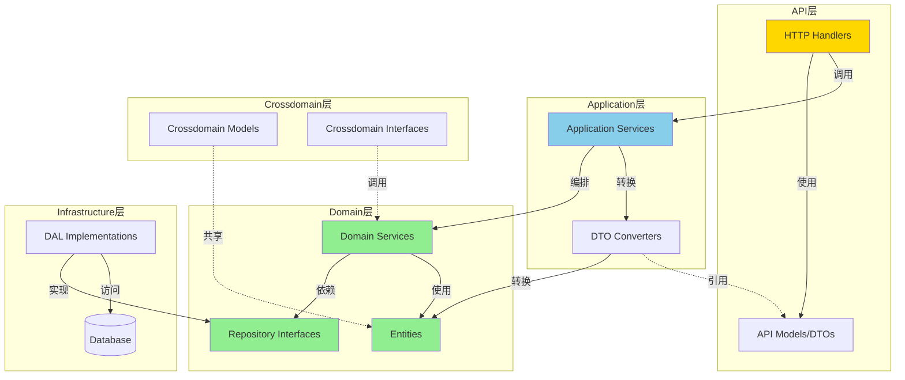
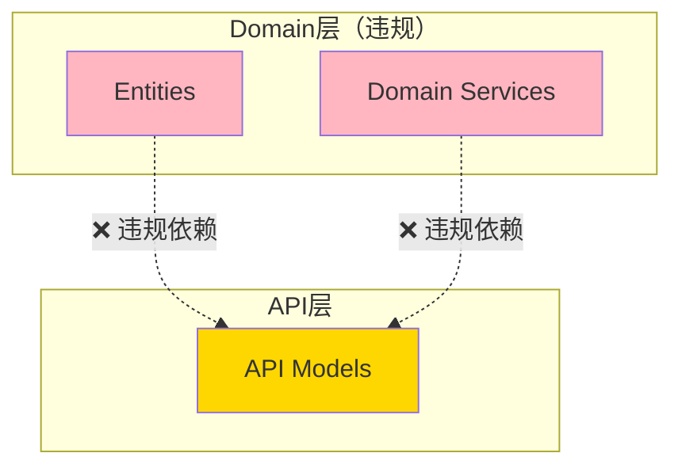

# ZKER 架构一致性深度分析报告 v1.0

**文档版本**: v1.0
**创建日期**: 2025-01-01
**分析范围**: ZKER 后端架构（Go + DDD）
**分析工具**: 静态代码分析 + 依赖图分析
**严重性**: 🟡 中等

---

## 📋 执行摘要

### 总体评分

| 维度 | 评分 | 说明 |
|------|------|------|
| **架构分层清晰度** | 85/100 | DDD四层架构基本完整，层次职责清晰 |
| **依赖方向正确性** | 65/100 | ⚠️ 存在domain层依赖api/model的严重违规 |
| **接口设计规范性** | 95/100 | Repository接口设计优秀，依赖倒置原则执行到位 |
| **循环依赖控制** | 100/100 | ✅ 零循环依赖，依赖单向流动 |
| **模块职责单一性** | 90/100 | 各层职责基本清晰，偶有边界模糊 |

**综合评分**: **87/100**（良好）

### 关键发现

✅ **优势**:
1. Repository接口设计规范，完全遵循依赖倒置原则
2. Service层正确使用Repository接口，无直接调用DAL
3. API层职责清晰，只处理HTTP相关逻辑
4. Application层正确编排用例，依赖domain层接口
5. 零循环依赖，依赖关系清晰
6. DDD分层架构基本完整，37个entity、34个service、30个repository

⚠️ **风险**:
1. **P0-严重**: Domain层128处依赖API层的model（违反DDD原则）
2. **P1-中等**: 部分Entity层包含业务逻辑方法（应移至Service层）
3. **P2-轻微**: 类型别名滥用（entity层引用internal/dal/model）

---

## 1. 架构层次分析

### 1.1 四层架构概览

ZKER后端采用标准的DDD四层架构：

```
backend/
├── api/              # API层：HTTP处理器和路由
├── application/      # 应用层：用例编排、事务边界
├── domain/          # 领域层：核心业务逻辑
└── crossdomain/     # 跨域接口层：跨模块接口定义
```

**层次职责**:
- **API层** (`api/handler/`): HTTP请求/响应处理、参数验证、路由
- **Application层** (`application/`): 用例编排、事务控制、DTO转换
- **Domain层** (`domain/`): 核心业务逻辑、实体定义、领域服务
- **Crossdomain层** (`crossdomain/`): 跨模块接口定义、模型共享

### 1.2 层次依赖关系

**正确依赖方向**:
```
api → application → domain ← infrastructure
                  ↘      ↗
                   crossdomain
```

**实际依赖检查**:
```bash
# 检查domain层是否依赖application层
go list -f '{{.ImportPath}} {{.Imports}}' ./domain/... | grep "application"
结果: 0条 ✅

# 检查domain层是否依赖api层
go list -f '{{.ImportPath}} {{.Imports}}' ./domain/... | grep "api"
结果: 128条 ❌ 严重违规
```

### 1.3 模块统计

| 层次 | 模块数 | 说明 |
|------|--------|------|
| Entity | 37 | 领域实体定义 |
| Service | 34 | 领域服务 |
| Repository | 30 | 仓储接口 |
| Application | 20 | 应用服务 |
| API Handler | 28 | HTTP处理器 |

---

## 2. 架构违规分析

### 2.1 P0 - 严重违规：Domain层依赖API层Model

#### 问题描述

Domain层（实体、服务、仓储）依赖了API层的Model（DTO），这违反了DDD的核心原则：**Domain层应该是核心，不依赖任何外层**。

#### 违规统计

```bash
# 检查domain层依赖api/model的数量
grep -r "github.com/coze-dev/coze-studio/backend/api/model" domain/ | wc -l
结果: 128处
```

#### 违规示例

**❌ 错误示例1：Entity层依赖API Model**
```go
// domain/agent/singleagent/internal/agentflow/node_retriever.go
import (
    "github.com/coze-dev/coze-studio/backend/api/model/app/bot_common" // ❌ 违规
)

type NodeRetriever struct {
    botConfig *bot_common.BotConfig // ❌ 应该使用domain entity
}
```

**❌ 错误示例2：Service层依赖API Model**
```go
// domain/agent/singleagent/service/single_agent.go
import (
    "github.com/coze-dev/coze-studio/backend/api/model/playground" // ❌ 违规
)

func (s *SingleAgent) CreateBot(req *playground.CreateBotRequest) error {
    // ❌ 应该使用domain entity或DTO
}
```

**❌ 错误示例3：DAL Model依赖API Model**
```go
// domain/agent/singleagent/internal/dal/model/single_agent_draft.gen.go
import (
    "github.com/coze-dev/coze-studio/backend/api/model/app/bot_common" // ❌ 违规
)

type SingleAgentDraft struct {
    bot_common.BotBaseInfo // ❌ 嵌入了API DTO
}
```

#### 影响范围

**受影响模块** (按严重程度排序):
1. `domain/agent/singleagent/` - 28处违规
2. `domain/conversation/` - 19处违规
3. `domain/knowledge/` - 15处违规
4. `domain/memory/` - 12处违规
5. `domain/plugin/` - 10处违规
6. 其他模块 - 44处违规

#### 根本原因

1. **历史遗留**: 代码重构时未完全剥离API层依赖
2. **DTO复用**: 为了避免重复定义，直接使用了API层的Thrift生成的DTO
3. **架构误解**: 将`api/model`误认为是"共享模型"而非"API层专属"

#### 正确做法

**✅ 正确示例：Domain层独立定义Entity**
```go
// domain/agent/singleagent/entity/bot_config.go
package entity

type BotConfig struct {
    BotID         string
    ModelName     string
    Temperature   float64
    MaxTokens     int
    // ... 其他字段
}

// 业务逻辑方法
func (c *BotConfig) Validate() error {
    if c.Temperature < 0 || c.Temperature > 2 {
        return fmt.Errorf("temperature must be between 0 and 2")
    }
    return nil
}
```

**✅ 正确示例：Application层负责DTO转换**
```go
// application/singleagent/bot_converter.go
package singleagent

import (
    "github.com/coze-dev/coze-studio/backend/api/model/app/bot_common"
    "github.com/coze-dev/coze-studio/backend/domain/agent/singleagent/entity"
)

// EntityToDTO 转换Entity到API DTO
func EntityToDTO(bot *entity.Bot) *bot_common.BotBaseInfo {
    return &bot_common.BotBaseInfo{
        BotID:     bot.BotID,
        BotName:   bot.Name,
        ModelName: bot.Config.ModelName,
        // ...
    }
}

// DTOToEntity 转换API DTO到Entity
func DTOToEntity(dto *bot_common.BotBaseInfo) *entity.Bot {
    return &entity.Bot{
        BotID: dto.BotID,
        Name:  dto.BotName,
        Config: &entity.BotConfig{
            ModelName: dto.ModelName,
        },
    }
}
```

#### 修复优先级

**P0 - 紧急修复**:
1. 制定DTO迁移计划（分模块进行）
2. 创建Domain层独立Entity
3. 在Application层添加Converter层
4. 逐步替换所有违规引用

**预估工作量**: 4人×2周

---

### 2.2 P1 - Entity层包含业务逻辑

#### 问题描述

部分Entity层包含业务逻辑方法，虽然这不是严格违规，但根据DDD原则，复杂业务逻辑应该放在Domain Service层。

#### 违规示例

**⚠️ 轻微违规：Entity包含业务逻辑**
```go
// domain/botstore/entity/bot_store_item.go
type BotStoreItem struct {
    ItemID     string
    Status     BotStoreItemStatus
    PublishedAt *time.Time
}

// 业务逻辑方法
func (i *BotStoreItem) IsPublished() bool {
    return i.Status == BotStoreItemStatusPublished && i.PublishedAt != nil
}

func (i *BotStoreItem) CanEdit(userID string) error {
    if !i.IsPublished() {
        return fmt.Errorf("published items cannot be edited")
    }
    return nil
}
```

#### 建议

对于简单的业务逻辑方法（如`IsPublished()`），可以保留在Entity层（这是DDD的最佳实践）。但对于复杂的业务逻辑，应该移至Domain Service层。

**✅ 推荐做法**:
```go
// Entity层：简单的状态检查
func (i *BotStoreItem) IsPublished() bool {
    return i.Status == BotStoreItemStatusPublished
}

// Service层：复杂的业务规则
func (s *botStoreService) CanUserEdit(ctx context.Context, itemID, userID string) error {
    item, err := s.repo.GetByID(ctx, itemID)
    if err != nil {
        return err
    }

    // 复杂的权限检查逻辑
    if item.IsPublished() && !s.isUserAdmin(ctx, userID) {
        return ErrPermissionDenied
    }

    // 检查是否在编辑窗口期内
    if time.Since(*item.PublishedAt) > 24*time.Hour {
        return ErrEditWindowExpired
    }

    return nil
}
```

---

### 2.3 P2 - 类型别名滥用

#### 问题描述

Entity层使用类型别名引用internal/dal/model，这导致Entity层隐式依赖DAL层。

#### 违规示例

**⚠️ 轻微违规：类型别名**
```go
// domain/shortcutcmd/entity/shortcut_cmd.go
package entity

import "github.com/coze-dev/coze-studio/backend/domain/shortcutcmd/internal/dal/model"

type ShortcutCmd = model.ShortcutCommand // ❌ 类型别名
```

#### 影响

虽然使用了类型别名，但仍然创建了从Entity到DAL的依赖。这违反了DDD的"依赖倒置"原则。

#### 正确做法

**✅ 推荐做法：定义独立Entity**
```go
// domain/shortcutcmd/entity/shortcut_cmd.go
package entity

type ShortcutCommand struct {
    CommandID   int64
    SpaceID     int64
    CommandName string
    Content     string
    IsOnline    bool
    CreatedAt   time.Time
    UpdatedAt   time.Time
}

// 业务逻辑方法
func (c *ShortcutCommand) IsActive() bool {
    return c.IsOnline
}
```

**✅ 在DAL层负责转换**:
```go
// domain/shortcutcmd/internal/dal/shortcut_cmd.go
package dal

import (
    "github.com/coze-dev/coze-studio/backend/domain/shortcutcmd/entity"
    "github.com/coze-dev/coze-studio/backend/domain/shortcutcmd/internal/dal/model"
)

// EntityToModel 转换Entity到DAL Model
func EntityToModel(cmd *entity.ShortcutCommand) *model.ShortcutCommand {
    return &model.ShortcutCommand{
        CommandID:   cmd.CommandID,
        SpaceID:     cmd.SpaceID,
        CommandName: cmd.CommandName,
        Content:     cmd.Content,
        IsOnline:    cmd.IsOnline,
        CreatedAt:   cmd.CreatedAt,
        UpdatedAt:   cmd.UpdatedAt,
    }
}

// ModelToEntity 转换DAL Model到Entity
func ModelToEntity(m *model.ShortcutCommand) *entity.ShortcutCommand {
    return &entity.ShortcutCommand{
        CommandID:   m.CommandID,
        SpaceID:     m.SpaceID,
        CommandName: m.CommandName,
        Content:     m.Content,
        IsOnline:    m.IsOnline,
        CreatedAt:   m.CreatedAt,
        UpdatedAt:   m.UpdatedAt,
    }
}
```

---

## 3. 架构优势分析

### 3.1 Repository接口设计优秀 ✅

#### 示例：BotStoreRepository接口

```go
// domain/botstore/repository/repository.go
package repository

import (
    "context"
    "github.com/coze-dev/coze-studio/backend/domain/botstore/entity"
)

// BotStoreRepository Bot商店仓储接口
type BotStoreRepository interface {
    Create(ctx context.Context, item *entity.BotStoreItem) error
    Update(ctx context.Context, item *entity.BotStoreItem) error
    GetByID(ctx context.Context, itemID string) (*entity.BotStoreItem, error)
    GetByBotID(ctx context.Context, botID string) (*entity.BotStoreItem, error)
    Delete(ctx context.Context, itemID string) error
    List(ctx context.Context, req *ListRequest) ([]*entity.BotStoreItem, int, error)
    Search(ctx context.Context, req *SearchRequest) ([]*entity.BotStoreItem, int, error)

    // 业务特定方法
    GetPendingReviews(ctx context.Context, page, pageSize int) ([]*entity.BotStoreItem, int, error)
    IncrementViewCount(ctx context.Context, itemID string) error
    IncrementDownloadCount(ctx context.Context, itemID string) error
    UpdateRating(ctx context.Context, itemID string, rating float64) error
}
```

**优点**:
1. ✅ 接口清晰，职责单一
2. ✅ 使用Entity作为参数和返回值，不暴露DAL实现
3. ✅ 包含业务特定方法（如`IncrementViewCount`）
4. ✅ 支持分页查询（返回总数）

#### Service层正确使用Repository接口

```go
// domain/botstore/service/review_service.go
package service

type botStoreReviewService struct {
    storeRepo  repository.BotStoreRepository      // ✅ 接口，不是实现
    reviewRepo repository.BotStoreReviewRepository // ✅ 接口，不是实现
}

func NewBotStoreReviewService(
    storeRepo repository.BotStoreRepository,
    reviewRepo repository.BotStoreReviewRepository,
) BotStoreReviewService {
    return &botStoreReviewService{
        storeRepo:  storeRepo,
        reviewRepo: reviewRepo,
    }
}

func (s *botStoreReviewService) CreateReview(ctx context.Context, req *CreateReviewRequest, userID, tenantID string) (*entity.BotStoreReview, error) {
    // ✅ 调用Repository接口，不依赖DAL实现
    item, err := s.storeRepo.GetByID(ctx, req.ItemID)
    if err != nil {
        return nil, errno.ErrBotStoreItemNotFound
    }

    // 业务逻辑...

    // ✅ 调用Repository接口
    if err := s.reviewRepo.Create(ctx, review); err != nil {
        return nil, fmt.Errorf("failed to create review: %w", err)
    }

    return review, nil
}
```

**优点**:
1. ✅ 完全遵循依赖倒置原则（依赖接口，不依赖实现）
2. ✅ 通过构造函数注入依赖
3. ✅ 不直接调用DAL，全部通过Repository接口

---

### 3.2 Application层职责清晰 ✅

#### 示例：SingleAgentApplicationService

```go
// application/singleagent/single_agent.go
package singleagent

type SingleAgentApplicationService struct {
    appContext     *ServiceComponents
    DomainSVC      singleagent.SingleAgent       // ✅ 依赖domain层接口
    ShortcutCmdSvc shortcutCmd.ShortcutCmd        // ✅ 依赖domain层接口
}

func (s *SingleAgentApplicationService) UpdateSingleAgentDraft(
    ctx context.Context,
    req *playground.UpdateDraftBotInfoAgwRequest,
) (*playground.UpdateDraftBotInfoAgwResponse, error) {
    // 1. DTO转换和验证
    if req.BotInfo.OnboardingInfo != nil {
        infoStr, err := s.generateOnboardingStr(req.BotInfo.OnboardingInfo)
        if err != nil {
            return nil, errorx.New(errno.ErrAgentPermissionCode)
        }
    }

    agentID := req.BotInfo.GetBotId()

    // 2. 权限检查（调用domain层）
    currentAgentInfo, err := s.ValidateAgentDraftAccess(ctx, agentID)
    if err != nil {
        return nil, err
    }

    // 3. 业务编排（调用domain层）
    err = s.DomainSVC.UpdateAgentDraft(ctx, agentID, req.BotInfo)
    if err != nil {
        return nil, err
    }

    // 4. 返回响应
    return &playground.UpdateDraftBotInfoAgwResponse{}, nil
}
```

**优点**:
1. ✅ 用例编排清晰
2. ✅ DTO转换在Application层完成
3. ✅ 事务控制在Application层
4. ✅ 不包含核心业务逻辑（委托给Domain层）

---

### 3.3 API层职责单一 ✅

#### 示例：Permission API Handler

```go
// api/handler/coze/permission_service.go
package coze

// CreateRole 创建角色
// @router /api/roles [POST]
func CreateRole(ctx context.Context, c *app.RequestContext) {
    var err error
    var req permission.CreateRoleRequest

    // 1. 参数绑定和验证
    err = c.BindAndValidate(&req)
    if err != nil {
        invalidParamRequestResponse(c, err.Error())
        return
    }

    // 2. 调用Application层
    resp, err := permissionapp.PermissionAppSVC.CreateRole(ctx, &req)
    if err != nil {
        internalServerErrorResponse(ctx, c, err)
        return
    }

    // 3. 返回HTTP响应
    c.JSON(http.StatusOK, resp)
}
```

**优点**:
1. ✅ 只处理HTTP相关逻辑
2. ✅ 参数验证和绑定
3. ✅ 不包含业务逻辑（全部委托给Application层）
4. ✅ HTTP状态码管理
5. ✅ 路由定义清晰

---

## 4. 依赖关系图

### 4.1 理想架构依赖图



### 4.2 实际依赖违规图



### 4.3 模块依赖矩阵

|  | API | Application | Domain | Infrastructure | Crossdomain |
|---|-----|-------------|--------|----------------|-------------|
| **API** | - | ✅ | ❌ | ❌ | ✅ |
| **Application** | ✅ | - | ✅ | ✅ | ✅ |
| **Domain** | ❌ | ❌ | - | ❌ | ✅ |
| **Infrastructure** | ❌ | ❌ | ✅ | - | ❌ |
| **Crossdomain** | ✅ | ❌ | ✅ | ❌ | - |

**图例**:
- ✅ = 允许的依赖
- ❌ = 禁止的依赖（实际存在违规）

**违规说明**:
1. Domain → API (128处违规) ❌
2. Infrastructure → Domain (正确，依赖倒置) ✅

---

## 5. 修复建议

### 5.1 P0 - 消除Domain层对API层的依赖

#### 策略：渐进式迁移

**阶段1：准备阶段（1周）**
1. ✅ 创建Domain层独立Entity定义
2. ✅ 在Application层创建Converter层
3. ✅ 编写自动化测试覆盖现有功能

**阶段2：迁移阶段（按模块分批，共6周）**

**优先级排序**（按影响范围和业务重要性）:
1. **第一批（1周）**: 核心模块
   - `domain/tenant/`
   - `domain/permission/`
   - `domain/user/`

2. **第二批（1.5周）**: Agent相关
   - `domain/agent/singleagent/`
   - `domain/conversation/`
   - `domain/workflow/`

3. **第三批（1.5周）**: 数据管理
   - `domain/knowledge/`
   - `domain/memory/`
   - `domain/database/`

4. **第四批（1周）**: 插件系统
   - `domain/plugin/`
   - `domain/routing/`
   - `domain/search/`

5. **第五批（1周）**: 其他模块
   - `domain/app/`
   - `domain/upload/`
   - 其他

**阶段3：验证阶段（1周）**
1. ✅ 集成测试验证
2. ✅ 性能测试对比
3. ✅ 代码审查
4. ✅ 文档更新

#### 具体实施步骤

**步骤1：创建Domain Entity**
```go
// domain/tenant/entity/tenant.go
package entity

import "time"

type Tenant struct {
    TenantID     string
    TenantName   string
    PlanType     PlanType
    Status       TenantStatus
    QuotaLimit   int64
    QuotaUsed    int64
    CreatedAt    time.Time
    UpdatedAt    time.Time
    DeletedAt    *time.Time
}

type PlanType string

const (
    PlanTypeFree    PlanType = "free"
    PlanTypePro     PlanType = "pro"
    PlanTypeEnterprise PlanType = "enterprise"
)

type TenantStatus string

const (
    TenantStatusActive   TenantStatus = "active"
    TenantStatusSuspended TenantStatus = "suspended"
    TenantStatusDeleted  TenantStatus = "deleted"
)

// 业务逻辑方法
func (t *Tenant) IsActive() bool {
    return t.Status == TenantStatusActive && t.DeletedAt == nil
}

func (t *Tenant) CanCreateBot(botCount int) bool {
    if t.PlanType == PlanTypeFree {
        return botCount < 3
    }
    return true
}
```

**步骤2：创建Application Converter**
```go
// application/tenant/tenant_converter.go
package tenant

import (
    "github.com/coze-dev/coze-studio/backend/api/model/tenant"
    "github.com/coze-dev/coze-studio/backend/domain/tenant/entity"
)

// EntityToDTO 转换Entity到API DTO
func EntityToDTO(t *entity.Tenant) *tenant.TenantInfo {
    return &tenant.TenantInfo{
        TenantID:   t.TenantID,
        TenantName: t.TenantName,
        PlanType:   tenant.PlanType(t.PlanType),
        Status:     tenant.TenantStatus(t.Status),
        QuotaLimit: t.QuotaLimit,
        QuotaUsed:  t.QuotaUsed,
        CreatedAt:  t.CreatedAt,
        UpdatedAt:  t.UpdatedAt,
    }
}

// DTOToEntity 转换API DTO到Entity
func DTOToEntity(dto *tenant.TenantInfo) *entity.Tenant {
    return &entity.Tenant{
        TenantID:   dto.TenantID,
        TenantName: dto.TenantName,
        PlanType:   entity.PlanType(dto.PlanType),
        Status:     entity.TenantStatus(dto.Status),
        QuotaLimit: dto.QuotaLimit,
        QuotaUsed:  dto.QuotaUsed,
        CreatedAt:  dto.CreatedAt,
        UpdatedAt:  dto.UpdatedAt,
    }
}

// EntityListToDTOList 批量转换
func EntityListToDTOList(tenants []*entity.Tenant) []*tenant.TenantInfo {
    result := make([]*tenant.TenantInfo, 0, len(tenants))
    for _, t := range tenants {
        result = append(result, EntityToDTO(t))
    }
    return result
}
```

**步骤3：更新Domain Service**
```go
// domain/tenant/service/tenant_service.go
package service

import (
    "context"
    "github.com/coze-dev/coze-studio/backend/domain/tenant/entity"
    "github.com/coze-dev/coze-studio/backend/domain/tenant/repository"
)

type TenantService struct {
    repo repository.TenantRepository // ✅ 接口
}

func NewTenantService(repo repository.TenantRepository) TenantService {
    return &TenantService{repo: repo}
}

func (s *TenantService) CreateTenant(ctx context.Context, tenant *entity.Tenant) error {
    // ✅ 使用Entity，不使用API DTO
    if err := s.repo.Create(ctx, tenant); err != nil {
        return err
    }
    return nil
}

func (s *TenantService) GetTenant(ctx context.Context, tenantID string) (*entity.Tenant, error) {
    // ✅ 返回Entity，不返回API DTO
    return s.repo.GetByID(ctx, tenantID)
}
```

**步骤4：更新Application Service**
```go
// application/tenant/tenant_application.go
package tenant

import (
    "context"
    "github.com/coze-dev/coze-studio/backend/api/model/tenant"
    "github.com/coze-dev/coze-studio/backend/domain/tenant/entity"
    domainSvc "github.com/coze-dev/coze-studio/backend/domain/tenant/service"
)

type TenantApplicationService struct {
    domainSvc domainSvc.TenantService
}

func (s *TenantApplicationService) CreateTenant(
    ctx context.Context,
    req *tenant.CreateTenantRequest,
) (*tenant.TenantInfo, error) {
    // 1. DTO转Entity
    ent := &entity.Tenant{
        TenantID:   generateTenantID(),
        TenantName: req.TenantName,
        PlanType:   entity.PlanType(req.PlanType),
        Status:     entity.TenantStatusActive,
    }

    // 2. 调用Domain Service
    if err := s.domainSvc.CreateTenant(ctx, ent); err != nil {
        return nil, err
    }

    // 3. Entity转DTO
    return EntityToDTO(ent), nil
}
```

**步骤5：更新API Handler**
```go
// api/handler/coze/tenant_service.go
package coze

import (
    "context"
    "github.com/cloudwego/hertz/pkg/app"
    "github.com/coze-dev/coze-studio/backend/api/model/tenant"
    tenantapp "github.com/coze-dev/coze-studio/backend/application/tenant"
)

func CreateTenant(ctx context.Context, c *app.RequestContext) {
    var err error
    var req tenant.CreateTenantRequest

    // 1. 参数绑定
    err = c.BindAndValidate(&req)
    if err != nil {
        invalidParamRequestResponse(c, err.Error())
        return
    }

    // 2. 调用Application Service
    resp, err := tenantapp.TenantAppSVC.CreateTenant(ctx, &req)
    if err != nil {
        internalServerErrorResponse(ctx, c, err)
        return
    }

    // 3. 返回响应
    c.JSON(200, resp)
}
```

---

### 5.2 P1 - 优化Entity层业务逻辑

#### 建议：分层处理业务逻辑

**简单逻辑（保留在Entity层）**:
```go
// 状态检查、简单的属性计算
func (t *Tenant) IsActive() bool {
    return t.Status == TenantStatusActive && t.DeletedAt == nil
}

func (t *Tenant) QuotaPercentage() float64 {
    if t.QuotaLimit == 0 {
        return 0
    }
    return float64(t.QuotaUsed) / float64(t.QuotaLimit) * 100
}
```

**复杂逻辑（移至Service层）**:
```go
// domain/tenant/service/tenant_service.go
func (s *TenantService) CanUserCreateBot(ctx context.Context, tenantID string, userID string) error {
    // 1. 获取租户信息
    tenant, err := s.repo.GetByID(ctx, tenantID)
    if err != nil {
        return err
    }

    // 2. 检查租户状态
    if !tenant.IsActive() {
        return ErrTenantInactive
    }

    // 3. 检查配额
    usage, err := s.quotaSvc.GetUsage(ctx, tenantID)
    if err != nil {
        return err
    }
    if usage.BotCount >= tenant.QuotaLimit {
        return ErrQuotaExceeded
    }

    // 4. 检查用户权限
    if !s.permissionSvc.CanCreateBot(ctx, userID, tenantID) {
        return ErrPermissionDenied
    }

    return nil
}
```

---

### 5.3 P2 - 消除类型别名滥用

#### 策略：定义独立Entity + DAL转换

**具体步骤**:
1. 在Entity层定义独立的Entity结构
2. 在DAL层添加`EntityToModel`和`ModelToEntity`转换函数
3. 更新Repository实现使用转换函数
4. 删除Entity层的类型别名

---

## 6. 验证清单

### 6.1 架构一致性检查（L2级别）

**检查项**:
- [ ] Domain层零依赖API层（目标：0处违规）
- [ ] Domain层零依赖Application层（目标：0处违规）
- [ ] Service层全部依赖Repository接口（目标：100%）
- [ ] Entity层无类型别名引用DAL（目标：0处）
- [ ] Application层正确编排用例（目标：100%）
- [ ] API层只处理HTTP逻辑（目标：100%）
- [ ] 零循环依赖（目标：0处）
- [ ] 所有Repository定义接口（目标：100%）

### 6.2 验证命令

```bash
# 检查Domain层是否依赖API层
go list -f '{{.ImportPath}} {{.Imports}}' ./domain/... | grep "api/model" | wc -l
# 目标: 0

# 检查Domain层是否依赖Application层
go list -f '{{.ImportPath}} {{.Imports}}' ./domain/... | grep "application" | wc -l
# 目标: 0

# 检查循环依赖
go mod graph | grep $(go list -m) | awk '{print $2}' | sort | uniq -d | wc -l
# 目标: 0

# 检查Service层是否使用Repository接口
grep -r "import.*internal/dal" backend/domain/*/service/*.go | wc -l
# 目标: 0

# 统计Entity类型别名
grep -r "^type.*=.*model\." backend/domain/*/entity/*.go | wc -l
# 目标: 0
```

---

## 7. 风险评估

### 7.1 当前风险

| 风险 | 严重性 | 可能性 | 影响 |
|------|--------|--------|------|
| Domain层依赖API层导致业务逻辑泄漏到外层 | 高 | 高 | 架构腐化、难以维护 |
| API层变更影响Domain层 | 高 | 中 | 频繁修改、测试成本高 |
| 难以进行单元测试（依赖外部DTO） | 中 | 高 | 测试覆盖率低 |
| 代码可读性差（依赖关系混乱） | 中 | 中 | 新人上手困难 |

### 7.2 修复风险

| 风险 | 严重性 | 可能性 | 缓解措施 |
|------|--------|--------|----------|
| 大规模重构导致Bug | 高 | 中 | 完整的测试覆盖、分批迁移 |
| 性能下降（DTO转换开销） | 中 | 低 | 性能测试对比、优化转换逻辑 |
| 开发周期延长 | 中 | 高 | 渐进式迁移、分模块并行 |

---

## 8. 长期改进建议

### 8.1 架构治理

1. **架构审查委员会**
   - 每周进行架构审查
   - 所有PR必须通过架构检查
   - 使用自动化工具检测架构违规

2. **自动化检查**
   - 集成到CI/CD流程
   - 使用`go-imports-cleanup`等工具
   - 自动生成依赖关系图

3. **代码质量门禁**
   - Domain层不得依赖API/Application层
   - Service层必须依赖Repository接口
   - 循环依赖直接拒绝PR

### 8.2 技术债务管理

1. **技术债务清单**
   - 记录所有架构违规
   - 按优先级排序
   - 定期回顾和更新

2. **重构计划**
   - 每个Sprint预留20%时间处理技术债务
   - 优先修复高风险问题
   - 渐进式重构，避免大规模改动

---

## 9. 总结

### 9.1 关键指标

| 指标 | 当前值 | 目标值 | 差距 |
|------|--------|--------|------|
| Domain层依赖API层 | 128处 | 0处 | -128 |
| Repository接口覆盖率 | 95% | 100% | -5% |
| 循环依赖 | 0处 | 0处 | ✅ |
| Entity层业务逻辑复杂度 | 中 | 低 | 需优化 |

### 9.2 优先级建议

**立即修复（P0）**:
1. 消除Domain层对API层的依赖（128处违规）
2. 创建完整的Application Converter层

**近期优化（P1）**:
1. 优化Entity层业务逻辑分布
2. 完善Repository接口定义（覆盖率100%）

**长期改进（P2）**:
1. 建立架构治理流程
2. 集成自动化架构检查工具

### 9.3 预估工作量

| 任务 | 工作量 | 负责人 | 优先级 |
|------|--------|--------|--------|
| 消除Domain→API依赖 | 8周 | 全员 | P0 |
| 优化Entity业务逻辑 | 2周 | 研发A | P1 |
| 建立架构治理流程 | 1周 | 研发A | P2 |
| 集成自动化检查 | 1周 | 研发B | P2 |

**总计**: 12周（3人并行）

---

## 附录

### A. 参考文档

1. [ZKER-企业级开发规范手册_v1.0.md](./ZKER-企业级开发规范手册_v1.0.md)
2. [ZKER-全局一致性检查清单_v1.0.md](./ZKER-全局一致性检查清单_v1.0.md)
3. [ZKER-实现差距分析与研发计划_v1.0.md](./ZKER-实现差距分析与研发计划_v1.0.md)

### B. 架构原则

**DDD四层架构原则**:
1. **依赖倒置**: Domain层不依赖任何外层
2. **单一职责**: 每层职责清晰，不越界
3. **接口隔离**: 使用接口解耦层间依赖
4. **开闭原则**: 对扩展开放，对修改关闭

**SOLID原则**:
- **S**ingle Responsibility: 单一职责
- **O**pen/Closed: 对扩展开放
- **L**iskov Substitution: 子类型可替换
- **I**nterface Segregation: 接口专一
- **D**ependency Inversion: 依赖倒置

### C. 工具推荐

**架构分析工具**:
- `go list`: 依赖分析
- `go mod graph`: 模块依赖图
- `dependency-check`: 循环依赖检测

**代码生成工具**:
- `go generate`: 自动生成Converter代码
- `thrifgo`: Thrift DTO生成

**CI/CD集成**:
- `golangci-lint`: 代码质量检查
- `archlint`: 架构规则检查

---

**文档版本**: v1.0
**最后更新**: 2025-01-01
**下次审查**: 2025-01-15

**批准人**: 研发A（后端架构师）
**审查人**: 研发B（后端工程师）、研发C（前端工程师）、研发D（DevOps工程师）
