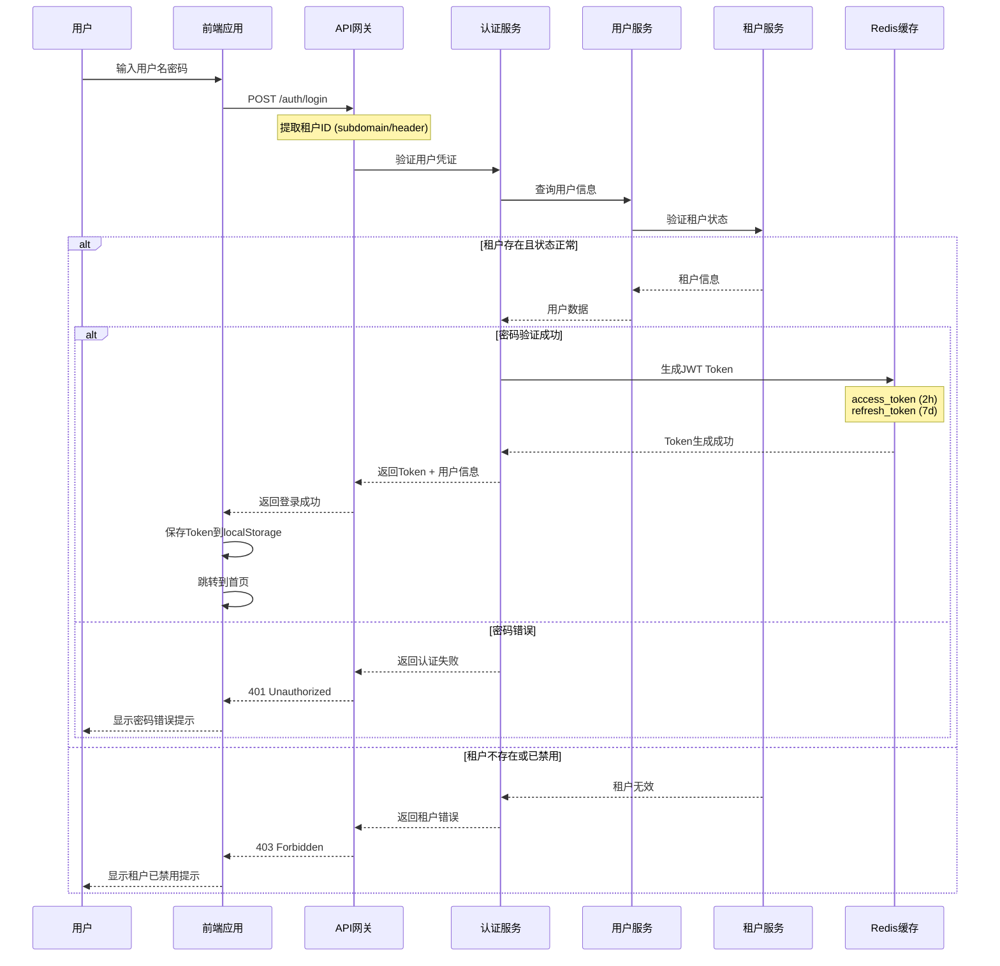
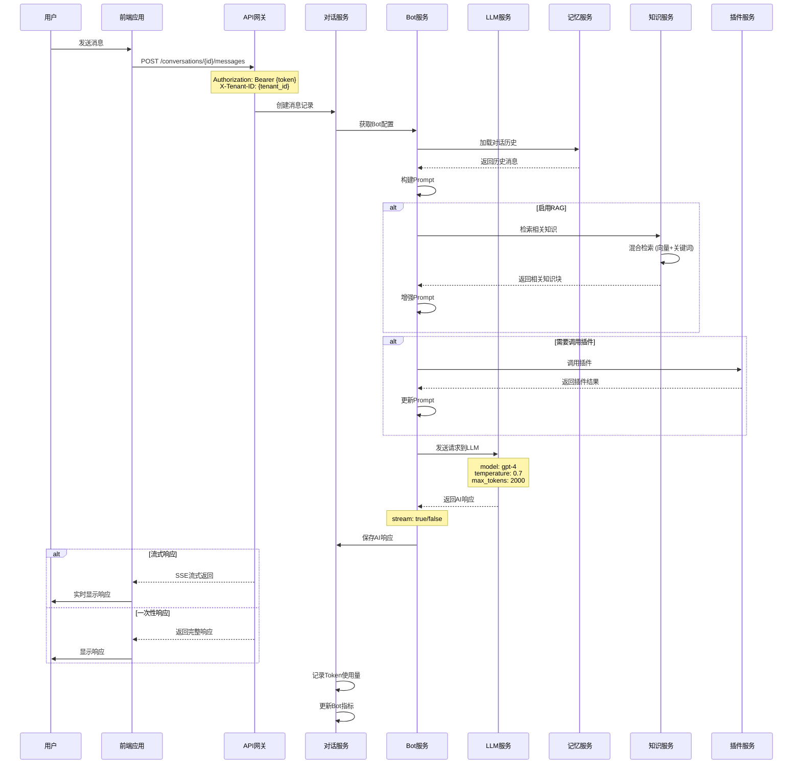
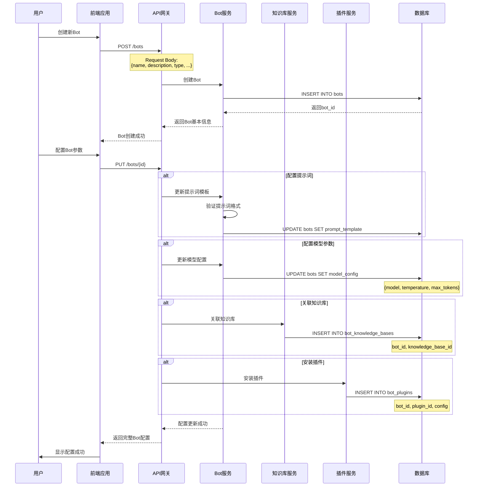
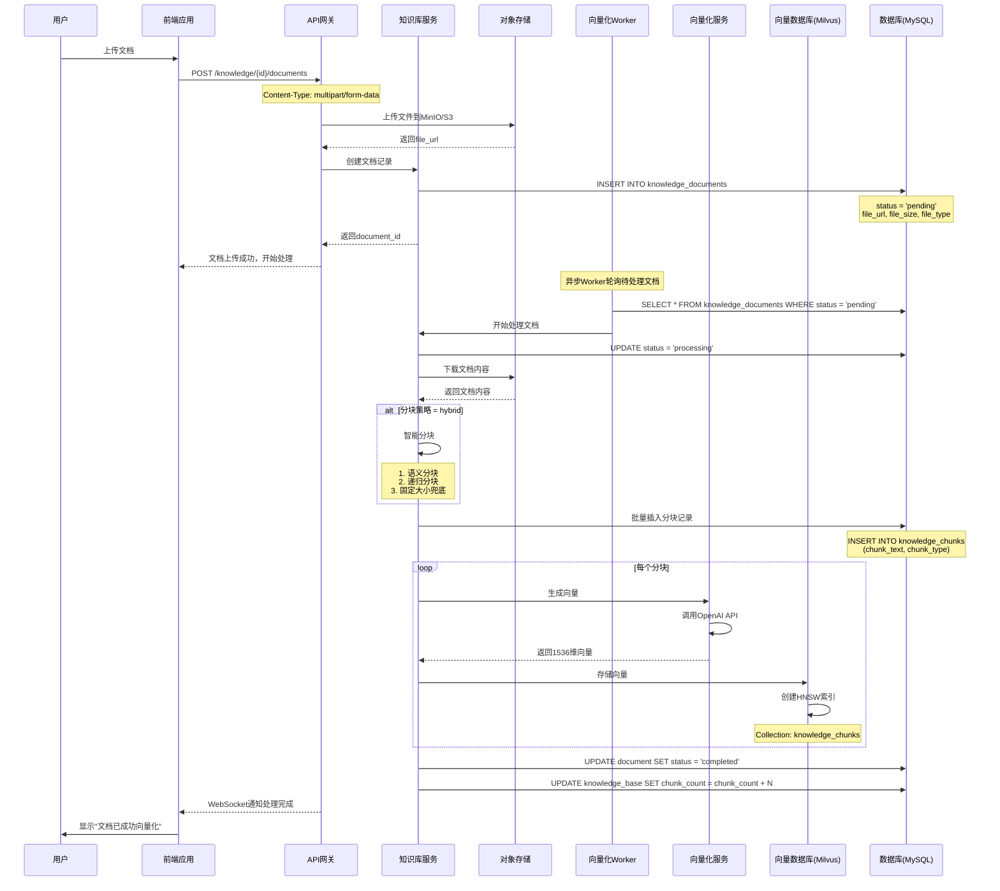
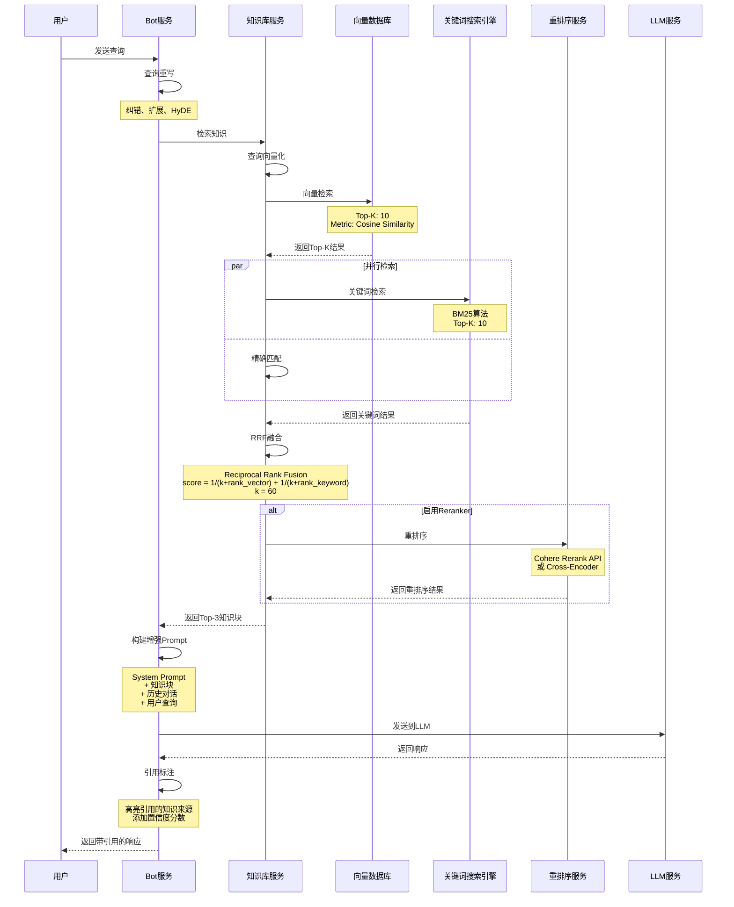
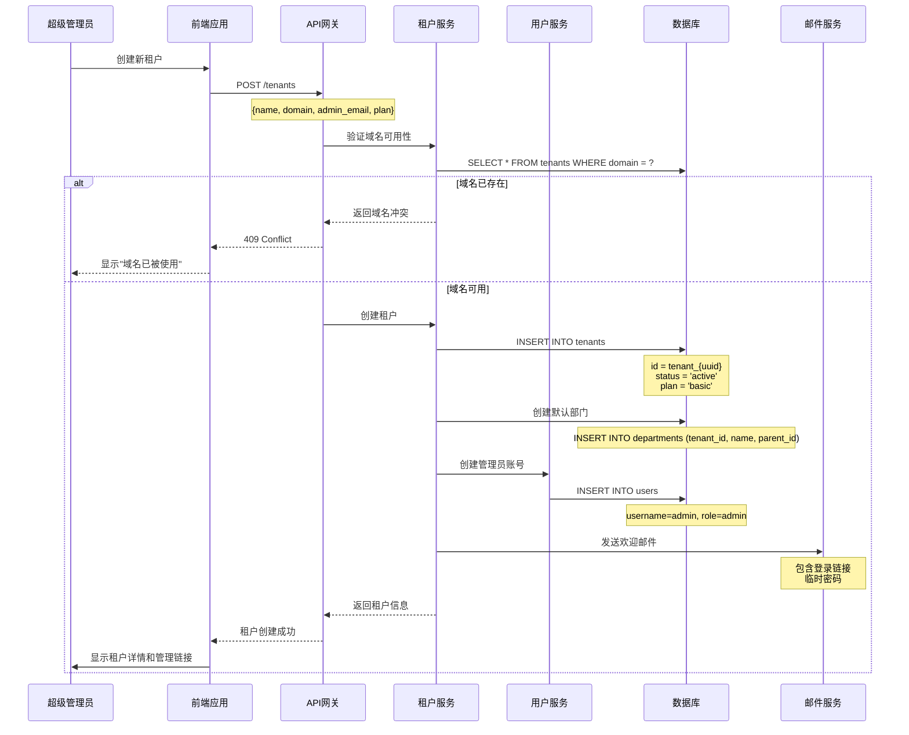
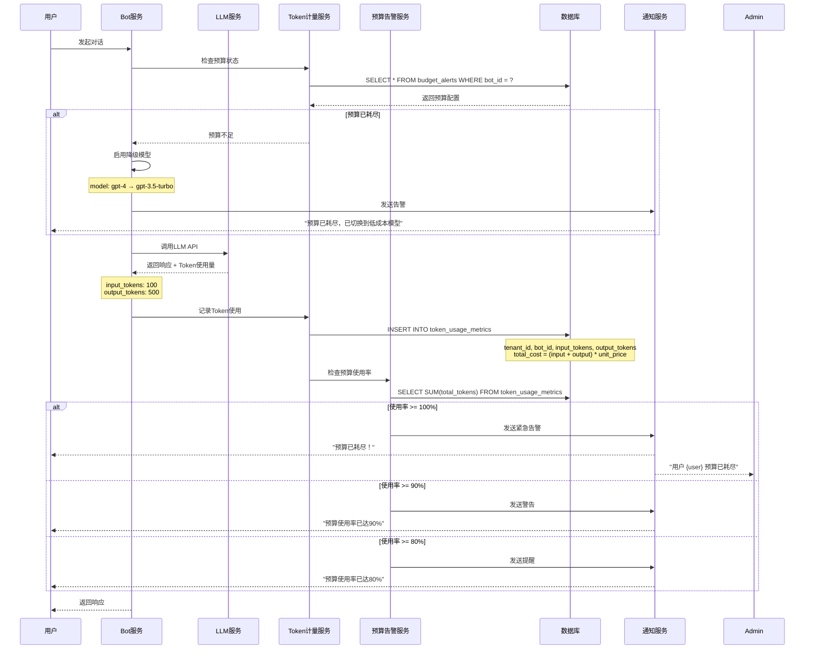
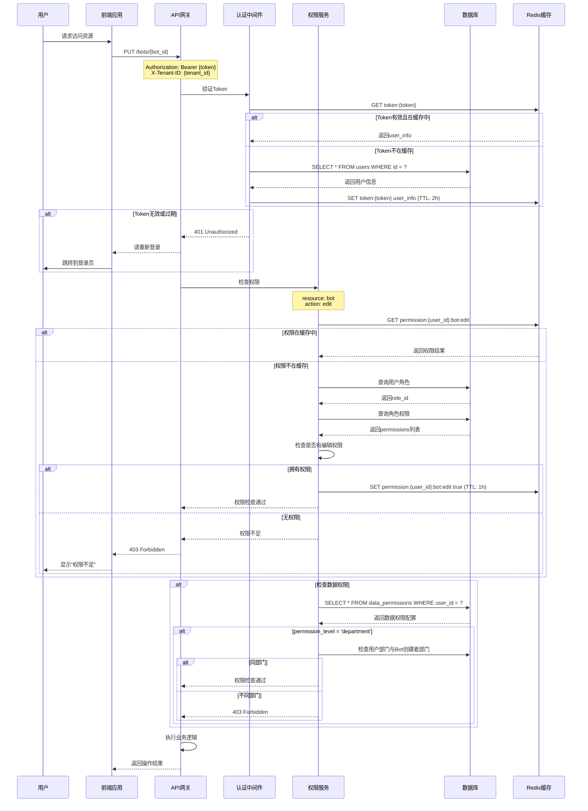
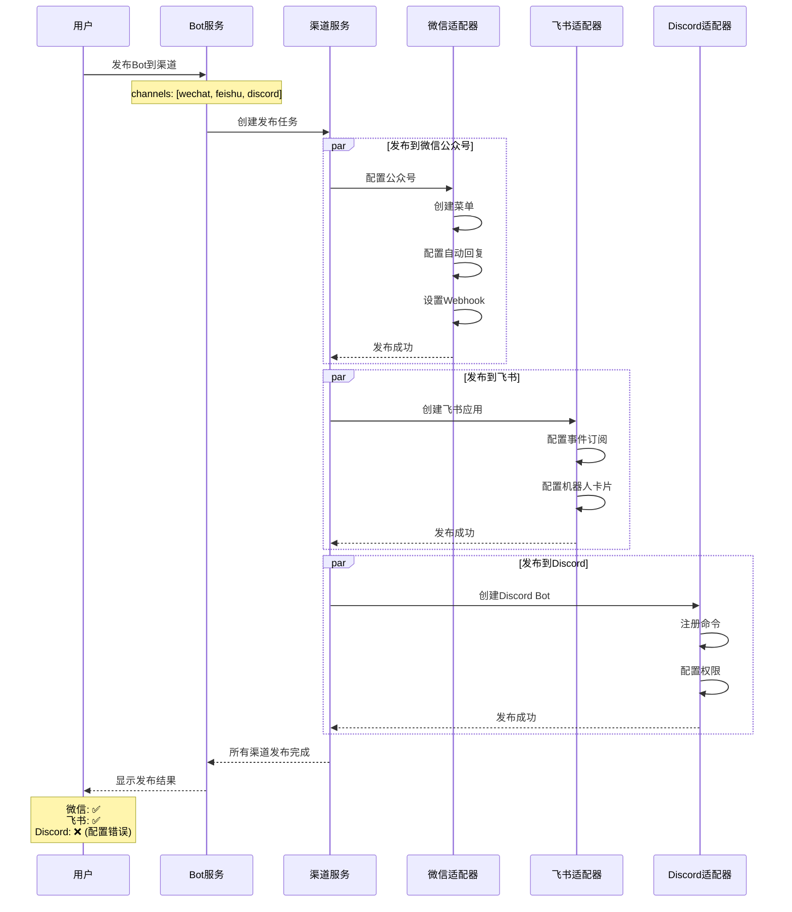
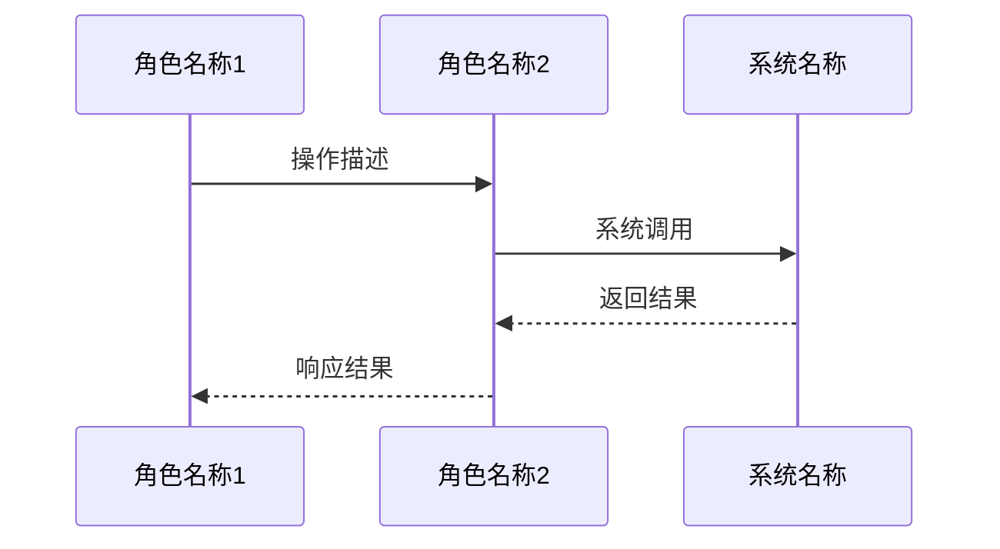

# ZKER Enterprise - UML序列图集合

**文档版本**: v1.0.0
**创建日期**: 2025-12-29
**作者**: ZKER Enterprise Team

---

## 📋 文档说明

本文档包含ZKER Enterprise平台关键业务流程的UML序列图，使用Mermaid格式绘制。

---

## 目录

1. [用户认证流程](#1-用户认证流程)
2. [AI对话流程](#2-ai对话流程)
3. [Bot创建与配置流程](#3-bot创建与配置流程)
4. [知识库文档上传与向量化流程](#4-知识库文档上传与向量化流程)
5. [RAG检索流程](#5-rag检索流程)
6. [租户注册流程](#6-租户注册流程)
7. [Token计量与预算告警流程](#7-token计量与预算告警流程)
8. [权限检查流程](#8-权限检查流程)

---

## 1. 用户认证流程



---

## 2. AI对话流程



---

## 3. Bot创建与配置流程



---

## 4. 知识库文档上传与向量化流程



---

## 5. RAG检索流程



---

## 6. 租户注册流程



---

## 7. Token计量与预算告警流程



---

## 8. 权限检查流程



---

## 9. Bot发布到多渠道流程



---

## 📊 序列图使用说明

### 如何在文档中使用

在Markdown文档中引用这些序列图：

```markdown
## 用户登录流程

详见 [UML序列图 - 用户认证流程](./uml-sequences.md#1-用户认证流程)
```

### 在Mermaid Live Editor中查看

1. 访问 https://mermaid.live/
2. 将序列图代码复制粘贴到编辑器
3. 实时查看渲染效果

### 在支持Mermaid的Markdown查看器中查看

- GitHub: 原生支持
- GitLab: 原生支持
- VS Code: 安装 Mermaid Preview 插件
- Obsidian: 原生支持

---

## 🎯 扩展建议

如需添加更多业务流程的序列图，建议按以下模板创建：



---

**文档维护**: ZKER Enterprise Team
**最后更新**: 2025-12-29
