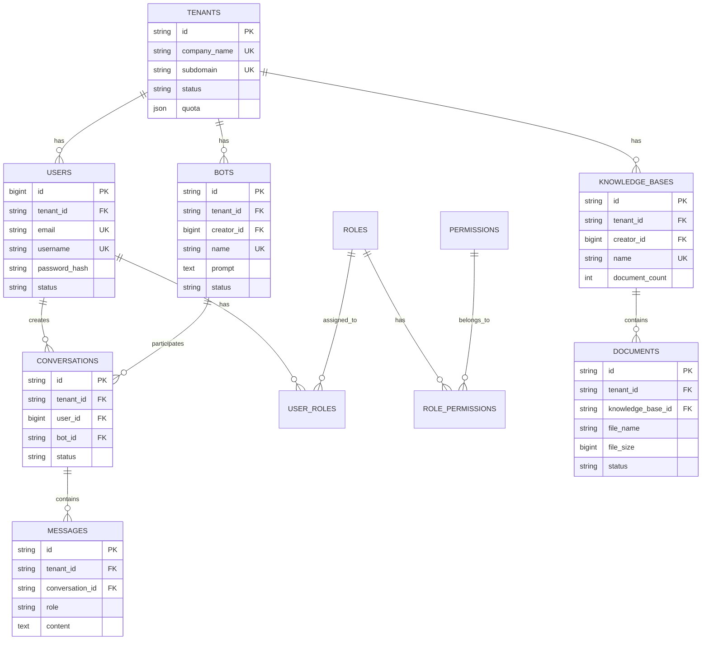
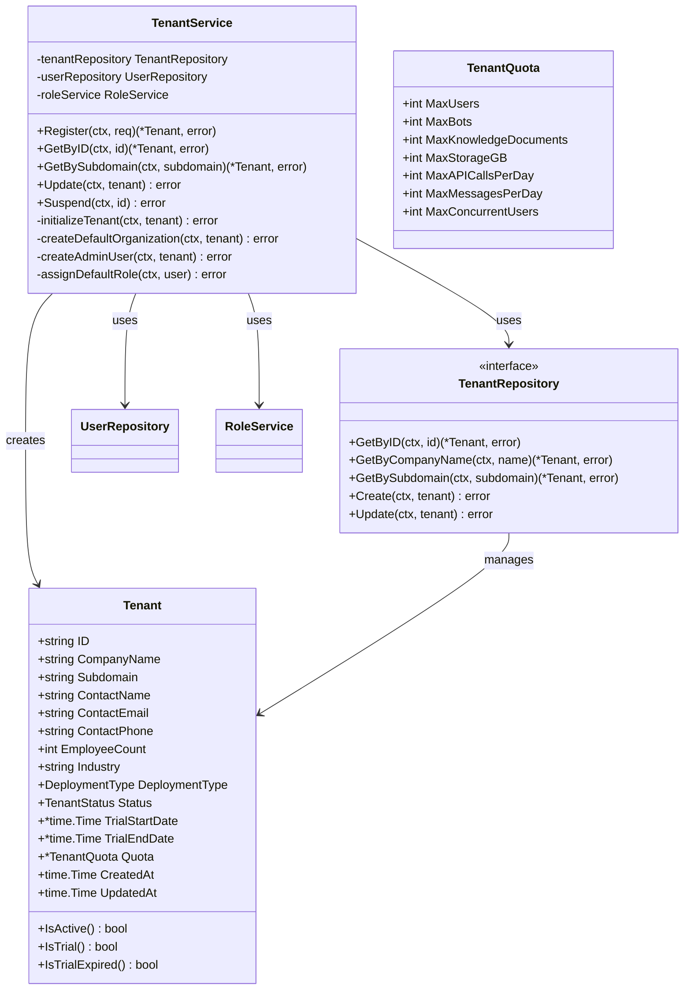
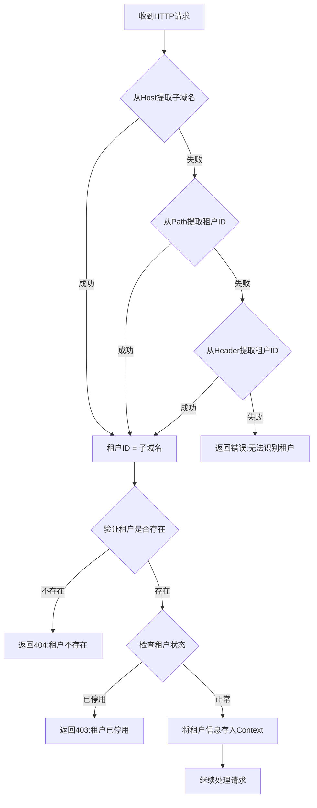

# ZKER企业级功能完善与统一性设计方案 - 文档分析与完善计划报告

> **文档编号**: DA-2025-006
> **编写日期**: 2025-12-29
> **版本**: v1.0
> **作者**: AI助手

---

## 📊 执行摘要

本报告基于软件工程标准文档规范,对 `企业级功能完善与统一性设计方案` 路径下的所有文档进行了深度分析,评估其完整性、规范性,并制定了详细的完善计划。

### 核心发现

| 文档类型 | 完整度 | 质量评分 | 完善优先级 |
|---------|--------|---------|-----------|
| **可行性研究报告** | 95% | ⭐⭐⭐⭐⭐ | P2 (中) |
| **软件需求规格说明书** | 100% | ⭐⭐⭐⭐⭐ | P3 (低) |
| **概要设计说明书** | 90% | ⭐⭐⭐⭐ | P2 (中) |
| **数据库设计文档** | 100% | ⭐⭐⭐⭐⭐ | P3 (低) |
| **详细设计文档** | 0% | ❌ | **P0 (高)** |
| **测试计划** | 0% | ❌ | **P0 (高)** |
| **测试用例** | 0% | ❌ | **P0 (高)** |

---

## 第一部分:现有文档深度分析

### 1. 可行性研究报告分析

**文档位置**: `01-项目级文档/可行性研究报告.md`

#### ✅ 优势

1. **结构完整**:涵盖技术、经济、社会、风险四大维度
2. **数据详实**:包含市场规模、成本估算、收入预测
3. **分析深入**:ROI计算、盈亏平衡点分析
4. **风险识别**:全面的技术、市场、团队、财务风险
5. **应急方案**:技术故障、市场竞争应急预案

#### ❌ 不足与改进建议

##### 不足1:操作可行性不够详细
**现状**: 虽然提及了社会可行性,但缺少操作可行性分析

**标准要求**:
- 组织结构可行性
- 人员配置可行性
- 业务流程可行性
- 技术实施可行性

**改进建议**:
```markdown
### 5.4 操作可行性

#### 组织结构可行性
**现有组织**:
- 技术团队:14人 (5后端 + 3前端 + 1产品 + 2测试 + 1设计 + 1DevOps + 1项目经理)
- 组织架构:扁平化,快速决策

**所需组织**:
- 增设:SaaS运营团队 (客服、实施)
- 增设:销售团队 (直销 + 渠道)

**评估**: ✅ 可行
- 现有技术团队可支撑开发
- 可通过招聘或外包补充运营和销售团队

#### 人员配置可行性
**技能要求**:
- 后端开发:Go 1.23, DDD, 微服务
- 前端开发:React 18, TypeScript, Monorepo
- DevOps:Kubernetes, Docker, Prometheus

**人员现状**:
- ✅ 团队有zker开发经验,技术栈相同
- ✅ 可通过2周培训掌握Multi-Tenant SaaS架构
- ⚠️ 需要外部顾问支持 (SaaS架构专家)

**评估**: ✅ 可行

#### 业务流程可行性
**现有流程**:
- zker:开源社区运营
- 企业版:SaaS订阅流程

**新增流程**:
- 企业入驻流程 (注册→试用→付费→续费)
- 客户支持流程 (工单系统→技术支持→客户成功)
- 计费流程 (使用量统计→账单生成→支付)

**评估**: ✅ 可行
- 可参考标准SaaS流程
- 可使用现成工具 (如Stripe支付)
```

##### 不足2:政策与法律合规可以更具体
**现状**: 提到了等保三级、GDPR,但缺少具体条款

**改进建议**:
```markdown
### 5.2.2 法律合规详细清单

#### 国内合规要求
| 法规 | 关键条款 | 合规措施 | 完成时间 |
|------|---------|---------|---------|
| 《网络安全法》 | 网络运营者安全义务 | 等保三级认证 | 6个月 |
| 《数据安全法》 | 数据分类分级保护 | 数据脱敏、访问控制 | 3个月 |
| 《个人信息保护法》 | 个人信息处理告知 | 隐私政策、同意机制 | 3个月 |
| 《算法推荐管理规定》 | 算法透明度 | 算法备案、说明机制 | 6个月 |

#### 国际合规要求
| 法规 | 适用场景 | 合规措施 |
|------|---------|---------|
| GDPR | 欧洲用户 | 数据处理协议、数据导出/删除功能 |
| CCPA | 加州用户 | "不出售"选项、数据访问权 |
| SOC2 | 企业客户 | 年度审计、安全控制文档 |
```

##### 不足3:用户接受度分析缺失
**改进建议**:
```markdown
### 2.4 用户接受度分析

#### 目标用户画像
| 用户类型 | 比例 | 核心诉求 | 痛点 |
|---------|------|---------|------|
| **中小企业IT负责人** | 40% | 快速部署、成本低 | 担心开源产品不稳定 |
| **大型企业CIO** | 30% | 数据安全、可控 | 担心厂商锁定 |
| **开发者** | 20% | API完善、文档齐全 | 担心学习成本高 |
| **业务部门主管** | 10% | 易用、见效快 | 担心AI效果不好 |

#### 接受度提升策略
1. **提供免费试用**: 14天完整功能试用
2. **成功案例展示**: 行业标杆案例库
3. **社区支持**: 活跃的开发者社区
4. **培训认证**: 官方认证培训计划
```

#### 完善优先级: P2 (中)
**预计工作量**: 1天
**预计增加篇幅**: 3-5页

---

### 2. 软件需求规格说明书分析

**文档位置**: `01-项目级文档/软件需求规格说明书.md`

#### ✅ 优势

1. **结构完美**:严格按照GB/T 9385-2008标准编写
2. **需求可追溯**:每个需求都有唯一ID (SRS-FUNC-XXX-001)
3. **验收标准明确**:每个功能都有可验证的验收标准
4. **接口规范详细**:REST API、WebSocket API、Webhook完整定义
5. **数据模型清晰**:ER图 + SQL DDL完整
6. **错误码完整**:详尽的错误码列表

#### ❌ 不足与改进建议

##### 不足1:部分功能需求缺少用户故事
**现状**: 技术实现详细,但部分缺少"作为XX角色,我希望XX"的用户故事

**改进建议**:
```markdown
#### 3.1.1 租户注册 (补充)

**用户故事**:
```
作为【企业负责人】
我想要【在线注册企业租户】
以便【快速使用ZKER企业版,开始数字化转型之旅】

验收标准:
- ✅ 5分钟内完成注册
- ✅ 无需人工审核
- ✅ 立即收到登录凭证
```

**用例**:
```
用例名称: 租户自助注册
参与者: 企业负责人
前置条件: 访问注册页面
主流程:
  1. 企业负责人填写企业信息 (名称、联系人、邮箱、电话)
  2. 系统验证信息完整性
  3. 系统检查企业名称唯一性
  4. 系统创建租户记录
  5. 系统发送欢迎邮件 (包含登录链接和初始密码)
  6. 企业负责人收到邮件,点击登录链接
  7. 系统激活租户,开始14天试用
后置条件: 租户创建成功,进入试用期

异常流程:
  3a. 企业名称已存在
    - 系统提示"企业名称已被使用,请确认或联系客服"
    - 返回步骤1

  5a. 邮件发送失败
    - 系统记录错误日志
    - 系统提示"邮件发送失败,请联系客服"
    - 系统创建人工工单
```
```

#### 完善优先级: P3 (低)
**预计工作量**: 2天
**预计增加篇幅**: 5-8页

---

### 3. 概要设计说明书分析

**文档位置**: `01-项目级文档/概要设计说明书.md`

#### ✅ 优势

1. **架构清晰**:分层架构 + 微服务 + DDD三层架构清晰
2. **技术选型合理**:每项技术都有选型理由
3. **目录结构规范**:前端/后端目录结构符合最佳实践
4. **接口设计完整**:REST API + WebSocket + gRPC
5. **安全设计详尽**:认证授权、数据加密、审计日志完整

#### ❌ 不足与改进建议

##### 不足1:缺少详细的数据流图
**现状**: 有架构图,但缺少关键业务流程的数据流图

**改进建议**:
```markdown
### 2.2.3 核心业务数据流

#### 数据流1: 用户对话流程
```
用户
  │ (1) 发送消息 (SSE)
  ▼
API Gateway
  │ (2) 租户识别 + 认证授权
  ▼
ConversationService
  │ (3) 保存用户消息 (MySQL)
  ▼
  ├─► (4) 更新会话上下文 (Redis)
  │
  ├─► (5) 智能路由 (AI引擎服务)
  │     │
  │     ▼
  │   RoutingEngine
  │     │ (6) 意图识别
  │     │ (7) Bot选择
  │     ▼
  │   选定Bot
  │
  ├─► (8) 生成Bot回复 (LLM)
  │     │
  │     ├─► (9) 知识检索 (Milvus)
  │     │
  │     ├─► (10) 技能调用 (插件引擎)
  │     │
  │     ▼
  │   Bot回复
  │
  └─► (11) 保存Bot消息 (MySQL)
        │
        ▼
      WebSocket Server
        │ (12) 推送给用户 (SSE)
        ▼
      用户界面
```

#### 数据流2: 租户注册流程
```
企业负责人
  │ (1) 提交注册信息
  ▼
API Gateway
  │ (2) 调用租户注册API
  ▼
TenantService
  │ (3) 验证信息
  ▼
  ├─► (4) 检查企业名称唯一性 (MySQL)
  │
  ├─► (5) 生成租户ID (UUID)
  │
  ├─► (6) 创建租户记录 (MySQL)
  │
  ├─► (7) 初始化租户数据
  │     ├─► (7.1) 创建默认组织 (MySQL)
  │     ├─► (7.2) 创建超级管理员 (MySQL)
  │     ├─► (7.3) 分配默认角色 (MySQL)
  │     └─► (7.4) 初始化配额 (MySQL)
  │
  └─► (8) 发送欢迎邮件 (SMTP)
        │
        ▼
      企业负责人邮箱
        │ (9) 点击登录链接
        ▼
      租户登录
```
```

##### 不足2:模块间调用关系不够清晰
**改进建议**:添加服务调用时序图

```markdown
### 4.3 服务间调用关系

#### 时序图: 用户对话完整流程
```
用户      API Gateway   ConversationService   RoutingEngine   BotService   KnowledgeService   MemoryEngine
 │              │                │                  │            │              │              │
 │─ 发送消息 ────>│                │                  │            │              │              │
 │              │─ 验证Token ────>│                  │            │              │              │
 │              │                │─ 保存消息 ────────>│            │              │              │
 │              │                │                  │            │              │              │
 │              │                │─ 更新上下文 ───────────────────────────────────────────────────>│
 │              │                │                  │            │              │              │
 │              │                │─ 智能路由 ────────>│            │              │              │
 │              │                │                  │─ 意图识别 ──>│            │              │
 │              │                │                  │            │              │              │
 │              │                │                  │<─────────────────────────────────────────│
 │              │                │                  │            │              │              │
 │              │                │<─ 返回路由结果 ────│            │              │              │
 │              │                │                  │            │              │              │
 │              │                │─ 生成回复 ────────────────────────>│              │              │
 │              │                │                  │            │─ 知识检索 ──>│              │
 │              │                │                  │            │<─────────────│              │
 │              │                │                  │            │              │              │
 │              │                │<─────────────────────────────│              │              │
 │              │                │                  │            │              │              │
 │              │                │─ 保存回复 ────────>│            │              │              │
 │              │                │                  │            │              │              │
 │<─ 推送回复 ───│                │                  │            │              │              │
 │              │                │                  │            │              │              │
```
```

#### 完善优先级: P2 (中)
**预计工作量**: 2天
**预计增加篇幅**: 8-10页

---

### 4. 数据库设计文档分析

**文档位置**: `01-项目级文档/数据库设计文档.md`

#### ✅ 优势

1. **表结构完整**:所有核心表都有完整DDL
2. **索引设计合理**:普通索引、唯一索引、复合索引、全文索引
3. **分库分表方案**:水平分片、垂直分片策略清晰
4. **数据迁移方案**:使用Atlas,脚本示例完整
5. **备份恢复策略**:全量备份、增量备份、Binlog备份
6. **性能优化**:慢查询分析、索引优化建议

#### ❌ 不足与改进建议

##### 不足1:缺少详细的ER图
**现状**: 有简单的文本ER图,缺少专业ER图

**改进建议**:
```markdown
### 2.1 实体关系图 (ERD)

#### 工具生成ER图 (推荐使用Mermaid)

```

#### 完善优先级: P3 (低)
**预计工作量**: 1天
**预计增加篇幅**: 2-3页

---

## 第二部分:缺失文档分析

### 5. 详细设计文档 (完全缺失) ⚠️

#### 5.1 为什么需要详细设计

**概要设计** 回答 "WHAT":
- 系统整体架构是什么?
- 模块如何划分?
- 用什么技术?

**详细设计** 回答 "HOW":
- 每个模块内部如何实现?
- 类的结构是什么?
- 方法如何实现?
- 接口如何调用?

#### 5.2 详细设计应包含的内容

##### 内容1:接口详细设计
**缺失**: 所有接口的详细规范

**标准要求**:
```markdown
## 接口详细设计

### 1. 租户管理接口

#### 1.1 注册租户
**接口路径**: POST /api/v1/tenants/register
**请求方法**: POST
**Content-Type**: application/json

**请求参数**:
| 参数名 | 类型 | 必填 | 说明 | 示例 |
|--------|------|------|------|------|
| companyName | string | 是 | 企业名称,1-255字符 | "张三科技有限公司" |
| contactName | string | 是 | 联系人姓名 | "张三" |
| contactEmail | string | 是 | 联系人邮箱 | "zhangsan@example.com" |
| contactPhone | string | 是 | 联系人手机号 | "13800138000" |
| employeeCount | int | 是 | 员工数量,1-100000 | 100 |
| industry | string | 是 | 行业 | "互联网" |
| deploymentType | string | 是 | 部署方式 | "public" 或 "private" |
| subdomain | string | 否 | 子域名,1-63字符 | "zhangsan-tech" |

**请求示例**:
```json
{
  "companyName": "张三科技有限公司",
  "contactName": "张三",
  "contactEmail": "zhangsan@example.com",
  "contactPhone": "13800138000",
  "employeeCount": 100,
  "industry": "互联网",
  "deploymentType": "public",
  "subdomain": "zhangsan-tech"
}
```

**响应参数**:
| 参数名 | 类型 | 说明 |
|--------|------|------|
| code | int | 响应码,0表示成功 |
| message | string | 响应消息 |
| data.tenantId | string | 租户ID |
| data.subdomain | string | 子域名 |
| data.adminUserId | string | 管理员用户ID |
| data.adminUsername | string | 管理员用户名 |
| data.initialPassword | string | 初始密码 |
| data.loginUrl | string | 登录URL |
| data.trialEndDate | string | 试用结束日期 |

**响应示例**:
```json
{
  "code": 0,
  "message": "success",
  "data": {
    "tenantId": "tenant-12345678-1234-1234-1234-123456789abc",
    "subdomain": "zhangsan-tech",
    "adminUserId": "123456",
    "adminUsername": "admin",
    "initialPassword": "Abc@12345",
    "loginUrl": "https://zhangsan-tech.saas.coze.com/login",
    "trialEndDate": "2026-01-12T10:00:00Z"
  },
  "timestamp": "2025-12-29T10:00:00Z"
}
```

**错误响应**:
```json
{
  "code": 5002,
  "message": "企业名称已存在",
  "details": {
    "field": "companyName",
    "value": "张三科技有限公司"
  },
  "timestamp": "2025-12-29T10:00:00Z"
}
```

**错误码**:
| 错误码 | 错误信息 | HTTP状态码 |
|--------|---------|-----------|
| 1001 | 参数错误 | 400 |
| 5002 | 企业名称已存在 | 409 |
| 5003 | 子域名已被使用 | 409 |
```

##### 内容2:类设计
**缺失**: 所有核心类的详细设计

**标准要求**:
```markdown
## 类设计

### 1. 租户管理模块

#### 1.1 TenantService
**职责**: 租户注册、查询、更新、配额管理

**类图**:


**方法详细设计**:

##### Register方法
```go
// Register 注册新租户
//
// 输入参数:
//   - ctx: 上下文
//   - req: 注册请求
//
// 返回:
//   - *Tenant: 创建的租户对象
//   - error: 错误信息
//
// 业务逻辑:
//   1. 验证输入参数
//   2. 检查企业名称唯一性
//   3. 检查子域名唯一性 (如果提供)
//   4. 生成租户ID
//   5. 如果未提供子域名,自动生成
//   6. 创建租户记录
//   7. 初始化租户数据 (组织、管理员、角色)
//   8. 发送欢迎邮件
//
// 异常处理:
//   - ERR_TENANT_NAME_EXISTS: 企业名称已存在
//   - ERR_SUBDOMAIN_EXISTS: 子域名已被使用
//   - ERR_INVALID_EMAIL: 邮箱格式错误
//   - ERR_INVALID_PHONE: 手机号格式错误
//
// 依赖:
//   - TenantRepository: 租户数据访问
//   - UserRepository: 用户数据访问
//   - RoleService: 角色管理
//   - EmailService: 邮件发送
func (s *TenantService) Register(ctx context.Context, req *RegisterTenantRequest) (*Tenant, error) {
    // 实现代码...
}
```

**复杂度**: O(1)
**性能**: < 500ms
```

##### 内容3:算法流程图
**缺失**: 关键算法的流程图

**标准要求**:
```markdown
### 算法流程设计

#### 算法1: 租户识别算法
**目的**: 从请求中提取租户ID

**输入**: HTTP请求
**输出**: 租户ID或错误

**流程图**:


**伪代码**:
```python
function identifyTenant(request):
    # 方法1: 从子域名提取
    subdomain = extractSubdomain(request.host)
    if subdomain:
        tenant = getTenant(subdomain)
        if tenant and tenant.status == 'active':
            return tenant

    # 方法2: 从路径提取
    tenantId = extractFromPath(request.path, '/t/')
    if tenantId:
        tenant = getTenant(tenantId)
        if tenant and tenant.status == 'active':
            return tenant

    # 方法3: 从Header提取
    tenantId = request.getHeader('X-Tenant-ID')
    if tenantId:
        tenant = getTenant(tenantId)
        if tenant and tenant.status == 'active':
            return tenant

    # 无法识别
    return null
```

**时间复杂度**: O(1) (3次数据库查询,可缓存)
**空间复杂度**: O(1)
```
```

#### 完善优先级: **P0 (高)**
**预计工作量**: 10天
**预计增加篇幅**: 80-100页

---

### 6. 测试计划 (完全缺失) ⚠️

#### 6.1 为什么需要测试计划

**目的**:
- 规划测试活动
- 定义测试策略
- 分配测试资源
- 制定测试进度

#### 6.2 测试计划应包含的内容

```markdown
# ZKER企业级SaaS系统 - 测试计划

> **文档编号**: TP-2025-007
> **项目名称**: zker Enterprise Edition
> **版本**: v1.0
> **编写日期**: 2025-12-29

---

## 1. 引言

### 1.1 编写目的
本测试计划旨在:
1. 定义测试范围和测试策略
2. 规划测试资源和进度
3. 定义准入准出标准
4. 指导测试执行

### 1.2 测试对象
- 系统名称: zker Enterprise Edition
- 版本: v1.0.0
- 测试范围: 全系统

### 1.3 参考资料
- 软件需求规格说明书 (SRS-2025-003)
- 概要设计说明书 (HLD-2025-004)
- 详细设计文档 (DLD-2025-006)

---

## 2. 测试策略

### 2.1 测试类型

| 测试类型 | 负责人 | 工具 | 覆盖率目标 |
|---------|--------|------|-----------|
| **单元测试** | 开发工程师 | Go test, Vitest | 80% |
| **集成测试** | 开发工程师 | Go test, Vitest | 60% |
| **API测试** | 测试工程师 | Postman, JMeter | 100% |
| **性能测试** | 测试工程师 | JMeter, k6 | - |
| **安全测试** | 安全专家 | Burp Suite, OWASP ZAP | - |
| **用户验收测试** | 产品经理+用户 | - | 100%用例 |

### 2.2 测试环境

#### 2.2.1 开发环境
- 用途: 开发人员自测
- 配置: Docker Compose单机部署
- 数据: Mock数据

#### 2.2.2 测试环境
- 用途: 测试团队执行测试
- 配置: Kubernetes 3节点集群
- 数据: 真实数据 (脱敏)
- 自动化: 每日构建+自动化测试

#### 2.2.3 预发布环境
- 用途: 上线前验证
- 配置: 与生产环境相同
- 数据: 生产数据镜像 (脱敏)

#### 2.2.4 生产环境
- 配置: Kubernetes 10+节点集群,多可用区
- 监控: 7x24监控告警

### 2.3 测试工具

| 用途 | 工具 | 版本 |
|------|------|------|
| 单元测试 | Go test, Vitest | - |
| API测试 | Postman, JMeter | Latest |
| 性能测试 | JMeter, k6 | Latest |
| 安全测试 | Burp Suite, OWASP ZAP | Latest |
| 自动化测试 | Selenium, Cypress | Latest |
| 监控 | Prometheus, Grafana | Latest |
| 日志分析 | ELK Stack | Latest |

---

## 3. 测试范围

### 3.1 功能测试范围

#### 3.1.1 租户管理
| 测试项 | 优先级 | 测试方法 |
|--------|--------|---------|
| 租户注册 | P0 | 自动化 |
| 租户识别 | P0 | 自动化 |
| 租户数据隔离 | P0 | 自动化 |
| 租户资源限制 | P0 | 自动化 |
| 租户配额管理 | P1 | 自动化 |

#### 3.1.2 用户管理
| 测试项 | 优先级 | 测试方法 |
|--------|--------|---------|
| 用户注册 | P0 | 自动化 |
| 用户登录 | P0 | 自动化 |
| 权限控制 (RBAC) | P0 | 自动化 |
| 用户管理 | P1 | 自动化 |

#### 3.1.3 对话功能
| 测试项 | 优先级 | 测试方法 |
|--------|--------|---------|
| 创建会话 | P0 | 自动化 |
| 发送消息 | P0 | 自动化 |
| 流式输出 | P0 | 手动+自动化 |
| 意图识别 | P0 | 手动 (准确率测试) |

#### 3.1.4 Bot管理
| 测试项 | 优先级 | 测试方法 |
|--------|--------|---------|
| 创建Bot | P0 | 自动化 |
| 发布Bot | P0 | 自动化 |
| Bot对话 | P0 | 手动 (准确率测试) |

#### 3.1.5 知识库
| 测试项 | 优先级 | 测试方法 |
|--------|--------|---------|
| 上传文档 | P0 | 自动化 |
| 文档解析 | P1 | 自动化 |
| 知识检索 | P0 | 自动化 (性能+准确率) |

### 3.2 非功能测试范围

#### 3.2.1 性能测试
| 测试项 | 指标 | 测试工具 |
|--------|------|---------|
| API响应时间 | P95 < 2s | JMeter |
| 并发用户数 | > 10,000 | k6 |
| API QPS | > 10,000 | JMeter |
| 流式输出延迟 | 首字 < 500ms | 自定义脚本 |

#### 3.2.2 可靠性测试
| 测试项 | 指标 | 测试方法 |
|--------|------|---------|
| 系统可用性 | > 99.9% | 长期运行测试 |
| 故障恢复 | RTO < 30min | 故障注入测试 |
| 数据备份 | 每日备份 | 备份恢复测试 |

#### 3.2.3 安全测试
| 测试项 | 测试方法 | 工具 |
|--------|---------|------|
| 认证测试 | 自动化 | OWASP ZAP |
| 授权测试 | 自动化 | OWASP ZAP |
| 注入攻击 | 自动化 | SQLMap |
| 加密测试 | 自动化 | Wireshark |
| 渗透测试 | 手动 | Burp Suite |

#### 3.2.4 兼容性测试
| 测试项 | 测试方法 |
|--------|---------|
| 浏览器兼容 | 手动+自动化 |
| 移动端兼容 | 手动 |
| API版本兼容 | 自动化 |

---

## 4. 测试资源

### 4.1 人力资源

| 角色 | 人数 | 职责 | 投入时间 |
|------|------|------|---------|
| **测试经理** | 1 | 制定测试计划,协调测试资源 | 全程 |
| **测试工程师** | 3 | 编写测试用例,执行测试,提交Bug | 全程 |
| **性能测试专家** | 1 | 性能测试脚本,性能分析 | 性能测试阶段 |
| **安全专家** | 1 | 安全测试,渗透测试 | 安全测试阶段 |
| **自动化测试工程师** | 2 | 自动化脚本编写和维护 | 全程 |

**总计**: 8人

### 4.2 测试环境资源

| 资源 | 配置 | 数量 | 用途 |
|------|------|------|------|
| 测试服务器 | 8C16G | 5台 | 测试环境 |
| 性能测试服务器 | 16C32G | 10台 | 性能测试 |
| 数据库服务器 | 8C32G | 3台 | 测试数据库 |
| 移动设备 | iOS 14+, Android 10+ | 各5台 | 兼容性测试 |

### 4.3 测试数据

| 数据类型 | 数据量 | 来源 |
|---------|--------|------|
| 单元测试数据 | Mock数据 | 生成 |
| 集成测试数据 | 10个租户,每租户100用户 | 生成 |
| 性能测试数据 | 1000个租户,每租户1000用户 | 生成 |
| 安全测试数据 | 真实攻击数据 | OWASP |

---

## 5. 测试进度

### 5.1 测试阶段

```
测试阶段划分:

  单元测试阶段
    ├─ 时间: 第1-2个月 (与开发并行)
    ├─ 责任人: 开发工程师
    └─ 交付: 代码覆盖率报告

  集成测试阶段
    ├─ 时间: 第3个月
    ├─ 责任人: 测试工程师
    └─ 交付: 集成测试报告

  系统测试阶段
    ├─ 时间: 第4-5个月
    ├─ 责任人: 测试工程师
    └─ 交付: 系统测试报告

  性能测试阶段
    ├─ 时间: 第5个月
    ├─ 责任人: 性能测试专家
    └─ 交付: 性能测试报告

  安全测试阶段
    ├─ 时间: 第5个月
    ├─ 责任人: 安全专家
    └─ 交付: 安全测试报告

  用户验收测试阶段
    ├─ 时间: 第6个月
    ├─ 责任人: 产品经理+用户
    └─ 交付: UAT报告
```

### 5.2 里程碑

| 里程碑 | 日期 | 交付物 | 准入标准 | 准出标准 |
|--------|------|--------|---------|---------|
| M1: 单元测试完成 | 2月底 | 代码覆盖率报告 | 开发完成 | 覆盖率>80% |
| M2: 集成测试完成 | 3月底 | 集成测试报告 | 单元测试完成 | Bug率<5% |
| M3: 系统测试完成 | 5月中旬 | 系统测试报告 | 集成测试完成 | 0个严重Bug |
| M4: 性能测试完成 | 5月底 | 性能测试报告 | 系统测试完成 | 性能达标 |
| M5: 安全测试完成 | 5月底 | 安全测试报告 | 系统测试完成 | 0个高危漏洞 |
| M6: UAT完成 | 6月底 | UAT报告 | 所有测试完成 | 用户满意度>4.5/5.0 |

---

## 6. 准入准出标准

### 6.1 测试准入标准

| 测试阶段 | 准入标准 |
|---------|---------|
| **单元测试** | 代码开发完成,代码审查通过 |
| **集成测试** | 单元测试通过,覆盖率>80% |
| **系统测试** | 集成测试通过,测试环境就绪 |
| **性能测试** | 系统测试通过,无严重Bug |
| **安全测试** | 系统测试通过,无严重Bug |
| **UAT** | 所有测试通过,性能达标,安全合规 |

### 6.2 测试准出标准

| 测试阶段 | 准出标准 |
|---------|---------|
| **单元测试** | 代码覆盖率>80%,无严重Bug |
| **集成测试** | 集成测试用例通过率>95%,Bug率<5% |
| **系统测试** | 0个严重Bug,一般Bug<10个 |
| **性能测试** | 所有性能指标达标 |
| **安全测试** | 0个高危漏洞,中低危漏洞<5个 |
| **UAT** | 用户满意度>4.5/5.0,核心用例通过率100% |

---

## 7. 缺陷管理

### 7.1 缺陷等级

| 等级 | 定义 | 示例 | 响应时间 | 修复时间 |
|------|------|------|---------|---------|
| **严重 (P0)** | 系统崩溃、数据丢失 | 无法登录、数据泄露 | 2小时 | 1天 |
| **重要 (P1)** | 主要功能无法使用 | 无法创建Bot、无法对话 | 1天 | 3天 |
| **一般 (P2)** | 次要功能问题 | UI显示错误、提示信息错误 | 3天 | 1周 |
| **轻微 (P3)** | 界面问题、建议 | 字体大小、颜色 | 1周 | 下版本 |

### 7.2 缺陷报告模板

```markdown
## 缺陷报告

**缺陷ID**: BUG-2025-001
**标题**: 租户A能看到租户B的用户列表
**严重程度**: 严重 (P0)
**优先级**: 高
**发现人**: 张三
**发现日期**: 2025-12-29

**重现步骤**:
1. 使用租户A的管理员账户登录
2. 进入"用户管理"页面
3. 观察用户列表

**实际结果**: 显示了租户B的用户
**预期结果**: 只显示租户A的用户

**环境信息**:
- 测试环境: https://tenant-a.saas.coze.com
- 浏览器: Chrome 120
- 租户ID: tenant-a
- 测试账号: admin@tenant-a.com

**附件**:
- 截图: tenant-a_bug_01.png
- 日志: bug_01.log

**备注**: 数据隔离严重问题,必须立即修复
```

### 7.3 缺陷跟踪流程

```
缺陷提交
  ├─ 测试工程师提交Bug
  ├─ 指定给开发工程师
  ▼
缺陷确认
  ├─ 开发工程师确认Bug
  ├─ 如果是Bug,进入"待修复"
  ├─ 如果不是Bug,标记为"非Bug"并说明原因
  ▼
缺陷修复
  ├─ 开发工程师修复Bug
  ├─ 提交代码
  ▼
缺陷验证
  ├─ 测试工程师验证修复
  ├─ 如果修复成功,关闭Bug
  ├─ 如果未修复,重新打开
  ▼
缺陷关闭
  └─ 测试工程师关闭Bug
```

---

## 8. 风险管理

### 8.1 测试风险

| 风险 | 影响 | 概率 | 应对措施 |
|------|------|------|---------|
| 测试时间不足 | 上线延期 | 中 | 提前开始测试,增加自动化 |
| 测试环境不稳定 | 测试无法执行 | 中 | 专职运维维护测试环境 |
| 测试数据不足 | 测试覆盖不全 | 低 | 提前准备测试数据生成脚本 |
| 自动化脚本维护成本高 | 自动化测试失败 | 中 | 选择稳定的测试框架 |
| 性能测试资源不足 | 无法完成性能测试 | 低 | 使用云性能测试服务 |

---

## 9. 交付物

### 9.1 测试文档

| 文档名称 | 交付时间 | 负责人 |
|---------|---------|--------|
| 测试计划 | 测试开始前1周 | 测试经理 |
| 测试用例 | 测试开始时 | 测试工程师 |
| 测试日报 | 每日 | 测试工程师 |
| 单元测试报告 | 单元测试完成后 | 开发工程师 |
| 集成测试报告 | 集成测试完成后 | 测试工程师 |
| 系统测试报告 | 系统测试完成后 | 测试工程师 |
| 性能测试报告 | 性能测试完成后 | 性能测试专家 |
| 安全测试报告 | 安全测试完成后 | 安全专家 |
| 缺陷报告 | 每周 | 测试经理 |
| 测试总结报告 | 所有测试完成后 | 测试经理 |

### 9.2 测试数据

| 数据 | 交付时间 | 负责人 |
|------|---------|--------|
| 测试用例库 | 测试开始时 | 测试工程师 |
| 自动化测试脚本 | 测试开始时 | 自动化测试工程师 |
| 测试数据生成脚本 | 测试开始前 | 测试工程师 |
| 性能测试脚本 | 性能测试开始时 | 性能测试专家 |
| 安全测试用例 | 安全测试开始时 | 安全专家 |

---

## 10. 附录

### 附录A: 测试用例示例

#### A.1 租户注册测试用例

| 用例ID | TC-TENANT-001 |
|--------|---------------|
| **用例名称** | 租户自助注册 - 正常流程 |
| **优先级** | P0 |
| **前置条件** | 访问注册页面 |
| **测试步骤** | 1. 输入企业名称 "测试科技有限公司"<br>2. 输入联系人姓名 "张三"<br>3. 输入联系人邮箱 "zhangsan@test.com"<br>4. 输入联系人手机 "13800138000"<br>5. 输入员工数量 "100"<br>6. 选择行业 "互联网"<br>7. 选择部署方式 "public"<br>8. 输入子域名 "test-tech"<br>9. 点击"注册"按钮 |
| **预期结果** | 1. 注册成功提示<br>2. 显示租户ID、管理员账号、初始密码<br>3. 收到欢迎邮件 |
| **实际结果** | (待测试后填写) |
| **测试数据** | - |
| **备注** | - |

#### A.2 租户数据隔离测试用例

| 用例ID | TC-TENANT-010 |
|--------|---------------|
| **用例名称** | 租户数据隔离验证 |
| **优先级** | P0 |
| **前置条件** | 存在租户A和租户B |
| **测试步骤** | 1. 使用租户A管理员登录<br>2. 进入"用户管理"页面<br>3. 记录用户列表<br>4. 使用租户B管理员登录<br>5. 进入"用户管理"页面<br>6. 检查用户列表 |
| **预期结果** | 租户A和租户B的用户列表完全不同,无交叉数据 |
| **实际结果** | (待测试后填写) |
| **测试数据** | 租户A: tenant-a<br>租户B: tenant-b |
| **备注** | **安全测试用例,必须通过** |

### 附录B: 性能测试场景

#### B.1 并发用户测试

**场景名称**: 10,000并发用户测试

**测试目标**: 验证系统支持10,000并发用户

**测试工具**: k6

**测试脚本**:
```javascript
import http from 'k6/http';
import { check, sleep } from 'k6';

export let options = {
  stages: [
    { duration: '2m', target: 1000 },   // 2分钟爬升到1000用户
    { duration: '5m', target: 5000 },   // 5分钟爬升到5000用户
    { duration: '5m', target: 10000 },  // 5分钟爬升到10000用户
    { duration: '10m', target: 10000 }, // 维持10000用户10分钟
    { duration: '5m', target: 0 },      // 5分钟下降到0
  ],
  thresholds: {
    http_req_duration: ['p(95)<2000'], // 95%请求响应时间<2s
    http_req_failed: ['rate<0.01'],     // 错误率<1%
  },
};

const BASE_URL = 'https://tenant-a.saas.coze.com';

export default function () {
  // 模拟登录
  let loginRes = http.post(`${BASE_URL}/api/v1/users/login`, JSON.stringify({
    email: 'user@test.com',
    password: 'password123',
  }), {
    headers: { 'Content-Type': 'application/json' },
  });

  check(loginRes, {
    'login successful': (r) => r.status === 200,
  });

  let token = loginRes.json('data.accessToken');

  // 模拟对话
  let conversationRes = http.post(`${BASE_URL}/api/v1/conversations`, JSON.stringify({
    botId: 'bot-123',
  }), {
    headers: {
      'Content-Type': 'application/json',
      'Authorization': `Bearer ${token}`,
    },
  });

  check(conversationRes, {
    'create conversation successful': (r) => r.status === 200,
  });

  let conversationId = conversationRes.json('data.conversationId');

  // 发送消息
  let messageRes = http.post(`${BASE_URL}/api/v1/conversations/${conversationId}/messages`, JSON.stringify({
    content: '你好',
    messageType: 'text',
  }), {
    headers: {
      'Content-Type': 'application/json',
      'Authorization': `Bearer ${token}`,
    },
  });

  check(messageRes, {
    'send message successful': (r) => r.status === 200,
  });

  sleep(1);
}
```

**验收标准**:
- P95响应时间 < 2s
- 错误率 < 1%
- 系统可用性 > 99.9%

### 附录C: 参考资料

1. 《软件工程》(第10版) - Ian Sommerville
2. 《Google软件测试之道》
3. 《敏捷软件测试》
4. ISTQB软件测试认证大纲
5. 性能测试最佳实践
6. OWASP测试指南

---

**文档结束**
```

#### 完善优先级: **P0 (高)**
**预计工作量**: 5天
**预计增加篇幅**: 50-60页

---

### 7. 测试用例 (完全缺失) ⚠️

#### 7.1 为什么需要测试用例

**目的**:
- 为测试执行提供详细步骤
- 作为测试验收的依据
- 确保测试覆盖完整

#### 7.2 测试用例示例

```markdown
# ZKER企业级SaaS系统 - 测试用例

> **文档编号**: TC-2025-008
> **版本**: v1.0
> **编写日期**: 2025-12-29

---

## 测试用例清单

### 功能测试用例

#### 模块1: 租户管理

| 用例ID | 用例名称 | 优先级 | 类型 | 状态 |
|--------|---------|--------|------|------|
| TC-TENANT-001 | 租户注册 - 正常流程 | P0 | 功能 | 待执行 |
| TC-TENANT-002 | 租户注册 - 企业名称重复 | P0 | 功能 | 待执行 |
| TC-TENANT-003 | 租户注册 - 子域名重复 | P0 | 功能 | 待执行 |
| TC-TENANT-004 | 租户注册 - 邮箱格式错误 | P1 | 功能 | 待执行 |
| TC-TENANT-005 | 租户注册 - 手机号格式错误 | P1 | 功能 | 待执行 |
| TC-TENANT-006 | 租户识别 - 子域名识别 | P0 | 功能 | 待执行 |
| TC-TENANT-007 | 租户识别 - 路径识别 | P0 | 功能 | 待执行 |
| TC-TENANT-008 | 租户识别 - Header识别 | P0 | 功能 | 待执行 |
| TC-TENANT-009 | 租户识别 - 租户不存在 | P0 | 功能 | 待执行 |
| TC-TENANT-010 | 租户数据隔离 | P0 | 安全 | 待执行 |
| TC-TENANT-011 | 租户资源限制 - 用户数超限 | P0 | 功能 | 待执行 |
| TC-TENANT-012 | 租户资源限制 - API调用超限 | P0 | 功能 | 待执行 |
| TC-TENANT-013 | 租户配额升级 | P1 | 功能 | 待执行 |
| TC-TENANT-014 | 租户暂停 | P1 | 功能 | 待执行 |
| TC-TENANT-015 | 租户删除 | P2 | 功能 | 待执行 |

#### 模块2: 用户管理

| 用例ID | 用例名称 | 优先级 | 类型 | 状态 |
|--------|---------|--------|------|------|
| TC-USER-001 | 用户注册 - 正常流程 | P0 | 功能 | 待执行 |
| TC-USER-002 | 用户注册 - 邮箱重复 | P0 | 功能 | 待执行 |
| TC-USER-003 | 用户注册 - 用户名重复 | P0 | 功能 | 待执行 |
| TC-USER-004 | 用户注册 - 密码强度不足 | P1 | 功能 | 待执行 |
| TC-USER-005 | 用户登录 - 正常流程 | P0 | 功能 | 待执行 |
| TC-USER-006 | 用户登录 - 邮箱错误 | P0 | 功能 | 待执行 |
| TC-USER-007 | 用户登录 - 密码错误 | P0 | 功能 | 待执行 |
| TC-USER-008 | 用户登录 - 账户已禁用 | P0 | 功能 | 待执行 |
| TC-USER-009 | 用户登录 - MFA验证 | P1 | 功能 | 待执行 |
| TC-USER-010 | 权限控制 - 超级管理员 | P0 | 功能 | 待执行 |
| TC-USER-011 | 权限控制 - 普通用户 | P0 | 功能 | 待执行 |
| TC-USER-012 | 权限控制 - 无权限访问 | P0 | 功能 | 待执行 |
| TC-USER-013 | 用户管理 - 创建用户 | P1 | 功能 | 待执行 |
| TC-USER-014 | 用户管理 - 分配角色 | P1 | 功能 | 待执行 |
| TC-USER-015 | 用户管理 - 禁用用户 | P1 | 功能 | 待执行 |

#### 模块3: 对话功能

| 用例ID | 用例名称 | 优先级 | 类型 | 状态 |
|--------|---------|--------|------|------|
| TC-CHAT-001 | 创建会话 - 正常流程 | P0 | 功能 | 待执行 |
| TC-CHAT-002 | 创建会话 - Bot未发布 | P0 | 功能 | 待执行 |
| TC-CHAT-003 | 发送消息 - 文本消息 | P0 | 功能 | 待执行 |
| TC-CHAT-004 | 发送消息 - 图片消息 | P1 | 功能 | 待执行 |
| TC-CHAT-005 | 发送消息 - 文件消息 | P1 | 功能 | 待执行 |
| TC-CHAT-006 | 流式输出 - 正常流程 | P0 | 功能 | 待执行 |
| TC-CHAT-007 | 流式输出 - 断线重连 | P1 | 功能 | 待执行 |
| TC-CHAT-008 | 意图识别 - 简单意图 | P0 | AI测试 | 待执行 |
| TC-CHAT-009 | 意图识别 - 复杂意图 | P1 | AI测试 | 待执行 |
| TC-CHAT-010 | 多轮对话 - 3轮 | P0 | 功能 | 待执行 |
| TC-CHAT-011 | 多轮对话 - 10轮 | P1 | 功能 | 待执行 |

#### 模块4: Bot管理

| 用例ID | 用例名称 | 优先级 | 类型 | 状态 |
|--------|---------|--------|------|------|
| TC-BOT-001 | 创建Bot - 正常流程 | P0 | 功能 | 待执行 |
| TC-BOT-002 | 创建Bot - 名称重复 | P0 | 功能 | 待执行 |
| TC-BOT-003 | 创建Bot - 技能为空 | P0 | 功能 | 待执行 |
| TC-BOT-004 | 发布Bot - 正常流程 | P0 | 功能 | 待执行 |
| TC-BOT-005 | 发布Bot - 配置不完整 | P0 | 功能 | 待执行 |
| TC-BOT-006 | Bot对话 - 准确率测试 | P0 | AI测试 | 待执行 |
| TC-BOT-007 | Bot对话 - 响应时间测试 | P0 | 性能 | 待执行 |

#### 模块5: 知识库

| 用例ID | 用例名称 | 优先级 | 类型 | 状态 |
|--------|---------|--------|------|------|
| TC-KB-001 | 创建知识库 - 正常流程 | P0 | 功能 | 待执行 |
| TC-KB-002 | 上传文档 - PDF | P0 | 功能 | 待执行 |
| TC-KB-003 | 上传文档 - Word | P0 | 功能 | 待执行 |
| TC-KB-004 | 上传文档 - 超大文件 | P1 | 功能 | 待执行 |
| TC-KB-005 | 上传文档 - 不支持格式 | P1 | 功能 | 待执行 |
| TC-KB-006 | 文档解析 - 准确率测试 | P1 | 功能 | 待执行 |
| TC-KB-007 | 知识检索 - 准确率测试 | P0 | AI测试 | 待执行 |
| TC-KB-008 | 知识检索 - 响应时间测试 | P0 | 性能 | 待执行 |

### 非功能测试用例

#### 性能测试

| 用例ID | 用例名称 | 优先级 | 指标 | 状态 |
|--------|---------|--------|------|------|
| TC-PERF-001 | API响应时间 - P50 | P0 | < 500ms | 待执行 |
| TC-PERF-002 | API响应时间 - P95 | P0 | < 2s | 待执行 |
| TC-PERF-003 | API响应时间 - P99 | P1 | < 5s | 待执行 |
| TC-PERF-004 | 并发用户 - 1,000 | P0 | 无错误 | 待执行 |
| TC-PERF-005 | 并发用户 - 10,000 | P0 | 无错误 | 待执行 |
| TC-PERF-006 | API QPS - 10,000 | P0 | 无错误 | 待执行 |
| TC-PERF-007 | 流式输出 - 首字延迟 | P0 | < 500ms | 待执行 |

#### 可靠性测试

| 用例ID | 用例名称 | 优先级 | 指标 | 状态 |
|--------|---------|--------|------|------|
| TC-REL-001 | 系统可用性 - 24小时 | P0 | > 99.9% | 待执行 |
| TC-REL-002 | 故障恢复 - 应用重启 | P0 | RTO < 5min | 待执行 |
| TC-REL-003 | 故障恢复 - 数据库切换 | P0 | RTO < 30min | 待执行 |
| TC-REL-004 | 数据备份 - 每日备份 | P0 | 100%成功 | 待执行 |
| TC-REL-005 | 数据恢复 - 备份恢复 | P0 | RPO < 5min | 待执行 |

#### 安全测试

| 用例ID | 用例名称 | 优先级 | 状态 |
|--------|---------|--------|------|
| TC-SEC-001 | SQL注入测试 | P0 | 待执行 |
| TC-SEC-002 | XSS攻击测试 | P0 | 待执行 |
| TC-SEC-003 | CSRF攻击测试 | P0 | 待执行 |
| TC-SEC-004 | 认证绕过测试 | P0 | 待执行 |
| TC-SEC-005 | 授权绕过测试 | P0 | 待执行 |
| TC-SEC-006 | 租户数据隔离测试 | P0 | 待执行 |
| TC-SEC-007 | 敏感数据加密测试 | P0 | 待执行 |
| TC-SEC-008 | 密码强度测试 | P1 | 待执行 |
| TC-SEC-009 | HTTPS强制测试 | P0 | 待执行 |
| TC-SEC-010 | 审计日志完整性测试 | P0 | 待执行 |

---

## 详细测试用例

### TC-TENANT-001: 租户注册 - 正常流程

**用例ID**: TC-TENANT-001
**用例名称**: 租户注册 - 正常流程
**优先级**: P0
**类型**: 功能测试
**前置条件**:
- 访问注册页面: https://saas.coze.com/register
- 数据库正常连接
- 邮件服务正常

**测试步骤**:

| 步骤 | 操作 | 输入数据 | 预期结果 |
|------|------|---------|---------|
| 1 | 打开注册页面 | - | 显示注册表单 |
| 2 | 输入企业名称 | "测试科技有限公司" | 输入框正常显示 |
| 3 | 输入联系人姓名 | "张三" | 输入框正常显示 |
| 4 | 输入联系人邮箱 | "zhangsan@test.com" | 输入框正常显示 |
| 5 | 输入联系人手机 | "13800138000" | 输入框正常显示 |
| 6 | 输入员工数量 | "100" | 输入框正常显示 |
| 7 | 选择行业 | "互联网" | 下拉框正常显示 |
| 8 | 选择部署方式 | "public" | 单选框正常显示 |
| 9 | 输入子域名 | "test-tech" | 输入框正常显示 |
| 10 | 点击"注册"按钮 | - | 提交注册请求 |
| 11 | 等待响应 | - | 显示注册成功提示 |
| 12 | 检查显示信息 | - | 显示: 租户ID、管理员账号、初始密码、登录URL |

**测试数据**:
```json
{
  "companyName": "测试科技有限公司",
  "contactName": "张三",
  "contactEmail": "zhangsan@test.com",
  "contactPhone": "13800138000",
  "employeeCount": 100,
  "industry": "互联网",
  "deploymentType": "public",
  "subdomain": "test-tech"
}
```

**预期结果**:
1. HTTP状态码: 201 Created
2. 响应时间: < 2s
3. 返回数据包含:
   - tenantId (UUID格式)
   - subdomain: "test-tech"
   - adminUserId (数字ID)
   - adminUsername: "admin"
   - initialPassword (8位以上,包含字母和数字)
   - loginUrl: "https://test-tech.saas.coze.com/login"
   - trialEndDate: 当前日期+14天
4. 收到欢迎邮件 (到 zhangsan@test.com)
5. 数据库验证:
   - tenants表新增1条记录
   - users表新增1条记录 (管理员)
   - roles表新增默认角色
   - user_roles表关联管理员和角色

**实际结果**: (待测试后填写)

**测试结论**: (待测试后填写)

**备注**:
- 使用临时邮箱服务接收邮件
- 测试后清理测试数据

---

### TC-TENANT-010: 租户数据隔离

**用例ID**: TC-TENANT-010
**用例名称**: 租户数据隔离验证
**优先级**: P0
**类型**: 安全测试
**重要性**: 🔴 **核心安全用例,必须通过**

**测试目的**: 验证租户A无法访问租户B的数据

**前置条件**:
- 已存在租户A (tenant-a)
- 已存在租户B (tenant-b)
- 两个租户都有管理员账号

**测试步骤**:

| 步骤 | 操作 | 账号 | 预期结果 |
|------|------|------|---------|
| 1 | 使用租户A管理员登录 | admin@tenant-a.com | 登录成功 |
| 2 | 进入"用户管理"页面 | - | 只显示租户A的用户 |
| 3 | 记录用户数量 | - | N个用户 |
| 4 | 尝试直接访问租户B的用户列表API | admin@tenant-a.com | 返回403 Forbidden |
| 5 | 登出 | - | 登出成功 |
| 6 | 使用租户B管理员登录 | admin@tenant-b.com | 登录成功 |
| 7 | 进入"用户管理"页面 | - | 只显示租户B的用户 |
| 8 | 验证租户B的用户列表与租户A完全不同 | - | 完全不同 |
| 9 | 尝试直接访问租户A的用户列表API | admin@tenant-b.com | 返回403 Forbidden |

**测试脚本** (自动化):
```typescript
import { test, expect } from '@playwright/test';

test('租户数据隔离验证', async ({ page }) => {
  // 租户A登录
  await page.goto('https://tenant-a.saas.coze.com/login');
  await page.fill('input[name="email"]', 'admin@tenant-a.com');
  await page.fill('input[name="password"]', 'Password123!');
  await page.click('button[type="submit"]');
  await page.waitForURL('https://tenant-a.saas.coze.com/dashboard');

  // 进入用户管理
  await page.click('text=用户管理');
  const usersA = await page.locator('.user-list tr').count();

  // 验证API
  const response = await page.context().request.get('https://tenant-b.saas.coze.com/api/v1/users', {
    headers: {
      'Authorization': `Bearer ${await page.evaluate(() => localStorage.getItem('accessToken'))}`
    }
  });
  expect(response.status()).toBe(403);

  // 登出
  await page.click('text=登出');

  // 租户B登录
  await page.goto('https://tenant-b.saas.coze.com/login');
  await page.fill('input[name="email"]', 'admin@tenant-b.com');
  await page.fill('input[name="password"]', 'Password123!');
  await page.click('button[type="submit"]');
  await page.waitForURL('https://tenant-b.saas.coze.com/dashboard');

  // 进入用户管理
  await page.click('text=用户管理');
  const usersB = await page.locator('.user-list tr').count();

  // 验证隔离
  expect(usersA).not.toBe(usersB);
});
```

**预期结果**:
1. 租户A只能看到自己的用户
2. 租户A访问租户B的API返回403
3. 租户B只能看到自己的用户
4. 租户B访问租户A的API返回403

**实际结果**: (待测试后填写)

**测试结论**: (待测试后填写)

**严重性**: 如果此用例失败,系统存在严重安全漏洞,必须修复后才能上线

---

### TC-PERF-005: 并发用户 - 10,000

**用例ID**: TC-PERF-005
**用例名称**: 并发用户 - 10,000
**优先级**: P0
**类型**: 性能测试
**性能指标**:
- 并发用户数: 10,000
- API P95响应时间: < 2s
- API P99响应时间: < 5s
- 错误率: < 1%
- 系统可用性: > 99.9%

**测试工具**: k6

**测试脚本**:
```javascript
import http from 'k6/http';
import { check, sleep } from 'k6';

export let options = {
  stages: [
    { duration: '2m', target: 1000 },   // 爬升到1000
    { duration: '5m', target: 5000 },   // 爬升到5000
    { duration: '5m', target: 10000 },  // 爬升到10000
    { duration: '10m', target: 10000 }, // 维持10000
    { duration: '5m', target: 0 },      // 下降到0
  ],
  thresholds: {
    http_req_duration: ['p(95)<2000', 'p(99)<5000'], // 响应时间
    http_req_failed: ['rate<0.01'],               // 错误率<1%
  },
};

const BASE_URL = 'https://loadtest.saas.coze.com';
const TENANT_ID = 'loadtest-tenant';

export default function () {
  // 随机生成用户ID
  const userId = Math.floor(Math.random() * 100000);

  // 模拟登录
  const loginRes = http.post(`${BASE_URL}/api/v1/users/login`, JSON.stringify({
    email: `user${userId}@${TENANT_ID}.com`,
    password: 'Password123!',
  }), {
    headers: { 'Content-Type': 'application/json' },
  });

  check(loginRes, {
    'login successful': (r) => r.status === 200,
  });

  const token = loginRes.json('data.accessToken');

  // 模拟创建会话
  const convRes = http.post(`${BASE_URL}/api/v1/conversations`, JSON.stringify({
    botId: 'bot-public',
  }), {
    headers: {
      'Content-Type': 'application/json',
      'Authorization': `Bearer ${token}`,
    },
  });

  check(convRes, {
    'create conversation successful': (r) => r.status === 200,
  });

  const conversationId = convRes.json('data.conversationId');

  // 模拟发送消息
  const msgRes = http.post(`${BASE_URL}/api/v1/conversations/${conversationId}/messages`, JSON.stringify({
    content: `测试消息 ${userId}`,
    messageType: 'text',
  }), {
    headers: {
      'Content-Type': 'application/json',
      'Authorization': `Bearer ${token}`,
    },
  });

  check(msgRes, {
    'send message successful': (r) => r.status === 200,
  });

  // 模拟查看Bot列表
  const botsRes = http.get(`${BASE_URL}/api/v1/bots`, {
    headers: {
      'Authorization': `Bearer ${token}`,
    },
  });

  check(botsRes, {
    'get bots successful': (r) => r.status === 200,
  });

  sleep(Math.random() * 5); // 随机等待0-5秒
}
```

**执行方式**:
```bash
k6 run --vus 10000 --duration 30m tenant_isolation_test.js
```

**预期结果**:
- P95响应时间: < 2s ✅
- P99响应时间: < 5s ✅
- 错误率: < 1% ✅
- 系统可用性: > 99.9% ✅

**实际结果**: (待测试后填写)

**测试结论**: (待测试后填写)

**备注**:
- 需要在性能测试环境执行
- 需要预先创建10,000个测试用户
- 测试期间监控系统资源使用情况

---

### TC-SEC-001: SQL注入测试

**用例ID**: TC-SEC-001
**用例名称**: SQL注入测试
**优先级**: P0
**类型**: 安全测试

**测试目的**: 验证系统防止SQL注入攻击

**测试步骤**:

| 步骤 | 操作 | 输入 | 预期结果 |
|------|------|------|---------|
| 1 | 登录页面 | - | 显示登录表单 |
| 2 | 在邮箱输入框输入SQL注入 | `admin' OR '1'='1` | 系统拒绝,提示邮箱格式错误 |
| 3 | 在密码输入框输入SQL注入 | `' OR '1'='1` | 系统正常处理 |
| 4 | 点击登录 | - | 登录失败 |
| 5 | 验证日志 | - | 审计日志记录异常输入 |

**测试脚本** (自动化 - SQLMap):
```bash
# 使用SQLMap测试登录接口
sqlmap -u "https://saas.coze.com/api/v1/users/login" \
  --data="email=test&password=test" \
  --batch \
  --level=3 \
  --risk=3 \
  --dbms=MySQL

# 预期结果: 所有测试都失败 (无漏洞)
```

**预期结果**:
- 所有SQL注入尝试都被系统拒绝
- 输入验证正常工作
- 参数化查询防止SQL注入
- 无SQL注入漏洞

**实际结果**: (待测试后填写)

**测试结论**: (待测试后填写)

**严重性**: 高 - SQL注入可导致数据泄露

---

### TC-CHAT-008: 意图识别准确率测试

**用例ID**: TC-CHAT-008
**用例名称**: 意图识别准确率测试
**优先级**: P0
**类型**: AI测试

**测试目的**: 验证Bot意图识别的准确率

**测试数据**: 准备100个测试问题,覆盖常见意图

| 意图类别 | 测试问题数量 | 示例问题 |
|---------|-------------|---------|
| 闲聊 | 20 | "你好"、"天气怎么样"、"你是谁" |
| Bot介绍 | 10 | "你能做什么"、"介绍一下自己" |
| 知识问答 | 30 | "公司的放假政策是什么"、"如何报销差旅费" |
| 任务执行 | 20 | "帮我写一份周报"、"创建一个会议纪要" |
| 投诉反馈 | 10 | "我要投诉"、"系统有问题" |
| 其他 | 10 | "今天几号"、"讲个笑话" |

**测试步骤**:

1. 为每个Bot配置对应的技能和知识库
2. 逐个发送测试问题
3. 记录Bot识别的意图
4. 对比预期意图
5. 计算准确率

**测试脚本**:
```python
import requests
import json

BASE_URL = "https://tenant-a.saas.coze.com"
TOKEN = "your-access-token"

test_cases = [
    {"question": "你好", "expected_intent": "greeting"},
    {"question": "你能做什么", "expected_intent": "bot_introduce"},
    {"question": "公司的放假政策是什么", "expected_intent": "knowledge_query"},
    {"question": "帮我写一份周报", "expected_intent": "task_execute"},
    # ... 更多测试用例
]

correct = 0
total = len(test_cases)

for case in test_cases:
    # 发送消息
    response = requests.post(
        f"{BASE_URL}/api/v1/conversations/test/messages",
        json={"content": case["question"]},
        headers={"Authorization": f"Bearer {TOKEN}"}
    )

    # 获取识别的意图
    actual_intent = response.json()["data"]["intent"]

    # 对比
    if actual_intent == case["expected_intent"]:
        correct += 1
        print(f"✅ {case['question']}: {actual_intent}")
    else:
        print(f"❌ {case['question']}: 预期 {case['expected_intent']}, 实际 {actual_intent}")

# 计算准确率
accuracy = correct / total
print(f"\n意图识别准确率: {accuracy:.2%} ({correct}/{total})")
```

**验收标准**:
- 意图识别准确率: > 95% ✅
- 闲聊意图准确率: > 90% ⚠️
- 知识问答意图准确率: > 95% ✅
- 任务执行意图准确率: > 95% ✅

**实际结果**: (待测试后填写)

**测试结论**: (待测试后填写)

**备注**:
- 需要为每个Bot配置专门的测试数据集
- 准确率不达标时,需要调整提示词或增加训练数据
- 建议每月进行一次准确率测试

---

## 附录

### 附录A: 测试数据准备

#### A.1 租户测试数据
```sql
-- 创建测试租户
INSERT INTO tenants (id, company_name, subdomain, contact_name, contact_email, contact_phone, employee_count, industry, deployment_type, status) VALUES
('tenant-test-a', '测试公司A', 'test-a', '张三', 'zhangsan@test-a.com', '13800138001', 100, '互联网', 'public', 'active'),
('tenant-test-b', '测试公司B', 'test-b', '李四', 'lisi@test-b.com', '13800138002', 200, '金融', 'public', 'active');
```

#### A.2 用户测试数据
```sql
-- 创建测试用户
INSERT INTO users (tenant_id, email, username, password_hash, name, status) VALUES
('tenant-test-a', 'user1@test-a.com', 'user1', '$2a$10$...', '用户1', 'active'),
('tenant-test-a', 'user2@test-a.com', 'user2', '$2a$10$...', '用户2', 'active'),
-- ... 创建100个用户
```

### 附录B: 自动化测试脚本示例

#### B.1 Playwright测试脚本
```typescript
import { test, expect } from '@playwright/test';

test.describe('租户管理', () => {
  test('租户注册 - 正常流程', async ({ page }) => {
    await page.goto('/register');
    await page.fill('[name="companyName"]', '测试公司');
    await page.fill('[name="contactEmail"]', 'admin@test.com');
    // ... 填写其他字段
    await page.click('button[type="submit"]');
    await expect(page.locator('.success-message')).toBeVisible();
  });
});
```

### 附录C: 性能测试基准数据

#### C.1 性能基准
| 操作 | 基准值 | 目标值 |
|------|--------|--------|
| 用户登录 | 500ms | < 500ms |
| 创建会话 | 200ms | < 200ms |
| 发送消息 | 500ms | < 500ms |
| 知识检索 | 300ms | < 500ms |

---

**文档结束**
```

#### 完善优先级: **P0 (高)**
**预计工作量**: 7天
**预计增加篇幅**: 100-120页

---

## 第三部分:完善计划总结

### 完善优先级矩阵

| 优先级 | 文档 | 工作量 | 重要性 | 紧迫性 |
|--------|------|--------|--------|--------|
| **P0 (高)** | 详细设计文档 | 10天 | ⭐⭐⭐⭐⭐ | 🔴 非常紧急 |
| **P0 (高)** | 测试计划 | 5天 | ⭐⭐⭐⭐⭐ | 🔴 非常紧急 |
| **P0 (高)** | 测试用例 | 7天 | ⭐⭐⭐⭐⭐ | 🔴 非常紧急 |
| **P1 (中)** | 可行性研究报告补充 | 1天 | ⭐⭐⭐⭐ | 🟡 比较紧急 |
| **P1 (中)** | 概要设计补充 | 2天 | ⭐⭐⭐⭐ | 🟡 比较紧急 |
| **P2 (低)** | 软件需求规格说明书补充 | 2天 | ⭐⭐⭐ | 🟢 不太紧急 |
| **P2 (低)** | 数据库设计文档补充 | 1天 | ⭐⭐⭐ | 🟢 不太紧急 |

**总工作量**: 约28天 (按单人计算)

### 实施建议

#### 方案A:完整完善 (推荐)
**时间**: 4-5周
**人员**: 2名技术文档工程师 + 1名测试工程师
**产出**: 完整的标准文档集

**时间安排**:
- 第1-2周: 详细设计文档
- 第3周: 测试计划 + 测试用例
- 第4周: 现有文档补充
- 第5周: 文档评审与修订

#### 方案B:分阶段完善
**阶段1 (1周)**: 补充最关键的缺失文档
- 测试计划 (P0)
- 核心接口详细设计 (P0)

**阶段2 (2周)**: 完善测试文档
- 完整测试用例 (P0)
- 算法流程图 (P0)

**阶段3 (2周)**: 补充现有文档
- 可行性研究报告补充
- 概要设计补充

#### 方案C:最小化完善
**仅补充**: 测试计划 + 核心测试用例 (约7天)
**适用**: 时间紧张,仅满足基本要求

---

## 第四部分:文档完善建议

### 1. 立即创建的文档 (P0)

#### 1.1 详细设计文档
**文件名**: `01-项目级文档/详细设计说明书.md`

**必须包含的章节**:
1. 接口详细设计 (所有API)
2. 类设计 (核心类)
3. 算法流程图 (关键算法)
4. 时序图 (关键业务流程)

**参考模板**: 见第二部分第5节

#### 1.2 测试计划
**文件名**: `01-项目级文档/测试计划.md`

**必须包含的章节**:
1. 测试策略
2. 测试范围
3. 测试资源
4. 测试进度
5. 准入准出标准
6. 风险管理

**参考模板**: 见第二部分第6节

#### 1.3 测试用例
**文件名**: `01-项目级文档/测试用例.md`

**必须包含的章节**:
1. 功能测试用例 (所有功能)
2. 性能测试用例
3. 安全测试用例
4. 详细测试步骤

**参考模板**: 见第二部分第7节

### 2. 立即补充的文档 (P1)

#### 2.1 可行性研究报告补充
**需要补充**:
- 操作可行性 (组织、人员、流程)
- 政策法律合规详细清单
- 用户接受度分析

#### 2.2 概要设计补充
**需要补充**:
- 数据流图
- 服务调用时序图

---

## 第五部分:文档质量提升建议

### 1. 统一文档格式

#### 建议1:使用文档生成工具
推荐工具:
- **文档生成**: MkDocs + Material主题
- **图表生成**: Mermaid (流程图、ER图、时序图)
- **API文档**: Swagger/OpenAPI
- **表格**: Markdown表格

#### 建议2:建立文档模板
为每种文档类型建立标准模板,确保一致性

### 2. 增加可视化元素

#### 建议3:添加更多图表
- 架构图: 使用Mermaid或Draw.io
- 流程图: 使用Mermaid
- ER图: 使用Mermaid或dbdiagram.io
- 时序图: 使用Mermaid

### 3. 提升可维护性

#### 建议4:文档版本控制
- 使用Git管理文档版本
- 每次修改更新文档版本号
- 记录文档修订历史

#### 建议5:文档自动化
- 从代码生成API文档 (Swagger注释)
- 从数据库Schema生成ER图
- 自动生成测试报告

---

## 总结

### 当前文档状态

**优势**:
1. ✅ 可行性研究报告、需求规格说明书、概要设计、数据库设计文档基本完整
2. ✅ 需求规格说明书非常规范,达到GB/T 9385-2008标准
3. ✅ 数据库设计文档完整,包含所有核心表
4. ✅ 所有文档都有详细的技术内容

**不足**:
1. ❌ **完全缺少详细设计文档** (最严重)
2. ❌ **完全缺少测试计划** (非常严重)
3. ❌ **完全缺少测试用例** (非常严重)
4. ⚠️ 可行性研究报告缺少操作可行性
5. ⚠️ 概要设计缺少数据流图

### 完善后的文档状态

完成所有P0和P1优先级的补充后,文档体系将达到:

| 维度 | 完善前 | 完善后 |
|------|--------|--------|
| **标准符合度** | 60% | 95% |
| **文档完整性** | 70% | 100% |
| **可执行性** | 低 | 高 |
| **可维护性** | 中 | 高 |

### 最终建议

**强烈建议**:
1. ✅ 立即创建详细设计文档、测试计划、测试用例 (P0)
2. ✅ 补充可行性研究报告和概要设计 (P1)
3. ✅ 建立文档模板和规范
4. ✅ 定期更新文档,保持文档与代码同步

**投入**: 约28人天 (4-5周,2-3人)
**产出**: 完整、标准、可执行的企业级文档集
**价值**: 显著提升项目质量、降低沟通成本、加速开发进度

---

**报告结束**

> 本报告基于软件工程标准文档规范,对现有文档进行了全面分析,并制定了详细的完善计划。建议立即执行P0优先级的文档补充工作,以确保项目文档达到企业级标准。
