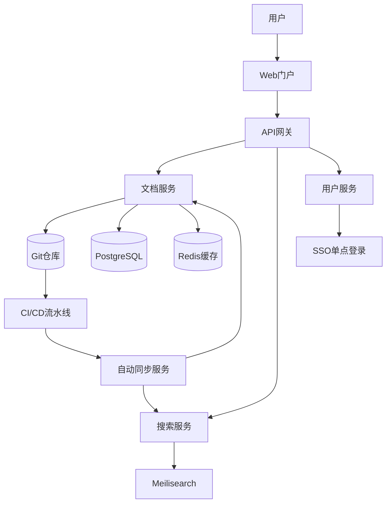
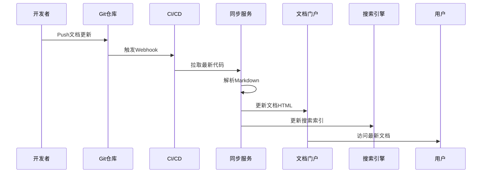

# zker Enterprise - 文档门户设计方案

> **文档编号**: DD-PORTAL-2025-001
> **项目名称**: zker Enterprise Edition - 文档门户系统
> **文档版本**: v1.0
> **编写日期**: 2025-12-29
> **密级**: 内部公开

---

## 文档修订历史

| 版本 | 日期 | 作者 | 修订说明 |
|------|------|------|----------|
| v1.0 | 2025-12-29 | AI助手 | 初始版本 |

---

## 目录

1. [设计概述](#1-设计概述)
2. [需求分析](#2-需求分析)
3. [架构设计](#3-架构设计)
4. [功能设计](#4-功能设计)
5. [技术选型](#5-技术选型)
6. [实施计划](#6-实施计划)
7. [运营维护](#7-运营维护)
8. [附录](#8-附录)

---

## 1. 设计概述

### 1.1 建设目标

为zker Enterprise项目构建一个**现代化的在线文档门户**，实现：

1. **统一文档管理**：集中管理所有项目文档（需求、设计、测试、运维）
2. **版本化管理**：文档与代码版本同步，支持版本追溯
3. **多端访问**：支持Web端、桌面端、移动端访问
4. **智能搜索**：全文检索、标签过滤、智能推荐
5. **协作编辑**：多人协同编辑、评论、审核
6. **自动更新**：从Git仓库自动同步文档更新

### 1.2 目标用户

| 用户类型 | 需求 | 核心功能 |
|---------|------|----------|
| **开发工程师** | 查阅API文档、设计文档 | 快速搜索、代码示例、离线访问 |
| **测试工程师** | 查阅测试用例、测试计划 | 用例执行记录、Bug追踪链接 |
| **产品经理** | 查阅需求文档、产品规划 | 文档变更历史、需求追溯 |
| **运维工程师** | 查阅运维文档、监控手册 | 快速定位问题、操作清单 |
| **管理人员** | 查阅项目报告、进度文档 | 仪表盘、数据可视化 |
| **外部用户** | 查阅公开API文档、用户手册 | 无需登录、公开访问 |

### 1.3 设计原则

- **用户至上**: 简洁易用，快速找到所需文档
- **内容为王**: 文档质量优先，避免过度设计
- **技术驱动**: 自动化优先，减少人工维护
- **安全可控**: 权限分级，敏感文档保护
- **可扩展性**: 模块化设计，便于功能扩展

---

## 2. 需求分析

### 2.1 功能需求

#### 2.1.1 文档管理

| 需求ID | 需求描述 | 优先级 |
|--------|----------|--------|
| DD-FUNC-001 | 支持文档分类（按模块、类型、版本） | P0 |
| DD-FUNC-002 | 支持Markdown格式文档渲染 | P0 |
| DD-FUNC-003 | 支持代码语法高亮（Go/JS/Python等） | P0 |
| DD-FUNC-004 | 支持Mermaid图表渲染（流程图、时序图、类图） | P0 |
| DD-FUNC-005 | 支持文档版本历史查看 | P1 |
| DD-FUNC-006 | 支持文档编辑（在线Markdown编辑） | P1 |
| DD-FUNC-007 | 支持文档评论与反馈 | P2 |
| DD-FUNC-008 | 支持文档导出（PDF/Word/HTML） | P2 |

#### 2.1.2 搜索功能

| 需求ID | 需求描述 | 优先级 |
|--------|----------|--------|
| DD-FUNC-009 | 全文检索（文档标题、内容、标签） | P0 |
| DD-FUNC-010 | 高级搜索（按模块、类型、作者、日期） | P1 |
| DD-FUNC-011 | 搜索结果高亮显示关键词 | P1 |
| DD-FUNC-012 | 搜索历史记录 | P2 |
| DD-FUNC-013 | 智能推荐（相关文档推荐） | P2 |

#### 2.1.3 权限管理

| 需求ID | 需求描述 | 优先级 |
|--------|----------|--------|
| DD-FUNC-014 | 公开文档无需登录即可访问 | P0 |
| DD-FUNC-015 | 内部文档需登录后访问 | P0 |
| DD-FUNC-016 | 敏感文档（如设计文档）需特定权限 | P1 |
| DD-FUNC-017 | 支持RBAC权限模型（读/写/审核） | P1 |
| DD-FUNC-018 | 租户隔离（不同租户查看各自文档） | P1 |

#### 2.1.4 自动化集成

| 需求ID | 需求描述 | 优先级 |
|--------|----------|--------|
| DD-FUNC-019 | Git仓库自动同步文档更新 | P0 |
| DD-FUNC-020 | API文档自动生成（Swagger集成） | P0 |
| DD-FUNC-021 | CI/CD触发文档构建与部署 | P1 |
| DD-FUNC-022 | 文档变更通知（钉钉/企业微信） | P2 |

### 2.2 非功能需求

#### 2.2.1 性能需求

| 指标 | 目标值 | 测试方法 |
|------|--------|----------|
| 页面加载时间 | P95 < 2s | Lighthouse测试 |
| 搜索响应时间 | P95 < 500ms | 性能测试 |
| 并发用户数 | 支持500+并发 | k6压测 |
| 文档渲染速度 | 10000字文档 < 1s | 浏览器测试 |

#### 2.2.2 可用性需求

| 指标 | 目标值 |
|------|--------|
| 系统可用性 | ≥ 99.5% |
| 故障恢复时间 | RTO < 30分钟 |
| 数据备份频率 | 每日备份 |

#### 2.2.3 兼容性需求

| 平台 | 支持版本 |
|------|----------|
| 浏览器 | Chrome 90+, Firefox 88+, Safari 14+, Edge 90+ |
| 移动端 | iOS 14+, Android 10+ |
| 桌面端 | Windows 10+, macOS 11+, Linux (Ubuntu 20.04+) |

#### 2.2.4 安全需求

- **HTTPS**: 全站HTTPS加密
- **认证**: 支持SSO单点登录
- **审计**: 完整的访问日志
- **备份**: 数据每日备份，异地容灾

---

## 3. 架构设计

### 3.1 整体架构

```
┌─────────────────────────────────────────────────────────────┐
│                      文档门户系统架构                          │
├─────────────────────────────────────────────────────────────┤
│                                                               │
│  【展示层】                                                   │
│  ├── Web门户 (Vue 3 + Nuxt 3)                               │
│  ├── 桌面客户端 (Electron)                                    │
│  └── 移动端H5 (响应式Web)                                      │
│                                                               │
│  【API网关层】                                                 │
│  ├── Nginx (反向代理 + 负载均衡)                              │
│  ├── API Gateway (Kong / 自研)                               │
│  └── CDN (静态资源加速)                                       │
│                                                               │
│  【应用服务层】                                               │
│  ├── 文档服务 (Document Service)                              │
│  │   ├── 文档渲染引擎                                         │
│  │   ├── 搜索引擎                                             │
│  │   └── 版本管理                                             │
│  ├── 用户服务 (User Service)                                  │
│  │   ├── 认证授权 (SSO集成)                                   │
│  │   └── 权限管理 (RBAC)                                      │
│  ├── 协作服务 (Collaboration Service)                         │
│  │   ├── 评论系统                                             │
│  │   ├── 审核流程                                             │
│  │   └── 通知推送                                             │
│  └── 同步服务 (Sync Service)                                  │
│      ├── Git Webhook处理                                      │
│      ├── Markdown解析                                         │
│      └── API文档生成                                          │
│                                                               │
│  【数据层】                                                   │
│  ├── 文档存储 (Git仓库 + 对象存储)                            │
│  ├── 搜索引擎 (Elasticsearch / Meilisearch)                   │
│  ├── 关系数据库 (PostgreSQL / MySQL)                          │
│  ├── 缓存 (Redis)                                             │
│  └── 消息队列 (NSQ / RabbitMQ)                               │
│                                                               │
│  【基础设施】                                                 │
│  ├── Kubernetes (容器编排)                                   │
│  ├── Docker (容器化)                                          │
│  ├── CI/CD (GitLab CI / GitHub Actions)                       │
│  └── 监控 (Prometheus + Grafana)                             │
│                                                               │
└─────────────────────────────────────────────────────────────┘
```

### 3.2 部署架构

#### 3.2.1 部署环境

```
开发环境 (Dev):
  └── 本地开发服务器 (localhost:3000)

测试环境 (Test):
  ├── 文档门户: http://docs-test.coze.com
  ├── API服务: http://docs-api-test.coze.com
  └── Git仓库: GitLab / GitHub

预发布环境 (Staging):
  ├── 文档门户: http://docs-staging.coze.com
  └── 与生产环境配置一致

生产环境 (Production):
  ├── 文档门户: https://docs.coze.com
  ├── CDN加速: https://cdn.docs.coze.com
  └── 高可用部署 (多实例 + 负载均衡)
```

#### 3.2.2 技术栈选型

| 层级 | 技术选型 | 说明 |
|------|----------|------|
| **前端框架** | Vue 3 + Nuxt 3 | SSR支持，SEO友好 |
| **UI组件库** | Naive UI | 优秀的文档体验 |
| **文档渲染** | vitepress | 或Docusaurus，Markdown渲染 |
| **代码高亮** | Shiki | 速度快，主题丰富 |
| **图表渲染** | Mermaid | 流程图、时序图、类图 |
| **搜索** | Meilisearch | 轻量级全文搜索引擎 |
| **后端API** | Go 1.23 + Hertz | 或Node.js + NestJS |
| **Web框架** | Nuxt 3 Server API | 前后端一体 |
| **数据库** | PostgreSQL | 文档元数据存储 |
| **缓存** | Redis 7.0 | 搜索结果缓存 |
| **对象存储** | MinIO | Git仓库 + 文件存储 |
| **CI/CD** | GitLab CI / GitHub Actions | 自动构建部署 |
| **容器化** | Docker + Kubernetes | 容器编排 |
| **监控** | Prometheus + Grafana | 性能监控 |

---

## 4. 功能设计

### 4.1 文档组织结构

#### 4.1.1 文档分类体系

```
文档门户
│
├── 公开文档 (无需登录)
│   ├── 产品介绍
│   ├── 快速开始
│   ├── API参考 (Swagger自动生成)
│   └── 用户手册
│
├── 项目文档 (需登录)
│   ├── 00-文档索引
│   ├── 01-项目级文档
│   │   ├── 可行性研究报告
│   │   ├── 软件需求规格说明书
│   │   ├── 概要设计说明书
│   │   ├── 详细设计说明书
│   │   ├── 数据库设计文档
│   │   ├── 测试计划
│   │   └── 测试用例
│   ├── 02-架构文档
│   │   ├── 系统架构
│   │   ├── 技术架构
│   │   └── 部署架构
│   ├── 03-开发规范
│   │   ├── 前端开发规范
│   │   ├── 后端开发规范
│   │   ├── Git工作流规范
│   │   └── API设计规范
│   ├── 04-运维文档
│   │   ├── 部署手册
│   │   ├── 运维手册
│   │   ├── 监控手册
│   │   └── 应急预案
│   └── 05-培训文档
│       ├── 新人培训
│       ├── 技术分享
│       └── 最佳实践
│
└── 租户文档 (租户隔离)
    └── (每个租户独立文档空间)
```

#### 4.1.2 文档元数据

每个文档包含以下元数据：

```yaml
---
title: "文档标题"
description: "文档简介"
category: "分类"
tags: ["标签1", "标签2"]
author: "作者"
date: "2025-12-29"
version: "1.0"
last_updated: "2025-12-29"
status: "published" # draft, published, deprecated
permissions:
  read: ["all", "developers", "managers"]
  write: ["developers", "architects"]
related:
  - "相关文档1"
  - "相关文档2"
---
```

### 4.2 核心功能设计

#### 4.2.1 文档渲染引擎

**功能需求**: DD-FUNC-002, DD-FUNC-003, DD-FUNC-004

**设计要点**:

1. **Markdown渲染**:
   - 使用`vitepress`或`Docusaurus`作为渲染引擎
   - 支持GitHub Flavored Markdown (GFM)
   - 支持自定义容器、提示框、标签

2. **代码高亮**:
   - 使用`Shiki`或`Prism.js`
   - 支持Go/JavaScript/Python/SQL等语言
   - 支持行号显示、代码复制

3. **Mermaid图表**:
   - 支持流程图、时序图、类图、状态图
   - 图表可交互（点击缩放、导出PNG）

4. **数学公式**:
   - 支持LaTeX数学公式
   - 使用`KaTeX`或`MathJax`

**实现示例**:

```vue
<template>
  <div class="document-renderer">
    <ContentRenderer :content="document.content" />
    <CodeHighlight :code="document.codeBlocks" />
    <MermaidChart :diagram="document.mermaidDiagrams" />
  </div>
</template>

<script setup>
import { ContentRenderer } from '@nuxt/content'
import { Shiki } from 'shiki'
import Mermaid from 'mermaid'
</script>
```

#### 4.2.2 搜索功能

**功能需求**: DD-FUNC-009 ~ DD-FUNC-013

**设计要点**:

1. **全文检索**:
   - 使用`Meilisearch`作为搜索引擎
   - 索引文档标题、内容、标签
   - 支持中文分词（jieba）

2. **高级搜索**:
   - 按模块、类型、作者、日期筛选
   - 支持布尔搜索（AND/OR/NOT）
   - 支持短语搜索（双引号）

3. **搜索结果**:
   - 关键词高亮显示
   - 相关度排序
   - 搜索结果分页

4. **智能推荐**:
   - 基于用户搜索历史推荐
   - 基于文档标签推荐
   - 基于阅读路径推荐（"阅读了本文的人也读了..."）

**数据结构**:

```json
{
  "id": "doc_001",
  "title": "租户管理服务详细设计",
  "content": "完整的租户管理设计...",
  "category": "详细设计",
  "tags": ["租户管理", "DDD", "Go"],
  "author": "架构师",
  "url": "/detailed-design#tenant-service",
  "last_updated": "2025-12-29T10:00:00Z"
}
```

#### 4.2.3 权限控制

**功能需求**: DD-FUNC-014 ~ DD-FUNC-018

**设计要点**:

1. **权限分级**:
   - **公开**: 无需登录
   - **内部**: 需登录，可查看内部文档
   - **机密**: 需特定角色权限
   - **租户隔离**: 不同租户只查看自己文档

2. **RBAC模型**:
   ```
   角色:
     - visitor: 访客（仅公开文档）
     - developer: 开发者（内部文档）
     - architect: 架构师（所有文档 + 编辑权限）
     - manager: 管理者（所有文档 + 审核权限）

   权限:
     - read: 读取文档
     - write: 编辑文档
     - audit: 审核文档
   ```

3. **权限实现**:
   - 前端：路由守卫（Route Guards）
   - 后端：API权限验证
   - 数据库：文档表加租户ID和权限字段

**数据库设计**:

```sql
CREATE TABLE documents (
  id VARCHAR(64) PRIMARY KEY,
  tenant_id VARCHAR(64) NOT NULL,
  title VARCHAR(255) NOT NULL,
  content TEXT NOT NULL,
  category VARCHAR(64),
  tags JSON,
  is_public BOOLEAN DEFAULT FALSE,
  read_roles JSON,  -- ["all", "developers", "managers"]
  write_roles JSON,
  created_at TIMESTAMP DEFAULT CURRENT_TIMESTAMP,
  updated_at TIMESTAMP DEFAULT CURRENT_TIMESTAMP ON UPDATE CURRENT_TIMESTAMP,
  INDEX idx_tenant_id (tenant_id),
  INDEX idx_category (category),
  FULLTEXT INDEX idx_content (title, content)
);
```

#### 4.2.4 Git同步功能

**功能需求**: DD-FUNC-019 ~ DD-FUNC-022

**工作流程**:

```
1. 开发人员更新文档
   ↓
2. Git Commit & Push
   ↓
3. GitLab CI / GitHub Actions 触发
   ↓
4. 文档同步服务拉取最新代码
   ↓
5. 解析Markdown文档
   ├─ 提取元数据
   ├─ 生成HTML
   ├─ 索引到Meilisearch
   └─ 生成API文档（Swagger → JSON）
   ↓
6. 部署到文档门户
   ↓
7. 发送通知（钉钉/企业微信）
```

**技术实现**:

```yaml
# .github/workflows/sync-docs.yml
name: Sync Documents

on:
  push:
    branches: [main]
    paths:
      - 'docs/**.md'

jobs:
  sync:
    runs-on: ubuntu-latest
    steps:
      - name: Checkout code
        uses: actions/checkout@v2

      - name: Setup Node.js
        uses: actions/setup-node@v2
        with:
          node-version: '18'

      - name: Install dependencies
        run: npm ci

      - name: Build documentation
        run: npm run build:docs

      - name: Sync to search engine
        run: npm run sync:search

      - name: Deploy to portal
        run: npm run deploy:docs

      - name: Notify updates
        uses: 8398a7/action-slack@v3
        with:
          status: ${{ job.status }}
          text: '文档已更新到门户站点'
```

#### 4.2.5 文档编辑功能

**功能需求**: DD-FUNC-006, DD-FUNC-007

**设计要点**:

1. **在线编辑器**:
   - 使用`Milkdown`或`ByteMD`作为Markdown编辑器
   - 支持实时预览（分屏模式）
   - 支持快捷键（Ctrl+B加粗、Ctrl+K插入代码块）
   - 支持图片上传（拖拽上传）

2. **编辑模式**:
   - 编辑模式锁定（防止多人同时编辑）
   - 自动保存（每30秒）
   - 版本历史（支持回滚）

3. **评论与审核**:
   - 支持行内评论（类似GitHub PR Review）
   - 评论通知（@相关人员）
   - 文档审核流程（草稿 → 审核 → 发布）

**界面设计**:

```
┌────────────────────────────────────────────────┐
│  文档编辑器                                    │
├────────────────────────────────────────────────┤
│                                                │
│  [Markdown编辑区]  │  [实时预览区]            │
│  ┌──────────────┐  │  ┌──────────────────┐    │
│  │ # 标题       │  │  │  标题            │    │
│  │              │  │  │  ━━━             │    │
│  │ 内容         │  │  │  内容           │    │
│  │              │  │  │                  │    │
│  └──────────────┘  │  └──────────────────┘    │
│                                                │
│  [工具栏: 加粗 * | 斜体 / | 代码 ``` | ...]   │
│  [保存草稿] [提交审核] [查看历史] [全屏]      │
└────────────────────────────────────────────────┘
```

---

## 5. 技术选型

### 5.1 前端技术选型

#### 方案对比

| 方案 | 优点 | 缺点 | 推荐度 |
|------|------|------|--------|
| **VitePress** | 轻量、快速、Vue生态好 | 定制性较弱 | ⭐⭐⭐⭐⭐ |
| **Docusaurus** | Meta官方、功能强大 | 学习曲线陡峭 | ⭐⭐⭐⭐ |
| **GitBook** | 老牌、稳定 | 功能较老、更新慢 | ⭐⭐⭐ |
| **VuePress** | Vue 2生态 | 不维护了 | ⭐⭐ |

**推荐方案**: **VitePress**

**理由**:
1. 基于Vite，构建速度快
2. Vue 3生态，与项目技术栈一致
3. 支持自定义组件，扩展性强
4. 内置搜索、SEO优化

### 5.2 后端技术选型

#### 方案对比

| 方案 | 优点 | 缺点 | 推荐度 |
|------|------|------|--------|
| **Nuxt Server API** | 前后端一体、开发效率高 | 性能略低 | ⭐⭐⭐⭐⭐ |
| **Go + Hertz** | 性能好、与项目一致 | 需单独开发 | ⭐⭐⭐⭐ |
| **Node.js + NestJS** | 生态丰富、TypeScript支持 | 性能不如Go | ⭐⭐⭐⭐ |

**推荐方案**: **Nuxt Server API**

**理由**:
1. 前后端技术栈统一（Vue 3）
2. 开发效率高，代码复用
3. 性能满足需求（可通过缓存优化）

### 5.3 搜索引擎选型

#### 方案对比

| 方案 | 优点 | 缺点 | 推荐度 |
|------|------|------|--------|
| **Meilisearch** | 轻量、快速、易部署 | 功能相对简单 | ⭐⭐⭐⭐⭐ |
| **Elasticsearch** | 功能强大、生态好 | 资源占用大 | ⭐⭐⭐ |
| **Algolia** | 云服务、体验好 | 成本高、数据在外 | ⭐⭐⭐⭐ |

**推荐方案**: **Meilisearch**

**理由**:
1. 轻量级，资源占用小（< 100MB）
2. 开源免费，可自托管
3. 中文支持好（jieba分词）
4. API简洁，集成容易

---

## 6. 实施计划

### 6.1 实施阶段

#### 第一阶段：MVP版本 (4周)

**目标**: 搭建基础文档门户，支持文档浏览和搜索

**任务**:
- Week 1-2: 环境搭建与选型
  - 技术选型确认
  - 开发环境搭建
  - CI/CD流水线搭建
- Week 3: 核心功能开发
  - 文档渲染引擎
  - 基础导航与分类
  - 全文搜索功能
- Week 4: 部署与上线
  - 部署到测试环境
  - 性能测试与优化
  - 上线试运行

**交付物**:
- 可访问的文档门户（测试环境）
- 基础文档（导入现有项目文档）

#### 第二阶段：功能完善 (6周)

**目标**: 增加协作、权限、同步功能

**任务**:
- Week 5-6: 用户系统与权限
  - 用户注册/登录（SSO集成）
  - RBAC权限模型
  - 租户隔离
- Week 7-8: Git同步与自动化
  - Git Webhook集成
  - 自动构建部署
  - API文档自动生成
- Week 9-10: 协作功能
  - 在线编辑器
  - 评论系统
  - 审核流程

**交付物**:
- 完整功能的文档门户（生产环境）
- 用户手册和运维文档

#### 第三阶段：优化提升 (4周)

**目标**: 性能优化、用户体验提升

**任务**:
- Week 11: 性能优化
  - 页面加载速度优化（目标 P95 < 2s）
  - 搜索性能优化（目标 P95 < 500ms）
  - CDN加速
- Week 12: 用户体验优化
  - 响应式设计（移动端优化）
  - 暗黑模式
  - 国际化支持（i18n）

**交付物**:
- 性能测试报告
- 用户体验优化报告

### 6.2 时间线

```
Month 1: MVP版本
  Week 1-2: 环境搭建与选型
  Week 3: 核心功能开发
  Week 4: 部署与上线

Month 2-3: 功能完善
  Week 5-6: 用户系统与权限
  Week 7-8: Git同步与自动化
  Week 9-10: 协作功能

Month 3: 优化提升
  Week 11: 性能优化
  Week 12: 用户体验优化
```

---

## 7. 运营维护

### 7.1 内容运营

#### 7.1.1 文档更新机制

**更新频率**:
- **项目文档**: 每个Sprint结束时更新
- **API文档**: 每次代码发布时自动更新
- **运维文档**: 每次架构变更时更新

**更新流程**:
1. 文档变更 → Git Commit
2. Push到main分支 → 触发CI/CD
3. 自动构建部署 → 文档门户更新
4. 发送通知（钉钉/企业微信）

#### 7.1.2 文档审核流程

**审核角色**:
- **文档作者**: 编写文档
- **技术审核**: 架构师/技术负责人
- **发布审核**: 产品经理/项目经理

**审核流程**:
```
草稿 (Draft)
  ↓ 作者提交
待审核 (Pending)
  ↓ 技术审核
  ↓ 发布审核
已发布 (Published)
```

### 7.2 系统维护

#### 7.2.1 日常运维

**监控指标**:
- 页面访问量（PV/UV）
- 搜索使用量
- 文档更新频率
- 系统性能指标（响应时间、错误率）

**告警规则**:
- 系统不可用 > 5分钟 → 电话告警
- 响应时间 P95 > 3s → 短信告警
- 搜索失败率 > 1% → 邮件告警

#### 7.2.2 数据备份

**备份策略**:
- 文档数据库：每日全量备份
- Git仓库：GitLab/GitHub自带备份
- 搜索索引：每周重建索引

**恢复演练**:
- 每季度进行一次灾难恢复演练
- 验证备份可用性

---

## 8. 附录

### 附录A: 技术架构图



### 附录B: 数据流图



### 附录C: 技术栈清单

| 类别 | 技术选型 | 版本 |
|------|----------|------|
| **前端框架** | Vue | 3.x |
| | Nuxt | 3.x |
| | VitePress | 1.x |
| **UI组件** | Naive UI | 2.x |
| **代码高亮** | Shiki | 1.x |
| **图表渲染** | Mermaid | 11.x |
| **后端框架** | Nuxt Server API | 3.x |
| **数据库** | PostgreSQL | 15.x |
| **缓存** | Redis | 7.x |
| **搜索** | Meilisearch | 1.x |
| **容器化** | Docker | 24.x |
| **编排** | Kubernetes | 1.28.x |
| **CI/CD** | GitLab CI / GitHub Actions | - |

---

**文档结束**

> 本设计方案为zker Enterprise项目的文档门户建设提供了完整的技术路线图，涵盖需求分析、架构设计、功能设计、技术选型、实施计划和运营维护，为后续实施提供清晰的指导。
