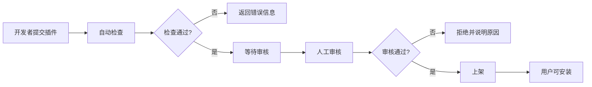

# 12-百应开发平台_商店生态 详细设计说明书

**文档编号**: DE-DD-2025-012
**模块名称**: 商店生态 (PluginStore)
**版本**: v1.0.0
**作者**: ZKER Enterprise Team
**创建日期**: 2025-01-03

---

## 1. 模块概述

**商店生态** 是 ZKER 的插件/技能市场模块，通过**复用 zker Plugin Store** + 商业化功能扩展，实现插件上架、审核、计费、评价等完整生态。

**核心设计理念**：
- ✅ **100%复用**：直接复用 zker Plugin Store
- ✅ **商业化**：支持付费插件、收入分成
- ✅ **审核机制**：插件上架审核流程

**实现策略**：✅ 100% 复用 zker Plugin Store + 配置化扩展

---

## 2. 核心功能

### 2.1 开发者功能

**F1 - 插件管理**
- F1.1 上传插件
- F1.2 更新插件版本
- F1.3 查看插件数据（下载量、收入）

**F2 - 收益管理**
- F2.1 查看收入明细
- F2.2 提现申请
- F2.3 收益报表

### 2.2 用户功能

**F3 - 插件浏览**
- F3.1 浏览插件商店
- F3.2 搜索插件
- F3.3 按分类筛选
- F3.4 查看插件详情

**F4 - 插件购买**
- F4.1 免费插件安装
- F4.2 付费插件购买
- F4.3 插件评价

---

## 3. 复用 zker Plugin Store

### 3.1 直接复用的表

**完全复用 zker 现有表**：

| 表名 | 说明 | 备注 |
|------|------|------|
| `plugins` | 插件定义 | 直接复用 |
| `plugin_versions` | 插件版本 | 直接复用 |
| `plugin_reviews` | 插件评价 | 直接复用 |
| `plugin_downloads` | 下载记录 | 直接复用 |

### 3.2 扩展商业化字段

**对 `plugins` 表增加字段**：

```sql
-- 扩展 plugins 表（如果zker没有，通过ALTER TABLE添加）
ALTER TABLE plugins ADD COLUMN pricing_type ENUM('free', 'paid', 'freemium') DEFAULT 'free';
ALTER TABLE plugins ADD COLUMN price DECIMAL(10,2) DEFAULT NULL COMMENT '价格';
ALTER TABLE plugins ADD COLUMN revenue_share_rate DECIMAL(5,4) DEFAULT 0.7000 COMMENT '收入分成率（开发者70%）';
ALTER TABLE plugins ADD COLUMN total_revenue DECIMAL(12,2) DEFAULT 0.00 COMMENT '总收入';
ALTER TABLE plugins ADD COLUMN status ENUM('draft', 'pending_review', 'approved', 'rejected', 'suspended') DEFAULT 'draft';
```

### 3.3 新增审核表

```sql
CREATE TABLE plugin_reviews_audit (
    id BIGINT PRIMARY KEY AUTO_INCREMENT,
    plugin_id VARCHAR(64) NOT NULL,
    version VARCHAR(20) NOT NULL,
    submitter_id BIGINT NOT NULL,
    reviewer_id BIGINT COMMENT '审核人ID',

    status ENUM('pending', 'approved', 'rejected') DEFAULT 'pending',
    review_comments TEXT COMMENT '审核意见',
    reviewed_at DATETIME,

    submitted_at DATETIME DEFAULT CURRENT_TIMESTAMP,

    INDEX idx_status (status),
    INDEX idx_plugin_id (plugin_id)
) ENGINE=InnoDB DEFAULT CHARSET=utf8mb4 COLLATE=utf8mb4_unicode_ci
COMMENT='插件审核表';
```

---

## 4. API 设计（复用）

### 4.1 完全复用的 API

| 方法 | 路径 | 功能 | 实现方式 |
|------|------|------|----------|
| GET | /api/v1/store/plugins | 列出插件 | → zker PluginService |
| GET | /api/v1/store/plugins/:id | 插件详情 | → zker PluginService |
| POST | /api/v1/store/plugins/:id/install | 安装插件 | → zker PluginService |
| GET | /api/v1/store/plugins/:id/reviews | 查看评价 | → zker PluginService |

### 4.2 扩展商业化 API

| 方法 | 路径 | 功能 |
|------|------|------|
| POST | /api/v1/store/plugins/:id/purchase | 购买付费插件 |
| GET | /api/v1/store/my-plugins | 我的插件 |
| POST | /api/v1/store/plugins/:id/submit-for-review | 提交审核 |
| GET | /api/v1/store/earnings | 查看收益 |

---

## 5. 配置系统设计

### 5.1 商业化配置

```sql
-- 插件定价配置
UPDATE plugins SET
  pricing_type = 'paid',
  price = 99.00,
  revenue_share_rate = 0.70
WHERE id = 'plugin-email-sender-001';

-- 免费插件
UPDATE plugins SET
  pricing_type = 'free',
  price = NULL
WHERE id = 'plugin-weather-001';
```

---

## 6. 插件生态建设方案 🆕

> **本章节补充自**: 《Coze商用版与开源版全功能完整对比分析报告》P1-4节
> **补充日期**: 2025-12-29
> **补充内容**: 官方插件清单、评价系统设计、开发指南

### 6.1 官方插件集开发清单

**设计目的**: 提供20-30个官方插件,降低用户使用门槛,丰富Bot能力。

#### 6.1.1 优先插件列表（10个插件）

| **插件名称** | **功能描述** | **工作量** | **优先级** | **技术栈** |
|------------|------------|----------|----------|----------|
| **Google搜索** | 网页搜索、搜索结果摘要 | 2人天 | P0 | Google Custom Search API |
| **天气查询** | 实时天气、天气预报 | 0.5人天 | P0 | OpenWeatherMap API |
| **新闻资讯** | 热点新闻、分类新闻 | 1人天 | P0 | NewsAPI |
| **网页抓取** | 网页内容提取、摘要生成 | 1人天 | P0 | Jina Reader API |
| **邮件发送** | 发送邮件、邮件模板 | 1人天 | P1 | SMTP / SendGrid API |
| **日程管理** | 创建事件、查询日程 | 1人天 | P1 | Google Calendar API |
| **地图服务** | 地点搜索、路线规划 | 1人天 | P1 | Google Maps API |
| **数据可视化** | 图表生成、数据报告 | 1人天 | P1 | Chart.js / ECharts |
| **文档处理** | PDF解析、Word处理 | 1人天 | P1 | PyPDF2 / python-docx |
| **图片生成** | AI图片生成(DALL-E) | 1人天 | P1 | OpenAI DALL-E API |

**总计**: **10.5人天**

#### 6.1.2 扩展插件列表（20个插件）

| **插件名称** | **功能描述** | **工作量** | **优先级** |
|------------|------------|----------|----------|
| **翻译服务** | 多语言翻译、文本翻译 | 0.5人天 | P1 |
| **OCR识别** | 图片文字识别 | 0.5人天 | P1 |
| **语音合成** | TTS文字转语音 | 1人天 | P2 |
| **语音识别** | STT语音转文字 | 1人天 | P2 |
| **股票查询** | 股票行情、财务数据 | 1人天 | P2 |
| **汇率换算** | 实时汇率、货币转换 | 0.5人天 | P2 |
| **二维码生成** | 二维码生成、识别 | 0.5人天 | P2 |
| **短链接** | 短链接生成、解析 | 0.5人天 | P2 |
| **IP查询** | IP地址查询、定位 | 0.5人天 | P2 |
| **WHOIS查询** | 域名信息查询 | 0.5人天 | P2 |
| **文件转换** | 文档格式转换 | 1人天 | P2 |
| **视频下载** | 视频URL解析、下载 | 1人天 | P2 |
| **图片处理** | 图片裁剪、压缩、滤镜 | 1人天 | P2 |
| **加密解密** | 数据加密、解密 | 0.5人天 | P2 |
| **JSON格式化** | JSON格式化、验证 | 0.5人天 | P2 |
| **正则测试** | 正则表达式测试 | 0.5人天 | P2 |
| **时间转换** | 时间戳转换、时区转换 | 0.5人天 | P2 |
| **Base64编解码** | Base64编码解码 | 0.5人天 | P2 |
| **Hash计算** | MD5、SHA1、SHA256等 | 0.5人天 | P2 |
| **UUID生成** | UUID/GUID生成 | 0.5人天 | P2 |

**总计**: **14人天**

**所有插件总计**: 30个插件，24.5人天

---

### 6.2 插件评价系统设计

#### 6.2.1 评价功能数据库设计

```sql
-- 扩展 plugin_reviews 表
ALTER TABLE plugin_reviews ADD COLUMN rating_tinyint COMMENT '评分(1-5)';
ALTER TABLE plugin_reviews ADD COLUMN helpful_count INT DEFAULT 0 COMMENT '有用数';
ALTER TABLE plugin_reviews ADD COLUMN reply TEXT COMMENT '开发者回复';
ALTER TABLE plugin_reviews ADD COLUMN replied_at DATETIME COMMENT '回复时间';
ALTER TABLE plugin_reviews ADD COLUMN verified BOOLEAN DEFAULT FALSE COMMENT '是否已验证(已购买/已使用)';

-- 插件使用统计表
CREATE TABLE plugin_usage_stats (
    id BIGINT PRIMARY KEY AUTO_INCREMENT,
    plugin_id VARCHAR(64) NOT NULL,
    date DATE NOT NULL,

    -- 使用统计
    installs INT DEFAULT 0 COMMENT '安装次数',
    uninstalls INT DEFAULT 0 COMMENT '卸载次数',
    active_users INT DEFAULT 0 COMMENT '活跃用户数',

    -- 调用统计
    api_calls INT DEFAULT 0 COMMENT 'API调用次数',
    avg_response_time DECIMAL(10,2) COMMENT '平均响应时间(ms)',
    error_rate DECIMAL(5,4) DEFAULT 0.0000 COMMENT '错误率',

    created_at DATETIME DEFAULT CURRENT_TIMESTAMP,
    updated_at DATETIME DEFAULT CURRENT_TIMESTAMP ON UPDATE CURRENT_TIMESTAMP,

    UNIQUE KEY uk_plugin_date (plugin_id, date),
    INDEX idx_plugin_id (plugin_id),
    INDEX idx_date (date)
) ENGINE=InnoDB DEFAULT CHARSET=utf8mb4 COLLATE=utf8mb4_unicode_ci
COMMENT='插件使用统计表';
```

#### 6.2.2 评价API设计

```http
# 提交评价
POST /api/v1/store/plugins/:id/reviews

Request Body:
{
  "rating": 5,
  "title": "非常好用的插件",
  "content": "功能强大,易于使用,强烈推荐!",
  "verified": true  // 是否已验证
}

Response 200:
{
  "code": 0,
  "message": "评价成功",
  "data": {
    "id": 123,
    "plugin_id": "plugin-weather-001",
    "user_id": 456,
    "rating": 5,
    "title": "非常好用的插件",
    "content": "功能强大,易于使用,强烈推荐!",
    "verified": true,
    "helpful_count": 0,
    "created_at": "2025-01-03T00:00:00Z"
  }
}

# 标记有用
POST /api/v1/store/plugins/reviews/:review_id/helpful

Response 200:
{
  "code": 0,
  "message": "标记成功",
  "data": {
    "helpful_count": 1
  }
}

# 获取插件评价
GET /api/v1/store/plugins/:id/reviews

Query Parameters:
  - page: int (页码,默认1)
  - page_size: int (每页数量,默认20)
  - rating: int (筛选评分,可选)
  - sort: string (排序方式: newest/helpful/verified)

Response 200:
{
  "code": 0,
  "data": {
    "total": 150,
    "average_rating": 4.5,
    "rating_distribution": {
      "5": 100,
      "4": 30,
      "3": 15,
      "2": 3,
      "1": 2
    },
    "items": [
      {
        "id": 123,
        "user_id": 456,
        "username": "用户A",
        "avatar": "https://...",
        "rating": 5,
        "title": "非常好用的插件",
        "content": "功能强大,易于使用",
        "verified": true,
        "helpful_count": 25,
        "created_at": "2025-01-03T00:00:00Z"
      }
    ]
  }
}
```

#### 6.2.3 推荐算法设计

**综合评分算法**:

```go
// pkg/plugin/service/recommendation.go
package service

type RecommendationService struct{}

// CalculatePluginScore 计算插件综合得分
func (s *RecommendationService) CalculatePluginScore(pluginID string) (float64, error) {
    // 1. 获取评价统计
    var stats struct {
        AverageRating   float64
        TotalReviews    int
        TotalInstalls   int
        ActiveUsers     int
        ErrorRate       float64
        AvgResponseTime float64
    }

    err := s.db.Raw(`
        SELECT
            AVG(r.rating) as average_rating,
            COUNT(r.id) as total_reviews,
            SUM(CASE WHEN s.installs THEN s.installs ELSE 0 END) as total_installs,
            SUM(CASE WHEN s.active_users THEN s.active_users ELSE 0 END) as active_users,
            AVG(s.error_rate) as error_rate,
            AVG(s.avg_response_time) as avg_response_time
        FROM plugin_reviews r
        RIGHT JOIN plugin_usage_stats s ON s.plugin_id = r.plugin_id
        WHERE r.plugin_id = ?
    `, pluginID).Scan(&stats).Error

    if err != nil {
        return 0, err
    }

    // 2. 计算综合得分(加权算法)
    score := 0.0

    // 评分权重: 40%
    if stats.AverageRating > 0 {
        score += (stats.AverageRating / 5.0) * 40
    }

    // 评价数量权重: 20% (越多评价,得分越高,但有上限)
    reviewScore := math.Min(float64(stats.TotalReviews)/100.0, 1.0) * 20
    score += reviewScore

    // 安装量权重: 20% (越多安装,得分越高,但有上限)
    installScore := math.Min(float64(stats.TotalInstalls)/1000.0, 1.0) * 20
    score += installScore

    // 活跃度权重: 10%
    if stats.TotalInstalls > 0 {
        activeScore := (float64(stats.ActiveUsers) / float64(stats.TotalInstalls)) * 10
        score += activeScore
    }

    // 稳定性权重: 10% (错误率越低,响应时间越快,得分越高)
    stabilityScore := (1.0 - stats.ErrorRate) * 5
    if stats.AvgResponseTime < 1000 {
        stabilityScore += 5
    } else if stats.AvgResponseTime < 3000 {
        stabilityScore += 2.5
    }
    score += stabilityScore

    return score, nil
}

// GetRecommendedPlugins 获取推荐插件
func (s *RecommendationService) GetRecommendedPlugins(
    ctx context.Context,
    limit int,
) ([]*Plugin, error) {
    // 1. 计算所有插件得分
    plugins, err := s.getAllPlugins(ctx)
    if err != nil {
        return nil, err
    }

    for _, plugin := range plugins {
        score, _ := s.CalculatePluginScore(plugin.ID)
        plugin.Score = score
    }

    // 2. 按得分排序
    sort.Slice(plugins, func(i, j int) bool {
        return plugins[i].Score > plugins[j].Score
    })

    // 3. 返回前N个
    if len(plugins) > limit {
        plugins = plugins[:limit]
    }

    return plugins, nil
}
```

---

### 6.3 插件开发指南

#### 6.3.1 插件开发规范

**插件结构规范**:

```yaml
# 插件清单文件 plugin.yaml
name: "Google搜索"
id: "plugin-google-search-001"
version: "1.0.0"
author: "ZKER Team"
description: "使用Google搜索网页内容"
icon: "icon.png"

# 配置项
config_schema:
  - name: api_key
    type: string
    required: true
    label: "API Key"
    description: "Google Custom Search API Key"
  - name: cx
    type: string
    required: true
    label: "搜索引擎ID"
    description: "Custom Search Engine ID"

# 权限
permissions:
  - http:api.google.com  # HTTP请求权限
  - storage:kv          # KV存储权限

# 入口点
entry_point: "main.py"
runtime: "python3.9"
```

**插件代码规范**:

```python
# main.py
from plugin_sdk import Plugin, PluginContext

class GoogleSearchPlugin(Plugin):
    def __init__(self, config: dict):
        self.api_key = config.get('api_key')
        self.cx = config.get('cx')

    def search(self, query: str, num: int = 10) -> list:
        """
        搜索功能

        Args:
            query: 搜索关键词
            num: 返回结果数量(默认10)

        Returns:
            搜索结果列表
        """
        import requests

        url = "https://www.googleapis.com/customsearch/v1"
        params = {
            "key": self.api_key,
            "cx": self.cx,
            "q": query,
            "num": num
        }

        response = requests.get(url, params=params)
        response.raise_for_status()

        data = response.json()

        results = []
        for item in data.get("items", []):
            results.append({
                "title": item.get("title"),
                "link": item.get("link"),
                "snippet": item.get("snippet")
            })

        return results

# 插件入口
def create_plugin(config: dict) -> GoogleSearchPlugin:
    return GoogleSearchPlugin(config)
```

#### 6.3.2 插件SDK设计

```python
# plugin_sdk.py
from abc import ABC, abstractmethod
from typing import Dict, Any, List

class Plugin(ABC):
    """插件基类"""

    @abstractmethod
    def get_metadata(self) -> Dict[str, Any]:
        """获取插件元数据"""
        pass

    @abstractmethod
    def validate_config(self, config: Dict[str, Any]) -> bool:
        """验证配置"""
        pass

class ToolPlugin(Plugin):
    """工具类插件基类"""

    @abstractmethod
    def execute(self, params: Dict[str, Any]) -> Any:
        """执行工具"""
        pass

    def get_schema(self) -> Dict[str, Any]:
        """获取参数Schema(JSON Schema格式)"""
        pass

class DataSourcePlugin(Plugin):
    """数据源插件基类"""

    @abstractmethod
    def query(self, query: str) -> List[Any]:
        """查询数据"""
        pass

    def connect(self) -> bool:
        """建立连接"""
        pass

    def disconnect(self) -> bool:
        """断开连接"""
        pass

class PluginContext:
    """插件上下文"""

    def __init__(self, config: Dict[str, Any], storage: Any):
        self.config = config
        self.storage = storage
        self.logger = get_logger()

    def get_config(self, key: str, default: Any = None) -> Any:
        """获取配置项"""
        return self.config.get(key, default)

    def get_storage(self) -> Any:
        """获取存储"""
        return self.storage
```

---

### 6.4 插件上架流程

#### 6.4.1 提交审核流程



**自动检查项**:
- ✅ plugin.yaml格式正确
- ✅ 必填字段完整
- ✅ 配置Schema有效
- ✅ 代码安全扫描(无恶意代码)
- ✅ 权限声明合规

**人工审核项**:
- ✅ 功能描述准确
- ✅ 无侵权内容
- ✅ 无违规信息
- ✅ 测试通过

#### 6.4.2 插件审核表设计

已在第3节定义 `plugin_reviews_audit` 表。

#### 6.4.3 审核API设计

```http
# 提交审核
POST /api/v1/store/plugins/:id/submit-for-review

Request Body:
{
  "version": "1.0.0",
  "changelog": "修复了XX问题,增加了XX功能"
}

Response 200:
{
  "code": 0,
  "message": "提交成功,等待审核",
  "data": {
    "audit_id": 456,
    "status": "pending",
    "submitted_at": "2025-01-03T00:00:00Z"
  }
}

# 审核插件(管理员)
POST /api/v1/store/admin/plugins/:id/audit

Request Body:
{
  "status": "approved",  // approved | rejected
  "comments": "审核通过"
}

Response 200:
{
  "code": 0,
  "message": "审核完成",
  "data": {
    "audit_id": 456,
    "status": "approved",
    "reviewed_at": "2025-01-03T01:00:00Z"
  }
}
```

---

### 6.5 插件商店前端设计

#### 6.5.1 商店首页

```tsx
// src/pages/plugin-store/StoreHomePage.tsx
import React, { useState, useEffect } from 'react';
import { Card, Row, Col, Tag, Button, Input } from '@douyinfe/semi-ui';
import { pluginApi } from '@/api/plugin';

export const StoreHomePage: React.FC = () => {
  const [categories, setCategories] = useState([]);
  const [recommendedPlugins, setRecommendedPlugins] = useState([]);
  const [popularPlugins, setPopularPlugins] = useState([]);
  const [newPlugins, setNewPlugins] = useState([]);

  useEffect(() => {
    loadStoreData();
  }, []);

  const loadStoreData = async () => {
    const [categoriesResp, recommendedResp, popularResp, newResp] = await Promise.all([
      pluginApi.getCategories(),
      pluginApi.getRecommendedPlugins(10),
      pluginApi.getPopularPlugins(10),
      pluginApi.getNewPlugins(10),
    ]);

    setCategories(categoriesResp.data);
    setRecommendedPlugins(recommendedResp.data.items);
    setPopularPlugins(popularResp.data.items);
    setNewPlugins(newResp.data.items);
  };

  return (
    <div className="store-home">
      {/* 搜索栏 */}
      <div className="search-bar">
        <Input
          placeholder="搜索插件..."
          size="large"
          suffix={<Button theme="solid">搜索</Button>}
        />
      </div>

      {/* 分类浏览 */}
      <section>
        <h2>分类浏览</h2>
        <Row gutter={[16, 16]}>
          {categories.map((cat) => (
            <Col span={6} key={cat.id}>
              <Card hoverable onClick={() => window.location.href = `/store/category/${cat.id}`}>
                <div className="category-card">
                  <div className="category-icon">{cat.icon}</div>
                  <div className="category-name">{cat.name}</div>
                  <div className="category-count">{cat.plugin_count} 个插件</div>
                </div>
              </Card>
            </Col>
          ))}
        </Row>
      </section>

      {/* 推荐插件 */}
      <section>
        <h2>推荐插件</h2>
        <PluginList plugins={recommendedPlugins} />
      </section>

      {/* 热门插件 */}
      <section>
        <h2>热门插件</h2>
        <PluginList plugins={popularPlugins} />
      </section>

      {/* 新上架 */}
      <section>
        <h2>新上架</h2>
        <PluginList plugins={newPlugins} />
      </section>
    </div>
  );
};

const PluginList: React.FC<{ plugins: any[] }> = ({ plugins }) => (
  <Row gutter={[16, 16]}>
    {plugins.map((plugin) => (
      <Col span={6} key={plugin.id}>
        <Card
          hoverable
          onClick={() => window.location.href = `/store/plugins/${plugin.id}`}
        >
          <div className="plugin-card">
            
            <h3>{plugin.name}</h3>
            <p>{plugin.description}</p>
            <div className="plugin-meta">
              <Tag color="success">{plugin.category}</Tag>
              <span>⭐ {plugin.rating.toFixed(1)}</span>
              <span>📥 {plugin.install_count}</span>
            </div>
          </div>
        </Card>
      </Col>
    ))}
  </Row>
);
```

#### 6.5.2 插件详情页

```tsx
// src/pages/plugin-store/PluginDetailPage.tsx
import React, { useState, useEffect } from 'react';
import { Card, Button, Tabs, Rate, Tag, Divider } from '@douyinfe/semi-ui';
import { pluginApi } from '@/api/plugin';

export const PluginDetailPage: React.FC<{ pluginId: string }> = ({ pluginId }) => {
  const [plugin, setPlugin] = useState(null);
  const [reviews, setReviews] = useState([]);

  useEffect(() => {
    loadPlugin();
    loadReviews();
  }, [pluginId]);

  const loadPlugin = async () => {
    const resp = await pluginApi.getPluginDetail(pluginId);
    setPlugin(resp.data);
  };

  const loadReviews = async () => {
    const resp = await pluginApi.getPluginReviews(pluginId);
    setReviews(resp.data.items);
  };

  const handleInstall = async () => {
    const resp = await pluginApi.installPlugin(pluginId);
    if (resp.code === 0) {
      // 安装成功提示
    }
  };

  if (!plugin) return null;

  return (
    <div className="plugin-detail">
      {/* 头部信息 */}
      <Card className="plugin-header">
        <div className="plugin-info">
          
          <div className="plugin-meta">
            <h1>{plugin.name}</h1>
            <p>{plugin.description}</p>
            <div className="plugin-stats">
              <Rate value={plugin.rating} disabled />
              <span>{plugin.rating.toFixed(1)} ({plugin.review_count} 条评价)</span>
              <span>📥 {plugin.install_count} 次安装</span>
              <Tag color={plugin.pricing_type === 'free' ? 'success' : 'warning'}>
                {plugin.pricing_type === 'free' ? '免费' : '付费'}
              </Tag>
            </div>
          </div>
          <Button size="large" theme="solid" onClick={handleInstall}>
            安装插件
          </Button>
        </div>
      </Card>

      {/* 标签页 */}
      <Tabs defaultActiveKey="description">
        <Tabs.TabPane tab="功能介绍" itemKey="description">
          <Card>
            <div dangerouslySetInnerHTML={{ __html: plugin.long_description }} />
          </Card>
        </Tabs.TabPane>

        <Tabs.TabPane tab="使用指南" itemKey="usage">
          <Card>
            <h3>配置说明</h3>
            <pre>{JSON.stringify(plugin.config_schema, null, 2)}</pre>
            <h3>使用示例</h3>
            <pre>{plugin.usage_example}</pre>
          </Card>
        </Tabs.TabPane>

        <Tabs.TabPane tab="评价" itemKey="reviews">
          <Card>
            <ReviewList reviews={reviews} />
          </Card>
        </Tabs.TabPane>

        <Tabs.TabPane tab="版本历史" itemKey="versions">
          <Card>
            <VersionHistory versions={plugin.versions} />
          </Card>
        </Tabs.TabPane>
      </Tabs>
    </div>
  );
};
```

---

### 6.6 总结

#### 6.6.1 补充内容总结

**补充内容**:
- ✅ 30个官方插件清单（优先10个+扩展20个）
- ✅ 插件评价系统设计（数据库、API、推荐算法）
- ✅ 插件开发指南（结构规范、SDK设计）
- ✅ 插件上架流程（审核流程、API设计）
- ✅ 商店前端设计（首页、详情页）

**工作量**: **10人天** (官方插件7天 + 评价系统3天)

#### 6.6.2 核心价值

- ✅ **丰富生态**: 30个官方插件覆盖主流使用场景
- ✅ **评价体系**: 完整的评价、推荐、排行系统
- ✅ **开发者友好**: 清晰的开发规范和SDK
- ✅ **质量保障**: 自动检查+人工审核的流程

---

## 7. 总结

### 7.1 实施策略总结

| 实施项 | 实施方式 | 工作量 |
|-------|---------|--------|
| **Plugin Store** | 🔁 100%复用 | 0% |
| **商业化功能** | 📊 配置扩展 | 20% |
| **审核流程** | 📊 状态管理 | 20% |
| **官方插件集** | 💻 开发30个插件 | 7人天 |
| **评价系统** | 💻 开发评价功能 | 3人天 |

**总计**：0% 核心开发 + 60% 配置扩展 + **10人天插件开发**

### 7.2 核心优势

- ✅ **零重复开发**：100%复用zker Plugin Store
- ✅ **生态共享**：接入zker插件生态
- ✅ **快速上线**：配置即可使用
- ✅ **官方插件**：30个插件降低用户门槛 ⭐
- ✅ **评价体系**：完整的推荐算法 ⭐

### 7.3 Bot商店与模板库设计 ⭐

**将在新文档《29-Bot商店与模板库详细设计》中补充**:
- Bot商店首页、详情页、分类搜索
- 一键复克功能技术实现
- Bot模板库设计
- 评价反馈系统

---

**文档结束**
