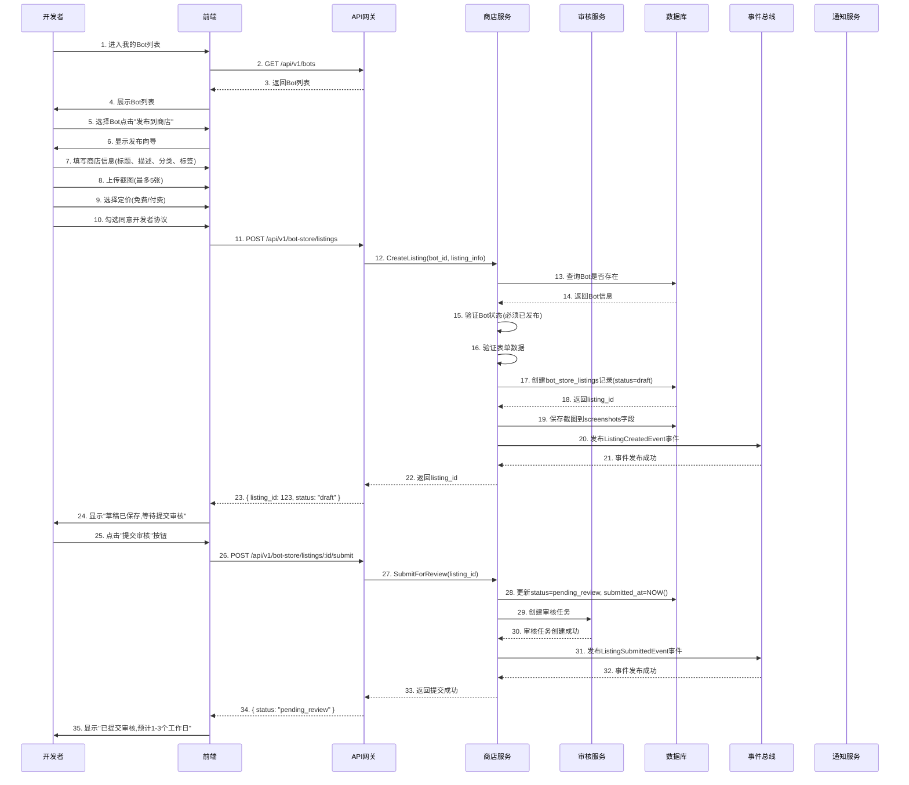
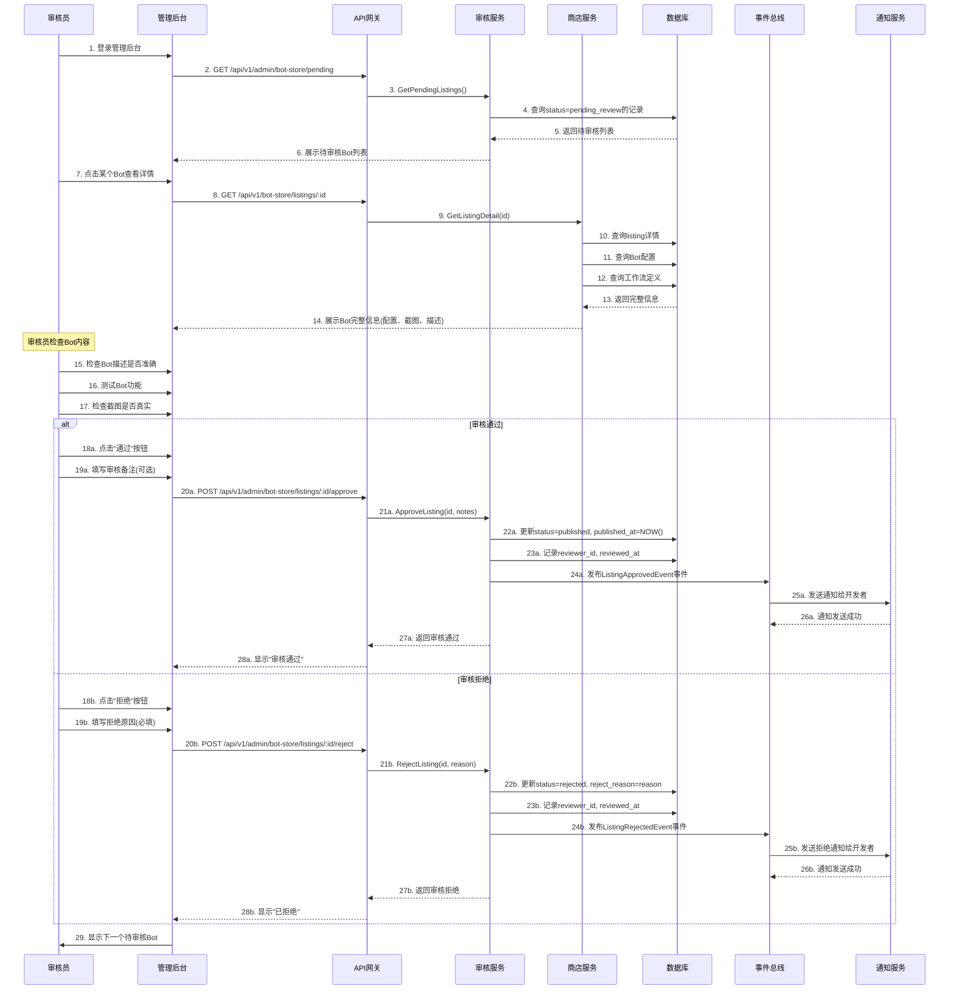
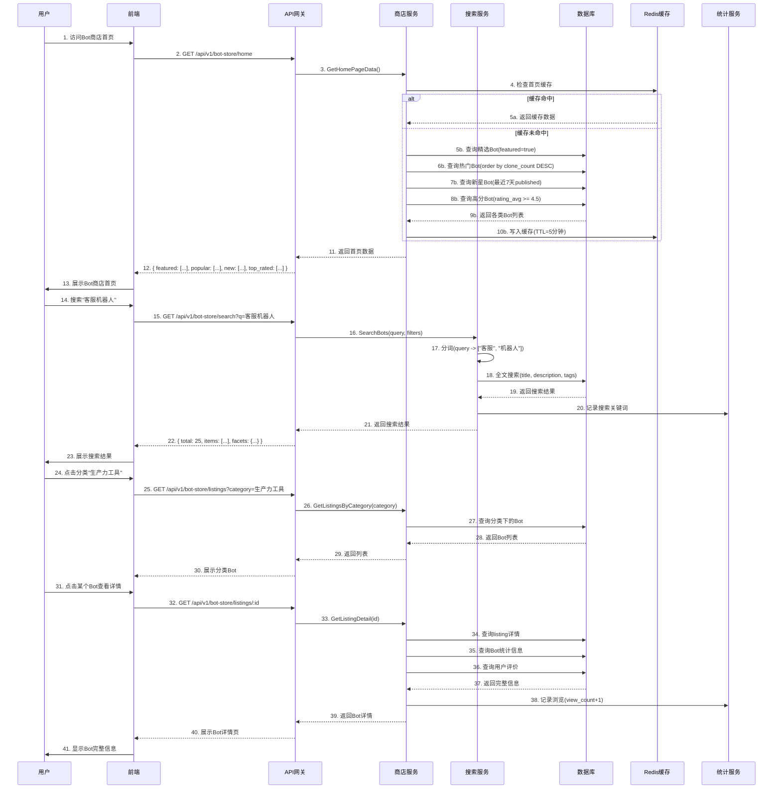
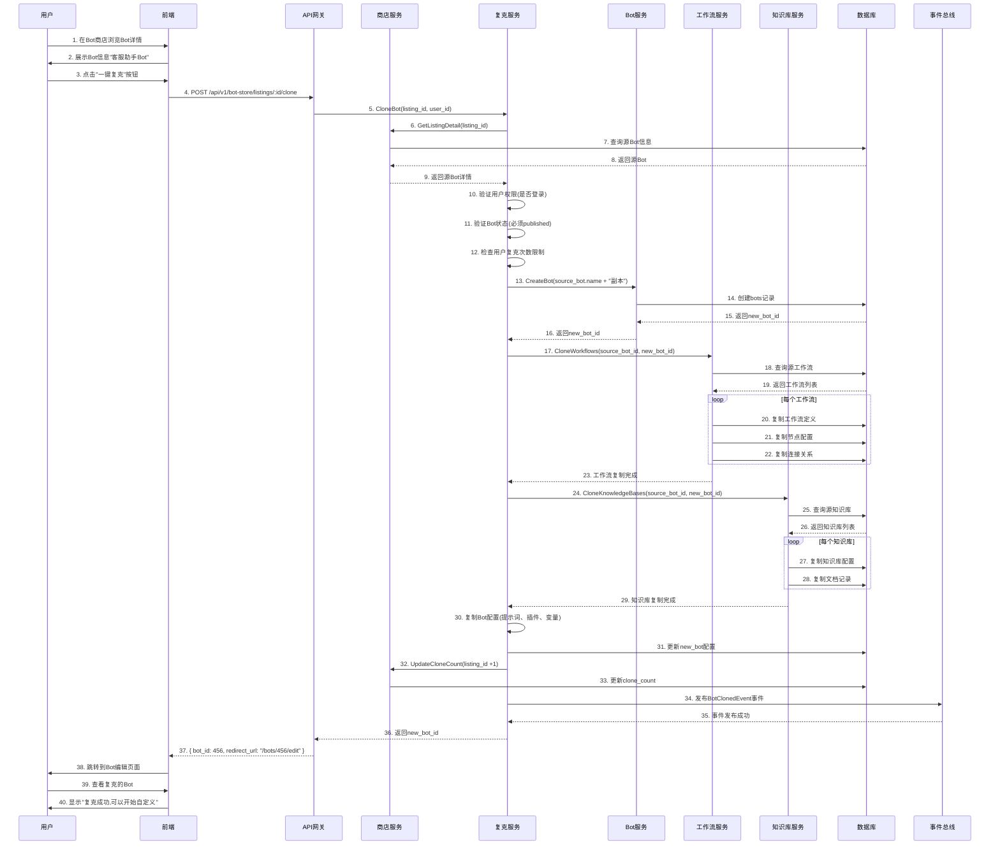
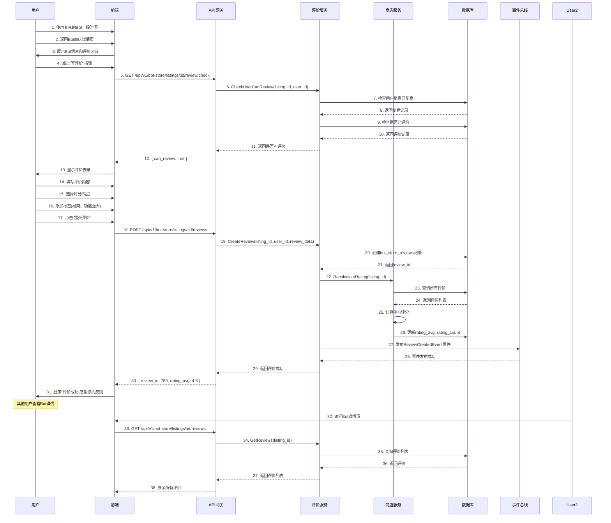
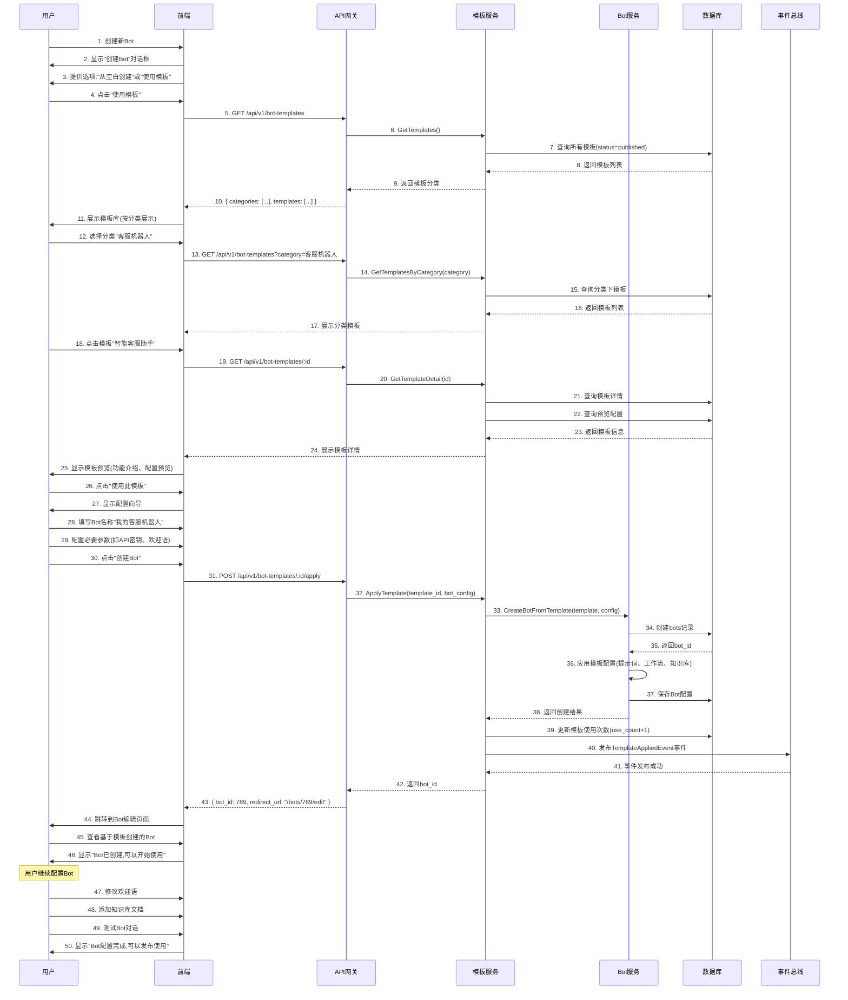
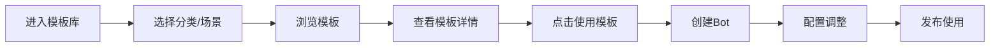

# 29-Bot商店与模板库 详细设计说明书

**文档编号**: DE-DD-2025-029
**模块名称**: Bot商店与模板库 (Bot Store & Templates)
**版本**: v1.0.0
**作者**: ZKER Enterprise Team
**创建日期**: 2025-12-29
**补充自**: 《Coze商用版与开源版全功能完整对比分析报告》P1-6节

---

## 📋 文档说明

本文档详细设计**Bot商店与模板库**,支持Bot分享、一键复克、模板下载等完整生态。

**核心设计理念**:
- 🏪 **Bot商店**: 分享、发现、复刻优质Bot
- 📦 **一键复克**: 完整复制Bot配置、工作流、知识库
- 📋 **模板库**: 行业模板、场景模板降低使用门槛
- ⭐ **评价体系**: 用户评价、使用统计、排行榜

---

## 1. 模块概述

### 1.1 功能定义

**Bot商店与模板库** 通过**Bot分享平台**+**一键复克功能**+**Bot模板库**,实现Bot生态建设:
- 🏪 **Bot商店**: Bot发布、浏览、搜索、分类
- 📦 **一键复克**: 完整复制Bot及其所有关联资源
- 📋 **模板库**: 官方模板、社区模板
- ⭐ **评价反馈**: 评分、评论、使用统计
- 📊 **排行榜**: 热门Bot、新星Bot、高分Bot

### 1.2 核心价值

- 🎯 **快速上手**: 新手通过模板快速创建Bot
- 🔄 **一键复克**: 完整复制优质Bot,降低开发成本
- 🌟 **激励机制**: 优质Bot开发者可获得收益
- 🏆 **生态建设**: 促进Bot共享和复用

### 1.3 业务流程

```
开发者创建Bot → 发布到商店 → 用户发现/搜索 → 一键复克 → 自定义修改 → 使用/分享
     ↓
  Bot模板库 → 用户选择模板 → 快速创建Bot → 配置调整 → 发布使用
```

### 1.4 详细业务流程设计

#### 1.4.1 Bot发布到商店流程



**流程说明**:
- **步骤1-10**: 开发者填写发布信息
- **步骤11-24**: 创建商店条目(草稿状态)
- **步骤25-35**: 提交审核

#### 1.4.2 Bot审核流程



**流程说明**:
- **步骤1-7**: 审核员查看待审核列表
- **步骤8-14**: 查看Bot详细信息
- **步骤15-17**: 审核员检查Bot内容
- **步骤18a-28a**: 审核通过分支
- **步骤18b-28b**: 审核拒绝分支
- **步骤29**: 继续审核下一个

#### 1.4.3 用户浏览与搜索Bot流程



**流程说明**:
- **步骤1-13**: 首页浏览(精选、热门、新星、高分Bot)
- **步骤14-23**: 搜索Bot
- **步骤24-30**: 按分类浏览
- **步骤31-41**: 查看Bot详情

#### 1.4.4 一键复克Bot流程



**流程说明**:
- **步骤1-3**: 用户发现Bot并点击复克
- **步骤4-12**: 验证权限和状态
- **步骤13-16**: 创建新Bot
- **步骤17-23**: 复制工作流
- **步骤24-29**: 复制知识库
- **步骤30-35**: 复制配置并更新统计
- **步骤36-40**: 跳转到编辑页面

#### 1.4.5 用户评价Bot流程



**流程说明**:
- **步骤1-3**: 用户使用Bot后返回详情页
- **步骤4-13**: 检查评价资格(必须先复克)
- **步骤14-17**: 填写评价内容
- **步骤18-31**: 提交评价并更新评分
- **步骤32-38**: 其他用户查看评价

#### 1.4.6 模板库使用流程



**流程说明**:
- **步骤1-11**: 浏览模板库
- **步骤12-25**: 查看模板详情和预览
- **步骤26-30**: 配置向导填写信息
- **步骤31-46**: 应用模板创建Bot
- **步骤47-50**: 继续自定义配置

---

## 2. 数据库设计

### 2.1 Bot商店条目表 (bot_store_listings)

**设计目的**: 存储发布到商店的Bot条目信息。

```sql
CREATE TABLE bot_store_listings (
    id BIGINT PRIMARY KEY AUTO_INCREMENT COMMENT '条目ID',
    tenant_id VARCHAR(64) NOT NULL COMMENT '租户ID',
    bot_id BIGINT NOT NULL COMMENT 'Bot ID',

    -- 商店信息
    listing_title VARCHAR(255) NOT NULL COMMENT '商店展示标题',
    description TEXT COMMENT '详细描述',
    long_description LONGTEXT COMMENT '富文本详情',
    screenshots JSON COMMENT '截图列表(URL数组)',
    video_url VARCHAR(512) COMMENT '演示视频URL',

    -- 分类与标签
    category VARCHAR(100) COMMENT '一级分类',
    subcategory VARCHAR(100) COMMENT '二级分类',
    tags JSON COMMENT '标签数组',

    -- 定价
    pricing_type ENUM('free', 'paid', 'freemium') DEFAULT 'free' COMMENT '定价类型',
    price DECIMAL(10,2) COMMENT '价格(付费Bot)',

    -- 统计
    view_count INT DEFAULT 0 COMMENT '浏览次数',
    clone_count INT DEFAULT 0 COMMENT '复克次数',
    download_count INT DEFAULT 0 COMMENT '下载次数',
    rating_avg DECIMAL(3,2) COMMENT '平均评分',
    rating_count INT DEFAULT 0 COMMENT '评价数量',

    -- 状态
    status ENUM('draft', 'pending_review', 'published', 'rejected', 'suspended') DEFAULT 'draft' COMMENT '状态',
    featured BOOLEAN DEFAULT FALSE COMMENT '是否精选',
    verified BOOLEAN DEFAULT FALSE COMMENT '是否官方认证',

    -- 提交信息
    submitter_id BIGINT NOT NULL COMMENT '提交者ID',
    submitted_at DATETIME COMMENT '提交时间',
    reviewed_at DATETIME COMMENT '审核时间',
    reviewer_id BIGINT COMMENT '审核人ID',
    reject_reason TEXT COMMENT '拒绝原因',

    -- 时间戳
    published_at DATETIME COMMENT '发布时间',
    updated_at DATETIME DEFAULT CURRENT_TIMESTAMP ON UPDATE CURRENT_TIMESTAMP,
    created_at DATETIME DEFAULT CURRENT_TIMESTAMP,

    UNIQUE KEY uk_tenant_bot (tenant_id, bot_id),
    INDEX idx_status (status),
    INDEX idx_category (category),
    INDEX idx_pricing (pricing_type),
    INDEX idx_rating (rating_avg),
    INDEX idx_clone_count (clone_count),
    INDEX idx_featured (featured),
    INDEX idx_created_at (created_at)
) ENGINE=InnoDB DEFAULT CHARSET=utf8mb4 COLLATE=utf8mb4_unicode_ci
COMMENT='Bot商店条目表';
```

### 2.2 Bot复克记录表 (bot_clone_records)

**设计目的**: 记录Bot复克操作,追踪Bot传播路径。

```sql
CREATE TABLE bot_clone_records (
    id BIGINT PRIMARY KEY AUTO_INCREMENT COMMENT '记录ID',
    source_listing_id BIGINT NOT NULL COMMENT '源条目ID',
    source_bot_id BIGINT NOT NULL COMMENT '源Bot ID',
    source_author_id BIGINT NOT NULL COMMENT '源作者ID',

    target_user_id BIGINT NOT NULL COMMENT '目标用户ID',
    target_bot_id BIGINT NOT NULL COMMENT '目标Bot ID',
    target_tenant_id VARCHAR(64) NOT NULL COMMENT '目标租户ID',

    -- 复克信息
    clone_type ENUM('full', 'partial', 'template') NOT NULL COMMENT '复克类型',
    cloned_resources JSON COMMENT '复制的资源列表',

    -- 统计
    is_modified BOOLEAN DEFAULT FALSE COMMENT '是否已修改',
    modification_count INT DEFAULT 0 COMMENT '修改次数',

    -- 时间戳
    cloned_at DATETIME DEFAULT CURRENT_TIMESTAMP COMMENT '复克时间',
    first_modified_at DATETIME COMMENT '首次修改时间',

    INDEX idx_source_listing (source_listing_id),
    INDEX idx_source_bot (source_bot_id),
    INDEX idx_target_user (target_user_id),
    INDEX idx_target_bot (target_bot_id),
    INDEX idx_cloned_at (cloned_at)
) ENGINE=InnoDB DEFAULT CHARSET=utf8mb4 COLLATE=utf8mb4_unicode_ci
COMMENT='Bot复克记录表';
```

### 2.3 Bot模板表 (bot_templates)

**设计目的**: 存储官方和社区Bot模板。

```sql
CREATE TABLE bot_templates (
    id BIGINT PRIMARY KEY AUTO_INCREMENT COMMENT '模板ID',
    tenant_id VARCHAR(64) COMMENT '租户ID(NULL表示官方模板)',

    -- 模板信息
    name VARCHAR(255) NOT NULL COMMENT '模板名称',
    title VARCHAR(255) NOT NULL COMMENT '展示标题',
    description TEXT COMMENT '模板描述',
    long_description LONGTEXT COMMENT '详细介绍',
    icon VARCHAR(512) COMMENT '模板图标',
    screenshots JSON COMMENT '截图列表',

    -- 分类
    category VARCHAR(100) NOT NULL COMMENT '分类',
    tags JSON COMMENT '标签',
    industry VARCHAR(100) COMMENT '行业',
    use_case VARCHAR(100) COMMENT '使用场景',

    -- 模板配置(完整Bot配置的JSON)
    bot_config JSON NOT NULL COMMENT 'Bot配置',
    workflow_config JSON COMMENT '工作流配置',
    knowledge_config JSON COMMENT '知识库配置',
    plugin_config JSON COMMENT '插件配置',

    -- 统计
    use_count INT DEFAULT 0 COMMENT '使用次数',
    rating_avg DECIMAL(3,2) COMMENT '平均评分',
    rating_count INT DEFAULT 0 COMMENT '评价数量',

    -- 状态
    status ENUM('draft', 'published', 'archived') DEFAULT 'draft' COMMENT '状态',
    is_official BOOLEAN DEFAULT FALSE COMMENT '是否官方模板',
    is_featured BOOLEAN DEFAULT FALSE COMMENT '是否精选',

    -- 创建者
    creator_id BIGINT COMMENT '创建者ID',
    created_at DATETIME DEFAULT CURRENT_TIMESTAMP,
    updated_at DATETIME DEFAULT CURRENT_TIMESTAMP ON UPDATE CURRENT_TIMESTAMP,

    INDEX idx_category (category),
    INDEX idx_industry (industry),
    INDEX idx_status (status),
    INDEX idx_is_official (is_official),
    INDEX idx_use_count (use_count)
) ENGINE=InnoDB DEFAULT CHARSET=utf8mb4 COLLATE=utf8mb4_unicode_ci
COMMENT='Bot模板表';
```

### 2.4 Bot评价表 (bot_reviews)

**设计目的**: 存储Bot商店中Bot的评价和反馈。

```sql
CREATE TABLE bot_reviews (
    id BIGINT PRIMARY KEY AUTO_INCREMENT COMMENT '评价ID',
    listing_id BIGINT NOT NULL COMMENT '商店条目ID',
    bot_id BIGINT NOT NULL COMMENT 'Bot ID',
    user_id BIGINT NOT NULL COMMENT '用户ID',

    -- 评分
    rating TINYINT NOT NULL COMMENT '评分(1-5)',
    title VARCHAR(255) COMMENT '评价标题',
    content TEXT COMMENT '评价内容',

    -- 标记
    helpful_count INT DEFAULT 0 COMMENT '有用数',
    verified BOOLEAN DEFAULT FALSE COMMENT '是否已验证(已使用/已复克)',

    -- 回复
    reply TEXT COMMENT '作者回复',
    replied_at DATETIME COMMENT '回复时间',

    created_at DATETIME DEFAULT CURRENT_TIMESTAMP,
    updated_at DATETIME DEFAULT CURRENT_TIMESTAMP ON UPDATE CURRENT_TIMESTAMP,

    UNIQUE KEY uk_listing_user (listing_id, user_id),
    INDEX idx_listing_id (listing_id),
    INDEX idx_bot_id (bot_id),
    INDEX idx_rating (rating),
    INDEX idx_created_at (created_at)
) ENGINE=InnoDB DEFAULT CHARSET=utf8mb4 COLLATE=utf8mb4_unicode_ci
COMMENT='Bot评价表';
```

---

## 3. 一键复克功能实现

### 3.1 复克服务设计

```go
// pkg/bot/store/service/clone_service.go
package service

import (
    "context"
    "encoding/json"
    "fmt"
)

type CloneService struct {
    db *gorm.DB
    botService *BotService
    workflowService *WorkflowService
    knowledgeService *KnowledgeService
}

// CloneBotRequest 复克Bot请求
type CloneBotRequest struct {
    SourceListingID int64  `json:"source_listing_id"`
    TargetUserID   int64  `json:"target_user_id"`
    TargetTenantID string `json:"target_tenant_id"`
    NewName        string `json:"new_name,omitempty"`
    CloneType      string `json:"clone_type"` // full, partial, template
}

// CloneBot 复克Bot及其关联资源
func (s *CloneService) CloneBot(
    ctx context.Context,
    req *CloneBotRequest,
) (*CloneBotResult, error) {
    // 1. 获取源Bot信息
    var listing BotStoreListing
    err := s.db.WithContext(ctx).
        Where("id = ? AND status = ?", req.SourceListingID, "published").
        First(&listing).Error

    if err != nil {
        return nil, fmt.Errorf("listing not found: %w", err)
    }

    // 2. 获取源Bot完整配置
    sourceBot, err := s.getBotWithConfig(ctx, listing.BotID)
    if err != nil {
        return nil, err
    }

    // 3. 创建新Bot
    targetBot := &Bot{
        TenantID:    req.TargetTenantID,
        CreatorID:   req.TargetUserID,
        Name:        req.NewName,
        Description: sourceBot.Description,
        Prompt:      sourceBot.Prompt,
        ModelID:     sourceBot.ModelID,
        // ... 其他字段
    }

    err = s.db.WithContext(ctx).Create(targetBot).Error
    if err != nil {
        return nil, fmt.Errorf("failed to create bot: %w", err)
    }

    // 4. 复制关联资源
    clonedResources := make(map[string]interface{})

    // 4.1 复制工作流
    if req.CloneType == "full" {
        workflows, err := s.cloneWorkflows(ctx, sourceBot.ID, targetBot.ID, req.TargetUserID)
        if err != nil {
            return nil, err
        }
        clonedResources["workflows"] = workflows
    }

    // 4.2 复制知识库
    knowledge, err := s.cloneKnowledgeBases(ctx, sourceBot.ID, targetBot.ID, req.TargetUserID)
    if err != nil {
        return nil, err
    }
    clonedResources["knowledge_bases"] = knowledge

    // 4.3 复制插件配置
    plugins, err := s.clonePlugins(ctx, sourceBot.ID, targetBot.ID)
    if err != nil {
        return nil, err
    }
    clonedResources["plugins"] = plugins

    // 5. 记录复克操作
    cloneRecord := &BotCloneRecord{
        SourceListingID: req.SourceListingID,
        SourceBotID:     sourceBot.ID,
        SourceAuthorID:   sourceBot.CreatorID,
        TargetUserID:     req.TargetUserID,
        TargetBotID:      targetBot.ID,
        TargetTenantID:   req.TargetTenantID,
        CloneType:        req.CloneType,
        ClonedResources:  toJSON(clonedResources),
    }

    err = s.db.WithContext(ctx).Create(cloneRecord).Error
    if err != nil {
        return nil, fmt.Errorf("failed to record clone: %w", err)
    }

    // 6. 更新源Bot的复克计数
    s.db.WithContext(ctx).
        Model(&BotStoreListing{}).
        Where("id = ?", req.SourceListingID).
        UpdateColumn("clone_count", gorm.Expr("clone_count + 1"))

    return &CloneBotResult{
        TargetBotID:    targetBot.ID,
        ClonedResources: clonedResources,
    }, nil
}

// getBotWithConfig 获取Bot及其完整配置
func (s *CloneService) getBotWithConfig(
    ctx context.Context,
    botID int64,
) (*BotWithConfig, error) {
    var bot Bot
    err := s.db.WithContext(ctx).
        Where("id = ? AND deleted_at IS NULL", botID).
        First(&bot).Error

    if err != nil {
        return nil, err
    }

    // 加载关联配置
    config := &BotWithConfig{
        Bot:           &bot,
        Workflows:     s.getBotWorkflows(ctx, botID),
        KnowledgeBases: s.getBotKnowledgeBases(ctx, botID),
        Plugins:        s.getBotPlugins(ctx, botID),
    }

    return config, nil
}

// cloneWorkflows 复制工作流
func (s *CloneService) cloneWorkflows(
    ctx context.Context,
    sourceBotID, targetBotID, targetUserID int64,
) ([]int64, error) {
    var workflows []Workflow
    err := s.db.WithContext(ctx).
        Where("bot_id = ? AND deleted_at IS NULL", sourceBotID).
        Find(&workflows).Error

    if err != nil {
        return nil, err
    }

    var clonedWorkflowIDs []int64

    for _, wf := range workflows {
        // 复制工作流配置
        newWf := &Workflow{
            TenantID:  getTenantIDFromContext(ctx),
            CreatorID: targetUserID,
            BotID:     targetBotID,
            Name:      wf.Name,
            Graph:     wf.Graph, // DAG图
            // ... 复制其他字段
        }

        err = s.db.WithContext(ctx).Create(newWf).Error
        if err != nil {
            return nil, err
        }

        clonedWorkflowIDs = append(clonedWorkflowIDs, newWf.ID)
    }

    return clonedWorkflowIDs, nil
}

// cloneKnowledgeBases 复制知识库
func (s *CloneService) cloneKnowledgeBases(
    ctx context.Context,
    sourceBotID, targetBotID, targetUserID int64,
) ([]int64, error) {
    // 获取Bot关联的知识库
    var botKBs []BotKnowledgeBase
    err := s.db.WithContext(ctx).
        Where("bot_id = ?", sourceBotID).
        Find(&botKBs).Error

    if err != nil {
        return nil, err
    }

    var clonedKBIDs []int64

    for _, botKB := range botKBs {
        // 复制知识库
        newKB, err := s.knowledgeService.CloneKnowledgeBase(
            ctx,
            botKB.KnowledgeBaseID,
            targetUserID,
        )

        if err != nil {
            return nil, err
        }

        // 关联到新Bot
        newBotKB := &BotKnowledgeBase{
            BotID:           targetBotID,
            KnowledgeBaseID: newKB.ID,
        }

        err = s.db.WithContext(ctx).Create(newBotKB).Error
        if err != nil {
            return nil, err
        }

        clonedKBIDs = append(clonedKBIDs, newKB.ID)
    }

    return clonedKBIDs, nil
}

// clonePlugins 复制插件配置
func (s *CloneService) clonePlugins(
    ctx context.Context,
    sourceBotID, targetBotID int64,
) ([]int64, error) {
    var botPlugins []BotPlugin
    err := s.db.WithContext(ctx).
        Where("bot_id = ?", sourceBotID).
        Find(&botPlugins).Error

    if err != nil {
        return nil, err
    }

    var clonedPluginIDs []int64

    for _, bp := range botPlugins {
        // 直接创建关联记录(插件本身不需要复制)
        newBP := &BotPlugin{
            BotID:    targetBotID,
            PluginID: bp.PluginID,
            Config:   bp.Config,
        }

        err = s.db.WithContext(ctx).Create(newBP).Error
        if err != nil {
            return nil, err
        }

        clonedPluginIDs = append(clonedPluginIDs, newBP.ID)
    }

    return clonedPluginIDs, nil
}
```

### 3.2 复克API设计

```http
# 复克Bot
POST /api/v1/store/bots/:listing_id/clone

Request Body:
{
  "new_name": "客服助手 (副本)",
  "clone_type": "full"  // full | partial | template
}

Response 200:
{
  "code": 0,
  "message": "复克成功",
  "data": {
    "target_bot_id": 789,
    "cloned_resources": {
      "workflows": [1, 2, 3],
      "knowledge_bases": [4, 5],
      "plugins": [6, 7, 8]
    },
    "redirect_url": "/bots/789/edit"
  }
}
```

---

## 4. Bot商店前端设计

### 4.1 商店首页

```tsx
// src/pages/bot-store/StoreHomePage.tsx
import React, { useState, useEffect } from 'react';
import { Card, Row, Col, Tag, Button, Input, Tabs } from '@douyinfe/semi-ui';
import { botStoreApi } from '@/api/bot-store';

export const StoreHomePage: React.FC = () => {
  const [categories, setCategories] = useState([]);
  const [featuredBots, setFeaturedBots] = useState([]);
  const [popularBots, setPopularBots] = useState([]);
  const [newBots, setNewBots] = useState([]);

  useEffect(() => {
    loadStoreData();
  }, []);

  const loadStoreData = async () => {
    const [categoriesResp, featuredResp, popularResp, newResp] = await Promise.all([
      botStoreApi.getCategories(),
      botStoreApi.getFeaturedBots(10),
      botStoreApi.getPopularBots(10),
      botStoreApi.getNewBots(10),
    ]);

    setCategories(categoriesResp.data);
    setFeaturedBots(featuredResp.data.items);
    setPopularBots(popularResp.data.items);
    setNewBots(newResp.data.items);
  };

  return (
    <div className="bot-store-home">
      {/* Hero Banner */}
      <div className="hero-banner">
        <h1>Bot商店</h1>
        <p>发现、复刻、分享优质Bot</p>
      </div>

      {/* 搜索栏 */}
      <div className="search-bar">
        <Input
          placeholder="搜索Bot..."
          size="large"
          suffix={<Button theme="solid">搜索</Button>}
        />
      </div>

      {/* 分类浏览 */}
      <section>
        <h2>分类浏览</h2>
        <Row gutter={[16, 16]}>
          {categories.map((cat) => (
            <Col span={6} key={cat.id}>
              <Card hoverable onClick={() => window.location.href = `/store/category/${cat.id}`}>
                <div className="category-card">
                  <div className="category-icon">{cat.icon}</div>
                  <div className="category-name">{cat.name}</div>
                  <div className="category-count">{cat.bot_count} 个Bot</div>
                </div>
              </Card>
            </Col>
          ))}
        </Row>
      </section>

      {/* 精选Bot */}
      <section>
        <h2>✨ 精选Bot</h2>
        <BotList bots={featuredBots} />
      </section>

      {/* 热门Bot */}
      <section>
        <h2>🔥 热门Bot</h2>
        <BotList bots={popularBots} />
      </section>

      {/* 新上架 */}
      <section>
        <h2>🆕 新上架</h2>
        <BotList bots={newBots} />
      </section>
    </div>
  );
};

const BotList: React.FC<{ bots: any[] }> = ({ bots }) => (
  <Row gutter={[16, 16]}>
    {bots.map((bot) => (
      <Col span={6} key={bot.id}>
        <Card
          hoverable
          onClick={() => window.location.href = `/store/bots/${bot.id}`}
        >
          <div className="bot-card">
            
            <h3>{bot.listing_title}</h3>
            <p>{bot.description}</p>
            <div className="bot-meta">
              <Tag color={bot.category === '客服' ? 'success' : 'primary'}>{bot.category}</Tag>
              <span>⭐ {bot.rating_avg.toFixed(1)}</span>
              <span>📥 {bot.clone_count}</span>
              <Tag color={bot.pricing_type === 'free' ? 'success' : 'warning'}>
                {bot.pricing_type === 'free' ? '免费' : '付费'}
              </Tag>
            </div>
          </div>
        </Card>
      </Col>
    ))}
  </Row>
);
```

### 4.2 Bot详情页

```tsx
// src/pages/bot-store/BotDetailPage.tsx
import React, { useState, useEffect } from 'react';
import { Card, Button, Tabs, Rate, Tag, Divider } from '@douyinfe/semi-ui';
import { botStoreApi } from '@/api/bot-store';

export const BotDetailPage: React.FC<{ listingId: string }> = ({ listingId }) => {
  const [listing, setListing] = useState(null);
  const [reviews, setReviews] = useState([]);

  useEffect(() => {
    loadListing();
    loadReviews();
  }, [listingId]);

  const loadListing = async () => {
    const resp = await botStoreApi.getListingDetail(listingId);
    setListing(resp.data);
  };

  const loadReviews = async () => {
    const resp = await botStoreApi.getListingReviews(listingId);
    setReviews(resp.data.items);
  };

  const handleClone = async () => {
    const resp = await botStoreApi.cloneBot(listingId, {
      new_name: `${listing.listing_title} (副本)`,
      clone_type: 'full'
    });

    if (resp.code === 0) {
      // 跳转到编辑页面
      window.location.href = resp.data.redirect_url;
    }
  };

  if (!listing) return null;

  return (
    <div className="bot-detail">
      {/* 头部信息 */}
      <Card className="bot-header">
        <div className="bot-info">
          
          <div className="bot-meta">
            <h1>{listing.listing_title}</h1>
            <p>{listing.description}</p>
            <div className="bot-stats">
              <Rate value={listing.rating_avg} disabled />
              <span>{listing.rating_avg.toFixed(1)} ({listing.rating_count} 条评价)</span>
              <span>👁️ {listing.view_count} 次浏览</span>
              <span>📥 {listing.clone_count} 次复克</span>
              {listing.verified && <Tag color="success">官方认证</Tag>}
              {listing.featured && <Tag color="warning">精选</Tag>}
            </div>
          </div>
          <Button size="large" theme="solid" onClick={handleClone}>
            一键复克
          </Button>
        </div>
      </Card>

      {/* 截图/视频 */}
      {(listing.screenshots || listing.video_url) && (
        <Card>
          {listing.video_url && (
            <video src={listing.video_url} controls className="demo-video" />
          )}
          {listing.screenshots && (
            <div className="screenshots">
              {listing.screenshots.map((url, i) => (
                
              ))}
            </div>
          )}
        </Card>
      )}

      {/* 标签页 */}
      <Tabs defaultActiveKey="description">
        <Tabs.TabPane tab="详细介绍" itemKey="description">
          <Card>
            <div dangerouslySetInnerHTML={{ __html: listing.long_description }} />
          </Card>
        </Tabs.TabPane>

        <Tabs.TabPane tab="使用指南" itemKey="usage">
          <Card>
            <h3>快速开始</h3>
            <p>点击"一键复克"按钮即可将此Bot完整复制到您的空间。</p>
            <h3>自定义</h3>
            <p>复克后,您可以修改Bot的提示词、工作流、知识库等所有配置。</p>
          </Card>
        </Tabs.TabPane>

        <Tabs.TabPane tab="评价" itemKey="reviews">
          <Card>
            <ReviewList reviews={reviews} />
          </Card>
        </Tabs.TabPane>

        <Tabs.TabPane tab="版本历史" itemKey="versions">
          <Card>
            <VersionHistory botId={listing.bot_id} />
          </Card>
        </Tabs.TabPane>
      </Tabs>
    </div>
  );
};
```

---

## 5. Bot模板库设计

### 5.1 模板分类

**行业分类**:
- 🏢 企业服务: 客服、销售、HR、财务
- 🎓 教育培训: 辅导、培训、考试
- 🏥 医疗健康: 问诊、咨询、健康管理
- 🛒 电商零售: 导购、客服、营销
- 🎮 娱乐休闲: 游戏、聊天、娱乐

**场景分类**:
- 💬 客服机器人
- 📝 内容创作
- 📊 数据分析
- 🎓 学习辅导
- 🔧 工具助手

### 5.2 模板使用流程



### 5.3 模板API设计

```http
# 获取模板列表
GET /api/v1/templates

Query Parameters:
  - category: string (分类)
  - industry: string (行业)
  - use_case: string (使用场景)
  - is_official: boolean (是否官方)
  - page: int
  - page_size: int

Response 200:
{
  "code": 0,
  "data": {
    "total": 50,
    "items": [
      {
        "id": 1,
        "name": "智能客服助手",
        "title": "电商客服Bot",
        "description": "自动回答常见问题",
        "category": "客服机器人",
        "industry": "电商零售",
        "icon": "...",
        "use_count": 1520,
        "rating_avg": 4.8
      }
    ]
  }
}

# 使用模板创建Bot
POST /api/v1/templates/:id/use

Request Body:
{
  "bot_name": "我的客服Bot"
}

Response 200:
{
  "code": 0,
  "message": "Bot创建成功",
  "data": {
    "bot_id": 789,
    "redirect_url": "/bots/789/edit"
  }
}
```

---

## 6. 评价反馈系统

### 6.1 评价API设计

```http
# 提交评价
POST /api/v1/store/bots/:listing_id/reviews

Request Body:
{
  "rating": 5,
  "title": "非常好用的Bot",
  "content": "配置简单,功能强大,客服效率大幅提升!",
  "verified": true
}

Response 200:
{
  "code": 0,
  "message": "评价成功"
}

# 标记有用
POST /api/v1/store/bots/reviews/:review_id/helpful

Response 200:
{
  "code": 0,
  "data": {
    "helpful_count": 25
  }
}
```

### 6.2 排行榜API设计

```http
# 热门Bot排行
GET /api/v1/store/bots/leaderboard

Query Parameters:
  - type: string (hot | new | rating | clone)

Response 200:
{
  "code": 0,
  "data": {
    "hot": [
      {
        "listing_id": 1,
        "listing_title": "智能客服Bot",
        "clone_count": 5000,
        "view_count": 15000
      }
    ],
    "new": [
      {
        "listing_id": 2,
        "listing_title": "数据分析Bot",
        "created_at": "2025-01-01"
      }
    ],
    "rating": [
      {
        "listing_id": 3,
        "listing_title": "翻译助手",
        "rating_avg": 4.9
      }
    ]
  }
}
```

---

## 7. 总结

### 7.1 实施策略总结

| **实施项** | **实施方式** | **工作量** |
|---------|-----------|---------|
| **Bot商店前端** | 💻 React组件 | 4人天 |
| **一键复克功能** | 💻 后端服务 | 4人天 |
| **Bot模板库** | 💻 模板管理 | 3人天 |
| **评价系统** | 💻 评价功能 | 2人天 |
| **排行榜** | 💻 统计与排名 | 2人天 |

**总计**: **15人天** (与对比文档估算一致)

### 7.2 核心价值

- ✅ **快速上手**: Bot模板库降低使用门槛
- ✅ **一键复克**: 完整复制Bot及所有资源
- ✅ **生态建设**: Bot分享、评价、排行榜
- ✅ **激励机制**: 优质Bot可获得收益

---

## 8. 实施要点

### 8.1 开发前检查

在开始实施**Bot商店与模板库**前,请完成以下检查:

- [ ] **已阅读实施指南**
  - 阅读 `实施指南_开发规范与检查清单.md`
  - 理解DDD分层架构、命名规范、全局一致性要求

- [ ] **已了解现有代码结构**
  - 现有代码中已有完整的Bot管理功能(`backend/domain/bot/`)
  - 现有代码中已有工作流(`backend/domain/workflow/`)和知识库(`backend/domain/knowledge/`)
  - **但Bot商店条目管理、复克功能需要全新实现**

- [ ] **确认功能实现状态**
  - ✅ 已有: Bot基础管理、工作流、知识库、插件生态
  - ❌ 缺失: Bot商店条目管理(`bot_store_listings`表)
  - ❌ 缺失: Bot复克记录(`bot_clone_records`表)
  - ❌ 缺失: Bot模板管理(`bot_templates`表)
  - ❌ 缺失: 评价系统(`bot_reviews`表)
  - ❌ 缺失: 前端Bot商店UI

- [ ] **需要新增的核心模块**
  - 后端: `backend/domain/store/` 领域模块(DDD结构)
  - 后端: `backend/domain/template/` 模板管理模块(DDD结构)
  - 前端: `frontend/common/bot-store-api/` API包(level-2)
  - 前端: `frontend/studio/bot-store/` UI组件包(level-3)

### 8.2 后端开发规范

#### 8.2.1 DDD领域模块结构

新增 `backend/domain/store/` 模块,遵循以下结构:

```go
backend/domain/store/
├── entity/           # 实体
│   ├── bot_store_listing.go
│   ├── bot_clone_record.go
│   └── bot_review.go
├── repository/       # 仓储接口
│   └── store_repository.go
├── service/          # 领域服务
│   ├── listing_service.go      # 条目管理
│   ├── clone_service.go         # 复克服务
│   └── review_service.go        # 评价服务
└── dto/              # 数据传输对象
    ├── listing_dto.go
    └── clone_dto.go

backend/domain/template/
├── entity/
│   └── bot_template.go
├── repository/
│   └── template_repository.go
├── service/
│   └── template_service.go
└── dto/
    └── template_dto.go
```

**命名规范示例**:

```go
// ✅ 正确 - 标准DDD结构
type BotStoreListing struct {
    ID              int64              `json:"id"`
    TenantID        string             `json:"tenant_id"`
    BotID           int64              `json:"bot_id"`
    ListingTitle    string             `json:"listing_title"`
    Description     string             `json:"description"`
    Category        string             `json:"category"`
    Tags            []string           `json:"tags"`
    PricingType     PricingType        `json:"pricing_type"`
    Price           decimal.Decimal    `json:"price"`
    ViewCount       int                `json:"view_count"`
    CloneCount      int                `json:"clone_count"`
    RatingAvg       float64            `json:"rating_avg"`
    RatingCount     int                `json:"rating_count"`
    Status          ListingStatus      `json:"status"`
    Featured        bool               `json:"featured"`
    Verified        bool               `json:"verified"`
    CreatedAt       time.Time          `json:"created_at"`
    UpdatedAt       time.Time          `json:"updated_at"`
    DeletedAt       *time.Time         `json:"deleted_at,omitempty"`
}

type ListingRepository interface {
    Create(ctx context.Context, listing *BotStoreListing) error
    GetByID(ctx context.Context, id int64) (*BotStoreListing, error)
    GetByBotID(ctx context.Context, botID int64) (*BotStoreListing, error)
    Update(ctx context.Context, listing *BotStoreListing) error
    Delete(ctx context.Context, id int64) error
    List(ctx context.Context, req *ListListingsRequest) ([]*BotStoreListing, int64, error)
    UpdateStatistics(ctx context.Context, id int64, field string, delta int) error
}

type ListingService interface {
    CreateListing(ctx context.Context, req *CreateListingRequest) (*BotStoreListing, error)
    UpdateListing(ctx context.Context, id int64, req *UpdateListingRequest) error
    SubmitForReview(ctx context.Context, id int64) error
    ApproveListing(ctx context.Context, id int64, reviewerID int64) error
    RejectListing(ctx context.Context, id int64, reason string) error
    GetListing(ctx context.Context, id int64) (*BotStoreListing, error)
    ListListings(ctx context.Context, req *ListListingsRequest) ([]*BotStoreListing, int64, error)
}

// ❌ 错误 - 不符合DDD规范
type BotStoreService struct {}  // Service命名不清晰
func GetListing(id int64) {}    // 应使用Repository
```

#### 8.2.2 复克服务实现规范

```go
// ✅ 正确 - 复克服务实现
type CloneService struct {
    db               *gorm.DB
    listingRepo      ListingRepository
    botRepo          BotRepository
    workflowRepo     WorkflowRepository
    knowledgeRepo    KnowledgeRepository
}

// CloneBot 一键复克Bot及其所有资源
func (s *CloneService) CloneBot(
    ctx context.Context,
    req *CloneBotRequest,
) (*CloneBotResult, error) {
    // 1. 验证源条目存在且已发布
    listing, err := s.listingRepo.GetByID(ctx, req.SourceListingID)
    if err != nil {
        return nil, fmt.Errorf("listing not found: %w", err)
    }
    if listing.Status != ListingStatusPublished {
        return nil, fmt.Errorf("listing is not published")
    }

    // 2. 获取源Bot完整配置
    sourceBot, err := s.getBotWithAllResources(ctx, listing.BotID)
    if err != nil {
        return nil, fmt.Errorf("failed to get source bot: %w", err)
    }

    // 3. 开启事务,确保数据一致性
    err = s.db.Transaction(func(tx *gorm.DB) error {
        // 3.1 创建新Bot
        targetBot := s.cloneBotEntity(sourceBot.Bot, req.TargetUserID, req.NewName)
        if err := tx.Create(targetBot).Error; err != nil {
            return fmt.Errorf("failed to create bot: %w", err)
        }

        // 3.2 复制工作流
        if req.CloneType == CloneTypeFull {
            workflowIDs, err := s.cloneWorkflows(tx, sourceBot.Workflows, targetBot.ID, req.TargetUserID)
            if err != nil {
                return fmt.Errorf("failed to clone workflows: %w", err)
            }
        }

        // 3.3 复制知识库
        knowledgeIDs, err := s.cloneKnowledgeBases(tx, sourceBot.KnowledgeBases, targetBot.ID, req.TargetUserID)
        if err != nil {
            return fmt.Errorf("failed to clone knowledge bases: %w", err)
        }

        // 3.4 复制插件配置
        pluginIDs, err := s.clonePlugins(tx, sourceBot.Plugins, targetBot.ID)
        if err != nil {
            return fmt.Errorf("failed to clone plugins: %w", err)
        }

        // 3.5 记录复克操作
        cloneRecord := &BotCloneRecord{
            SourceListingID: req.SourceListingID,
            SourceBotID:     sourceBot.Bot.ID,
            SourceAuthorID:  sourceBot.Bot.CreatorID,
            TargetUserID:    req.TargetUserID,
            TargetBotID:     targetBot.ID,
            TargetTenantID:  req.TargetTenantID,
            CloneType:       req.CloneType,
            ClonedResources: toJSON(map[string]interface{}{
                "workflows":        workflowIDs,
                "knowledge_bases":  knowledgeIDs,
                "plugins":          pluginIDs,
            }),
        }
        if err := tx.Create(cloneRecord).Error; err != nil {
            return fmt.Errorf("failed to record clone: %w", err)
        }

        // 3.6 更新源Bot的复克计数
        if err := s.listingRepo.UpdateStatistics(ctx, req.SourceListingID, "clone_count", 1); err != nil {
            return err
        }

        return nil
    })

    if err != nil {
        return nil, err
    }

    return &CloneBotResult{
        TargetBotID:     targetBot.ID,
        ClonedResources: clonedResources,
        RedirectURL:     fmt.Sprintf("/bots/%d/edit", targetBot.ID),
    }, nil
}

// cloneWorkflows 复制工作流(私有方法)
func (s *CloneService) cloneWorkflows(
    tx *gorm.DB,
    workflows []*Workflow,
    targetBotID, targetUserID int64,
) ([]int64, error) {
    var clonedIDs []int64

    for _, wf := range workflows {
        newWf := &Workflow{
            TenantID:  getTenantIDFromContext(context.Background()),
            CreatorID: targetUserID,
            BotID:     targetBotID,
            Name:      wf.Name,
            Graph:     wf.Graph, // DAG图(JSON)
            Variables: wf.Variables,
            CreatedAt: time.Now(),
            UpdatedAt: time.Now(),
        }

        if err := tx.Create(newWf).Error; err != nil {
            return nil, err
        }

        clonedIDs = append(clonedIDs, newWf.ID)
    }

    return clonedIDs, nil
}

// cloneKnowledgeBases 复制知识库(私有方法)
func (s *CloneService) cloneKnowledgeBases(
    tx *gorm.DB,
    knowledgeBases []*KnowledgeBase,
    targetBotID, targetUserID int64,
) ([]int64, error) {
    var clonedIDs []int64

    for _, kb := range knowledgeBases {
        // 创建新知识库
        newKb := &KnowledgeBase{
            TenantID:  getTenantIDFromContext(context.Background()),
            CreatorID: targetUserID,
            Name:      kb.Name,
            Type:      kb.Type,
            Config:    kb.Config,
            CreatedAt: time.Now(),
            UpdatedAt: time.Now(),
        }

        if err := tx.Create(newKb).Error; err != nil {
            return nil, err
        }

        // 复制知识库文档
        if err := s.cloneKnowledgeDocuments(tx, kb.ID, newKb.ID); err != nil {
            return nil, err
        }

        // 关联到新Bot
        botKB := &BotKnowledgeBase{
            BotID:           targetBotID,
            KnowledgeBaseID: newKb.ID,
        }
        if err := tx.Create(botKB).Error; err != nil {
            return nil, err
        }

        clonedIDs = append(clonedIDs, newKb.ID)
    }

    return clonedIDs, nil
}

// ❌ 错误 - 没有使用事务,可能导致数据不一致
func (s *CloneService) CloneBotUnsafe(ctx context.Context, req *CloneBotRequest) error {
    // 直接创建,没有事务保护
    targetBot := &Bot{...}
    s.db.Create(targetBot)

    // 如果后续步骤失败,前面创建的数据不会回滚
    s.cloneWorkflows(...)
    s.cloneKnowledgeBases(...)

    return nil
}
```

#### 8.2.3 API路由规范

遵循RESTful API设计规范:

```go
// ✅ 正确 - RESTful API路由
POST   /api/v1/store/listings                    // 创建商店条目
GET    /api/v1/store/listings                    // 获取条目列表
GET    /api/v1/store/listings/:id                // 获取条目详情
PUT    /api/v1/store/listings/:id                // 更新条目
DELETE /api/v1/store/listings/:id                // 删除条目
POST   /api/v1/store/listings/:id/submit         // 提交审核
POST   /api/v1/store/listings/:id/approve        // 审核通过
POST   /api/v1/store/listings/:id/reject         // 审核拒绝
POST   /api/v1/store/listings/:id/clone          // 一键复克

GET    /api/v1/store/listings/:id/reviews        // 获取评价列表
POST   /api/v1/store/listings/:id/reviews        // 提交评价
POST   /api/v1/store/reviews/:id/helpful         // 标记有用

GET    /api/v1/templates                         // 获取模板列表
GET    /api/v1/templates/:id                     // 获取模板详情
POST   /api/v1/templates/:id/use                 // 使用模板创建Bot

GET    /api/v1/store/leaderboard                 // 获取排行榜

// ❌ 错误 - 不符合RESTful规范
POST   /api/v1/createListing                     // 应使用资源路径
GET    /api/v1/getListingDetail/:id              // 应使用GET /listings/:id
POST   /api/v1/cloneBot                          // 应嵌套在listings资源下
GET    /api/v1/getLeaderboard                    // 路径不够清晰
```

#### 8.2.4 统计更新规范

```go
// ✅ 正确 - 使用原子更新,避免并发问题
func (r *ListingRepository) UpdateStatistics(
    ctx context.Context,
    id int64,
    field string,
    delta int,
) error {
    allowedFields := map[string]bool{
        "view_count":    true,
        "clone_count":   true,
        "rating_count":  true,
    }

    if !allowedFields[field] {
        return fmt.Errorf("invalid field: %s", field)
    }

    return r.db.WithContext(ctx).
        Model(&BotStoreListing{}).
        Where("id = ?", id).
        UpdateColumn(field, gorm.Expr("IFNULL(?, 0) + ?", field, delta)).Error
}

// ✅ 正确 - 评分更新使用事务保证一致性
func (s *ReviewService) SubmitReview(
    ctx context.Context,
    listingID int64,
    userID int64,
    req *SubmitReviewRequest,
) error {
    return s.db.Transaction(func(tx *gorm.DB) error {
        // 1. 创建评价记录
        review := &BotReview{
            ListingID: listingID,
            UserID:    userID,
            Rating:    req.Rating,
            Title:     req.Title,
            Content:   req.Content,
        }
        if err := tx.Create(review).Error; err != nil {
            return err
        }

        // 2. 重新计算平均评分
        var avgRating float64
        var count int64
        err := tx.Model(&BotReview{}).
            Where("listing_id = ?", listingID).
            Select("AVG(rating) as avg, COUNT(*) as count").
            Scan(&struct {
                Avg   float64
                Count int64
            }{avgRating, count}).Error

        if err != nil {
            return err
        }

        // 3. 更新条目的评分统计
        err = tx.Model(&BotStoreListing{}).
            Where("id = ?", listingID).
            Updates(map[string]interface{}{
                "rating_avg":   avgRating,
                "rating_count": count,
            }).Error

        return err
    })
}

// ❌ 错误 - 先读取再更新,存在并发问题
func (r *ListingRepository) UpdateStatisticsUnsafe(
    ctx context.Context,
    id int64,
    field string,
    delta int,
) error {
    var listing BotStoreListing
    r.db.WithContext(ctx).Where("id = ?", id).First(&listing)

    // 并发情况下可能丢失更新
    listing.ViewCount += delta
    return r.db.WithContext(ctx).Save(&listing).Error
}
```

### 8.3 前端开发规范

#### 8.3.1 Rush包结构

新增以下前端包,遵循Rush Monorepo规范:

```bash
frontend/
├── common/bot-store-api/      # Level-2: API包
│   ├── package.json
│   ├── src/
│   │   ├── api/store.ts       # Store API
│   │   ├── api/template.ts    # Template API
│   │   └── types.ts           # TypeScript类型定义
│   └── tsconfig.json
│
└── studio/bot-store/           # Level-3: UI组件包
    ├── package.json
    ├── src/
    │   ├── store-home-page.tsx
    │   ├── bot-detail-page.tsx
    │   ├── template-library.tsx
    │   ├── review-list.tsx
    │   └── clone-button.tsx
    └── tsconfig.json
```

**依赖关系**:
- `@coze-studio/bot-store-api` 依赖 `@coze-studio/api-base` (level-2)
- `@coze-studio/bot-store` 依赖 `@coze-studio/bot-store-api` (level-3)

#### 8.3.2 文件命名规范

```typescript
// ✅ 正确 - kebab-case命名
bot-store/
├── store-home-page.tsx        # 主页面
├── bot-detail-page.tsx        # 详情页
├── template-library.tsx       # 模板库
├── review-list.tsx            # 评价列表
├── clone-button.tsx           # 复克按钮
├── types.ts                   # 类型定义
└── index.ts                   # 导出文件

// ❌ 错误 - 不符合规范
BotStore/
├── StoreHomePage.tsx          # 文件名不应大写
├── BotDetailPage.tsx
└── ReviewList.tsx
```

#### 8.3.3 组件开发规范

```typescript
// ✅ 正确 - 函数式组件 + Hooks
import React, { useState, useEffect } from 'react';
import { Card, Button, Rate, Tag } from '@douyinfe/semi-ui';
import { botStoreApi } from '@coze-studio/bot-store-api';

interface BotCardProps {
  listing: BotStoreListing;
  onClone?: (listingId: number) => void;
}

export const BotCard: React.FC<BotCardProps> = ({ listing, onClone }) => {
  const [cloning, setCloning] = useState(false);

  const handleClone = async () => {
    setCloning(true);
    try {
      const resp = await botStoreApi.cloneBot(listing.id, {
        new_name: `${listing.listing_title} (副本)`,
        clone_type: 'full',
      });

      if (resp.code === 0 && onClone) {
        onClone(listing.id);
        // 跳转到编辑页面
        window.location.href = resp.data.redirect_url;
      }
    } finally {
      setCloning(false);
    }
  };

  return (
    <Card hoverable className="bot-card">
      
      <h3>{listing.listing_title}</h3>
      <p>{listing.description}</p>
      <div className="bot-meta">
        <Tag color="primary">{listing.category}</Tag>
        <Rate value={listing.rating_avg} disabled size="small" />
        <span>{listing.rating_avg.toFixed(1)}</span>
        <span>📥 {listing.clone_count}</span>
        <Tag color={listing.pricing_type === 'free' ? 'success' : 'warning'}>
          {listing.pricing_type === 'free' ? '免费' : '付费'}
        </Tag>
      </div>
      <Button
        theme="solid"
        onClick={handleClone}
        loading={cloning}
        block
      >
        一键复克
      </Button>
    </Card>
  );
};

// ❌ 错误 - 使用类组件
export class BotCard extends React.Component {
  // 应使用函数式组件
}
```

#### 8.3.4 API调用规范

使用自动生成的API客户端:

```typescript
// ✅ 正确 - 使用统一API包
import { botStoreApi, templateApi } from '@coze-studio/bot-store-api';

// 获取商店列表
const resp = await botStoreApi.getListings({
  category: '客服机器人',
  pricing_type: 'free',
  page: 1,
  page_size: 20,
});

// 获取条目详情
const detailResp = await botStoreApi.getListingDetail(listingId);

// 一键复克
const cloneResp = await botStoreApi.cloneBot(listingId, {
  new_name: '客服助手 (副本)',
  clone_type: 'full',
});

// 使用模板
const templateResp = await templateApi.useTemplate(templateId, {
  bot_name: '我的客服Bot',
});

// ❌ 错误 - 直接使用axios
import axios from 'axios';

const resp = await axios.post(`/api/v1/store/listings/${listingId}/clone`, {
  // 应使用封装的API
});
```

### 8.4 关键实施检查点

#### 8.4.1 数据库检查

- [ ] **表命名规范**
  - ✅ 表名: `bot_store_listings` (snake_case, 复数形式)
  - ✅ 字段名: `tenant_id`, `bot_id`, `listing_title` (snake_case)
  - ✅ 标准字段: `id`, `created_at`, `updated_at`, `deleted_at`
  - ❌ 避免驼峰命名: `botStoreListings`, `listingTitle`

- [ ] **索引设计**
  ```sql
  -- ✅ 正确 - 复合唯一索引 + 单列索引
  UNIQUE KEY uk_tenant_bot (tenant_id, bot_id),
  INDEX idx_status (status),
  INDEX idx_category (category),
  INDEX idx_pricing (pricing_type),
  INDEX idx_rating (rating_avg),
  INDEX idx_clone_count (clone_count),
  INDEX idx_featured (featured),
  INDEX idx_created_at (created_at)
  ```

- [ ] **JSON字段使用**
  ```sql
  -- ✅ 正确 - tags和screenshots使用JSON类型
  tags JSON COMMENT '标签数组',
  screenshots JSON COMMENT '截图列表(URL数组)',
  cloned_resources JSON COMMENT '复制的资源列表'
  ```

#### 8.4.2 安全检查

- [ ] **权限控制**
  - 只有Bot所有者可以发布到商店
  - 只有Bot所有者可以修改商店条目
  - 任何人可以浏览和复克已发布的Bot

- [ ] **审核流程**
  - 新发布的Bot需要经过审核
  - 管理员可以批准或拒绝
  - 拒绝时必须提供原因

- [ ] **敏感信息过滤**
  - 复克时移除源Bot的敏感配置(API密钥等)
  - 复克时移除私密知识库内容

#### 8.4.3 业务逻辑检查

- [ ] **复克完整性**
  - 完整复克Bot配置、工作流、知识库、插件
  - 使用事务保证数据一致性
  - 复克失败时完整回滚

- [ ] **统计数据准确性**
  - 浏览次数、复克次数使用原子更新
  - 评分统计使用事务保证一致性
  - 避免并发导致的数据错误

- [ ] **模板管理**
  - 官方模板和社区模板分开管理
  - 模板配置完整可复用
  - 模板使用后自动创建Bot

### 8.5 测试要点

#### 8.5.1 单元测试

- [ ] **复克服务单元测试**
  ```go
  func TestCloneService_CloneBot(t *testing.T) {
      // 准备测试数据
      sourceBot := createTestBot()
      req := &CloneBotRequest{
          SourceListingID: sourceBot.ListingID,
          TargetUserID:    123,
          TargetTenantID:  "tenant_123",
          NewName:         "测试副本",
          CloneType:       CloneTypeFull,
      }

      // 执行复克
      result, err := cloneService.CloneBot(context.Background(), req)

      // 验证结果
      assert.NoError(t, err)
      assert.NotNil(t, result)
      assert.Greater(t, result.TargetBotID, int64(0))

      // 验证Bot已创建
      var targetBot Bot
      err = db.Where("id = ?", result.TargetBotID).First(&targetBot).Error
      assert.NoError(t, err)
      assert.Equal(t, req.NewName, targetBot.Name)

      // 验证工作流已复制
      var workflows []Workflow
      err = db.Where("bot_id = ?", result.TargetBotID).Find(&workflows).Error
      assert.NoError(t, err)
      assert.Greater(t, len(workflows), 0)

      // 验证知识库已复制
      var knowledgeBases []KnowledgeBase
      err = db.Joins("JOIN bot_knowledge_bases ON bot_knowledge_bases.knowledge_base_id = knowledge_bases.id").
          Where("bot_knowledge_bases.bot_id = ?", result.TargetBotID).
          Find(&knowledgeBases).Error
      assert.NoError(t, err)
      assert.Greater(t, len(knowledgeBases), 0)

      // 验证复克记录已创建
      var cloneRecord BotCloneRecord
      err = db.Where("target_bot_id = ?", result.TargetBotID).First(&cloneRecord).Error
      assert.NoError(t, err)
      assert.Equal(t, req.SourceListingID, cloneRecord.SourceListingID)
  }
  ```

- [ ] **评价服务单元测试**
  ```go
  func TestReviewService_SubmitReview(t *testing.T) {
      // 创建测试条目
      listing := createTestListing()

      // 提交评价
      req := &SubmitReviewRequest{
          Rating:  5,
          Title:   "非常好的Bot",
          Content: "配置简单,功能强大",
      }
      err := reviewService.SubmitReview(context.Background(), listing.ID, 123, req)
      assert.NoError(t, err)

      // 验证评价已创建
      var review BotReview
      err = db.Where("listing_id = ? AND user_id = ?", listing.ID, 123).First(&review).Error
      assert.NoError(t, err)
      assert.Equal(t, req.Rating, review.Rating)

      // 验证评分统计已更新
      var updatedListing BotStoreListing
      err = db.Where("id = ?", listing.ID).First(&updatedListing).Error
      assert.NoError(t, err)
      assert.Equal(t, 5.0, updatedListing.RatingAvg)
      assert.Equal(t, 1, updatedListing.RatingCount)
  }
  ```

#### 8.5.2 集成测试

- [ ] **端到端复克流程测试**
  1. 创建源Bot并配置资源
  2. 发布到商店
  3. 审核通过
  4. 用户执行一键复克
  5. 验证目标Bot完整可用

- [ ] **模板使用流程测试**
  1. 创建模板
  2. 发布模板
  3. 用户选择模板
  4. 创建Bot
  5. 验证Bot配置正确

### 8.6 性能优化要点

#### 8.6.1 复克性能优化

```go
// ✅ 正确 - 批量操作优化性能
func (s *CloneService) cloneKnowledgeDocuments(
    tx *gorm.DB,
    sourceKBID, targetKBID int64,
) error {
    // 批量查询文档
    var docs []KnowledgeDocument
    err := tx.Where("knowledge_base_id = ?", sourceKBID).Find(&docs).Error
    if err != nil {
        return err
    }

    // 批量插入(性能优化)
    if len(docs) > 0 {
        newDocs := make([]*KnowledgeDocument, 0, len(docs))
        for _, doc := range docs {
            newDocs = append(newDocs, &KnowledgeDocument{
                KnowledgeBaseID: targetKBID,
                Title:           doc.Title,
                Content:         doc.Content,
                CreatedAt:       time.Now(),
                UpdatedAt:       time.Now(),
            })
        }

        // 批量创建,减少数据库往返
        return tx.CreateInBatches(newDocs, 100).Error
    }

    return nil
}
```

#### 8.6.2 缓存优化

- [ ] **商店列表缓存**
  - 缓存热门Bot列表(TTL: 5分钟)
  - 缓存分类列表(TTL: 30分钟)

- [ ] **模板库缓存**
  - 缓存模板列表(TTL: 10分钟)
  - 缓存模板详情(TTL: 1小时)

### 8.7 参考现有代码模式

实施时参考以下现有代码模式:

#### 8.7.1 参考现有Bot管理

```go
// 参考文件: backend/domain/bot/entity/bot.go
// 学习: 实体定义、权限控制、软删除模式
```

#### 8.7.2 参考现有工作流复制

```go
// 参考文件: backend/domain/workflow/service/workflow_service.go
// 学习: 工作流DAG图结构、节点复制逻辑
```

#### 8.7.3 参考现有知识库复制

```go
// 参考文件: backend/domain/knowledge/service/knowledge_service.go
// 学习: 知识库文档批量复制、向量数据处理
```

### 8.8 开发排期建议

| 阶段 | 任务 | 工作量 | 依赖 |
|------|------|--------|------|
| **P0: 数据库** | 数据库表设计、迁移脚本 | 1人天 | - |
| **P0: 商店后端** | 条目管理、审核流程 | 3人天 | 数据库 |
| **P0: 复克后端** | 复克服务完整实现 | 4人天 | 商店后端 |
| **P0: 模板后端** | 模板管理服务 | 2人天 | 数据库 |
| **P1: 评价系统** | 评价、统计、排行榜 | 2人天 | 商店后端 |
| **P1: 前端API包** | bot-store-api包开发 | 2人天 | 后端API |
| **P1: 商店前端** | 商店首页、详情页、列表页 | 3人天 | API包 |
| **P1: 模板前端** | 模板库页面 | 2人天 | API包 |
| **P1: 测试** | 单元测试、集成测试 | 3人天 | 所有功能 |

**总计**: 22人天

### 8.9 风险提示

#### 8.9.1 技术风险

- ⚠️ **复克事务过大**
  - 复克涉及多个表,事务可能过大
  - 缓解: 考虑使用分布式事务或最终一致性

- ⚠️ **JSON字段查询性能**
  - tags、screenshots等JSON字段查询可能较慢
  - 缓解: 使用MySQL 8.0+的JSON索引或冗余关键字段

#### 8.9.2 业务风险

- ⚠️ **版权问题**
  - 用户可能复制有版权的Bot
  - 缓解: 明确条款,提供举报机制

- ⚠️ **低质量Bot泛滥**
  - 大量低质量Bot可能影响用户体验
  - 缓解: 加强审核、建立评分和排序机制

#### 8.9.3 运营风险

- ⚠️ **内容审核**
  - 需要人力审核Bot内容
  - 缓解: 建立审核标准和流程

- ⚠️ **激励机制**
  - 如何激励开发者发布优质Bot
  - 缓解: 实施收益分成、排行榜展示等激励措施

---

**文档结束**
