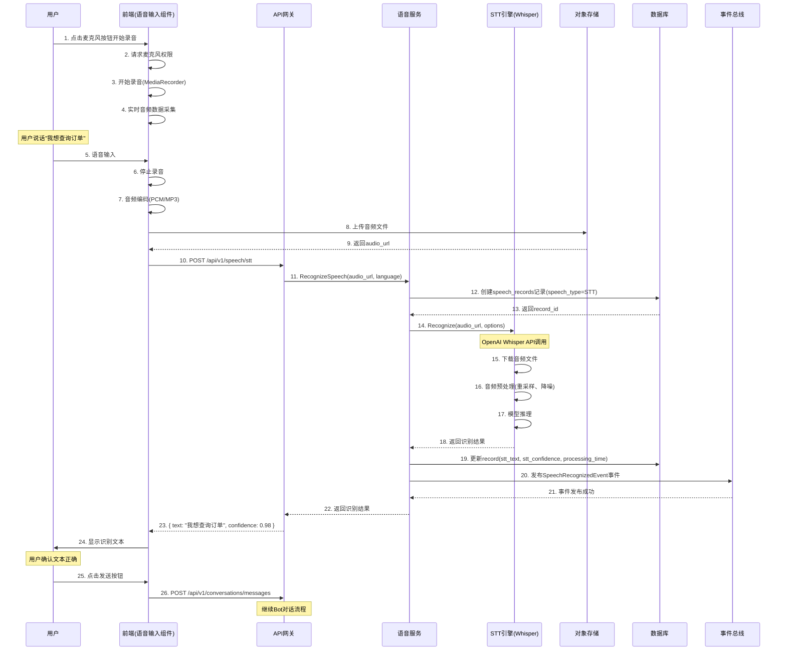
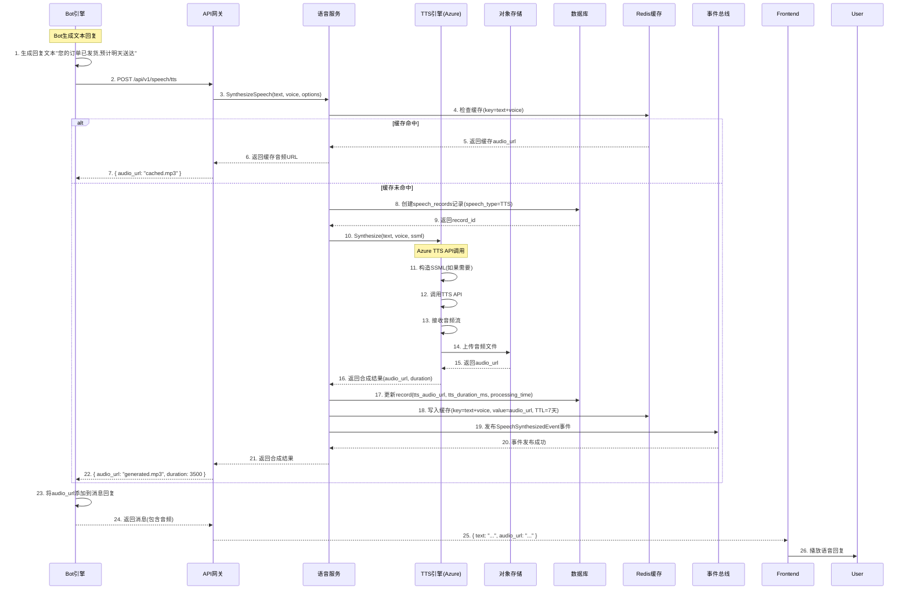
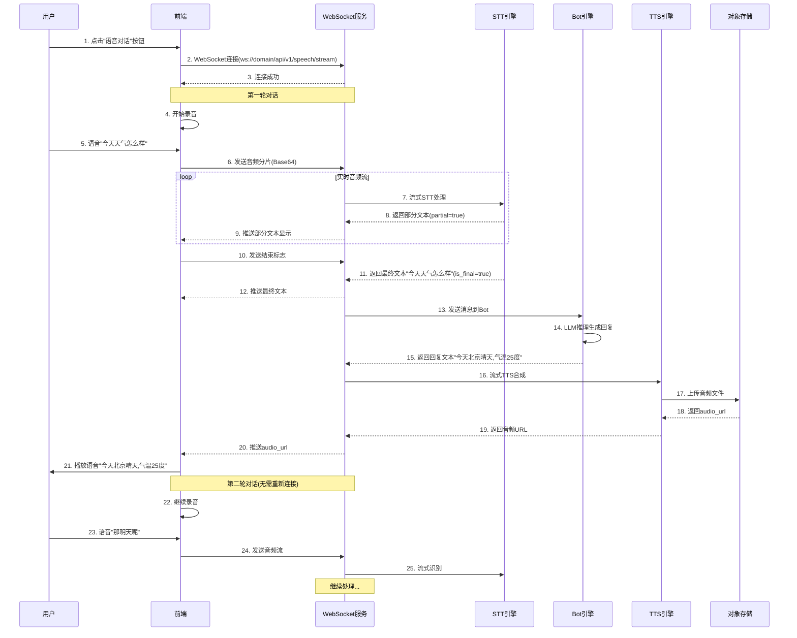
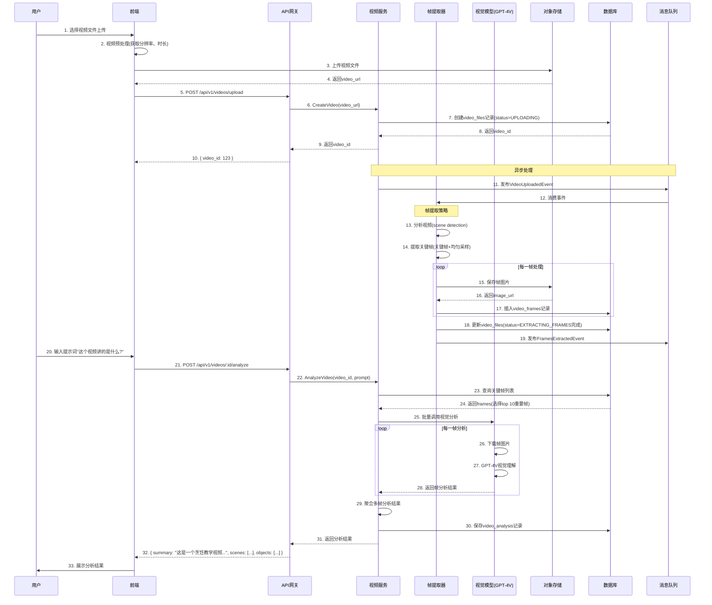
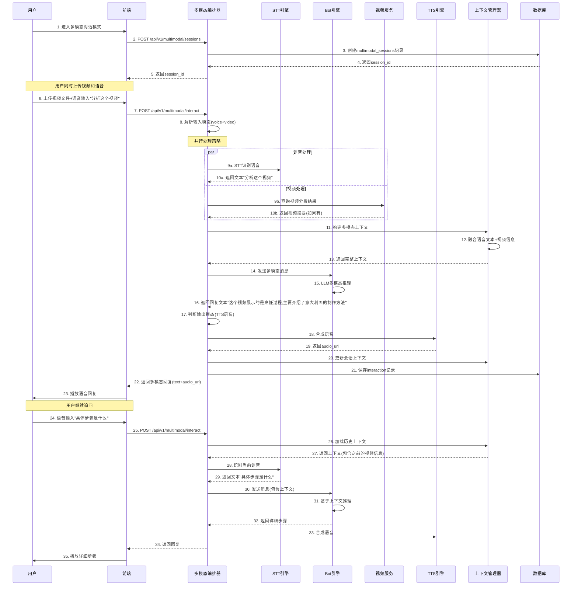

# 高级多模态功能设计: 语音交互与视频理解

> **文档编号**: DE-DD-2025-031
> **模块**: 高级多模态功能 - 语音交互与视频理解
> **版本**: v1.0
> **创建日期**: 2025-01-15
> **最后更新**: 2025-01-15

## 1. 功能概述

### 1.1 业务背景

Coze Studio 当前支持文本、图片等多模态交互,但缺少语音和视频的高级能力:

- **语音交互**: 用户期望通过语音对话与 Bot 交互,而非仅限文本
- **视频理解**: 需要分析视频内容,提取关键信息和场景理解
- **多模态编排**: 协调语音、视频、文本、图片多种模态的联合处理

### 1.2 核心价值

- **提升用户体验**: 语音交互降低输入门槛,提供更自然的交互方式
- **拓展应用场景**: 客服机器人、语音助手、视频分析等场景
- **增强Bot能力**: 支持"看"视频、"听"声音的多模态 Bot
- **技术竞争力**: 对标 GPT-4o 的多模态能力

### 1.3 功能范围

#### P0 核心功能
1. **语音输入** - Speech-to-Text (STT), 支持多语言、实时识别
2. **语音输出** - Text-to-Speech (TTS), 多种音色、情感合成
3. **视频理解** - 视频帧提取、场景识别、行为分析

#### P1 扩展功能
1. **实时语音对话** - WebSocket 实时双向语音流
2. **多模态编排** - 语音+视频+文本的联合处理流程
3. **语音情绪识别** - 识别用户语音中的情绪状态

## 2. 需求分析

### 2.1 用户场景

#### 场景1: 语音客服机器人
```
用户: [拨打电话或语音通话]
Bot: [TTS] 您好,我是智能客服助手,请问有什么可以帮您?
用户: [语音] 我想查询订单状态
Bot: [STT] 转换为文本 "我想查询订单状态"
Bot: [处理] 调用订单查询API
Bot: [TTS] 您的订单已发货,预计明天送达
```

#### 场景2: 视频内容分析
```
用户: [上传视频文件]
Bot: [分析] 识别视频中的场景、人物、动作
Bot: [回答] "这是一个烹饪教学视频,展示如何制作意大利面"
```

#### 场景3: 多模态智能助手
```
用户: [语音] 帮我看看这个视频里讲的是什么
Bot: [同时处理] 语音识别 + 视频理解
Bot: [TTS回答] "这个视频是关于机器学习入门教程的"
```

### 2.2 技术选型

#### 2.2.1 语音识别 (STT)

| 方案 | 优点 | 缺点 | 推荐度 |
|------|------|------|--------|
| **OpenAI Whisper** | 高精度、多语言支持、开源 | 需自建服务或调用API | ⭐⭐⭐⭐⭐ |
| **Azure Speech Service** | 实时流识别、高准确率 | 成本较高 | ⭐⭐⭐⭐ |
| **火山引擎 (字节跳动)** | 国内服务、中文优化 | 需备案 | ⭐⭐⭐⭐ |
| **Google Speech-to-Text** | 支持120+语言 | 国内访问受限 | ⭐⭐⭐ |

**推荐方案**: OpenAI Whisper + 火山引擎备用

#### 2.2.2 语音合成 (TTS)

| 方案 | 优点 | 缺点 | 推荐度 |
|------|------|------|--------|
| **Azure TTS** | 音色丰富、情感自然、SSML支持 | 成本较高 | ⭐⭐⭐⭐⭐ |
| **OpenAI TTS** | 质量、性价比高 | 音色选择少 | ⭐⭐⭐⭐ |
| **ElevenLabs** | 音色逼真、克隆声音 | 价格昂贵 | ⭐⭐⭐ |
| **火山引擎 TTS** | 中文优化、价格低 | 音色较少 | ⭐⭐⭐⭐ |

**推荐方案**: Azure TTS (主打) + OpenAI TTS (备用)

#### 2.2.3 视频理解

| 方案 | 优点 | 缺点 | 推荐度 |
|------|------|------|--------|
| **GPT-4V (Vision)** | 强大的视觉理解 | 仅支持图片帧 | ⭐⭐⭐⭐⭐ |
| **OpenAI Sora** | 视频生成理解 | 未公测 | ⭐⭐⭐ |
| **Azure Video Indexer** | 专业的视频分析 | 成本高 | ⭐⭐⭐⭐ |
| **自研方案 (帧提取+视觉模型)** | 灵活、可控 | 开发成本高 | ⭐⭐⭐ |

**推荐方案**: GPT-4V 分析关键帧 + 自研帧提取策略

### 2.3 性能要求

| 指标 | 要求 |
|------|------|
| 语音识别延迟 | < 2s (实时流 < 500ms) |
| 语音合成延迟 | < 1s |
| 视频处理速度 | 1分钟视频 < 30s |
| 音质 | 16kHz+ 采样率 |
| 视频分辨率 | 支持 1080p+ |

---

## 2.4 业务流程设计

### 2.4.1 语音识别(STT)流程



**流程说明**:
- **步骤1-9**: 音频采集与上传
- **步骤10-19**: STT处理与结果存储
- **步骤20-26**: 事件通知与文本确认

**关键设计点**:
- **音频质量检测**: 上传前检测音质、时长
- **引擎选择**: 根据语言选择最佳STT引擎
- **结果缓存**: 相同音频缓存识别结果
- **置信度过滤**: 低置信度结果提示用户重录

### 2.4.2 语音合成(TTS)流程



**流程说明**:
- **步骤1-3**: 文本转语音请求
- **步骤4-21**: 缓存检查或TTS合成
- **步骤22-26**: 音频播放

**关键设计点**:
- **缓存策略**: 相同文本+音色组合缓存7天
- **SSML支持**: 支持情感、语调、停顿控制
- **音频质量**: 16kHz采样率,MP3格式
- **成本控制**: 避免重复合成相同文本

### 2.4.3 实时语音对话流程



**流程说明**:
- **步骤1-3**: WebSocket连接建立
- **步骤4-12**: 流式STT识别
- **步骤13-15**: Bot对话处理
- **步骤16-21**: TTS合成与播放
- **步骤22-25**: 后续对话(复用连接)

**关键设计点**:
- **WebSocket持久化**: 单次连接支持多轮对话
- **流式STT**: 实时返回部分文本,提升响应速度
- **中断处理**: 支持用户中断播放
- **会话管理**: 维护对话上下文

### 2.4.4 视频理解流程



**流程说明**:
- **步骤1-10**: 视频上传与记录创建
- **步骤11-19**: 异步帧提取(场景检测+关键帧提取)
- **步骤20-33**: 视频分析(视觉模型理解多帧并聚合结果)

**关键设计点**:
- **智能帧提取**: 场景检测+均匀采样,避免重复帧
- **异步处理**: 使用消息队列避免阻塞
- **成本控制**: 仅分析关键帧(10-20帧),而非全部帧
- **进度反馈**: 实时返回处理进度

### 2.4.5 多模态编排流程



**流程说明**:
- **步骤1-5**: 创建多模态会话
- **步骤6-13**: 并行处理语音和视频输入
- **步骤14-23**: 融合上下文生成多模态回复
- **步骤24-35**: 基于上下文的多轮对话

**关键设计点**:
- **并行处理**: 语音和视频处理并行执行
- **上下文融合**: 统一管理多模态对话上下文
- **编排策略**: 支持SEQUENTIAL、PARALLEL、ADAPTIVE三种策略
- **模态选择**: 自动选择最佳输出模态(文本/语音/视频)

---

## 3. 系统架构设计

### 3.1 整体架构

```
┌─────────────────────────────────────────────────────────────┐
│                       前端展示层                              │
├─────────────────────────────────────────────────────────────┤
│  语音输入组件  │  语音播放器  │  视频上传  │  多模态对话      │
└─────────────────────────────────────────────────────────────┘
                              ↓
┌─────────────────────────────────────────────────────────────┐
│                       网关层                                  │
├─────────────────────────────────────────────────────────────┤
│  WebSocket 语音流  │  HTTP API  │  文件上传  │  消息队列      │
└─────────────────────────────────────────────────────────────┘
                              ↓
┌─────────────────────────────────────────────────────────────┐
│                       多模态服务层                            │
├─────────────────────────────────────────────────────────────┤
│  SpeechService  │  VideoService  │  MultimodalOrchestrator   │
│  STTEngine      │  TTSEngine     │  FrameExtractor           │
└─────────────────────────────────────────────────────────────┘
                              ↓
┌─────────────────────────────────────────────────────────────┐
│                       AI 模型层                              │
├─────────────────────────────────────────────────────────────┤
│  Whisper API    │  Azure TTS     │  GPT-4V                  │
│  火山引擎        │  OpenAI TTS    │  Claude Vision           │
└─────────────────────────────────────────────────────────────┘
                              ↓
┌─────────────────────────────────────────────────────────────┐
│                       存储层                                  │
├─────────────────────────────────────────────────────────────┤
│  MySQL  │  Redis  │  MinIO (音频/视频)  │  Elasticsearch    │
└─────────────────────────────────────────────────────────────┘
```

### 3.2 核心模块

#### 3.2.1 语音服务模块
- **职责**: STT/TTS 调用、音频流处理、语音缓存
- **接口**: SpeechService, STTEngine, TTSEngine
- **数据**: speech_records, audio_files

#### 3.2.2 视频服务模块
- **职责**: 视频上传、帧提取、场景分析
- **接口**: VideoService, FrameExtractor
- **数据**: video_files, video_frames, video_analysis

#### 3.2.3 多模态编排模块
- **职责**: 协调语音、视频、文本的联合处理
- **接口**: MultimodalOrchestrator
- **数据**: multimodal_sessions, modality_contexts

## 4. 数据库设计

### 4.1 语音服务表

#### 4.1.1 speech_records（语音记录表）

```sql
CREATE TABLE speech_records (
    id BIGINT PRIMARY KEY AUTO_INCREMENT COMMENT '记录ID',
    tenant_id VARCHAR(64) NOT NULL COMMENT '租户ID',
    user_id BIGINT NOT NULL COMMENT '用户ID',
    bot_id BIGINT NOT NULL COMMENT 'Bot ID',
    conversation_id BIGINT DEFAULT NULL COMMENT '对话ID',

    -- 语音类型
    speech_type ENUM('STT', 'TTS') NOT NULL COMMENT '语音类型（STT=语音识别,TTS=语音合成）',

    -- STT 相关
    stt_audio_url VARCHAR(500) DEFAULT NULL COMMENT 'STT音频URL',
    stt_engine VARCHAR(50) DEFAULT NULL COMMENT 'STT引擎（WHISPER/AZURE/VOLCENGINE）',
    stt_language VARCHAR(10) DEFAULT 'zh-CN' COMMENT '识别语言',
    stt_duration_ms INT DEFAULT NULL COMMENT '音频时长（毫秒）',
    stt_text TEXT DEFAULT NULL COMMENT '识别结果文本',
    stt_confidence DECIMAL(5, 4) DEFAULT NULL COMMENT '识别置信度',
    stt_is_final BOOLEAN DEFAULT FALSE COMMENT '是否最终结果',

    -- TTS 相关
    tts_text TEXT DEFAULT NULL COMMENT 'TTS待合成文本',
    tts_engine VARCHAR(50) DEFAULT NULL COMMENT 'TTS引擎（AZURE/OPENAI/VOLCENGINE）',
    tts_voice VARCHAR(100) DEFAULT NULL COMMENT 'TTS音色（如 zh-CN-XiaoxiaoNeural）',
    tts_audio_url VARCHAR(500) DEFAULT NULL COMMENT 'TTS音频URL',
    tts_duration_ms INT DEFAULT NULL COMMENT 'TTS音频时长',
    tts_file_size_bytes INT DEFAULT NULL COMMENT 'TTS文件大小',
    tts_ssml JSON DEFAULT NULL COMMENT 'TTS SSML配置',

    -- 质量指标
    audio_sample_rate INT DEFAULT 16000 COMMENT '采样率',
    audio_format VARCHAR(20) DEFAULT 'mp3' COMMENT '音频格式',
    audio_quality ENUM('LOW', 'MEDIUM', 'HIGH') DEFAULT 'MEDIUM' COMMENT '音频质量',

    -- 性能指标
    processing_time_ms INT DEFAULT NULL COMMENT '处理耗时',
    started_at DATETIME DEFAULT NULL COMMENT '开始时间',
    completed_at DATETIME DEFAULT NULL COMMENT '完成时间',

    -- 错误信息
    error_code VARCHAR(50) DEFAULT NULL COMMENT '错误码',
    error_message TEXT DEFAULT NULL COMMENT '错误信息',

    -- 元数据
    metadata JSON DEFAULT NULL COMMENT '其他元数据',

    -- 审计
    created_at DATETIME NOT NULL DEFAULT CURRENT_TIMESTAMP,

    INDEX idx_tenant_user (tenant_id, user_id),
    INDEX idx_bot (bot_id),
    INDEX idx_conversation (conversation_id),
    INDEX idx_speech_type (speech_type),
    INDEX idx_created (created_at)
) ENGINE=InnoDB DEFAULT CHARSET=utf8mb4 COMMENT='语音服务记录表';
```

#### 4.1.2 audio_files（音频文件表）

```sql
CREATE TABLE audio_files (
    id BIGINT PRIMARY KEY AUTO_INCREMENT COMMENT '文件ID',
    tenant_id VARCHAR(64) NOT NULL COMMENT '租户ID',
    user_id BIGINT NOT NULL COMMENT '用户ID',

    -- 文件信息
    file_name VARCHAR(255) NOT NULL COMMENT '文件名',
    file_path VARCHAR(500) NOT NULL COMMENT '文件路径',
    file_url VARCHAR(500) NOT NULL COMMENT '访问URL',
    file_size_bytes BIGINT NOT NULL COMMENT '文件大小（字节）',

    -- 音频属性
    duration_ms INT NOT NULL COMMENT '音频时长（毫秒）',
    sample_rate INT NOT NULL COMMENT '采样率',
    channels INT DEFAULT 1 COMMENT '声道数',
    bit_rate INT DEFAULT NULL COMMENT '比特率',
    format VARCHAR(20) NOT NULL COMMENT '音频格式（mp3/wav/aac）',
    codec VARCHAR(50) DEFAULT NULL COMMENT '编码格式',

    -- 音频质量
    is_quality_verified BOOLEAN DEFAULT FALSE COMMENT '是否质量检测通过',
    snr_db DECIMAL(5, 2) DEFAULT NULL COMMENT '信噪比（dB）',

    -- 用途
    usage_type ENUM('STT_INPUT', 'TTS_OUTPUT', 'USER_UPLOAD', 'SYSTEM_GENERATED') NOT NULL COMMENT '用途类型',
    speech_record_id BIGINT DEFAULT NULL COMMENT '关联语音记录ID',

    -- 状态
    status ENUM('UPLOADING', 'PROCESSING', 'READY', 'FAILED') NOT NULL DEFAULT 'PROCESSING' COMMENT '文件状态',

    -- 审计
    uploaded_at DATETIME NOT NULL DEFAULT CURRENT_TIMESTAMP,
    expires_at DATETIME DEFAULT NULL COMMENT '过期时间（NULL=永久）',

    INDEX idx_tenant_user (tenant_id, user_id),
    INDEX idx_usage_type (usage_type),
    INDEX idx_status (status),
    INDEX idx_expires (expires_at),
    FOREIGN KEY (speech_record_id) REFERENCES speech_records(id) ON DELETE SET NULL
) ENGINE=InnoDB DEFAULT CHARSET=utf8mb4 COMMENT='音频文件表';
```

### 4.2 视频服务表

#### 4.2.1 video_files（视频文件表）

```sql
CREATE TABLE video_files (
    id BIGINT PRIMARY KEY AUTO_INCREMENT COMMENT '文件ID',
    tenant_id VARCHAR(64) NOT NULL COMMENT '租户ID',
    user_id BIGINT NOT NULL COMMENT '用户ID',
    bot_id BIGINT DEFAULT NULL COMMENT '关联Bot ID',

    -- 文件信息
    file_name VARCHAR(255) NOT NULL COMMENT '文件名',
    file_path VARCHAR(500) NOT NULL COMMENT '文件路径',
    file_url VARCHAR(500) NOT NULL COMMENT '访问URL',
    file_size_bytes BIGINT NOT NULL COMMENT '文件大小（字节）',

    -- 视频属性
    duration_ms INT NOT NULL COMMENT '视频时长（毫秒）',
    width INT NOT NULL COMMENT '视频宽度',
    height INT NOT NULL COMMENT '视频高度',
    fps DECIMAL(5, 2) DEFAULT NULL COMMENT '帧率',
    format VARCHAR(20) NOT NULL COMMENT '视频格式（mp4/avi/mov）',
    codec VARCHAR(50) DEFAULT NULL COMMENT '编码格式',
    bitrate INT DEFAULT NULL COMMENT '比特率（kbps）',

    -- 音频轨道
    has_audio BOOLEAN DEFAULT FALSE COMMENT '是否包含音频',
    audio_codec VARCHAR(50) DEFAULT NULL COMMENT '音频编码',

    -- 缩略图
    thumbnail_url VARCHAR(500) DEFAULT NULL COMMENT '缩略图URL',

    -- 处理状态
    status ENUM('UPLOADING', 'EXTRACTING_FRAMES', 'ANALYZING', 'READY', 'FAILED') NOT NULL DEFAULT 'UPLOADING',
    processing_percentage INT DEFAULT 0 COMMENT '处理进度',

    -- 错误信息
    error_message TEXT DEFAULT NULL COMMENT '错误信息',

    -- 元数据
    metadata JSON DEFAULT NULL COMMENT '其他元数据',

    -- 审计
    created_at DATETIME NOT NULL DEFAULT CURRENT_TIMESTAMP,
    updated_at DATETIME NOT NULL DEFAULT CURRENT_TIMESTAMP ON UPDATE CURRENT_TIMESTAMP,

    INDEX idx_tenant_user (tenant_id, user_id),
    INDEX idx_bot (bot_id),
    INDEX idx_status (status),
    INDEX idx_created (created_at)
) ENGINE=InnoDB DEFAULT CHARSET=utf8mb4 COMMENT='视频文件表';
```

#### 4.2.2 video_frames（视频帧表）

```sql
CREATE TABLE video_frames (
    id BIGINT PRIMARY KEY AUTO_INCREMENT COMMENT '帧ID',
    video_file_id BIGINT NOT NULL COMMENT '视频文件ID',
    tenant_id VARCHAR(64) NOT NULL COMMENT '租户ID',

    -- 帧信息
    frame_sequence INT NOT NULL COMMENT '帧序号（从0开始）',
    timestamp_ms INT NOT NULL COMMENT '时间戳（毫秒）',

    -- 图片信息
    image_url VARCHAR(500) NOT NULL COMMENT '图片URL',
    image_path VARCHAR(500) NOT NULL COMMENT '图片路径',
    file_size_bytes INT NOT NULL COMMENT '图片大小',
    width INT NOT NULL COMMENT '图片宽度',
    height INT NOT NULL COMMENT '图片高度',
    format VARCHAR(20) DEFAULT 'jpg' COMMENT '图片格式',

    -- 帧类型
    frame_type ENUM('KEYFRAME', 'UNIFORM_SAMPLING', 'SCENE_CHANGE', 'MANUAL') NOT NULL DEFAULT 'UNIFORM_SAMPLING' COMMENT '帧提取策略',
    importance_score DECIMAL(5, 4) DEFAULT NULL COMMENT '重要性评分（0-1）',

    -- 视觉特征
    is_blur BOOLEAN DEFAULT FALSE COMMENT '是否模糊',
    brightness DECIMAL(5, 2) DEFAULT NULL COMMENT '亮度（0-255）',
    contrast DECIMAL(5, 2) DEFAULT NULL COMMENT '对比度',
    color_histogram JSON DEFAULT NULL COMMENT '颜色直方图',

    -- 审计
    created_at DATETIME NOT NULL DEFAULT CURRENT_TIMESTAMP,

    UNIQUE KEY uk_video_sequence (video_file_id, frame_sequence),
    INDEX idx_video (video_file_id),
    INDEX idx_frame_type (frame_type),
    INDEX idx_importance (importance_score),
    FOREIGN KEY (video_file_id) REFERENCES video_files(id) ON DELETE CASCADE
) ENGINE=InnoDB DEFAULT CHARSET=utf8mb4 COMMENT='视频帧表';
```

#### 4.2.3 video_analysis（视频分析结果表）

```sql
CREATE TABLE video_analysis (
    id BIGINT PRIMARY KEY AUTO_INCREMENT COMMENT '分析ID',
    video_file_id BIGINT NOT NULL COMMENT '视频文件ID',
    tenant_id VARCHAR(64) NOT NULL COMMENT '租户ID',
    bot_id BIGINT DEFAULT NULL COMMENT 'Bot ID',
    conversation_id BIGINT DEFAULT NULL COMMENT '对话ID',

    -- 分析类型
    analysis_type ENUM('SCENE', 'OBJECT', 'ACTION', 'TEXT', 'EMOTION', 'SUMMARY') NOT NULL COMMENT '分析类型',

    -- 分析引擎
    engine VARCHAR(50) NOT NULL COMMENT '分析引擎（GPT4V/CLAUDE/AZURE）',
    model_version VARCHAR(50) DEFAULT NULL COMMENT '模型版本',

    -- 分析配置
    analyzed_frame_ids JSON DEFAULT NULL COMMENT '分析的关键帧ID列表',
    analysis_prompt TEXT DEFAULT NULL COMMENT '分析提示词',

    -- 分析结果
    result_summary TEXT DEFAULT NULL COMMENT '结果摘要',
    result_detail JSON DEFAULT NULL COMMENT '详细结果（JSON格式）',
    confidence DECIMAL(5, 4) DEFAULT NULL COMMENT '置信度',

    -- 场景分析结果
    scenes JSON DEFAULT NULL COMMENT '识别的场景列表（如[{"scene": "厨房", "confidence": 0.95}]）',
    objects JSON DEFAULT NULL COMMENT '识别的物体列表（如[{"object": "冰箱", "bbox": [...]}]）',
    actions JSON DEFAULT NULL COMMENT '识别的动作列表（如[{"action": "烹饪", "timestamp": 5000}]）',
    texts JSON DEFAULT NULL COMMENT '识别的文字列表（OCR结果）',

    -- 时间范围
    start_time_ms INT DEFAULT NULL COMMENT '分析起始时间',
    end_time_ms INT DEFAULT NULL COMMENT '分析结束时间',

    -- 性能指标
    processing_time_ms INT DEFAULT NULL COMMENT '处理耗时',
    tokens_used INT DEFAULT NULL COMMENT '使用的Token数',
    estimated_cost_usd DECIMAL(10, 4) DEFAULT NULL COMMENT '预估成本（美元）',

    -- 状态
    status ENUM('PENDING', 'PROCESSING', 'COMPLETED', 'FAILED') NOT NULL DEFAULT 'PENDING',

    -- 错误信息
    error_code VARCHAR(50) DEFAULT NULL COMMENT '错误码',
    error_message TEXT DEFAULT NULL COMMENT '错误信息',

    -- 审计
    created_at DATETIME NOT NULL DEFAULT CURRENT_TIMESTAMP,
    completed_at DATETIME DEFAULT NULL COMMENT '完成时间',

    INDEX idx_video (video_file_id),
    INDEX idx_tenant (tenant_id),
    INDEX idx_bot_conversation (bot_id, conversation_id),
    INDEX idx_type (analysis_type),
    INDEX idx_status (status),
    INDEX idx_created (created_at),
    FOREIGN KEY (video_file_id) REFERENCES video_files(id) ON DELETE CASCADE
) ENGINE=InnoDB DEFAULT CHARSET=utf8mb4 COMMENT='视频分析结果表';
```

### 4.3 多模态编排表

#### 4.3.1 multimodal_sessions（多模态会话表）

```sql
CREATE TABLE multimodal_sessions (
    id BIGINT PRIMARY KEY AUTO_INCREMENT COMMENT '会话ID',
    tenant_id VARCHAR(64) NOT NULL COMMENT '租户ID',
    user_id BIGINT NOT NULL COMMENT '用户ID',
    bot_id BIGINT NOT NULL COMMENT 'Bot ID',
    conversation_id BIGINT DEFAULT NULL COMMENT '关联对话ID',

    -- 会话类型
    session_type ENUM('VOICE_CHAT', 'VIDEO_ANALYSIS', 'MULTIMODAL_INTERACTION') NOT NULL COMMENT '会话类型',

    -- 模态配置
    enabled_modalities JSON NOT NULL COMMENT '启用的模态列表（如["text", "voice", "video"]）',
    primary_modality VARCHAR(20) DEFAULT 'text' COMMENT '主要模态',

    -- 语音配置
    voice_config JSON DEFAULT NULL COMMENT '语音配置（STT/TTS引擎、音色等）',

    -- 视频配置
    video_config JSON DEFAULT NULL COMMENT '视频配置（帧提取策略等）',

    -- 编排策略
    orchestration_strategy ENUM('SEQUENTIAL', 'PARALLEL', 'ADAPTIVE') DEFAULT 'SEQUENTIAL' COMMENT '编排策略',

    -- 上下文
    context_summary TEXT DEFAULT NULL COMMENT '会话摘要',
    context_tokens JSON DEFAULT NULL COMMENT '上下文Token统计',

    -- 状态
    status ENUM('ACTIVE', 'PAUSED', 'COMPLETED', 'ERROR') NOT NULL DEFAULT 'ACTIVE',

    -- 统计
    total_interactions INT DEFAULT 0 COMMENT '总交互次数',
    voice_interactions INT DEFAULT 0 COMMENT '语音交互次数',
    video_interactions INT DEFAULT 0 COMMENT '视频交互次数',

    -- 性能指标
    average_latency_ms INT DEFAULT NULL COMMENT '平均延迟',
    total_tokens_used INT DEFAULT 0 COMMENT '总Token消耗',

    -- 错误信息
    last_error TEXT DEFAULT NULL COMMENT '最后错误信息',

    -- 时间
    started_at DATETIME NOT NULL DEFAULT CURRENT_TIMESTAMP COMMENT '开始时间',
    ended_at DATETIME DEFAULT NULL COMMENT '结束时间',
    last_activity_at DATETIME NOT NULL DEFAULT CURRENT_TIMESTAMP COMMENT '最后活跃时间',

    -- 审计
    created_at DATETIME NOT NULL DEFAULT CURRENT_TIMESTAMP,
    updated_at DATETIME NOT NULL DEFAULT CURRENT_TIMESTAMP ON UPDATE CURRENT_TIMESTAMP,

    INDEX idx_tenant_user (tenant_id, user_id),
    INDEX idx_bot (bot_id),
    INDEX idx_conversation (conversation_id),
    INDEX idx_status (status),
    INDEX idx_last_activity (last_activity_at)
) ENGINE=InnoDB DEFAULT CHARSET=utf8mb4 COMMENT='多模态会话表';
```

#### 4.3.2 modality_contexts（模态上下文表）

```sql
CREATE TABLE modality_contexts (
    id BIGINT PRIMARY KEY AUTO_INCREMENT COMMENT '上下文ID',
    session_id BIGINT NOT NULL COMMENT '会话ID',
    tenant_id VARCHAR(64) NOT NULL COMMENT '租户ID',

    -- 模态类型
    modality_type ENUM('TEXT', 'VOICE', 'IMAGE', 'VIDEO') NOT NULL COMMENT '模态类型',

    -- 关联资源
    speech_record_id BIGINT DEFAULT NULL COMMENT '语音记录ID',
    video_file_id BIGINT DEFAULT NULL COMMENT '视频文件ID',
    video_frame_id BIGINT DEFAULT NULL COMMENT '视频帧ID',

    -- 内容数据
    input_data TEXT DEFAULT NULL COMMENT '输入数据（文本或JSON）',
    input_url VARCHAR(500) DEFAULT NULL COMMENT '输入资源URL',

    -- 处理结果
    output_data MEDIUMTEXT DEFAULT NULL COMMENT '输出数据',
    output_url VARCHAR(500) DEFAULT NULL COMMENT '输出资源URL',

    -- 中间结果
    intermediate_results JSON DEFAULT NULL COMMENT '中间处理结果',

    -- 性能指标
    processing_time_ms INT DEFAULT NULL COMMENT '处理耗时',
    confidence DECIMAL(5, 4) DEFAULT NULL COMMENT '置信度',

    -- 元数据
    metadata JSON DEFAULT NULL COMMENT '其他元数据',

    -- 时间
    created_at DATETIME NOT NULL DEFAULT CURRENT_TIMESTAMP,

    INDEX idx_session (session_id),
    INDEX idx_modality (modality_type),
    INDEX idx_created (created_at),
    FOREIGN KEY (session_id) REFERENCES multimodal_sessions(id) ON DELETE CASCADE
) ENGINE=InnoDB DEFAULT CHARSET=utf8mb4 COMMENT='模态上下文表';
```

## 5. API 设计

### 5.1 语音服务 API

#### 5.1.1 语音识别 (STT)

```http
POST /api/v1/speech/stt
```

**请求参数**:
```json
{
  "audioFile": "base64_encoded_audio_data",
  "audioUrl": "https://storage.example.com/audio.mp3",
  "engine": "WHISPER",
  "language": "zh-CN",
  "format": "mp3",
  "sampleRate": 16000
}
```

**响应示例**:
```json
{
  "code": 0,
  "message": "success",
  "data": {
    "speechRecordId": 12345,
    "text": "你好,我想查询订单状态",
    "confidence": 0.98,
    "language": "zh-CN",
    "duration": 3250,
    "processingTimeMs": 850,
    "isFinal": true
  }
}
```

#### 5.1.2 语音合成 (TTS)

```http
POST /api/v1/speech/tts
```

**请求参数**:
```json
{
  "text": "您好,我是智能客服助手",
  "engine": "AZURE",
  "voice": "zh-CN-XiaoxiaoNeural",
  "format": "mp3",
  "sampleRate": 16000,
  "ssml": "<speak><prosody rate='0.9'>您好</prosody></speak>"
}
```

**响应示例**:
```json
{
  "code": 0,
  "message": "success",
  "data": {
    "speechRecordId": 12346,
    "audioUrl": "https://storage.example.com/tts/12346.mp3",
    "duration": 2150,
    "fileSizeBytes": 34560,
    "processingTimeMs": 420
  }
}
```

#### 5.1.3 实时语音流 (WebSocket)

```javascript
// WebSocket 连接
const ws = new WebSocket('wss://api.example.com/ws/speech/stream?token=xxx');

// 发送音频数据
ws.send(JSON.stringify({
  type: 'audio',
  data: base64_audio_chunk,
  format: 'mp3',
  sampleRate: 16000
}));

// 接收识别结果
ws.onmessage = (event) => {
  const result = JSON.parse(event.data);
  console.log('识别结果:', result.text);
  console.log('是否最终:', result.isFinal);
};
```

### 5.2 视频服务 API

#### 5.2.1 上传视频

```http
POST /api/v1/videos/upload
Content-Type: multipart/form-data
```

**请求参数**:
```
video_file: <binary>
bot_id: 123
analysis_type: "SCENE"
```

**响应示例**:
```json
{
  "code": 0,
  "message": "上传成功",
  "data": {
    "videoId": 456,
    "fileName": "cooking_video.mp4",
    "fileUrl": "https://storage.example.com/videos/456.mp4",
    "thumbnailUrl": "https://storage.example.com/thumbnails/456.jpg",
    "duration": 125000,
    "width": 1920,
    "height": 1080,
    "fps": 30.0,
    "status": "EXTRACTING_FRAMES"
  }
}
```

#### 5.2.2 分析视频

```http
POST /api/v1/videos/{videoId}/analyze
```

**请求参数**:
```json
{
  "analysisTypes": ["SCENE", "OBJECT", "ACTION", "SUMMARY"],
  "engine": "GPT4V",
  "frameExtractionStrategy": "KEYFRAME",
  "maxFrames": 20,
  "customPrompt": "请描述视频中的主要场景和动作"
}
```

**响应示例**:
```json
{
  "code": 0,
  "message": "分析任务已创建",
  "data": {
    "analysisId": 789,
    "videoId": 456,
    "status": "PROCESSING",
    "estimatedTimeSeconds": 30
  }
}
```

#### 5.2.3 查询分析结果

```http
GET /api/v1/videos/{videoId}/analysis/{analysisId}
```

**响应示例**:
```json
{
  "code": 0,
  "message": "success",
  "data": {
    "analysisId": 789,
    "status": "COMPLETED",
    "resultSummary": "这是一个烹饪教学视频,展示如何制作意大利面。主要场景包括厨房,人物展示切菜、煮面等烹饪步骤。",
    "scenes": [
      { "scene": "厨房", "confidence": 0.95, "timestamps": [0, 30000, 60000] },
      { "scene": "餐厅", "confidence": 0.88, "timestamps": [120000] }
    ],
    "objects": [
      { "object": "锅", "count": 3, "confidence": 0.92 },
      { "object": "意大利面", "count": 1, "confidence": 0.97 }
    ],
    "actions": [
      { "action": "切菜", "startTime": 5000, "endTime": 15000, "confidence": 0.89 },
      { "action": "煮面", "startTime": 40000, "endTime": 90000, "confidence": 0.94 }
    ],
    "processingTimeMs": 28500,
    "tokensUsed": 15230,
    "estimatedCostUsd": 0.4569
  }
}
```

#### 5.2.4 获取视频帧列表

```http
GET /api/v1/videos/{videoId}/frames
```

**请求参数**:
```
frame_type: KEYFRAME
limit: 20
offset: 0
```

**响应示例**:
```json
{
  "code": 0,
  "message": "success",
  "data": {
    "total": 15,
    "frames": [
      {
        "id": 101,
        "frameSequence": 0,
        "timestampMs": 0,
        "imageUrl": "https://storage.example.com/frames/456/101.jpg",
        "width": 1920,
        "height": 1080,
        "frameType": "KEYFRAME",
        "importanceScore": 0.95
      }
    ]
  }
}
```

### 5.3 多模态编排 API

#### 5.3.1 创建多模态会话

```http
POST /api/v1/multimodal/sessions
```

**请求参数**:
```json
{
  "botId": 123,
  "sessionType": "VOICE_CHAT",
  "enabledModalities": ["text", "voice"],
  "voiceConfig": {
    "sttEngine": "WHISPER",
    "ttsEngine": "AZURE",
    "voice": "zh-CN-XiaoxiaoNeural"
  }
}
```

**响应示例**:
```json
{
  "code": 0,
  "message": "会话创建成功",
  "data": {
    "sessionId": 789,
    "sessionType": "VOICE_CHAT",
    "status": "ACTIVE",
    "websocketUrl": "wss://api.example.com/ws/multimodal/789?token=xxx"
  }
}
```

#### 5.3.2 多模态交互 (WebSocket)

```javascript
// WebSocket 连接
const ws = new WebSocket('wss://api.example.com/ws/multimodal/789?token=xxx');

// 语音输入
ws.send(JSON.stringify({
  type: 'voice_input',
  modality: 'voice',
  data: {
    audioUrl: 'https://storage.example.com/audio.mp3',
    format: 'mp3'
  }
}));

// 视频输入
ws.send(JSON.stringify({
  type: 'video_input',
  modality: 'video',
  data: {
    videoUrl: 'https://storage.example.com/video.mp4',
    question: '视频里讲的是什么?'
  }
}));

// 接收多模态响应
ws.onmessage = (event) => {
  const response = JSON.parse(event.data);
  console.log('响应类型:', response.type); // 'voice_output' | 'text_output' | 'video_analysis'

  if (response.type === 'voice_output') {
    // 播放语音
    playAudio(response.audioUrl);
  } else if (response.type === 'text_output') {
    // 显示文本
    displayText(response.text);
  } else if (response.type === 'video_analysis') {
    // 显示视频分析结果
    displayVideoAnalysis(response.analysis);
  }
};
```

## 6. 后端实现

### 6.1 语音服务 - STT 引擎

```go
package service

import (
    "context"
    "encoding/base64"
    "errors"
    "fmt"
    "io"
    "time"

    "gorm.io/gorm"
    "github.com/sashabaranov/go-openai"
)

// STTEngine 语音识别引擎接口
type STTEngine interface {
    Recognize(ctx context.Context, audio *AudioInput) (*STTResult, error)
    RecognizeStream(ctx context.Context, audioStream <-chan *AudioChunk) (<-chan *STTResult, error)
}

// AudioInput 音频输入
type AudioInput struct {
    Data       []byte `json:"data"`        // 音频数据
    URL        string `json:"url"`         // 音频URL
    Format     string `json:"format"`      // 音频格式
    SampleRate int    `json:"sampleRate"`  // 采样率
    Language   string `json:"language"`    // 语言代码
}

// STTResult 识别结果
type STTResult struct {
    Text              string  `json:"text"`
    Confidence        float64 `json:"confidence"`
    Language          string  `json:"language"`
    Duration          int     `json:"duration"`
    IsFinal           bool    `json:"isFinal"`
    ProcessingTimeMs  int     `json:"processingTimeMs"`
}

// WhisperSTTEngine OpenAI Whisper 引擎
type WhisperSTTEngine struct {
    client *openai.Client
    db     *gorm.DB
}

// NewWhisperSTTEngine 创建 Whisper 引擎
func NewWhisperSTTEngine(apiKey string, db *gorm.DB) *WhisperSTTEngine {
    client := openai.NewClient(apiKey)
    return &WhisperSTTEngine{
        client: client,
        db:     db,
    }
}

// Recognize 识别音频
func (e *WhisperSTTEngine) Recognize(
    ctx context.Context,
    audio *AudioInput,
) (*STTResult, error) {
    startTime := time.Now()

    // 1. 加载音频数据
    audioData, err := e.loadAudio(audio)
    if err != nil {
        return nil, err
    }

    // 2. 调用 Whisper API
    resp, err := e.client.CreateTranscription(ctx, openai.AudioRequest{
        Model:    openai.Whisper1,
        FilePath: "audio.mp3",
        Reader:   bytes.NewReader(audioData),
        Format:   openai.AudioFormatMp3,
        Language: e.mapLanguageCode(audio.Language),
    })
    if err != nil {
        return nil, fmt.Errorf("whisper api error: %w", err)
    }

    // 3. 构建结果
    processingTime := time.Since(startTime)

    result := &STTResult{
        Text:             resp.Text,
        Confidence:       0.0, // Whisper 不提供置信度
        Language:         audio.Language,
        Duration:         int(time.Duration(len(audioData)) * time.Second / 16000), // 估算
        IsFinal:          true,
        ProcessingTimeMs: int(processingTime.Milliseconds()),
    }

    return result, nil
}

// RecognizeStream 流式识别
func (e *WhisperSTTEngine) RecognizeStream(
    ctx context.Context,
    audioStream <-chan *AudioChunk,
) (<-chan *STTResult, error) {
    resultChan := make(chan *STTResult)

    go func() {
        defer close(resultChan)

        var audioBuffer [][]byte
        totalChunks := 0

        // 收集音频块
        for chunk := range audioStream {
            audioBuffer = append(audioBuffer, chunk.Data)
            totalChunks++
        }

        // 合并音频数据
        audioData := bytes.Join(audioBuffer, nil)

        // 识别
        result, err := e.Recognize(ctx, &AudioInput{
            Data:       audioData,
            Format:     "mp3",
            SampleRate: 16000,
            Language:   "zh-CN",
        })

        if err != nil {
            // 发送错误结果
            resultChan <- &STTResult{
                Text:    "",
                IsFinal: true,
            }
            return
        }

        resultChan <- result
    }()

    return resultChan, nil
}

// loadAudio 加载音频数据
func (e *WhisperSTTEngine) loadAudio(audio *AudioInput) ([]byte, error) {
    // 优先使用 URL
    if audio.URL != "" {
        // TODO: 从 URL 下载音频
        resp, err := http.Get(audio.URL)
        if err != nil {
            return nil, err
        }
        defer resp.Body.Close()
        return io.ReadAll(resp.Body)
    }

    // 使用 Data
    if len(audio.Data) > 0 {
        return audio.Data, nil
    }

    return nil, errors.New("no audio data or URL provided")
}

// mapLanguageCode 映射语言代码
func (e *WhisperSTTEngine) mapLanguageCode(lang string) string {
    // ISO 639-1 代码
    langMap := map[string]string{
        "zh-CN": "zh",
        "en-US": "en",
        "ja-JP": "ja",
        "ko-KR": "ko",
    }

    if mapped, ok := langMap[lang]; ok {
        return mapped
    }

    return "zh" // 默认中文
}

// AzureSTTEngine Azure Speech 服务引擎
type AzureSTTEngine struct {
    subscriptionKey string
    region          string
    db              *gorm.DB
}

// Recognize 实现 Azure STT
func (e *AzureSTTEngine) Recognize(
    ctx context.Context,
    audio *AudioInput,
) (*STTResult, error) {
    // TODO: 实现 Azure Speech-to-Text API 调用
    return &STTResult{}, nil
}
```

### 6.2 语音服务 - TTS 引擎

```go
package service

import (
    "context"
    "bytes"
    "encoding/base64"
    "fmt"
    "io"
    "time"

    "gorm.io/gorm"
)

// TTSEngine 语音合成引擎接口
type TTSEngine interface {
    Synthesize(ctx context.Context, req *TTSRequest) (*TTSResult, error)
    GetAvailableVoices() ([]Voice, error)
}

// TTSRequest 合成请求
type TTSRequest struct {
    Text       string                 `json:"text"`
    Voice      string                 `json:"voice"`
    Format     string                 `json:"format"`
    SampleRate int                    `json:"sampleRate"`
    SSML       string                 `json:"ssml"`
    Options    map[string]interface{} `json:"options"`
}

// TTSResult 合成结果
type TTSResult struct {
    AudioData        []byte `json:"audioData"`
    AudioURL         string `json:"audioUrl"`
    Duration         int    `json:"duration"`
    FileSizeBytes    int    `json:"fileSizeBytes"`
    ProcessingTimeMs int    `json:"processingTimeMs"`
}

// Voice 音色信息
type Voice struct {
    VoiceID    string `json:"voiceId"`
    Name       string `json:"name"`
    Language   string `json:"language"`
    Gender     string `json:"gender"`
    Style      string `json:"style"`
    IsNeural   bool   `json:"isNeural"`
}

// AzureTTSEngine Azure TTS 引擎
type AzureTTSEngine struct {
    subscriptionKey string
    region          string
    storage         *StorageService
    db              *gorm.DB
}

// NewAzureTTSEngine 创建 Azure TTS 引擎
func NewAzureTTSEngine(
    subscriptionKey string,
    region string,
    storage *StorageService,
    db *gorm.DB,
) *AzureTTSEngine {
    return &AzureTTSEngine{
        subscriptionKey: subscriptionKey,
        region:          region,
        storage:         storage,
        db:              db,
    }
}

// Synthesize 合成语音
func (e *AzureTTSEngine) Synthesize(
    ctx context.Context,
    req *TTSRequest,
) (*TTSResult, error) {
    startTime := time.Now()

    // 1. 构建 SSML
    ssml := e.buildSSML(req)

    // 2. 调用 Azure TTS API
    audioData, err := e.callAzureTTSAPI(ctx, ssml, req.Format)
    if err != nil {
        return nil, fmt.Errorf("azure tts api error: %w", err)
    }

    // 3. 上传到存储
    fileName := fmt.Sprintf("tts/%d.mp3", time.Now().UnixNano())
    audioURL, err := e.storage.Upload(ctx, fileName, audioData)
    if err != nil {
        return nil, fmt.Errorf("upload error: %w", err)
    }

    // 4. 计算时长 (估算)
    duration := e.estimateDuration(audioData, req.SampleRate)

    processingTime := time.Since(startTime)

    return &TTSResult{
        AudioData:        audioData,
        AudioURL:         audioURL,
        Duration:         duration,
        FileSizeBytes:    len(audioData),
        ProcessingTimeMs: int(processingTime.Milliseconds()),
    }, nil
}

// buildSSML 构建 SSML
func (e *AzureTTSEngine) buildSSML(req *TTSRequest) string {
    if req.SSML != "" {
        return req.SSML
    }

    ssml := fmt.Sprintf(`
<speak version='1.0' xml:lang='zh-CN'>
    <voice name='%s'>
        <prosody rate='%s' pitch='%s'>
            %s
        </prosody>
    </voice>
</speak>
    `, req.Voice,
       e.getOption(req.Options, "rate", "0%"),
       e.getOption(req.Options, "pitch", "0%"),
       req.Text)

    return ssml
}

// callAzureTTSAPI 调用 Azure TTS API
func (e *AzureTTSEngine) callAzureTTSAPI(
    ctx context.Context,
    ssml string,
    format string,
) ([]byte, error) {
    // TODO: 实现实际的 Azure Cognitive Services API 调用
    // 1. 构建 HTTP 请求
    // 2. 添加认证头 (Ocp-Apim-Subscription-Key)
    // 3. 发送 SSML 数据
    // 4. 接收音频数据

    // 伪代码示例:
    /*
    url := fmt.Sprintf("https://%s.tts.speech.microsoft.com/cognitiveservices/v1", e.region)
    httpReq, _ := http.NewRequestWithContext(ctx, "POST", url, strings.NewReader(ssml))
    httpReq.Header.Set("Content-Type", "application/ssml+xml")
    httpReq.Header.Set("X-Microsoft-OutputFormat", "audio-16khz-128kbitrate-mono-mp3")
    httpReq.Header.Set("Ocp-Apim-Subscription-Key", e.subscriptionKey)

    resp, err := httpClient.Do(httpReq)
    if err != nil {
        return nil, err
    }
    defer resp.Body.Close()

    return io.ReadAll(resp.Body)
    */

    return nil, errors.New("not implemented")
}

// GetAvailableVoices 获取可用音色列表
func (e *AzureTTSEngine) GetAvailableVoices() ([]Voice, error) {
    // Azure Neural Voices (中文)
    voices := []Voice{
        {
            VoiceID:  "zh-CN-XiaoxiaoNeural",
            Name:     "晓晓",
            Language: "zh-CN",
            Gender:   "Female",
            Style:    "Calm",
            IsNeural: true,
        },
        {
            VoiceID:  "zh-CN-YunxiNeural",
            Name:     "云希",
            Language: "zh-CN",
            Gender:   "Male",
            Style:    "Calm",
            IsNeural: true,
        },
        {
            VoiceID:  "zh-CN-YunyangNeural",
            Name:     "云扬",
            Language: "zh-CN",
            Gender:   "Male",
            Style:    "Cheerful",
            IsNeural: true,
        },
    }

    return voices, nil
}

// estimateDuration 估算音频时长
func (e *AzureTTSEngine) estimateDuration(audioData []byte, sampleRate int) int {
    // 粗略估算: 文件大小 / (采样率 * 2 字节/样本)
    fileSize := len(audioData)
    bytesPerSecond := sampleRate * 2 // 16-bit mono
    duration := (fileSize / bytesPerSecond) * 1000 // 毫秒

    return duration
}

// getOption 获取选项
func (e *AzureTTSEngine) getOption(options map[string]interface{}, key string, defaultVal string) string {
    if val, ok := options[key]; ok {
        return fmt.Sprintf("%v", val)
    }
    return defaultVal
}
```

### 6.3 视频服务 - 帧提取

```go
package service

import (
    "context"
    "fmt"
    "image"
    "image/jpeg"
    "os"
    "os/exec"
    "path/filepath"
    "strconv"
    "time"

    "gorm.io/gorm"
)

// FrameExtractor 视频帧提取器
type FrameExtractor struct {
    db           *gorm.DB
    storage      *StorageService
    ffmpegPath   string
    tempDir      string
}

// NewFrameExtractor 创建帧提取器
func NewFrameExtractor(db *gorm.DB, storage *StorageService) *FrameExtractor {
    return &FrameExtractor{
        db:         db,
        storage:    storage,
        ffmpegPath: "/usr/bin/ffmpeg", // FFmpeg 路径
        tempDir:    "/tmp/video_frames",
    }
}

// ExtractFramesStrategy 帧提取策略
type ExtractFramesStrategy struct {
    Strategy       string  `json:"strategy"`        // KEYFRAME, UNIFORM_SAMPLING, SCENE_CHANGE
    MaxFrames      int     `json:"maxFrames"`       // 最大提取帧数
    IntervalMs     int     `json:"intervalMs"`      // 均匀采样间隔
    Threshold      float64 `json:"threshold"`       // 场景变化阈值
    MinQuality     float64 `json:"minQuality"`      // 最小质量分数
}

// ExtractFrames 提取视频帧
func (e *FrameExtractor) ExtractFrames(
    ctx context.Context,
    videoFileID int64,
    strategy *ExtractFramesStrategy,
) ([]int64, error) {
    // 1. 查询视频文件
    var videoFile VideoFile
    if err := e.db.Where("id = ?", videoFileID).First(&videoFile).Error; err != nil {
        return nil, err
    }

    // 2. 根据策略提取帧
    var frameIDs []int64
    var err error

    switch strategy.Strategy {
    case "KEYFRAME":
        frameIDs, err = e.extractKeyFrames(ctx, &videoFile, strategy)
    case "UNIFORM_SAMPLING":
        frameIDs, err = e.extractUniformFrames(ctx, &videoFile, strategy)
    case "SCENE_CHANGE":
        frameIDs, err = e.extractSceneChangeFrames(ctx, &videoFile, strategy)
    default:
        frameIDs, err = e.extractUniformFrames(ctx, &videoFile, strategy)
    }

    if err != nil {
        return nil, err
    }

    return frameIDs, nil
}

// extractKeyFrames 提取关键帧
func (e *FrameExtractor) extractKeyFrames(
    ctx context.Context,
    videoFile *VideoFile,
    strategy *ExtractFramesStrategy,
) ([]int64, error) {
    // 使用 FFmpeg 提取关键帧 (I-frame)
    tempDir := filepath.Join(e.tempDir, strconv.FormatInt(videoFile.ID, 10))
    os.MkdirAll(tempDir, os.ModePerm)
    defer os.RemoveAll(tempDir)

    // FFmpeg 命令: 仅提取关键帧
    cmd := exec.CommandContext(ctx, e.ffmpegPath,
        "-i", videoFile.FilePath,
        "-vf", "select='eq(pict_type,I)'",
        "-vsync", "vfr",
        "-frames:v", strconv.Itoa(strategy.MaxFrames),
        filepath.Join(tempDir, "frame_%04d.jpg"),
    )

    if err := cmd.Run(); err != nil {
        return nil, fmt.Errorf("ffmpeg error: %w", err)
    }

    // 读取提取的帧
    frameFiles, err := filepath.Glob(filepath.Join(tempDir, "frame_*.jpg"))
    if err != nil {
        return nil, err
    }

    var frameIDs []int64
    for seq, frameFile := range frameFiles {
        frameID, err := e.saveFrame(ctx, videoFile, frameFile, seq, "KEYFRAME")
        if err != nil {
            continue
        }
        frameIDs = append(frameIDs, frameID)
    }

    return frameIDs, nil
}

// extractUniformFrames 均匀采样帧
func (e *FrameExtractor) extractUniformFrames(
    ctx context.Context,
    videoFile *VideoFile,
    strategy *ExtractFramesStrategy,
) ([]int64, error) {
    tempDir := filepath.Join(e.tempDir, strconv.FormatInt(videoFile.ID, 10))
    os.MkdirAll(tempDir, os.ModePerm)
    defer os.RemoveAll(tempDir)

    // 计算采样间隔
    totalFrames := int(videoFile.DurationMs / 1000 * int(videoFile.FPS))
    interval := totalFrames / strategy.MaxFrames
    if interval < 1 {
        interval = 1
    }

    // FFmpeg 命令: 每隔 N 帧提取一帧
    cmd := exec.CommandContext(ctx, e.ffmpegPath,
        "-i", videoFile.FilePath,
        "-vf", fmt.Sprintf("select='not(mod(n,%d))'", interval),
        "-vsync", "vfr",
        filepath.Join(tempDir, "frame_%04d.jpg"),
    )

    if err := cmd.Run(); err != nil {
        return nil, fmt.Errorf("ffmpeg error: %w", err)
    }

    frameFiles, err := filepath.Glob(filepath.Join(tempDir, "frame_*.jpg"))
    if err != nil {
        return nil, err
    }

    var frameIDs []int64
    for seq, frameFile := range frameFiles {
        frameID, err := e.saveFrame(ctx, videoFile, frameFile, seq, "UNIFORM_SAMPLING")
        if err != nil {
            continue
        }
        frameIDs = append(frameIDs, frameID)
    }

    return frameIDs, nil
}

// extractSceneChangeFrames 场景变化检测帧
func (e *FrameExtractor) extractSceneChangeFrames(
    ctx context.Context,
    videoFile *VideoFile,
    strategy *ExtractFramesStrategy,
) ([]int64, error) {
    tempDir := filepath.Join(e.tempDir, strconv.FormatInt(videoFile.ID, 10))
    os.MkdirAll(tempDir, os.ModePerm)
    defer os.RemoveAll(tempDir)

    // FFmpeg 命令: 使用场景变化检测
    // threshold 范围 0.0-1.0, 值越小越敏感
    threshold := strategy.Threshold
    if threshold == 0 {
        threshold = 0.3 // 默认阈值
    }

    cmd := exec.CommandContext(ctx, e.ffmpegPath,
        "-i", videoFile.FilePath,
        "-vf", fmt.Sprintf("select='gt(scene,%.2f)',showinfo", threshold),
        "-vsync", "vfr",
        "-frames:v", strconv.Itoa(strategy.MaxFrames),
        filepath.Join(tempDir, "frame_%04d.jpg"),
    )

    if err := cmd.Run(); err != nil {
        return nil, fmt.Errorf("ffmpeg error: %w", err)
    }

    frameFiles, err := filepath.Glob(filepath.Join(tempDir, "frame_*.jpg"))
    if err != nil {
        return nil, err
    }

    var frameIDs []int64
    for seq, frameFile := range frameFiles {
        frameID, err := e.saveFrame(ctx, videoFile, frameFile, seq, "SCENE_CHANGE")
        if err != nil {
            continue
        }
        frameIDs = append(frameIDs, frameID)
    }

    return frameIDs, nil
}

// saveFrame 保存帧到数据库和存储
func (e *FrameExtractor) saveFrame(
    ctx context.Context,
    videoFile *VideoFile,
    framePath string,
    sequence int,
    frameType string,
) (int64, error) {
    // 1. 打开图片文件
    file, err := os.Open(framePath)
    if err != nil {
        return 0, err
    }
    defer file.Close()

    // 2. 解码图片获取属性
    img, _, err := image.DecodeConfig(file)
    if err != nil {
        return 0, err
    }

    // 3. 上传到存储
    fileName := fmt.Sprintf("videos/%d/frames/%04d.jpg", videoFile.ID, sequence)
    frameURL, err := e.storage.UploadFile(ctx, fileName, framePath)
    if err != nil {
        return 0, err
    }

    // 4. 计算时间戳
    timestampMs := int(float64(sequence) / float64(videoFile.FPS) * 1000)

    // 5. 创建数据库记录
    frame := &VideoFrame{
        VideoFileID:   videoFile.ID,
        TenantID:      videoFile.TenantID,
        FrameSequence: sequence,
        TimestampMs:   timestampMs,
        ImageURL:      frameURL,
        ImagePath:     fileName,
        Width:         img.Width,
        Height:        img.Height,
        Format:        "jpg",
        FrameType:     frameType,
    }

    if err := e.db.Create(frame).Error; err != nil {
        return 0, err
    }

    return frame.ID, nil
}
```

### 6.4 视频服务 - 视频分析

```go
package service

import (
    "context"
    "encoding/base64"
    "fmt"
    "time"

    "gorm.io/gorm"
    "github.com/sashabaranov/go-openai"
)

// VideoService 视频服务
type VideoService struct {
    db            *gorm.DB
    frameExtractor *FrameExtractor
    openaiClient  *openai.Client
    storage       *StorageService
}

// AnalyzeVideoRequest 分析视频请求
type AnalyzeVideoRequest struct {
    VideoID                int64    `json:"videoId"`
    AnalysisTypes          []string `json:"analysisTypes"`
    Engine                 string   `json:"engine"`
    FrameExtractionStrategy string   `json:"frameExtractionStrategy"`
    MaxFrames              int      `json:"maxFrames"`
    CustomPrompt           string   `json:"customPrompt"`
}

// AnalyzeVideo 分析视频
func (s *VideoService) AnalyzeVideo(
    ctx context.Context,
    req *AnalyzeVideoRequest,
) (*VideoAnalysis, error) {
    // 1. 查询视频
    var videoFile VideoFile
    if err := s.db.Where("id = ?", req.VideoID).First(&videoFile).Error; err != nil {
        return nil, err
    }

    // 2. 提取视频帧
    frameIDs, err := s.frameExtractor.ExtractFrames(ctx, req.VideoID, &ExtractFramesStrategy{
        Strategy:  req.FrameExtractionStrategy,
        MaxFrames: req.MaxFrames,
    })
    if err != nil {
        return nil, err
    }

    // 3. 查询提取的帧
    var frames []VideoFrame
    if err := s.db.Where("id IN ?", frameIDs).Find(&frames).Error; err != nil {
        return nil, err
    }

    // 4. 创建分析记录
    analysis := &VideoAnalysis{
        VideoFileID:    req.VideoID,
        TenantID:       videoFile.TenantID,
        BotID:          videoFile.BotID,
        Engine:         req.Engine,
        AnalyzedFrameIDs: frameIDs,
        Status:         "PROCESSING",
    }
    s.db.Create(analysis)

    // 5. 异步分析
    go s.performAnalysis(ctx, analysis, &videoFile, frames, req)

    return analysis, nil
}

// performAnalysis 执行分析
func (s *VideoService) performAnalysis(
    ctx context.Context,
    analysis *VideoAnalysis,
    videoFile *VideoFile,
    frames []VideoFrame,
    req *AnalyzeVideoRequest,
) {
    startTime := time.Now()

    // 1. 准备分析内容
    prompt := s.buildAnalysisPrompt(req.AnalysisTypes, req.CustomPrompt)

    // 2. 构建多模态消息 (图片+文本)
    messages := []openai.ChatCompletionMessage{
        {
            Role: openai.ChatMessageRoleSystem,
            MultiContent: []openai.ChatMessagePart{
                {
                    Type: openai.ChatMessagePartTypeText,
                    Text: "你是一个专业的视频内容分析助手。",
                },
            },
        },
        {
            Role: openai.ChatMessageRoleUser,
            MultiContent: s.buildMultiModalContent(frames, prompt),
        },
    }

    // 3. 调用 GPT-4V API
    resp, err := s.openaiClient.CreateChatCompletion(ctx, openai.ChatCompletionRequest{
        Model:    openai.GPT4VisionPreview,
        Messages: messages,
        MaxTokens: 2000,
    })
    if err != nil {
        s.updateAnalysisError(analysis.ID, err.Error())
        return
    }

    // 4. 解析分析结果
    result := resp.Choices[0].Message.Content
    parsed := s.parseAnalysisResult(result)

    // 5. 更新分析记录
    processingTime := time.Since(startTime)
    s.updateAnalysisResult(analysis.ID, parsed, processingTime, resp.Usage.TotalTokens)
}

// buildMultiModalContent 构建多模态内容
func (s *VideoService) buildMultiModalContent(
    frames []VideoFrame,
    prompt string,
) []openai.ChatMessagePart {
    content := []openai.ChatMessagePart{
        {
            Type: openai.ChatMessagePartTypeText,
            Text: prompt,
        },
    }

    // 添加图片 (最多10张)
    maxImages := 10
    for i, frame := range frames {
        if i >= maxImages {
            break
        }

        // 读取图片并转为 base64
        imageData, err := s.storage.Download(frame.ImagePath)
        if err != nil {
            continue
        }
        base64Image := base64.StdEncoding.EncodeToString(imageData)

        content = append(content, openai.ChatMessagePart{
            Type: openai.ChatMessagePartTypeImageURL,
            ImageURL: &openai.ChatMessageImageURL{
                URL: fmt.Sprintf("data:image/jpeg;base64,%s", base64Image),
            },
        })
    }

    return content
}

// buildAnalysisPrompt 构建分析提示词
func (s *VideoService) buildAnalysisPrompt(
    analysisTypes []string,
    customPrompt string,
) string {
    basePrompt := "请分析以下视频帧,并以 JSON 格式返回分析结果。"

    if customPrompt != "" {
        basePrompt = customPrompt + "\n\n" + basePrompt
    }

    instructions := ""
    for _, analysisType := range analysisTypes {
        switch analysisType {
        case "SCENE":
            instructions += "\n- 场景识别: 识别视频中的主要场景(如厨房、办公室等)"
        case "OBJECT":
            instructions += "\n- 物体识别: 识别视频中的主要物体"
        case "ACTION":
            instructions += "\n- 动作识别: 识别视频中的人物动作"
        case "SUMMARY":
            instructions += "\n- 内容摘要: 用1-2句话总结视频主要内容"
        }
    }

    jsonFormat := `\n\n返回格式示例:
{
  "summary": "视频内容摘要",
  "scenes": [{"scene": "场景名称", "confidence": 0.95, "timestamps": [0, 5000]}],
  "objects": [{"object": "物体名称", "count": 2, "confidence": 0.88}],
  "actions": [{"action": "动作名称", "startTime": 3000, "endTime": 8000}]
}`

    return basePrompt + instructions + jsonFormat
}

// parseAnalysisResult 解析分析结果
func (s *VideoService) parseAnalysisResult(result string) map[string]interface{} {
    // TODO: 解析 GPT-4V 返回的 JSON 结果
    // 需要处理 markdown 代码块包裹的 JSON

    parsed := make(map[string]interface{})
    // 伪代码:
    /*
    jsonStr := extractJSONFromMarkdown(result)
    json.Unmarshal([]byte(jsonStr), &parsed)
    */

    return parsed
}

// updateAnalysisResult 更新分析结果
func (s *VideoService) updateAnalysisResult(
    analysisID int64,
    result map[string]interface{},
    processingTime time.Duration,
    tokensUsed int,
) {
    updates := map[string]interface{}{
        "status":             "COMPLETED",
        "result_summary":     result["summary"],
        "result_detail":      result,
        "scenes":             result["scenes"],
        "objects":            result["objects"],
        "actions":            result["actions"],
        "processing_time_ms": int(processingTime.Milliseconds()),
        "tokens_used":        tokensUsed,
        "estimated_cost_usd": float64(tokensUsed) * 0.00003, // GPT-4V 单价
        "completed_at":       time.Now(),
    }

    s.db.Model(&VideoAnalysis{}).Where("id = ?", analysisID).Updates(updates)
}

// updateAnalysisError 更新分析错误
func (s *VideoService) updateAnalysisError(analysisID int64, errMsg string) {
    updates := map[string]interface{}{
        "status":       "FAILED",
        "error_code":   "ANALYSIS_FAILED",
        "error_message": errMsg,
    }

    s.db.Model(&VideoAnalysis{}).Where("id = ?", analysisID).Updates(updates)
}
```

### 6.5 多模态编排器

```go
package service

import (
    "context"
    "encoding/json"
    "fmt"

    "gorm.io/gorm"
)

// MultimodalOrchestrator 多模态编排器
type MultimodalOrchestrator struct {
    db            *gorm.DB
    sttEngine     STTEngine
    ttsEngine     TTSEngine
    videoService  *VideoService
    botService    *BotService
}

// ProcessMultimodalInput 处理多模态输入
func (o *MultimodalOrchestrator) ProcessMultimodalInput(
    ctx context.Context,
    sessionID int64,
    input *MultimodalInput,
) (*MultimodalOutput, error) {
    // 1. 查询会话
    var session MultimodalSession
    if err := o.db.Where("id = ?", sessionID).First(&session).Error; err != nil {
        return nil, err
    }

    // 2. 根据输入类型处理
    switch input.Modality {
    case "voice":
        return o.processVoiceInput(ctx, &session, input)
    case "video":
        return o.processVideoInput(ctx, &session, input)
    case "text":
        return o.processTextInput(ctx, &session, input)
    case "multimodal":
        return o.processMultimodalInput(ctx, &session, input)
    default:
        return nil, fmt.Errorf("unsupported modality: %s", input.Modality)
    }
}

// processVoiceInput 处理语音输入
func (o *MultimodalOrchestrator) processVoiceInput(
    ctx context.Context,
    session *MultimodalSession,
    input *MultimodalInput,
) (*MultimodalOutput, error) {
    // 1. STT 识别
    sttResult, err := o.sttEngine.Recognize(ctx, &AudioInput{
        URL:        input.AudioURL,
        Format:     "mp3",
        SampleRate: 16000,
    })
    if err != nil {
        return nil, err
    }

    // 2. 记录模态上下文
    o.recordModalityContext(ctx, session.ID, "VOICE", sttResult)

    // 3. 调用 Bot 处理文本
    botResponse, err := o.botService.ProcessMessage(ctx, session.BotID, &BotMessage{
        Text: sttResult.Text,
    })
    if err != nil {
        return nil, err
    }

    // 4. TTS 合成回复
    ttsResult, err := o.ttsEngine.Synthesize(ctx, &TTSRequest{
        Text:   botResponse.Text,
        Voice:  "zh-CN-XiaoxiaoNeural",
        Format: "mp3",
    })
    if err != nil {
        // TTS 失败,返回文本
        return &MultimodalOutput{
            Modality: "voice_output",
            Text:     botResponse.Text,
            AudioURL: "",
        }, nil
    }

    return &MultimodalOutput{
        Modality: "voice_output",
        Text:     botResponse.Text,
        AudioURL: ttsResult.AudioURL,
    }, nil
}

// processVideoInput 处理视频输入
func (o *MultimodalOrchestrator) processVideoInput(
    ctx context.Context,
    session *MultimodalSession,
    input *MultimodalInput,
) (*MultimodalOutput, error) {
    // 1. 分析视频
    analysis, err := o.videoService.AnalyzeVideo(ctx, &AnalyzeVideoRequest{
        VideoID:                input.VideoID,
        AnalysisTypes:          []string{"SCENE", "OBJECT", "ACTION", "SUMMARY"},
        Engine:                 "GPT4V",
        FrameExtractionStrategy: "KEYFRAME",
        MaxFrames:              10,
    })
    if err != nil {
        return nil, err
    }

    // 2. 等待分析完成
    // TODO: 实现轮询或事件通知机制

    // 3. 构建视频上下文
    videoContext := o.buildVideoContext(analysis)

    // 4. 调用 Bot 处理
    botResponse, err := o.botService.ProcessMessage(ctx, session.BotID, &BotMessage{
        Text:    input.Question,
        Context: videoContext,
    })
    if err != nil {
        return nil, err
    }

    // 5. 如果会话启用了语音,合成回复
    var audioURL string
    if session.hasVoiceEnabled() {
        ttsResult, _ := o.ttsEngine.Synthesize(ctx, &TTSRequest{
            Text:   botResponse.Text,
            Voice:  "zh-CN-XiaoxiaoNeural",
            Format: "mp3",
        })
        if ttsResult != nil {
            audioURL = ttsResult.AudioURL
        }
    }

    return &MultimodalOutput{
        Modality: "video_analysis",
        Text:     botResponse.Text,
        AudioURL: audioURL,
        Analysis: analysis,
    }, nil
}

// processMultimodalInput 处理多模态组合输入
func (o *MultimodalOrchestrator) processMultimodalInput(
    ctx context.Context,
    session *MultimodalSession,
    input *MultimodalInput,
) (*MultimodalOutput, error) {
    // 示例: 语音提问 + 视频分析

    // 1. 并行处理语音识别和视频分析
    sttChan := make(chan *STTResult, 1)
    analysisChan := make(chan *VideoAnalysis, 1)
    errChan := make(chan error, 2)

    // STT 识别
    go func() {
        result, err := o.sttEngine.Recognize(ctx, &AudioInput{
            URL: input.AudioURL,
        })
        if err != nil {
            errChan <- err
            return
        }
        sttChan <- result
    }()

    // 视频分析
    go func() {
        analysis, err := o.videoService.AnalyzeVideo(ctx, &AnalyzeVideoRequest{
            VideoID: input.VideoID,
        })
        if err != nil {
            errChan <- err
            return
        }
        analysisChan <- analysis
    }()

    // 2. 等待结果
    var sttResult *STTResult
    var analysis *VideoAnalysis
    var errors []error

    for i := 0; i < 2; i++ {
        select {
        case result := <-sttChan:
            sttResult = result
        case a := <-analysisChan:
            analysis = a
        case err := <-errChan:
            errors = append(errors, err)
        }
    }

    if len(errors) > 0 {
        return nil, fmt.Errorf("multimodal processing errors: %v", errors)
    }

    // 3. 组合上下文
    combinedContext := map[string]interface{}{
        "transcription": sttResult.Text,
        "videoAnalysis": analysis.ResultDetail,
    }

    // 4. 调用 Bot
    botResponse, err := o.botService.ProcessMessage(ctx, session.BotID, &BotMessage{
        Text:    "",
        Context: combinedContext,
    })
    if err != nil {
        return nil, err
    }

    // 5. 合成语音回复
    ttsResult, _ := o.ttsEngine.Synthesize(ctx, &TTSRequest{
        Text:   botResponse.Text,
        Voice:  "zh-CN-XiaoxiaoNeural",
    })

    return &MultimodalOutput{
        Modality: "multimodal_output",
        Text:     botResponse.Text,
        AudioURL: ttsResult.AudioURL,
        Analysis: analysis,
    }, nil
}

// 辅助结构和方法

type MultimodalInput struct {
    Modality  string `json:"modality"` // voice, video, text, multimodal
    AudioURL  string `json:"audioUrl"`
    VideoID   int64  `json:"videoId"`
    Text      string `json:"text"`
    Question  string `json:"question"`
}

type MultimodalOutput struct {
    Modality string         `json:"modality"`
    Text     string         `json:"text"`
    AudioURL string         `json:"audioUrl"`
    Analysis *VideoAnalysis `json:"analysis,omitempty"`
}

func (o *MultimodalOrchestrator) recordModalityContext(
    ctx context.Context,
    sessionID int64,
    modalityType string,
    result interface{},
) {
    // TODO: 保存模态上下文到数据库
}

func (o *MultimodalOrchestrator) buildVideoContext(
    analysis *VideoAnalysis,
) map[string]interface{} {
    // TODO: 构建视频上下文
    return map[string]interface{}{
        "summary": analysis.ResultSummary,
        "scenes":  analysis.Scenes,
        "objects": analysis.Objects,
        "actions": analysis.Actions,
    }
}

func (s *MultimodalSession) hasVoiceEnabled() bool {
    // TODO: 检查会话是否启用语音
    return true
}
```

## 7. 前端实现

### 7.1 语音输入组件

```typescript
// src/modules/multimodal/components/VoiceInput.tsx

import React, { useState, useRef, useEffect } from 'react';
import { Button, Toast, Progress } from '@douyinfe/semi-ui';
import { IconMic, IconStop } from '@douyinfe/semi-icons';
import { useSpeechRecognition } from '../hooks/useSpeechRecognition';

interface VoiceInputProps {
  onRecognized: (text: string) => void;
  botId: number;
}

export const VoiceInput: React.FC<VoiceInputProps> = ({
  onRecognized,
  botId,
}) => {
  const { recognizing, startRecognition, stopRecognition, transcription } =
    useSpeechRecognition(botId);

  const [recordingTime, setRecordingTime] = useState(0);

  useEffect(() => {
    let interval: NodeJS.Timeout;
    if (recognizing) {
      interval = setInterval(() => {
        setRecordingTime((prev) => prev + 1);
      }, 1000);
    }
    return () => clearInterval(interval);
  }, [recognizing]);

  const handleStart = async () => {
    try {
      await startRecognition();
      setRecordingTime(0);
      Toast.success('开始录音');
    } catch (error) {
      Toast.error(error.message);
    }
  };

  const handleStop = async () => {
    try {
      await stopRecognition();
      Toast.success('录音结束');
    } catch (error) {
      Toast.error(error.message);
    }
  };

  useEffect(() => {
    if (transcription && !recognizing) {
      onRecognized(transcription);
    }
  }, [transcription, recognizing]);

  const formatTime = (seconds: number) => {
    const mins = Math.floor(seconds / 60);
    const secs = seconds % 60;
    return `${mins.toString().padStart(2, '0')}:${secs.toString().padStart(2, '0')}`;
  };

  return (
    <div className="voice-input">
      <div className="recording-status">
        {recognizing && (
          <>
            <span className="recording-indicator"></span>
            <span>录音中 {formatTime(recordingTime)}</span>
          </>
        )}
      </div>

      {transcription && (
        <div className="transcription">
          <strong>识别结果:</strong> {transcription}
        </div>
      )}

      <div className="voice-controls">
        {!recognizing ? (
          <Button
            icon={<IconMic />}
            size="large"
            type="primary"
            onClick={handleStart}
          >
            点击说话
          </Button>
        ) : (
          <Button
            icon={<IconStop />}
            size="large"
            type="danger"
            onClick={handleStop}
          >
            停止录音
          </Button>
        )}
      </div>

      {recognizing && (
        <div className="audio-visualizer">
          {/* 音频波形可视化 */}
          <AudioVisualizer />
        </div>
      )}
    </div>
  );
};

// src/modules/multimodal/hooks/useSpeechRecognition.ts

import { useState, useCallback, useRef } from 'react';
import { speechService } from '../services/speechService';

export const useSpeechRecognition = (botId: number) => {
  const [recognizing, setRecognizing] = useState(false);
  const [transcription, setTranscription] = useState('');
  const mediaRecorderRef = useRef<MediaRecorder | null>(null);
  const audioChunksRef = useRef<Blob[]>([]);

  const startRecognition = useCallback(async () => {
    try {
      // 1. 获取麦克风权限
      const stream = await navigator.mediaDevices.getUserMedia({ audio: true });

      // 2. 创建 MediaRecorder
      const mediaRecorder = new MediaRecorder(stream, {
        mimeType: 'audio/webm',
      });

      mediaRecorderRef.current = mediaRecorder;
      audioChunksRef.current = [];

      // 3. 监听数据
      mediaRecorder.ondataavailable = (event) => {
        if (event.data.size > 0) {
          audioChunksRef.current.push(event.data);
        }
      };

      // 4. 监听停止
      mediaRecorder.onstop = async () => {
        const audioBlob = new Blob(audioChunksRef.current, {
          type: 'audio/webm',
        });

        // 5. 上传并识别
        try {
          const result = await speechService.recognizeAudio(audioBlob, botId);
          setTranscription(result.text);
        } catch (error) {
          console.error('Speech recognition error:', error);
        }

        // 6. 停止所有轨道
        stream.getTracks().forEach((track) => track.stop());
      };

      // 7. 开始录音
      mediaRecorder.start();
      setRecognizing(true);
    } catch (error) {
      throw new Error('无法访问麦克风: ' + error.message);
    }
  }, [botId]);

  const stopRecognition = useCallback(async () => {
    if (mediaRecorderRef.current && mediaRecorderRef.current.state !== 'inactive') {
      mediaRecorderRef.current.stop();
      setRecognizing(false);
    }
  }, []);

  return {
    recognizing,
    transcription,
    startRecognition,
    stopRecognition,
  };
};
```

### 7.2 视频上传与分析组件

```typescript
// src/modules/multimodal/components/VideoUploadCard.tsx

import React, { useState } from 'react';
import {
  Card,
  Upload,
  Button,
  Progress,
  Typography,
  Space,
  Tag,
  Tabs,
  List,
} from '@douyinfe/semi-ui';
import { IconUpload, IconVideo } from '@douyinfe/semi-icons';
import { useVideoAnalysis } from '../hooks/useVideoAnalysis';

const { Text, Title } = Typography;

export const VideoUploadCard: React.FC = () => {
  const {
    uploadVideo,
    analyzeVideo,
    getVideoFrames,
    uploading,
    analyzing,
    currentVideo,
    analysisResult,
    frames,
  } = useVideoAnalysis();

  const [analysisTypes, setAnalysisTypes] = useState<string[]>(['SCENE', 'SUMMARY']);

  const handleUpload = async (fileInstance: any) => {
    try {
      await uploadVideo(fileInstance.file);
      Toast.success('视频上传成功');
    } catch (error) {
      Toast.error(error.message);
    }
  };

  const handleAnalyze = async () => {
    try {
      await analyzeVideo(currentVideo.id, {
        analysisTypes,
        engine: 'GPT4V',
        frameExtractionStrategy: 'KEYFRAME',
        maxFrames: 10,
      });
      Toast.success('视频分析完成');
    } catch (error) {
      Toast.error(error.message);
    }
  };

  const handleShowFrames = async () => {
    try {
      await getVideoFrames(currentVideo.id, {
        frame_type: 'KEYFRAME',
        limit: 20,
      });
    } catch (error) {
      Toast.error(error.message);
    }
  };

  return (
    <Card title="视频分析" className="video-upload-card">
      <Upload
        draggable
        accept="video/*"
        showUploadList={false}
        customRequest={({ file }) => handleUpload({ file })}
      >
        <Button icon={<IconUpload />} size="large">
          点击或拖拽上传视频
        </Button>
      </Upload>

      {currentVideo && (
        <div className="video-preview" style={{ marginTop: 16 }}>
          <Space vertical style={{ width: '100%' }}>
            <div>
              <Text strong>文件名:</Text> {currentVideo.fileName}
            </div>
            <div>
              <Text strong>时长:</Text>{' '}
              {Math.floor(currentVideo.duration / 1000)}秒
            </div>
            <div>
              <Text strong>分辨率:</Text> {currentVideo.width} x{' '}
              {currentVideo.height}
            </div>

            <video
              src={currentVideo.fileUrl}
              controls
              style={{ width: '100%', maxHeight: 400 }}
            />

            <Space>
              <Button
                type="primary"
                onClick={handleAnalyze}
                loading={analyzing}
              >
                分析视频
              </Button>
              <Button onClick={handleShowFrames}>查看帧</Button>
            </Space>
          </Space>
        </div>
      )}

      {analysisResult && (
        <div style={{ marginTop: 24 }}>
          <Title heading={5}>分析结果</Title>
          <Tabs defaultActiveKey="summary">
            <Tabs.TabPane tab="摘要" itemKey="summary">
              <Text>{analysisResult.resultSummary}</Text>
            </Tabs.TabPane>

            <Tabs.TabPane tab="场景" itemKey="scenes">
              <List
                dataSource={analysisResult.scenes || []}
                renderItem={(scene: any) => (
                  <List.Item>
                    <Space>
                      <Tag color="blue">{scene.scene}</Tag>
                      <Text type="secondary">
                        置信度: {(scene.confidence * 100).toFixed(1)}%
                      </Text>
                      <Text type="secondary">
                        时间点: {scene.timestamps.join(', ')}ms
                      </Text>
                    </Space>
                  </List.Item>
                )}
              />
            </Tabs.TabPane>

            <Tabs.TabPane tab="物体" itemKey="objects">
              <List
                dataSource={analysisResult.objects || []}
                renderItem={(obj: any) => (
                  <List.Item>
                    <Space>
                      <Tag color="green">{obj.object}</Tag>
                      <Text>数量: {obj.count}</Text>
                      <Text type="secondary">
                        置信度: {(obj.confidence * 100).toFixed(1)}%
                      </Text>
                    </Space>
                  </List.Item>
                )}
              />
            </Tabs.TabPane>

            <Tabs.TabPane tab="动作" itemKey="actions">
              <List
                dataSource={analysisResult.actions || []}
                renderItem={(action: any) => (
                  <List.Item>
                    <Space>
                      <Tag color="orange">{action.action}</Tag>
                      <Text>
                        {action.startTime}ms - {action.endTime}ms
                      </Text>
                      <Text type="secondary">
                        置信度: {(action.confidence * 100).toFixed(1)}%
                      </Text>
                    </Space>
                  </List.Item>
                )}
              />
            </Tabs.TabPane>
          </Tabs>

          <div style={{ marginTop: 16 }}>
            <Text type="secondary">
              处理耗时: {analysisResult.processingTimeMs}ms |{' '}
              {analysisResult.tokensUsed} tokens | 预估成本: $
              {analysisResult.estimatedCostUsd?.toFixed(4)}
            </Text>
          </div>
        </div>
      )}

      {frames && frames.length > 0 && (
        <div style={{ marginTop: 24 }}>
          <Title heading={5}>关键帧</Title>
          <div
            style={{
              display: 'grid',
              gridTemplateColumns: 'repeat(auto-fill, minmax(200px, 1fr))',
              gap: 16,
            }}
          >
            {frames.map((frame: any) => (
              <div key={frame.id} className="video-frame">
                
                <Text type="secondary" size="small">
                  #{frame.frameSequence} ({frame.timestampMs}ms)
                </Text>
              </div>
            ))}
          </div>
        </div>
      )}
    </Card>
  );
};
```

### 7.3 多模态对话组件

```typescript
// src/modules/multimodal/components/MultimodalChat.tsx

import React, { useState, useRef, useEffect } from 'react';
import {
  Card,
  Button,
  Input,
  Space,
  Avatar,
  Typography,
  Tag,
} from '@douyinfe/semi-ui';
import { IconMic, IconSend, IconVideo } from '@douyinfe/semi-icons';
import { VoiceInput } from './VoiceInput';
import { VideoUploadCard } from './VideoUploadCard';
import { useMultimodalSession } from '../hooks/useMultimodalSession';

const { Text } = Typography;

interface Message {
  id: string;
  role: 'user' | 'assistant';
  type: 'text' | 'voice' | 'video' | 'multimodal';
  content: string;
  audioUrl?: string;
  videoId?: number;
  analysis?: any;
  timestamp: Date;
}

export const MultimodalChat: React.FC = () => {
  const {
    session,
    messages,
    sendTextMessage,
    sendVoiceMessage,
    sendVideoMessage,
    loading,
  } = useMultimodalSession();

  const [inputText, setInputText] = useState('');
  const [showVideoUpload, setShowVideoUpload] = useState(false);
  const messagesEndRef = useRef<HTMLDivElement>(null);

  const scrollToBottom = () => {
    messagesEndRef.current?.scrollIntoView({ behavior: 'smooth' });
  };

  useEffect(() => {
    scrollToBottom();
  }, [messages]);

  const handleSendText = async () => {
    if (!inputText.trim()) return;

    await sendTextMessage(inputText);
    setInputText('');
  };

  const handleVoiceRecognized = async (text: string) => {
    await sendTextMessage(text);
  };

  const handleVideoAnalyzed = async (videoId: number) => {
    await sendVideoMessage(videoId, '请分析这个视频');
    setShowVideoUpload(false);
  };

  return (
    <div className="multimodal-chat">
      <Card
        title="多模态智能助手"
        className="chat-container"
        style={{ height: 'calc(100vh - 200px)' }}
      >
        {/* 消息列表 */}
        <div className="messages" style={{ height: 'calc(100% - 100px)', overflowY: 'auto' }}>
          {messages.map((msg) => (
            <div
              key={msg.id}
              className={`message ${msg.role === 'user' ? 'user-message' : 'assistant-message'}`}
              style={{
                display: 'flex',
                justifyContent: msg.role === 'user' ? 'flex-end' : 'flex-start',
                marginBottom: 16,
              }}
            >
              {msg.role === 'assistant' && (
                <Avatar style={{ marginRight: 8 }}>Bot</Avatar>
              )}

              <div className="message-content">
                {msg.type === 'text' && (
                  <Text>{msg.content}</Text>
                )}

                {msg.type === 'voice' && (
                  <Space vertical>
                    <Text>{msg.content}</Text>
                    {msg.audioUrl && (
                      <audio controls src={msg.audioUrl} style={{ height: 32 }} />
                    )}
                    <Tag color="blue">语音消息</Tag>
                  </Space>
                )}

                {msg.type === 'video' && (
                  <Space vertical>
                    <Text>{msg.content}</Text>
                    {msg.analysis && (
                      <Card style={{ width: 400 }}>
                        <Text>{msg.analysis.resultSummary}</Text>
                      </Card>
                    )}
                    <Tag color="green">视频分析</Tag>
                  </Space>
                )}

                {msg.type === 'multimodal' && (
                  <Space vertical>
                    <Text>{msg.content}</Text>
                    {msg.audioUrl && (
                      <audio controls src={msg.audioUrl} style={{ height: 32 }} />
                    )}
                    {msg.analysis && (
                      <Card style={{ width: 400 }}>
                        <Text>{msg.analysis.resultSummary}</Text>
                      </Card>
                    )}
                    <Tag color="purple">多模态</Tag>
                  </Space>
                )}

                <Text type="secondary" size="small">
                  {msg.timestamp.toLocaleTimeString()}
                </Text>
              </div>

              {msg.role === 'user' && (
                <Avatar style={{ marginLeft: 8 }}>U</Avatar>
              )}
            </div>
          ))}

          {loading && (
            <div className="message assistant-message">
              <Avatar>Bot</Avatar>
              <div className="message-content">
                <Text type="secondary">正在思考...</Text>
              </div>
            </div>
          )}

          <div ref={messagesEndRef} />
        </div>

        {/* 输入区域 */}
        <div className="input-area" style={{ borderTop: '1px solid #e8e8e8', paddingTop: 16 }}>
          {!showVideoUpload ? (
            <Space style={{ width: '100%' }}>
              <Input.TextArea
                placeholder="输入消息..."
                value={inputText}
                onChange={setInputText}
                onPressEnter={(e) => {
                  if (!e.shiftKey) {
                    e.preventDefault();
                    handleSendText();
                  }
                }}
                style={{ flex: 1, minHeight: 40 }}
              />
              <VoiceInput onRecognized={handleVoiceRecognized} botId={session.botId} />
              <Button
                icon={<IconVideo />}
                onClick={() => setShowVideoUpload(true)}
              >
                视频
              </Button>
              <Button
                icon={<IconSend />}
                type="primary"
                onClick={handleSendText}
              >
                发送
              </Button>
            </Space>
          ) : (
            <div style={{ width: '100%' }}>
              <VideoUploadCard />
              <Button onClick={() => setShowVideoUpload(false)}>关闭</Button>
            </div>
          )}
        </div>
      </Card>
    </div>
  );
};
```

## 8. 工作量估算

### 8.1 模块工作量

| 模块 | 功能 | 工作量（人天） | 说明 |
|------|------|---------------|------|
| 语音输入 (STT) | Whisper集成、音频处理、实时流 | 3 | 后端为主 |
| 语音输出 (TTS) | Azure TTS集成、音色管理、SSML | 2 | 后端为主 |
| 视频帧提取 | FFmpeg集成、关键帧提取、场景检测 | 2 | 后端 |
| 视频理解 | GPT-4V集成、多模态分析、结果解析 | 3 | 后端 |
| 多模态编排 | 编排器、会话管理、上下文融合 | 3 | 后端 |
| 前端组件 | 语音输入、视频上传、多模态对话 | 3 | 前端 |
| 测试与优化 | 性能测试、错误处理、用户体验优化 | 2 | 全栈 |

**总计**: 18 人天

### 8.2 开发排期建议

| 阶段 | 时间 | 交付物 |
|------|------|--------|
| 第一阶段 | 3天 | STT/TTS 基础功能 |
| 第二阶段 | 4天 | 视频帧提取与分析 |
| 第三阶段 | 5天 | 多模态编排系统 |
| 第四阶段 | 4天 | 前端组件开发 |
| 第五阶段 | 2天 | 测试与优化 |

**总计**: 18 天（约 3.5 周）

## 9. 附录

### 9.1 FFmpeg 命令参考

#### 提取关键帧
```bash
ffmpeg -i input.mp4 -vf "select='eq(pict_type,I)'" -vsync vfr frame_%04d.jpg
```

#### 均匀采样
```bash
ffmpeg -i input.mp4 -vf "select='not(mod(n,30))'" -vsync vfr frame_%04d.jpg
```

#### 场景变化检测
```bash
ffmpeg -i input.mp4 -vf "select='gt(scene,0.3)'" -vsync vfr frame_%04d.jpg
```

#### 获取视频信息
```bash
ffmpeg -i input.mp4 -f null -
```

### 9.2 成本估算

#### 语音识别 (Whisper)
- 价格: $0.006 / 分钟
- 示例: 1000 分钟/月 = $6

#### 语音合成 (Azure TTS)
- 价格: $4.00 / 100万字符 (Neural)
- 示例: 10万字符/月 = $0.4

#### 视频理解 (GPT-4V)
- 价格: $0.01 / 图像
- 示例: 1000 个视频帧/月 = $10

### 9.3 注意事项

1. **性能优化**: 视频处理是CPU密集型,建议使用独立服务器或云函数
2. **存储成本**: 音视频文件较大,建议设置过期时间自动清理
3. **API限流**: 第三方API有速率限制,需实现队列和重试机制
4. **隐私合规**: 用户上传的音视频可能包含敏感信息,需注意隐私保护
5. **错误处理**: 音视频处理失败率较高,需提供友好的错误提示
6. **渐进式增强**: 基础文本交互应始终可用,多模态为增强功能
7. **测试数据**: 准备多种格式的音视频测试用例

### 9.4 参考资料

- [OpenAI Whisper API](https://platform.openai.com/docs/guides/speech-to-text)
- [Azure Speech Service](https://docs.microsoft.com/azure/cognitive-services/speech-service/)
- [GPT-4 Vision API](https://platform.openai.com/docs/guides/vision)
- [FFmpeg Documentation](https://ffmpeg.org/documentation.html)

---

## 10. 实施要点

### 10.1 开发前检查

在开始实施**高级多模态功能**前,请完成以下检查:

- [ ] **已阅读实施指南**
  - 阅读 `实施指南_开发规范与检查清单.md`
  - 理解DDD分层架构、命名规范、全局一致性要求

- [ ] **已了解现有代码结构**
  - 现有代码中已有OCR功能(`backend/domain/ocr/`)
  - 现有代码中已有文档解析和向量搜索
  - **但STT/TTS(语音交互)、视频理解功能需要全新实现**

- [ ] **确认功能实现状态**
  - ✅ 已有: OCR文档解析、图片理解、向量搜索
  - ❌ 缺失: 语音识别(STT)、语音合成(TTS)
  - ❌ 缺失: 视频帧提取、视频分析
  - ❌ 缺失: 多模态编排器

- [ ] **需要新增的核心模块**
  - 后端: `backend/domain/speech/` 语音领域模块(DDD结构)
  - 后端: `backend/domain/video/` 视频领域模块(DDD结构)
  - 后端: `backend/domain/multimodal/` 多模态编排模块(DDD结构)
  - 前端: `frontend/common/speech-api/`、`video-api/` API包(level-2)
  - 前端: `frontend/studio/multimodal/` UI组件包(level-3)

### 10.2 后端开发规范

#### 10.2.1 DDD领域模块结构

新增三个领域模块,严格遵循DDD分层:

```bash
backend/domain/speech/              # 语音领域
├── entity/
│   ├── speech_record.go           # 语音记录实体
│   └── audio_file.go              # 音频文件实体
├── repository/
│   └── speech_repository.go       # 语音仓储接口
├── service/
│   ├── speech_service.go          # 语音领域服务
│   ├── stt_engine.go              # STT引擎接口
│   └── tts_engine.go              # TTS引擎接口
└── dto/
    ├── stt_request.go
    └── tts_request.go

backend/domain/video/              # 视频领域
├── entity/
│   ├── video_file.go
│   ├── video_frame.go
│   └── video_analysis.go
├── repository/
│   └── video_repository.go
├── service/
│   ├── video_service.go
│   ├── frame_extractor.go
│   └── video_analyzer.go
└── dto/
    ├── upload_request.go
    └── analysis_request.go

backend/domain/multimodal/         # 多模态编排领域
├── entity/
│   ├── multimodal_session.go
│   └── modality_context.go
├── service/
│   ├── orchestrator.go
│   └── context_manager.go
└── dto/
    └── multimodal_input.go
```

**命名规范示例**:

```go
// ✅ 正确 - 标准DDD结构 + 清晰命名
type SpeechRecord struct {
    ID              int64     `json:"id"`
    TenantID        string    `json:"tenant_id"`
    UserID          int64     `json:"user_id"`
    BotID           int64     `json:"bot_id"`
    ConversationID  int64     `json:"conversation_id,omitempty"`
    SpeechType      SpeechType `json:"speech_type"` // STT or TTS
    STTText         string    `json:"stt_text,omitempty"`
    TTSText         string    `json:"tts_text,omitempty"`
    AudioURL        string    `json:"audio_url,omitempty"`
    CreatedAt       time.Time `json:"created_at"`
}

type SpeechRepository interface {
    Create(ctx context.Context, record *SpeechRecord) error
    GetByID(ctx context.Context, id int64) (*SpeechRecord, error)
    ListByConversation(ctx context.Context, conversationID int64) ([]*SpeechRecord, error)
}

type SpeechService interface {
    RecognizeAudio(ctx context.Context, req *STTRequest) (*SpeechRecord, error)
    SynthesizeVoice(ctx context.Context, req *TTSRequest) (*SpeechRecord, error)
}

// ❌ 错误 - 不符合DDD规范
type SpeechRecordService struct {}  // Service不应放在entity层
func GetAudio(id int64) {}         // 应使用Repository
```

#### 10.2.2 STT/TTS引擎接口规范

所有STT/TTS引擎必须实现统一接口,支持多个厂商:

```go
// ✅ 正确 - 依赖倒置原则,定义引擎接口
type STTEngine interface {
    // Recognize 识别音频(同步)
    Recognize(ctx context.Context, audio *AudioInput) (*STTResult, error)

    // RecognizeStream 流式识别
    RecognizeStream(ctx context.Context, audioStream <-chan *AudioChunk) (<-chan *STTResult, error)

    // GetSupportedLanguages 获取支持的语言列表
    GetSupportedLanguages() []string
}

type TTSEngine interface {
    // Synthesize 合成语音
    Synthesize(ctx context.Context, req *TTSRequest) (*TTSResult, error)

    // GetAvailableVoices 获取可用音色列表
    GetAvailableVoices() ([]Voice, error)

    // ValidateSSML 验证SSML格式
    ValidateSSML(ssml string) error
}

// 具体实现
type WhisperSTTEngine struct {
    client *openai.Client
    config *WhisperConfig
}

type AzureSTTEngine struct {
    client *speech.Synthesizer
    config *AzureConfig
}

// ✅ 正确 - 语音服务依赖接口而非具体实现
type SpeechService struct {
    sttEngine    STTEngine  // 依赖接口
    ttsEngine    TTSEngine  // 依赖接口
    repository   SpeechRepository
    storage      *StorageService
}

// ❌ 错误 - 依赖具体实现,难以扩展和测试
type SpeechService struct {
    whisperEngine *WhisperSTTEngine  // 依赖具体实现
    azureEngine   *AzureTTSEngine    // 依赖具体实现
}
```

#### 10.2.3 视频处理规范

视频帧提取使用FFmpeg,需要设计良好的接口:

```go
// ✅ 正确 - 抽象帧提取器接口
type FrameExtractor interface {
    // ExtractFrames 根据策略提取帧
    ExtractFrames(ctx context.Context, videoFileID int64, strategy *ExtractStrategy) ([]int64, error)

    // ExtractSingleFrame 提取单帧
    ExtractSingleFrame(ctx context.Context, videoFileID int64, timestampMs int) (*VideoFrame, error)
}

type ExtractStrategy struct {
    Strategy       string  // KEYFRAME, UNIFORM_SAMPLING, SCENE_CHANGE
    MaxFrames      int     // 最大帧数
    IntervalMs     int     // 采样间隔(毫秒)
    Threshold      float64 // 场景变化阈值(0-1)
    MinQuality     float64 // 最小质量分数
}

// 具体实现
type FFmpegFrameExtractor struct {
    ffmpegPath   string
    tempDir      string
    db           *gorm.DB
    storage      *StorageService
}

func (e *FFmpegFrameExtractor) ExtractFrames(
    ctx context.Context,
    videoFileID int64,
    strategy *ExtractStrategy,
) ([]int64, error) {
    // 1. 查询视频文件
    var videoFile VideoFile
    if err := e.db.Where("id = ?", videoFileID).First(&videoFile).Error; err != nil {
        return nil, err
    }

    // 2. 根据策略选择提取方法
    switch strategy.Strategy {
    case "KEYFRAME":
        return e.extractKeyFrames(ctx, &videoFile, strategy)
    case "UNIFORM_SAMPLING":
        return e.extractUniformFrames(ctx, &videoFile, strategy)
    case "SCENE_CHANGE":
        return e.extractSceneChangeFrames(ctx, &videoFile, strategy)
    default:
        return e.extractUniformFrames(ctx, &videoFile, strategy)
    }
}
```

#### 10.2.4 多模态编排规范

```go
// ✅ 正确 - 编排器协调多个模态
type MultimodalOrchestrator struct {
    sttEngine     STTEngine
    ttsEngine     TTSEngine
    videoService  *VideoService
    botService    BotService
    contextMgr    *ContextManager
}

// ProcessMultimodalInput 处理多模态输入
func (o *MultimodalOrchestrator) ProcessMultimodalInput(
    ctx context.Context,
    sessionID int64,
    input *MultimodalInput,
) (*MultimodalOutput, error) {
    // 1. 查询会话
    var session MultimodalSession
    if err := o.db.Where("id = ?", sessionID).First(&session).Error; err != nil {
        return nil, err
    }

    // 2. 根据输入模态分发处理
    switch input.Modality {
    case "voice":
        return o.processVoiceInput(ctx, &session, input)
    case "video":
        return o.processVideoInput(ctx, &session, input)
    case "multimodal":
        return o.processMultimodalInput(ctx, &session, input)
    default:
        return nil, fmt.Errorf("unsupported modality: %s", input.Modality)
    }
}

// processVoiceInput 处理语音输入
func (o *MultimodalOrchestrator) processVoiceInput(
    ctx context.Context,
    session *MultimodalSession,
    input *MultimodalInput,
) (*MultimodalOutput, error) {
    // 1. STT识别
    sttResult, err := o.sttEngine.Recognize(ctx, &AudioInput{
        URL: input.AudioURL,
    })
    if err != nil {
        return nil, err
    }

    // 2. 调用Bot处理
    botResponse, err := o.botService.ProcessMessage(ctx, session.BotID, &BotMessage{
        Text: sttResult.Text,
    })
    if err != nil {
        return nil, err
    }

    // 3. TTS合成回复
    ttsResult, err := o.ttsEngine.Synthesize(ctx, &TTSRequest{
        Text:  botResponse.Text,
        Voice: session.VoiceConfig.Voice,
    })
    if err != nil {
        // TTS失败,降级到文本回复
        return &MultimodalOutput{
            Modality: "text_output",
            Text:     botResponse.Text,
        }, nil
    }

    return &MultimodalOutput{
        Modality: "voice_output",
        Text:     botResponse.Text,
        AudioURL: ttsResult.AudioURL,
    }, nil
}
```

### 10.3 前端开发规范

#### 10.3.1 Rush包结构

新增以下前端包:

```bash
frontend/
├── common/speech-api/           # Level-2: 语音API包
│   ├── package.json
│   ├── src/
│   │   ├── api/speech.ts        # STT/TTS API
│   │   └── types.ts
│   └── tsconfig.json
│
├── common/video-api/            # Level-2: 视频API包
│   ├── package.json
│   ├── src/
│   │   ├── api/video.ts
│   │   └── types.ts
│   └── tsconfig.json
│
└── studio/multimodal/           # Level-3: 多模态UI组件包
    ├── package.json
    ├── src/
    │   ├── voice-input/
    │   │   ├── VoiceInput.tsx
    │   │   └── useSpeechRecognition.ts
    │   ├── video-upload/
    │   │   ├── VideoUploadCard.tsx
    │   │   └── useVideoAnalysis.ts
    │   └── multimodal-chat/
    │       └── MultimodalChat.tsx
    └── tsconfig.json
```

**依赖关系**:
- `@coze-studio/speech-api` 依赖 `@coze-studio/api-base` (level-2)
- `@coze-studio/video-api` 依赖 `@coze-studio/api-base` (level-2)
- `@coze-studio/multimodal` 依赖 `@coze-studio/speech-api`, `@coze-studio/video-api` (level-3)

#### 10.3.2 组件开发规范

```typescript
// ✅ 正确 - 函数式组件 + Hooks
import React, { useState, useRef, useEffect } from 'react';
import { Button, Progress, Toast } from '@douyinfe/semi-ui';
import { useSpeechRecognition } from '../hooks/useSpeechRecognition';

interface VoiceInputProps {
  onRecognized: (text: string) => void;
  botId: number;
}

export const VoiceInput: React.FC<VoiceInputProps> = ({ onRecognized, botId }) => {
  const {
    recognizing,
    transcription,
    startRecognition,
    stopRecognition,
  } = useSpeechRecognition(botId);

  const [recordingTime, setRecordingTime] = useState(0);

  const handleStart = async () => {
    try {
      await startRecognition();
      setRecordingTime(0);
      Toast.success('开始录音');
    } catch (error) {
      Toast.error(error.message);
    }
  };

  return (
    <div className="voice-input">
      <Button onClick={handleStart}>点击说话</Button>
      {recognizing && <div>录音中... {recordingTime}s</div>}
      {transcription && <div>识别结果: {transcription}</div>}
    </div>
  );
};

// ✅ 正确 - 自定义Hook封装逻辑
export const useSpeechRecognition = (botId: number) => {
  const [recognizing, setRecognizing] = useState(false);
  const [transcription, setTranscription] = useState('');
  const mediaRecorderRef = useRef<MediaRecorder | null>(null);

  const startRecognition = useCallback(async () => {
    const stream = await navigator.mediaDevices.getUserMedia({ audio: true });
    const mediaRecorder = new MediaRecorder(stream);

    mediaRecorder.ondataavailable = (event) => {
      // 处理音频数据
    };

    mediaRecorder.start();
    setRecognizing(true);
  }, [botId]);

  const stopRecognition = useCallback(async () => {
    mediaRecorderRef.current?.stop();
    setRecognizing(false);
  }, []);

  return { recognizing, transcription, startRecognition, stopRecognition };
};

// ❌ 错误 - 使用类组件
export class VoiceInput extends React.Component {
  // 应使用函数式组件
}
```

#### 10.3.3 音频处理规范

```typescript
// ✅ 正确 - 音频录制和上传
const startRecording = async () => {
  // 1. 获取麦克风权限
  const stream = await navigator.mediaDevices.getUserMedia({
    audio: {
      sampleRate: 16000,
      channelCount: 1,
      echoCancellation: true,
      noiseSuppression: true,
    }
  });

  // 2. 创建MediaRecorder
  const mediaRecorder = new MediaRecorder(stream, {
    mimeType: 'audio/webm', // Chrome/Firefox支持
    audioBitsPerSecond: 128000, // 128kbps
  });

  // 3. 收集音频数据
  const audioChunks: Blob[] = [];
  mediaRecorder.ondataavailable = (event) => {
    if (event.data.size > 0) {
      audioChunks.push(event.data);
    }
  };

  // 4. 停止时上传
  mediaRecorder.onstop = async () => {
    const audioBlob = new Blob(audioChunks, { type: 'audio/webm' });

    // 转换为MP3格式(可选,使用ffmpeg.wasm)
    const mp3Blob = await convertToMP3(audioBlob);

    // 上传并识别
    const result = await speechService.recognizeAudio(mp3Blob, botId);
    setTranscription(result.text);
  };

  mediaRecorder.start();
  setMediaRecorder(mediaRecorder);
};

// ✅ 正确 - 音频播放
const playAudio = async (audioUrl: string) => {
  const audio = new Audio(audioUrl);

  // 监听播放状态
  audio.onplay = () => setPlaying(true);
  audio.onended = () => setPlaying(false);
  audio.onerror = () => {
    Toast.error('音频播放失败');
    setPlaying(false);
  };

  await audio.play();
};
```

### 10.4 关键实施检查点

#### 10.4.1 FFmpeg集成检查

- [ ] **FFmpeg安装**
  - 生产环境: 安装FFmpeg到 `/usr/bin/ffmpeg`
  - 开发环境: 通过Docker包含FFmpeg
  - 验证: `ffmpeg -version`

- [ ] **权限配置**
  - FFmpeg需要读取MinIO对象存储中的视频文件
  - 需要临时目录权限: `/tmp/video_frames`

- [ ] **性能优化**
  ```bash
  # ✅ 正确 - 限制CPU使用
  ffmpeg -threads 4 -i input.mp4 ...

  # ✅ 正确 - 使用硬件加速(如果可用)
  ffmpeg -hwaccel cuda -i input.mp4 ...
  ```

#### 10.4.2 音频处理检查

- [ ] **音频格式支持**
  - 浏览器录制: `audio/webm`, `audio/mp4`
  - 后端处理: `mp3`, `wav`, `aac`
  - 格式转换: 使用FFmpeg或lame库

- [ ] **音频质量检测**
  - 采样率: 16kHz+ (STT推荐)
  - 比特率: 128kbps+ (TTS推荐)
  - 信噪比: >20dB

- [ ] **音频压缩**
  - 用户上传音频应压缩以节省存储和带宽
  - 推荐: 16kHz, mono, MP3 128kbps

#### 10.4.3 视频处理检查

- [ ] **视频格式支持**
  - 输入: `mp4`, `avi`, `mov`, `mkv`
  - 帧提取: `jpg`, `png`

- [ ] **帧提取策略**
  - 关键帧提取(默认): I帧检测
  - 均匀采样: 每N帧提取一帧
  - 场景变化: 检测场景切换点

- [ ] **帧质量控制**
  ```go
  // ✅ 正确 - 质量检测
  type FrameQualityChecker struct {}

  func (c *FrameQualityChecker) CheckQuality(framePath string) (*QualityResult, error) {
      // 1. 检查分辨率
      // 2. 检查模糊度(Laplacian方差)
      // 3. 检查亮度和对比度
      // 4. 返回质量分数
  }
  ```

#### 10.4.4 成本控制检查

- [ ] **API调用成本**
  - Whisper: $0.006/分钟
  - Azure TTS: $4.00/100万字符
  - GPT-4V: $0.01/图像

- [ ] **成本控制策略**
  ```go
  // ✅ 正确 - 成本限制
  type CostLimiter struct {
      dailyLimitUSD float64
      currentCostUSD float64
  }

  func (c *CostLimiter) CheckLimit(costUSD float64) error {
      if c.currentCostUSD + costUSD > c.dailyLimitUSD {
          return fmt.Errorf("daily cost limit exceeded")
      }
      return nil
  }
  ```

- [ ] **缓存策略**
  - TTS结果缓存: 相同文本直接返回缓存音频
  - 视频分析结果缓存: 避免重复分析

### 10.5 测试要点

#### 10.5.1 音频处理测试

- [ ] **STT测试**
  - 多种语言: 中文、英文、日语
  - 多种音质: 8kHz, 16kHz, 44.1kHz
  - 噪音环境: 安静、背景噪音、回声

- [ ] **TTS测试**
  - 多种音色: 男声、女声、不同语言
  - SSML测试: 语速、音调、停顿控制
  - 长文本: 1000+字符的合成

#### 10.5.2 视频处理测试

- [ ] **帧提取测试**
  ```bash
  # 测试脚本
  videos=(
    "sample_1080p.mp4"
    "sample_720p.mp4"
    "sample_vertical.mp4"
  )

  for video in "${videos[@]}"; do
    # 测试关键帧提取
    ffmpeg -i $video -vf "select='eq(pict_type,I)'" -vsync vfr test_%04d.jpg

    # 测试场景变化检测
    ffmpeg -i $video -vf "select='gt(scene,0.3)'" -vsync vfr scene_%04d.jpg
  done
  ```

- [ ] **视频分析测试**
  - 测试不同视频时长: 10秒、1分钟、10分钟
  - 测试不同视频类型: 教学、新闻、电影片段
  - 测试GPT-4V限制: 最多10张图片

#### 10.5.3 多模态编排测试

- [ ] **并发测试**
  - 同时进行语音识别和视频分析
  - 验证goroutine/channel正确性
  - 验证context取消机制

### 10.6 性能优化要点

#### 10.6.1 视频处理优化

```go
// ✅ 正确 - 并行处理多个视频
func (s *VideoService) ProcessVideosAsync(
    ctx context.Context,
    videoIDs []int64,
) error {
    // 使用worker pool限制并发数
    const maxWorkers = 3
    semaphore := make(chan struct{}, maxWorkers)
    errChan := make(chan error, len(videoIDs))

    for _, videoID := range videoIDs {
        semaphore <- struct{}{} // 获取worker

        go func(id int64) {
            defer func() { <-semaphore }() // 释放worker

            if err := s.ProcessVideo(ctx, id); err != nil {
                errChan <- err
            }
        }(videoID)
    }

    // 收集错误
    var errors []error
    for i := 0; i < len(videoIDs); i++ {
        if err := <-errChan; err != nil {
            errors = append(errors, err)
        }
    }

    if len(errors) > 0 {
        return fmt.Errorf("processing errors: %v", errors)
    }
    return nil
}
```

#### 10.6.2 缓存优化

```go
// ✅ 正确 - TTS结果缓存
type TTSResultCache struct {
    redis  *redis.Client
    ttl    time.Duration
}

func (c *TTSResultCache) Get(text string, voice string) (*TTSResult, error) {
    key := fmt.Sprintf("tts:%s:%s", voice, md5.Sum([]byte(text)))

    data, err := c.redis.Get(ctx, key).Bytes()
    if err == redis.Nil {
        return nil, nil // 缓存未命中
    }

    var result TTSResult
    json.Unmarshal(data, &result)
    return &result, nil
}

func (c *TTSResultCache) Set(text string, voice string, result *TTSResult) error {
    key := fmt.Sprintf("tts:%s:%s", voice, md5.Sum([]byte(text)))

    data, _ := json.Marshal(result)
    return c.redis.Set(ctx, key, data, c.ttl).Err()
}
```

#### 10.6.3 存储优化

- [ ] **音频/视频过期策略**
  ```go
  // ✅ 正确 - 自动清理过期文件
  type FileCleanupJob struct {
      storage *StorageService
      db      *gorm.DB
  }

  func (j *FileCleanupJob) Run() {
      // 清理30天前的音频文件
      j.db.Where("created_at < ? AND usage_type = ?",
          time.Now().AddDate(0, 0, -30), "STT_INPUT").
          Delete(&AudioFile{})
  }
  ```

### 10.7 参考现有代码模式

实施时参考以下现有代码:

#### 10.7.1 参考现有OCR服务

```go
// 参考文件: backend/domain/ocr/service/
// 学习: 文件处理、第三方API调用、异步处理模式
```

#### 10.7.2 参考现有文件上传

```go
// 参考文件: backend/api/handler/file_upload.go
// 学习: 分片上传、断点续传、MinIO集成
```

### 10.8 开发排期建议

| 阶段 | 任务 | 工作量 | 依赖 |
|------|------|--------|------|
| **P0: STT引擎** | Whisper集成、API开发、音频处理 | 3人天 | - |
| **P0: TTS引擎** | Azure TTS集成、音色管理、SSML支持 | 2人天 | - |
| **P0: 视频帧提取** | FFmpeg集成、帧提取策略、质量检测 | 2人天 | FFmpeg |
| **P0: 视频分析** | GPT-4V集成、多模态分析、结果解析 | 3人天 | 帧提取 |
| **P0: 多模态编排** | 编排器、会话管理、上下文融合 | 3人天 | STT/TTS/视频 |
| **P1: 前端组件** | 语音输入、视频上传、多模态对话 | 3人天 | 后端API |
| **P1: 测试优化** | 性能测试、成本优化、错误处理 | 2人天 | 所有功能 |

**总计**: 18人天

### 10.9 风险提示

#### 10.9.1 技术风险

- ⚠️ **FFmpeg性能瓶颈**
  - 视频处理是CPU密集型,可能影响服务器性能
  - 缓解: 使用独立服务器、限制并发数、使用硬件加速

- ⚠️ **API成本失控**
  - GPT-4V、Whisper、Azure TTS调用成本可能快速累积
  - 缓解: 实现每日成本限制、缓存结果、提醒用户

- ⚠️ **音视频格式兼容性**
  - 不同浏览器录制的音频格式不同
  - 缓解: 使用ffmpeg.wasm在前端转换格式

#### 10.9.2 业务风险

- ⚠️ **隐私合规**
  - 用户上传的音视频可能包含敏感信息
  - 缓解: 数据加密、自动过期、隐私政策说明

- ⚠️ **用户体验**
  - 语音识别准确率受环境影响
  - 缓解: 提供文本输入备选、显示识别置信度

#### 10.9.3 性能风险

- ⚠️ **存储成本**
  - 音视频文件占用大量存储空间
  - 缓解: 压缩音频、自动清理过期文件、使用CDN

- ⚠️ **网络延迟**
  - 音视频上传和下载可能受网络影响
  - 缓解: 分片上传、断点续传、进度提示

---


**文档结束**
