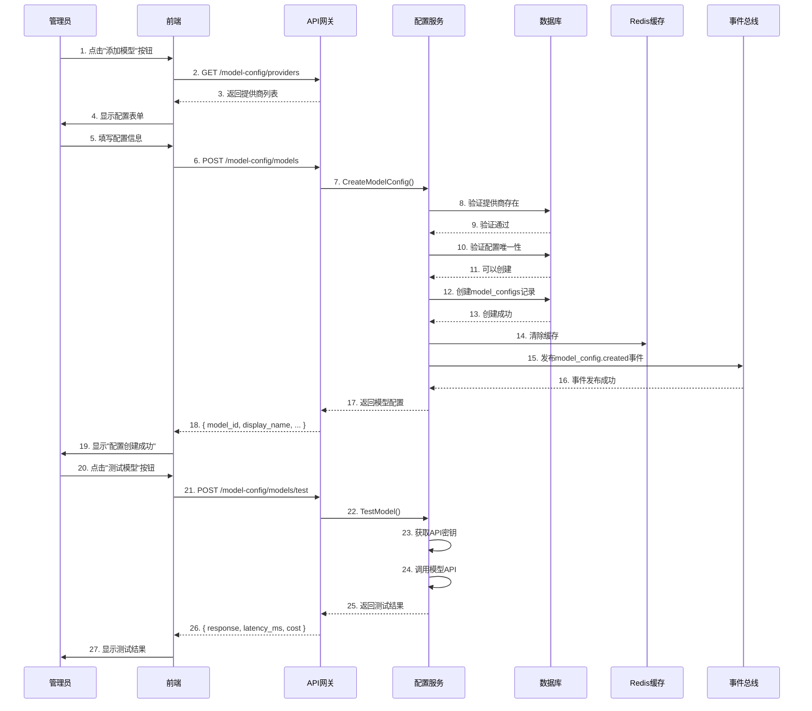
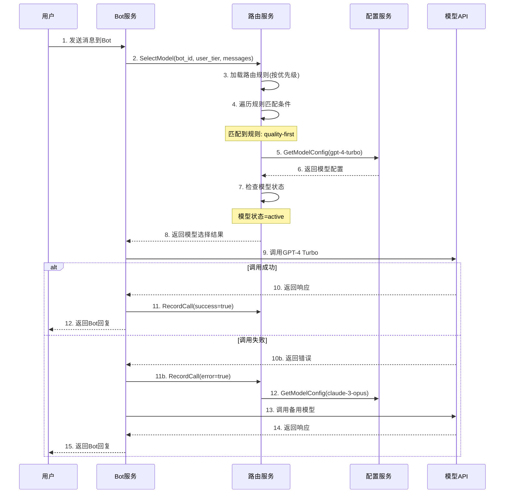
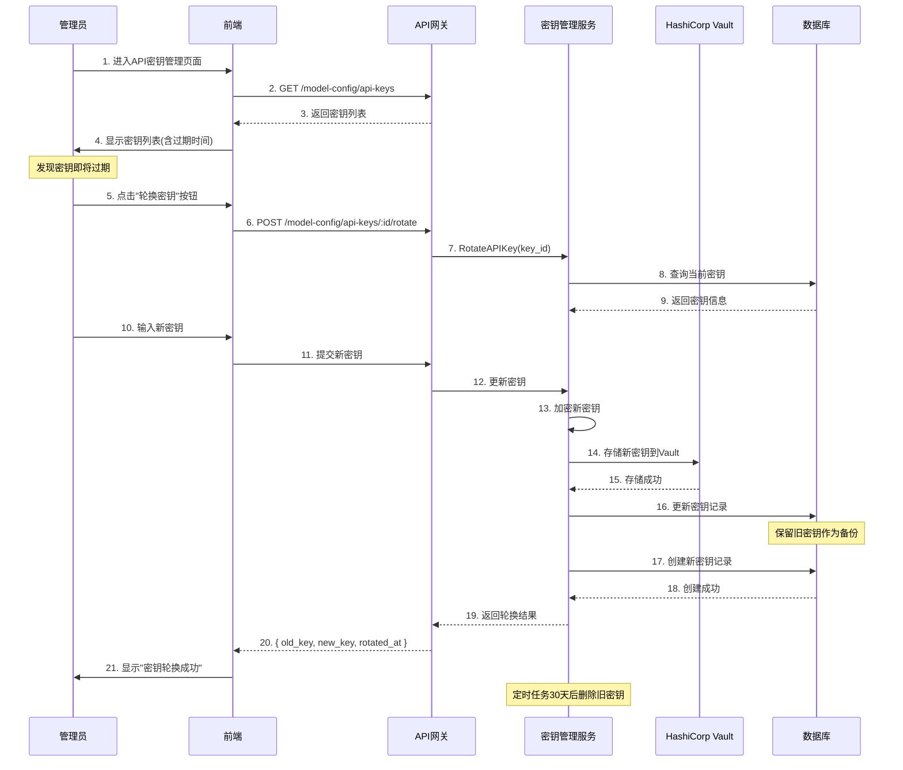

# 模型配置管理系统 详细设计说明书

**文档编号**: DE-DD-2025-032
**模块名称**: 模型配置管理系统 (Model Configuration Management)
**版本**: v1.0.0
**创建日期**: 2025-12-30
**作者**: ZKER Enterprise Team

---

## 📋 文档说明

本文档详细设计**模型配置管理系统**,用于统一管理Coze Studio中所有AI模型的配置、密钥、参数和路由策略。

**核心设计理念**:
- 🔐 **安全优先**: API密钥加密存储、细粒度权限控制
- 🎯 **统一管理**: 所有模型配置集中管理、版本控制
- 🔄 **灵活路由**: 支持多模型、多提供商的智能路由
- 📊 **可观测性**: 完整的调用统计、性能监控、成本分析

---

## 1. 模块概述

### 1.1 功能定义

**模型配置管理系统** 通过**提供商管理** + **模型配置** + **智能路由** + **监控统计**,实现:
- 🔑 **API密钥管理**: 安全存储、加密保护、定期轮换
- ⚙️ **模型配置**: 参数配置、限流设置、成本控制
- 🎯 **智能路由**: 基于成本、性能、可用性的模型选择
- 📈 **监控统计**: 调用量统计、成本分析、性能监控
- 🔄 **版本管理**: 配置版本控制、快速回滚

### 1.2 核心价值

- **降低成本**: 通过智能路由选择最具性价比的模型
- **提高可用性**: 多模型备份,避免单点故障
- **简化配置**: 统一的配置界面,无需修改代码
- **安全合规**: 密钥加密存储,操作审计日志

### 1.3 业务场景

#### 场景1: 配置新的AI模型
```
管理员: 在配置界面添加OpenAI GPT-4模型
系统: 保存配置、加密存储API密钥
测试: 发送测试请求验证配置可用
生效: Bot可以使用新模型进行对话
```

#### 场景2: 智能模型路由
```
用户: 发送消息到Bot
系统: 根据路由策略选择模型
  - 简单查询 → GPT-3.5 Turbo (低成本)
  - 复杂推理 → GPT-4 (高质量)
  - 图片生成 → DALL-E 3 (专业模型)
Bot: 使用选定模型处理请求
```

#### 场景3: 模型故障切换
```
系统: 监控到GPT-4 API响应超时
自动: 切换到备用模型Claude 3.5 Sonnet
告警: 通知管理员GPT-4异常
恢复: GPT-4恢复后自动切回主模型
```

---

## 2. 系统架构设计

### 2.1 整体架构

```
┌─────────────────────────────────────────────────────────────┐
│                    前端展示层                                │
├─────────────────────────────────────────────────────────────┤
│  模型配置页面  │  密钥管理页面  │  监控统计页面  │  测试工具    │
└─────────────────────────────────────────────────────────────┘
                              ↓
┌─────────────────────────────────────────────────────────────┐
│                    应用服务层                                │
├─────────────────────────────────────────────────────────────┤
│  ModelConfigService  │  ModelRoutingService  │  KeyManager  │
│  ModelMonitorService │  ModelTestService     │  AuditLog    │
└─────────────────────────────────────────────────────────────┘
                              ↓
┌─────────────────────────────────────────────────────────────┐
│                    领域模型层                                │
├─────────────────────────────────────────────────────────────┤
│  Provider  │  ModelConfig  │  APIKey  │  RoutingRule        │
└─────────────────────────────────────────────────────────────┘
                              ↓
┌─────────────────────────────────────────────────────────────┐
│                    基础设施层                                │
├─────────────────────────────────────────────────────────────┤
│  MySQL (配置存储)  │  Redis (缓存)  │  Vault (密钥管理)      │
│  Prometheus (监控) │  Kafka (事件队列)                       │
└─────────────────────────────────────────────────────────────┘
```

### 2.2 核心领域模型

```typescript
// 模型提供商
interface Provider {
  id: string;
  name: string;
  display_name: string;
  type: 'openai' | 'anthropic' | 'azure' | 'google' | 'custom';
  base_url: string;
  documentation_url: string;
  status: 'active' | 'deprecated' | 'beta';
  supported_features: string[];
  created_at: Date;
  updated_at: Date;
}

// 模型配置
interface ModelConfig {
  id: string;
  provider_id: string;
  model_name: string;
  display_name: string;
  model_type: 'chat' | 'completion' | 'embedding' | 'image' | 'speech';
  capabilities: {
    max_tokens: number;
    context_length: number;
    streaming: boolean;
    function_calling: boolean;
    vision: boolean;
  };
  pricing: {
    input_price_per_1k_tokens: number;
    output_price_per_1k_tokens: number;
    currency: string;
  };
  parameters: {
    temperature?: { min: number; max: number; default: number };
    top_p?: { min: number; max: number; default: number };
    max_tokens?: { max: number; default: number };
  };
  status: 'active' | 'inactive' | 'deprecated';
  created_at: Date;
  updated_at: Date;
}

// API密钥
interface APIKey {
  id: string;
  provider_id: string;
  name: string;
  key_hash: string;           // 加密后的密钥
  key_preview: string;        // 密钥预览(sk-xxxxxxxx)
  is_active: boolean;
  quota_limit?: number;       // 配额限制
  quota_used: number;         // 已使用配额
  quota_reset_at: Date;       // 配额重置时间
  last_used_at?: Date;
  expires_at?: Date;
  created_by: string;
  created_at: Date;
  revoked_at?: Date;
}

// 路由规则
interface RoutingRule {
  id: string;
  name: string;
  description: string;
  priority: number;           // 优先级(数字越小优先级越高)
  conditions: {
    bot_id?: string[];        // 指定Bot
    user_tier?: string[];     // 用户层级(free/pro/enterprise)
    conversation_type?: string[];
    complexity?: 'simple' | 'medium' | 'complex';
    estimated_tokens?: { min: number; max: number };
  };
  model_selection: {
    primary_model: string;    // 主模型ID
    fallback_models: string[]; // 备用模型列表
    selection_strategy: 'cost' | 'quality' | 'speed' | 'custom';
  };
  rate_limits: {
    max_requests_per_minute?: number;
    max_tokens_per_minute?: number;
  };
  is_active: boolean;
  created_at: Date;
  updated_at: Date;
}

// 调用记录
interface ModelCallLog {
  id: string;
  conversation_id: string;
  message_id: string;
  bot_id: string;
  user_id: string;
  provider_id: string;
  model_id: string;
  model_name: string;
  request_type: 'chat' | 'completion' | 'embedding' | 'image';
  input_tokens: number;
  output_tokens: number;
  total_tokens: number;
  cost: number;
  latency_ms: number;
  status: 'success' | 'error';
  error_message?: string;
  started_at: Date;
  completed_at: Date;
}
```

---

## 3. 数据库设计

### 3.1 ER图

```
┌──────────────┐
│  Providers   │
│--------------│
│ id (PK)      │───┐
│ name         │   │
│ type         │   │
│ base_url     │   │
│ status       │   │
└──────────────┘   │
                   │
                   │ 1:N
                   │
┌──────────────┐   │     ┌──────────────┐
│ ModelConfigs │←──┘     │  APIKeys     │
│--------------│         │--------------│
│ id (PK)      │         │ id (PK)      │
│ provider_id  │→───────│ provider_id  │
│ model_name   │  1:N   │ key_hash     │
│ model_type   │         │ is_active    │
│ pricing      │         │ quota_used   │
│ status       │         └──────────────┘
└──────────────┘
       │
       │ 1:N
       │
       ↓
┌──────────────┐     ┌──────────────┐
│ RoutingRules │     │ModelCallLogs │
│--------------│     │--------------│
│ id (PK)      │     │ id (PK)      │
│ primary_model│←────│ model_id     │
│ fallback_md  │     │ conversation_│
│ priority     │     │ cost         │
│ is_active    │     │ latency_ms   │
└──────────────┘     │ status       │
                     └──────────────┘
```

### 3.2 表结构设计

#### 3.2.1 providers (模型提供商表)

```sql
CREATE TABLE providers (
    id VARCHAR(64) PRIMARY KEY COMMENT '提供商ID',
    name VARCHAR(100) NOT NULL COMMENT '提供商名称',
    display_name VARCHAR(100) NOT NULL COMMENT '显示名称',
    type ENUM('openai', 'anthropic', 'azure', 'google', 'coze', 'custom') NOT NULL COMMENT '提供商类型',
    base_url VARCHAR(500) NOT NULL COMMENT 'API基础URL',
    documentation_url VARCHAR(500) COMMENT '文档URL',
    status ENUM('active', 'deprecated', 'beta') DEFAULT 'active' COMMENT '状态',
    supported_features JSON COMMENT '支持的功能列表',
    config_schema JSON COMMENT '配置Schema',
    created_at DATETIME NOT NULL DEFAULT CURRENT_TIMESTAMP COMMENT '创建时间',
    updated_at DATETIME NOT NULL DEFAULT CURRENT_TIMESTAMP ON UPDATE CURRENT_TIMESTAMP COMMENT '更新时间',

    UNIQUE KEY uk_name (name),
    INDEX idx_type (type),
    INDEX idx_status (status)
) ENGINE=InnoDB DEFAULT CHARSET=utf8mb4 COMMENT='模型提供商表';
```

**初始数据**:

```sql
INSERT INTO providers (id, name, display_name, type, base_url, status, supported_features) VALUES
('openai', 'openai', 'OpenAI', 'openai', 'https://api.openai.com/v1', 'active',
 JSON_ARRAY('chat', 'completion', 'embedding', 'image', 'speech')),
('anthropic', 'anthropic', 'Anthropic', 'anthropic', 'https://api.anthropic.com/v1', 'active',
 JSON_ARRAY('chat', 'completion')),
('azure', 'azure_openai', 'Azure OpenAI', 'azure', 'https://{resource}.openai.azure.com/openai/deployments/{deployment}', 'active',
 JSON_ARRAY('chat', 'completion', 'embedding')),
('google', 'google', 'Google AI', 'google', 'https://generativelanguage.googleapis.com/v1', 'beta',
 JSON_ARRAY('chat', 'embedding')),
('coze', 'coze', 'Coze AI', 'coze', 'https://api.coze.com/v1', 'active',
 JSON_ARRAY('chat', 'workflow'));
```

#### 3.2.2 model_configs (模型配置表)

```sql
CREATE TABLE model_configs (
    id VARCHAR(64) PRIMARY KEY COMMENT '模型配置ID',
    provider_id VARCHAR(64) NOT NULL COMMENT '提供商ID',
    model_name VARCHAR(100) NOT NULL COMMENT '模型名称',
    display_name VARCHAR(100) NOT NULL COMMENT '显示名称',
    model_type ENUM('chat', 'completion', 'embedding', 'image', 'speech') NOT NULL COMMENT '模型类型',
    capabilities JSON COMMENT '模型能力',
    pricing JSON COMMENT '定价信息',
    parameters JSON COMMENT '参数配置',
    status ENUM('active', 'inactive', 'deprecated') DEFAULT 'active' COMMENT '状态',
    is_default BOOLEAN DEFAULT FALSE COMMENT '是否为默认模型',
    version VARCHAR(20) COMMENT '模型版本',
    created_at DATETIME NOT NULL DEFAULT CURRENT_TIMESTAMP COMMENT '创建时间',
    updated_at DATETIME NOT NULL DEFAULT CURRENT_TIMESTAMP ON UPDATE CURRENT_TIMESTAMP COMMENT '更新时间',

    UNIQUE KEY uk_provider_model (provider_id, model_name),
    INDEX idx_type (model_type),
    INDEX idx_status (status),
    FOREIGN KEY (provider_id) REFERENCES providers(id) ON DELETE CASCADE
) ENGINE=InnoDB DEFAULT CHARSET=utf8mb4 COMMENT='模型配置表';
```

**初始数据**:

```sql
INSERT INTO model_configs (id, provider_id, model_name, display_name, model_type, capabilities, pricing, parameters, is_default) VALUES
-- OpenAI Models
('gpt-4-turbo', 'openai', 'gpt-4-turbo-preview', 'GPT-4 Turbo', 'chat',
 JSON_OBJECT('max_tokens', 128000, 'context_length', 128000, 'streaming', true, 'function_calling', true, 'vision', true),
 JSON_OBJECT('input_price_per_1k_tokens', 0.01, 'output_price_per_1k_tokens', 0.03, 'currency', 'USD'),
 JSON_OBJECT('temperature', JSON_OBJECT('min', 0, 'max', 2, 'default', 0.7), 'max_tokens', JSON_OBJECT('max', 4096, 'default', 2048)),
 false),

('gpt-3.5-turbo', 'openai', 'gpt-3.5-turbo', 'GPT-3.5 Turbo', 'chat',
 JSON_OBJECT('max_tokens', 4096, 'context_length', 16385, 'streaming', true, 'function_calling', true),
 JSON_OBJECT('input_price_per_1k_tokens', 0.0005, 'output_price_per_1k_tokens', 0.0015, 'currency', 'USD'),
 JSON_OBJECT('temperature', JSON_OBJECT('min', 0, 'max', 2, 'default', 0.7), 'max_tokens', JSON_OBJECT('max', 4096, 'default', 2048)),
 true),

-- Anthropic Models
('claude-3-opus', 'anthropic', 'claude-3-opus-20240229', 'Claude 3 Opus', 'chat',
 JSON_OBJECT('max_tokens', 4096, 'context_length', 200000, 'streaming', true, 'vision', true),
 JSON_OBJECT('input_price_per_1k_tokens', 0.015, 'output_price_per_1k_tokens', 0.075, 'currency', 'USD'),
 JSON_OBJECT('temperature', JSON_OBJECT('min', 0, 'max', 1, 'default', 0.7), 'max_tokens', JSON_OBJECT('max', 4096, 'default', 4096)),
 false),

('claude-3-sonnet', 'anthropic', 'claude-3-sonnet-20240229', 'Claude 3 Sonnet', 'chat',
 JSON_OBJECT('max_tokens', 4096, 'context_length', 200000, 'streaming', true, 'vision', true),
 JSON_OBJECT('input_price_per_1k_tokens', 0.003, 'output_price_per_1k_tokens', 0.015, 'currency', 'USD'),
 JSON_OBJECT('temperature', JSON_OBJECT('min', 0, 'max', 1, 'default', 0.7), 'max_tokens', JSON_OBJECT('max', 4096, 'default', 4096)),
 false),

-- Embedding Models
('text-embedding-3-small', 'openai', 'text-embedding-3-small', 'Text Embedding 3 Small', 'embedding',
 JSON_OBJECT('max_tokens', 8191, 'context_length', 8191, 'embedding_dimension', 1536),
 JSON_OBJECT('input_price_per_1k_tokens', 0.00002, 'output_price_per_1k_tokens', 0, 'currency', 'USD'),
 JSON_NULL,
 true),

('text-embedding-3-large', 'openai', 'text-embedding-3-large', 'Text Embedding 3 Large', 'embedding',
 JSON_OBJECT('max_tokens', 8191, 'context_length', 8191, 'embedding_dimension', 3072),
 JSON_OBJECT('input_price_per_1k_tokens', 0.00013, 'output_price_per_1k_tokens', 0, 'currency', 'USD'),
 JSON_NULL,
 false);
```

#### 3.2.3 api_keys (API密钥表)

```sql
CREATE TABLE api_keys (
    id BIGINT PRIMARY KEY AUTO_INCREMENT COMMENT '密钥ID',
    provider_id VARCHAR(64) NOT NULL COMMENT '提供商ID',
    name VARCHAR(100) NOT NULL COMMENT '密钥名称',
    key_hash VARCHAR(255) NOT NULL COMMENT '加密后的密钥',
    key_preview VARCHAR(50) NOT NULL COMMENT '密钥预览',
    is_active BOOLEAN DEFAULT TRUE COMMENT '是否激活',
    quota_limit BIGINT COMMENT '配额限制',
    quota_used BIGINT DEFAULT 0 COMMENT '已使用配额',
    quota_reset_at DATETIME COMMENT '配额重置时间',
    last_used_at DATETIME COMMENT '最后使用时间',
    expires_at DATETIME COMMENT '过期时间',
    priority INT DEFAULT 0 COMMENT '优先级(数字越大优先级越高)',
    created_by VARCHAR(64) NOT NULL COMMENT '创建人',
    created_at DATETIME NOT NULL DEFAULT CURRENT_TIMESTAMP COMMENT '创建时间',
    updated_at DATETIME NOT NULL DEFAULT CURRENT_TIMESTAMP ON UPDATE CURRENT_TIMESTAMP COMMENT '更新时间',
    revoked_at DATETIME COMMENT '撤销时间',

    UNIQUE KEY uk_provider_name (provider_id, name),
    INDEX idx_provider (provider_id),
    INDEX idx_active (is_active, revoked_at),
    INDEX idx_expires (expires_at),
    FOREIGN KEY (provider_id) REFERENCES providers(id) ON DELETE CASCADE
) ENGINE=InnoDB DEFAULT CHARSET=utf8mb4 COMMENT='API密钥表';
```

**安全设计**:
- `key_hash`: 使用AES-256加密存储完整密钥
- `key_preview`: 存储前8个字符,用于识别(sk-xxxxxxxx)
- 密钥永不在日志、错误信息中明文显示

#### 3.2.4 routing_rules (路由规则表)

```sql
CREATE TABLE routing_rules (
    id VARCHAR(64) PRIMARY KEY COMMENT '规则ID',
    name VARCHAR(100) NOT NULL COMMENT '规则名称',
    description TEXT COMMENT '规则描述',
    priority INT NOT NULL COMMENT '优先级',
    conditions JSON COMMENT '匹配条件',
    model_selection JSON COMMENT '模型选择策略',
    rate_limits JSON COMMENT '速率限制',
    is_active BOOLEAN DEFAULT TRUE COMMENT '是否激活',
    created_at DATETIME NOT NULL DEFAULT CURRENT_TIMESTAMP COMMENT '创建时间',
    updated_at DATETIME NOT NULL DEFAULT CURRENT_TIMESTAMP ON UPDATE CURRENT_TIMESTAMP COMMENT '更新时间',

    INDEX idx_priority (priority),
    INDEX idx_active (is_active)
) ENGINE=InnoDB DEFAULT CHARSET=utf8mb4 COMMENT='路由规则表';
```

**示例数据**:

```sql
INSERT INTO routing_rules (id, name, priority, conditions, model_selection, is_active) VALUES
('cost-optimization', '成本优化路由', 100,
 JSON_OBJECT('complexity', 'simple'),
 JSON_OBJECT('primary_model', 'gpt-3.5-turbo', 'fallback_models', JSON_ARRAY('claude-3-haiku'), 'selection_strategy', 'cost'),
 true),

('quality-first', '质量优先路由', 50,
 JSON_OBJECT('complexity', 'complex'),
 JSON_OBJECT('primary_model', 'gpt-4-turbo', 'fallback_models', JSON_ARRAY('claude-3-opus'), 'selection_strategy', 'quality'),
 true),

('pro-user-routing', 'Pro用户路由', 75,
 JSON_OBJECT('user_tier', JSON_ARRAY('pro', 'enterprise')),
 JSON_OBJECT('primary_model', 'gpt-4-turbo', 'fallback_models', JSON_ARRAY('gpt-3.5-turbo'), 'selection_strategy', 'quality'),
 true);
```

#### 3.2.5 model_call_logs (模型调用日志表)

```sql
CREATE TABLE model_call_logs (
    id BIGINT PRIMARY KEY AUTO_INCREMENT COMMENT '日志ID',
    conversation_id VARCHAR(64) NOT NULL COMMENT '对话ID',
    message_id VARCHAR(64) NOT NULL COMMENT '消息ID',
    bot_id VARCHAR(64) NOT NULL COMMENT 'Bot ID',
    user_id VARCHAR(64) NOT NULL COMMENT '用户ID',
    tenant_id VARCHAR(64) NOT NULL COMMENT '租户ID',
    provider_id VARCHAR(64) NOT NULL COMMENT '提供商ID',
    model_id VARCHAR(64) NOT NULL COMMENT '模型配置ID',
    model_name VARCHAR(100) NOT NULL COMMENT '模型名称',
    request_type ENUM('chat', 'completion', 'embedding', 'image', 'speech') NOT NULL COMMENT '请求类型',
    input_tokens INT DEFAULT 0 COMMENT '输入Token数',
    output_tokens INT DEFAULT 0 COMMENT '输出Token数',
    total_tokens INT NOT NULL COMMENT '总Token数',
    cost DECIMAL(10, 6) NOT NULL COMMENT '成本(美元)',
    latency_ms INT NOT NULL COMMENT '延迟(毫秒)',
    status ENUM('success', 'error', 'timeout') NOT NULL COMMENT '状态',
    error_code VARCHAR(50) COMMENT '错误码',
    error_message TEXT COMMENT '错误信息',
    started_at DATETIME NOT NULL COMMENT '开始时间',
    completed_at DATETIME NOT NULL COMMENT '完成时间',
    created_at DATETIME NOT NULL DEFAULT CURRENT_TIMESTAMP COMMENT '创建时间',

    INDEX idx_conversation (conversation_id),
    INDEX idx_bot_user (bot_id, user_id),
    INDEX idx_provider_model (provider_id, model_id),
    INDEX idx_started_at (started_at),
    INDEX idx_status (status)
) ENGINE=InnoDB DEFAULT CHARSET=utf8mb4 COMMENT='模型调用日志表';

-- 分区表(按月分区)
ALTER TABLE model_call_logs PARTITION BY RANGE (TO_DAYS(started_at)) (
    PARTITION p202501 VALUES LESS THAN (TO_DAYS('2025-02-01')),
    PARTITION p202502 VALUES LESS THAN (TO_DAYS('2025-03-01')),
    PARTITION p202503 VALUES LESS THAN (TO_DAYS('2025-04-01')),
    PARTITION p_future VALUES LESS THAN MAXVALUE
);
```

#### 3.2.6 model_test_results (模型测试结果表)

```sql
CREATE TABLE model_test_results (
    id BIGINT PRIMARY KEY AUTO_INCREMENT COMMENT '测试ID',
    bot_id VARCHAR(64) NOT NULL COMMENT 'Bot ID',
    model_id VARCHAR(64) NOT NULL COMMENT '模型配置ID',
    test_prompt TEXT NOT NULL COMMENT '测试提示词',
    test_response TEXT COMMENT '模型响应',
    input_tokens INT DEFAULT 0 COMMENT '输入Token数',
    output_tokens INT DEFAULT 0 COMMENT '输出Token数',
    latency_ms INT NOT NULL COMMENT '延迟(毫秒)',
    cost DECIMAL(10, 6) NOT NULL COMMENT '成本',
    status ENUM('success', 'error') NOT NULL COMMENT '状态',
    error_message TEXT COMMENT '错误信息',
    created_by VARCHAR(64) NOT NULL COMMENT '测试人',
    created_at DATETIME NOT NULL DEFAULT CURRENT_TIMESTAMP COMMENT '创建时间',

    INDEX idx_bot_model (bot_id, model_id),
    INDEX idx_created_at (created_at)
) ENGINE=InnoDB DEFAULT CHARSET=utf8mb4 COMMENT='模型测试结果表';
```

---

## 4. 后端服务设计

### 4.1 核心服务接口

#### 4.1.1 ModelConfigService (模型配置服务)

```go
package service

import (
    "context"
    "crypto/aes"
    "encoding/base64"
    "errors"
)

// ModelConfigService 模型配置服务
type ModelConfigService struct {
    db           *gorm.DB
    cache        *redis.Client
    vaultClient  *VaultClient
    eventBus     *EventBus
}

// ListProviders 获取提供商列表
func (s *ModelConfigService) ListProviders(ctx context.Context, req *ListProvidersRequest) ([]*Provider, error) {
    var providers []*Provider
    err := s.db.WithContext(ctx).
        Where("status = ?", req.Status).
        Find(&providers).Error
    if err != nil {
        return nil, err
    }
    return providers, nil
}

// CreateModelConfig 创建模型配置
func (s *ModelConfigService) CreateModelConfig(ctx context.Context, req *CreateModelConfigRequest) (*ModelConfig, error) {
    // 验证提供商存在
    var provider Provider
    err := s.db.WithContext(ctx).Where("id = ?", req.ProviderID).First(&provider).Error
    if err != nil {
        if errors.Is(err, gorm.ErrRecordNotFound) {
            return nil, ErrProviderNotFound
        }
        return nil, err
    }

    // 验证配置唯一性
    var count int64
    err = s.db.WithContext(ctx).
        Model(&ModelConfig{}).
        Where("provider_id = ? AND model_name = ?", req.ProviderID, req.ModelName).
        Count(&count).Error
    if err != nil {
        return nil, err
    }
    if count > 0 {
        return nil, ErrModelConfigAlreadyExists
    }

    // 创建配置
    config := &ModelConfig{
        ID:          generateID("model"),
        ProviderID:  req.ProviderID,
        ModelName:   req.ModelName,
        DisplayName: req.DisplayName,
        ModelType:   req.ModelType,
        Capabilities: req.Capabilities,
        Pricing:     req.Pricing,
        Parameters:  req.Parameters,
        Status:      "active",
    }

    err = s.db.WithContext(ctx).Create(config).Error
    if err != nil {
        return nil, err
    }

    // 清除缓存
    s.cache.Del(ctx, "model_configs:all")

    // 发布事件
    s.eventBus.Publish(ctx, "model_config.created", config)

    return config, nil
}

// GetModelConfig 获取模型配置
func (s *ModelConfigService) GetModelConfig(ctx context.Context, modelID string) (*ModelConfig, error) {
    // 先查缓存
    cacheKey := fmt.Sprintf("model_config:%s", modelID)
    cached, err := s.cache.Get(ctx, cacheKey)
    if err == nil && cached != nil {
        var config ModelConfig
        if err := json.Unmarshal(cached, &config); err == nil {
            return &config, nil
        }
    }

    // 查询数据库
    var config ModelConfig
    err = s.db.WithContext(ctx).Where("id = ?", modelID).First(&config).Error
    if err != nil {
        if errors.Is(err, gorm.ErrRecordNotFound) {
            return nil, ErrModelConfigNotFound
        }
        return nil, err
    }

    // 写入缓存
    data, _ := json.Marshal(config)
    s.cache.Set(ctx, cacheKey, data, 1*time.Hour)

    return &config, nil
}

// UpdateModelConfig 更新模型配置
func (s *ModelConfigService) UpdateModelConfig(ctx context.Context, modelID string, req *UpdateModelConfigRequest) (*ModelConfig, error) {
    var config ModelConfig
    err := s.db.WithContext(ctx).Where("id = ?", modelID).First(&config).Error
    if err != nil {
        if errors.Is(err, gorm.ErrRecordNotFound) {
            return nil, ErrModelConfigNotFound
        }
        return nil, err
    }

    // 更新字段
    if req.DisplayName != nil {
        config.DisplayName = *req.DisplayName
    }
    if req.Status != nil {
        config.Status = *req.Status
    }
    if req.Pricing != nil {
        config.Pricing = req.Pricing
    }
    if req.Parameters != nil {
        config.Parameters = req.Parameters
    }

    err = s.db.WithContext(ctx).Save(&config).Error
    if err != nil {
        return nil, err
    }

    // 清除缓存
    s.cache.Del(ctx, fmt.Sprintf("model_config:%s", modelID))
    s.cache.Del(ctx, "model_configs:all")

    return &config, nil
}

// DeleteModelConfig 删除模型配置
func (s *ModelConfigService) DeleteModelConfig(ctx context.Context, modelID string) error {
    // 检查是否为默认模型
    var config ModelConfig
    err := s.db.WithContext(ctx).Where("id = ?", modelID).First(&config).Error
    if err != nil {
        if errors.Is(err, gorm.ErrRecordNotFound) {
            return ErrModelConfigNotFound
        }
        return err
    }

    if config.IsDefault {
        return ErrCannotDeleteDefaultModel
    }

    // 删除配置
    err = s.db.WithContext(ctx).Delete(&config).Error
    if err != nil {
        return err
    }

    // 清除缓存
    s.cache.Del(ctx, fmt.Sprintf("model_config:%s", modelID))
    s.cache.Del(ctx, "model_configs:all")

    return nil
}
```

#### 4.1.2 APIKeyManager (API密钥管理服务)

```go
// APIKeyManager API密钥管理服务
type APIKeyManager struct {
    db          *gorm.DB
    vaultClient *VaultClient
    cache       *redis.Client
}

// CreateAPIKey 创建API密钥
func (m *APIKeyManager) CreateAPIKey(ctx context.Context, req *CreateAPIKeyRequest) (*APIKey, error) {
    // 验证提供商存在
    var provider Provider
    err := m.db.WithContext(ctx).Where("id = ?", req.ProviderID).First(&provider).Error
    if err != nil {
        return nil, ErrProviderNotFound
    }

    // 加密密钥
    encryptedKey, err := m.encryptKey(req.APIKey)
    if err != nil {
        return nil, err
    }

    // 生成预览
    preview := m.generateKeyPreview(req.APIKey)

    // 创建记录
    apiKey := &APIKey{
        ID:          generateID("key"),
        ProviderID:  req.ProviderID,
        Name:        req.Name,
        KeyHash:     encryptedKey,
        KeyPreview:  preview,
        IsActive:    true,
        QuotaLimit:  req.QuotaLimit,
        QuotaUsed:   0,
        QuotaResetAt: calculateNextResetTime(),
        Priority:    req.Priority,
        CreatedBy:   getUserIDFromContext(ctx),
    }

    err = m.db.WithContext(ctx).Create(apiKey).Error
    if err != nil {
        return nil, err
    }

    // 存储到Vault
    m.vaultClient.Store(ctx, fmt.Sprintf("api_keys/%s", apiKey.ID), req.APIKey)

    return apiKey, nil
}

// GetAPIKey 获取API密钥(用于API调用)
func (m *APIKeyManager) GetAPIKey(ctx context.Context, providerID string) (string, error) {
    // 查找激活的密钥
    var apiKey APIKey
    err := m.db.WithContext(ctx).
        Where("provider_id = ? AND is_active = true AND (revoked_at IS NULL OR revoked_at > NOW())", providerID).
        Order("priority DESC, last_used_at ASC").
        First(&apiKey).Error
    if err != nil {
        if errors.Is(err, gorm.ErrRecordNotFound) {
            return "", ErrNoActiveAPIKey
        }
        return "", err
    }

    // 检查配额
    if apiKey.QuotaLimit > 0 && apiKey.QuotaUsed >= apiKey.QuotaLimit {
        return "", ErrQuotaExceeded
    }

    // 检查是否过期
    if !apiKey.ExpiresAt.IsZero() && apiKey.ExpiresAt.Before(time.Now()) {
        return "", ErrAPIKeyExpired
    }

    // 从Vault获取密钥
    key, err := m.vaultClient.Retrieve(ctx, fmt.Sprintf("api_keys/%s", apiKey.ID))
    if err != nil {
        return "", err
    }

    // 更新使用记录
    m.db.WithContext(ctx).
        Model(&apiKey).
        Updates(map[string]interface{}{
            "last_used_at": time.Now(),
            "quota_used":   apiKey.QuotaUsed + 1,
        })

    return key, nil
}

// RevokeAPIKey 撤销API密钥
func (m *APIKeyManager) RevokeAPIKey(ctx context.Context, keyID string) error {
    return m.db.WithContext(ctx).
        Model(&APIKey{}).
        Where("id = ?", keyID).
        Update("revoked_at", time.Now()).Error
}

// encryptKey 加密密钥
func (m *APIKeyManager) encryptKey(apiKey string) (string, error) {
    block, err := aes.NewCipher([]byte(getEncryptionKey()))
    if err != nil {
        return "", err
    }

    gcm, err := cipher.NewGCM(block)
    if err != nil {
        return "", err
    }

    nonce := make([]byte, gcm.NonceSize())
    if _, err := io.ReadFull(rand.Reader, nonce); err != nil {
        return "", err
    }

    ciphertext := gcm.Seal(nonce, nonce, []byte(apiKey), nil)
    return base64.StdEncoding.EncodeToString(ciphertext), nil
}

// generateKeyPreview 生成密钥预览
func (m *APIKeyManager) generateKeyPreview(apiKey string) string {
    if len(apiKey) <= 8 {
        return apiKey
    }
    return apiKey[:8] + "..."
}
```

#### 4.1.3 ModelRoutingService (模型路由服务)

```go
// ModelRoutingService 模型路由服务
type ModelRoutingService struct {
    db              *gorm.DB
    configService   *ModelConfigService
    keyManager      *APIKeyManager
    monitorService  *ModelMonitorService
}

// SelectModel 选择模型
func (s *ModelRoutingService) SelectModel(ctx context.Context, req *ModelSelectionRequest) (*ModelSelection, error) {
    // 获取激活的路由规则
    var rules []*RoutingRule
    err := s.db.WithContext(ctx).
        Where("is_active = true").
        Order("priority ASC").
        Find(&rules).Error
    if err != nil {
        return nil, err
    }

    // 匹配规则
    for _, rule := range rules {
        if s.matchConditions(ctx, rule.Conditions, req) {
            // 选择主模型
            model, err := s.configService.GetModelConfig(ctx, rule.ModelSelection.PrimaryModel)
            if err != nil {
                // 主模型不可用,尝试备用模型
                for _, fallbackID := range rule.ModelSelection.FallbackModels {
                    model, err = s.configService.GetModelConfig(ctx, fallbackID)
                    if err == nil && model.Status == "active" {
                        break
                    }
                }
                if err != nil {
                    return nil, ErrNoAvailableModel
                }
            }

            return &ModelSelection{
                ModelID:         model.ID,
                ModelName:       model.ModelName,
                ProviderID:      model.ProviderID,
                SelectionReason: fmt.Sprintf("路由规则: %s", rule.Name),
                RuleID:          rule.ID,
            }, nil
        }
    }

    // 没有匹配的规则,使用默认模型
    var defaultModel ModelConfig
    err = s.db.WithContext(ctx).
        Where("model_type = ? AND is_default = true AND status = 'active'", req.ModelType).
        First(&defaultModel).Error
    if err != nil {
        return nil, ErrNoDefaultModel
    }

    return &ModelSelection{
        ModelID:         defaultModel.ID,
        ModelName:       defaultModel.ModelName,
        ProviderID:      defaultModel.ProviderID,
        SelectionReason: "默认模型",
    }, nil
}

// matchConditions 匹配路由条件
func (s *ModelRoutingService) matchConditions(ctx context.Context, conditions map[string]interface{}, req *ModelSelectionRequest) bool {
    // Bot ID匹配
    if botIDs, ok := conditions["bot_id"].([]interface{}); ok {
        found := false
        for _, id := range botIDs {
            if id.(string) == req.BotID {
                found = true
                break
            }
        }
        if !found {
            return false
        }
    }

    // 用户层级匹配
    if userTiers, ok := conditions["user_tier"].([]interface{}); ok {
        userTier := s.getUserTier(ctx, req.UserID)
        found := false
        for _, tier := range userTiers {
            if tier.(string) == userTier {
                found = true
                break
            }
        }
        if !found {
            return false
        }
    }

    // 复杂度匹配
    if complexity, ok := conditions["complexity"].(string); ok {
        estimatedComplexity := s.estimateComplexity(req.Messages)
        if !s.matchComplexity(estimatedComplexity, complexity) {
            return false
        }
    }

    return true
}

// estimateComplexity 估算对话复杂度
func (s *ModelRoutingService) estimateComplexity(messages []Message) string {
    totalTokens := 0
    for _, msg := range messages {
        totalTokens += estimateTokens(msg.Content)
    }

    if totalTokens < 500 {
        return "simple"
    } else if totalTokens < 2000 {
        return "medium"
    }
    return "complex"
}

// matchComplexity 匹配复杂度
func (s *ModelRoutingService) matchComplexity(actual, target string) bool {
    if target == actual {
        return true
    }
    // 可以添加更复杂的匹配逻辑
    return false
}
```

#### 4.1.4 ModelMonitorService (模型监控服务)

```go
// ModelMonitorService 模型监控服务
type ModelMonitorService struct {
    db         *gorm.DB
    prometheus *PrometheusClient
}

// RecordCall 记录模型调用
func (s *ModelMonitorService) RecordCall(ctx context.Context, req *RecordCallRequest) error {
    log := &ModelCallLog{
        ConversationID: req.ConversationID,
        MessageID:      req.MessageID,
        BotID:          req.BotID,
        UserID:         req.UserID,
        TenantID:       req.TenantID,
        ProviderID:     req.ProviderID,
        ModelID:        req.ModelID,
        ModelName:      req.ModelName,
        RequestType:    req.RequestType,
        InputTokens:    req.InputTokens,
        OutputTokens:   req.OutputTokens,
        TotalTokens:    req.InputTokens + req.OutputTokens,
        Cost:           req.Cost,
        LatencyMs:      req.LatencyMs,
        Status:         req.Status,
        StartedAt:      req.StartedAt,
        CompletedAt:    time.Now(),
    }

    if req.Status == "error" {
        log.ErrorCode = req.ErrorCode
        log.ErrorMessage = req.ErrorMessage
    }

    return s.db.WithContext(ctx).Create(log).Error
}

// GetModelStats 获取模型统计
func (s *ModelMonitorService) GetModelStats(ctx context.Context, req *GetModelStatsRequest) (*ModelStats, error) {
    var stats ModelStats

    // 调用量统计
    err := s.db.WithContext(ctx).
        Model(&ModelCallLog{}).
        Where("model_id = ? AND started_at >= ? AND started_at < ?",
            req.ModelID, req.StartDate, req.EndDate).
        Count(&stats.TotalCalls).Error
    if err != nil {
        return nil, err
    }

    // 成功率统计
    var successCount int64
    err = s.db.WithContext(ctx).
        Model(&ModelCallLog{}).
        Where("model_id = ? AND status = ? AND started_at >= ? AND started_at < ?",
            req.ModelID, "success", req.StartDate, req.EndDate).
        Count(&successCount).Error
    if err != nil {
        return nil, err
    }
    stats.SuccessRate = float64(successCount) / float64(stats.TotalCalls)

    // 平均延迟
    var avgLatency float64
    err = s.db.WithContext(ctx).
        Model(&ModelCallLog{}).
        Select("AVG(latency_ms)").
        Where("model_id = ? AND started_at >= ? AND started_at < ?",
            req.ModelID, req.StartDate, req.EndDate).
        Scan(&avgLatency).Error
    if err != nil {
        return nil, err
    }
    stats.AvgLatencyMs = avgLatency

    // 总成本和Token数
    err = s.db.WithContext(ctx).
        Model(&ModelCallLog{}).
        Select("SUM(cost), SUM(total_tokens)").
        Where("model_id = ? AND started_at >= ? AND started_at < ?",
            req.ModelID, req.StartDate, req.EndDate).
        Scan(&stats).Error
    if err != nil {
        return nil, err
    }

    return &stats, nil
}

// CheckModelHealth 检查模型健康状态
func (s *ModelMonitorService) CheckModelHealth(ctx context.Context, modelID string) (*ModelHealth, error) {
    // 获取最近5分钟的调用记录
    fiveMinutesAgo := time.Now().Add(-5 * time.Minute)

    var logs []ModelCallLog
    err := s.db.WithContext(ctx).
        Where("model_id = ? AND started_at >= ?", modelID, fiveMinutesAgo).
        Find(&logs).Error
    if err != nil {
        return nil, err
    }

    health := &ModelHealth{
        ModelID:    modelID,
        Status:     "healthy",
        CheckedAt:  time.Now(),
    }

    if len(logs) == 0 {
        return health, nil
    }

    // 计算错误率
    errorCount := 0
    totalLatency := 0
    for _, log := range logs {
        if log.Status != "success" {
            errorCount++
        }
        totalLatency += log.LatencyMs
    }

    errorRate := float64(errorCount) / float64(len(logs))
    avgLatency := float64(totalLatency) / float64(len(logs))

    health.ErrorRate = errorRate
    health.AvgLatencyMs = avgLatency
    health.TotalCalls = len(logs)

    // 判断健康状态
    if errorRate > 0.5 {
        health.Status = "unhealthy"
    } else if errorRate > 0.1 || avgLatency > 10000 {
        health.Status = "degraded"
    }

    return health, nil
}
```

### 4.2 API Handler (处理器)

```go
package handler

import (
    "context"
    "github.com/cloudwego/hertz/pkg/app"
)

// ModelConfigHandler 模型配置处理器
type ModelConfigHandler struct {
    configService  *ModelConfigService
    keyManager     *APIKeyManager
    routingService *ModelRoutingService
    monitorService *ModelMonitorService
}

// ListProviders 获取提供商列表
// @Summary      获取模型提供商列表
// @Description  获取所有可用的AI模型提供商
// @Tags         model_config
// @Accept       json
// @Produce      json
// @Param        status query string false "状态筛选"
// @Success      200  {object}  ProvidersResponse
// @Router       /model-config/providers [get]
func (h *ModelConfigHandler) ListProviders(ctx context.Context, c *app.RequestContext) {
    status := c.Query("status")
    if status == "" {
        status = "active"
    }

    providers, err := h.configService.ListProviders(ctx, &ListProvidersRequest{
        Status: status,
    })
    if err != nil {
        c.JSON(500, gin.H{"code": 50001, "message": "Internal server error"})
        return
    }

    c.JSON(200, gin.H{
        "code":    0,
        "message": "success",
        "data":    providers,
    })
}

// CreateModelConfig 创建模型配置
// @Summary      创建模型配置
// @Description  添加新的AI模型配置
// @Tags         model_config
// @Accept       json
// @Produce      json
// @Param        request body CreateModelConfigRequest true "配置信息"
// @Success      201  {object}  ModelConfigResponse
// @Failure      400  {object}  ErrorResponse
// @Failure      409  {object}  ErrorResponse
// @Router       /model-config/models [post]
func (h *ModelConfigHandler) CreateModelConfig(ctx context.Context, c *app.RequestContext) {
    var req CreateModelConfigRequest
    if err := c.BindAndValidate(&req); err != nil {
        c.JSON(400, NewBusinessError(40001, "Invalid request parameters"))
        return
    }

    config, err := h.configService.CreateModelConfig(ctx, &req)
    if err != nil {
        handleBusinessError(c, err)
        return
    }

    c.JSON(201, gin.H{
        "code":    0,
        "message": "Model config created",
        "data":    config,
    })
}

// TestModel 测试模型
// @Summary      测试模型
// @Description  发送测试请求验证模型配置
// @Tags         model_config
// @Accept       json
// @Produce      json
// @Param        request body TestModelRequest true "测试请求"
// @Success      200  {object}  TestModelResponse
// @Router       /model-config/models/test [post]
func (h *ModelConfigHandler) TestModel(ctx context.Context, c *app.RequestContext) {
    var req TestModelRequest
    if err := c.BindAndValidate(&req); err != nil {
        c.JSON(400, NewBusinessError(40001, "Invalid request parameters"))
        return
    }

    // 获取API密钥
    apiKey, err := h.keyManager.GetAPIKey(ctx, req.ProviderID)
    if err != nil {
        c.JSON(500, gin.H{"code": 50002, "message": "Failed to get API key"})
        return
    }

    // 调用模型API
    startTime := time.Now()
    response, err := h.callModelAPI(ctx, req.ProviderID, req.ModelName, apiKey, req.TestPrompt)
    latency := time.Since(startTime).Milliseconds()

    if err != nil {
        // 记录测试失败
        h.recordTestResult(ctx, &req, nil, err.Error(), latency)
        c.JSON(500, gin.H{
            "code":    50003,
            "message": "Model API call failed",
            "data": gin.H{
                "error": err.Error(),
            },
        })
        return
    }

    // 记录测试成功
    h.recordTestResult(ctx, &req, response, "", latency)

    c.JSON(200, gin.H{
        "code":    0,
        "message": "Test successful",
        "data": gin.H{
            "response":      response,
            "latency_ms":    latency,
            "input_tokens":  estimateTokens(req.TestPrompt),
            "output_tokens": estimateTokens(response),
            "cost":          calculateCost(req.ProviderID, req.ModelName,
                                   estimateTokens(req.TestPrompt),
                                   estimateTokens(response)),
        },
    })
}

// GetModelStats 获取模型统计
// @Summary      获取模型使用统计
// @Description  获取指定模型的调用统计和成本分析
// @Tags         model_config
// @Produce      json
// @Param        model_id query string true "模型ID"
// @Param        start_date query string true "开始日期"
// @Param        end_date query string true "结束日期"
// @Success      200  {object}  ModelStatsResponse
// @Router       /model-config/stats [get]
func (h *ModelConfigHandler) GetModelStats(ctx context.Context, c *app.RequestContext) {
    modelID := c.Query("model_id")
    startDate := c.Query("start_date")
    endDate := c.Query("end_date")

    stats, err := h.monitorService.GetModelStats(ctx, &GetModelStatsRequest{
        ModelID:   modelID,
        StartDate: startDate,
        EndDate:   endDate,
    })
    if err != nil {
        c.JSON(500, gin.H{"code": 50001, "message": "Failed to get stats"})
        return
    }

    c.JSON(200, gin.H{
        "code":    0,
        "message": "success",
        "data":    stats,
    })
}
```

---

## 5. 前端设计

### 5.1 页面结构

```
src/modules/model-config/
├── pages/
│   ├── ModelConfigListPage.tsx        # 模型配置列表页
│   ├── ModelConfigDetailPage.tsx      # 模型配置详情页
│   ├── APIKeyManagementPage.tsx        # API密钥管理页
│   ├── RoutingRulesPage.tsx           # 路由规则页面
│   └── ModelStatsPage.tsx             # 模型统计页面
├── components/
│   ├── ProviderCard.tsx               # 提供商卡片
│   ├── ModelConfigForm.tsx            # 模型配置表单
│   ├── APIKeyForm.tsx                 # API密钥表单
│   ├── ModelTestPanel.tsx             # 模型测试面板
│   ├── RoutingRuleEditor.tsx          # 路由规则编辑器
│   └── StatsChart.tsx                 # 统计图表
├── hooks/
│   ├── useModelConfig.ts              # 模型配置Hook
│   ├── useModelTest.ts                # 模型测试Hook
│   └── useModelStats.ts               # 模型统计Hook
└── api/
    └── modelConfigClient.ts           # API客户端
```

### 5.2 核心组件

#### 5.2.1 ModelConfigListPage (模型配置列表页)

```typescript
import { useState, useEffect } from 'react';
import { Table, Button, Modal, Tag, Space } from '@douyinfe/semi-ui';
import { modelConfigApi } from '../api/modelConfigClient';

const ModelConfigListPage: React.FC = () => {
  const [models, setModels] = useState<ModelConfig[]>([]);
  const [loading, setLoading] = useState(false);
  const [testModalVisible, setTestModalVisible] = useState(false);
  const [selectedModel, setSelectedModel] = useState<ModelConfig | null>(null);

  useEffect(() => {
    loadModels();
  }, []);

  const loadModels = async () => {
    setLoading(true);
    try {
      const data = await modelConfigApi.listModels();
      setModels(data);
    } catch (error) {
      Toast.error('加载模型配置失败');
    } finally {
      setLoading(false);
    }
  };

  const columns = [
    {
      title: '显示名称',
      dataIndex: 'display_name',
      render: (text: string, record: ModelConfig) => (
        <Space>
          <span>{text}</span>
          {record.is_default && <Tag color="blue">默认</Tag>}
        </Space>
      ),
    },
    {
      title: '提供商',
      dataIndex: 'provider_id',
      render: (providerId: string) => (
        <Tag>{getProviderDisplayName(providerId)}</Tag>
      ),
    },
    {
      title: '模型名称',
      dataIndex: 'model_name',
    },
    {
      title: '类型',
      dataIndex: 'model_type',
      render: (type: string) => <Tag>{getModelTypeName(type)}</Tag>,
    },
    {
      title: '输入价格',
      dataIndex: ['pricing', 'input_price_per_1k_tokens'],
      render: (price: number) => `$${price}/1K tokens`,
    },
    {
      title: '输出价格',
      dataIndex: ['pricing', 'output_price_per_1k_tokens'],
      render: (price: number) => `$${price}/1K tokens`,
    },
    {
      title: '状态',
      dataIndex: 'status',
      render: (status: string) => (
        <Tag color={status === 'active' ? 'green' : 'red'}>
          {status === 'active' ? '激活' : '停用'}
        </Tag>
      ),
    },
    {
      title: '操作',
      render: (_: unknown, record: ModelConfig) => (
        <Space>
          <Button
            type="primary"
            size="small"
            onClick={() => handleTest(record)}
          >
            测试
          </Button>
          <Button
            type="tertiary"
            size="small"
            onClick={() => handleEdit(record)}
          >
            编辑
          </Button>
          <Button
            type="danger"
            size="small"
            onClick={() => handleDelete(record)}
          >
            删除
          </Button>
        </Space>
      ),
    },
  ];

  const handleTest = (model: ModelConfig) => {
    setSelectedModel(model);
    setTestModalVisible(true);
  };

  return (
    <div className="model-config-list-page">
      <div className="page-header">
        <h1>模型配置管理</h1>
        <Button type="primary" onClick={() => {/* 创建配置 */}}>
          添加模型
        </Button>
      </div>

      <Table
        columns={columns}
        dataSource={models}
        loading={loading}
        rowKey="id"
        pagination={{ pageSize: 20 }}
      />

      {selectedModel && (
        <ModelTestPanel
          visible={testModalVisible}
          model={selectedModel}
          onClose={() => setTestModalVisible(false)}
        />
      )}
    </div>
  );
};

export default ModelConfigListPage;
```

#### 5.2.2 ModelTestPanel (模型测试面板)

```typescript
import { useState } from 'react';
import { Modal, Input, Button, Card, Spin, Typography, Space } from '@douyinfe/semi-ui';
import { modelConfigApi } from '../api/modelConfigClient';

interface ModelTestPanelProps {
  visible: boolean;
  model: ModelConfig;
  onClose: () => void;
}

const ModelTestPanel: React.FC<ModelTestPanelProps> = ({ visible, model, onClose }) => {
  const [testPrompt, setTestPrompt] = useState('你好,请介绍一下你自己');
  const [testing, setTesting] = useState(false);
  const [result, setResult] = useState<TestResult | null>(null);

  const handleTest = async () => {
    setTesting(true);
    setResult(null);

    try {
      const response = await modelConfigApi.testModel({
        provider_id: model.provider_id,
        model_name: model.model_name,
        test_prompt: testPrompt,
      });

      setResult(response);
      Toast.success('测试成功');
    } catch (error) {
      Toast.error('测试失败: ' + error.message);
    } finally {
      setTesting(false);
    }
  };

  return (
    <Modal
      title={`测试模型: ${model.display_name}`}
      visible={visible}
      onCancel={onClose}
      width={800}
      footer={null}
    >
      <Space vertical spacing="loose" style={{ width: '100%' }}>
        <Card title="测试输入">
          <Input.TextArea
            value={testPrompt}
            onChange={(e) => setTestPrompt(e.target.value)}
            rows={4}
            placeholder="输入测试提示词"
          />
          <Button
            type="primary"
            onClick={handleTest}
            loading={testing}
            style={{ marginTop: 16 }}
          >
            开始测试
          </Button>
        </Card>

        {testing && (
          <Card title="测试中...">
            <Spin size="large" />
            <Typography.Text>正在调用模型API...</Typography.Text>
          </Card>
        )}

        {result && (
          <Card title="测试结果">
            <Space vertical spacing="tight">
              <div>
                <Typography.Text strong>响应内容:</Typography.Text>
                <Typography.Paragraph>
                  {result.response}
                </Typography.Paragraph>
              </div>
              <div>
                <Typography.Text strong>输入Tokens:</Typography.Text>
                <Typography.Text> {result.input_tokens}</Typography.Text>
              </div>
              <div>
                <Typography.Text strong>输出Tokens:</Typography.Text>
                <Typography.Text> {result.output_tokens}</Typography.Text>
              </div>
              <div>
                <Typography.Text strong>延迟:</Typography.Text>
                <Typography.Text> {result.latency_ms}ms</Typography.Text>
              </div>
              <div>
                <Typography.Text strong>成本:</Typography.Text>
                <Typography.Text> ${result.cost.toFixed(6)}</Typography.Text>
              </div>
            </Space>
          </Card>
        )}
      </Space>
    </Modal>
  );
};

export default ModelTestPanel;
```

#### 5.2.3 APIKeyManagementPage (API密钥管理页)

```typescript
import { useState, useEffect } from 'react';
import { Table, Button, Modal, Form, Input, Tag, Space, Toast } from '@douyinfe/semi-ui';
import { modelConfigApi } from '../api/modelConfigClient';

const APIKeyManagementPage: React.FC = () => {
  const [keys, setKeys] = useState<APIKey[]>([]);
  const [modalVisible, setModalVisible] = useState(false);
  const [form] = Form.useForm();

  useEffect(() => {
    loadKeys();
  }, []);

  const loadKeys = async () => {
    try {
      const data = await modelConfigApi.listAPIKeys();
      setKeys(data);
    } catch (error) {
      Toast.error('加载密钥失败');
    }
  };

  const handleCreate = async (values: any) => {
    try {
      await modelConfigApi.createAPIKey(values);
      Toast.success('密钥创建成功');
      setModalVisible(false);
      loadKeys();
    } catch (error) {
      Toast.error('创建失败: ' + error.message);
    }
  };

  const columns = [
    {
      title: '名称',
      dataIndex: 'name',
    },
    {
      title: '提供商',
      dataIndex: 'provider_id',
      render: (id: string) => <Tag>{id}</Tag>,
    },
    {
      title: '密钥预览',
      dataIndex: 'key_preview',
      render: (preview: string) => (
        <Typography.Text code>{preview}</Typography.Text>
      ),
    },
    {
      title: '状态',
      dataIndex: 'is_active',
      render: (active: boolean, record: APIKey) => {
        if (!active) {
          return <Tag color="red">停用</Tag>;
        }
        if (record.revoked_at) {
          return <Tag color="orange">已撤销</Tag>;
        }
        return <Tag color="green">激活</Tag>;
      },
    },
    {
      title: '配额使用',
      render: (_: unknown, record: APIKey) => (
        <Space>
          <Typography.Text>
            {record.quota_used} / {record.quota_limit || '∞'}
          </Typography.Text>
          {record.quota_limit > 0 && (
            <div style={{ width: 100 }}>
              <Progress
                percent={(record.quota_used / record.quota_limit) * 100}
              />
            </div>
          )}
        </Space>
      ),
    },
    {
      title: '最后使用',
      dataIndex: 'last_used_at',
      render: (time: string) => time ? formatDateTime(time) : '-',
    },
    {
      title: '操作',
      render: (_: unknown, record: APIKey) => (
        <Space>
          {!record.revoked_at && record.is_active && (
            <Button
              type="danger"
              size="small"
              onClick={() => handleRevoke(record)}
            >
              撤销
            </Button>
          )}
        </Space>
      ),
    },
  ];

  return (
    <div className="api-key-management-page">
      <div className="page-header">
        <h1>API密钥管理</h1>
        <Button type="primary" onClick={() => setModalVisible(true)}>
          添加密钥
        </Button>
      </div>

      <Table columns={columns} dataSource={keys} rowKey="id" />

      <Modal
        title="添加API密钥"
        visible={modalVisible}
        onCancel={() => setModalVisible(false)}
        onOk={() => form.submit()}
      >
        <Form form={form} onFinish={handleCreate}>
          <Form.Item
            field="provider_id"
            label="提供商"
            rules={[{ required: true }]}
          >
            <Select placeholder="选择提供商">
              <Select.Option value="openai">OpenAI</Select.Option>
              <Select.Option value="anthropic">Anthropic</Select.Option>
              <Select.Option value="google">Google AI</Select.Option>
            </Select>
          </Form.Item>

          <Form.Item
            field="name"
            label="密钥名称"
            rules={[{ required: true }]}
          >
            <Input placeholder="例如: 生产环境密钥" />
          </Form.Item>

          <Form.Item
            field="api_key"
            label="API密钥"
            rules={[{ required: true }]}
          >
            <Input.Password placeholder="输入API密钥" />
          </Form.Item>

          <Form.Item
            field="quota_limit"
            label="配额限制"
          >
            <InputNumber placeholder="留空表示无限制" min={0} />
          </Form.Item>

          <Form.Item
            field="priority"
            label="优先级"
            initialValue={0}
          >
            <InputNumber min={0} max={100} />
            <Typography.Text type="secondary">
              数字越大优先级越高
            </Typography.Text>
          </Form.Item>
        </Form>
      </Modal>
    </div>
  );
};

export default APIKeyManagementPage;
```

### 5.3 API客户端

```typescript
// api/modelConfigClient.ts
import { apiClient } from '../api/client';

export interface ModelConfig {
  id: string;
  provider_id: string;
  model_name: string;
  display_name: string;
  model_type: 'chat' | 'completion' | 'embedding' | 'image' | 'speech';
  capabilities: any;
  pricing: {
    input_price_per_1k_tokens: number;
    output_price_per_1k_tokens: number;
    currency: string;
  };
  parameters: any;
  status: 'active' | 'inactive' | 'deprecated';
  is_default: boolean;
  created_at: string;
  updated_at: string;
}

export interface APIKey {
  id: string;
  provider_id: string;
  name: string;
  key_preview: string;
  is_active: boolean;
  quota_limit?: number;
  quota_used: number;
  last_used_at?: string;
  revoked_at?: string;
}

export const modelConfigApi = {
  // 获取提供商列表
  async listProviders(status?: string): Promise<any[]> {
    const response = await apiClient.get('/model-config/providers', {
      params: { status },
    });
    return response.data.data;
  },

  // 获取模型配置列表
  async listModels(): Promise<ModelConfig[]> {
    const response = await apiClient.get('/model-config/models');
    return response.data.data;
  },

  // 创建模型配置
  async createModelConfig(data: any): Promise<ModelConfig> {
    const response = await apiClient.post('/model-config/models', { data });
    return response.data.data;
  },

  // 更新模型配置
  async updateModelConfig(modelId: string, data: any): Promise<ModelConfig> {
    const response = await apiClient.patch(`/model-config/models/${modelId}`, {
      data,
    });
    return response.data.data;
  },

  // 删除模型配置
  async deleteModelConfig(modelId: string): Promise<void> {
    await apiClient.delete(`/model-config/models/${modelId}`);
  },

  // 测试模型
  async testModel(data: TestModelRequest): Promise<TestResult> {
    const response = await apiClient.post('/model-config/models/test', { data });
    return response.data.data;
  },

  // 获取API密钥列表
  async listAPIKeys(): Promise<APIKey[]> {
    const response = await apiClient.get('/model-config/api-keys');
    return response.data.data;
  },

  // 创建API密钥
  async createAPIKey(data: CreateAPIKeyRequest): Promise<APIKey> {
    const response = await apiClient.post('/model-config/api-keys', { data });
    return response.data.data;
  },

  // 撤销API密钥
  async revokeAPIKey(keyId: string): Promise<void> {
    await apiClient.post(`/model-config/api-keys/${keyId}/revoke`);
  },

  // 获取模型统计
  async getModelStats(params: {
    model_id: string;
    start_date: string;
    end_date: string;
  }): Promise<ModelStats> {
    const response = await apiClient.get('/model-config/stats', { params });
    return response.data.data;
  },

  // 获取路由规则列表
  async listRoutingRules(): Promise<RoutingRule[]> {
    const response = await apiClient.get('/model-config/routing-rules');
    return response.data.data;
  },

  // 创建路由规则
  async createRoutingRule(data: CreateRoutingRuleRequest): Promise<RoutingRule> {
    const response = await apiClient.post('/model-config/routing-rules', { data });
    return response.data.data;
  },
};
```

---

## 6. 业务流程设计

### 6.1 模型配置流程



### 6.2 模型路由流程



### 6.3 API密钥轮换流程



---

## 7. 安全设计

### 7.1 密钥加密存储

```go
// 密钥加密流程
1. 用户提供API密钥
2. 前端使用HTTPS传输
3. 后端接收密钥
4. 使用AES-256-GCM加密
5. 加密后的密钥存储到MySQL(key_hash字段)
6. 原始密钥存储到HashiCorp Vault
7. MySQL只存储加密哈希,无法还原
8. 使用时从Vault读取原始密钥

// 加密实现
func encryptAPIKey(plaintextKey string) (string, error) {
    key := []byte(getEncryptionKey()) // 从环境变量或KMS获取
    block, err := aes.NewCipher(key)
    if err != nil {
        return "", err
    }

    gcm, err := cipher.NewGCM(block)
    if err != nil {
        return "", err
    }

    nonce := make([]byte, gcm.NonceSize())
    if _, err := io.ReadFull(rand.Reader, nonce); err != nil {
        return "", err
    }

    ciphertext := gcm.Seal(nonce, nonce, []byte(plaintextKey), nil)
    return base64.StdEncoding.EncodeToString(ciphertext), nil
}

// Vault存储路径
// secret/data/api_keys/{key_id}
// {
//   "value": "sk-xxxxxxxxxxxxxxxx",
//   "created_at": "2025-12-30T10:00:00Z",
//   "created_by": "admin@example.com"
// }
```

### 7.2 权限控制

```yaml
权限矩阵:
  超级管理员:
    - 创建/编辑/删除所有模型配置
    - 创建/查看/撤销所有API密钥
    - 创建/编辑/删除路由规则
    - 查看所有统计数据
    - 导出配置

  管理员:
    - 创建/编辑模型配置
    - 查看自己创建的API密钥(部分遮蔽)
    - 创建路由规则
    - 查看统计数据

  开发者:
    - 查看模型配置(只读)
    - 查看API密钥(仅key_preview)
    - 测试模型
    - 查看使用统计

  只读用户:
    - 查看模型配置
    - 查看统计
```

### 7.3 审计日志

```sql
CREATE TABLE model_config_audit_logs (
    id BIGINT PRIMARY KEY AUTO_INCREMENT,
    user_id VARCHAR(64) NOT NULL,
    action VARCHAR(50) NOT NULL COMMENT '操作类型',
    resource_type VARCHAR(50) NOT NULL COMMENT '资源类型',
    resource_id VARCHAR(64) NOT NULL COMMENT '资源ID',
    old_value JSON COMMENT '旧值',
    new_value JSON COMMENT '新值',
    ip_address VARCHAR(50) NOT NULL,
    user_agent TEXT,
    created_at DATETIME NOT NULL DEFAULT CURRENT_TIMESTAMP,

    INDEX idx_user (user_id),
    INDEX idx_resource (resource_type, resource_id),
    INDEX idx_created_at (created_at)
) ENGINE=InnoDB DEFAULT CHARSET=utf8mb4 COMMENT='模型配置审计日志';

// 记录的操作类型
// - model_config.created
// - model_config.updated
// - model_config.deleted
// - api_key.created
// - api_key.revoked
// - api_key.rotated
// - routing_rule.created
// - routing_rule.updated
// - model.tested
```

---

## 8. 实施检查清单

### 8.1 数据库迁移

- [ ] 创建providers表并插入初始数据
- [ ] 创建model_configs表并插入常用模型
- [ ] 创建api_keys表
- [ ] 创建routing_rules表并插入默认规则
- [ ] 创建model_call_logs分区表
- [ ] 创建model_test_results表
- [ ] 创建model_config_audit_logs表
- [ ] 创建所有外键约束和索引

### 8.2 后端实现

- [ ] 实现ModelConfigService(模型配置CRUD)
- [ ] 实现APIKeyManager(密钥加密、存储、轮换)
- [ ] 实现ModelRoutingService(智能路由)
- [ ] 实现ModelMonitorService(监控统计)
- [ ] 实现API Handler(所有接口)
- [ ] 集成HashiCorp Vault
- [ ] 实现审计日志记录
- [ ] 编写单元测试(覆盖率>80%)

### 8.3 前端实现

- [ ] 实现ModelConfigListPage(配置列表页)
- [ ] 实现ModelConfigDetailPage(配置详情页)
- [ ] 实现APIKeyManagementPage(密钥管理页)
- [ ] 实现RoutingRulesPage(路由规则页)
- [ ] 实现ModelStatsPage(统计页面)
- [ ] 实现ModelTestPanel(测试面板)
- [ ] 实现API客户端(modelConfigClient)
- [ ] 编写组件单元测试

### 8.4 安全配置

- [ ] 配置HashiCorp Vault
- [ ] 生成加密密钥并存储到KMS
- [ ] 配置HTTPS/TLS
- [ ] 配置CORS策略
- [ ] 实现API密钥脱敏显示
- [ ] 配置审计日志保留策略(90天)

### 8.5 监控和告警

- [ ] 配置Prometheus指标采集
- [ ] 创建Grafana仪表板
- [ ] 配置告警规则(错误率>10%, 延迟>5s)
- [ ] 配置密钥过期告警(提前7天)
- [ ] 配置成本异常告警(日预算>100USD)

---

## 9. 附录

### 9.1 错误码参考

| 错误码 | 说明 |
|--------|------|
| 40001 | 请求参数错误 |
| 40101 | 未认证 |
| 40301 | 无权限 |
| 40401 | 提供商不存在 |
| 40402 | 模型配置不存在 |
| 40403 | API密钥不存在 |
| 40901 | 模型配置已存在 |
| 42201 | 模型配置验证失败 |
| 42202 | API密钥无效 |
| 50001 | 模型API调用失败 |
| 50002 | Vault存储失败 |
| 50003 | 无可用模型 |

### 9.2 配置示例

```yaml
# config/model_config.yaml
providers:
  openai:
    base_url: https://api.openai.com/v1
    models:
      - id: gpt-4-turbo
        name: gpt-4-turbo-preview
        type: chat
        pricing:
          input: 0.01
          output: 0.03
        parameters:
          temperature: { min: 0, max: 2, default: 0.7 }
          max_tokens: { max: 4096, default: 2048 }

  anthropic:
    base_url: https://api.anthropic.com/v1
    models:
      - id: claude-3-opus
        name: claude-3-opus-20240229
        type: chat
        pricing:
          input: 0.015
          output: 0.075

routing_rules:
  - name: cost-optimization
    priority: 100
    conditions:
      complexity: simple
    model_selection:
      primary: gpt-3.5-turbo
      fallback: [claude-3-haiku]
      strategy: cost

  - name: quality-first
    priority: 50
    conditions:
      complexity: complex
    model_selection:
      primary: gpt-4-turbo
      fallback: [claude-3-opus]
      strategy: quality
```

---

**文档版本历史**:
- v1.0.0 (2025-12-30): 初始版本,完整的模型配置管理系统设计
