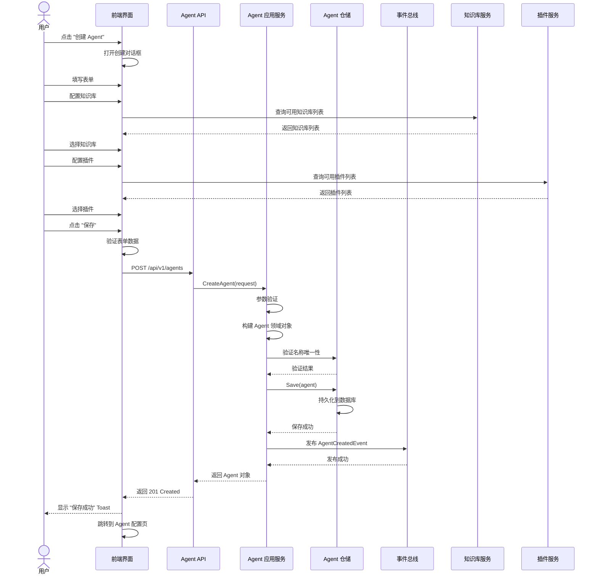
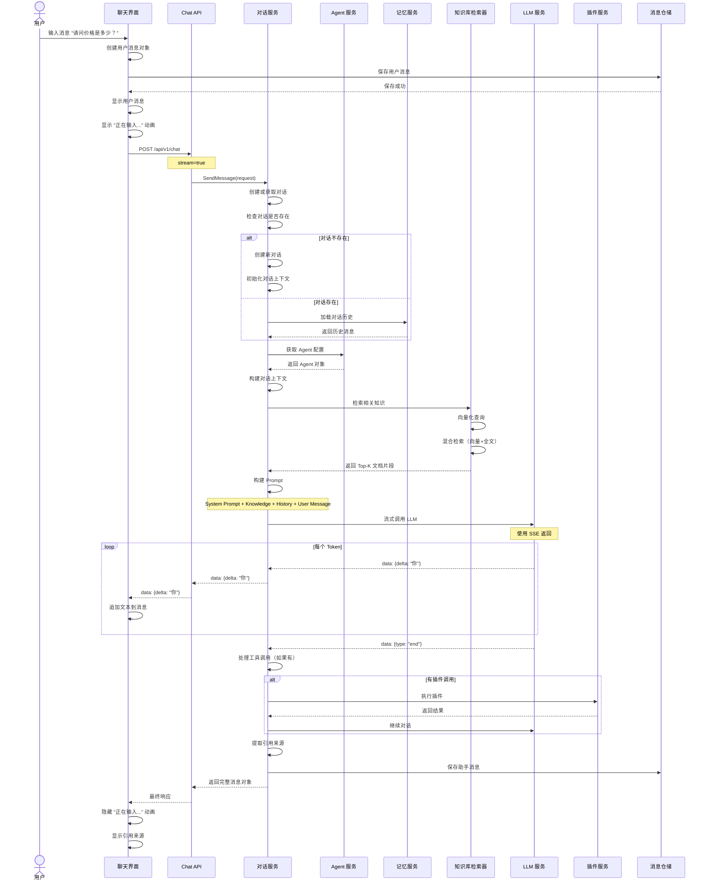

# 功能按钮级详细设计规范
# zker - UI 组件与交互细节

**文档版本：** v1.1
**最后更新：** 2025-12-25
**关联文档：** SRS、概要设计、详细设计

---

## 目录

1. [Agent 构建器按钮级设计](#1-agent-构建器按钮级设计)
2. [工作流编辑器按钮级设计](#2-工作流编辑器按钮级设计)
3. [知识库管理按钮级设计](#3-知识库管理按钮级设计)
4. [对话界面按钮级设计](#4-对话界面按钮级设计)
5. [插件管理按钮级设计](#5-插件管理按钮级设计)

---

## 1. Agent 构建器按钮级设计

### 1.1 Agent 配置页面

#### 页面布局与按钮分布

```
┌──────────────────────────────────────────────────────────────────┐
│ 🤖 zker        工作空间: MyWorkspace  👤 用户  🔔 通知  │ ← 顶部导航栏
├──────────────────────────────────────────────────────────────────┤
│ ← 返回    Agent 配置        [💾 保存草稿]  [🚀 发布]  [👁️ 预览]  │ ← 操作按钮栏
├──────────────────────────────────────────────────────────────────┤
│                                                                  │
│ ┌──────────────────────────────────────────────────────────────┐ │
│ │ 📝 基本信息                                                  │ │ ← 折叠面板
│ ├──────────────────────────────────────────────────────────────┤ │
│ │  名称: [客服助手                              ]  📷        │ │
│ │  描述: [智能客服机器人，可以回答产品相关问题  ]               │ │
│ │  头像: [选择图片]  [清除]                                   │ │
│ │                                      [🔍 高级设置 ▶]        │ │
│ └──────────────────────────────────────────────────────────────┘ │
│                                                                  │
│ ┌──────────────────────────────────────────────────────────────┐ │
│ │ 💬 提示词                                                    │ │
│ ├──────────────────────────────────────────────────────────────┤ │
│ │  系统提示词                                                 │ │
│ │  ┌────────────────────────────────────────────────────────┐  │ │
│ │  │ 你是一个专业的客服助手，负责回答用户关于产品的          │  │ │
│ │  │ 问题。请保持友好、专业的语气。                        │  │ │
│ │  │                                                       │  │ │
│ │  │                                                       │  │ │
│ │  │                                    [全屏] [清空] [重置]│  │ │ ← 编辑器工具栏
│ │  └────────────────────────────────────────────────────────┘  │ │
│ │  [📋 模板]  [🔍 变量]  [🎨 代码高亮]                       │ │
│ │                                                            │ │
│ │  开场白: [您好！我是智能客服助手，有什么可以帮助您的吗？]   │ │
│ │             [🔄 重新生成]  [🔊 试听]                        │ │
│ └──────────────────────────────────────────────────────────────┘ │
│                                                                  │
│ ┌──────────────────────────────────────────────────────────────┐ │
│ │ 🤖 模型配置                                                  │ │
│ ├──────────────────────────────────────────────────────────────┤ │
│ │  模型: [GPT-4 ▼]  [ℹ️ 参数说明]                             │ │
│ │  ┌─────────────┬──────────────┬──────────────┐              │ │
│ │  │ Temperature │ [0.7    ▲▼] │ [-2.0 ~ 2.0] │              │ │
│ │  ├─────────────┼──────────────┼──────────────┤              │ │
│ │  │ Max Tokens  │ [2048   ▲▼] │ [1 ~ 128K]   │              │ │
│ │  ├─────────────┼──────────────┼──────────────┤              │ │
│ │  │ Top P       │ [0.9    ▲▼] │ [0.0 ~ 1.0]   │              │ │
│ │  └─────────────┴──────────────┴──────────────┘              │ │
│ │  [⚙️ 高级参数 ▶]  [💾 保存为预设]  [📋 从预设加载]         │ │
│ └──────────────────────────────────────────────────────────────┘ │
│                                                                  │
│ ┌──────────────────────────────────────────────────────────────┐ │
│ │ 🔌 能力                                                      │ │
│ ├──────────────────────────────────────────────────────────────┤ │
│ │  ┌─────────────┐  ┌─────────────┐  ┌─────────────┐        │ │
│ │  │  📚 知识库   │  │  🔌 插件    │  │  ⚙️ 工作流   │        │ │
│ │  │  [+ 选择]   │  │  [+ 选择]   │  │  [+ 选择]   │        │ │
│ │  │  已选: 2    │  │  已选: 1    │  │  已选: 0    │        │ │
│ │  └─────────────┘  └─────────────┘  └─────────────┘        │ │
│ │  [📊 数据库]  [🎨 变量]  [🔐 隐私设置]                     │ │
│ └──────────────────────────────────────────────────────────────┘ │
│                                                                  │
│  [< 上一步]  [下一步 >]  [取消]  [保存并继续]                │ ← 分步导航
│                                                                  │
└──────────────────────────────────────────────────────────────────┘
```

### 1.2 按钮详细说明

#### 1.2.1 顶部导航栏按钮

**返回按钮**
```
位置: 左上角
图标: ← (左箭头)
文本: "返回"
样式: 次要按钮 (Secondary Button)
交互:
  - 点击: 返回到 Agent 列表页
  - 有未保存更改时: 显示确认对话框 "您有未保存的更改，确定要离开吗？"
    - [留在页面] [放弃更改]
状态:
  - 默认: 可用
  - 保存中: 禁用
快捷键: Esc (浏览器后退)
```

**保存草稿按钮**
```
位置: 右上角工具栏
图标: 💾 (软盘)
文本: "保存草稿"
样式: 主要按钮 (Primary Button)
颜色: 蓝色 (#1890FF)
交互:
  - 点击: 保存当前配置为草稿
    - 成功: Toast 提示 "保存成功" (2秒后自动消失)
    - 失败: Toast 提示 "保存失败: {错误信息}" (5秒后自动消失)
状态:
  - 默认: 可用
  - 无更改: 禁用 (灰色 #D9D9D9)
  - 保存中: 加载动画 (旋转的圆圈)
快捷键: Ctrl+S / Cmd+S
```

**发布按钮**
```
位置: 右上角工具栏
图标: 🚀 (火箭)
文本: "发布"
样式: 主要按钮 (Primary Button)
颜色: 绿色 (#52C41A)
交互:
  - 点击: 打开发布对话框
    对话框内容:
    ┌─────────────────────────────────┐
    │ 🚀 发布 Agent                    │
    ├─────────────────────────────────┤
    │ 版本号: [v1.0.0        ]        │
    │ 更新日志:                        │
    │ ┌─────────────────────────────┐ │
    │ │ 首次发布，包含基础客服功能  │ │
    │ │                             │ │
    │ └─────────────────────────────┘ │
    │                                 │
    │ [取消]  [确认发布]              │
    └─────────────────────────────────┘

    - 点击 [确认发布]:
      1. 验证配置完整性
      2. 生成版本号
      3. 发布到生产环境
      4. 成功: 显示发布成功对话框
         ┌─────────────────────────────────┐
         │ 🎉 发布成功！                     │
         │                                 │
         │ 公开链接:                        │
         │ https://coze.com/bot/bot_789    │
         │ [📋 复制] [🔗 访问]              │
         │                                 │
         │ 嵌入代码:                        │
         │ <iframe src="..."></iframe>     │
         │ [📋 复制代码]                    │
         │                                 │
         │ [完成]  [分享]                  │
         └─────────────────────────────────┘

    - 点击 [取消]: 关闭对话框
状态:
  - 草稿状态: 可用
  - 已发布: 文本变为 "更新"
  - 发布中: 禁用，显示加载动画
快捷键: Ctrl+Enter / Cmd+Enter
```

**预览按钮**
```
位置: 右上角工具栏
图标: 👁️ (眼睛)
文本: "预览"
样式: 次要按钮 (Secondary Button)
交互:
  - 点击: 在新标签页打开预览窗口
    - URL: /bot/{botId}/preview?mode=readonly
    - 显示: 与生产环境相同的界面
    - 功能: 可测试对话，但无法保存配置
状态:
  - 默认: 可用
  - 草稿且未保存: 禁用（提示"请先保存"）
快捷键: Ctrl+P / Cmd+P
```

#### 1.2.2 基本信息面板按钮

**头像上传按钮**
```
位置: 头像输入框右侧
图标: 📷 (相机)
样式: 图标按钮
交互:
  - 点击: 打开文件选择对话框
    - 接受格式: PNG, JPG, GIF, WEBP
    - 最大大小: 5MB
    - 选择后:
      1. 显示裁剪编辑器
      2. 上传到 MinIO
      3. 更新头像预览
  - 拖拽: 支持拖拽图片文件到按钮上
状态:
  - 默认: 可用
  - 上传中: 显示进度条
```

**清除头像按钮**
```
位置: 头像预览图下方
图标: 🗑️ (垃圾桶)
文本: "清除"
样式: 文本按钮 (Text Button)
交互:
  - 点击:
    1. 恢复为默认头像
    2. 确认对话框 "确定要清除自定义头像吗？"
       - [确认] [取消]
  - 悬停: 红色 (#FF4D4F)
状态:
  - 有自定义头像时: 可用
  - 默认头像时: 隐藏
```

**高级设置按钮**
```
位置: 名称输入框右侧
图标: ⚙️ (齿轮)
文本: "高级设置"
样式: 文本按钮
交互:
  - 点击: 展开高级选项面板
    ┌─────────────────────────────────┐
    │ ⚙️ 高级设置                      │
    ├─────────────────────────────────┤
    │ Agent ID: bot_789 (只读)        │
    │ 创建时间: 2025-12-25 10:00:00   │
    │ 更新时间: 2025-12-25 11:30:00   │
    │                                 │
    │ ⚠️ 危险操作                      │
    │ [🗑️ 删除 Agent]  [📋 导出配置]   │
    │ [📥 导入配置]  [🔄 重置为模板]    │
    └─────────────────────────────────┘
状态:
  - 默认: 折叠状态，显示 "▶"
  - 展开后: 显示 "▼"
```

#### 1.2.3 提示词编辑器按钮

**全屏按钮**
```
位置: 编辑器工具栏
图标: ⛶ (全屏)
样式: 图标按钮
交互:
  - 点击: 编辑器全屏显示
    - 遮罩层: 半透明黑色背景
    - 编辑器: 居中，宽度 80%，高度 90%
    - 退出: 按 Esc 或点击 "退出全屏" 按钮
状态:
  - 默认: 可用
  - 全屏时: 图标变为 ⛶ (退出全屏)
```

**清空按钮**
```
位置: 编辑器工具栏
图标: 🗑️ (垃圾桶)
文本: "清空"
样式: 图标按钮 + 工具提示
交互:
  - 点击: 清空编辑器内容
    - 确认对话框: "确定要清空内容吗？此操作不可撤销。"
      - [确认] [取消]
  - 悬停工具提示: "清空内容"
状态:
  - 有内容时: 可用
  - 空内容时: 禁用
```

**重置按钮**
```
位置: 编辑器工具栏
图标: 🔄 (循环箭头)
文本: "重置"
样式: 图标按钮
交互:
  - 点击: 重置为上一次保存的版本
    - 确认对话框: "确定要重置为上次保存的版本吗？当前未保存的更改将丢失。"
      - [确认] [取消]
  - 悬停工具提示: "重置为上次保存的版本"
状态:
  - 有未保存更改: 可用
  - 无更改: 禁用
```

**模板按钮**
```
位置: 编辑器下方工具栏
图标: 📋 (剪贴板)
文本: "模板"
样式: 文本按钮
交互:
  - 点击: 打开模板选择下拉菜单
    ┌─────────────────────────────────┐
    │ 📋 选择提示词模板                │
    ├─────────────────────────────────┤
    │ 💬 客服助手                      │
    │ 📝 文案写作                      │
    │ 💻 代码助手                      │
    │ 🎨 创意设计                      │
    │ 📊 数据分析                      │
    │ 🎓 教学辅导                      │
    │ 🌐 翻译助手                      │
    │ ────────────────────────────── │
    │ [➕ 管理自定义模板...]           │
    └─────────────────────────────────┘

    选择模板后:
    1. 替换编辑器内容
    2. 高亮显示可替换的变量（如 {{userName}}）
状态:
  - 默认: 可用
```

**变量按钮**
```
位置: 编辑器下方工具栏
图标: 🔍 (放大镜)
文本: "变量"
样式: 文本按钮
交互:
  - 点击: 打开变量插入对话框
    ┌─────────────────────────────────┐
    │ 🔍 插入变量                      │
    ├─────────────────────────────────┤
    │ 可用变量:                       │
    │ ┌─────────────────────────────┐ │
    │ │ {{userName}}  - 用户名      │ │
    │ │ {{userId}}    - 用户ID      │ │
    │ │ {{currentTime}} - 当前时间   │ │
    │ │ {{botName}}   - 机器人名称  │ │
    │ └─────────────────────────────┘ │
    │                                 │
    │ 搜索: [_______________] 🔍       │
    │                                 │
    │ [取消]  [插入]  [➕ 新建变量]   │
    └─────────────────────────────────┘

    插入后: 在光标位置插入 {{variableName}}
状态:
  - 默认: 可用
```

**重新生成按钮**
```
位置: 开场白输入框右侧
图标: 🔄 (循环箭头)
样式: 图标按钮
交互:
  - 点击: 使用 AI 重新生成开场白
    - 加载状态: 显示 3 秒的加载动画
    - 成功: 替换为新生成的开场白
    - 失败: Toast 提示 "生成失败，请重试"
  - 悬停工具提示: "AI 重新生成开场白"
状态:
  - 默认: 可用
  - 生成中: 禁用，显示加载动画
```

**试听按钮**
```
位置: 开场白输入框右侧
图标: 🔊 (扬声器)
样式: 图标按钮
交互:
  - 点击: 播放开场白的语音合成
    - 使用 TTS (Text-to-Speech) 引擎
    - 播放中: 图标变为 ⏸️ (暂停)
    - 再次点击: 暂停播放
  - 悬停工具提示: "试听开场白语音"
状态:
  - 默认: 可用
  - 播放中: 显示 ⏸️ 图标
```

#### 1.2.4 模型配置按钮

**参数说明按钮**
```
位置: 模型选择下拉框右侧
图标: ℹ️ (信息圆圈)
样式: 图标按钮
交互:
  - 点击: 打开参数说明侧边栏
    ┌─────────────────────────────────┐
    │ ℹ️ 模型参数说明                  │
    ├─────────────────────────────────┤
    │ Temperature                    │
    │ 控制输出的随机性。              │
    │ • 较低值（如 0.2）- 更确定、    │
    │   更聚焦的输出                  │
    │ • 较高值（如 0.8）- 更随机、    │
    │   更有创意的输出                │
    │                                 │
    │ Max Tokens                     │
    │ 生成的最大 Token 数。           │
    │                                 │
    │ Top P                          │
    │ 核采样概率阈值。                │
    │                                 │
    │ [关闭]                         │
    └─────────────────────────────────┘
状态:
  - 默认: 可用
```

**高级参数按钮**
```
位置: 参数设置区域下方
图标: ⚙️ (齿轮)
文本: "高级参数 ▶"
样式: 文本按钮（可折叠）
交互:
  - 点击: 展开高级参数面板
    ┌─────────────────────────────────┐
    │ ⚙️ 高级参数                      │
    ├─────────────────────────────────┤
    │ Frequency Penalty: [0.0 ▲▼]    │
    │ Presence Penalty:  [0.0 ▲▼]    │
    │                                 │
    │ Stop Sequences:                │
    │ [输入自定义停止序列...]         │
    │                                 │
    │ [保存为默认设置]  [恢复默认]    │
    └─────────────────────────────────┘
状态:
  - 默认: 折叠状态，显示 "▶"
  - 展开后: 显示 "▼"
```

**保存为预设按钮**
```
位置: 参数设置区域下方
图标: 💾 (软盘)
文本: "保存为预设"
样式: 次要按钮
交互:
  - 点击: 打开保存预设对话框
    ┌─────────────────────────────────┐
    │ 💾 保存模型配置预设              │
    ├─────────────────────────────────┤
    │ 预设名称: [____________]        │
    │ 描述:     [____________]        │
    │                                 │
    │ 预设列表:                       │
    │ ┌─────────────────────────────┐ │
    │ │ • GPT-4 创意写作模式         │ │
    │ │ • GPT-4 精确回答模式         │ │
    │ │ • Claude 3.5 编程模式        │ │
    │ └─────────────────────────────┘ │
    │                                 │
    │ [取消]  [保存]                  │
    └─────────────────────────────────┘
状态:
  - 默认: 可用
```

#### 1.2.5 能力选择按钮

**知识库选择按钮**
```
位置: "知识库" 卡片
文本: "+ 选择"
样式: 次要按钮（虚线边框）
交互:
  - 点击: 打开知识库选择对话框
    ┌──────────────────────────────────────┐
    │ 📚 选择知识库                         │
    ├──────────────────────────────────────┤
    │ 搜索: [_______________] 🔍           │
    │                                        │
    │ 可选知识库:                           │
    │ ☑ 产品手册 (2025-12-25 更新)          │
    │ ☐ FAQ 文档                            │
    │ ☑ 技术文档 (1024 个文档)              │
    │ ☐ 用户指南                             │
    │                                        │
    │ 已选: 2 个知识库                       │
    │                                        │
    │ [取消]  [确定]  [➕ 创建新知识库]      │
    └──────────────────────────────────────┘

    全选/取消全选按钮:
    - ☑ 全选 (全选当前页所有知识库)
    - ☐ 取消全选

    批量操作:
    - 选中后显示 [添加] 按钮
    - 点击 [添加]: 添加到 Agent 并关闭对话框
状态:
  - 默认: 显示 "+ 选择"
  - 已选择: 显示 "已选: X"
```

**插件选择按钮**
```
位置: "插件" 卡片
文本: "+ 选择"
样式: 次要按钮
交互:
  - 点击: 打开插件选择对话框
    ┌──────────────────────────────────────┐
    │ 🔌 选择插件                           │
    ├──────────────────────────────────────┤
    │ 分类: [全部 ▼] [搜索] [工具] [API]   │
    │                                        │
    │ 官方插件:                             │
    │ ☑ Google Search  🔒 需要配置          │
    │ ☐ Wikipedia Search                   │
    │ ☑ Calculator                          │
    │ ☐ Weather                             │
    │                                        │
    │ 自定义插件:                           │
    │ ☐ My Custom Plugin                    │
    │                                        │
    │ [取消]  [确定]  [➕ 创建新插件]        │
    └──────────────────────────────────────┘

    插件配置按钮 (🔧):
    - 点击: 打开插件配置对话框
      ┌──────────────────────────────────────┐
      │ 🔧 Google Search 配置                │
      ├──────────────────────────────────────┤
      │ API Key: [________________]  🔑       │
      │ Search Engine: [Google ▼]           │
      │ Results Limit: [10 ▲▼]              │
      │                                      │
      │ [测试连接]  [保存]  [取消]          │
      └──────────────────────────────────────┘
状态:
  - 未配置: 显示 🔒 图标，添加时提示配置
  - 已配置: 显示 ✅ 图标
```

#### 1.2.6 分步导航按钮

**上一步按钮**
```
位置: 页面底部左侧
文本: "< 上一步"
样式: 次要按钮
交互:
  - 点击: 返回到上一步配置页面
    - 第 1 步时: 禁用
    - 第 2-N 步时: 可用
状态:
  - 第 1 步: 禁用 (灰色)
  - 其他步骤: 可用
```

**下一步按钮**
```
位置: 页面底部右侧
文本: "下一步 >"
样式: 主要按钮
交互:
  - 点击: 进入下一步配置页面
    - 验证当前步骤必填项
    - 如果有错误: 高亮显示错误字段
    - 如果通过: 保存当前配置并进入下一步
状态:
  - 最后一步: 文本变为 "完成"
```

**保存并继续按钮**
```
位置: 页面底部中间
文本: "保存并继续"
样式: 文本按钮
交互:
  - 点击: 保存当前配置并进入下一步
    - 与"下一步"类似，但明确提示会保存
状态:
  - 有更改: 可用
  - 无更改: 隐藏
```

---

## 2. 工作流编辑器按钮级设计

### 2.1 工作流编辑页面布局

```
┌──────────────────────────────────────────────────────────────────┐
│ ⚡ Workflow: 订单处理    v1.0.0    [💾 保存]  [▶️ 执行]  [🐛 调试]│ ← 顶部工具栏
├────────┬─────────────────────────────────────────────────────────┤
│        │                                                          │
│ 节点   │                       画布                              │ ← 画布区
│ 面板   │                                                          │
│        │                    ┌─────┐                              │
│ ─────  │                    │开始 │                              │
│ 🔵 开始│                    └──┬──┘                              │
│ ⚪ 结束│                       │                                 │
│ 🔷 变量│                       ▼                                 │
│ 🔶 条件│              ┌──────────────┐                          │
│ 🔂 循环│              │  条件判断    │                          │
│ 🌐 API │              └──────┬───────┘                          │
│ 🤖 LLM │                     │                                  │
│ 🔌 插件│         ┌───────────┴───────────┐                     │
│ 💾 数据│         ▼                       ▼                     │
│ ⚙️ 代码│    ┌───────────┐           ┌───────────┐             │
│ 📝 文本│    │ API 调用   │           │   结束    │             │
│ 🔀 转换│    └───────────┘           └───────────┘             │
│        │                                                          │
│        │                     [缩放: 100% ▼]                      │ ← 缩放控制
│        │                     [适应画布] [放大] [缩小]            │
└────────┴─────────────────────────────────────────────────────────┘
┌──────────────────────────────────────────────────────────────────┐
│ 🔍 搜索节点: [____________]  [📋 复制]  [📋 粘贴]  [🗑️ 删除]    │ ← 底部工具栏
└──────────────────────────────────────────────────────────────────┘
┌──────────────────────────────────────────────────────────────────┐
│ ⚙️ 属性面板                                        [✕ 关闭]     │ ← 属性面板
├──────────────────────────────────────────────────────────────────┤
│ 节点: 条件判断                                            [ℹ️ 帮助]│
├──────────────────────────────────────────────────────────────────┤
│ 基本信息:                                                   │
│   节点名称: [判断金额                    ]                    │
│   描述:   [根据订单金额决定审批流程         ]                    │
│                                                            │
│ 条件配置:                                                   │
│   ┌──────────────────────────────────────────────────────┐   │
│   │ 条件 1:                                             │   │
│   │   变量: [workflow.input.amount ▼]                    │   │
│   │   操作符: [大于 ▼]                                  │   │
│   │   值: [1000          ]                             │   │
│   │   目标节点: [高级审批 ▼]                           │   │
│   │   [+ 添加条件]  [🗑️ 删除]                          │   │
│   └──────────────────────────────────────────────────────┘   │
│                                                            │
│   默认分支: [自动回复 ▼]                                 │
│                                                            │
│   [🧪 测试条件]  [✅ 应用]  [❌ 取消]                     │
└──────────────────────────────────────────────────────────────────┘
```

### 2.2 顶部工具栏按钮

**保存按钮**
```
位置: 顶部工具栏左侧
图标: 💾
文本: "保存"
样式: 主要按钮
快捷键: Ctrl+S
交互:
  - 点击: 保存工作流
    - 验证 DAG 结构（检查循环依赖）
    - 验证节点配置完整性
    - 成功: "保存成功" Toast
    - 失败: 显示验证错误列表
状态:
  - 有更改: 可用
  - 保存中: 加载动画
  - 无更改: 禁用
```

**执行按钮**
```
位置: 顶部工具栏
图标: ▶️ (播放)
文本: "执行"
样式: 成功按钮 (绿色)
快捷键: Ctrl+Enter
交互:
  - 点击: 执行工作流
    - 打开执行对话框
      ┌──────────────────────────────────────┐
      │ ▶️ 执行工作流                          │
      ├──────────────────────────────────────┤
      │ 执行模式:                            │
      │ ○ 同步执行  ● 异步执行               │
      │                                      │
      │ 输入数据:                            │
      │ {                                   │
      │   "userId": "123",                  │
      │   "query": "查询订单"                │
      │ }                                   │
      │ [📋 从历史选择]  [🧪 测试数据]       │
      │                                      │
      │ 超时时间: [30 秒 ▼]                  │
      │                                      │
      │ [取消]  [执行]                      │
      └──────────────────────────────────────┘

    - 同步执行: 等待执行完成，显示结果
    - 异步执行: 返回执行 ID，后台执行

    执行结果面板:
      ┌──────────────────────────────────────┐
      │ ✅ 执行成功                          │
      ├──────────────────────────────────────┤
      │ 执行时间: 5.23 秒                     │
      │ 执行节点: 8 个                        │
      │                                      │
      │ 输出:                                │
      │ {                                   │
      │   "result": "approved",             │
      │   "message": "审批通过"              │
      │ }                                   │
      │                                      │
      │ [📊 查看日志]  [🔄 重新执行]  [✕ 关闭]│
      └──────────────────────────────────────┘
状态:
  - 工作流有效: 可用
  - 工作流有错误: 禁用，提示"请先修复错误"
```

**调试按钮**
```
位置: 顶部工具栏
图标: 🐛 (Bug)
文本: "调试"
样式: 警告按钮 (橙色)
交互:
  - 点击: 进入调试模式
    - 打开调试面板（右侧边栏）
      ┌─────────────────────────────────┐
      │ 🐛 调试面板                      │
      ├─────────────────────────────────┤
      │ [⏮️ 暂停]  [⏭️ 下一步]  [⏹️ 停止]│
      │                                  │
      │ 执行状态: 运行中                  │
      │ 当前节点: API 调用                │
      │                                  │
      │ 变量监视:                         │
      │ ┌─────────────────────────────┐ │
      │ │ workflow.input.amount = 1500 │ │
      │ │ workflow.user.name = "张三"  │ │
      │ │ variable.approved = true     │ │
      │ └─────────────────────────────┘ │
      │                                  │
      │ 执行日志:                         │
      │ ┌─────────────────────────────┐ │
      │ │ [10:00:00] 开始节点           │ │
      │ │ [10:00:01] 条件判断: 金额>1000│ │
      │ │ [10:00:02] → 分支: 高级审批   │ │
      │ │ [10:00:03] API 调用: 调用中... │ │
      │ └─────────────────────────────┘ │
      │                                  │
      │ [📥 导出日志]  [🗑️ 清空]        │
      └─────────────────────────────────┘

    调试模式特性:
    - 断点调试: 点击节点设置断点
    - 单步执行: 逐个节点执行
    - 变量监视: 实时查看变量值
    - 日志输出: 详细的执行日志
状态:
  - 默认: 可用
  - 调试中: 变为"停止调试"按钮
```

### 2.3 节点面板按钮

**节点类型按钮**
```
位置: 节点面板
样式: 可拖拽的卡片
交互:
  - 拖拽: 拖拽节点到画布
  - 点击: 在画布中心添加节点
  - 右键: 显示上下文菜单
    ┌─────────────────┐
    │ ➕ 添加到画布    │
    │ ℹ️ 查看帮助      │
    │ 📋 复制节点类型  │
    └─────────────────┘
```

**搜索节点输入框**
```
位置: 节点面板顶部
占位符: "搜索节点..."
交互:
  - 输入: 实时过滤节点列表
  - Enter: 选中第一个匹配节点
  - Esc: 清空搜索
快捷键: Ctrl+F / Cmd+F
```

### 2.4 画布操作按钮

**适应画布按钮**
```
位置: 画布右下角
文本: "适应画布"
交互:
  - 点击: 自动缩放和平移，使所有节点可见
    - 居中显示
    - 自动计算合适的缩放比例
快捷键: Ctrl+0 / Cmd+0
```

**放大按钮**
```
位置: 缩放控制区域
图标: ➕ (加号)
交互:
  - 点击: 放大 10%
  - 按住: 连续放大
快捷键: Ctrl++ / Cmd++
```

**缩小按钮**
```
位置: 缩放控制区域
图标: ➖ (减号)
交互:
  - 点击: 缩小 10%
  - 按住: 连续缩小
快捷键: Ctrl+- / Cmd+-
```

**缩放下拉框**
```
位置: 缩放控制区域
选项: 25%, 50%, 75%, 100%, 125%, 150%, 200%
交互:
  - 选择: 设置为指定缩放比例
  - 自定义: 可输入 10% - 400%
```

### 2.5 底部工具栏按钮

**复制按钮**
```
位置: 底部工具栏
图标: 📋
文本: "复制"
快捷键: Ctrl+C / Cmd+C
交互:
  - 点击: 复制选中的节点到剪贴板
    - 如果未选中: 禁用
    - 如果选中: 复制节点和连线
状态:
  - 有选中节点: 可用
  - 无选中: 禁用
```

**粘贴按钮**
```
位置: 底部工具栏
图标: 📋
文本: "粘贴"
快捷键: Ctrl+V / Cmd+V
交互:
  - 点击: 从剪贴板粘贴节点
    - 自动调整位置，避免重叠
    - 生成新的节点 ID
状态:
  - 剪贴板有内容: 可用
  - 剪贴板为空: 禁用
```

**删除按钮**
```
位置: 底部工具栏
图标: 🗑️
文本: "删除"
快捷键: Delete / Backspace
交互:
  - 点击: 删除选中的节点和连线
    - 确认对话框: "确定要删除选中的 3 个节点吗？"
      - [确认] [取消]
    - 如果节点有依赖: 警告 "删除此节点将断开连线，是否继续？"
状态:
  - 有选中节点: 可用
  - 无选中: 禁用
```

**撤销按钮**
```
位置: 底部工具栏
图标: ↩️ (撤销)
快捷键: Ctrl+Z / Cmd+Z
交互:
  - 点击: 撤销上一步操作
    - 支持多级撤销（最多 50 步）
状态:
  - 有可撤销操作: 可用
  - 无可撤销操作: 禁用
```

**重做按钮**
```
位置: 底部工具栏
图标: ↪️ (重做)
快捷键: Ctrl+Shift+Z / Cmd+Shift+Z
交互:
  - 点击: 重做上一步撤销的操作
状态:
  - 有可重做操作: 可用
  - 无可重做操作: 禁用
```

**格式化按钮**
```
位置: 底部工具栏
文本: "格式化"
交互:
  - 点击: 自动排列节点布局
    - 使用 DAG 布局算法
    - 从左到右、从上到下排列
    - 自动美化连线（避免交叉）
```

**全选按钮**
```
位置: 底部工具栏
文本: "全选"
快捷键: Ctrl+A / Cmd+A
交互:
  - 点击: 选中画布上的所有节点
```

### 2.6 属性面板按钮

**关闭按钮**
```
位置: 属性面板右上角
图标: ✕
交互:
  - 点击: 关闭属性面板
```

**帮助按钮**
```
位置: 属性面板标题右侧
图标: ℹ️
交互:
  - 点击: 打开节点类型帮助文档
    - 显示节点说明
    - 使用示例
    - 配置教程
```

**应用按钮**
```
位置: 属性面板底部
样式: 主要按钮
文本: "✅ 应用"
交互:
  - 点击: 应用配置更改到节点
    - 验证配置
    - 成功: "配置已应用" Toast
    - 失败: 显示验证错误
```

**取消按钮**
```
位置: 属性面板底部
样式: 次要按钮
文本: "❌ 取消"
交互:
  - 点击: 放弃更改，恢复为上次保存的值
```

**测试条件按钮**
```
位置: 条件节点属性面板
图标: 🧪
文本: "测试条件"
交互:
  - 点击: 测试条件表达式
    ┌──────────────────────────────────────┐
    │ 🧪 测试条件                            │
    ├──────────────────────────────────────┤
    │ 条件: amount > 1000                   │
    │                                      │
    │ 测试数据:                            │
    │ ┌────────────────────────────────┐  │
    │ amount = 1500                       │  │
    │ result = true                      │  │
    │ └────────────────────────────────┘  │
    │                                      │
    │ 输入测试数据: [1500]  [测试]         │
    │                                      │
    │ [关闭]                               │
    └──────────────────────────────────────┘
```

---

## 3. 知识库管理按钮级设计

### 3.1 知识库列表页面

**创建知识库按钮**
```
位置: 页面右上角
文本: "➕ 创建知识库"
样式: 主要按钮
交互:
  - 点击: 打开创建对话框
    ┌──────────────────────────────────────┐
    │ 📚 创建知识库                         │
    ├──────────────────────────────────────┤
    │ 知识库名称: [_______________] *      │
    │ 描述:       [_______________]         │
    │                                      │
    │ Embedding 模型:                      │
    │ [text-embedding-3-small ▼]           │
    │                                      │
    │ 分块设置:                            │
    │ 分块大小: [500 tokens ▲▼]            │
    │ 重叠大小: [50 tokens ▲▼]             │
    │                                      │
    │ [取消]  [创建]                       │
    └──────────────────────────────────────┘

    - 验证: 名称必填，3-100 字符
    - 重复: 检查空间内是否有同名知识库
```

**上传文档按钮**
```
位置: 知识库详情页
文本: "📤 上传文档"
样式: 主要按钮
交互:
  - 点击: 打开文件选择对话框
    - 支持多文件选择
    - 拖拽上传支持

    文件选择后:
    ┌──────────────────────────────────────┐
    │ 📤 上传文档 (3 个文件)                │
    ├──────────────────────────────────────┤
    │ 文件列表:                            │
    │ ┌────────────────────────────────┐  │
    │ │ 📄 产品手册.pdf (2.3 MB)        │  │
    │ │    [✕ 删除]                     │  │
    │ ├────────────────────────────────┤  │
    │ │ 📄 FAQ.docx (156 KB)           │  │
    │ │    [✕ 删除]                     │  │
    │ ├────────────────────────────────┤  │
    │ │ 📄 技术规格.pdf (1.1 MB)        │  │
    │ │    [✕ 删除]                     │  │
    │ └────────────────────────────────┘  │
    │                                      │
    │ 进度: [██████████░░] 70%            │
    │                                      │
    │ [✕ 添加更多文件]  [🚀 开始上传]     │
    │                     [取消]          │
    └──────────────────────────────────────┘

    上传进度:
    - 显示进度条
    - 显示上传速度
    - 支持暂停/继续
    - 支持取消
```

**搜索按钮**
```
位置: 知识库列表页上方
占位符: "🔍 搜索知识库..."
交互:
  - 输入: 实时过滤知识库列表
  - 快捷键: /
```

**筛选按钮**
```
位置: 搜索框右侧
文本: "筛选"
交互:
  - 点击: 打开筛选面板
    ┌──────────────────────────────────────┐
    │ 🔍 筛选知识库                         │
    ├──────────────────────────────────────┤
    │ 排序方式:                            │
    │ ○ 最新创建  ● 名称 A-Z  ○ 文档数  │
    │                                      │
    │ 文档数量:                            │
    │ [○] 全部                            │
    │ [○] 0-100   [○] 100-500            │
    │ [○] 500-1000 [●] 1000+              │
    │                                      │
    │ Embedding 模型:                      │
    │ ☑ text-embedding-3-small             │
    │ ☐ text-embedding-3-large             │
    │ ☐ bge-large-zh-v1.5                  │
    │                                      │
    │ [重置]  [应用]                       │
    └──────────────────────────────────────┘
```

---

## 4. 对话界面按钮级设计

### 4.1 对话页面布局

```
┌──────────────────────────────────────────────────────────────────┐
│ ← 返回    客服助手                             [🔧 设置] [📤 导出]│
├─────────────────────────────────────┬────────────────────────────┤
│                                   │                            │
│ 📜 对话历史 (128)                   │  💬 对话                   │
│                                   │                            │
│ ┌──────────────────────────────┐  │ ┌──────────────────────────┐│
│ │ 💬 客服咨询 - 今天 10:23     │  │ │ 👤 用户    [🔄 新对话]  ││
│ │   您好，请问有什么可以帮您的  │  │ │ 您好！                   ││
│ │     🏷️ 售后                   │  │ │                          ││
│ │   [🗑️ 删除] [📌 置顶]         │  │ │ [🔊 播放]  [📋 复制]     ││
│ ├──────────────────────────────┤  │ └──────────────────────────┘│
│ │ 🤖 产品咨询 - 昨天 15:45      │  │                            │
│ │   请问价格是多少？           │  │ ┌──────────────────────────┐│
│ │   🏷️ 购前                   │  │ │ 🤖 助手    [⏹️ 停止]     ││
│ │   [🗑️ 删除] [📌 置顶]         │  │ │ 您好！我们的产品有三个档││
│ ├──────────────────────────────┤  │ │ 次：基础版 99元，专业版 ││
│ │ 💬 技术支持 - 3天前          │  │ │ 299元，企业版 999元。  ││
│ │   如何配置 API？             │  │ │ 请问您对哪个版本感兴趣 ││
│ │   🏷️ 售后                   │  │ │ ？                          ││
│ │   [🗑️ 删除] [📌 置顶]         │  │ └──────────────────────────┘│
│ └──────────────────────────────┘  │                            │
│                                   │ ┌──────────────────────────┐│
│ [+ 新建对话]                       │ │ 💬 输入框                 ││
│                                   │ │ [输入您的消息...]        ││
│                                   │ │ [📎] [🖼️] [📁] [🔊]  ││
│                                   │ │         [🚀 发送]       ││
│                                   │ └──────────────────────────┘│
└───────────────────────────┬───────┴────────────────────────────┘
                            │
                            ↓
              ┌─────────────────────────────┐
              │ 🐛 调试面板                  │
              ├─────────────────────────────┤
              │ 消息 ID: msg_456             │
              │ Token 使用: 10/3/13          │
              │ 模型: GPT-4                  │
              │ 响应时间: 1.2s               │
              │                              │
              │ 引用知识库:                  │
              │ • 产品手册.pdf (p.10)        │
              │ • FAQ.docx (p.3)             │
              │                              │
              │ 调用插件:                    │
              │ • Google Search             │
              │                              │
              │ [📋 查看完整日志]             │
              └─────────────────────────────┘
```

### 4.2 对话界面按钮

**新对话按钮**
```
位置: 对话区域右上角
图标: 🔄
文本: "新对话"
快捷键: Ctrl+Shift+N / Cmd+Shift+N
交互:
  - 点击: 清空当前对话，开始新对话
    - 确认对话框: "确定要开始新对话吗？当前对话将自动保存。"
      - [确认] [取消]
  - 悬停工具提示: "开始新对话"
```

**设置按钮**
```
位置: 页面右上角
图标: 🔧
交互:
  - 点击: 打开设置菜单
    ┌─────────────────────────────────┐
    │ 🔧 设置                           │
    ├─────────────────────────────────┤
    │ ⚙️ 模型参数                      │
    │ 🧠 记忆设置                      │
    │ 🔊 语音设置                      │
    │ 🎨 主题设置                      │
    │ ────────────────────────────── │
    │ 📊 使用统计                      │
    │ 💾 导出对话记录                  │
    │ 🗑️ 清空对话                      │
    └─────────────────────────────────┘
```

**导出按钮**
```
位置: 页面右上角
图标: 📤
交互:
  - 点击: 导出对话记录
    ┌─────────────────────────────────┐
    │ 📤 导出对话                       │
    ├─────────────────────────────────┤
    │ 导出格式:                        │
    │ ○ Markdown  ● PDF  ○ JSON      │
    │                                  │
    │ 包含内容:                        │
    │ ☑ 消息内容                       │
    │ ☑ 时间戳                         │
    │ ☑ Token 使用                     │
    │ ☑ 引用来源                       │
    │                                  │
    │ [取消]  [导出]                   │
    └─────────────────────────────────┘
```

**播放按钮**
```
位置: 用户消息下方
图标: 🔊
交互:
  - 点击: 播放消息的语音
    - 使用 TTS 朗读消息内容
    - 播放中: 图标变为 ⏸️
```

**停止按钮**
```
位置: 助手消息下方（流式输出时显示）
图标: ⏹️
交互:
  - 点击: 停止流式输出
    - 中断当前生成
    - 保留已生成的内容
```

**复制按钮**
```
位置: 消息操作栏
图标: 📋
快捷键: Ctrl+C / Cmd+C (选中消息时)
交互:
  - 点击: 复制消息内容到剪贴板
  - 成功: Toast "已复制"
```

**附件按钮**
```
位置: 输入框左侧
图标: 📎
交互:
  - 点击: 打开附件菜单
    ┌─────────────────────────────────┐
    │ 📎 上传附件                       │
    ├─────────────────────────────────┤
    │ [📁 上传文件]                    │
    │ [🖼️ 上传图片]                    │
    │ [🔊 上传音频]                    │
    │ [🎥 上传视频]                    │
    └─────────────────────────────────┘

    - 文件: 最大 50MB
    - 图片: PNG, JPG, GIF, WEBP (最大 10MB)
    - 音频: MP3, WAV, M4A (最大 20MB)
```

**发送按钮**
```
位置: 输入框右侧
图标: 🚀
快捷键: Enter (Ctrl+Enter 换行)
交互:
  - 点击: 发送消息
    - 验证: 内容不为空
    - 发送: 清空输入框，显示用户消息
    - 禁用: Agent 回复期间
  - 状态变化:
    - 输入为空: 禁用 (灰色)
    - 输入不为空: 可用 (蓝色)
    - 发送中: 加载动画
```

---

## 5. 插件管理按钮级设计

### 5.1 插件市场页面

**安装插件按钮**
```
位置: 插件卡片右下角
文本: "安装"
样式: 主要按钮
交互:
  - 未安装: 显示 "安装"
    - 点击: 安装插件
      - 官方插件: 直接安装
      - 第三方插件: 显示权限请求
        ┌─────────────────────────────────┐
        │ ⚠️ 权限请求                      │
        ├─────────────────────────────────┤
        │ 此插件需要以下权限:              │
        │ • 读取您的对话历史              │
        │ • 访问互联网                    │
        │ • 使用您的 API Key              │
        │                                  │
        │ [取消]  [同意并安装]            │
        └─────────────────────────────────┘

  - 已安装: 显示 "已安装" (禁用)
  - 有更新: 显示 "更新"
```

**配置按钮**
```
位置: 插件卡片右上角
图标: ⚙️
样式: 图标按钮
交互:
  - 点击: 打开插件配置对话框
    ┌──────────────────────────────────────┐
    │ ⚙️ Google Search 配置                │
    ├──────────────────────────────────────┤
    │ API Key: [________________]  🔑       │
    │ 搜索引擎: [Google ▼]                 │
    │ 结果数量: [10 ▲▼]                    │
    │ 语言: [中文 ▼]                       │
    │ 地区: [中国 ▼]                       │
    │                                      │
    │ [🧪 测试连接]  [💾 保存]  [❌ 取消]   │
    └──────────────────────────────────────┘
```

**查看详情按钮**
```
位置: 插件卡片底部
文本: "查看详情"
样式: 文本按钮
交互:
  - 点击: 跳转到插件详情页
```

---

## 6. 实体级业务流程图

### 6.1 Agent 创建业务流程



### 6.2 对话执行业务流程



### 6.3 工作流执行业务流程

```mermaid
sequenceDiagram
    actor User as 用户
    participant WorkflowUI as 工作流界面
    participant WorkflowAPI as Workflow API
    participant WorkflowExecutor as 工作流执行器
    participant DAGScheduler as DAG 调度器
    participant NodeExecutor as 节点执行器
    participant NodeRepo as 节点仓储
    participant EventBus as 事件总线

    User->>WorkflowUI: 点击 "执行" 按钮
    WorkflowUI->>WorkflowUI: 打开执行对话框
    User->>WorkflowUI: 输入测试数据
    User->>WorkflowUI: 点击 "确认执行"
    WorkflowUI->>WorkflowAPI: POST /api/v1/workflows/{id}/execute
    WorkflowAPI->>WorkflowExecutor: Execute(workflowId, input)

    WorkflowExecutor->>NodeRepo: 加载工作流 DAG
    NodeRepo-->>WorkflowExecutor: 返回节点和边
    WorkflowExecutor->>WorkflowExecutor: 验证 DAG 结构
    WorkflowExecutor->>DAGScheduler: 拓扑排序
    DAGScheduler-->>WorkflowExecutor: 返回执行顺序

    WorkflowExecutor->>EventBus: 发布 WorkflowStartedEvent

    par 并行执行起始节点
        WorkflowExecutor->>NodeExecutor: ExecuteNode(startNode)
        NodeExecutor-->>WorkflowExecutor: 返回结果
    and

    WorkflowExecutor->>DAGScheduler: 获取下一批可执行节点
    DAGScheduler-->>WorkflowExecutor: 返回可执行节点列表

    loop 执行所有节点
        WorkflowExecutor->>NodeExecutor: ExecuteNode(node)

        alt 条件判断节点
            NodeExecutor->>NodeExecutor: 评估条件表达式
            NodeExecutor->>NodeExecutor: 确定下一个节点
        else API 调用节点
            NodeExecutor->>NodeExecutor: 发送 HTTP 请求
            NodeExecutor->>NodeExecutor: 处理响应
        else LLM 节点
            NodeExecutor->>LLMService: 调用 LLM
            LLMService-->>NodeExecutor: 返回文本
        else 插件节点
            NodeExecutor->>PluginService: 执行插件
            PluginService-->>NodeExecutor: 返回结果
        else 代码节点
            NodeExecutor->>CodeRunner: 执行代码
            CodeRunner-->>NodeExecutor: 返回结果
        end

        NodeExecutor-->>WorkflowExecutor: 返回节点执行结果
        alt 节点执行失败
            WorkflowExecutor->>WorkflowExecutor: 检查错误处理策略
            alt 重试
                WorkflowExecutor->>NodeExecutor: 重试执行
                WorkflowExecutor->>WorkflowExecutor: 记录重试次数
            else 跳过
                WorkflowExecutor->>WorkflowExecutor: 继续执行下一节点
            else 终止
                WorkflowExecutor->>WorkflowExecutor: 停止执行
                WorkflowExecutor->>EventBus: 发布 WorkflowFailedEvent
            end
        end

        WorkflowExecutor->>EventBus: 发布 NodeCompletedEvent
        WorkflowExecutor->>DAGScheduler: 更新执行状态
        DAGScheduler-->>WorkflowExecutor: 返回下一批节点
    end

    WorkflowExecutor->>EventBus: 发布 WorkflowCompletedEvent
    WorkflowExecutor->>WorkflowExecutor: 汇总执行结果
    WorkflowExecutor-->>WorkflowAPI: 返回输出数据
    WorkflowAPI-->>WorkflowUI: 显示执行结果
    WorkflowUI->>WorkflowUI: 显示执行日志面板
```

---

## 附录

### A. 按钮样式规范

**主要按钮**
```
用途: 主要操作（保存、发送、执行等）
颜色: 蓝色 (#1890FF) / 绿色 (#52C41A)
状态:
  - 默认: 背景色 + 白色文字
  - 悬停: 深一级的背景色
  - 点击: 轻微缩小效果 (scale: 0.98)
  - 禁用: 灰色 (#D9D9D9) + 不可点击
```

**次要按钮**
```
用途: 次要操作（取消、返回、重置等）
颜色: 白色背景 + 蓝色边框
状态:
  - 默认: 白色背景 + 蓝色边框 + 蓝色文字
  - 悬停: 浅蓝色背景 (#E6F7FF)
  - 禁用: 灰色边框 + 灰色文字
```

**文本按钮**
```
用途: 辅助操作（高级设置、帮助等）
颜色: 无背景，只有文字
状态:
  - 默认: 蓝色文字
  - 悬停: 下划线
  - 禁用: 灰色文字
```

**图标按钮**
```
用途: 工具操作（复制、删除、配置等）
尺寸: 32x32 px
状态:
  - 默认: 灰色图标
  - 悬停: 蓝色图标 + 背景色
  - 禁用: 更浅的灰色
```

### B. 交互反馈规范

**成功反馈**
```
方式: Toast 提示
显示时长: 2 秒
样式: 绿色背景 + 白色文字 + 成功图标
示例: "✅ 保存成功"
```

**错误反馈**
```
方式: Toast 提示 + 字段高亮
显示时长: 5 秒
样式: 红色背景 + 白色文字 + 错误图标
示例: "❌ 保存失败: 名称已存在"
```

**加载状态**
```
方式: 旋转动画 + 按钮文字变化
样式: 蓝色旋转圆圈 + "加载中..." 文字
禁用: 按钮禁用，无法点击
```

**确认对话框**
```
触发: 删除、取消等危险操作
组成:
  - 标题: 清晰的操作说明
  - 内容: 操作影响的详细说明
  - 按钮: [取消] [确认]（主要按钮）
  - 快捷键: Esc（取消）、Enter（确认）
```

---

**文档结束**
