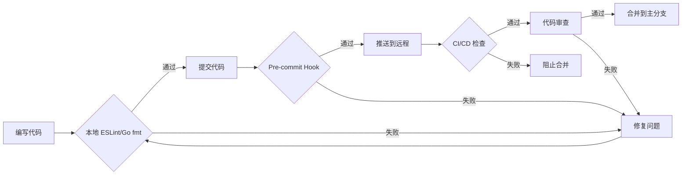
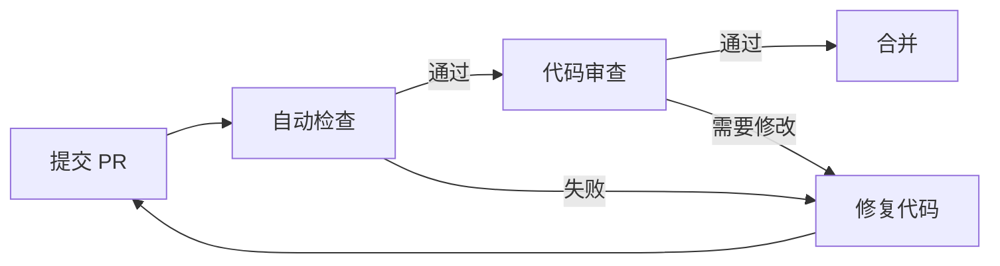

# zker 开发规范总览

> **版本**: 1.0.0
> **生效日期**: 2025-01-01
> **适用范围**: 所有 zker 前端和后端开发人员
> **强制级别**: 🔴 强制执行

---

## 📋 目录

- [1. 规范概述](#1-规范概述)
- [2. 前端开发规范](#2-前端开发规范)
  - [2.1 TypeScript 编码规范](#21-typescript-编码规范)
  - [2.2 React 组件规范](#22-react-组件规范)
  - [2.3 状态管理规范](#23-状态管理规范)
  - [2.4 API 调用规范](#24-api-调用规范)
  - [2.5 样式规范](#25-样式规范)
- [3. 后端开发规范](#3-后端开发规范)
  - [3.1 Go 编码规范](#31-go-编码规范)
  - [3.2 DDD 架构规范](#32-ddd-架构规范)
  - [3.3 数据库操作规范](#33-数据库操作规范)
  - [3.4 API 开发规范](#34-api-开发规范)
  - [3.5 错误处理规范](#35-错误处理规范)
- [4. 目录结构规范](#4-目录结构规范)
- [5. Git 工作流规范](#5-git-工作流规范)
- [6. 测试规范](#6-测试规范)
- [7. 文档规范](#7-文档规范)
- [8. 代码审查规范](#8-代码审查规范)

---

## 1. 规范概述

### 1.1 规范目标

本规范旨在确保 zker 项目代码：
- ✅ **一致性**: 所有代码遵循统一的命名和结构模式
- ✅ **可读性**: 代码清晰易懂，降低维护成本
- ✅ **可维护性**: 遵循 SOLID 原则，易于扩展和修改
- ✅ **可测试性**: 代码结构便于编写单元测试和集成测试
- ✅ **性能**: 遵循最佳实践，避免常见性能陷阱

### 1.2 规范执行机制



**强制执行工具**:
- **前端**: ESLint + Prettier + TypeScript 严格模式
- **后端**: gofmt + golint + golangci-lint
- **提交前**: Husky Pre-commit Hooks
- **CI/CD**: 自动化代码质量检查

### 1.3 违规处理

| 违规级别 | 处理方式 |
|---------|---------|
| 🔴 严重错误 | 阻止提交，必须修复 |
| 🟡 警告 | 建议修复，可通过 `--no-verify` 绕过（不推荐） |
| 🔵 提示 | 代码审查时指出，下次改进 |

---

## 2. 前端开发规范

### 2.1 TypeScript 编码规范

#### 2.1.1 文件命名规范

| 文件类型 | 命名规则 | 示例 |
|---------|---------|------|
| 组件文件 | `kebab-case.tsx` | `user-profile.tsx` |
| Hooks 文件 | `use-{purpose}.ts` | `use-auth-form.ts` |
| 工具函数 | `kebab-case.ts` | `format-date.ts` |
| 类型定义 | `{entity}.types.ts` | `user.types.ts` |
| 常量定义 | `{module}.constants.ts` | `api.constants.ts` |
| 测试文件 | `{filename}.test.ts` | `use-auth.test.ts` |

**✅ 正确示例**:
```
frontend/packages/arch/bot-hooks-base/
├── src/
│   ├── use-initial-value.ts        # Hook 实现
│   ├── use-responsive.ts           # Hook 实现
│   └── bot/
│       └── use-message-report-event.ts
└── __tests__/
    └── use-initial-value.test.ts   # 测试文件
```

**❌ 错误示例**:
```
❌ useInitialValue.ts       (应使用 kebab-case)
❌ use_message_report.ts   (不应使用 snake_case)
❌ UseAuthForm.ts          (不应使用 PascalCase)
```

#### 2.1.2 变量命名规范

**基础规则**:
- **常量**: `UPPER_SNAKE_CASE`
- **普通变量/函数**: `camelCase`
- **类/接口/类型**: `PascalCase`
- **私有变量**: `_camelCase`（前缀下划线）
- **布尔值**: `is/has/can/should` 前缀

**✅ 正确示例**:
```typescript
// 常量 - UPPER_SNAKE_CASE
const MAX_RETRY_COUNT = 3;
const DEFAULT_PAGE_SIZE = 20;
const API_BASE_URL = 'https://api.example.com';

// 普通变量 - camelCase
let userName = 'John';
const isActive = true;

// 类/接口/类型 - PascalCase
interface UserProfile {
  id: number;
  name: string;
}
class UserService {
  getUserById(id: number): UserProfile {}
}
type ApiResponse<T> = {
  data: T;
  error: Error | null;
};

// 私有变量 - _camelCase
class AuthService {
  private _token: string;
  private _refreshToken: string;
}

// 布尔值 - is/has/can/should 前缀
const isLoading = false;
const hasPermission = true;
const canEdit = false;
const shouldUpdate = true;
```

**❌ 错误示例**:
```typescript
❌ const max_retry_count = 3;           (应使用 UPPER_SNAKE_CASE)
❌ const UserName = 'John';              (应使用 camelCase)
❌ interface userProfile {}              (应使用 PascalCase)
❌ const active = false;                 (应使用 isActive)
❌ let _tempData = {};                    (私有变量应在类内使用)
```

#### 2.1.3 函数命名规范

**动词-名词模式** (详细到方法级别):

| 动词前缀 | 用途 | 示例 | 说明 |
|---------|------|------|------|
| `get` | 获取数据 | `getUserById()` | 纯查询，不修改状态 |
| `fetch` | 异步获取 | `fetchUserData()` | 从 API 获取数据 |
| `set` | 设置值 | `setUserName()` | 直接赋值 |
| `update` | 更新数据 | `updateUserProfile()` | 部分更新 |
| `create` | 创建新资源 | `createNewUser()` | 新建实体 |
| `delete` | 删除资源 | `deleteUserById()` | 删除操作 |
| `remove` | 移除元素 | `removeUserFromList()` | 从集合中移除 |
| `add` | 添加元素 | `addUserToList()` | 添加到集合 |
| `handle` | 处理事件 | `handleSubmit()` | 事件处理器 |
| `on` | 事件回调 | `onSuccess()` | 回调函数 |
| `is/has/can` | 布尔判断 | `isValidUser()` | 返回布尔值 |
| `validate` | 验证数据 | `validateEmail()` | 验证并返回错误 |
| `format` | 格式化 | `formatDate()` | 数据格式转换 |
| `parse` | 解析 | `parseJSON()` | 数据解析 |
| `transform` | 转换 | `transformUserData()` | 数据结构转换 |
| `convert` | 类型转换 | `convertToString()` | 类型映射 |

**✅ 正确示例**:
```typescript
// 数据获取类
function getUserById(id: number): User | null {}
async function fetchUserData(id: number): Promise<User> {}
function getUserList(params: QueryParams): User[] {}

// 数据修改类
function setUserName(name: string): void {}
function updateUserProfile(id: number, data: Partial<User>): User {}
function createNewUser(data: CreateUserData): User {}
function deleteUserById(id: number): boolean {}
function removeUserFromList(list: User[], user: User): User[] {}
function addUserToList(list: User[], user: User): User[] {}

// 事件处理类
function handleSubmit(event: FormEvent): void {}
function handleInputChange(event: ChangeEvent): void {}
function onSuccess(response: ApiResponse): void {}
function onError(error: Error): void {}

// 布尔判断类
function isValidUser(user: User): boolean {}
function hasPermission(user: User, permission: string): boolean {}
function canEditResource(user: User, resource: Resource): boolean {}
function shouldRetryRequest(attempts: number): boolean {}

// 数据处理类
function validateEmail(email: string): ValidationResult {}
function formatDate(date: Date): string {}
function parseJSON<T>(json: string): T {}
function transformUserData(raw: RawUserData): UserData {}
```

**❌ 错误示例**:
```typescript
❌ function user(id: number) {}           (缺少动词，应为 getUserById)
❌ function data(id: number) {}           (缺少动词，应为 fetchData)
❌ function process() {}                   (过于模糊，应明确处理什么)
❌ function returnUser() {}                (return 不是动词前缀，应为 getUser)
❌ function userHandle() {}                (名词在前，应为 handleUser)
```

#### 2.1.4 类型命名规范

**基础类型**:
```typescript
// 基础类型别名 - PascalCase
type ID = number | string;
type Timestamp = number;
type JsonData = Record<string, unknown>;

// 实体类型 - PascalCase，通常无后缀
interface User {
  id: ID;
  name: string;
  email: string;
}

interface UserProfile extends User {
  avatar?: string;
  bio?: string;
}

// 请求/响应类型 - PascalCase + Request/Response 后缀
interface CreateUserRequest {
  name: string;
  email: string;
  password: string;
}

interface CreateUserResponse {
  user: User;
  token: string;
}

// 列表/集合类型 - 复数形式或 Array 后缀
type UserList = User[];
type UserArray = Array<User>;

// 可选类型 - Optional 或 Partial
type OptionalUser = User | null;
type PartialUser = Partial<User>;

// DTO 类型 - DataTransferObject 后缀
interface UserDataTransferObject {
  id: number;
  name: string;
}

// ViewModel 类型 - ViewModel 后缀
interface UserViewModel {
  displayName: string;
  initials: string;
}

// Enum 类型 - PascalCase
enum UserRole {
  Admin = 'admin',
  User = 'user',
  Guest = 'guest',
}

// Union 类型 - 各选项 PascalCase
type Theme = 'light' | 'dark' | 'auto';
type Status = 'pending' | 'success' | 'error';

// 工具类型 - 描述性名称
type WithId<T> = T & { id: number };
type Timestamped<T> = T & { createdAt: Date; updatedAt: Date };
```

**泛型类型规范**:
```typescript
// 泛型参数命名 - 单个大写字母或描述性 PascalCase
function identity<T>(value: T): T { return value; }
function merge<T, U>(obj1: T, obj2: U): T & U {}
function createApiResponse<TEntity>(data: TEntity): ApiResponse<TEntity> {}

// 常用泛型参数约定
T   - Type (类型)
K   - Key (键)
V   - Value (值)
E   - Element (元素)
R   - Result (结果)
P   - Props (属性)
Req - Request (请求)
Res - Response (响应)
```

#### 2.1.5 接口与类型选择规范

**✅ 使用 interface 的场景**:
```typescript
// 1. 定义对象结构
interface User {
  id: number;
  name: string;
}

// 2. 需要扩展
interface Animal {
  name: string;
}
interface Dog extends Animal {
  breed: string;
}

// 3. 类的实现契约
interface Serializable {
  toJSON(): string;
}
```

**✅ 使用 type 的场景**:
```typescript
// 1. 联合类型
type Status = 'pending' | 'success' | 'error';

// 2. 映射类型
type PartialUser = Partial<User>;
type ReadonlyUser = Readonly<User>;

// 3. 条件类型
type NonNullable<T> = T extends null | undefined ? never : T;

// 4. 基本类型别名
type ID = number | string;

// 5. 元组类型
type Coordinate = [number, number];
```

#### 2.1.6 导入导出规范

**导入顺序** (严格执行):
```typescript
// 1. Node.js 内置模块
import path from 'path';
import fs from 'fs';

// 2. 第三方库 (按字母顺序)
import { Button, Toast } from '@douyinfe/semi-ui';
import { useQuery } from '@tanstack/react-query';
import React, { useCallback, useState } from 'react';

// 3. 内部 monorepo 包 (按字母顺序，使用 workspace:*)
import { useLogger } from '@coze-arch/logger';
import { useAuth } from '@zker/auth';

// 4. 相对路径导入 (按字母顺序)
import { formatDate } from './utils/format-date';
import { API_BASE_URL } from './constants/api-constants';
import type { User } from './types/user.types';
import { styles } from './user-profile.styles';
```

**导出规范**:
```typescript
// ✅ 推荐: 命名导出 (便于 tree-shaking)
export function getUserById(id: number): User {}
export const MAX_RETRY_COUNT = 3;
export interface User {}
export type UserRole = 'admin' | 'user';

// ✅ 工具函数使用默认导出
export default class UserService {}

// ✅ 类型导出使用 import type
export type { User, UserProfile };
export interface { UserResponse };

// ❌ 避免: 混合导出
export default function getUser() {}  (应使用命名导出)
```

---

### 2.2 React 组件规范

#### 2.2.1 组件文件结构

**标准文件结构**:
```
user-profile/
├── index.ts                 # 导出入口 (re-export)
├── user-profile.tsx         # 主组件文件
├── user-profile.types.ts    # 类型定义
├── user-profile.styles.ts   # 样式文件
├── user-profile.test.tsx    # 测试文件
└── components/              # 子组件
    ├── user-avatar/
    │   ├── index.ts
    │   ├── user-avatar.tsx
    │   └── user-avatar.test.tsx
    └── user-info/
        ├── index.ts
        ├── user-info.tsx
        └── user-info.test.tsx
```

**index.ts 示例**:
```typescript
// ✅ 统一导出入口
export { UserProfile } from './user-profile';
export type { UserProfileProps } from './user-profile.types';
```

#### 2.2.2 组件命名规范

**规则**:
- **组件名**: PascalCase
- **文件名**: kebab-case
- **组件名 = 文件名转换** (user-profile.tsx → UserProfile)

**✅ 正确示例**:
```typescript
// user-profile.tsx
export function UserProfile({ userId }: UserProfileProps) {
  return <div>User Profile</div>;
}

// user-avatar.tsx
export function UserAvatar({ src, alt }: UserAvatarProps) {
  return ;
}

// ❌ 错误: 组件名与文件名不匹配
export function User({ id }: UserProps) {}  (文件名应为 user.tsx)
```

#### 2.2.3 组件定义规范

**函数组件** (唯一允许的方式):
```typescript
// ✅ 正确: 使用函数组件 + React Hooks
import React, { useEffect, useState } from 'react';

interface UserProfileProps {
  userId: number;
  onEdit?: () => void;
}

export function UserProfile({ userId, onEdit }: UserProfileProps) {
  const [user, setUser] = useState<User | null>(null);
  const [loading, setLoading] = useState(true);

  useEffect(() => {
    fetchUserById(userId).then(data => {
      setUser(data);
      setLoading(false);
    });
  }, [userId]);

  if (loading) return <Spinner />;
  if (!user) return <ErrorMessage />;

  return (
    <div className="user-profile">
      <h1>{user.name}</h1>
      {onEdit && <button onClick={onEdit}>Edit</button>}
    </div>
  );
}

// ❌ 严格禁止: 类组件
export class UserProfile extends React.Component {
  // (不使用类组件)
}
```

**组件 Props 定义**:
```typescript
// ✅ 正确: 定义明确的 Props 接口
interface UserProfileProps {
  // 必需属性
  userId: number;
  name: string;

  // 可选属性 (使用 ? 标记)
  avatar?: string;
  bio?: string;

  // 回调函数 (使用 on 前缀)
  onEdit?: () => void;
  onDelete?: (userId: number) => void;

  // 布尔属性 (使用 is/has/show 前缀)
  isLoading?: boolean;
  hasPermission?: boolean;
  showActions?: boolean;

  // 渲染函数
  renderHeader?: (user: User) => React.ReactNode;

  // children
  children?: React.ReactNode;
}

// ✅ 正确: 提供默认值
const defaultProps: Partial<UserProfileProps> = {
  isLoading: false,
  showActions: true,
};
UserProfile.defaultProps = defaultProps;
```

#### 2.2.4 组件内部结构规范

**标准顺序** (严格执行):
```typescript
export function UserProfile(props: UserProfileProps) {
  // 1. Hooks 调用 (必须按顺序)
  const { userId, onEdit } = props;
  const [state, setState] = useState(null);
  const ref = useRef(null);
  const history = useHistory();

  // 2. 派生状态 (useMemo)
  const fullName = useMemo(() => {
    return `${user.firstName} ${user.lastName}`;
  }, [user.firstName, user.lastName]);

  // 3. 副作用 (useEffect)
  useEffect(() => {
    fetchUserData(userId);
  }, [userId]);

  // 4. 事件处理函数 (useCallback)
  const handleClick = useCallback(() => {
    onEdit?.();
  }, [onEdit]);

  const handleSubmit = useCallback((data: FormData) => {
    updateUser(userId, data);
  }, [userId]);

  // 5. 渲染辅助函数 (纯函数)
  function renderAvatar() {
    if (!user.avatar) return null;
    return ;
  }

  function renderActions() {
    if (!hasPermission) return null;
    return (
      <div className="actions">
        <button onClick={handleClick}>Edit</button>
      </div>
    );
  }

  // 6. 条件渲染 (早期返回)
  if (loading) return <Spinner />;
  if (error) return <Error message={error.message} />;

  // 7. 返回 JSX
  return (
    <div className="user-profile">
      {renderAvatar()}
      {renderActions()}
    </div>
  );
}
```

#### 2.2.5 Hooks 命名规范

**规则**:
- **自定义 Hook**: `use` 前缀 + `camelCase`
- **文件名**: 与 Hook 名一致（kebab-case）
- **返回值**: `[value, setter]` 或 `{ value, setter }`

**✅ 正确示例**:
```typescript
// use-auth-form.ts
export function useAuthForm() {
  const [email, setEmail] = useState('');
  const [password, setPassword] = useState('');
  const [loading, setLoading] = useState(false);

  const handleSubmit = useCallback(async () => {
    setLoading(true);
    try {
      await login({ email, password });
    } finally {
      setLoading(false);
    }
  }, [email, password]);

  return {
    email,
    setEmail,
    password,
    setPassword,
    loading,
    handleSubmit,
  };
}

// ✅ 使用解构返回
const { email, password, handleSubmit } = useAuthForm();

// ✅ 使用元组返回 (类似 useState)
function useToggle(initialValue: boolean): [boolean, () => void] {
  const [value, setValue] = useState(initialValue);
  const toggle = useCallback(() => setValue(v => !v), []);
  return [value, toggle];
}

const [isOpen, toggle] = useToggle(false);
```

**❌ 错误示例**:
```typescript
❌ export function getAuthForm() {}      (缺少 use 前缀)
❌ export function useUserData() {}      (过于通用，应为 useAuthForm)
❌ export function UseAuth() {}          (不应使用 PascalCase)
❌ export function use_auth() {}         (不应使用 snake_case)
```

#### 2.2.6 事件处理函数命名

**规范**:
- **组件内**: `handle` 前缀
- **Props 回调**: `on` 前缀
- **全局事件**: `use` 前缀 (Hook)

**✅ 正确示例**:
```typescript
export function UserProfile({ onEdit, onDelete }: UserProfileProps) {
  // 组件内事件处理 - handle 前缀
  const handleClick = useCallback(() => {
    onEdit?.();
  }, [onEdit]);

  const handleDelete = useCallback(() => {
    onDelete?.(userId);
  }, [userId, onDelete]);

  const handleSubmit = useCallback((event: FormEvent) => {
    event.preventDefault();
    submitForm(formData);
  }, []);

  const handleInputChange = useCallback((event: ChangeEvent) => {
    setFormData(event.target.value);
  }, []);

  return (
    <form onSubmit={handleSubmit}>
      <input onChange={handleInputChange} />
      <button onClick={handleClick}>Edit</button>
      <button onClick={handleDelete}>Delete</button>
    </form>
  );
}
```

---

### 2.3 状态管理规范

#### 2.3.1 Zustand Store 命名规范

**Store 定义**:
```typescript
// user-store.ts
import { create } from 'zustand';
import { devtools } from 'zustand/middleware';

// 1. 定义 State 接口
interface UserState {
  // 状态字段
  currentUser: User | null;
  userList: User[];
  isLoading: boolean;
  error: Error | null;

  // Actions - 动词前缀
  fetchUsers: () => Promise<void>;
  addUser: (user: User) => void;
  updateUser: (id: number, data: Partial<User>) => void;
  deleteUser: (id: number) => void;
  setCurrentUser: (user: User | null) => void;
  clearError: () => void;
}

// 2. 创建 Store
export const useUserStore = create<UserState>()(
  devtools(
    (set, get) => ({
      // 初始状态
      currentUser: null,
      userList: [],
      isLoading: false,
      error: null,

      // Actions 实现
      fetchUsers: async () => {
        set({ isLoading: true, error: null });
        try {
          const users = await api.getUsers();
          set({ userList: users, isLoading: false });
        } catch (error) {
          set({ error: error as Error, isLoading: false });
        }
      },

      addUser: (user) => {
        set((state) => ({
          userList: [...state.userList, user],
        }));
      },

      updateUser: (id, data) => {
        set((state) => ({
          userList: state.userList.map((user) =>
            user.id === id ? { ...user, ...data } : user
          ),
        }));
      },

      deleteUser: (id) => {
        set((state) => ({
          userList: state.userList.filter((user) => user.id !== id),
        }));
      },

      setCurrentUser: (user) => {
        set({ currentUser: user });
      },

      clearError: () => {
        set({ error: null });
      },
    }),
    { name: 'UserStore' }  // DevTools 名称
  )
);

// 3. 选择器 Hooks (可选，用于优化性能)
export const useCurrentUser = () => useUserStore((state) => state.currentUser);
export const useUserList = () => useUserStore((state) => state.userList);
export const useUserActions = () => ({
  fetchUsers: useUserStore((state) => state.fetchUsers),
  addUser: useUserStore((state) => state.addUser),
  updateUser: useUserStore((state) => state.updateUser),
  deleteUser: useUserStore((state) => state.deleteUser),
});
```

**Store 文件命名**:
- `{domain}-store.ts` 或 `{domain}.store.ts`
- 示例: `user-store.ts`, `agent.store.ts`, `workflow.store.ts`

#### 2.3.2 State 字段命名规范

```typescript
// ✅ 正确: 清晰的状态命名
interface AppState {
  // 数据状态 - 名词
  users: User[];
  agents: Agent[];
  workflows: Workflow[];

  // UI 状态 - is/has/show 前缀
  isLoading: boolean;
  isModalOpen: boolean;
  hasError: boolean;
  showSidebar: boolean;

  // 选中状态 - selected 前缀
  selectedUserId: number | null;
  selectedAgents: number[];

  // 表单状态 - form 后缀
  userForm: FormData;
  searchForm: SearchFormData;

  // 分页状态
  currentPage: number;
  pageSize: number;
  totalItems: number;

  // 错误/消息
  error: Error | null;
  errorMessage: string;
  successMessage: string;
}

// ❌ 错误: 模糊的状态命名
interface AppState {
  ❌ data: User[];              (应使用 users)
  ❌ visible: boolean;          (应使用 isModalVisible)
  ❌ id: number;                (应使用 selectedUserId)
  ❌ form: FormData;            (应使用 userForm)
}
```

#### 2.3.3 Action 命名规范

```typescript
// ✅ 正确: 动词-名词模式
interface UserActions {
  // CRUD 操作
  fetchUsers: () => Promise<void>;
  createUser: (data: CreateUserData) => Promise<void>;
  updateUser: (id: number, data: UpdateUserData) => Promise<void>;
  deleteUser: (id: number) => Promise<void>;

  // 设置操作
  setCurrentUser: (user: User) => void;
  setSelectedUserId: (id: number) => void;

  // UI 操作
  openModal: () => void;
  closeModal: () => void;
  toggleSidebar: () => void;

  // 表单操作
  resetForm: () => void;
  validateForm: () => boolean;
  submitForm: () => Promise<void>;

  // 错误处理
  setError: (error: Error) => void;
  clearError: () => void;
}

// ❌ 错误: 不明确的动作
interface UserActions {
  ❌ users: () => void;             (应为 fetchUsers)
  ❌ add: (user: User) => void;     (应为 addUser)
  ❌ remove: (id: number) => void;  (应为 deleteUser)
  ❌ modal: (open: boolean) => void; (应拆分为 openModal/closeModal)
}
```

---

### 2.4 API 调用规范

#### 2.4.1 API 客户端命名

```typescript
// ✅ 正确: API 客户端类命名
export class UserAPI {
  async getUserById(id: number): Promise<User> {}
  async createUser(data: CreateUserData): Promise<User> {}
  async updateUser(id: number, data: UpdateUserData): Promise<User> {}
  async deleteUser(id: number): Promise<void> {}
}

export class AgentAPI {
  async getAgentById(id: string): Promise<Agent> {}
  async createAgent(data: CreateAgentData): Promise<Agent> {}
  async publishAgent(id: string): Promise<void> {}
}

// ✅ 正确: 使用适配器模式
export interface UserAPIAdapter {
  getUserById(id: number): Promise<User>;
  createUser(data: CreateUserData): Promise<User>;
}

export class UserAPIImpl implements UserAPIAdapter {
  constructor(private httpClient: HTTPClient) {}

  async getUserById(id: number): Promise<User> {
    const response = await this.httpClient.get<User>(`/api/v1/users/${id}`);
    return response.data;
  }
}

// ❌ 错误: 不明确的命名
export class UserManager {}      (应使用 UserAPI)
export class UserService {}      (后端使用 Service，前端使用 API)
export class UserHelper {}       (应使用 UserAPI 或 UserUtils)
```

#### 2.4.2 API 方法命名规范

```typescript
// ✅ 正确: HTTP 方法对应命名
export class AgentAPI {
  // GET - 获取资源
  async getAgentById(id: string): Promise<Agent> {}
  async getAgentList(params: QueryParams): Promise<AgentList> {}

  // POST - 创建资源
  async createAgent(data: CreateAgentData): Promise<Agent> {}
  async publishAgent(id: string): Promise<PublishResult> {}

  // PUT/PATCH - 更新资源
  async updateAgent(id: string, data: UpdateAgentData): Promise<Agent> {}
  async patchAgent(id: string, data: Partial<UpdateAgentData>): Promise<Agent> {}

  // DELETE - 删除资源
  async deleteAgent(id: string): Promise<void> {}

  // 特殊操作 - 动词-名词
  async cloneAgent(id: string, name: string): Promise<Agent> {}
  async exportAgent(id: string): Promise<ExportData> {}
  async importAgent(data: ImportData): Promise<Agent> {}
}

// ❌ 错误: 不一致的命名
export class AgentAPI {
  ❌ agent(id: string) {}                    (应为 getAgentById)
  ❌ addAgent(data: CreateAgentData) {}      (应为 createAgent)
  ❌ editAgent(id: string, data: any) {}     (应为 updateAgent)
  ❌ removeAgent(id: string) {}              (应为 deleteAgent)
}
```

#### 2.4.3 API 路径规范

```typescript
// ✅ 正确: RESTful 风格路径
const API_ENDPOINTS = {
  // 资源操作 - /api/v1/{resource}
  USERS: '/api/v1/users',
  USER_BY_ID: (id: number) => `/api/v1/users/${id}`,

  // 嵌套资源 - /api/v1/{parent}/{id}/{child}
  AGENTS: '/api/v1/agents',
  AGENT_BY_ID: (id: string) => `/api/v1/agents/${id}`,
  AGENT_PUBLISH: (id: string) => `/api/v1/agents/${id}/publish`,
  AGENT_VERSIONS: (id: string) => `/api/v1/agents/${id}/versions`,

  // 特殊操作 - /api/v1/{resource}/{id}/action
  AGENT_CLONE: (id: string) => `/api/v1/agents/${id}/clone`,
  AGENT_EXPORT: (id: string) => `/api/v1/agents/${id}/export`,
  AGENT_IMPORT: '/api/v1/agents/import',

  // 搜索/查询 - /api/v1/{resource}/search
  USERS_SEARCH: '/api/v1/users/search',
  AGENTS_SEARCH: '/api/v1/agents/search',
};

// ✅ 使用示例
class UserAPI {
  async getUserById(id: number): Promise<User> {
    return this.http.get(API_ENDPOINTS.USER_BY_ID(id));
  }

  async searchUsers(query: string): Promise<User[]> {
    return this.http.get(API_ENDPOINTS.USERS_SEARCH, { q: query });
  }
}
```

---

### 2.5 样式规范

#### 2.5.1 CSS Modules 命名

```typescript
// ✅ 正确: 独立样式文件
import styles from './user-profile.module.css';

export function UserProfile() {
  return (
    <div className={styles.container}>
      <h1 className={styles.title}>User Profile</h1>
      <button className={styles.button}>Edit</button>
    </div>
  );
}

// user-profile.module.css
.container {
  padding: 20px;
  border: 1px solid #ccc;
}

.title {
  font-size: 24px;
  font-weight: bold;
}

.button {
  padding: 8px 16px;
  background-color: #1890ff;
  color: white;
  border: none;
  border-radius: 4px;
}
```

#### 2.5.2 Tailwind CSS 类命名

```typescript
// ✅ 正确: 使用 Tailwind 工具类
export function UserProfile() {
  return (
    <div className="flex items-center justify-between p-4 border rounded">
      <h1 className="text-2xl font-bold text-gray-900">User Profile</h1>
      <button className="px-4 py-2 bg-blue-500 text-white rounded hover:bg-blue-600">
        Edit
      </button>
    </div>
  );
}

// ✅ 正确: 复杂组件使用 cn() 工具函数
import { cn } from '@zker/utils';

export function Button({ variant, size, className, ...props }: ButtonProps) {
  return (
    <button
      className={cn(
        'rounded-md font-medium transition-colors',
        {
          'bg-blue-500 text-white': variant === 'primary',
          'bg-gray-200 text-gray-900': variant === 'secondary',
        },
        {
          'px-4 py-2': size === 'md',
          'px-2 py-1 text-sm': size === 'sm',
        },
        className
      )}
      {...props}
    />
  );
}
```

---

## 3. 后端开发规范

### 3.1 Go 编码规范

#### 3.1.1 文件命名规范

| 文件类型 | 命名规则 | 示例 |
|---------|---------|------|
| 包目录 | `lowercase` | `service`, `repository`, `handler` |
| Go 源文件 | `lowercase.go` | `user.go`, `agent_service.go`, `repository.go` |
| 测试文件 | `{filename}_test.go` | `user_test.go`, `service_test.go` |
| 接口文件 | `interface.go` 或 `{domain}.go` | `interface.go`, `user.go` |

**✅ 正确示例**:
```
backend/domain/user/
├── entity/
│   └── user.go              # 实体定义
├── repository/
│   ├── interface.go         # 仓储接口
│   └── repository.go        # 仓储实现
└── service/
    ├── service.go           # 服务接口
    ├── service_impl.go      # 服务实现
    └── service_test.go      # 测试文件
```

**❌ 错误示例**:
```
❌ user_service.go           (应使用 service.go)
❌ User.go                   (应使用 user.go)
❌ repo.go                   (应使用 repository.go)
❌ service-impl.go           (不应使用连字符)
```

#### 3.1.2 包命名规范

**规则**:
- **包名**: 小写单词，不使用下划线或驼峰
- **包名应简洁**: 描述包的功能
- **避免重复**: 不要在包名中包含 `pkg` 或 `lib`

**✅ 正确示例**:
```go
// ✅ 简洁清晰的包名
package service
package repository
package entity
package handler
package middleware
package config
package util
```

**❌ 错误示例**:
```go
❌ package userService       (应使用 service)
❌ package user_repository   (应使用 repository)
❌ package UserManagement    (应使用小写)
❌ package pkg               (过于通用)
❌ package common            (过于通用，应使用具体名称)
```

#### 3.1.3 变量命名规范

**基础规则**:
- **导出变量/常量**: PascalCase
- **内部变量/常量**: camelCase
- **常量**: 可使用全大写或 PascalCase
- **缩写词**: 保持一致（ID, URL, HTTP 等）

**✅ 正确示例**:
```go
// ✅ 导出常量 - PascalCase
const (
    MaxRetryCount = 3
    DefaultPageSize = 20
    APITimeout = 30 * time.Second
)

// ✅ 内部常量 - camelCase
const (
    defaultTimeout = 10 * time.Second
    maxConnections = 100
)

// ✅ 导出变量 - PascalCase
var GlobalConfig Config
var DBPool *sql.DB

// ✅ 内部变量 - camelCase
var internalCache cache.Cache
var connectionPool *pool.Pool

// ✅ 局部变量 - camelCase
func processUser() {
    userID := 123
    userName := "John"
    isActive := true
    createdAt := time.Now()

    // ✅ 缩写词保持一致
    userID := 123      // 不是 userId
    httpURL := "https://api.example.com"
    xmlData := []byte{}
}

// ❌ 错误示例
var ❌ userId = 123           (应使用 userID)
var ❌ api_url = ""           (应使用 apiURL)
var ❌ Xml_data = []byte{}    (应使用 xmlData)
```

#### 3.1.4 函数/方法命名规范

**详细规则** (细化到方法级别):

| 函数类型 | 命名规则 | 示例 |
|---------|---------|------|
| 导出函数 | PascalCase | `CreateUser`, `GetUserByID` |
| 内部函数 | camelCase | `validateEmail`, `formatDate` |
| 方法接收者 | 单字母简写 | `func (u *User) Save()` |
| 构造函数 | `New{TypeName}` | `NewUserService()` |
| 接口实现 | `{Interface}Impl` | `userServiceImpl` |

**动词前缀规范**:
```go
// ✅ Get - 获取数据（无副作用）
func (s *UserService) GetUserByID(id int64) (*User, error) {}
func (s *UserService) GetUserList(params QueryParams) ([]*User, error) {}
func (s *UserService) GetActiveUserCount() (int, error) {}

// ✅ Create - 创建新资源
func (s *UserService) CreateUser(req *CreateUserRequest) (*User, error) {}
func (s *AgentService) CreateAgent(req *CreateAgentRequest) (string, error) {}

// ✅ Update - 更新资源（部分或全部）
func (s *UserService) UpdateUser(id int64, req *UpdateUserRequest) error {}
func (s *UserService) UpdateUserProfile(id int64, profile *Profile) error {}

// ✅ Delete - 删除资源
func (s *UserService) DeleteUser(id int64) error {}
func (s *AgentService) DeleteAgent(id string) error {}

// ✅ Add/Remove - 集合操作
func (s *UserService) AddRoleToUser(userID int64, roleID int64) error {}
func (s *UserService) RemoveUserFromTeam(userID int64, teamID int64) error {}

// ✅ Validate - 验证数据
func (s *UserService) ValidateUserData(data *UserData) error {}
func (s *UserService) ValidateEmail(email string) error {}

// ✅ Is/Has/Can - 布尔判断
func (s *UserService) IsUserActive(userID int64) (bool, error) {}
func (s *UserService) HasPermission(userID int64, resource string) (bool, error) {}
func (s *UserService) CanEditResource(userID int64, resourceID int64) (bool, error) {}

// ✅ Format/Parse - 格式转换
func (s *UserService) FormatUserDate(t time.Time) string {}
func (s *UserService) ParseUserData(data []byte) (*User, error) {}

// ✅ Convert/Transform - 类型转换
func (s *UserService) ConvertToDTO(user *User) *UserDTO {}
func (s *UserService) TransformUserData(raw *RawUser) *User {}

// ✅ Handle - 处理请求
func (h *Handler) HandleCreateUser(ctx context.Context, req *CreateUserRequest) (*CreateUserResponse, error) {}
func (h *Handler) HandleGetUser(ctx context.Context, req *GetUserRequest) (*GetUserResponse, error) {}

// ❌ 错误示例
func ❌ user(id int64) {}                    (应为 GetUserByID)
func ❌ data(id int64) {}                    (应为 GetDataByID)
func ❌ process() {}                         (过于模糊，应明确处理什么)
func ❌ returnUser() {}                      (应为 GetUser)
func ❌ userHandle() {}                      (应为 HandleUser)
```

**方法接收者命名**:
```go
// ✅ 正确: 使用一致的单字母缩写
func (u *User) Save() error {}
func (u *User) Delete() error {}
func (s *UserService) CreateUser(req *CreateUserRequest) (*User, error) {}
func (r *UserRepository) FindByID(id int64) (*User, error) {}
func (h *UserHandler) HandleCreate(ctx context.Context, req *Request) (*Response, error) {}

// ✅ 正确: 不同类型使用不同缩写
u - User
s - Service
r - Repository
h - Handler
c - Config
m - Model
ctx - context
req - request
res/resp - response

// ❌ 错误示例
func ❌ (user *User) Save() {}               (应使用 u)
func ❌ (this *UserService) Create() {}      (不使用 this)
func ❌ (self *User) Delete() {}             (不使用 self)
```

#### 3.1.5 接口定义规范

**接口命名**:
```go
// ✅ 正确: 接口命名 - 动词+er 名词 或 功能描述
type UserRepository interface {
    FindByID(ctx context.Context, id int64) (*User, error)
    FindByEmail(ctx context.Context, email string) (*User, error)
    Create(ctx context.Context, user *User) error
    Update(ctx context.Context, user *User) error
    Delete(ctx context.Context, id int64) error
}

type UserService interface {
    CreateUser(ctx context.Context, req *CreateUserRequest) (*User, error)
    GetUserByID(ctx context.Context, id int64) (*User, error)
    UpdateUser(ctx context.Context, req *UpdateUserRequest) error
    DeleteUser(ctx context.Context, id int64) error
}

type Cache interface {
    Get(key string) (interface{}, error)
    Set(key string, value interface{}) error
    Delete(key string) error
}

// ❌ 错误示例
type ❌ IUserRepository interface {}         (不使用 I 前缀)
type ❌ UserInterface interface {}          (过于通用)
type ❌ Repository interface {}             (应使用 UserRepository)
```

**接口实现命名**:
```go
// ✅ 正确: 实现命名 - {interface}Impl 或 {interface}Mock
type UserService interface {
    CreateUser(ctx context.Context, req *CreateUserRequest) (*User, error)
}

type userServiceImpl struct {
    repo UserRepository
    db   *gorm.DB
}

func NewUserService(repo UserRepository, db *gorm.DB) UserService {
    return &userServiceImpl{
        repo: repo,
        db:   db,
    }
}

func (s *userServiceImpl) CreateUser(ctx context.Context, req *CreateUserRequest) (*User, error) {
    // 实现代码
}

// ✅ Mock 实现（用于测试）
type mockUserService struct {
    mock.Mock
}

func (m *mockUserService) CreateUser(ctx context.Context, req *CreateUserRequest) (*User, error) {
    args := m.Called(ctx, req)
    return args.Get(0).(*User), args.Error(1)
}

// ❌ 错误示例
type ❌ ServiceImpl struct {}                (应使用 userServiceImpl)
type ❌ UserServiceImpl struct {}            (内部实现应小写开头)
```

#### 3.1.6 结构体定义规范

**实体定义**:
```go
// ✅ 正确: 实体定义
package entity

import "time"

type User struct {
    // 主键
    ID int64 `gorm:"column:id;primaryKey;autoIncrement" json:"id"`

    // 业务字段
    Name     string `gorm:"column:name;not null" json:"name"`
    Email    string `gorm:"column:email;uniqueIndex;not null" json:"email"`
    Avatar   string `gorm:"column:avatar" json:"avatar,omitempty"`
    Bio      string `gorm:"column:bio" json:"bio,omitempty"`

    // 状态字段
    Status   string `gorm:"column:status;default:active" json:"status"`
    IsActive bool   `gorm:"column:is_active;default:true" json:"is_active"`

    // 审计字段
    CreatedAt time.Time  `gorm:"column:created_at;autoCreateTime" json:"created_at"`
    UpdatedAt time.Time  `gorm:"column:updated_at;autoUpdateTime" json:"updated_at"`
    DeletedAt *time.Time `gorm:"column:deleted_at;index" json:"deleted_at,omitempty"`

    // 外键
    SpaceID  int64  `gorm:"column:space_id;index:idx_space_id;not null" json:"space_id"`
    CreatorID int64 `gorm:"column:creator_id;index:idx_creator_id;not null" json:"creator_id"`
}

// ✅ 表名指定
func (User) TableName() string {
    return "users"
}
```

**请求/响应结构体**:
```go
// ✅ 正确: 请求结构体 - Request 后缀
type CreateUserRequest struct {
    Name     string `json:"name" binding:"required"`
    Email    string `json:"email" binding:"required,email"`
    Password string `json:"password" binding:"required,min=8"`
    SpaceID  int64  `json:"space_id" binding:"required"`
}

type UpdateUserRequest struct {
    Name   *string `json:"name" binding:"omitempty"`
    Avatar *string `json:"avatar" binding:"omitempty"`
    Bio    *string `json:"bio" binding:"omitempty"`
}

type GetUserRequest struct {
    UserID int64  `json:"user_id" binding:"required"`
    Fields []string `json:"fields" binding:"omitempty"`
}

// ✅ 正确: 响应结构体 - Response 后缀
type CreateUserResponse struct {
    User *User `json:"user"`
}

type GetUserResponse struct {
    User *User `json:"user"`
}

type UserListResponse struct {
    Users      []*User `json:"users"`
    TotalCount int64   `json:"total_count"`
    Page       int     `json:"page"`
    PageSize   int     `json:"page_size"`
}

// ❌ 错误示例
type ❌ UserReq struct {}                   (应使用 CreateUserRequest)
type ❌ CreateUserResp struct {}            (应使用 CreateUserResponse)
type ❌ UserParams struct {}                (应使用 CreateUserRequest)
```

#### 3.1.7 错误处理规范

**错误定义**:
```go
// ✅ 正确: 定义错误变量
var (
    ErrUserNotFound     = errors.New("user not found")
    ErrInvalidEmail     = errors.New("invalid email format")
    ErrUserAlreadyExists = errors.New("user already exists")
    ErrPermissionDenied = errors.New("permission denied")
)

// ✅ 正确: 使用自定义错误类型
type ValidationError struct {
    Field   string
    Message string
}

func (e *ValidationError) Error() string {
    return fmt.Sprintf("validation failed on field %s: %s", e.Field, e.Message)
}

type BusinessError struct {
    Code    int
    Message string
    Cause   error
}

func (e *BusinessError) Error() string {
    if e.Cause != nil {
        return fmt.Sprintf("[%d] %s: %v", e.Code, e.Message, e.Cause)
    }
    return fmt.Sprintf("[%d] %s", e.Code, e.Message)
}

func (e *BusinessError) Unwrap() error {
    return e.Cause
}
```

**错误返回**:
```go
// ✅ 正确: 错误返回模式
func (s *userService) CreateUser(ctx context.Context, req *CreateUserRequest) (*User, error) {
    // 1. 参数验证
    if err := s.validateCreateUserRequest(req); err != nil {
        return nil, fmt.Errorf("validation failed: %w", err)
    }

    // 2. 业务规则检查
    exists, err := s.repo.ExistsByEmail(ctx, req.Email)
    if err != nil {
        return nil, fmt.Errorf("check email existence failed: %w", err)
    }
    if exists {
        return nil, ErrUserAlreadyExists
    }

    // 3. 创建实体
    user := &User{
        Name:  req.Name,
        Email: req.Email,
    }

    // 4. 持久化
    if err := s.repo.Create(ctx, user); err != nil {
        return nil, fmt.Errorf("create user failed: %w", err)
    }

    // 5. 返回成功结果
    return user, nil
}

// ❌ 错误示例
func ❌ (s *userService) CreateUser(req *CreateUserRequest) (*User, error) {
    if req.Name == "" {
        return nil, errors.New("invalid name")    (应使用预定义错误)
    }
    // ...
}
```

---

### 3.2 DDD 架构规范

#### 3.2.1 分层目录结构

```bash
backend/
├── api/                    # API 层（接口层）
│   ├── handler/            # HTTP 处理器
│   │   └── coze/           # Coze API 处理器
│   ├── middleware/         # 中间件
│   └── router/             # 路由定义
├── application/            # 应用层（用例编排）
│   └── {domain}/
│       └── usecase/
├── domain/                 # 领域层（核心业务逻辑）
│   ├── {domain}/
│   │   ├── entity/         # 实体
│   │   ├── valueobject/    # 值对象
│   │   ├── repository/     # 仓储接口
│   │   └── service/        # 领域服务
│   └── shared/             # 共享领域
├── infra/                  # 基础设施层
│   ├── database/           # 数据库实现
│   ├── cache/              # 缓存实现
│   └── queue/              # 消息队列
└── crossdomain/            # 跨域
    ├── connector/
    ├── database/
    └── workflow/
```

#### 3.2.2 领域层规范

**实体定义**:
```go
// domain/user/entity/user.go
package entity

import "time"

// User 用户实体
type User struct {
    // 标识
    ID int64

    // 属性
    Name     string
    Email    string
    Avatar   string
    Status   UserStatus

    // 审计
    CreatedAt time.Time
    UpdatedAt time.Time
    CreatedBy int64
    UpdatedBy int64

    // 版本（乐观锁）
    Version int
}

// UserStatus 用户状态值对象
type UserStatus string

const (
    UserStatusActive   UserStatus = "active"
    UserStatusInactive UserStatus = "inactive"
    UserStatusBanned   UserStatus = "banned"
)

// IsActive 判断用户是否激活
func (u *User) IsActive() bool {
    return u.Status == UserStatusActive
}

// ValidateEmail 验证邮箱
func (u *User) ValidateEmail() error {
    if !isValidEmail(u.Email) {
        return ErrInvalidEmail
    }
    return nil
}

// ChangeStatus 修改状态
func (u *User) ChangeStatus(status UserStatus) error {
    if !isValidStatusTransition(u.Status, status) {
        return ErrInvalidStatusTransition
    }
    u.Status = status
    u.UpdatedAt = time.Now()
    return nil
}
```

**仓储接口定义**:
```go
// domain/user/repository/interface.go
package repository

import (
    "context"
    "github.com/coze-dev/zker/backend/domain/user/entity"
)

type UserRepository interface {
    // 基础 CRUD
    Create(ctx context.Context, user *entity.User) error
    FindByID(ctx context.Context, id int64) (*entity.User, error)
    Update(ctx context.Context, user *entity.User) error
    Delete(ctx context.Context, id int64) error

    // 查询方法
    FindByEmail(ctx context.Context, email string) (*entity.User, error)
    FindByStatus(ctx context.Context, status entity.UserStatus) ([]*entity.User, error)

    // 存在性检查
    ExistsByEmail(ctx context.Context, email string) (bool, error)

    // 分页查询
    FindWithPagination(ctx context.Context, params *PaginationParams) ([]*entity.User, int64, error)
}
```

**领域服务定义**:
```go
// domain/user/service/interface.go
package service

import (
    "context"
    "github.com/coze-dev/zker/backend/domain/user/entity"
)

type UserService interface {
    // 用户管理
    CreateUser(ctx context.Context, req *CreateUserRequest) (*entity.User, error)
    GetUserByID(ctx context.Context, id int64) (*entity.User, error)
    UpdateUser(ctx context.Context, req *UpdateUserRequest) error
    DeleteUser(ctx context.Context, id int64) error

    // 业务操作
    ActivateUser(ctx context.Context, userID int64) error
    DeactivateUser(ctx context.Context, userID int64) error
    ChangeUserStatus(ctx context.Context, userID int64, status entity.UserStatus) error

    // 验证
    ValidateUserEmail(ctx context.Context, email string) error
}
```

#### 3.2.3 应用层规范

```go
// application/user/usecase/create_user_usecase.go
package usecase

import (
    "context"
    "github.com/coze-dev/zker/backend/domain/user/entity"
    "github.com/coze-dev/zker/backend/domain/user/repository"
    "github.com/coze-dev/zker/backend/domain/user/service"
)

type CreateUserUseCase struct {
    userRepo repository.UserRepository
    userService service.UserService
}

func NewCreateUserUseCase(
    userRepo repository.UserRepository,
    userService service.UserService,
) *CreateUserUseCase {
    return &CreateUserUseCase{
        userRepo: userRepo,
        userService: userService,
    }
}

func (uc *CreateUserUseCase) Execute(ctx context.Context, req *CreateUserRequest) (*CreateUserResponse, error) {
    // 1. 参数验证
    if err := uc.validateRequest(req); err != nil {
        return nil, err
    }

    // 2. 检查业务规则
    exists, err := uc.userRepo.ExistsByEmail(ctx, req.Email)
    if err != nil {
        return nil, err
    }
    if exists {
        return nil, ErrUserAlreadyExists
    }

    // 3. 创建实体
    user := &entity.User{
        Name:  req.Name,
        Email: req.Email,
        Status: entity.UserStatusActive,
    }

    // 4. 持久化
    if err := uc.userRepo.Create(ctx, user); err != nil {
        return nil, err
    }

    // 5. 返回响应
    return &CreateUserResponse{
        User: user,
    }, nil
}
```

#### 3.2.4 API 层规范

```go
// api/handler/coze/user_service.go
package coze

import (
    "context"
    "github.com/coze-dev/zker/backend/application/user/usecase"
)

type UserService struct {
    createUserUseCase *usecase.CreateUserUseCase
    getUserUseCase    *usecase.GetUserUseCase
}

// CreateUser 创建用户
// @Summary 创建用户
// @Description 创建新用户
// @Tags User
// @Accept json
// @Produce json
// @Param request body CreateUserRequest true "创建用户请求"
// @Success 200 {object} CreateUserResponse
// @Router /api/v1/users [post]
func (s *UserService) CreateUser(ctx context.Context, req *CreateUserRequest) (*CreateUserResponse, error) {
    // 1. 调用应用层
    resp, err := s.createUserUseCase.Execute(ctx, req)
    if err != nil {
        return nil, err
    }

    // 2. 返回响应
    return &CreateUserResponse{
        User: toUserDTO(resp.User),
    }, nil
}
```

---

### 3.3 数据库操作规范

#### 3.3.1 GORM 模型定义

```go
// infra/database/model/user.go
package model

import "time"

type User struct {
    // 主键
    ID int64 `gorm:"column:id;primaryKey;autoIncrement" json:"id"`

    // 业务字段
    Name     string `gorm:"column:name;type:varchar(100);not null" json:"name"`
    Email    string `gorm:"column:email;type:varchar(255);uniqueIndex:idx_email;not null" json:"email"`
    Avatar   string `gorm:"column:avatar;type:varchar(500)" json:"avatar"`
    Bio      string `gorm:"column:bio;type:text" json:"bio"`

    // 状态字段
    Status   string `gorm:"column:status;type:varchar(20);default:active;index:idx_status" json:"status"`
    IsActive bool   `gorm:"column:is_active;type:tinyint(1);default:1" json:"is_active"`

    // 审计字段
    CreatedAt time.Time  `gorm:"column:created_at;autoCreateTime;index:idx_created_at" json:"created_at"`
    UpdatedAt time.Time  `gorm:"column:updated_at;autoUpdateTime" json:"updated_at"`
    DeletedAt *time.Time `gorm:"column:deleted_at;index" json:"deleted_at,omitempty"`

    // 外键
    SpaceID   int64 `gorm:"column:space_id;index:idx_space_id;not null" json:"space_id"`
    CreatorID int64 `gorm:"column:creator_id;index:idx_creator_id;not null" json:"creator_id"`

    // 版本控制
    Version int `gorm:"column:version;type:int;default:0" json:"version"`
}

func (User) TableName() string {
    return "users"
}
```

#### 3.3.2 数据库表命名规范

**表命名**:
- ✅ 使用复数名词: `users`, `agents`, `workflows`
- ✅ 使用小写字母和下划线: `user_profiles`, `agent_versions`
- ✅ 关系表使用两个表名: `user_roles`, `agent_tags`

**列命名**:
- ✅ 使用小写字母和下划线: `created_at`, `space_id`
- ✅ 主键统一为 `id`
- ✅ 外键使用 `{table}_id` 格式: `user_id`, `space_id`
- ✅ 布尔值使用 `is_` 前缀: `is_active`, `is_deleted`
- ✅ 时间戳使用 `_at` 后缀: `created_at`, `updated_at`, `deleted_at`

**索引命名**:
- ✅ 普通索引: `idx_{column}`: `idx_email`, `idx_status`
- ✅ 唯一索引: `uk_{column}`: `uk_email`
- ✅ 组合索引: `idx_{col1}_{col2}`: `idx_space_id_status`
- ✅ 外键索引: `fk_{column}`: `fk_space_id`

**✅ 正确示例**:
```sql
CREATE TABLE users (
    id BIGINT AUTO_INCREMENT PRIMARY KEY,
    name VARCHAR(100) NOT NULL,
    email VARCHAR(255) NOT NULL,
    space_id BIGINT NOT NULL,
    status VARCHAR(20) DEFAULT 'active',
    is_active TINYINT(1) DEFAULT 1,
    created_at TIMESTAMP DEFAULT CURRENT_TIMESTAMP,
    updated_at TIMESTAMP DEFAULT CURRENT_TIMESTAMP ON UPDATE CURRENT_TIMESTAMP,
    deleted_at TIMESTAMP NULL,

    UNIQUE KEY uk_email (email),
    INDEX idx_space_id (space_id),
    INDEX idx_status (status),
    INDEX idx_space_id_status (space_id, status)
) ENGINE=InnoDB DEFAULT CHARSET=utf8mb4;
```

#### 3.3.3 查询构建规范

```go
// ✅ 正确: 使用 GORM 构建查询
func (r *userRepository) FindByEmail(ctx context.Context, email string) (*User, error) {
    var user User
    err := r.db.WithContext(ctx).
        Where("email = ? AND deleted_at IS NULL", email).
        First(&user).Error
    if err != nil {
        if errors.Is(err, gorm.ErrRecordNotFound) {
            return nil, ErrUserNotFound
        }
        return nil, err
    }
    return &user, nil
}

func (r *userRepository) FindWithPagination(
    ctx context.Context,
    params *PaginationParams,
) ([]*User, int64, error) {
    var users []*User
    var total int64

    query := r.db.WithContext(ctx).Model(&User{}).Where("deleted_at IS NULL")

    // 动态条件
    if params.Status != "" {
        query = query.Where("status = ?", params.Status)
    }
    if params.SpaceID > 0 {
        query = query.Where("space_id = ?", params.SpaceID)
    }

    // 获取总数
    if err := query.Count(&total).Error; err != nil {
        return nil, 0, err
    }

    // 分页查询
    err := query.
        Offset((params.Page - 1) * params.PageSize).
        Limit(params.PageSize).
        Order("created_at DESC").
        Find(&users).Error

    return users, total, err
}

// ❌ 错误示例: 使用原生 SQL
func ❌ (r *userRepository) FindByEmail(ctx context.Context, email string) (*User, error) {
    var user User
    err := r.db.Raw("SELECT * FROM users WHERE email = ?", email).Scan(&user).Error
    // (应使用 GORM API)
}
```

---

### 3.4 API 开发规范

#### 3.4.1 RESTful API 设计

**HTTP 方法与资源映射**:

| HTTP 方法 | 路径 | 功能 | 函数命名 |
|----------|------|------|---------|
| GET | `/api/v1/users` | 获取用户列表 | `GetUserList` |
| GET | `/api/v1/users/:id` | 获取单个用户 | `GetUserByID` |
| POST | `/api/v1/users` | 创建用户 | `CreateUser` |
| PUT | `/api/v1/users/:id` | 更新用户（全部） | `UpdateUser` |
| PATCH | `/api/v1/users/:id` | 更新用户（部分） | `PatchUser` |
| DELETE | `/api/v1/users/:id` | 删除用户 | `DeleteUser` |

**路径设计**:
```bash
# ✅ 正确: RESTful 风格
GET    /api/v1/users                    # 获取用户列表
GET    /api/v1/users/:id                # 获取用户详情
POST   /api/v1/users                    # 创建用户
PUT    /api/v1/users/:id                # 更新用户
DELETE /api/v1/users/:id                # 删除用户

# 嵌套资源
GET    /api/v1/users/:id/agents         # 获取用户的 Agent 列表
POST   /api/v1/users/:id/agents         # 为用户创建 Agent

# 特殊操作（使用子资源）
POST   /api/v1/agents/:id/publish       # 发布 Agent
POST   /api/v1/agents/:id/clone         # 克隆 Agent
POST   /api/v1/agents/:id/export        # 导出 Agent

# ❌ 错误示例
GET    /api/v1/getUsers                 (不应包含动词)
GET    /api/v1/user/:id                 (应使用复数)
POST   /api/v1/createUser               (不应包含动词)
GET    /api/v1/users/get/:id            (路径不应包含动作)
```

#### 3.4.2 API 版本控制

**URL 版本控制** (推荐):
```bash
# ✅ 使用 URL 路径版本控制
/api/v1/users
/api/v2/users
/api/v3/users

# ❌ 避免使用查询参数版本控制
/api/users?version=1
```

**版本升级策略**:
- **不兼容变更**: 创建新版本 (v1 → v2)
- **兼容变更**: 保持当前版本，更新文档
- **废弃版本**: 响应头添加 `Deprecation` 警告

```go
// ✅ 正确: 处理多版本
func (h *Handler) GetUserV1(ctx context.Context, req *GetUserRequest) (*GetUserResponseV1, error) {
    // V1 实现
}

func (h *Handler) GetUserV2(ctx context.Context, req *GetUserRequest) (*GetUserResponseV2, error) {
    // V2 实现（新增字段）
}
```

#### 3.4.3 响应格式规范

**统一响应结构**:
```go
// ✅ 正确: 标准成功响应
type Response struct {
    Code    int         `json:"code"`              // 业务状态码
    Message string      `json:"message"`           // 提示信息
    Data    interface{} `json:"data"`              // 业务数据
}

// 示例
{
    "code": 0,
    "message": "success",
    "data": {
        "user": {
            "id": 123,
            "name": "John"
        }
    }
}

// ✅ 正确: 列表响应
type ListResponse struct {
    Code    int         `json:"code"`
    Message string      `json:"message"`
    Data    struct {
        Items      interface{} `json:"items"`
        TotalCount int64       `json:"total_count"`
        Page       int         `json:"page"`
        PageSize   int         `json:"page_size"`
    } `json:"data"`
}

// ✅ 正确: 错误响应
type ErrorResponse struct {
    Code    int    `json:"code"`               // 错误码
    Message string `json:"message"`            // 错误信息
    Details string `json:"details,omitempty"`  // 详细信息（可选）
}

// 示例
{
    "code": 40001,
    "message": "validation failed",
    "details": "email is required"
}
```

#### 3.4.4 错误码规范

**错误码结构**: `{业务模块}{错误类型}{具体错误}`

```go
const (
    // 通用错误 1xxxx
    ErrCodeSuccess          = 0
    ErrCodeInvalidParams    = 10001
    ErrCodeUnauthorized     = 10002
    ErrCodeForbidden        = 10003
    ErrCodeNotFound         = 10004
    ErrCodeInternalError    = 10005

    // 用户模块 2xxxx
    ErrCodeUserNotFound      = 20001
    ErrCodeUserAlreadyExists = 20002
    ErrCodeInvalidEmail      = 20003

    // Agent 模块 3xxxx
    ErrCodeAgentNotFound     = 30001
    ErrCodeAgentPublishFailed = 30002
)

// ✅ 错误信息映射
var errorMessages = map[int]string{
    ErrCodeInvalidParams:    "请求参数不合法",
    ErrCodeUnauthorized:     "未授权",
    ErrCodeUserNotFound:     "用户不存在",
    ErrCodeUserAlreadyExists: "用户已存在",
}
```

---

### 3.5 错误处理规范

#### 3.5.1 错误包装

```go
// ✅ 正确: 使用 fmt.Errorf 包装错误
func (s *userService) CreateUser(ctx context.Context, req *CreateUserRequest) (*User, error) {
    user, err := s.repo.Create(ctx, req)
    if err != nil {
        return nil, fmt.Errorf("create user failed: %w", err)
    }
    return user, nil
}

// ✅ 正确: 多层错误包装
func (h *Handler) HandleCreateUser(ctx context.Context, req *Request) (*Response, error) {
    user, err := h.service.CreateUser(ctx, req)
    if err != nil {
        return nil, fmt.Errorf("handle create user failed: %w", err)
    }
    return &Response{User: user}, nil
}
```

#### 3.5.2 错误检查

```go
// ✅ 正确: 立即检查错误
func (s *userService) ProcessUser(ctx context.Context, userID int64) error {
    // 1. 获取用户
    user, err := s.repo.FindByID(ctx, userID)
    if err != nil {
        return fmt.Errorf("find user failed: %w", err)
    }

    // 2. 验证用户
    if err := user.Validate(); err != nil {
        return fmt.Errorf("validate user failed: %w", err)
    }

    // 3. 更新用户
    if err := s.repo.Update(ctx, user); err != nil {
        return fmt.Errorf("update user failed: %w", err)
    }

    return nil
}

// ❌ 错误示例
func ❌ (s *userService) ProcessUser(ctx context.Context, userID int64) error {
    user, _ := s.repo.FindByID(ctx, userID)  (不检查错误)
    user.Validate()
    s.repo.Update(ctx, user)
    return nil
}
```

---

## 4. 目录结构规范

### 4.1 前端目录结构

```bash
frontend/
├── packages/                      # Rush monorepo 包
│   ├── arch/                      # Level 1: 核心架构包
│   │   ├── bot-error/             # 错误处理
│   │   ├── bot-hooks-base/        # 基础 Hooks
│   │   ├── bot-flags/             # 特性开关
│   │   └── idl2ts-api/            # IDL 生成的 API 类型
│   │
│   ├── common/                    # Level 2: 共享组件
│   │   ├── api-base/              # API 基础
│   │   ├── chat-area/             # 聊天区域组件
│   │   ├── components/            # 通用 UI 组件
│   │   └── utils/                 # 工具函数
│   │
│   ├── agent-ide/                 # Level 3: Agent IDE 功能域
│   │   ├── agent-publish/         # Agent 发布
│   │   ├── bot-plugin/            # Bot 插件
│   │   ├── space-bot/             # 空间 Bot
│   │   ├── workflow-item/         # Workflow 项
│   │   └── ...
│   │
│   └── apps/                      # Level 4: 应用
│       └── zker/           # zker 主应用
│           ├── src/
│           │   ├── pages/         # 页面
│           │   ├── routes/        # 路由
│           │   └── main.tsx       # 入口
│           ├── package.json
│           └── rsbuild.config.ts
│
├── config/                        # 构建配置
│   ├── eslint-config/             # ESLint 共享配置
│   ├── rsbuild-config/            # Rsbuild 共享配置
│   └── tsconfig/                  # TypeScript 配置
│
├── rush.json                      # Rush 配置
└── package.json                   # 根 package.json
```

#### 4.1.1 包内目录结构

**标准包结构**:
```bash
{package-name}/
├── src/                           # 源代码
│   ├── components/                # 组件
│   │   ├── {component-name}/      # 组件目录
│   │   │   ├── index.ts           # 导出入口
│   │   │   ├── {component}.tsx    # 组件实现
│   │   │   ├── {component}.types.ts
│   │   │   ├── {component}.styles.ts
│   │   │   └── __tests__/         # 组件测试
│   │   │       └── {component}.test.tsx
│   │   │
│   │   └── ...
│   │
│   ├── hooks/                     # Hooks
│   │   ├── {hook-name}/           # Hook 目录
│   │   │   ├── index.ts
│   │   │   ├── use-{hook}.ts
│   │   │   └── __tests__/
│   │   │       └── use-{hook}.test.ts
│   │   └── ...
│   │
│   ├── utils/                     # 工具函数
│   │   ├── {util-name}.ts
│   │   └── __tests__/
│   │       └── {util-name}.test.ts
│   │
│   ├── constants/                 # 常量
│   │   └── {module}.constants.ts
│   │
│   ├── types/                     # 类型定义
│   │   └── {entity}.types.ts
│   │
│   ├── api/                       # API 调用
│   │   ├── {resource}-api.ts
│   │   └── __tests__/
│   │       └── {resource}-api.test.ts
│   │
│   ├── stores/                    # Zustand stores
│   │   ├── {domain}-store.ts
│   │   └── __tests__/
│   │       └── {domain}-store.test.ts
│   │
│   ├── index.ts                   # 包入口
│   └── {package-name}.ts          # 主文件
│
├── __tests__/                     # 包级测试
│   └── integration.test.ts
│
├── README.md                      # 包文档
├── package.json                   # 包配置
├── tsconfig.json                  # TS 配置
└── eslint.config.js               # ESLint 配置
```

#### 4.1.2 组件目录结构

**单文件组件** (简单组件):
```bash
user-avatar/
└── user-avatar.tsx
```

**多文件组件** (复杂组件):
```bash
user-profile/
├── index.ts                       # 统一导出
├── user-profile.tsx               # 主组件
├── user-profile.types.ts          # 类型定义
├── user-profile.styles.ts         # 样式
├── user-profile.test.tsx          # 测试
└── components/                    # 子组件
    ├── user-avatar/
    │   ├── index.ts
    │   ├── user-avatar.tsx
    │   └── user-avatar.test.tsx
    └── user-info/
        ├── index.ts
        ├── user-info.tsx
        └── user-info.test.tsx
```

---

### 4.2 后端目录结构

```bash
backend/
├── api/                           # API 层
│   ├── handler/                   # HTTP 处理器
│   │   └── coze/                  # Coze API 处理器
│   │       ├── agent_service.go
│   │       ├── user_service.go
│   │       └── workflow_service.go
│   │
│   ├── middleware/                # 中间件
│   │   ├── auth.go
│   │   ├── cors.go
│   │   └── logging.go
│   │
│   └── router/                    # 路由定义
│       └── router.go
│
├── application/                   # 应用层
│   └── {domain}/
│       └── usecase/               # 用例
│           ├── create_user_usecase.go
│           └── get_user_usecase.go
│
├── domain/                        # 领域层
│   ├── {domain}/
│   │   ├── entity/                # 实体
│   │   │   └── user.go
│   │   ├── valueobject/           # 值对象
│   │   │   └── user_status.go
│   │   ├── repository/            # 仓储接口
│   │   │   ├── interface.go
│   │   │   └── repository.go
│   │   └── service/               # 领域服务
│   │       ├── service.go
│   │       └── service_impl.go
│   │
│   └── shared/                    # 共享领域
│       ├── error/
│       └── event/
│
├── infra/                         # 基础设施层
│   ├── database/                  # 数据库
│   │   ├── model/
│   │   │   └── user.go
│   │   ├── repository/
│   │   │   └── user_repository_impl.go
│   │   └── db.go
│   │
│   ├── cache/                     # 缓存
│   │   └── redis.go
│   │
│   ├── queue/                     # 消息队列
│   │   └── nsq.go
│   │
│   └── logger/                    # 日志
│       └── logger.go
│
├── crossdomain/                   # 跨域
│   ├── connector/
│   ├── database/
│   ├── knowledge/
│   └── workflow/
│
├── pkg/                           # 公共包
│   ├── errorx/
│   ├── idgen/
│   └── validator/
│
├── types/                         # 类型定义
│   └── errno/
│
├── config/                        # 配置
│   └── config.go
│
├── main.go                        # 入口
└── go.mod
```

---

## 5. Git 工作流规范

### 5.1 分支策略

```bash
main (或 master)          # 主分支，始终保持可部署状态
  ├── develop             # 开发分支，集成最新功能
  │     ├── feature/user-auth    # 功能分支
  │     ├── feature/agent-publish
  │     └── bugfix/login-error
  │
  ├── release/v1.0.0      # 发布分支
  └── hotfix/v1.0.1       # 紧急修复分支
```

**分支命名规范**:
- **功能分支**: `feature/{feature-name}`
- **修复分支**: `bugfix/{bug-description}`
- **热修复**: `hotfix/{version}`
- **发布分支**: `release/{version}`

**✅ 正确示例**:
```bash
feature/user-authentication
feature/agent-publish-modal
bugfix/login-validation-error
hotfix/v1.0.1
release/v1.2.0
```

**❌ 错误示例**:
```bash
❌ feature1
❌ new-feature
❌ fix
❌ update
```

### 5.2 提交信息规范

**Conventional Commits** 格式:
```
<type>(<scope>): <subject>

<body>

<footer>
```

**Type 类型**:
- `feat`: 新功能
- `fix`: 修复 Bug
- `docs`: 文档更新
- `style`: 代码格式调整（不影响功能）
- `refactor`: 重构（不增加新功能也不修复 Bug）
- `perf`: 性能优化
- `test`: 测试相关
- `chore`: 构建/工具链相关
- `ci`: CI/CD 配置

**✅ 正确示例**:
```bash
# 简单提交
feat(agent): add publish button

# 带范围的提交
feat(agent-ide): add agent publish modal
fix(auth): resolve login validation error
docs(readme): update installation instructions
refactor(user-service): simplify error handling

# 带说明的提交
feat(workflow): add workflow execution engine

- Implement DAG scheduler
- Add node execution context
- Support parallel execution

Closes #123
```

**❌ 错误示例**:
```bash
❌ update code
❌ fix bug
❌ add feature
❌ done
❌ wip
```

### 5.3 Pull Request 规范

**PR 标题格式**: `{type}: {description}`

**PR 描述模板**:
```markdown
## 变更类型
- [ ] feat: 新功能
- [ ] fix: 修复 Bug
- [ ] docs: 文档更新
- [ ] refactor: 重构
- [ ] test: 测试

## 变更说明
<!-- 描述本次 PR 的主要变更内容 -->

## 相关 Issue
<!-- 关联的 Issue，例如: Closes #123 -->

## 测试
- [ ] 单元测试通过
- [ ] 集成测试通过
- [ ] 手动测试通过

## 截图（如适用）
<!-- 添加 UI 变更的截图 -->

## Checklist
- [ ] 代码遵循开发规范
- [ ] 添加了必要的测试
- [ ] 更新了相关文档
- [ ] 通过了所有 CI 检查
```

---

## 6. 测试规范

### 6.1 前端测试规范

#### 6.1.1 测试文件命名

```
{filename}.test.ts              # 单元测试
{filename}.test.tsx             # 组件测试
{filename}.spec.ts              # 规格测试
integration.test.ts             # 集成测试
e2e/{scenario}.test.ts          # E2E 测试
```

#### 6.1.2 测试结构

```typescript
// user-profile.test.tsx
import { render, screen } from '@testing-library/react';
import { UserProfile } from './user-profile';

describe('UserProfile', () => {
  // 1. 测试套件分组
  describe('when user is loading', () => {
    it('should show spinner', () => {
      render(<UserProfile userId={123} isLoading />);
      expect(screen.getByRole('progressbar')).toBeInTheDocument();
    });
  });

  describe('when user data is loaded', () => {
    it('should display user name', () => {
      render(<UserProfile userId={123} user={{ name: 'John' }} />);
      expect(screen.getByText('John')).toBeInTheDocument();
    });
  });

  describe('when user has edit permission', () => {
    it('should show edit button', () => {
      render(
        <UserProfile
          userId={123}
          user={{ name: 'John' }}
          hasPermission
          onEdit={vi.fn()}
        />
      );
      expect(screen.getByRole('button', { name: /edit/i })).toBeInTheDocument();
    });
  });
});
```

#### 6.1.3 测试覆盖率要求

| 包层级 | 覆盖率要求 | 增量覆盖率 |
|-------|----------|-----------|
| Level 1 (arch) | 80% | 90% |
| Level 2 (common) | 30% | 60% |
| Level 3-4 | 0% | 灵活 |

---

### 6.2 后端测试规范

#### 6.2.1 测试文件命名

```
{filename}_test.go              # 单元测试
{filename}_integration_test.go  # 集成测试
```

#### 6.2.2 测试结构

```go
// user_service_test.go
package service_test

import (
    "testing"
)

func TestCreateUser(t *testing.T) {
    tests := []struct {
        name    string
        req     *CreateUserRequest
        want    *User
        wantErr bool
    }{
        {
            name: "valid user",
            req:  &CreateUserRequest{Name: "John", Email: "john@example.com"},
            want: &User{Name: "John", Email: "john@example.com"},
            wantErr: false,
        },
        {
            name: "invalid email",
            req:  &CreateUserRequest{Name: "John", Email: "invalid"},
            wantErr: true,
        },
    }

    for _, tt := range tests {
        t.Run(tt.name, func(t *testing.T) {
            got, err := service.CreateUser(context.Background(), tt.req)
            if (err != nil) != tt.wantErr {
                t.Errorf("CreateUser() error = %v, wantErr %v", err, tt.wantErr)
                return
            }
            // ... 其他断言
        })
    }
}
```

---

## 7. 文档规范

### 7.1 代码注释规范

#### 7.1.1 Go 注释规范

```go
// Package service 提供用户相关的业务逻辑服务。
//
// 该服务负责处理用户的创建、更新、删除等操作，
// 并确保业务规则的正确性。
package service

// UserService 定义用户服务接口。
//
// 该接口提供了用户的基本 CRUD 操作以及业务方法。
type UserService interface {
    // CreateUser 创建新用户。
    //
    // 该方法会验证用户数据的合法性，检查邮箱是否已存在，
    // 然后将用户信息持久化到数据库。
    //
    // 参数:
    //   ctx - 请求上下文
    //   req - 创建用户请求
    //
    // 返回:
    //   *User - 创建的用户实体
    //   error - 错误信息（如果创建失败）
    //
    // 错误码:
    //   ErrCodeUserAlreadyExists - 用户已存在
    //   ErrCodeInvalidEmail - 邮箱格式不合法
    CreateUser(ctx context.Context, req *CreateUserRequest) (*User, error)
}

// CreateUser 创建新用户
func (s *userServiceImpl) CreateUser(ctx context.Context, req *CreateUserRequest) (*User, error) {
    // 参数验证
    if req.Name == "" {
        return nil, ErrInvalidName
    }

    // 业务逻辑
    user := &User{Name: req.Name}
    if err := s.repo.Create(ctx, user); err != nil {
        return nil, err
    }

    return user, nil
}
```

#### 7.1.2 TypeScript 注释规范

```typescript
/**
 * 用户配置接口
 */
export interface UserConfig {
  /**
   * 用户 ID
   */
  userId: number;

  /**
   * 用户名
   */
  userName: string;

  /**
   * 是否启用
   * @default true
   */
  isEnabled?: boolean;
}

/**
 * 创建用户
 *
 * @param data - 用户数据
 * @param data.name - 用户名
 * @param data.email - 邮箱地址
 * @returns 创建的用户对象
 * @throws {ValidationError} 当数据验证失败时
 * @example
 * ```typescript
 * const user = await createUser({
 *   name: 'John',
 *   email: 'john@example.com'
 * });
 * ```
 */
export async function createUser(data: CreateUserData): Promise<User> {
  // 实现代码
}
```

### 7.2 README 规范

每个包都应包含 README.md:

```markdown
# @zker/user-service

用户服务包，提供用户管理相关的功能。

## 功能特性

- 用户 CRUD 操作
- 用户认证与授权
- 用户权限管理

## 安装

```bash
rush add @zker/user-service
```

## 使用示例

```typescript
import { UserService } from '@zker/user-service';

const service = new UserService();
const user = await service.createUser({ name: 'John' });
```

## API 文档

详见 [API.md](./docs/API.md)

## 贡献指南

详见 [CONTRIBUTING.md](./CONTRIBUTING.md)
```

---

## 8. 代码审查规范

### 8.1 审查检查清单

**功能性**:
- [ ] 代码实现了预期功能
- [ ] 边界情况得到处理
- [ ] 错误处理完善

**规范性**:
- [ ] 遵循命名规范
- [ ] 遵循目录结构规范
- [ ] 代码风格一致

**可维护性**:
- [ ] 代码清晰易懂
- [ ] 避免过度设计
- [ ] 遵循 DRY 原则

**测试**:
- [ ] 包含必要的单元测试
- [ ] 测试覆盖率符合要求
- [ ] 测试用例完善

**文档**:
- [ ] 添加必要的注释
- [ ] 更新相关文档
- [ ] API 文档完整

### 8.2 审查流程



---

## 9. 规范执行保障

### 9.1 工具配置

**前端 ESLint**:
```json
{
  "extends": [
    "@coze-arch/eslint-config"
  ],
  "rules": {
    "camelcase": ["error", { "properties": "always" }],
    "no-underscore-dangle": ["error"],
    "prefer-const": ["error"]
  }
}
```

**后端 golangci-lint**:
```yaml
linters:
  enable:
    - gofmt
    - golint
    - govet
    - errcheck
    - staticcheck
    - unused
    - gosimple
```

### 9.2 Pre-commit Hooks

```bash
#!/bin/bash
# .husky/pre-commit

# 前端检查
npm run lint:frontend
npm run test:frontend

# 后端检查
cd backend
go fmt ./...
go test ./...
golangci-lint run
```

### 9.3 CI/CD 检查

```yaml
# .github/workflows/ci.yml
name: CI

on: [pull_request]

jobs:
  lint:
    runs-on: ubuntu-latest
    steps:
      - uses: actions/checkout@v3
      - name: Frontend Lint
        run: rush lint
      - name: Backend Lint
        run: cd backend && golangci-lint run

  test:
    runs-on: ubuntu-latest
    steps:
      - uses: actions/checkout@v3
      - name: Frontend Test
        run: rush test
      - name: Backend Test
        run: cd backend && go test ./...
```

---

## 10. 规范更新与维护

### 10.1 规范版本管理

- **版本号**: 语义化版本 (Major.Minor.Patch)
- **更新周期**: 每季度评审一次
- **变更流程**: 提案 → 讨论 → 投票 → 发布

### 10.2 规范例外申请

如需偏离规范，应：
1. 提交例外申请说明理由
2. 由技术委员会评审
3. 获得批准后方可执行

---

## 附录

### A. 术语表

| 术语 | 说明 |
|-----|------|
| DDD | Domain-Driven Design，领域驱动设计 |
| CRUD | Create, Read, Update, Delete |
| API | Application Programming Interface |
| DTO | Data Transfer Object |
| ESLint | JavaScript/TypeScript 代码检查工具 |
| golangci-lint | Go 代码检查工具 |

### B. 参考资源

- [Effective Go](https://go.dev/doc/effective_go)
- [React 官方文档](https://react.dev/)
- [TypeScript 手册](https://www.typescriptlang.org/docs/)
- [Conventional Commits](https://www.conventionalcommits.org/)
- [RESTful API 设计指南](https://restfulapi.net/)

---

**文档维护**: zker 技术委员会
**最后更新**: 2025-01-01
**下次评审**: 2025-04-01
