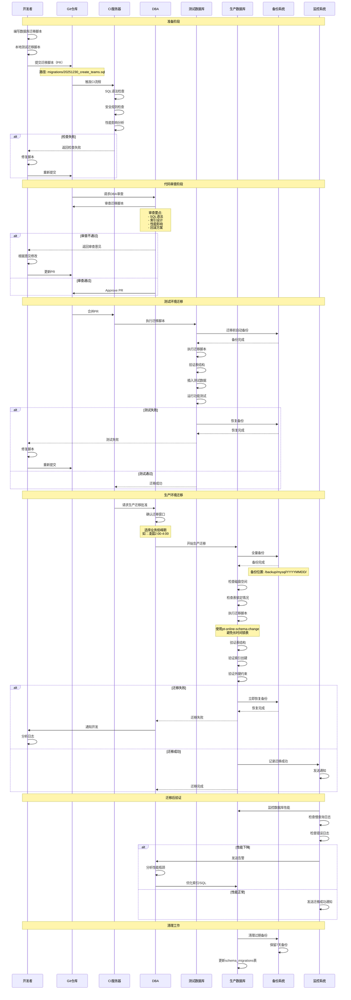
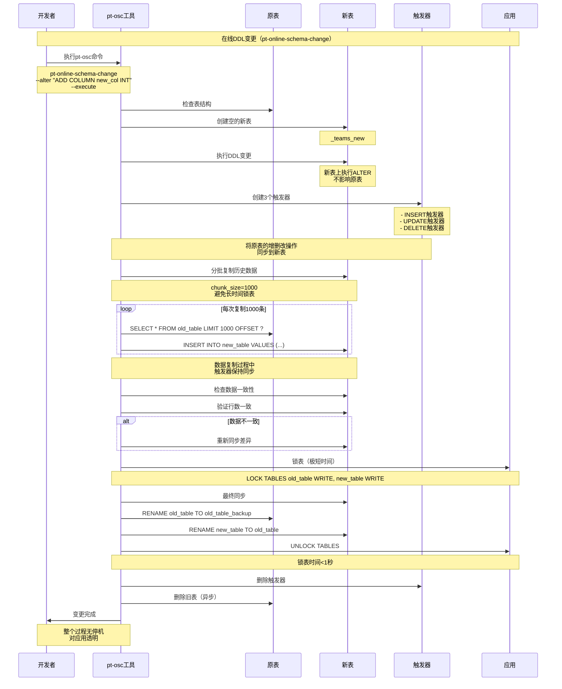
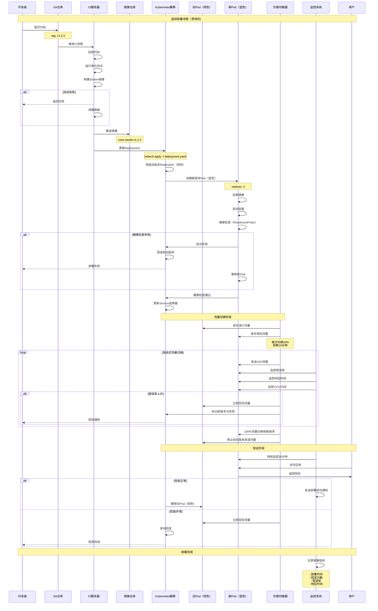
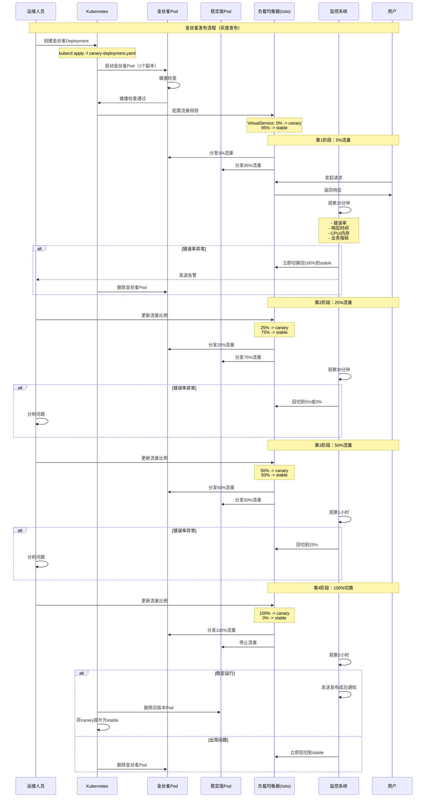
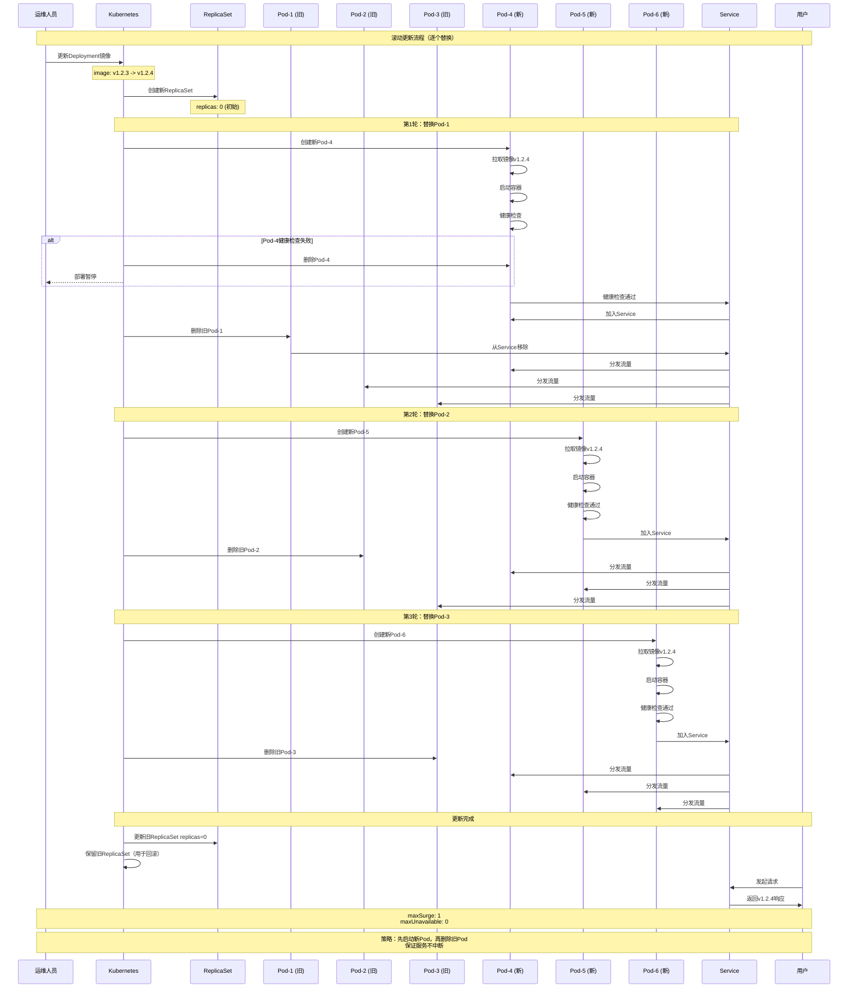
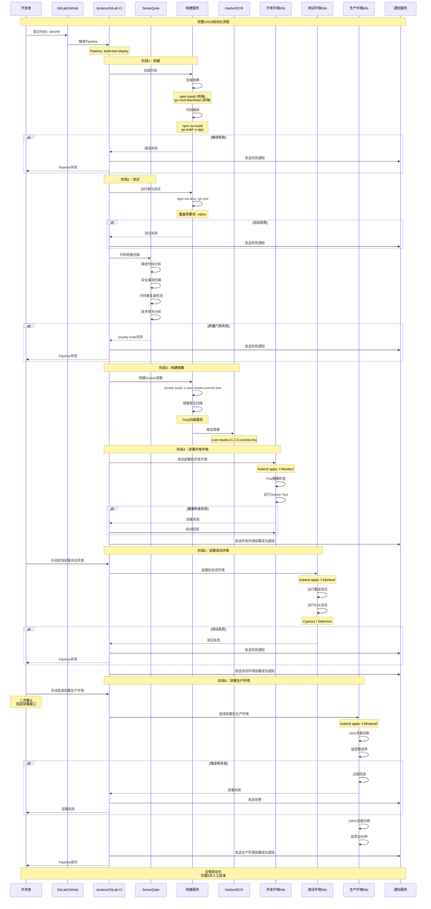
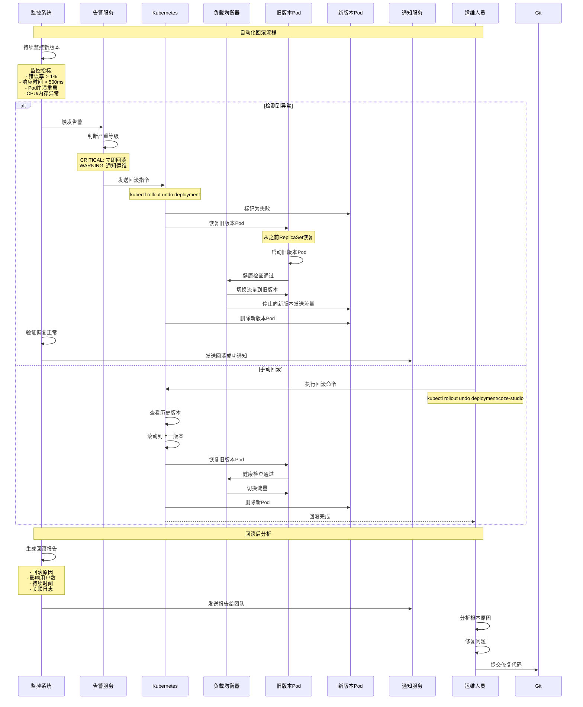
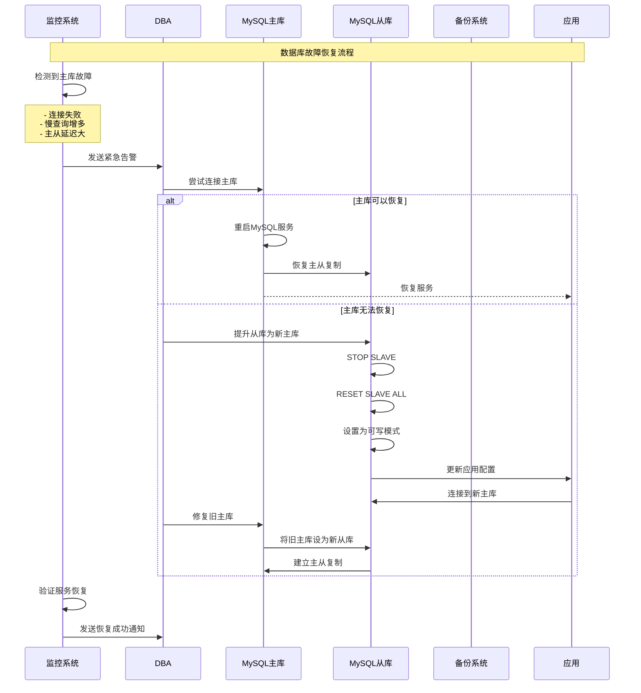

# 数据库迁移与部署流程图

> **文档版本**: v1.0
> **创建日期**: 2025-12-30
> **适用范围**: 运维人员、开发人员、DBA

---

## 目录

1. [数据库迁移脚本](#一数据库迁移脚本)
2. [数据库迁移流程UML](#二数据库迁移流程uml)
3. [应用部署流程UML](#三应用部署流程uml)
4. [CI/CD自动化流程](#四cicd自动化流程)

---

## 一、数据库迁移脚本

### 1.1 团队管理表结构（MySQL 8.4+）

```sql
-- =====================================================
-- 团队管理模块数据库迁移脚本
-- 版本: v1.0.0
-- 日期: 2025-12-30
-- 说明: 创建团队管理相关表（teams、team_members、team_quotas）
-- =====================================================

-- =====================================================
-- 1. 创建teams表（团队主表）
-- =====================================================
CREATE TABLE IF NOT EXISTS `teams` (
    `id` BIGINT NOT NULL AUTO_INCREMENT COMMENT '团队ID',
    `name` VARCHAR(255) NOT NULL COMMENT '团队名称',
    `description` TEXT COMMENT '团队描述',
    `owner_id` BIGINT NOT NULL COMMENT '所有者用户ID',
    `avatar_url` VARCHAR(512) COMMENT '团队头像URL',
    `member_count` INT NOT NULL DEFAULT 1 COMMENT '成员数量',
    `resource_count` INT NOT NULL DEFAULT 0 COMMENT '资源数量（Bot数量）',
    `quota_config` JSON COMMENT '配额配置（JSON格式）',
    `status` VARCHAR(20) NOT NULL DEFAULT 'active' COMMENT '团队状态: active/inactive/deleted',
    `created_at` TIMESTAMP NOT NULL DEFAULT CURRENT_TIMESTAMP COMMENT '创建时间',
    `updated_at` TIMESTAMP NOT NULL DEFAULT CURRENT_TIMESTAMP ON UPDATE CURRENT_TIMESTAMP COMMENT '更新时间',
    `deleted_at` TIMESTAMP NULL COMMENT '删除时间（软删除）',
    PRIMARY KEY (`id`),
    INDEX `idx_owner` (`owner_id`),
    INDEX `idx_deleted` (`deleted_at`),
    INDEX `idx_status` (`status`),
    INDEX `idx_created_at` (`created_at`)
) ENGINE=InnoDB DEFAULT CHARSET=utf8mb4 COLLATE=utf8mb4_unicode_ci COMMENT='团队表';

-- =====================================================
-- 2. 创建team_members表（团队成员表）
-- =====================================================
CREATE TABLE IF NOT EXISTS `team_members` (
    `id` BIGINT NOT NULL AUTO_INCREMENT COMMENT '成员记录ID',
    `team_id` BIGINT NOT NULL COMMENT '团队ID',
    `user_id` BIGINT NOT NULL COMMENT '用户ID',
    `role` VARCHAR(20) NOT NULL DEFAULT 'member' COMMENT '角色: owner/admin/member',
    `permissions` JSON COMMENT '权限配置（JSON格式）',
    `created_at` TIMESTAMP NOT NULL DEFAULT CURRENT_TIMESTAMP COMMENT '加入时间',
    `updated_at` TIMESTAMP NOT NULL DEFAULT CURRENT_TIMESTAMP ON UPDATE CURRENT_TIMESTAMP COMMENT '更新时间',
    PRIMARY KEY (`id`),
    UNIQUE KEY `uk_team_user` (`team_id`, `user_id`),
    INDEX `idx_team` (`team_id`),
    INDEX `idx_user` (`user_id`),
    INDEX `idx_role` (`role`)
) ENGINE=InnoDB DEFAULT CHARSET=utf8mb4 COLLATE=utf8mb4_unicode_ci COMMENT='团队成员表';

-- =====================================================
-- 3. 创建team_quotas表（团队配额表）
-- =====================================================
CREATE TABLE IF NOT EXISTS `team_quotas` (
    `id` BIGINT NOT NULL AUTO_INCREMENT COMMENT '配额ID',
    `team_id` BIGINT NOT NULL COMMENT '团队ID',
    `max_members` INT NOT NULL DEFAULT 10 COMMENT '最大成员数',
    `max_bots` INT NOT NULL DEFAULT 5 COMMENT '最大Bot数量',
    `max_knowledge_base` INT NOT NULL DEFAULT 3 COMMENT '最大知识库数量',
    `storage_quota_gb` INT NOT NULL DEFAULT 10 COMMENT '存储配额（GB）',
    `monthly_api_call` INT NOT NULL DEFAULT 10000 COMMENT '月度API调用次数',
    `created_at` TIMESTAMP NOT NULL DEFAULT CURRENT_TIMESTAMP COMMENT '创建时间',
    `updated_at` TIMESTAMP NOT NULL DEFAULT CURRENT_TIMESTAMP ON UPDATE CURRENT_TIMESTAMP COMMENT '更新时间',
    PRIMARY KEY (`id`),
    UNIQUE KEY `uk_team` (`team_id`)
) ENGINE=InnoDB DEFAULT CHARSET=utf8mb4 COLLATE=utf8mb4_unicode_ci COMMENT='团队配额表';

-- =====================================================
-- 4. 外键约束（可选，根据需要启用）
-- =====================================================
-- ALTER TABLE `team_members`
--     ADD CONSTRAINT `fk_team_members_teams`
--     FOREIGN KEY (`team_id`) REFERENCES `teams` (`id`) ON DELETE CASCADE;

-- ALTER TABLE `team_quotas`
--     ADD CONSTRAINT `fk_team_quotas_teams`
--     FOREIGN KEY (`team_id`) REFERENCES `teams` (`id`) ON DELETE CASCADE;

-- =====================================================
-- 5. 初始化数据（示例）
-- =====================================================
-- 插入默认团队配额模板（可选）
INSERT INTO `team_quotas` (`team_id`, `max_members`, `max_bots`, `max_knowledge_base`, `storage_quota_gb`, `monthly_api_call`)
VALUES
    (0, 10, 5, 3, 10, 10000)  -- 默认配额模板
ON DUPLICATE KEY UPDATE `max_members` = 10;

-- =====================================================
-- 6. 迁移完成标记
-- =====================================================
-- 记录迁移版本
INSERT INTO `schema_migrations` (`version`, `applied_at`)
VALUES ('20251230_create_teams', NOW())
ON DUPLICATE KEY UPDATE `applied_at` = NOW();

-- =====================================================
-- 7. 验证脚本
-- =====================================================
-- 检查表是否创建成功
SELECT
    TABLE_NAME,
    TABLE_ROWS,
    CREATE_TIME
FROM information_schema.TABLES
WHERE TABLE_SCHEMA = DATABASE()
    AND TABLE_NAME IN ('teams', 'team_members', 'team_quotas');

-- 检查索引是否创建成功
SELECT
    TABLE_NAME,
    INDEX_NAME,
    COLUMN_NAME,
    NON_UNIQUE
FROM information_schema.STATISTICS
WHERE TABLE_SCHEMA = DATABASE()
    AND TABLE_NAME IN ('teams', 'team_members', 'team_quotas')
ORDER BY TABLE_NAME, INDEX_NAME, SEQ_IN_INDEX;
```

---

### 1.2 回滚脚本

```sql
-- =====================================================
-- 团队管理模块数据库回滚脚本
-- 版本: v1.0.0
-- 日期: 2025-12-30
-- 说明: 回滚团队管理相关表
-- =====================================================

-- 删除外键约束（如果启用了外键）
-- ALTER TABLE `team_members` DROP FOREIGN KEY `fk_team_members_teams`;
-- ALTER TABLE `team_quotas` DROP FOREIGN KEY `fk_team_quotas_teams`;

-- 删除表（注意：此操作不可逆，请谨慎执行）
DROP TABLE IF EXISTS `team_quotas`;
DROP TABLE IF EXISTS `team_members`;
DROP TABLE IF EXISTS `teams`;

-- 删除迁移版本记录
DELETE FROM `schema_migrations` WHERE `version` = '20251230_create_teams';
```

---

### 1.3 性能优化建议

```sql
-- =====================================================
-- 性能优化脚本
-- =====================================================

-- 1. 为大型团队添加分区（可选）
-- ALTER TABLE `team_members`
--     PARTITION BY HASH (`team_id`)
--     PARTITIONS 8;

-- 2. 为历史数据归档（可选）
-- CREATE TABLE `team_members_archive` LIKE `team_members`;

-- 3. 添加分析表（可选）
CREATE TABLE IF NOT EXISTS `team_statistics` (
    `team_id` BIGINT NOT NULL COMMENT '团队ID',
    `stat_date` DATE NOT NULL COMMENT '统计日期',
    `member_count` INT NOT NULL DEFAULT 0 COMMENT '成员数量',
    `bot_count` INT NOT NULL DEFAULT 0 COMMENT 'Bot数量',
    `api_call_count` INT NOT NULL DEFAULT 0 COMMENT 'API调用次数',
    `storage_used_gb` DECIMAL(10, 2) NOT NULL DEFAULT 0 COMMENT '已用存储（GB）',
    `created_at` TIMESTAMP NOT NULL DEFAULT CURRENT_TIMESTAMP COMMENT '创建时间',
    PRIMARY KEY (`team_id`, `stat_date`),
    INDEX `idx_stat_date` (`stat_date`)
) ENGINE=InnoDB DEFAULT CHARSET=utf8mb4 COLLATE=utf8mb4_unicode_ci COMMENT='团队统计表';

-- 4. 创建存储过程（可选）
DELIMITER $$

CREATE PROCEDURE `update_team_member_count`(IN p_team_id BIGINT)
BEGIN
    UPDATE `teams`
    SET `member_count` = (
        SELECT COUNT(*)
        FROM `team_members`
        WHERE `team_id` = p_team_id
    )
    WHERE `id` = p_team_id;
END$$

DELIMITER ;

-- 5. 创建触发器（可选）
DELIMITER $$

CREATE TRIGGER `trg_team_members_after_insert`
AFTER INSERT ON `team_members`
FOR EACH ROW
BEGIN
    CALL `update_team_member_count`(NEW.`team_id`);
END$$

CREATE TRIGGER `trg_team_members_after_delete`
AFTER DELETE ON `team_members`
FOR EACH ROW
BEGIN
    CALL `update_team_member_count`(OLD.`team_id`);
END$$

DELIMITER ;
```

---

## 二、数据库迁移流程UML

### 2.1 数据库迁移完整流程



---

### 2.2 在线DDL变更流程（无锁变更）



---

## 三、应用部署流程UML

### 3.1 完整部署流程（蓝绿部署）



---

### 3.2 金丝雀发布流程（灰度发布）



---

### 3.3 滚动更新流程



---

## 四、CI/CD自动化流程

### 4.1 完整CI/CD Pipeline



---

### 4.2 自动化回滚流程



---

## 五、部署最佳实践

### 5.1 健康检查配置

```yaml
# Kubernetes健康检查配置示例
apiVersion: apps/v1
kind: Deployment
metadata:
  name: coze-studio
spec:
  replicas: 3
  selector:
    matchLabels:
      app: coze-studio
  template:
    metadata:
      labels:
        app: coze-studio
    spec:
      containers:
      - name: backend
        image: coze-studio:v1.2.3
        ports:
        - containerPort: 8888
        # 存活检查（Liveness Probe）
        livenessProbe:
          httpGet:
            path: /health/live
            port: 8888
          initialDelaySeconds: 30
          periodSeconds: 10
          timeoutSeconds: 5
          failureThreshold: 3
        # 就绪检查（Readiness Probe）
        readinessProbe:
          httpGet:
            path: /health/ready
            port: 8888
          initialDelaySeconds: 10
          periodSeconds: 5
          timeoutSeconds: 3
          failureThreshold: 2
        # 启动探针（Startup Probe）
        startupProbe:
          httpGet:
            path: /health/startup
            port: 8888
          initialDelaySeconds: 0
          periodSeconds: 5
          timeoutSeconds: 3
          failureThreshold: 30
        resources:
          requests:
            memory: "512Mi"
            cpu: "500m"
          limits:
            memory: "1Gi"
            cpu: "1000m"
```

---

### 5.2 配置管理（ConfigMap + Secret）

```yaml
# ConfigMap配置
apiVersion: v1
kind: ConfigMap
metadata:
  name: coze-studio-config
data:
  # 应用配置
  APP_ENV: "production"
  LOG_LEVEL: "info"
  # 数据库配置（非敏感）
  DB_HOST: "mysql.prod.svc.cluster.local"
  DB_PORT: "3306"
  DB_NAME: "coze_studio"
  # Redis配置
  REDIS_HOST: "redis.prod.svc.cluster.local"
  REDIS_PORT: "6379"
---
# Secret配置（敏感信息）
apiVersion: v1
kind: Secret
metadata:
  name: coze-studio-secret
type: Opaque
data:
  # Base64编码的敏感信息
  DB_PASSWORD: cGFzc3dvcmQxMjM=  # password123
  REDIS_PASSWORD: cmVkaXMxMjM=     # redis123
  JWT_SECRET: and0c2VjcmV0MTIz   # jwtsecret123
  API_KEY: YXBpX2tleV9zZWNyZXQ= # api_key_secret
```

---

### 5.3 滚动更新策略

```yaml
apiVersion: apps/v1
kind: Deployment
metadata:
  name: coze-studio
spec:
  replicas: 3
  strategy:
    type: RollingUpdate
    rollingUpdate:
      # 最多可以多创建几个Pod
      maxSurge: 1
      # 最多可以有几个Pod不可用
      maxUnavailable: 0
  selector:
    matchLabels:
      app: coze-studio
  template:
    # ... 省略其他配置
```

---

## 六、故障恢复流程

### 6.1 数据库故障恢复



---

## 七、监控告警配置

### 7.1 Prometheus告警规则

```yaml
# prometheus-rules.yaml
groups:
  - name: coze-studio-alerts
    interval: 30s
    rules:
      # Pod崩溃重启告警
      - alert: PodCrashLooping
        expr: rate(kube_pod_container_status_restarts_total[15m]) > 0
        for: 5m
        labels:
          severity: critical
        annotations:
          summary: "Pod {{ $labels.pod }} 崩溃重启"
          description: "命名空间 {{ $labels.namespace }} 中的 Pod {{ $labels.pod }} 在过去15分钟内重启了 {{ $value }} 次"

      # 错误率告警
      - alert: HighErrorRate
        expr: rate(http_requests_total{status=~"5.."}[5m]) > 0.01
        for: 5m
        labels:
          severity: warning
        annotations:
          summary: "API错误率过高"
          description: "{{ $labels.endpoint }} 的错误率为 {{ $value | humanizePercentage }}"

      # 响应时间告警
      - alert: HighResponseTime
        expr: histogram_quantile(0.95, rate(http_request_duration_seconds_bucket[5m])) > 0.5
        for: 10m
        labels:
          severity: warning
        annotations:
          summary: "API响应时间过长"
          description: "{{ $labels.endpoint }} 的P95响应时间为 {{ $value }}s"

      # CPU使用率告警
      - alert: HighCPUUsage
        expr: rate(container_cpu_usage_seconds_total[5m]) > 0.8
        for: 10m
        labels:
          severity: warning
        annotations:
          summary: "CPU使用率过高"
          description: "容器 {{ $labels.container }} 的CPU使用率为 {{ $value | humanizePercentage }}"

      # 内存使用率告警
      - alert: HighMemoryUsage
        expr: container_memory_usage_bytes / container_spec_memory_limit_bytes > 0.9
        for: 5m
        labels:
          severity: critical
        annotations:
          summary: "内存使用率过高"
          description: "容器 {{ $labels.container }} 的内存使用率为 {{ $value | humanizePercentage }}"
```

---

## 八、总结

本文档提供了完整的数据库迁移和部署流程图，涵盖：

✅ **数据库迁移**
- 完整的SQL迁移脚本
- 回滚脚本
- 性能优化建议
- 在线DDL变更流程（pt-online-schema-change）

✅ **应用部署流程**
- 蓝绿部署（零停机）
- 金丝雀发布（灰度发布）
- 滚动更新
- 自动化回滚

✅ **CI/CD自动化**
- 完整的Pipeline流程
- 代码质量扫描
- 自动化测试
- 环境自动部署

✅ **企业级特性**
- 健康检查配置
- 配置管理（ConfigMap + Secret）
- 故障恢复流程
- 监控告警配置

**可直接用于生产环境的参考实施！**
