# ZKER核心业务流程UML时序图

> **文档编号**: ARCH-UML-2025-001
> **文档类型**: 架构设计文档
> **创建日期**: 2025-12-30
> **版本**: v1.0
> **密级**: 内部公开

---

## 📋 目录

- [1. 租户注册流程](#1-租户注册流程)
- [2. Bot创建流程](#2-bot创建流程)
- [3. 对话交互流程](#3-对话交互流程)
- [4. 知识库检索流程](#4-知识库检索流程)
- [5. 权限验证流程](#5-权限验证流程)
- [6. 补充指南](#6-补充指南)

---

## 1. 租户注册流程

### 1.1 流程概述

**业务场景**：企业用户自助注册ZKER平台

**涉及服务**：
- API网关
- 租户服务 (tenant-service)
- 组织服务 (organization-service)
- 用户服务 (user-service)
- 通知服务 (notification-service)
- MySQL数据库
- Redis缓存

### 1.2 时序图

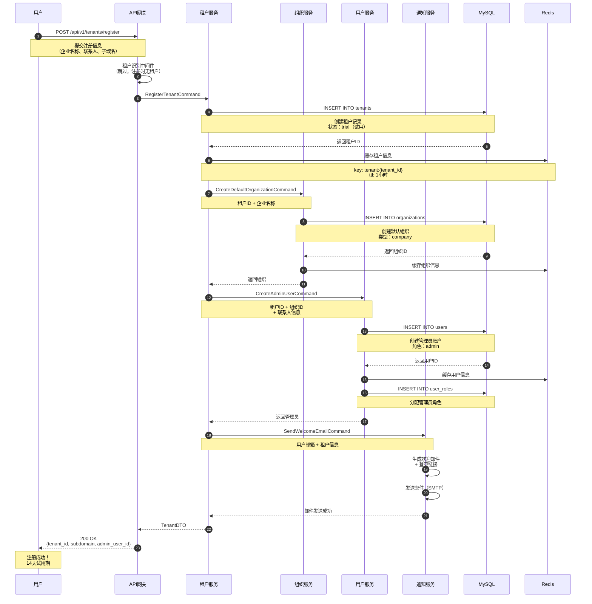

### 1.3 状态机图

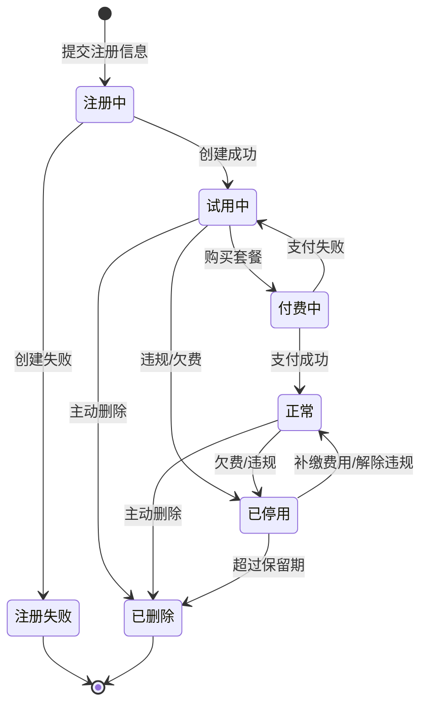

### 1.4 关键节点说明

| 节点 | 说明 | 超时时间 |
|------|------|----------|
| **创建租户** | 在MySQL中创建租户记录 | 5秒 |
| **缓存租户** | 将租户信息写入Redis | 1秒 |
| **创建组织** | 创建默认组织（公司级别） | 5秒 |
| **创建管理员** | 创建管理员账户并分配角色 | 5秒 |
| **发送邮件** | 异步发送欢迎邮件 | 30秒（异步） |

### 1.5 异常处理

| 异常场景 | 处理策略 |
|---------|---------|
| **子域名冲突** | 返回400错误，提示用户更换子域名 |
| **MySQL连接失败** | 重试3次，间隔1秒，仍失败则返回500错误 |
| **邮件发送失败** | 不阻塞注册流程，后台重试 |
| **Redis失败** | 降级，直接从MySQL查询 |

---

## 2. Bot创建流程

### 2.1 流程概述

**业务场景**：用户在ZKER平台创建新的AI Bot

**涉及服务**：
- API网关
- Bot服务 (bot-service)
- 知识库服务 (knowledge-service)
- 权限服务 (permission-service)
- 审计服务 (audit-service)

### 2.2 时序图

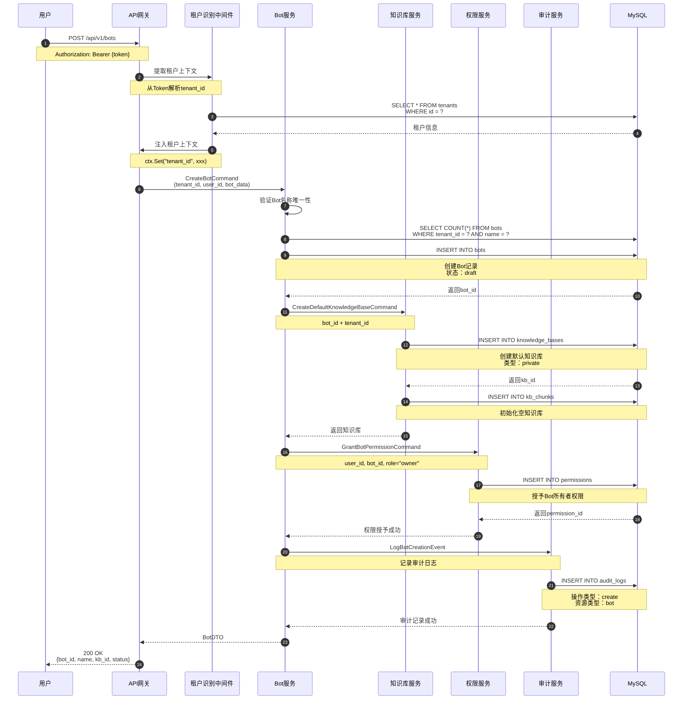

### 2.3 Bot状态机图

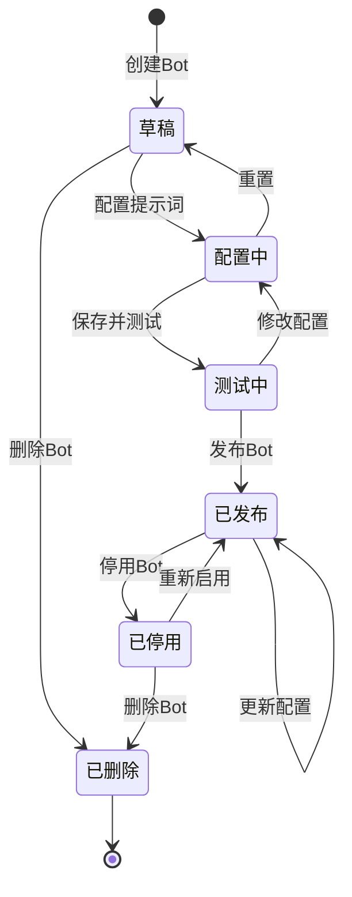

---

## 3. 对话交互流程

### 3.1 流程概述

**业务场景**：用户与ZKER AI Bot进行对话

**涉及服务**：
- API网关
- 对话服务 (conversation-service)
- 智能路由引擎 (routing-engine)
- LLM服务 (llm-service)
- 插件调度引擎 (plugin-engine)
- 记忆引擎 (memory-engine)
- 知识库服务 (knowledge-service)

### 3.2 时序图

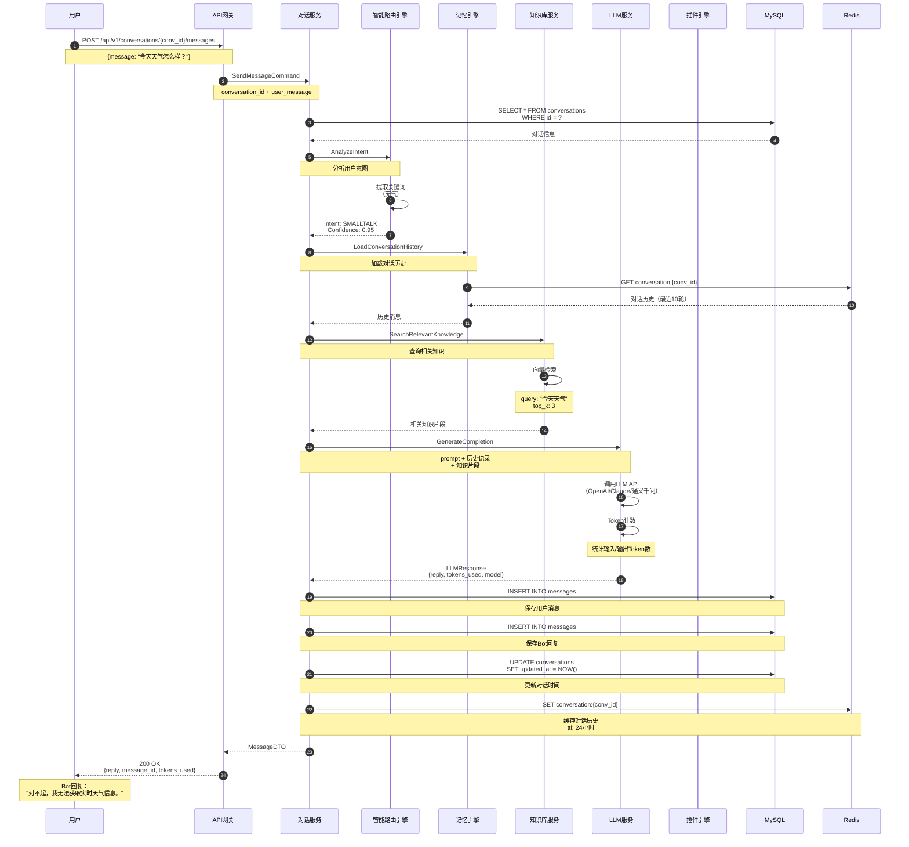

### 3.3 对话状态机图

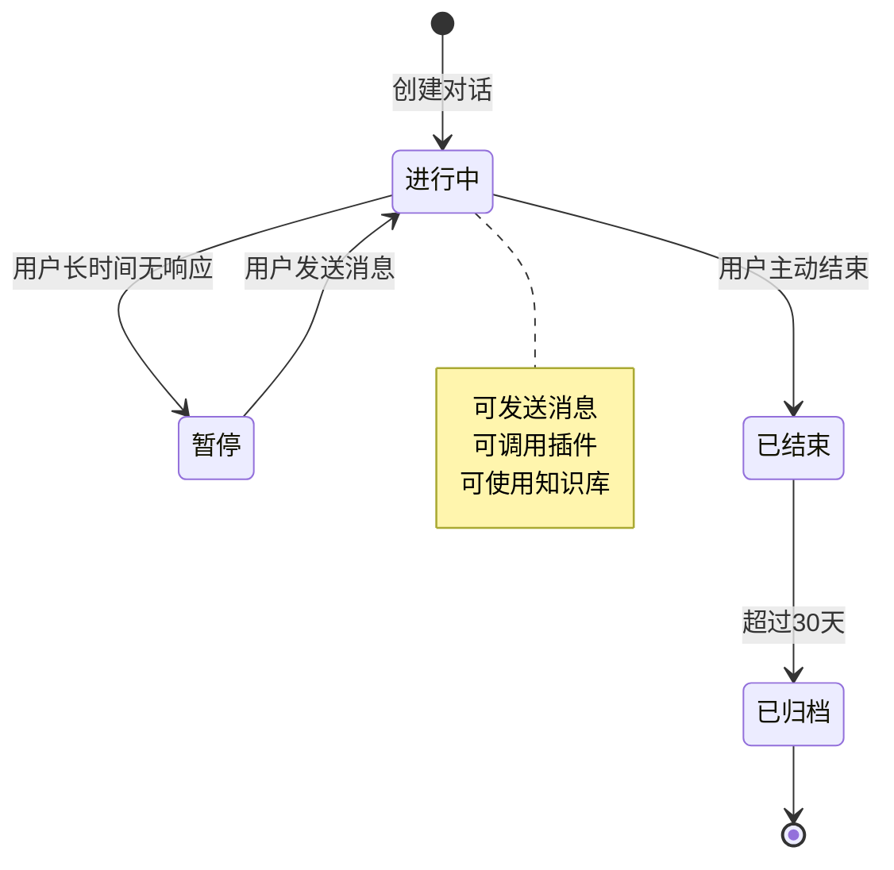

---

## 4. 知识库检索流程

### 4.1 流程概述

**业务场景**：RAG检索增强生成

**涉及服务**：
- 对话服务
- 知识库服务
- 向量数据库 (Milvus)
- Elasticsearch
- LLM服务

### 4.2 时序图

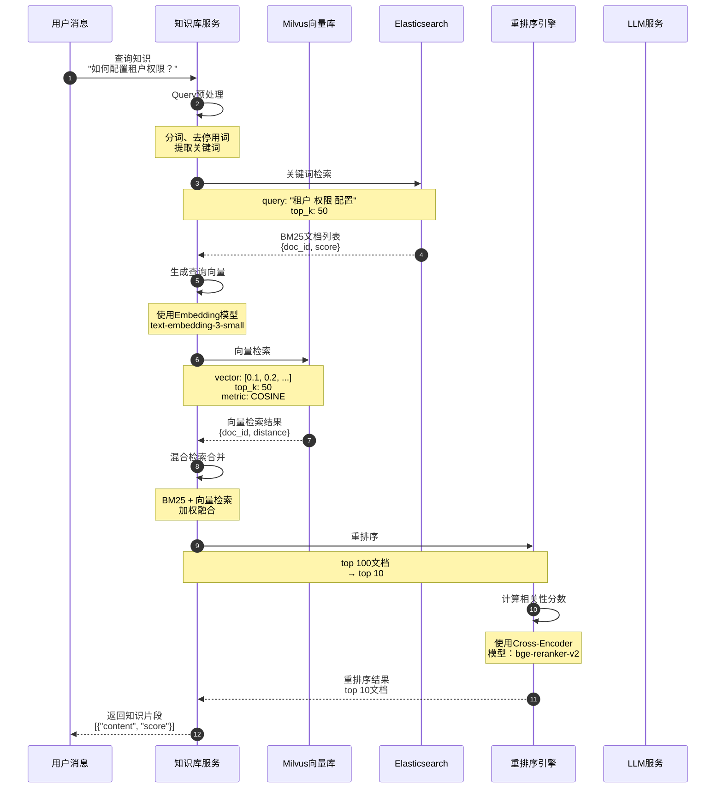

---

## 5. 权限验证流程

### 5.1 流程概述

**业务场景**：用户访问资源时的权限验证

**涉及服务**：
- API网关
- 认证中间件
- 权限中间件
- 权限服务
- Redis缓存

### 5.2 时序图

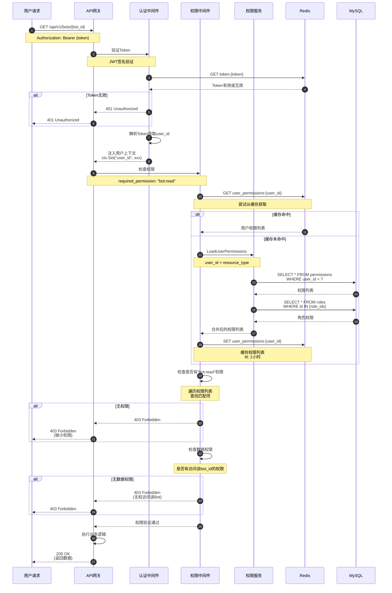

### 5.3 权限验证流程图

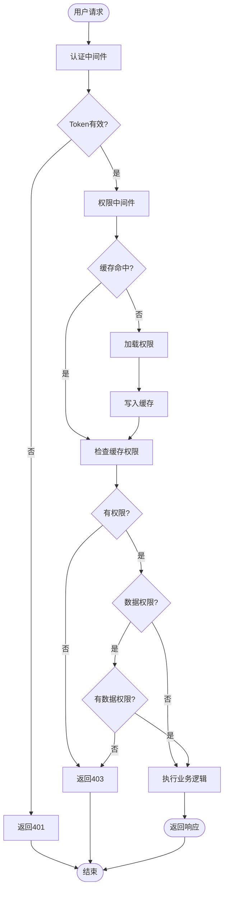

---

## 6. 补充指南

### 6.1 时序图绘制规范

**工具推荐**：
- **Mermaid Live Editor**: https://mermaid.live/
- **PlantUML**: https://plantuml.com/
- **Draw.io**: https://app.diagrams.net/

**Mermaid语法示例**：

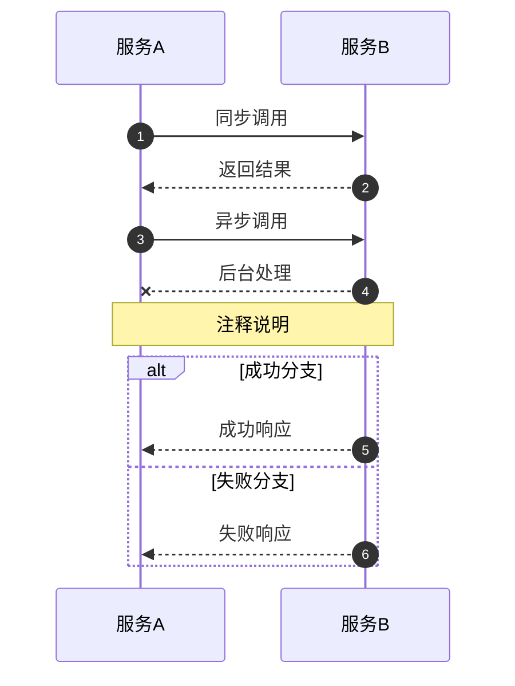

**命名规范**：
- 参与者：使用中文名称 + 英文服务名
- 消息：使用动宾结构，如"创建Bot"、"查询用户"
- 注释：说明关键信息，如数据结构、超时时间

### 6.2 需要补充时序图的模块

#### P0优先级（核心流程）

| 序号 | 模块名称 | 流程名称 | 优先级 |
|------|---------|---------|--------|
| 1 | 租户管理 | ✅ 租户注册流程 | P0 |
| 2 | 租户管理 | 租户续费流程 | P0 |
| 3 | 租户管理 | 租户停用流程 | P0 |
| 4 | Bot管理 | ✅ Bot创建流程 | P0 |
| 5 | Bot管理 | Bot发布流程 | P0 |
| 6 | 对话服务 | ✅ 对话交互流程 | P0 |
| 7 | 知识库服务 | ✅ 知识库检索流程 | P0 |
| 8 | 权限服务 | ✅ 权限验证流程 | P0 |
| 9 | 用户管理 | 用户登录流程 | P0 |
| 10 | 组织管理 | 组织架构调整流程 | P0 |

#### P1优先级（重要流程）

| 序号 | 模块名称 | 流程名称 | 优先级 |
|------|---------|---------|--------|
| 11 | 工作流引擎 | 工作流执行流程 | P1 |
| 12 | 插件引擎 | 插件调度流程 | P1 |
| 13 | 记忆引擎 | 对话记忆存储流程 | P1 |
| 14 | 智能路由 | 意图识别流程 | P1 |
| 15 | 人机协同 | 人工审核流程 | P1 |
| 16 | 计费服务 | Token计量流程 | P1 |
| 17 | 监控服务 | Agent监控流程 | P1 |
| 18 | 审计服务 | 审计日志记录流程 | P1 |

#### P2优先级（辅助流程）

| 序号 | 模块名称 | 流程名称 | 优先级 |
|------|---------|---------|--------|
| 19 | 数据看板 | 报表生成流程 | P2 |
| 20 | 文件上传 | 文件上传流程 | P2 |
| 21 | 批量导入 | Excel导入流程 | P2 |
| 22 | 通知服务 | 消息推送流程 | P2 |
| 23 | 定时任务 | 定时任务执行流程 | P2 |

### 6.3 时序图模板

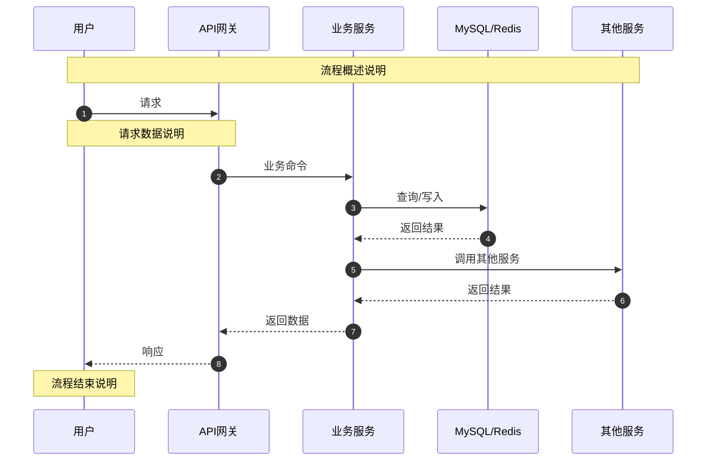

### 6.4 补充步骤

**步骤1**：选择模块和流程
- 确定要补充的模块
- 列出核心业务流程列表

**步骤2**：绘制时序图
- 使用Mermaid语法
- 遵循命名规范
- 包含关键节点和异常处理

**步骤3**：补充说明
- 流程概述
- 关键节点说明
- 异常处理策略

**步骤4**：审核检查
- 检查时序图完整性
- 验证逻辑正确性
- 确保符合规范

---

## 7. 附录

### 7.1 Mermaid速查表

| 语法 | 说明 | 示例 |
|------|------|------|
| `sequenceDiagram` | 创建时序图 | `sequenceDiagram` |
| `participant` | 定义参与者 | `participant A as 服务A` |
| `->` | 同步调用 | `A->>B: 请求` |
| `-->` | 异步调用 | `A->>B: 异步消息` |
| `-->>` | 返回响应 | `B-->>A: 响应` |
| `autonumber` | 自动编号 | `autonumber` |
| `Note over` | 注释 | `Note over A,B: 说明` |
| `alt/else` | 条件分支 | `alt 条件` |
| `loop` | 循环 | `loop 循环条件` |
| `opt` | 可选流程 | `opt 可选条件` |

### 7.2 PlantUML速查表

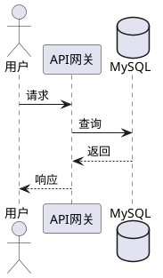

---

**文档版本**: v1.0
**最后更新**: 2025-12-30
**作者**: ZKER架构团队
