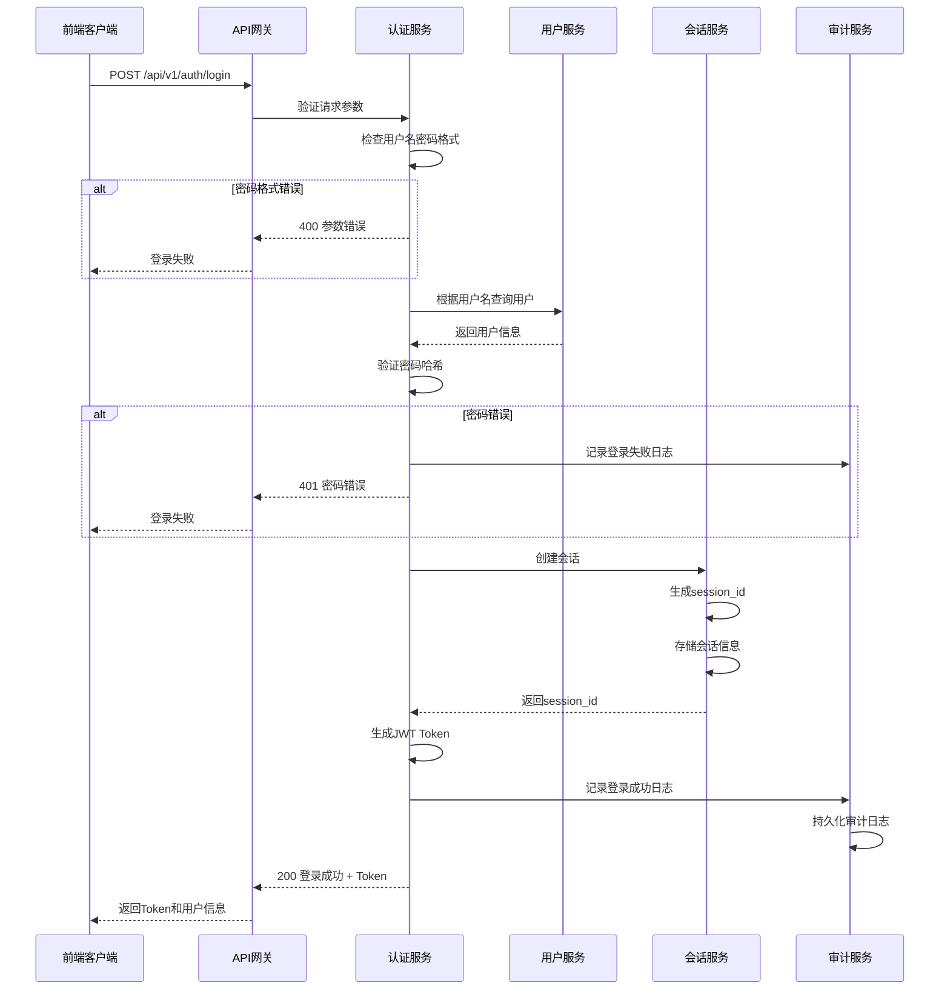
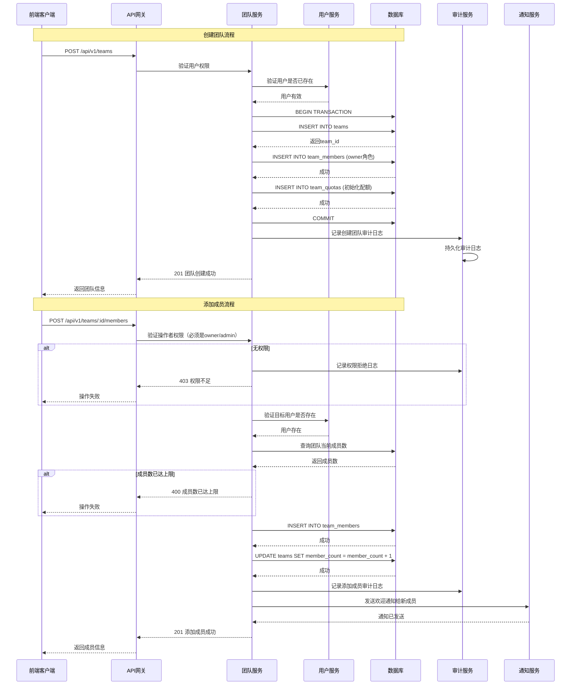
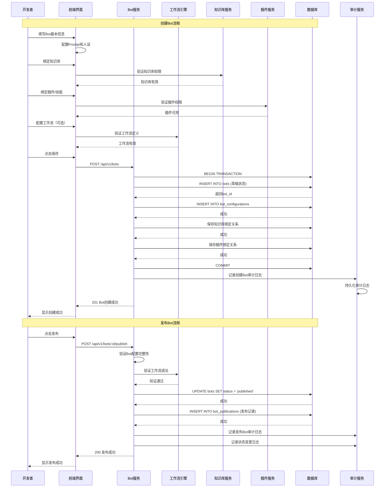
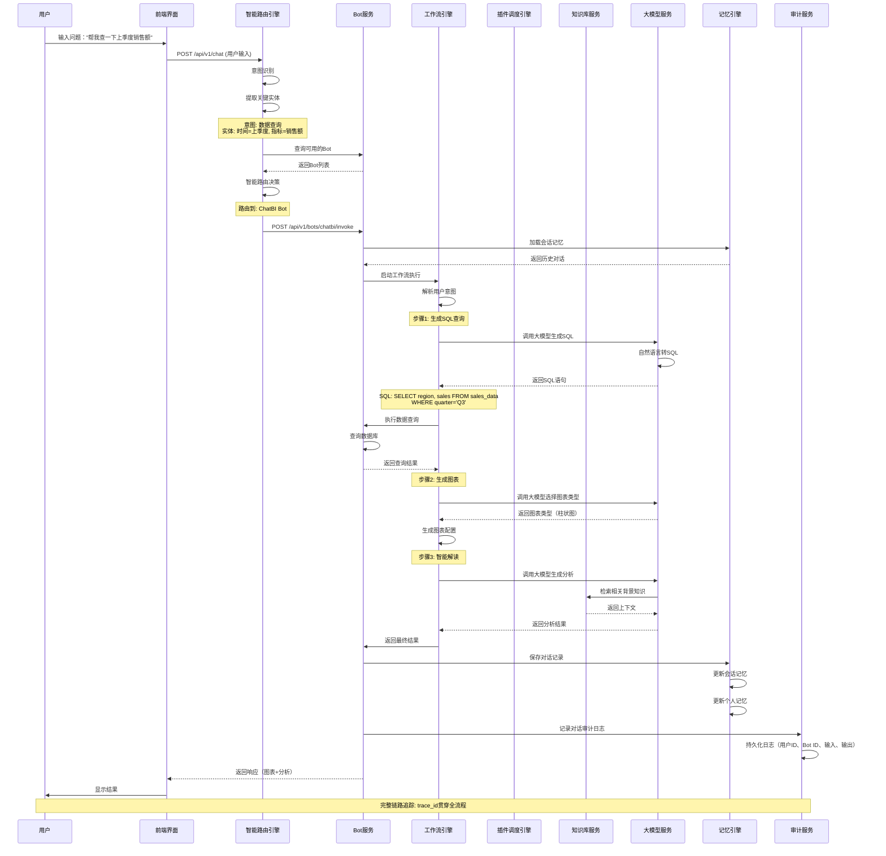
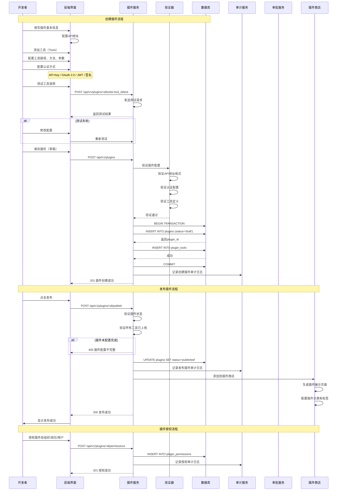
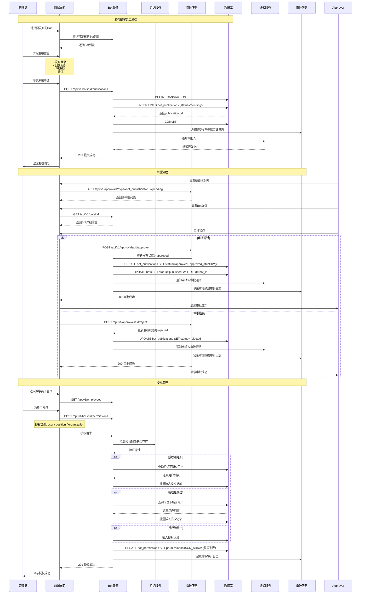
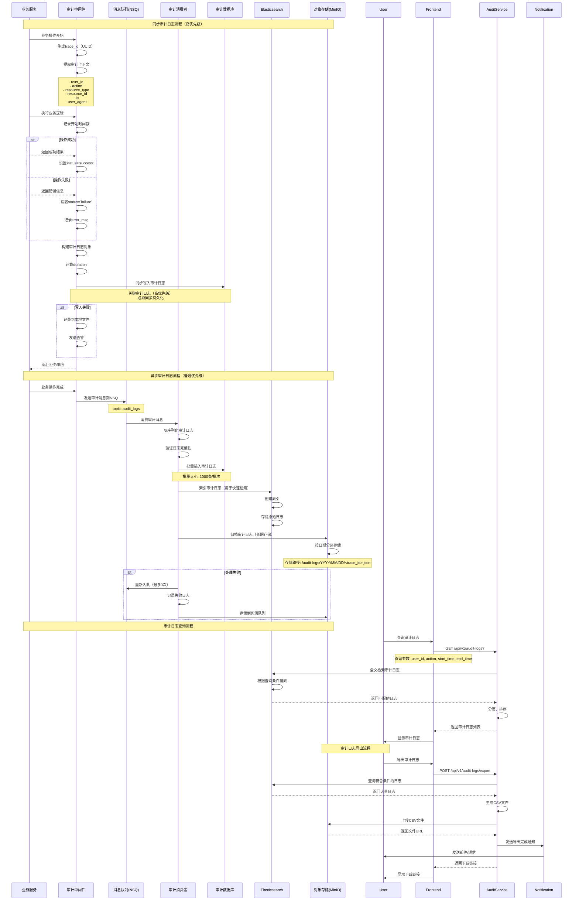
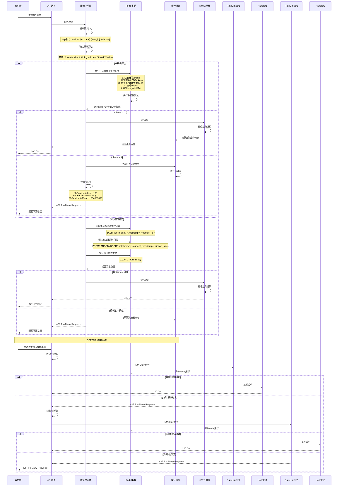
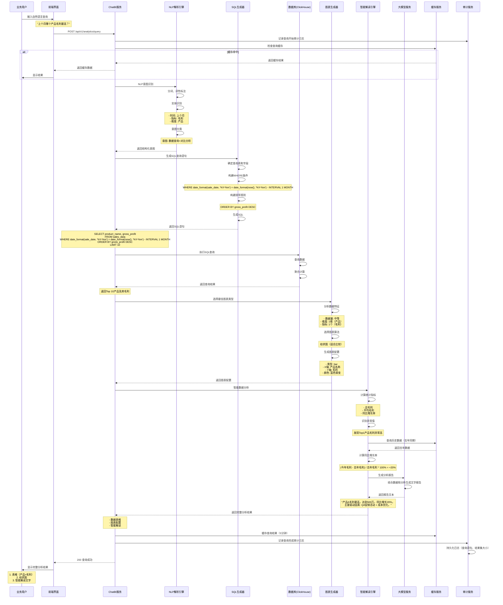
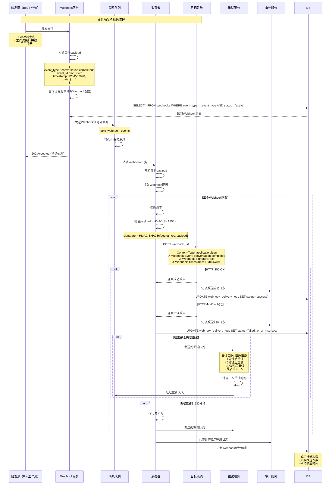

# Coze Studio 统一开发规范与企业级实施注意事项

> **文档版本**: v1.0
> **创建日期**: 2025-12-29
> **适用范围**: 全体开发人员、架构师、技术负责人
> **文档目标**: 确保全局一致性，实现企业级高质量项目完善

---

## 📋 文档说明

本文档整合了以下全部设计文档和规范的核心要点：
- ✅ 企业级功能完善与统一性设计方案
- ✅ Coze商用版与开源版全功能对比分析
- ✅ 代码实现深度分析报告
- ✅ 开发规范总览（2869行完整规范）

**核心原则**：
1. **避免冗余** - 仅保留最核心的规范和注意事项
2. **全局一致性** - 统一命名、架构、API、日志、错误码
3. **企业级质量** - 并发安全、性能优化、可观测性
4. **可操作性** - 提供具体代码示例和实施路径

---

## 一、未实现功能系统性分析

### 1.1 关键功能实现度评估

| **功能模块** | **实现度** | **状态** | **优先级** | **工作量** |
|-------------|-----------|---------|-----------|-----------|
| **多租户/团队协作** | 30% | ⚠️ 基础框架已有 | P0 | 15人天 |
| **审计日志** | 5% | ❌ 几乎未实现 | P0 | 12人天 |
| **限流保护** | 20% | ⚠️ 仅有基础限流 | P0 | 10人天 |
| **监控告警** | 10% | ❌ 缺少完整体系 | P0 | 18人天 |
| **数据分析** | 15% | ❌ 缺少完整体系 | P1 | 25人天 |
| **渠道发布** | 70% | ✅ 基本可用 | P1 | 8人天 |
| **权限系统** | 75% | ✅ RBAC已有 | P1 | 7人天 |
| **Webhook系统** | 0% | ❌ 待开发 | P1 | 8人天 |

### 1.2 P0级别缺失功能（必须实现）

#### 1. 团队协作系统（15人天）

**现状**：
- ✅ Space实体支持个人/团队类型
- ✅ 三级角色定义（Owner/Admin/Member）
- ❌ 缺少完整的成员管理UI
- ❌ 缺少团队资源所有权
- ❌ 缺少团队配额管理

**需要实现**：
```sql
-- teams表完整CRUD
CREATE TABLE teams (
    id BIGINT PRIMARY KEY AUTO_INCREMENT,
    name VARCHAR(255) NOT NULL,
    description TEXT,
    owner_id BIGINT NOT NULL,
    avatar_url VARCHAR(512),
    member_count INT DEFAULT 1,
    resource_count INT DEFAULT 0,
    quota_config JSON,
    created_at TIMESTAMP DEFAULT CURRENT_TIMESTAMP,
    updated_at TIMESTAMP DEFAULT CURRENT_TIMESTAMP ON UPDATE CURRENT_TIMESTAMP,
    deleted_at TIMESTAMP NULL,
    INDEX idx_owner (owner_id),
    INDEX idx_deleted (deleted_at)
) ENGINE=InnoDB DEFAULT CHARSET=utf8mb4;

-- team_members表角色管理
CREATE TABLE team_members (
    id BIGINT PRIMARY KEY AUTO_INCREMENT,
    team_id BIGINT NOT NULL,
    user_id BIGINT NOT NULL,
    role ENUM('owner', 'admin', 'member') DEFAULT 'member',
    permissions JSON,
    created_at TIMESTAMP DEFAULT CURRENT_TIMESTAMP,
    updated_at TIMESTAMP DEFAULT CURRENT_TIMESTAMP ON UPDATE CURRENT_TIMESTAMP,
    UNIQUE KEY uk_team_user (team_id, user_id),
    INDEX idx_team (team_id),
    INDEX idx_user (user_id)
) ENGINE=InnoDB DEFAULT CHARSET=utf8mb4;
```

#### 2. 审计日志系统（12人天）

**现状**：仅有基础日志，缺少标准化审计

**需要实现**：
```sql
-- audit_logs表设计
CREATE TABLE audit_logs (
    id BIGINT PRIMARY KEY AUTO_INCREMENT,
    trace_id VARCHAR(128) NOT NULL,
    user_id BIGINT NOT NULL,
    action VARCHAR(64) NOT NULL,
    resource_type VARCHAR(64),
    resource_id BIGINT,
    details JSON,
    ip VARCHAR(45),
    user_agent TEXT,
    status ENUM('success', 'failure') DEFAULT 'success',
    error_msg TEXT,
    created_at TIMESTAMP DEFAULT CURRENT_TIMESTAMP,
    INDEX idx_user (user_id),
    INDEX idx_action (action),
    INDEX idx_resource (resource_type, resource_id),
    INDEX idx_created (created_at)
) ENGINE=InnoDB DEFAULT CHARSET=utf8mb4;
```

**审计中间件实现**：
```go
// backend/middleware/audit_middleware.go
package middleware

import (
    "context"
    "time"
    "github.com/google/uuid"
)

type AuditMiddleware struct {
    auditLogger AuditLogger
}

func (m *AuditMiddleware) Audit() gin.HandlerFunc {
    return func(c *gin.Context) {
        // 生成trace_id
        traceID := uuid.New().String()
        c.Set("trace_id", traceID)

        // 获取用户信息
        userID := c.GetUint64("user_id")

        // 记录请求开始
        start := time.Now()

        // 处理请求
        c.Next()

        // 记录审计日志
        m.auditLogger.Log(&AuditLog{
            TraceID:      traceID,
            UserID:       userID,
            Action:       c.Request.Method + " " + c.Request.URL.Path,
            ResourceID:   c.Param("id"),
            Status:       getStatusCode(c.Writer.Status()),
            IP:           c.ClientIP(),
            UserAgent:    c.Request.UserAgent(),
            CreatedAt:    time.Now(),
        })
    }
}
```

#### 3. 分布式限流系统（10人天）

**现状**：仅有单机限流，缺少分布式实现

**需要实现**：
```go
// backend/rate_limiter/token_bucket.go
package rate_limiter

import (
    "context"
    "time"
    "github.com/go-redis/redis/v8"
)

type TokenBucketLimiter struct {
    redis      *redis.Client
    capacity   int64     // 桶容量
    rate       int64     // 令牌生成速率（每秒）
    window     time.Duration
}

func NewTokenBucketLimiter(redis *redis.Client, capacity, rate int64) *TokenBucketLimiter {
    return &TokenBucketLimiter{
        redis:    redis,
        capacity: capacity,
        rate:     rate,
        window:   time.Second,
    }
}

func (l *TokenBucketLimiter) Allow(ctx context.Context, key string) (bool, error) {
    // 使用Redis实现令牌桶
    now := time.Now().Unix()

    // Lua脚本保证原子性
    script := `
        local key = KEYS[1]
        local now = tonumber(ARGV[1])
        local capacity = tonumber(ARGV[2])
        local rate = tonumber(ARGV[3])

        local bucket = redis.call('HMGET', key, 'tokens', 'last_refill')
        local tokens = tonumber(bucket[1]) or capacity
        local last_refill = tonumber(bucket[2]) or now

        -- 计算需要补充的令牌数
        local elapsed = now - last_refill
        tokens = math.min(capacity, tokens + elapsed * rate)

        -- 检查是否有足够令牌
        if tokens >= 1 then
            tokens = tokens - 1
            redis.call('HMSET', key, 'tokens', tokens, 'last_refill', now)
            redis.call('EXPIRE', key, 3600)
            return 1
        else
            return 0
        end
    `

    result, err := l.redis.Eval(ctx, script, []string{key}, now, l.capacity, l.rate).Result()
    if err != nil {
        return false, err
    }

    return result.(int64) == 1, nil
}
```

#### 4. 监控告警体系（18人天）

**现状**：仅有基础Prometheus暴露，缺少业务指标

**需要实现**：

**业务Metrics定义**：
```go
// backend/metrics/business_metrics.go
package metrics

import (
    "github.com/prometheus/client_golang/prometheus"
    "github.com/prometheus/client_golang/prometheus/promauto"
)

var (
    // 对话次数
    ConversationTotal = promauto.NewCounterVec(
        prometheus.CounterOpts{
            Name: "conversation_total",
            Help: "Total number of conversations",
        },
        []string{"bot_id", "status"},
    )

    // Token消耗
    TokenConsumptionTotal = promauto.NewCounterVec(
        prometheus.CounterOpts{
            Name: "token_consumption_total",
            Help: "Total token consumption",
        },
        []string{"model", "bot_id"},
    )

    // API请求延迟
    APILatencyHistogram = promauto.NewHistogramVec(
        prometheus.HistogramOpts{
            Name:    "api_latency_seconds",
            Help:    "API request latency",
            Buckets: []float64{0.1, 0.5, 1, 2, 5, 10},
        },
        []string{"endpoint", "method"},
    )

    // 错误率
    ErrorTotal = promauto.NewCounterVec(
        prometheus.CounterOpts{
            Name: "error_total",
            Help: "Total number of errors",
        },
        []string{"type", "module"},
    )
)
```

---

## 二、统一开发规范核心要点

### 2.1 命名规范（严格遵循）

#### TypeScript 命名规范

**文件命名规范**：
| 文件类型 | 命名规则 | 示例 |
|---------|---------|------|
| 组件文件 | `kebab-case.tsx` | `user-profile.tsx` |
| Hooks 文件 | `use-{purpose}.ts` | `use-auth-form.ts` |
| 工具函数 | `kebab-case.ts` | `format-date.ts` |
| 类型定义 | `{entity}.types.ts` | `user.types.ts` |
| 常量定义 | `{module}.constants.ts` | `api.constants.ts` |
| 测试文件 | `{filename}.test.ts` | `use-auth.test.ts` |

**变量命名规范**：
```typescript
// ✅ 常量：UPPER_SNAKE_CASE
const MAX_RETRY_COUNT = 3;
const DEFAULT_PAGE_SIZE = 20;
const API_BASE_URL = 'https://api.example.com';

// ✅ 普通变量/函数：camelCase
let userName = 'John';
const isActive = true;
function getUserInfo() {}

// ✅ 类/接口/类型：PascalCase
class UserService {}
interface UserProfile {}
type UserRole = 'admin' | 'user';

// ✅ 私有变量：_camelCase（前缀下划线）
class AuthService {
  private _token: string;
  private _refreshToken: string;
}

// ✅ 布尔值：is/has/can/should前缀
const isLoading = false;
const hasPermission = true;
const canEdit = false;
const shouldUpdate = true;
```

**函数命名规范**（动词-名词模式）：
```typescript
// 数据获取类
function getUserById(id: number): User {}
async function fetchUserData(id: number): Promise<User> {}

// 数据修改类
function setUserName(name: string): void {}
function updateUserProfile(id: number, data: Partial<User>): User {}
function createNewUser(data: CreateUserData): User {}
function deleteUserById(id: number): boolean {}

// 事件处理类
function handleSubmit(event: FormEvent): void {}
function handleInputChange(event: ChangeEvent): void {}
function onSuccess(response: ApiResponse): void {}

// 布尔判断类
function isValidUser(user: User): boolean {}
function hasPermission(user: User, permission: string): boolean {}
function canEditResource(user: User, resource: Resource): boolean {}

// 数据处理类
function validateEmail(email: string): ValidationResult {}
function formatDate(date: Date): string {}
function parseJSON<T>(json: string): T {}
```

**React组件命名规范**：
```typescript
// ✅ 组件名：PascalCase
function UserProfileCard() {}
function UserList() {}

// ✅ 自定义Hook：use前缀 + PascalCase
function useUserData() {}
function useAuthForm() {}

// ✅ 文件名：kebab-case.tsx
// user-profile.tsx
// user-list.tsx
```

**Zustand Store命名规范**：
```typescript
// ✅ Store命名：{模块名}Store
const useUserStore = create<UserState>((set) => ({...}));
const useAgentStore = create<AgentState>((set) => ({...}));

// ✅ Store文件名：{domain}-store.ts 或 {domain}.store.ts
// user-store.ts
// agent.store.ts
```

#### Go 命名规范

**文件命名规范**：
| 文件类型 | 命名规则 | 示例 |
|---------|---------|------|
| 包目录 | `lowercase` | `service`, `repository`, `handler` |
| Go源文件 | `lowercase.go` | `user.go`, `agent_service.go` |
| 测试文件 | `{filename}_test.go` | `user_test.go`, `service_test.go` |
| 接口文件 | `interface.go` 或 `{domain}.go` | `interface.go`, `user.go` |

**包命名规范**：
```go
// ✅ 简洁清晰的包名
package service
package repository
package entity
package handler
package middleware
package config
package util

// ❌ 错误示例
package userService       // 应使用 service
package user_repository   // 应使用 repository
package UserManagement    // 应使用小写
```

**变量命名规范**：
```go
// ✅ 导出常量 - PascalCase
const (
    MaxRetryCount = 3
    DefaultPageSize = 20
    APITimeout = 30 * time.Second
)

// ✅ 内部常量 - camelCase
const (
    defaultTimeout = 10 * time.Second
    maxConnections = 100
)

// ✅ 局部变量 - camelCase
func processUser() {
    userID := 123
    userName := "John"
    isActive := true
    createdAt := time.Now()

    // ✅ 缩写词保持一致
    userID := 123      // 不是 userId
    httpURL := "https://api.example.com"
    xmlData := []byte{}
}
```

**函数/方法命名规范**（动词-名词模式）：
```go
// ✅ Get - 获取数据（无副作用）
func (s *UserService) GetUserByID(id int64) (*User, error) {}
func (s *UserService) GetUserList(params QueryParams) ([]*User, error) {}

// ✅ Create - 创建新资源
func (s *UserService) CreateUser(req *CreateUserRequest) (*User, error) {}

// ✅ Update - 更新资源（部分或全部）
func (s *UserService) UpdateUser(id int64, req *UpdateUserRequest) error {}

// ✅ Delete - 删除资源
func (s *UserService) DeleteUser(id int64) error {}

// ✅ Validate - 验证数据
func (s *UserService) ValidateUserData(data *UserData) error {}

// ✅ Is/Has/Can - 布尔判断
func (s *UserService) IsUserActive(userID int64) (bool, error) {}
func (s *UserService) HasPermission(userID int64, resource string) (bool, error) {}

// ✅ Handle - 处理请求
func (h *Handler) HandleCreateUser(ctx context.Context, req *Request) (*Response, error) {}
```

**方法接收者命名**：
```go
// ✅ 使用一致的单字母缩写
func (u *User) Save() error {}
func (s *UserService) CreateUser(req *CreateUserRequest) (*User, error) {}
func (r *UserRepository) FindByID(id int64) (*User, error) {}
func (h *UserHandler) HandleCreate(ctx context.Context, req *Request) (*Response, error) {}

// 常用缩写
u - User
s - Service
r - Repository
h - Handler
c - Config
ctx - context
req - request
res/resp - response
```

**接口定义规范**：
```go
// ✅ 接口命名 - 动词+er 名词 或 功能描述
type UserRepository interface {
    FindByID(ctx context.Context, id int64) (*User, error)
    FindByEmail(ctx context.Context, email string) (*User, error)
    Create(ctx context.Context, user *User) error
    Update(ctx context.Context, user *User) error
    Delete(ctx context.Context, id int64) error
}

// ✅ 接口实现命名 - {interface}Impl
type userServiceImpl struct {
    repo UserRepository
    db   *gorm.DB
}

func NewUserService(repo UserRepository, db *gorm.DB) UserService {
    return &userServiceImpl{
        repo: repo,
        db:   db,
    }
}

// ❌ 不使用 I 前缀
type IUserRepository interface {}  // 错误
```

#### 数据库命名规范

```sql
-- ✅ 表名：小写，下划线分隔，复数形式
teams
team_members
audit_logs

-- ✅ 列名：小写，下划线分隔
id
user_id
created_at
is_active

-- ✅ 索引名：idx_{表名}_{列名}
idx_teams_owner_id
idx_audit_logs_created_at

-- ✅ 外键名：fk_{表名}_{引用表名}_{列名}
fk_team_members_teams_team_id

-- ✅ 唯一索引：uk_{表名}_{列名}
uk_users_email
```

### 2.2 架构分层规范（DDD严格遵循）

```go
// ✅ 后端 DDD 分层目录结构
backend/
├── domain/              # 领域层（核心业务逻辑）
│   ├── user/           # 用户领域
│   │   ├── entity/     # 实体
│   │   ├── repository/ # 仓储接口
│   │   └── service/    # 领域服务
│   ├── agent/
│   └── workflow/
│
├── application/         # 应用层（用例编排）
│   └── user/
│       └── user_app_service.go
│
├── infra/              # 基础设施层（技术实现）
│   ├── repository/     # 仓储实现
│   │   └── user_repository_impl.go
│   └── database/       # 数据库连接
│
└── api/                # 接口层（HTTP路由）
    └── http/
        └── user_handler.go
```

**关键原则**：
- ✅ **依赖方向**：api → application → domain ← infra
- ✅ **domain层不依赖任何外层**，保持纯净
- ✅ **接口定义在domain层**，实现在infra层
- ✅ **业务逻辑聚合在domain service**，不在handler

### 2.3 API 设计规范

```go
// ✅ 统一响应结构
type Response struct {
    Code    int         `json:"code"`              // 业务状态码
    Message string      `json:"message"`           // 提示信息
    Data    interface{} `json:"data,omitempty"`    // 业务数据
    TraceID string      `json:"trace_id,omitempty"` // 追踪ID
}

type PageResponse struct {
    Code    int         `json:"code"`
    Message string      `json:"message"`
    Data    interface{} `json:"data"`
    Total   int64       `json:"total"`       // 总数
    Page    int         `json:"page"`        // 当前页
    PageSize int        `json:"page_size"`   // 每页数量
}

// ✅ 错误码规范：{模块}{类型}{具体错误}
const (
    // 通用错误 1xxxx
    ErrCodeSuccess         = 0
    ErrCodeInvalidParams   = 10001
    ErrCodeUnauthorized    = 10002
    ErrCodeForbidden       = 10003
    ErrCodeNotFound        = 10004
    ErrCodeInternalError   = 10005
    ErrCodeRateLimitExceeded = 10006

    // 用户模块 2xxxx
    ErrCodeUserNotFound      = 20001
    ErrCodeUserAlreadyExists = 20002

    // 团队模块 3xxxx
    ErrCodeTeamNotFound      = 30001
    ErrCodeTeamNameDuplicate = 30002
)

// ✅ RESTful 路由设计
GET    /api/v1/teams              # 获取团队列表
GET    /api/v1/teams/:id          # 获取团队详情
POST   /api/v1/teams              # 创建团队
PUT    /api/v1/teams/:id          # 更新团队
DELETE /api/v1/teams/:id          # 删除团队
```

### 2.4 日志规范

```go
// ✅ 使用结构化日志
import "go.uber.org/zap"

// ✅ 日志级别使用规范
logger.Debug("调试信息")                    // 开发环境使用
logger.Info("业务信息", zap.String("user_id", userID))  // 重要业务流程
logger.Warn("警告信息")                    // 异常但可恢复
logger.Error("错误信息", zap.Error(err))   // 错误

// ✅ 日志必须包含字段
- trace_id: 链路追踪ID
- user_id: 用户ID
- action: 操作行为
- resource: 操作资源
- duration: 耗耗时（毫秒）
- error: 错误信息（如有）

// ✅ 日志示例
logger.Info("创建团队",
    zap.String("trace_id", traceID),
    zap.String("user_id", userID),
    zap.String("action", "create_team"),
    zap.String("team_name", teamName),
    zap.Int64("team_id", teamID),
    zap.Int64("duration", time.Since(start).Milliseconds()),
)

// ✅ 审计日志（必须持久化）
logger.Audit("删除团队成员",
    zap.String("trace_id", traceID),
    zap.String("operator_id", operatorID),
    zap.String("action", "delete_team_member"),
    zap.String("team_id", teamID),
    zap.String("target_user_id", targetUserID),
    zap.String("ip", clientIP),
    zap.Int64("timestamp", time.Now().Unix()),
)
```

### 2.5 数据库操作规范（GORM）

```go
// ✅ Model 定义规范
type Team struct {
    ID        int64     `gorm:"column:id;primaryKey;autoIncrement" json:"id"`
    Name      string    `gorm:"column:name;type:varchar(255);not null" json:"name"`
    OwnerID   int64     `gorm:"column:owner_id;not null;index:idx_owner" json:"owner_id"`
    CreatedAt time.Time `gorm:"column:created_at;autoCreateTime" json:"created_at"`
    UpdatedAt time.Time `gorm:"column:updated_at;autoUpdateTime" json:"updated_at"`
    DeletedAt *time.Time `gorm:"column:deleted_at;index" json:"deleted_at,omitempty"`
}

// ✅ 指定表名
func (Team) TableName() string {
    return "teams"
}

// ✅ 使用事务保证一致性
func (s *TeamService) CreateTeamWithOwner(ctx context.Context, req *CreateTeamRequest) error {
    return s.db.WithContext(ctx).Transaction(func(tx *gorm.DB) error {
        // 创建团队
        team := &entity.Team{
            Name:    req.Name,
            OwnerID: req.OwnerID,
        }
        if err := tx.Create(team).Error; err != nil {
            return err
        }

        // 添加所有者为成员
        member := &entity.TeamMember{
            TeamID:  team.ID,
            UserID:  req.OwnerID,
            Role:    RoleOwner,
        }
        if err := tx.Create(member).Error; err != nil {
            return err
        }

        return nil
    })
}
```

### 2.6 前端React组件规范

```typescript
// ✅ 函数式组件（禁止类组件）
interface UserProfileProps {
  userId: string;
  onUpdate?: (user: User) => void;
}

export function UserProfile({ userId, onUpdate }: UserProfileProps) {
  // ✅ Hooks 调用顺序固定
  const [user, setUser] = useState<User | null>(null);
  const [loading, setLoading] = useState(false);
  const { t } = useTranslation();

  // ✅ 自定义Hook
  const { data, error } = useUserData(userId);

  // ✅ 副作用使用useEffect
  useEffect(() => {
    setLoading(true);
    fetchUser(userId).then(u => {
      setUser(u);
      setLoading(false);
    });
  }, [userId]);

  // ✅ 事件处理函数
  const handleUpdate = (newData: User) => {
    setUser(newData);
    onUpdate?.(newData);
  };

  if (loading) return <Spin />;
  if (error) return <ErrorMessage error={error} />;
  if (!user) return <Empty />;

  return (
    <div className="user-profile">
      <Avatar src={user.avatar} size="large" />
      <Typography.Title>{user.name}</Typography.Title>
      {user.description && <p>{user.description}</p>}
    </div>
  );
}
```

### 2.7 状态管理规范（Zustand）

```typescript
// ✅ Store 定义
import { create } from 'zustand';
import { devtools } from 'zustand/middleware';

interface UserState {
  // 状态定义
  currentUser: User | null;
  isAuthenticated: boolean;

  // Actions
  setUser: (user: User) => void;
  logout: () => void;
  updateUser: (updates: Partial<User>) => void;
}

// ✅ Store 命名：use{模块名}Store
export const useUserStore = create<UserState>()(
  devtools((set, get) => ({
    // 初始状态
    currentUser: null,
    isAuthenticated: false,

    // Actions 实现
    setUser: (user) => set({
      currentUser: user,
      isAuthenticated: true
    }, false, 'setUser'),

    logout: () => set({
      currentUser: null,
      isAuthenticated: false
    }, false, 'logout'),

    updateUser: (updates) => set((state) => ({
      currentUser: state.currentUser
        ? { ...state.currentUser, ...updates }
        : null
    }), false, 'updateUser'),
  }))
);
```

---

## 三、企业级开发注意事项

### 3.1 并发安全注意事项

```go
// ✅ 使用分布式锁（Redis）
func (s *TeamService) AddMember(ctx context.Context, teamID int64, userID int64) error {
    // 获取分布式锁
    lockKey := fmt.Sprintf("team:lock:%d", teamID)
    lock, err := s.redisClient.Obtain(ctx, lockKey, 10*time.Second, nil)
    if err != nil {
        return errors.New("系统繁忙，请稍后重试")
    }
    defer lock.Release()

    // 检查成员数量限制
    var memberCount int64
    err = s.db.WithContext(ctx).
        Model(&entity.TeamMember{}).
        Where("team_id = ?", teamID).
        Count(&memberCount).Error
    if err != nil {
        return err
    }

    if memberCount >= 100 {
        return errors.New("团队成员数量已达上限")
    }

    // 添加成员
    return s.teamMemberRepo.Create(ctx, &entity.TeamMember{
        TeamID: teamID,
        UserID: userID,
    })
}

// ✅ 使用乐观锁
func (r *TeamRepositoryImpl) UpdateMemberCount(ctx context.Context, teamID int64) error {
    result := r.db.WithContext(ctx).
        Model(&entity.Team{}).
        Where("id = ?", teamID).
        Update("member_count", gorm.Expr("member_count + ?", 1))

    return result.Error
}
```

### 3.2 性能优化注意事项

```go
// ✅ 批量查询避免N+1问题
func (r *AgentRepositoryImpl) GetAgentsByUserIDs(ctx context.Context, userIDs []int64) (map[int64][]*entity.Agent, error) {
    var agents []*entity.Agent
    err := r.db.WithContext(ctx).
        Where("created_by IN ?", userIDs).
        Find(&agents).Error
    if err != nil {
        return nil, err
    }

    // 按用户ID分组
    result := make(map[int64][]*entity.Agent)
    for _, agent := range agents {
        result[agent.CreatedBy] = append(result[agent.CreatedBy], agent)
    }

    return result, nil
}

// ✅ 使用缓存减少数据库查询
func (s *UserService) GetUser(ctx context.Context, userID int64) (*entity.User, error) {
    // 先查缓存
    cacheKey := fmt.Sprintf("user:%d", userID)
    cached, err := s.cache.Get(ctx, cacheKey)
    if err == nil && cached != nil {
        var user entity.User
        if json.Unmarshal([]byte(cached), &user) == nil {
            return &user, nil
        }
    }

    // 缓存未命中，查数据库
    user, err := s.userRepo.GetByID(ctx, userID)
    if err != nil {
        return nil, err
    }

    // 写入缓存（5分钟过期）
    data, _ := json.Marshal(user)
    s.cache.Set(ctx, cacheKey, string(data), 5*time.Minute)

    return user, nil
}

// ✅ 分页查询
func (r *TeamRepositoryImpl) ListTeams(ctx context.Context, req *ListTeamsRequest) ([]*entity.Team, int64, error) {
    var teams []*entity.Team
    var total int64

    query := r.db.WithContext(ctx).Model(&entity.Team{}).Where("deleted_at IS NULL")

    // 添加查询条件
    if req.OwnerID > 0 {
        query = query.Where("owner_id = ?", req.OwnerID)
    }
    if req.Keyword != "" {
        query = query.Where("name LIKE ?", "%"+req.Keyword+"%")
    }

    // 统计总数
    if err := query.Count(&total).Error; err != nil {
        return nil, 0, err
    }

    // 分页查询
    err := query.
        Offset((req.Page - 1) * req.PageSize).
        Limit(req.PageSize).
        Order("created_at DESC").
        Find(&teams).Error

    return teams, total, err
}
```

### 3.3 安全注意事项

```go
// ✅ SQL注入防护（使用参数化查询）
func (r *UserRepositoryImpl) GetByEmail(ctx context.Context, email string) (*entity.User, error) {
    var user entity.User
    // ✅ 使用参数化查询，不是字符串拼接
    err := r.db.WithContext(ctx).
        Where("email = ?", email).
        First(&user).Error
    return &user, err
}

// ✅ XSS防护（前端转义）
import DOMPurify from 'dompurify';

function UserInput({ content }: { content: string }) {
  // ✅ 清理用户输入
  const cleanContent = DOMPurify.sanitize(content);
  return <div dangerouslySetInnerHTML={{ __html: cleanContent }} />;
}

// ✅ CSRF防护（验证Token）
func (h *TeamHandler) CreateTeam(ctx context.Context, c *app.RequestContext) {
    // ✅ 验证CSRF Token
    csrfToken := c.GetHeader("X-CSRF-Token")
    if !h.csrfValidator.Validate(ctx, csrfToken) {
        c.JSON(403, &ErrorResponse{
            Code:    ErrCodeForbidden,
            Message: "CSRF Token验证失败",
        })
        return
    }

    // 处理业务逻辑...
}

// ✅ 敏感数据脱敏
func maskEmail(email string) string {
    parts := strings.Split(email, "@")
    if len(parts) != 2 {
        return email
    }
    username := parts[0]
    if len(username) <= 3 {
        return email
    }
    return username[:2] + "****@" + parts[1]
}

// ✅ 敏感操作二次验证
func (s *TeamService) DeleteTeam(ctx context.Context, teamID int64, userID int64, password string) error {
    // ✅ 验证密码
    if !s.authService.VerifyPassword(ctx, userID, password) {
        return errors.New("密码错误")
    }

    // 执行删除...
}
```

### 3.4 可观测性注意事项

```go
// ✅ 添加Metrics
import "github.com/prometheus/client_golang/prometheus"

var (
    teamCreateTotal = prometheus.NewCounterVec(
        prometheus.CounterOpts{
            Name: "team_create_total",
            Help: "团队创建总数",
        },
        []string{"status"},
    )

    teamCreateDuration = prometheus.NewHistogramVec(
        prometheus.HistogramOpts{
            Name:    "team_create_duration_seconds",
            Help:    "团队创建耗时",
            Buckets: []float64{0.1, 0.5, 1, 2, 5, 10},
        },
        []string{"status"},
    )
)

func init() {
    prometheus.MustRegister(teamCreateTotal)
    prometheus.MustRegister(teamCreateDuration)
}

func (s *TeamService) CreateTeam(ctx context.Context, req *CreateTeamRequest) (*entity.Team, error) {
    start := time.Now()
    status := "success"

    defer func() {
        duration := time.Since(start).Seconds()
        teamCreateTotal.WithLabelValues(status).Inc()
        teamCreateDuration.WithLabelValues(status).Observe(duration)
    }()

    team, err := s.doCreateTeam(ctx, req)
    if err != nil {
        status = "error"
        return nil, err
    }

    return team, nil
}

// ✅ 添加链路追踪
import "go.opentelemetry.io/otel"

func (s *TeamService) CreateTeam(ctx context.Context, req *CreateTeamRequest) (*entity.Team, error) {
    ctx, span := otel.Tracer("team-service").Start(ctx, "CreateTeam")
    defer span.End()

    // 设置属性
    span.SetAttributes(
        attribute.String("team.name", req.Name),
        attribute.Int64("team.owner_id", req.OwnerID),
    )

    team, err := s.doCreateTeam(ctx, req)
    if err != nil {
        span.RecordError(err)
        span.SetStatus(codes.Error, err.Error())
        return nil, err
    }

    span.SetAttributes(attribute.Int64("team.id", team.ID))
    return team, nil
}

// ✅ 添加审计日志
func (s *TeamService) CreateTeam(ctx context.Context, req *CreateTeamRequest) (*entity.Team, error) {
    traceID := getTraceID(ctx)

    team, err := s.doCreateTeam(ctx, req)
    if err != nil {
        return nil, err
    }

    // ✅ 记录审计日志
    s.auditLogger.Log(&AuditLog{
        TraceID:   traceID,
        UserID:    req.OwnerID,
        Action:    "create_team",
        Resource:  "team",
        ResourceID: team.ID,
        Details:   fmt.Sprintf("创建团队: %s", team.Name),
        IP:        getClientIP(ctx),
        Timestamp: time.Now(),
    })

    return team, nil
}
```

---

## 四、全局一致性保证

### 4.1 配置统一管理

```go
// ✅ 使用配置中心
type Config struct {
    Server   ServerConfig   `json:"server"`
    Database DatabaseConfig `json:"database"`
    Redis    RedisConfig    `json:"redis"`
    Features FeatureFlags   `json:"features"`
}

type FeatureFlags struct {
    EnableTeamCollaboration bool `json:"enable_team_collaboration"`
    EnableAuditLog         bool `json:"enable_audit_log"`
    EnableRateLimit        bool `json:"enable_rate_limit"`
}

// ✅ 从环境变量或配置中心读取
func LoadConfig() (*Config, error) {
    // 支持环境变量覆盖
    config := &Config{}

    // 从etcd读取配置
    etcdClient := etcd.NewClient()
    value, err := etcdClient.Get("/coze-studio/config")
    if err != nil {
        return nil, err
    }

    if err := json.Unmarshal(value, config); err != nil {
        return nil, err
    }

    return config, nil
}
```

### 4.2 错误码统一管理

```go
// ✅ 定义在独立的errors包
// backend/common/errors/codes.go
package errors

type ErrorCode int

const (
    // 通用错误 1xxxx
    Success ErrorCode = 0
    InvalidParams ErrorCode = 10001
    Unauthorized ErrorCode = 10002
    Forbidden ErrorCode = 10003
    NotFound ErrorCode = 10004
    InternalError ErrorCode = 10005

    // 用户模块 2xxxx
    UserNotFound ErrorCode = 20001
    UserAlreadyExists ErrorCode = 20002

    // 团队模块 3xxxx
    TeamNotFound ErrorCode = 30001
    TeamNameDuplicate ErrorCode = 30002
)

// ✅ 错误码必须注册到中心仓库
// 所有模块使用统一的错误码定义
```

### 4.3 API版本统一管理

```go
// ✅ 路由版本化
func (r *Router) RegisterRoutes() {
    v1 := r.Group("/api/v1")
    {
        v1.GET("/teams", teamHandler.ListTeams)
        v1.GET("/teams/:id", teamHandler.GetTeam)
        v1.POST("/teams", teamHandler.CreateTeam)
    }

    v2 := r.Group("/api/v2")
    {
        v2.GET("/teams", teamHandlerV2.ListTeams)
        v2.GET("/teams/:id", teamHandlerV2.GetTeam)
        v2.POST("/teams", teamHandlerV2.CreateTeam)
    }
}

// ✅ 向后兼容策略
// v1版本保留至少6个月
// v2版本发布后，v1标记为deprecated
// v3版本发布后，v1可以下线
```

---

## 五、实施优先级路线图

### 🔴 P0阶段（3个月）- 企业基础能力

**目标**：建立企业级基础设施，确保系统可用、可观测、可审计

| 功能 | 工作量 | 依赖 | 价值 |
|-----|-------|-----|-----|
| 1. 团队协作系统 | 15人天 | Space实体 | ★★★★★ |
| 2. 审计日志系统 | 12人天 | 无 | ★★★★★ |
| 3. 分布式限流 | 10人天 | Redis | ★★★★☆ |
| 4. 监控告警体系 | 18人天 | Prometheus | ★★★★☆ |

**关键里程碑**：
- ✅ 完成团队管理完整CRUD
- ✅ 所有敏感操作记录审计日志
- ✅ 核心API实现限流保护
- ✅ 监控Dashboard上线

### 🟡 P1阶段（2个月）- 功能增强

**目标**：完善核心功能，提升用户体验

| 功能 | 工作量 | 依赖 | 价值 |
|-----|-------|-----|-----|
| 1. Webhook系统 | 8人天 | 无 | ★★★★☆ |
| 2. 数据分析基础 | 25人天 | 监控 | ★★★☆☆ |
| 3. 渠道发布增强 | 8人天 | 已有基础 | ★★★★☆ |
| 4. 权限系统完善 | 7人天 | RBAC已有 | ★★★☆☆ |

### 🟢 P2阶段（3个月）- 高级特性

**目标**：优化性能，提升可扩展性

| 功能 | 工作量 | 依赖 | 价值 |
|-----|-------|-----|-----|
| 1. 熔断降级 | 10人天 | 无 | ★★★☆☆ |
| 2. API版本管理 | 6人天 | 路由已有 | ★★☆☆☆ |
| 3. 链路追踪 | 8人天 | 监控 | ★★★☆☆ |
| 4. 灰度发布 | 12人天 | 无 | ★★☆☆☆ |

---

## 六、质量保证清单

### ✅ 代码提交前检查

- [ ] 所有命名符合规范（变量、函数、类、文件）
- [ ] 遵循DDD分层，依赖方向正确
- [ ] 错误处理完整，不忽略error
- [ ] 添加必要的单元测试（覆盖率>80%）
- [ ] 添加关键业务日志
- [ ] 敏感操作添加审计日志
- [ ] 数据库操作使用事务或锁
- [ ] API添加限流保护
- [ ] 添加Metrics和链路追踪
- [ ] 通过linter检查（golangci-lint、ESLint）
- [ ] 代码通过审查

### ✅ 功能上线前检查

- [ ] 完成功能测试（单元+集成）
- [ ] 完成性能测试（压测、QPS达标）
- [ ] 完成安全测试（SQL注入、XSS、CSRF）
- [ ] 监控规则配置完成
- [ ] 告警规则配置完成
- [ ] 审计日志正常记录
- [ ] 运维文档更新
- [ ] API文档更新
- [ ] 代码合并到主分支
- [ ] 灰度发布验证通过

---

## 七、业务流程UML时序图（完整版）

### 7.1 用户认证与授权流程



### 7.2 团队创建与成员管理流程



### 7.3 智能体（Bot）创建与发布流程



### 7.4 对话交互流程（Super Chatbox）



### 7.5 知识库管理流程

```mermaid
sequenceDiagram
    participant User as 用户
    participant Frontend as 前端界面
    participant KB as 知识库服务
    participant Parser as 文档解析服务
    participant Embed as 向量化服务
    participant Milvus as Milvus向量库
    participant ES as Elasticsearch
    participant DB as MySQL数据库
    participant Audit as 审计服务

    Note over User,DB: 上传文档流程

    User->>Frontend: 选择文件上传
    Frontend->>KB: POST /api/v1/knowledge-bases/:id/documents

    KB->>KB: 验证知识库权限
    KB->>KB: 验证文件类型（PDF/Word/Excel等）

    alt 文件类型不支持
        KB-->>Frontend: 400 不支持的文件类型
        Frontend-->>User: 显示错误
    end

    KB->>DB: 保存文档记录（status=processing）
    DB-->>KB: 返回document_id

    KB->>KB: 异步处理文档
    activate 异步处理

    KB->>Parser: 发送文档解析请求
    Parser->>Parser: 下载文件
    Parser->>Parser: 提取文本内容
    Parser->>Parser: 识别文档结构（标题、段落、表格）
    Parser-->>KB: 返回解析结果

    KB->>KB: 内容分段（Chunking）
    Note over KB: 分段策略: 自动/自定义/QA/列表/表格

    loop 每个分段
        KB->>Embed: 调用向量化服务
        Embed->>Embed: 加载嵌入模型
        Embed->>Embed: 生成向量embedding
        Embed-->>KB: 返回向量

        KB->>Milvus: INSERT INTO knowledge_chunks
        Milvus->>Milvus: 存储向量（用于语义检索）
        Milvus-->>KB: 成功

        KB->>ES: 存储原始文本（用于关键词检索）
        ES-->>KB: 成功
    end

    KB->>DB: UPDATE documents SET status='completed', chunk_count=xxx
    KB->>Audit: 记录文档上传审计日志

    deactivate

    Note over User,DB: 检索知识流程

    User->>Frontend: 输入查询问题
    Frontend->>KB: POST /api/v1/knowledge-bases/search

    KB->>KB: 确定检索策略（向量/关键词/混合）

    alt 向量检索
        KB->>Embed: 生成查询向量
        Embed-->>KB: 返回向量
        KB->>Milvus: 向量相似度搜索（TOP-K）
        Milvus-->>KB: 返回最相关的N个分段
    end

    alt 关键词检索
        KB->>ES: 全文检索
        ES-->>KB: 返回匹配的M个分段
    end

    alt 混合检索
        KB->>Embed: 生成查询向量
        Embed-->>KB: 返回向量
        KB->>Milvus: 向量搜索
        KB->>ES: 关键词搜索
        KB->>KB: 融合两种结果（RRF算法）
    end

    KB->>KB: 结果排序（相关性+时效性）
    KB->>Audit: 记录知识检索审计日志

    KB-->>Frontend: 返回检索结果
    Frontend->>User: 显示知识内容
```

### 7.6 工作流执行流程

```mermaid
sequenceDiagram
    participant User as 用户
    participant Frontend as 前端界面
    participant WorkflowEngine as 工作流引擎
    participant NodeRunner as 节点运行器
    participant LLM as 大模型节点
    participant CodeNode as 代码节点
    participant HTTPNode as HTTP请求节点
    participant DBNode as 数据库节点
    participant PluginNode as 插件节点
    participant ErrorHandler as 错误处理器
    participant Audit as 审计服务

    User->>Frontend: 触发工作流执行
    Frontend->>WorkflowEngine: POST /api/v1/workflows/:id/execute

    WorkflowEngine->>Audit: 记录工作流开始执行
    WorkflowEngine->>DB: 查询工作流定义
    DB-->>WorkflowEngine: 返回工作流配置

    WorkflowEngine->>WorkflowEngine: 解析工作流DAG
    WorkflowEngine->>WorkflowEngine: 拓扑排序确定执行顺序

    create partition 执行节点

    Note over WorkflowEngine,DBNode: 执行开始节点

    WorkflowEngine->>NodeRunner: 执行Start节点
    NodeRunner->>NodeRunner: 初始化输入变量
    NodeRunner-->>WorkflowEngine: 返回节点输出

    Note over WorkflowEngine,DBNode: 执行大模型节点

    WorkflowEngine->>NodeRunner: 执行LLM节点
    NodeRunner->>NodeRunner: 准备Prompt（包含变量插值）
    NodeRunner->>LLM: 调用大模型API
    LLM->>LLM: 流式输出（可选）
    LLM-->>NodeRunner: 返回生成结果

    alt 检查重试配置
        NodeRunner->>NodeRunner: 检查是否需要重试
        alt 结果不满足重试条件
            NodeRunner->>NodeRunner: 重新调用LLM（最多N次）
        end
    end

    NodeRunner->>Audit: 记录节点执行日志
    NodeRunner-->>WorkflowEngine: 返回节点输出

    Note over WorkflowEngine,DBNode: 执行条件分支节点

    WorkflowEngine->>NodeRunner: 执行IfElse节点
    NodeRunner->>NodeRunner: 评估条件表达式
    NodeRunner->>NodeRunner: 选择分支（true或false）
    NodeRunner-->>WorkflowEngine: 返回选择的分支路径

    alt 条件为true
        WorkflowEngine->>NodeRunner: 执行true分支节点
    else 条件为false
        WorkflowEngine->>NodeRunner: 执行false分支节点
    end

    Note over WorkflowEngine,DBNode: 执行HTTP请求节点

    WorkflowEngine->>NodeRunner: 执行HTTP节点
    NodeRunner->>NodeRunner: 准备请求参数（URL、Method、Headers、Body）
    NodeRunner->>HTTPNode: 发送HTTP请求
    HTTPNode->>HTTPNode: 执行HTTP调用
    HTTPNode-->>NodeRunner: 返回响应

    alt 检查重试配置
        alt HTTP状态码 >= 500
            NodeRunner->>NodeRunner: 重试请求（指数退避）
        end
    end

    NodeRunner->>Audit: 记录HTTP调用日志
    NodeRunner-->>WorkflowEngine: 返回节点输出

    Note over WorkflowEngine,DBNode: 错误处理

    alt 节点执行失败
        WorkflowEngine->>ErrorHandler: 捕获错误
        ErrorHandler->>ErrorHandler: 检查错误处理策略

        alt 策略: 忽略错误继续执行
            ErrorHandler->>WorkflowEngine: 使用默认值继续
        else 策略: 终止工作流
            ErrorHandler->>Audit: 记录错误日志
            ErrorHandler-->>WorkflowEngine: 返回错误信息
            WorkflowEngine-->>Frontend: 500 工作流执行失败
        end
    end

    end

    Note over WorkflowEngine,Audit: 执行结束节点

    WorkflowEngine->>NodeRunner: 执行End节点
    NodeRunner->>NodeRunner: 格式化最终输出
    NodeRunner-->>WorkflowEngine: 返回工作流结果

    WorkflowEngine->>DB: 保存执行记录（execution_log）
    WorkflowEngine->>Audit: 记录工作流完成日志

    WorkflowEngine-->>Frontend: 200 执行成功
    Frontend->>User: 显示执行结果
```

### 7.7 插件开发与发布流程



### 7.8 数字员工（Bot）发布与授权流程



### 7.9 审计日志记录流程



### 7.10 限流保护流程



### 7.11 数据分析查询流程（ChatBI）



### 7.12 Webhook事件推送流程



---

## 八、总结与建议

### 🎯 核心原则

1. **严格遵循开发规范** - 所有代码必须符合命名、架构、API设计规范
2. **保证全局一致性** - 错误码、日志格式、响应结构统一
3. **企业级质量标准** - 并发安全、性能优化、可观测性
4. **分阶段实施** - P0基础能力优先，P1功能增强，P2高级特性

### 📊 关键数据

- **P0工作量**：55人天（约2.5个月，5人团队）
- **P0+P1工作量**：120人天（约5个月，5人团队）
- **全部工作量**：183人天（约9个月，5人团队）

### 🚀 立即行动项

1. **建立统一配置中心**（etcd/Nacos）- 管理所有Feature Flags
2. **发布统一错误码表** - 所有模块共享
3. **搭建监控基础** - Prometheus + Grafana
4. **启动P0功能开发** - 团队协作、审计日志、限流、监控

---

**文档维护者**: Coze Studio 开发团队
**最后更新**: 2025-12-29
**文档版本**: v1.0
**来源文档**:
- 企业级功能完善与统一性设计方案
- Coze商用版与开源版全功能对比分析报告
- coze-studio代码实现深度分析报告
- 开发规范总览（2869行）

**使用说明**: 本文档为统一规范核心要点提取，详细内容请参考源文档。所有开发活动必须严格遵循本文档规范。
